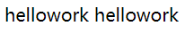

[Toc]

# SPAN间距问题

- **问题描述**

> 如：下代码，俩个span之间没有设置任何margin或者padding，但显示的时候却产生了间距
>
> ```
> <span>hellowork</span>
> <span>hellowork</span>
> ```
>
> 
>
> 

- **原因**

> 多个空格或者回车浏览器都会解析成空格，如：在span与span之间敲的回车，会被解析成了空格。

- **解决方案**

**方案**1：代码中不要写空格

```
<span>hellowork</span><span>hellowork</span>
这种写法可以解决问题，但是代码很不美观整洁。
```

**方案**2：通过css去消除间距:用margin/word-spacing/letter-spacing等

```
<span>hellowork</span>
<span style="margin-left:-6px;">22</span>
缺陷：不是很通用，有可能会因为浏览器的不同而导致设置的边距产生不良的显示
```

**方案**3：通过设置font-size消除间距:既然空格占了位置，那么我们把font-size设置为0，空格就不会占位置了,同时再单独设置子元素的字体大小，就能干掉这个间隙了。

```
<div  style="font-size:0px;">
	<span  style="font-size:14px;">hellowork</span>
	<span  style="font-size:14px;">hellowork</span>
</div>

这个设置可以解决span与前一个元素的间距问题
```


# 定位

## position 

> - 脱离文档流的元素：fixed  absolute
> - 未脱离文档流对象：static   relative

```
position 属性指定了元素的定位类型。

position 属性的五个值：
- static
- relative
- fixed
- absolute
- sticky
元素可以使用的顶部，底部，左侧和右侧属性定位。然而，这些属性无法工作，除非是先设定position属性。他们也有不同的工作方式，这取决于定位方法。
```

### static 

> HTML 元素的默认值，即没有定位，遵循正常的文档流对象。静态定位的元素不会受到 top, bottom, left, right影响。

```
div.static {
    position: static;
    border: 3px solid #73AD21;
}
```

### fixed 

> 元素的位置相对于浏览器窗口是固定位置。即使窗口是滚动的它也不会移动

```
p.pos_fixed
{
    position:fixed;
    top:30px;
    right:5px;
}
注意： Fixed 定位在 IE7 和 IE8 下需要描述 !DOCTYPE 才能支持。
Fixed定位使元素的位置与文档流无关，因此不占据空间。
Fixed定位的元素和其他元素重叠。
```

### relative 

> 相对定位元素的定位是相对其正常位置。以原始位置为标识，可以通过属性设置，如left：20px，相对原始位置元素整体向左偏移20px
> **不会脱离文档流**，类似于`static`，按顺序排列，一般设置也不会有什么变化，可以通过margin-top/right/bottom/left来改变框的位置。

```
h2.pos_left
{
    position:relative;
    left:-20px;
}
h2.pos_right
{
    position:relative;
    left:20px;
}
移动相对定位元素，但它原本所占的空间不会改变。
```

### absolute 

> 绝对定位的元素的位置相对于最近的已定位父元素，如果元素没有已定位的父元素，那么它的位置相对于<html>:

```
h2
{
    position:absolute;
    left:100px;
    top:150px;
}
absolute 定位使元素的位置与文档流无关，因此不占据空间。
absolute 定位的元素和其他元素重叠。
```

### sticky

> sticky 英文字面意思是粘，粘贴，所以可以把它称之为粘性定位。
>
> **position: sticky;** 基于用户的滚动位置来定位。
>
> 粘性定位的元素是依赖于用户的滚动，在 **position:relative** 与 **position:fixed** 定位之间切换。
>
> 它的行为就像 **position:relative;** 而当页面滚动超出目标区域时，它的表现就像 **position:fixed;**，它会固定在目标位置。
>
> 元素定位表现为在跨越特定阈值前为相对定位，之后为固定定位。
>
> 这个特定阈值指的是 top, right, bottom 或 left 之一，换言之，指定 top, right, bottom 或 left 四个阈值其中之一，才可使粘性定位生效。否则其行为与相对定位相同。
>
> **注意:** Internet Explorer, Edge 15 及更早 IE 版本不支持 sticky 定位。 Safari 需要使用 -webkit- prefix (查看以下实例)。

```
div.sticky {
    position: -webkit-sticky; /* Safari */
    position: sticky;
    top: 0;
    background-color: green;
    border: 2px solid #4CAF50;
}
```

## 重叠的元素

> 元素的定位与文档流无关，所以它们可以覆盖页面上的其它元素
>
> z-index属性指定了一个元素的堆叠顺序（哪个元素应该放在前面，或后面）
>
> 一个元素可以有正数或负数的堆叠顺序：

```
img
{
    position:absolute;
    left:0px;
    top:0px;
    z-index:-1;
}
具有更高堆叠顺序的元素总是在较低的堆叠顺序元素的前面。
注意： 如果两个定位元素重叠，没有指定z - index，最后定位在HTML代码中的元素将被显示在最前面。
```

## 所有的CSS定位属性

"CSS" 列中的数字表示哪个CSS(CSS1 或者CSS2)版本定义了该属性。

| 属性                                                         | 说明                                                         | 值                                                           | CSS  |
| :----------------------------------------------------------- | :----------------------------------------------------------- | :----------------------------------------------------------- | :--- |
| [bottom](https://www.runoob.com/cssref/pr-pos-bottom.html)   | 定义了定位元素下外边距边界与其包含块下边界之间的偏移。       | auto <br />length <br />% <br />inherit                      | 2    |
| [clip](https://www.runoob.com/cssref/pr-pos-clip.html)       | 剪辑一个绝对定位的元素                                       | shape <br />auto<br /> inherit                               | 2    |
| [cursor](https://www.runoob.com/cssref/pr-class-cursor.html) | 显示光标移动到指定的类型                                     | *url*<br /> auto <br />crosshair <br />default <br />pointer <br />move <br/>e-resize<br /> ne-resize <br />nw-resize n-resize <br/>se-resize<br /> sw-resize<br /> s-resize <br />w-resize <br />text <br />wait <br />help | 2    |
| [left](https://www.runoob.com/cssref/pr-pos-left.html)       | 定义了定位元素左外边距边界与其包含块左边界之间的偏移。       | auto <br />length <br />% <br />inherit                      | 2    |
| [overflow](https://www.runoob.com/cssref/pr-pos-overflow.html) | 设置当元素的内容溢出其区域时发生的事情。                     | auto<br /> hidden<br /> scroll<br /> visible <br />inherit   | 2    |
| [overflow-y](https://www.runoob.com/css/cssref/css3-pr-overflow-y.html) | 指定如何处理顶部/底部边缘的内容溢出元素的内容区域            | auto<br /> hidden <br />scroll <br />visible <br />no-display <br />no-content | 2    |
| [overflow-x](https://www.runoob.com/css/cssref//cssref/css3-pr-overflow-x.html) | 指定如何处理右边/左边边缘的内容溢出元素的内容区域            | auto<br /> hidden<br /> scroll <br />visible <br />no-display<br /> no-content | 2    |
| [position](https://www.runoob.com/cssref/pr-class-position.html) | 指定元素的定位类型                                           | absolute<br /> fixed <br />relative <br />static<br /> inherit | 2    |
| [right](https://www.runoob.com/cssref/pr-pos-right.html)     | 定义了定位元素右外边距边界与其包含块右边界之间的偏移。       | auto <br />length <br />% <br />inherit                      | 2    |
| [top](https://www.runoob.com/cssref/pr-pos-top.html)         | 定义了一个定位元素的上外边距边界与其包含块上边界之间的偏移。 | auto <br />length<br /> % <br />inherit                      | 2    |
| [z-index](https://www.runoob.com/cssref/pr-pos-z-index.html) | 设置元素的堆叠顺序                                           | number <br />auto<br /> inherit                              | 2    |

# ul>li

## 不显示序列号或序列符号

```
### 在ul 或 li标签添加如下标签
list-style: none; 
或
list-style-type: none; 

list-style-type 其他样式
- none	不使用项目符号    
- disc	实心圆，默认值    
- circle	空心圆    
- square	实心方块    
- decimal	阿拉伯数字    
- lower-roman	小写罗马数字    
- upper-roman	大写罗马数字    
- lower-alpha	小写英文字母    
- upper-alpha	大写英文字母
```

# 概念

## 文档流&文本流

> 原文是"normal flow"，也有人叫普通流、正常流，指语言文本从左到右，从上到下显示，这是传统HTML文档的文本布局。
>
> 浮动(float)、绝对定位(absolute)、固定定位(fixed)三种方式定位会脱离文档流。
>
> 文档流是相对于盒子模型讲的
> 文本流是相对于文字段落讲的
>
> 元素浮动之后，会让它跳出文档流，也就是说当它后面还有元素时，其他元素会无视它所占据了的区域，直接在它身下布局。但是文字却会认同浮动元素所占据的区域，围绕它布局，也就是没有拖出文本流。
>
> 但是绝对定位后，不仅元素盒子会拖出文档流，文字也会出文本流。那么后面元素的文本就不会在认同它的区域位置，会直接在它后面布局，不会在环绕。
>
> 当然你可以使用 index-z 来让底部的元素到上面来，类似于一个图层的概念
>
> [CSS2英文说明文档](https://www.w3.org/TR/CSS21/visuren.html#)

# 字符

## 转换元素文本 text-transform

```
h1 {text-transform:uppercase;}  定义仅有大写字母。
h2 {text-transform:capitalize;}  文本中的每个单词以大写字母开头。
p {text-transform:lowercase;}  定义无大写字母，仅有小写字母。


none	默认。定义带有小写字母和大写字母的标准的文本。
inherit	规定应该从父元素继承 text-transform 属性的值。
```

## 空格符

```
&nbsp; 半角的不断行的空白格（推荐使用）
&ensp; 半角的空格
&emsp; 全角的空格
```

# 元素内空白处理

> `white-space` 属性设置如何处理元素内的空白

| 值       | 描述                                                         |
| :------- | :----------------------------------------------------------- |
| normal   | 默认。空白会被浏览器忽略。                                   |
| pre      | 空白会被浏览器保留。其行为方式类似 HTML 中的 <pre> 标签。    |
| nowrap   | 文本不会换行，文本会在在同一行上继续，直到遇到 <br> 标签为止。 |
| pre-wrap | 保留空白符序列，但是正常地进行换行。                         |
| pre-line | 合并空白符序列，但是保留换行符。                             |
| inherit  | 规定应该从父元素继承 white-space 属性的值。                  |

- **范例：规定段落不进行换行**

```
p
  {
  white-space: nowrap;
  }
```

# 运算

## `calc()`

> `calc()`可使用`+,-,*,/`运算

- **3栏等宽布局**

```
.box{
    margin-left:20px;
    width:calc(100%/3 - 20px);
}
```

- **使用范例**

```
width: calc(10px + 100px);
width: calc(100% - 30px);
width: calc(2em * 5);
width: calc(var(--variable-width) + 20px);
```

# 禁用事件

> `pointer-events `更像是JavaScript，它能够：
>
> - 阻止用户的点击动作产生任何效果
> - 阻止缺省鼠标指针的显示
> - 阻止CSS里的 `hover `和 `active `状态的变化触发事件
> - 阻止JavaScript点击动作触发的事件

```
a {
  pointer-events:none
}
```


# 参考资料

1. https://www.runoob.com/css/css-positioning.html
2. https://www.zhihu.com/question/21911352
3. https://developer.mozilla.org/en-US/docs/Web/CSS/calc