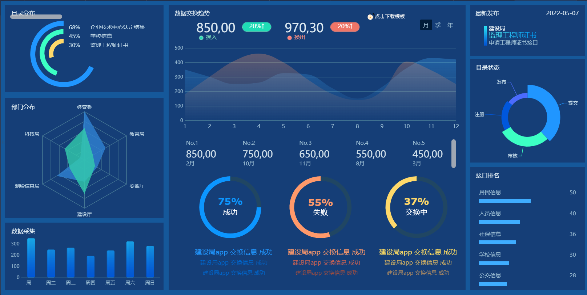
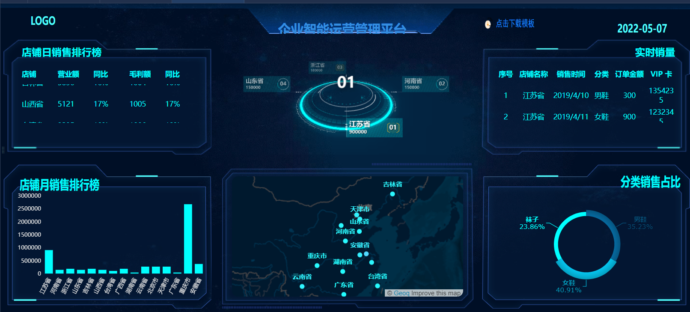

[Toc]

# 1

## 设置颜色

- `rgb(21,88,154);`

-  `#3d4d66` 

- `#153e77` 

- `#2096ff` 
- `#3cffc4`

- `#ffd96a` 
- `#b1cadc` 
- `#2a74c0`
- `#30bab0`
- `#0c96ff`
- `#ff996a`
- `#0459d2` 
- `#d1dfea`

# 2

- `#00ffff` 
- `#051430`
- `#065f90`