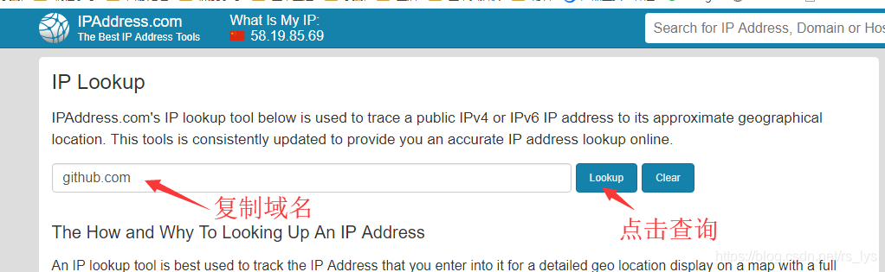
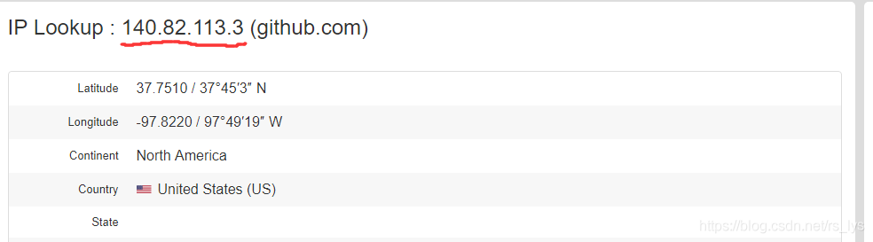
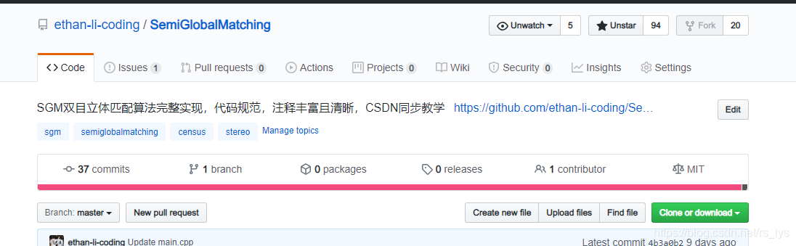
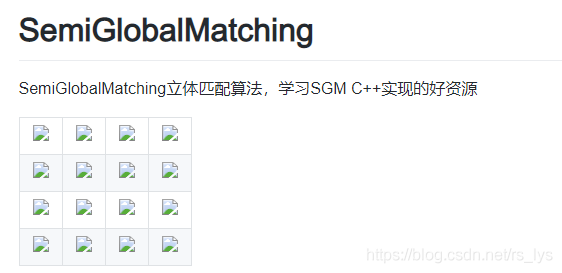
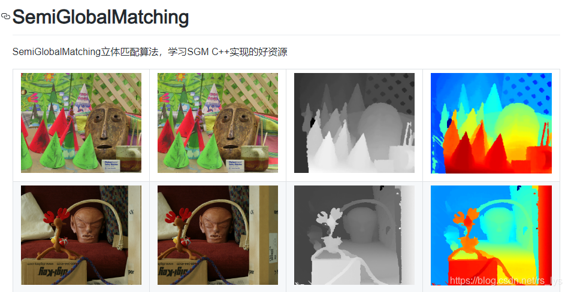

[toc]

# Github无法访问及不显示图片问题

## 1. Github无法访问的解决方式

**问题描述：** 站点无法访问，有图为证：


**解决办法：** 修改本机（windows操作系统）hosts文件

**步骤：**

1. 打开hosts目录：`C:\Windows\System32\drivers\etc`

2. 复制hosts文件到桌面，打开，在最下面添加下列信息：

   ```
   #github
   140.82.113.4 github.com
   199.232.69.194 github.global.ssl.fastly.net
   ```

3. 使用修改后的hosts文件覆盖原文件

**注意：** 域名github.com和github.global.ssl.fastly.net对应的 ip 会因机器不同而不相同（就是第2步的两个ip），使用该站点查询对应域名的ip：https://www.ipaddress.com/ip-lookup。并用查询的结果替换。

**ip查询方式：**

1. 打开网址：https://www.ipaddress.com/ip-lookup
2. 在编辑框内键入域名，并点击查询按钮查询IP地址。





1. 查询后的两个ip地址替换掉之前的ip地址。
2. 修改完，验证成果：




## 2. Github无法显示图片的解决方式

还有一种常见的情况是，Github无法显示图片，有图为证：



**解决方案：**

1. 修改hosts

   `C:\Windows\System32\drivers\etc\hosts`

2. 在文件末尾添加：

   ```
   \#GitHub Start
   140.82.113.4 github.com
   199.232.69.194 github.global.ssl.fastly.net
   192.30.253.119 gist.github.com
   
   151.101.184.133 assets-cdn.github.com
   151.101.184.133 raw.githubusercontent.com
   151.101.184.133 gist.githubusercontent.com
   151.101.184.133 cloud.githubusercontent.com
   151.101.184.133 camo.githubusercontent.com
   151.101.184.133 avatars0.githubusercontent.com
   151.101.184.133 avatars1.githubusercontent.com
   151.101.184.133 avatars2.githubusercontent.com
   151.101.184.133 avatars3.githubusercontent.com
   151.101.184.133 avatars4.githubusercontent.com
   151.101.184.133 avatars5.githubusercontent.com
   151.101.184.133 avatars6.githubusercontent.com
   151.101.184.133 avatars7.githubusercontent.com
   151.101.184.133 avatars8.githubusercontent.com
   \#GitHub End
   ```
   
3. 修改后完，验证结果：




# 参考来源

1. https://blog.csdn.net/rs_lys/article/details/106870924