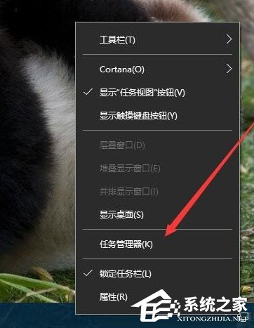
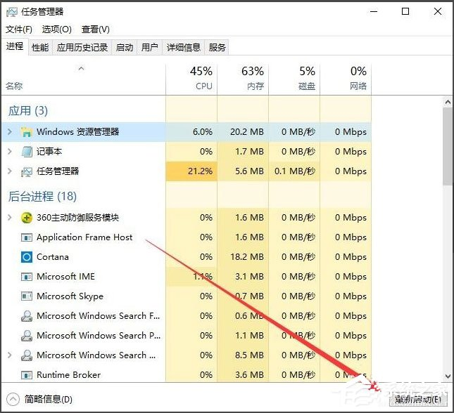
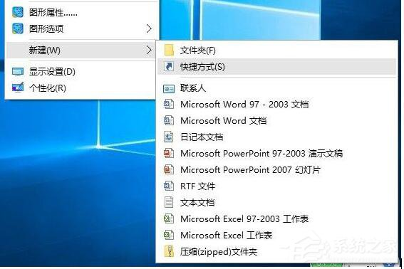
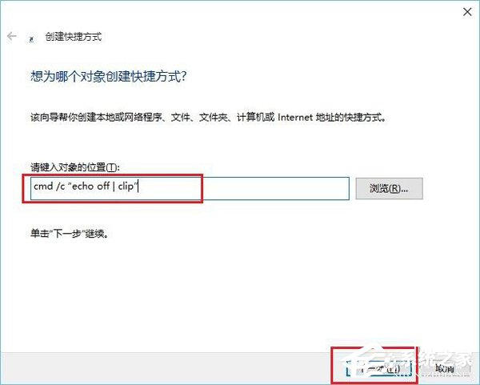
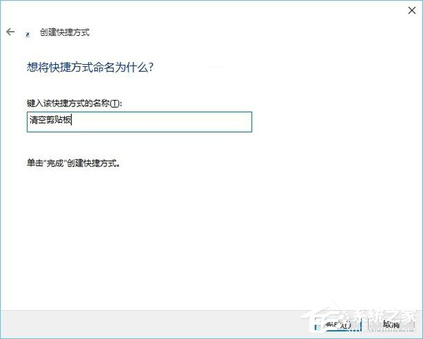

[toc]

# 清空剪切板

- **情景描述：**

> win10在使用过程中，如果多次操作了复制/剪切导致剪切板爆满，无法再使用粘贴功能

## 方案1

> 1. 右键点击[任务栏](http://www.xitongzhijia.net/zt/rwlsz/)空白处，在弹出菜单中选择“[任务管理器](http://www.xitongzhijia.net/zt/59015.html)”菜单项；
>
> 

> 2. 在打开的任务管理器窗口中，找到并选中Windows资源管理器进程，然后点击右下角的“重新启动”按钮，这样一会资源管理器就会自动重新启动，剪贴板也会自动清空了；
>
> 

## 方案2

> 1. 通过上面的方法虽然方便一些，但是在重启资源管理器的时候，你刚才打开的文件就会被关闭。其实我们可以自己建立一个清空剪贴板的快捷方式，在Win10系统桌面空白处，点击右键，在弹出菜单中依次选择“新建/快捷方式”菜单项；
>
> 

> 2. 接着在弹出的窗口中输入命令行：`cmd /c "echo off | clip"`，输入完成后，点击下一步按钮；
>
> 

> 3. 在这里给快捷方式起一个名字，比如：清空剪贴板；
>
> 
>
> 这时在桌面上就看到了清空剪贴板的图标了，双击后就会自动清空你系统的剪贴板了

