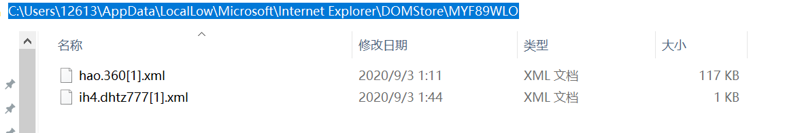

[toc]

### 问题描述

> 因装入了一个流氓软件，导致浏览器主页被篡改，浏览器一打开便显示`https://www.hao123.com/?tn=48020221_23_hao_pg`   改类似网址。

### 探索

探索1：删除浏览器，并重装浏览器

结果：没有起作用；

探索2：查看浏览器属性，【快捷方式】目标目录后未发现异常网址；

探索3：删除相关注册目录，文件，依旧未能解决。

探索4：使用了【电脑管家】的浏览器锁定，杀毒等操作，结果：问题未能解决。

探索5：使用【360软件】的主页修复和查毒以及系统急救，结果：问题未解决

**猜测：**

应该是被篡改了系统中的浏览器的某个文件，导致异常，问题是怎么找到这个文件。

**发现异常文件如下：**

1. 浏览打开时，先是进入网址`http://ih4.dhtz777.top/` 然后再被重转至``https://www.hao123.com/?tn=48020221_23_hao_pg``

2. 使用`dhtz777`搜索C盘，发现文件：第一个文件是历史记录文件，第二个文件作用<u>**未知**</u>

   

3. 使用`dhtz777`搜索注册表，发现如下异常目录：

   `HKEY_CURRENT_USER\Software\Microsoft\Internet Explorer\LowRegistry\DOMStorage`

   `HKEY_USERS\S-1-5-21-746320827-3790003482-1907059721-1001\Software\Microsoft\Internet Explorer\LowRegistry\DOMStorage`

   

​        但删除注册表中改异常目录，依旧未能解决问题。

​       4. 发现文件如：

​           该文件无法被删除，文件内容：

    <root>
        <item name="Hm_lvt_b95963ac0e80a5e48cf03128493d7669" 		value="1630602697180|1599064014,1599064067,1599064334,1599066697" ltime="500284080" htime="30835020" />
    </root>

4. 在隐藏目录下潜藏的文件：

   

### 解决方案

1. 请依次定位到注册表项：**HKEY_CURRENT_USER\Software\Policies\Microsoft**
   展开**Microsoft**，查看其下是否包含子项 **Internet Explorer**? 若有，请删除（右击**Internet Explorer**，选择“**删除**”）。

2. 类似地，请依次定位到以下3个注册表项。单击**Main**，查看右边细节窗口中**[Default_Page_URL]**值和**[Start Page]**值是否有异常。如果被修改了，请根据自己的需要改回（右击键值，选择“**修改**”进行更改）。

- **HKEY_CURRENT_USER\SOFTWARE\Microsoft\Internet Explorer\Main**
- **HKEY_ LOCAL_MACHINE\SOFTWARE\Microsoft\Internet Explorer\Main**
- **HKEY_USERS\Default\Software\Microsoft\Internet Explorer\Main**

3. 删除注册表中所有包含`dhtz777`,`hao`等不明网站信息

   修改完成后需**重启计算机**以使更改生效。

4. 使用杀毒软件锁定浏览器，以及杀毒处理

5. 删除包含`dhtz777`,`hao`等文件以及文件夹

   

   **总结：**
   
   > 以上措施到底哪个生效了，不是很清楚，反正重启后浏览器正常了！推测应该是注册表的相关操作起了很大作用，因为是重启后生效的。至于其他操作，应该也有一定的作用，具体如何，可能在碰到同样场景的时候会找到答案。
   >
   > 心得：
   >
   > 1. 浏览器被篡改，在排查浏览器属性问题，以及使用杀毒软件进行处理后，若未解决，那么应该是注册表的问题；
   > 2. 注册表是可以导出的，可以直接导出，然后用记事本打开导出的`.reg`文件，然后进行异常项目搜索；
   > 3. 有些注册文件是隐藏的，需要全局搜索才能在磁盘中显示出来；
   > 4. **在操作注册表后，一定要记得重启计算机，否则看不到结果！**
   
   

