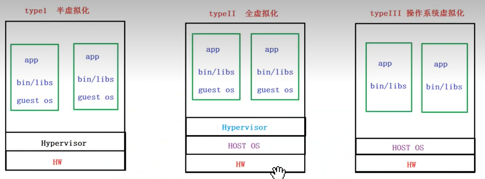
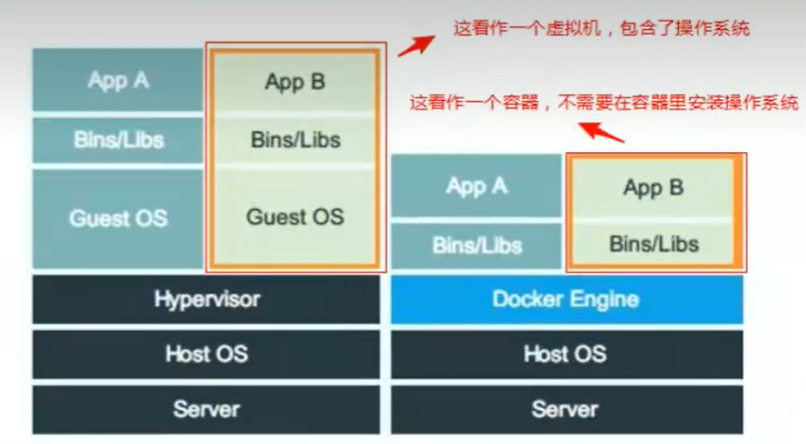
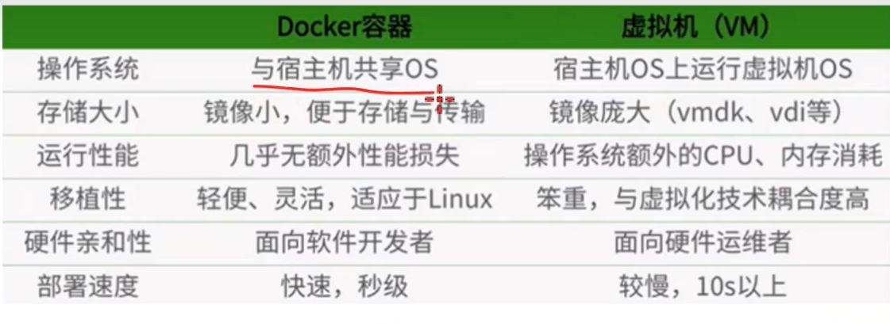
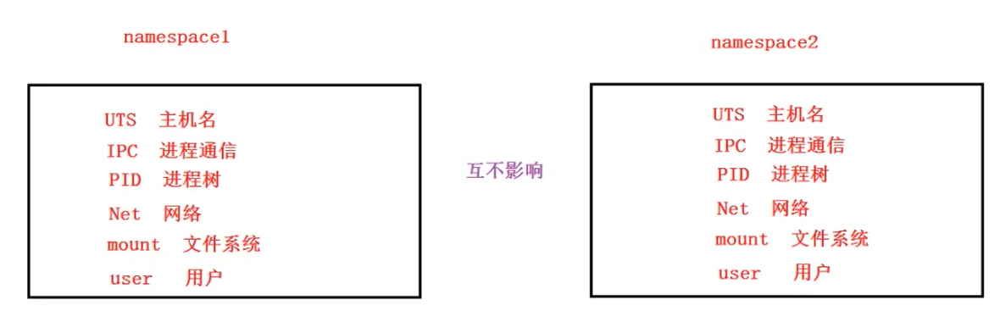
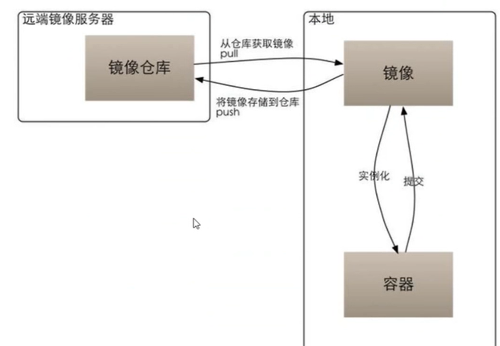
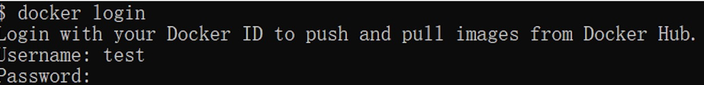
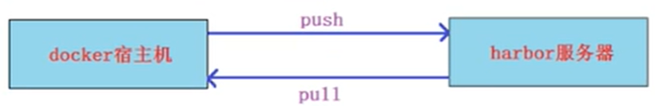

[Toc]

# 容器

> 容器是一种轻量级，进程级的虚拟化技术，属于type3型虚拟化，属于Paas

- **发展历程**

> 大型机-小型机-PC服务器-虚拟化-云计算-容器

- **虚拟分类**



- **特点**

> 1. 轻量：只打包了需要的bins/libs(也就是命令和库文件)。与宿主机共享操作系统，直接使用宿主机的内核；
> 2. 部署快：容器的镜像相对虚拟机的镜像小。部署速度非常快，秒级部署；
> 3. 移植性好：Build once,Run anywhere(一次构建，随处部署运行)；
> 4. 资源利用率更高：相对于虚拟机，不需要安装操作系统，所以几乎没有额外的CPU，内存消耗





# Docker介绍

- [官网地址](https://www.docker.com/)

> 2017-03-01之后，Docker版本命名开始发生变化，同时将CE版本和EE版本进行分开。
>
> - **Docker社区版(CE)**:为了开发人员或小团队创建基于容器的应用，与团队成员分享和自动化的开发管道。docker-ce提供了简单的安装和快速的安装，以便可以立即开始开发。
> 如：17-03-ce
> - **Docker企业版(EE)**:专为企业的发展和IT团队建立。docker-ee为企业提供最安全的容器平台，以应用为中心的平台

# Docker用到的Linux内核技术

> Docker容器本质上是宿主机的进程。可以把docker容器内部跑的进程看作是宿主机的线程；
>
> - Docker通过`namespace`实现了资源隔离；
> - 通过`cgroups`实现了资源限制
> - LXC:docker在LXC基础上发展的

## NameSpace

> Linux内核实现`namespace`的一个主要目的就是实现轻量级虚拟化(容器)服务。在同一个`namespace`下的进程可以感知彼此的变化，而对外界的进程一无所知。内核里实现资源隔离
> 
>
> 
>
> 不同命名空间里的应用名称可以相同，当俩个不同命名空间不进行通信时，相同的应用名称没有什么影响，当俩个命名空间需要进行通信时，最好以相同应用不同名称来进行区分
> 

## Control Groups

> 控制组(CGroups)是Linux内核的一个特性，主要用来对共享资源进行**隔离、限制、审计**等。只有能控制分配到容器的资源，才能避免多个容器同时运行时对宿主机系统资源的竞争。控制组可以提供对容器的内存、CPU、磁盘IO等资源进行限制和计费管理

## LXC&Docker区别

> LXC为Linux Container的简写。可以提供轻量级的虚拟化。Docker的底层就是使用了LXC来实现。Docker以LXC为基础，实现了更多更强的功能

# Docker环境准备

> 建议直接在宿主机上跑docker(当然也可以在虚拟机里跑docker);
> 不能直接在windows上跑docker,(因为namaspace,cgroup是linux内核的特性)windows没有，所以需要在windows跑linux虚拟机，再跑docker.
> 1. 要求能访问公网；
> 2. 关闭防火墙，selinux

# Docker软件安装

## 1. docker-ce的yum源下载(任选其一)

> 1. 官方源： https://download.docker.com/linux/centos/docker-ce.repo
> 2. 阿里云源：http://mirrors.aliyun.com/docker-ce/linux/centos/docker-ce.repo
> 3. 清华大学源： https://mirrors.tuna.tsinghua.edu.cn/docker-ce/linux/centos/docker-ce.repo

```
### 官方源下载
wget  https://download.docker.com/linux/centos/docker-ce.repo -O /etc/yum.repos.d/docker-ce.repo

### 阿里云下载
wget http://mirrors.aliyun.com/docker-ce/linux/centos/docker-ce.repo  -O /etc/yum.repos.d/docker-ce.repo
```

## 2. docker安装

```
### 清除yum缓存：
yum 会把下载的软件包和header存储在cache中，而不自动删除。如果觉得占用磁盘空间，可以使用yum clean指令进行清除，更精确 的用法是yum clean headers清除header，yum clean packages清除下载的rpm包，yum clean all一全部清除。

[root@localhost yum.repos.d]# yum clean all

### 安装docker-ce
[root@localhost yum.repos.d]# yum install docker-ce

注意：要安装docker-ce版，不要安装docker(否则可能安装1.13老版本)
```

## 3. 启动docker服务

```
### 启动docker服务
[root@localhost ~]# systemctl start docker
或者
[root@localhost ~]# systemctl restart docker
### 设置docker服务开机启动
[root@localhost ~]# systemctl enable docker
### 查看docker状态
[root@localhost ~]# systemctl status docker
```

## 4. 查看版本信息

```
[root@localhost /]# docker -v
Docker version 20.10.17, build 100c701

[root@localhost /]# docker info

### docker分为俩部分组成：客户端和服务端；由下信息可知，目前docker客户端和服务都在一台机器上
[root@localhost /]#  docker version
Client: Docker Engine - Community
 Version:           20.10.17
 API version:       1.41
 Go version:        go1.17.11
 Git commit:        100c701
 Built:             Mon Jun  6 23:05:12 2022
 OS/Arch:           linux/amd64
 Context:           default
 Experimental:      true

Server: Docker Engine - Community
 Engine:
  Version:          20.10.17
  API version:      1.41 (minimum version 1.12)
  Go version:       go1.17.11
  Git commit:       a89b842
  Built:            Mon Jun  6 23:03:33 2022
  OS/Arch:          linux/amd64
  Experimental:     false
 containerd:
  Version:          1.6.6
  GitCommit:        10c12954828e7c7c9b6e0ea9b0c02b01407d3ae1
 runc:
  Version:          1.1.2
  GitCommit:        v1.1.2-0-ga916309
 docker-init:
  Version:          0.19.0
  GitCommit:        de40ad0
```

## 5. docker daemon管理

>  docker engine分为client和server,默认都在本地。可以将client与server进行分离，实现远程doker连接。为了实现它，就需要对docker daemon进行相应的配置
>
> **注意**：客户端远程连接不需要加端口
> **特别注意**：远程客户端主机远程操作的权限非常大，请测试完后还原

```
### 远程客户主机：docker -H 容器宿主机IP version
[root@localhost /]# docker -H 91.11.111.111 version
Client: Docker Engine - Community
 Version:           20.10.17
 API version:       1.41
 Go version:        go1.17.11
 Git commit:        100c701
 Built:             Mon Jun  6 23:05:12 2022
 OS/Arch:           linux/amd64
 Context:           default
 Experimental:      true
 ### 当为启用daemon，会提示如下信息
Cannot connect to the Docker daemon at tcp://10.15.180.107:2375. Is the docker daemon running?
```

- **配置daemon**

> 1. 修改docker配置文件前，请先关闭docker守护进程；
>
>    ```
>    systemctl stop docker
>    ```
>
> 2. 通过`/etc/docker/daemon.json`文件对docker守护进程文件进行配置
>    docker daemon默认监听使用的是unix格式，监听文件：`UNIX///run/docker.sock`，添加`tcp://0.0.0.0:2375`可实现远程管理
>
> ```
> ### 如果创建了daemon.json文件，后续不想再使用该文件配置，但保留文件，删除文件内容时，需保留{};否则启动docker时会报错
> [root@localhost /]# vim /etc/docker/daemon.json
> {
> "hosts":["tcp://0.0.0.0:2375","unix:///var/run/docker.sock"]
> }
> ### 查看端口是否启用
> [root@localhost /]# netstat -ntlup | grep :2375
> [root@localhost /]# ls /var/run/docker.sock
> ```
>
> 3. 添加`/etc/docker/daemon.json`后会导致docker daemon无法启动，请先修改如下文件内容
>
> ```
> [root@localhost /]# vim /usr/lib/systemd/system/docker.service
> ### 修改前
> # exists and systemd currently does not support the cgroup feature set required
> # for containers run by docker
> ExecStart=/usr/bin/dockerd -H fd:// --containerd=/run/containerd/containerd.sock
> 
> ### 修改后
> # exists and systemd currently does not support the cgroup feature set required
> # for containers run by docker
> ExecStart=/usr/bin/dockerd
> ```
>
> 4. 修改后，重新加载配置文件：
>    **备注**：修改docker配置文件后，都需重新加载配置文件
>
> ```
> [root@localhost docker]# systemctl daemon-reload
> ```
>
> 5. 重启docker
>
> ```
> [root@localhost /]# systemctl start docker
> [root@localhost /]# netstat -ntlup |grep 2375
> tcp6       0      0 :::2375                 :::*                    LISTEN      3086/dockerd 
> ```
>
> 6. 测试从另一台机器远程访问docker是否成功
>
> ```
> [root@hf-ssjzxwj-08 ~]# docker -H 91.11.111.111 version
> [root@hf-ssjzxwj-08 ~]# docker -H 91.11.111.111 images
> ```

## 6. 查看docker所有操作说明

```
### 查看docker所有操作说明
[root@localhost ~]# docker --help

### 查看指定docker操作参数
[root@localhost ~]# man docker-images  //查看docker images 命令参数说明
```


# 镜像、容器、仓库

> - 镜像(image):镜像就是打包好的环境&应用；
> - 容器(container):容器就是运行镜像的实例。镜像看作是静态的，容器是动态的。一个镜像可以生成多个容器。
> - 仓库(repository):存放多个镜像的一个仓库。仓库可以是本地的，也可以是远程的

- **docker结构**：DOCKER HOST :docker宿主机


- **远程镜像仓库**




# 镜像常见操作

> 镜像主要分为俩类：
> 1. 操作系统类(如centos,ubuntu);
> 2. 应用程序类

## 查看镜像列表

> 列出本地主机上的镜像。

```
runoob@runoob:~$ docker images           
REPOSITORY          TAG                 IMAGE ID            CREATED             SIZE
ubuntu              14.04               90d5884b1ee0        5 days ago          188 MB
php                 5.6                 f40e9e0f10c8        9 days ago          444.8 MB

各个选项说明:

- **REPOSITORY：**  表示镜像的仓库源
- **TAG：**  镜像的标签
- **IMAGE ID：**  镜像ID
- **CREATED：**  镜像创建时间
- **SIZE：**  镜像大小
同一仓库源可以有多个 TAG，代表这个仓库源的不同个版本，如 ubuntu 仓库源里，有 15.10、14.04 等多个不同的版本，我们使用 REPOSITORY:TAG 来定义不同的镜像。
```

> 所以，我们如果要使用版本为15.10的ubuntu系统镜像来运行容器时，命令如下：
>
> ```
> runoob@runoob:~$ docker run -t -i ubuntu:15.10 /bin/bash 
> 
> 参数说明：
> - **-i**: 交互式操作。
> - **-t**: 终端。
> - **ubuntu:15.10**: 这是指用 ubuntu 15.10 版本镜像为基础来启动容器。
> - **/bin/bash**：放在镜像名后的是命令，这里我们希望有个交互式 Shell，因此用的是 /bin/bash。
> ```
>
> 如果要使用版本为 14.04 的 ubuntu 系统镜像来运行容器时，命令如下：
>
> ```
> runoob@runoob:~$ docker run -t -i ubuntu:14.04 /bin/bash 
> root@39e968165990:/# 
> ```
>
> 如果你不指定一个镜像的版本标签，例如你只使用 ubuntu，docker 将默认使用 ubuntu:latest 镜像。

## 搜索可用镜像

> - 可以从 Docker Hub 网站来搜索镜像，Docker Hub 网址为： **https://hub.docker.com/**
> - 使用 `docker search` 命令来搜索远程镜像

```
### 搜索官网/非官方可用镜像
[root@localhost docker]# docker search centos
NAME         DESCRIPTION                                       STARS     OFFICIAL【是否为官方】   AUTOMATED
centos       The official build of CentOS.                     7240      [OK]        
kasmweb/centos-7-desktop  CentOS 7 desktop for Kasm Workspaces  21    

NAME: 镜像仓库源的名称
DESCRIPTION: 镜像的描述
OFFICIAL: 是否 docker 官方发布
stars: 类似 Github 里面的 star，表示点赞、喜欢的意思。
AUTOMATED: 自动构建。
```

## 获取一个新的镜像

- **如果镜像pull非常慢，怎么解决？**

> 1. docker镜像加速器；
> 2. 可以从网路好的宿主机上pull下来，然后导出给网速慢的宿主机导入

```
### 获取指定版本镜像
Crunoob@runoob:~$ docker pull ubuntu:13.10
### 获取最新版本镜像
Crunoob@runoob:~$ docker pull ubuntu
### 
docker pull docker.io/centos  名称为search查找得到的全名
### 若网速慢，可以试试阿里，腾讯，百度，网易等国内的镜像仓库；如：
docker pull hub.c.163.com/library/centos:latest
```

## 镜像加速器

> 国内从 DockerHub 拉取镜像有时会遇到困难，此时可以配置镜像加速器。Docker 官方和国内很多云服务商都提供了国内加速器服务，例如：
>
> - 科大镜像：**https://docker.mirrors.ustc.edu.cn/**
> - 网易：**https://hub-mirror.c.163.com/**
> - 阿里云：**https://<你的ID>.mirror.aliyuncs.com**
> - 七牛云加速器：**https://reg-mirror.qiniu.com**
>
> 当配置某一个加速器地址之后，若发现拉取不到镜像，请切换到另一个加速器地址。国内各大云服务商均提供了 Docker 镜像加速服务，建议根据运行 Docker 的云平台选择对应的镜像加速服务。
>
> 阿里云镜像获取地址：https://cr.console.aliyun.com/cn-hangzhou/instances/mirrors，登陆后，左侧菜单选中镜像加速器就可以看到你的专属地址
>
> - **在docker中使用镜像加速器**
>
> ```
> ###对于使用 systemd 的系统，请在 /etc/docker/daemon.json 中写入如下内容（如果文件不存在请新建该文件）：
> {"registry-mirrors":["https://reg-mirror.qiniu.com/"]}
> ### 之后重启服务
> $ sudo systemctl daemon-reload
> $ sudo systemctl restart docker
> ```

## 导出&导入镜像

- 范例：导出hello-world镜像到`/data/hello-world`

```
### 1.查看镜像
[root@localhost /]# docker images
REPOSITORY    TAG       IMAGE ID       CREATED        SIZE
hello-world   latest    feb5d9fea6a5   9 months ago   13.3kB
### 2.导出hello-world镜像到/data/，镜像名称为：hello-world
[root@localhost /]# docker save hello-world:latest -o /data/hello-world
### 3.导入【2】中导出的hello-world镜像
1）删除历史已导入镜像
[root@localhost data]# docker images
REPOSITORY    TAG       IMAGE ID       CREATED        SIZE
hello-world   latest    feb5d9fea6a5   9 months ago   13.3kB

[root@localhost data]# docker rmi hello-world
Untagged: hello-world:latest
Untagged: hello-world@sha256:53f1bbee2f52c39e41682ee1d388285290c5c8a76cc92b42687eecf38e0af3f0
Deleted: sha256:feb5d9fea6a5e9606aa995e879d862b825965ba48de054caab5ef356dc6b3412
Deleted: sha256:e07ee1baac5fae6a26f30cabfe54a36d3402f96afda318fe0a96cec4ca393359
2）监测镜像是否已删除
[root@localhost data]# docker images
REPOSITORY   TAG       IMAGE ID       CREATED       SIZE
java         latest    d23bdf5b1b1b   5 years ago   643MB
3）导入【2】中导出的hello-world镜像
[root@localhost data]# docker load < /data/hello-world
e07ee1baac5f: Loading layer [==================================================>]  14.85kB/14.85kB
Loaded image: hello-world:latest
4）检验导入是否成功
[root@localhost data]# docker images
REPOSITORY    TAG       IMAGE ID       CREATED        SIZE
hello-world   latest    feb5d9fea6a5   9 months ago   13.3kB
```

## 删除镜像

- **删除单个镜像**

```
### docker rmi 镜像名/镜像ID
$ docker rmi hello-world
```

- **批量删除所有镜像**

```
### docker images -qa 获取所有镜像ID
$ docker rmi $(docker images -qa)
```


## 查看镜像其他操作说明

```
### 方式1
[root@localhost data]# docker images --help
### 方式2
[root@localhost data]# man docker-images
[root@localhost data]# man docker-search
```

## 标记镜像

> 创建一个指向源镜像的标记,主要用于推送到仓库操作；(Joy:有点类似快捷链接)

```
 ### 语法
 docker tag SOURCE_IMAGE[:TAG] TARGET_IMAGE[:TAG]
 docker tag 源镜像  目标镜像
### 范例
[root@localhost data]# docker images
REPOSITORY    TAG       IMAGE ID       CREATED        SIZE
hello-world   latest    feb5d9fea6a5   9 months ago   13.3kB
java          latest    d23bdf5b1b1b   5 years ago    643MB
[root@localhost data]# docker tag hello-world hello
[root@localhost data]# docker images
REPOSITORY    TAG       IMAGE ID       CREATED        SIZE
hello-world   latest    feb5d9fea6a5   9 months ago   13.3kB
hello         latest    feb5d9fea6a5   9 months ago   13.3kB

```

# 镜像仓库

> 镜像仓库有俩种：
>
> 1. 公网镜像仓库：如官方自建镜像仓库，阿里云镜像仓库；
> 2. 通过harbor搭建自己的企业级镜像仓库

## 1. 公网镜像仓库

### 官方自建镜像仓库

[docker官网镜像仓库Docker Hub](https://hub.docker.com)

> 1. **注册**
>
>    在 [https://hub.docker.com](https://hub.docker.com/) 免费注册一个 Docker 账号，创建一个仓库
>
> 2. **登录和退出**
>
>    登录需要输入用户名和密码，登录成功后，我们就可以从 docker hub 上拉取自己账号下的全部镜像。
>
>    ```
>    $ docker login
>    ```
>
>    
>
>    **退出**
>
>    退出 docker hub 可以使用以下命令：
>
>    ```
>    $ docker logout
>    ```
>
> 3. **拉取**
>
> ```
> ### 1. 查找官方镜像
> $ docker search ubuntu
> ### 2. 拉取镜像到本地
> $ docker pull ubuntu 
> ```
>
> 4. **推送镜像**
>
>    用户登录后，可以通过 docker push 命令将自己的镜像推送到 Docker Hub。
>
>    ```
>    ### 以下命令中的 username 请替换为你的 Docker 账号用户名。
>    ### 1. 先创建一个标记指向源镜像
>    $ docker tag ubuntu:18.04 username/ubuntu:18.04
>    $ docker image ls
>    
>    REPOSITORY      TAG        IMAGE ID            CREATED           ...  
>    ubuntu          18.04      275d79972a86        6 days ago        ...  
>    username/ubuntu 18.04      275d79972a86        6 days ago        ...  
>    ### 推送镜像到官网
>    $ docker push username/ubuntu:18.04
>    
>    $ docker search username/ubuntu
>    
>    NAME             DESCRIPTION       STARS         OFFICIAL    AUTOMATED
>    username/ubuntu
>    ```

### 阿里云镜像仓库

- [阿里云官方网址](https://cr.console.aliyun.com/)

> 1. 在阿里云平台创建个人镜像仓库
> 2. 在本地登录阿里云仓库，在从仓库拉取或推送和官网相似，具体参考阿里云官网说明

## 2. 自建仓库

> 通过harbor搭建自己的企业级镜像仓库
>
> - [harbor官网](https://goharbor.io/)
> - [Docker Compose官网](https://docs.docker.com/compose/)
> - [Docker Compose下载地址](https://docs.docker.com/compose/install/)

### harbor简介

> Harbo是VMWare公司开源了企业级Registry项目，可以帮助用户快速搭建一个企业级的Docker registry服务
> harbor由python语言开发，需要使用`docker-compose`工具进行启动
> - **需要的工具**
> 1. 使用epel源安装pip：pip为python包管理工具
> 2. 使用pip安装docker-compose

- **环境准备**:准备一台新虚拟机作为harbor服务机

> 

- **安装**


3. 安装harbor

# 容器常见操作

## 查看容器

```
### 查看所有在运行容器
[root@localhost /]# docker ps

### 查看所有容器，包括已停止运行的容器
[root@localhost /]# docker ps -a

### 查看最新启动的容器
[root@localhost /]# docker ps -l
```

## 启动容器

- **语法**

```
docker run [options] 镜像[:tag] 传递给容器启动执行的命令+参数  
如：
docker run [options] 镜像[:tag] /bin/bash
若不给定传递给容器启动执行的命令+参数  可能会存在俩种情况
1.启动的容器本身自带执行的命令&参数；那么不给定启动执行命令也会自动执行容器自带命令
2.容器可能会在启动后然后直接退出
```

> 通过hello-world镜像运行一个容器(没有定义容器名称，则为随机名称)
> - 当前docker-host（容器宿主机）如果有hello-world镜像，则直接使用；
> - 若没有相关镜像，则会去docker hub去下载(配置了镜像加速器的优先找加速器)
> - `docker run` 毎运行一次，产生一个新的容器；就算运行失败，也会产生一个容器
> - 容器名在docker里是唯一的

- **为什么容器运行完hello-world后就退出，而不是继续运行？**

  > 容器比喻为轻量级虚拟机，但容器实际上只是进程。运行完了当然就退出了，除非是类似服务那样的守护进程 

### 一次性启动容器

> 运行完后，容器就退出

```
### 不设参数运行容器
[root@localhost /]# docker run hello-world
[root@localhost /]# docker ps -a  //没有设置容器名会生成随机容器名，状态为Exited (0) 43 seconds ago
CONTAINER ID   IMAGE         COMMAND       CREATED          STATUS              PORTS     NAMES

e0c0196c963f  hello-world  "/hello"   44 seconds ago  Exited (0) 43 seconds ago       condescending_chatelet
### 通过运行容器，并通过运行的容器执行容器自带的命令
docker run centos echo haha   //运行centos容器，并使用echo命令，打印haha字符
docker run centos:latest echo haha //centos:latest  latest为tag，可省略，不设定tag默认为latest

### 设置死循环，保持容器处于运行状态
[root@localhost ~]# docker run centos /bin/bash -c 'while true; do echo haha;sleep 3; done'
haha
haha
haha
[root@localhost ~]# docker ps
CONTAINER ID   IMAGE     COMMAND                  CREATED          STATUS          PORTS     NAMES
b18a0d536d3e   centos    "/bin/bash -c 'while…"   28 seconds ago   Up 27 seconds             blissful_lewin
### 结束死循环容器
[root@localhost ~]# docker stop b18a0d536d3e
b18a0d536d3e
```

### 后端启动容器

> `-d`该参数让容器在后台运行

```
### docker运行一个不间断的脚本，`-d`表示后台运行(后台运行结果不会输出到当前终端)
[root@localhost ~]# docker run -d centos /bin/bash -c 'while true; do echo haha;sleep 3; done'
c7091039b0de2e2f1f3db168f94b9987d6b259d619d9db8fba1077e9a0e0d070
[root@localhost ~]# docker ps
CONTAINER ID   IMAGE     COMMAND                  CREATED          STATUS         PORTS     NAMES
c7091039b0de   centos    "/bin/bash -c 'while…"   10 seconds ago   Up 9 seconds             vigorous_dirac
#### 查看指定容器日志：容器转为后台，如何查看容器打印的东西
[root@localhost ~]# docker logs c7091039b0de(容器id)
haha
haha
[root@localhost ~]# docker logs c7091039b0de | wc -l  //查看打印行数
78
```

### 交互式启动容器

> 交互式启动容器后，会直接进入容器内部终端界面；可以在容器终端界面操作容器内部相关文件。

```
[root@localhost /]# docker images
REPOSITORY    TAG       IMAGE ID       CREATED        SIZE
hello-world   latest    feb5d9fea6a5   9 months ago   13.3kB
java          latest    d23bdf5b1b1b   5 years ago    643MB
### 2. 启动容器
[root@localhost /]# docker run -it hello-world /bin/bash
参数说明：
-i: 交互式操作。
-t: tty终端。
ubuntu: ubuntu 镜像。
/bin/bash：放在镜像名后的是命令，这里我们希望有个交互式 Shell，因此用的是 /bin/bash。
```

- **交互式启动容器，并自定义容器名**

```
### 参数说明：--name 指定容器名
#### 以交互式启动centos容器，并指定容器名为c1
[root@localhost ~]# docker run -it --name=c1 centos:latest /bin/bash   
或者
[root@localhost ~]# docker run -it --name c1 centos:latest /bin/bash   
[root@69709bbceafb /]# 
[root@69709bbceafb /]# ls   //查看容器69709bbceafb内部文件
bin  dev  etc  home  lib  lib64  lost+found  media  mnt  opt  proc  root  run  sbin  srv  sys  tmp  usr  var

### 查看正在运行的容器
[root@localhost ~]# docker ps 
CONTAINER ID   IMAGE           COMMAND                  CREATED             STATUS          PORTS     NAMES
69709bbceafb   centos:latest   "/bin/bash"              37 seconds ago      Up 36 seconds             c1

```

- **退出容器交互式状态**

> - `CTRL+P+Q` ：退出容器终端，不会导致容器终止运行(备注：容器需为持续性的进程)
> - `exit`：退出容器终端界面，会导致容器终止运行

```
### 退出交互式状态：若使用exit，在容器界面直接使用，会退出容器界面，返回linux主机界面，但是容器也同时会终止运行
[root@69709bbceafb /]# exit
exit
CONTAINER ID   IMAGE           COMMAND                  CREATED             STATUS                          PORTS     NAMES
69709bbceafb   centos:latest   "/bin/bash"              10 minutes ago      Exited (0) About a minute ago             c1
### 重新运行已停止的容器:以交互式方式启动的容器，在使用attach连接容器时，会进入容器的终端界面，而不是直接打印容器运行结果
[root@localhost ~]# docker start 69709bbceafb
69709bbceafb
[root@localhost ~]# docker attach 69709bbceafb
[root@69709bbceafb /]# 
```

## 停止容器

```
语法：
docker stop 容器ID/容器名

[root@localhost ~]# docker stop c7091039b0de
c7091039b0de
[root@localhost ~]# docker stop centos
c7091039b0de
```

## 启动已停止运行的容器

- **语法**

```
docker start 容器ID/容器名 
或者
docker restart 容器ID/容器名 
```

- **范例**

```
### 查看已停止容器信息
[root@localhost ~]# docker ps -a
CONTAINER ID   IMAGE         COMMAND                  CREATED             STATUS                         PORTS     NAMES
c7091039b0de   centos        "/bin/bash -c 'while…"   9 minutes ago       Exited (137) 5 minutes ago               vigorous_dirac
### 重启容器
[root@localhost ~]# docker restart c7091039b0de
c7091039b0de
[root@localhost ~]# docker start c7091039b0de
c7091039b0de
```

## 查看容器运行结果(日志)

- **语法**

```
docker logs 容器ID/容器名
```

- **范例**

```
[root@localhost ~]# docker logs c7091039b0de
haha
haha
[root@localhost ~]# docker logs c7091039b0de | wc -l  //查看打印行数
78
```

## 查看容器的配置/状态等信息

- **语法**

```
docker inspect 容器ID/容器名
```

- **范例**

```
[root@localhost ~]# docker inspect c7091039b0de
[
    {
        "Id": "c7091039b0de2e2f1f3db168f94b9987d6b259d619d9db8fba1077e9a0e0d070",
        "Created": "2022-07-14T05:00:58.718275441Z",
        "Path": "/bin/bash",
        "Args": [
            "-c",
            "while true; do echo haha;sleep 3; done"
        ],
........
```

## 连接到正运行容器

### `docker attach`

- **语法**

```
docker attach [OPTIONS] 容器ID/容器名
```

- **范例**

1. **连接非交互式启动容器**

```
### 非交互式启动容器
### docker run centos:latest /bin/bash
### 连接正在运行的centos容器:以以下这种方式连接容器，使用Ctrl+c无法停止连接，只能stop容器运行
[root@localhost ~]# docker attach c7091039b0de
haha
### 容器c7091039b0de将访问日志指到标准输出，连接到容器查看访问信息。：以以下这种方式连接正在运行的容器，可以使用CTRL+C终止连接，且不会停止容器运行。
[root@localhost ~]# docker attach --sig-proxy=false c7091039b0de 
haha
haha
haha 
```

2. **连接交互式启动容器**

```
### 交互式方式启动容器
[root@localhost ~]# docker run -it --name=c1 centos:latest /bin/bash
### 重新运行已停止的容器:以交互式方式启动的容器，在使用attach连接容器时，会进入容器的终端界面，而不是直接打印容器运行结果
[root@localhost ~]# docker start 69709bbceafb
69709bbceafb
[root@localhost ~]# docker attach 69709bbceafb
[root@69709bbceafb /]#
```

### `docker exec`

> `exec`可以直接连接容器，并执行命令

- **语法**

```
docker exec 容器ID/容器名 [操作命令]
```

- **范例**

```
[root@localhost ~]# docker ps
CONTAINER ID   IMAGE           COMMAND       CREATED          STATUS          PORTS     NAMES
69709bbceafb   centos:latest   "/bin/bash"   49 minutes ago   Up 36 minutes             c1
[root@localhost ~]# docker exec c1 ls  //连接容器c1后，执行命令ls
bin
dev
etc
.......
```

1. **进入容器内部**

```
### 参数说明 -i ：交互式；t:tty终端  /bin/bash 交互式 Shell
[root@localhost ~]# docker exec -it c1 /bin/bash
[root@69709bbceafb /]#                             //在容器界面，可以使用CTRL+P+Q退出容器终端，而不会导致容器终止
```

## 删除容器

- **语法**

```
docker rm 容器ID/容器名
```

- **删除单个容器**

```
[root@localhost ~]# docker rm e0c0196c963f
e0c0196c963f
```

- **批量删除所有容器**

```
### 1. 展示所有容器ID: -q 只显示容器ID  -a 显示所有容器，包括已停止容器
[root@localhost ~]# docker ps -qa
69709bbceafb
c7091039b0de
b18a0d536d3e
178d518c4483

### 2. 停止所有容器
[root@localhost ~]# docker stop $(docker ps -qa)
69709bbceafb
c7091039b0de
### 3. 删除所有容器
[root@localhost ~]# docker rm $(docker ps -qa)
69709bbceafb
c7091039b0de
......

[root@localhost ~]# docker ps -a
CONTAINER ID   IMAGE     COMMAND   CREATED   STATUS    PORTS     NAMES

```


## 从容器创建一个新的镜像

### `commit`

> 提交容器为一个新的镜像

- **语法**

```
docker commit [OPTIONS] CONTAINER [REPOSITORY[:TAG]]

OPTIONS说明：
-a :提交的镜像作者；
-c :使用Dockerfile指令来创建镜像；
-m :提交时的说明文字；
-p :在commit时，将容器暂停。
```

- **范例**

> 在一个容器里有自己自定义的一些配置，我们想将这个容器打包成一个镜像，方便以后放在别的地方使用。

```
### 查看最新启动容器
[root@localhost ~]# docker ps -l
CONTAINER ID   IMAGE           COMMAND       CREATED          STATUS          PORTS     NAMES
69709bbceafb   centos:latest   "/bin/bash"   27 minutes ago   Up 13 minutes             c1
### 将指定容器导出为一个镜像 test:v1
[root@localhost ~]# docker commit 69709bbceafb test:v1
sha256:1ed30e8d5e3e5efb2bed97048266f5f3801cc79ea27bafb8132766e915f90d30
### 查看导出镜像
[root@localhost ~]# docker images
REPOSITORY    TAG       IMAGE ID       CREATED         SIZE
test          v1        1ed30e8d5e3e   7 seconds ago   231MB
```

- 将容器a404c6c174a2 保存为新的镜像,并添加提交人信息和说明信息。

```
runoob@runoob:~$ docker commit -a "runoob.com" -m "my apache" a404c6c174a2  mymysql:v1 
sha256:37af1236adef1544e8886be23010b66577647a40bc02c0885a6600b33ee28057
runoob@runoob:~$ docker images mymysql:v1
REPOSITORY          TAG                 IMAGE ID            CREATED             SIZE
mymysql             v1                  37af1236adef        15 seconds ago      329 MB
```

# Docker存储驱动

## 写时复制&用时分配

> 一个镜像可以跑多个容器，如果每个容器都复制一份镜像内的文件系统，那么将会占用大量的存储空间。
> docker使用了写时复制cow(copy-on-write)和用时分配(allocate-on-demand)技术来提高存储的利用率。

- **写时复制**

> 1. 写时复制技术可以让多个容器共享同一个镜像的文件系统，所有数据都从镜像中读取；
> 2. 只有当要对文件进行写操作时，才从镜像里把要写的文件复制到自己的文件系统进行修改。所以无论有多少个容器共享一个镜像，所做的写操作都是对从镜像中复制到自己的文件系统中的副本上进行，并不会修改镜像的源文件；
> 3. 多个容器操作同一个文件，会在每个容器的文件系统里生成一个副本，每个容器修改的都是自己的副本，相互隔离，相互不影响

- **用时驱动**

> 启动一个容器，并不会为这个容器预分配一些磁盘空间，而是有新文件写入时，才按需分配空间

## 联合文件系统

> 联合文件系统(UnionFS)就是把不同物理位置的目录合并mount到同一个目录中。
> 比如你可以将一个光盘和一个硬盘上的目录联合挂载到一起，然后对只读的光盘文件进行修改，修改的文件不存放回光盘进行覆盖，而是存放到硬盘目录。这样做达到了不影响光盘原数据，而修改的目的
>
> 把光盘看作docker里的image，而硬盘目录看作container
>
> docker就支持aufs和overlay俩种联合文件系统

### `aufs`

> Docker最开始采用AUFS作为文件系统，也得益于AUFS分层的概念，实现了多个Container可以共享同一个image.
>
> 但是毎修改一次，会增加一层，当容器内文件修改n次时，会有n层

- 除了最上层为读写层，其余层为只读层


### `overlay`

> 由于AUFS并未入Linux内核，且只支持Ubuntu,考虑到兼容性问题，在Docker0.7版本中引入了存储驱动。目前，Docker支持AUFS,OverlayFS,Btrfs,Device mapper，ZFS五种存储驱动。
> 目前，在ubuntu发行版上默认存储方式为AUFS,CentOS发行版上的默认存储方式为Overlay或Overlay2

- **查看docker文件存储系统**

```
[root@localhost ~]# docker info | grep 'Storage Driver'
 Storage Driver: overlay2
```

- `lsmod`**会列出所有已载入系统的模块**

```
[root@localhost ~]# lsmod | egrep 'aufs|overlay'
overlay                91659  0    //91659:大小  0：已用内存
```


**从上图可以看到**：

1. 如果upperdir和lowerdir有同名文件时，会用upperdir的文件；
2. 读文件的时候，文件不再upperdir则从lowerdir读；
3. 如果写的文件不在upperdir在lowerdir,则从lowerdir里面copy到upperdir;
4. 不管文件多大，copy完在写，删除或者重命名镜像层的文件都只是在容器层生成的whiteout文件标志(标记为删除，并不是真的删除)

### aufs,overlay,overlay2对比

> - aufs:使用多层分层；
> - overlay：使用2层分层，共享数据方式是通过硬连接，只挂载一层，其他层通过最高层通过硬连接形式共享(增加了磁盘inode的负担)；
> - overlay2:使用2层分层，驱动原生地支持多层lower overlay镜像(最多128层)，与overlay驱动对比，消耗更少的inode

## 不同阶段观察存储情况

> 1. 镜像&容器存放目录`/var/lib/docker/overlay2`
> 2. centos7默认的docker存储引擎为overlay2

### docker第一次启动前

> 在刚安装docker-ce第1次启动服务之前，/var/lib下并没有docker这个目录

### docker第一次启动后

> 第一次`systemctl start docker`启动后，则会产生`/var/lib/docker`目录

```
### 查看目录 /var/lib/docker
[root@localhost /]# ls -l /var/lib/docker
总用量 4
drwx--x--x.  4 root root  120 7月  13 04:50 buildkit
drwx--x---.  2 root root    6 7月  14 03:27 containers
drwx------.  3 root root   22 7月  13 04:50 image
drwxr-x---.  3 root root   19 7月  13 04:50 network
drwx--x---. 14 root root 4096 7月  14 03:27 overlay2
drwx------.  4 root root   32 7月  13 04:50 plugins
drwx------.  2 root root    6 7月  13 06:24 runtimes
drwx------.  2 root root    6 7月  13 04:50 swarm
drwx------.  2 root root    6 7月  14 00:51 tmp
drwx------.  2 root root    6 7月  13 04:50 trust
drwx-----x.  2 root root   50 7月  13 06:24 volumes

### 查看文件夹大小(占用内存)
[root@localhost /]# du -sh /var/lib/docker/overlay2/
0    /var/lib/docker/overlay2/
[root@localhost /]# ls /var/lib/docker/overlay2/
backingFsBlockDev
l
```

### 下载镜像后

```
[root@localhost /]# docker pull hello-world
[root@localhost /]# du -sh /var/lib/docker/overlay2/
20K     /var/lib/docker/overlay2/
[root@localhost /]# ls /var/lib/docker/overlay2/
a58d1562699c610d76ea7e6dc5e806d57c9e8d26c87adaa5cd9e44864aaa55d6  l
backingFsBlockDev
[root@localhost /]# docker images
REPOSITORY    TAG       IMAGE ID       CREATED        SIZE
hello-world   latest    feb5d9fea6a5   9 months ago   13.3kB
```

### 运行容器后

```
[root@localhost /]# docker run feb5d9fea6a5
[root@localhost /]# ls /var/lib/docker/overlay2/
0ce335d481c5640bd7adea74bda07b7018288643b76d95e7862f445c950d57a1
0ce335d481c5640bd7adea74bda07b7018288643b76d95e7862f445c950d57a1-init
a58d1562699c610d76ea7e6dc5e806d57c9e8d26c87adaa5cd9e44864aaa55d6
backingFsBlockDev
l

### 当容器在运行时，可以查看到挂载情况
[root@localhost /]# mount | grep overlay
overlay on /var/lib/docker/overlay2/6c86f0bd6025448a64c63b7643ac311d8ee67416ac2bc66ea25d741f36952a8c/merged type overlay (rw,relatime,seclabel,lowerdir=/var/lib/docker/overlay2/l/RPAZGRWMJF6JCJQEJJJDZQ4COM:/var/lib/docker/overlay2/l/HVA36WZHRV67RAOWSBRW4UNZWM,upperdir=/var/lib/docker/overlay2/6c86f0bd6025448a64c63b7643ac311d8ee67416ac2bc66ea25d741f36952a8c/diff,workdir=/var/lib/docker/overlay2/6c86f0bd6025448a64c63b7643ac311d8ee67416ac2bc66ea25d741f36952a8c/work)
```

# 容器内跑应用


# 参考资料

1. https://www.bilibili.com/video/BV1Fa411s7DW?p=4&spm_id_from=pageDriver&vd_source=fac4be3bb979a84f531a60420866c84a
2. https://www.runoob.com/docker/docker-repository.html