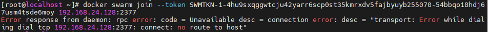

[Toc]

# 容器

> 容器是一种轻量级，进程级的虚拟化技术，属于type3型虚拟化，属于Paas

- **发展历程**

> 大型机-小型机-PC服务器-虚拟化-云计算-容器

- **虚拟分类**


- **特点**

> 1. 轻量：只打包了需要的bins/libs(也就是命令和库文件)。与宿主机共享操作系统，直接使用宿主机的内核；
> 2. 部署快：容器的镜像相对虚拟机的镜像小。部署速度非常快，秒级部署；
> 3. 移植性好：Build once,Run anywhere(一次构建，随处部署运行)；
> 4. 资源利用率更高：相对于虚拟机，不需要安装操作系统，所以几乎没有额外的CPU，内存消耗


# Docker介绍

- [官网地址](https://www.docker.com/)
- [docker官方仓库地址](https://hub.docker.com/)

> 2017-03-01之后，Docker版本命名开始发生变化，同时将CE版本和EE版本进行分开。
>
> - **Docker社区版(CE)**:为了开发人员或小团队创建基于容器的应用，与团队成员分享和自动化的开发管道。docker-ce提供了简单的安装和快速的安装，以便可以立即开始开发。
> 如：17-03-ce
> - **Docker企业版(EE)**:专为企业的发展和IT团队建立。docker-ee为企业提供最安全的容器平台，以应用为中心的平台

# Docker用到的Linux内核技术

> Docker容器本质上是宿主机的进程。可以把docker容器内部跑的进程看作是宿主机的线程；
>
> - Docker通过`namespace`实现了资源隔离；
> - 通过`cgroups`实现了资源限制
> - LXC:docker在LXC基础上发展的

## NameSpace

> Linux内核实现`namespace`的一个主要目的就是实现轻量级虚拟化(容器)服务。在同一个`namespace`下的进程可以感知彼此的变化，而对外界的进程一无所知。内核里实现资源隔离
> 
>
> 
>
> 不同命名空间里的应用名称可以相同，当俩个不同命名空间不进行通信时，相同的应用名称没有什么影响，当俩个命名空间需要进行通信时，最好以相同应用不同名称来进行区分
> 

## Control Groups

> 控制组(CGroups)是Linux内核的一个特性，主要用来对共享资源进行**隔离、限制、审计**等。只有能控制分配到容器的资源，才能避免多个容器同时运行时对宿主机系统资源的竞争。控制组可以提供对容器的内存、CPU、磁盘IO等资源进行限制和计费管理

## LXC&Docker区别

> LXC为Linux Container的简写。可以提供轻量级的虚拟化。Docker的底层就是使用了LXC来实现。Docker以LXC为基础，实现了更多更强的功能

# Docker环境准备

> 建议直接在宿主机上跑docker(当然也可以在虚拟机里跑docker);
> 不能直接在windows上跑docker,(因为namaspace,cgroup是linux内核的特性)windows没有，所以需要在windows跑linux虚拟机，再跑docker.
> 1. 要求能访问公网；
> 2. 关闭防火墙，selinux

# Docker软件安装

## 1. docker-ce的yum源下载(任选其一)

> 1. 官方源： https://download.docker.com/linux/centos/docker-ce.repo
> 2. 阿里云源：http://mirrors.aliyun.com/docker-ce/linux/centos/docker-ce.repo
> 3. 清华大学源： https://mirrors.tuna.tsinghua.edu.cn/docker-ce/linux/centos/docker-ce.repo

```
### 官方源下载
wget  https://download.docker.com/linux/centos/docker-ce.repo -O /etc/yum.repos.d/docker-ce.repo

### 阿里云下载
wget http://mirrors.aliyun.com/docker-ce/linux/centos/docker-ce.repo  -O /etc/yum.repos.d/docker-ce.repo
```

## 2. docker安装

```
### 清除yum缓存：
yum 会把下载的软件包和header存储在cache中，而不自动删除。如果觉得占用磁盘空间，可以使用yum clean指令进行清除，更精确 的用法是yum clean headers清除header，yum clean packages清除下载的rpm包，yum clean all一全部清除。

[root@localhost yum.repos.d]# yum clean all

### 安装docker-ce
[root@localhost yum.repos.d]# yum install docker-ce

注意：要安装docker-ce版，不要安装docker(否则可能安装1.13老版本)
```

## 3. 启动docker服务

```
### 启动docker服务
[root@localhost ~]# systemctl start docker
或者
[root@localhost ~]# systemctl restart docker
### 设置docker服务开机启动
[root@localhost ~]# systemctl enable docker
### 查看docker状态
[root@localhost ~]# systemctl status docker
```

## 4. 查看版本信息

```
[root@localhost /]# docker -v
Docker version 20.10.17, build 100c701

[root@localhost /]# docker info

### docker分为俩部分组成：客户端和服务端；由下信息可知，目前docker客户端和服务都在一台机器上
[root@localhost /]#  docker version
Client: Docker Engine - Community
 Version:           20.10.17
 API version:       1.41
 Go version:        go1.17.11
 Git commit:        100c701
 Built:             Mon Jun  6 23:05:12 2022
 OS/Arch:           linux/amd64
 Context:           default
 Experimental:      true

Server: Docker Engine - Community
 Engine:
  Version:          20.10.17
  API version:      1.41 (minimum version 1.12)
  Go version:       go1.17.11
  Git commit:       a89b842
  Built:            Mon Jun  6 23:03:33 2022
  OS/Arch:          linux/amd64
  Experimental:     false
 containerd:
  Version:          1.6.6
  GitCommit:        10c12954828e7c7c9b6e0ea9b0c02b01407d3ae1
 runc:
  Version:          1.1.2
  GitCommit:        v1.1.2-0-ga916309
 docker-init:
  Version:          0.19.0
  GitCommit:        de40ad0
```

## 5. docker daemon管理

>  docker engine分为client和server,默认都在本地。可以将client与server进行分离，实现远程doker连接。为了实现它，就需要对docker daemon进行相应的配置
>
> **注意**：客户端远程连接不需要加端口
> **特别注意**：远程客户端主机远程操作的权限非常大，请测试完后还原

```
### 远程客户主机：docker -H 容器宿主机IP version
[root@localhost /]# docker -H 91.11.111.111 version
Client: Docker Engine - Community
 Version:           20.10.17
 API version:       1.41
 Go version:        go1.17.11
 Git commit:        100c701
 Built:             Mon Jun  6 23:05:12 2022
 OS/Arch:           linux/amd64
 Context:           default
 Experimental:      true
 ### 当为启用daemon，会提示如下信息
Cannot connect to the Docker daemon at tcp://10.15.180.107:2375. Is the docker daemon running?
```

- **配置daemon**

> 1. 修改docker配置文件前，请先关闭docker守护进程；
>
>    ```
>    systemctl stop docker
>    ```
>
> 2. 通过`/etc/docker/daemon.json`文件对docker守护进程文件进行配置
>    docker daemon默认监听使用的是unix格式，监听文件：`UNIX///run/docker.sock`，添加`tcp://0.0.0.0:2375`可实现远程管理
>
> ```
> ### 如果创建了daemon.json文件，后续不想再使用该文件配置，但保留文件，删除文件内容时，需保留{};否则启动docker时会报错
> [root@localhost /]# vim /etc/docker/daemon.json
> {
> "hosts":["tcp://0.0.0.0:2375","unix:///var/run/docker.sock"]
> }
> ### 查看端口是否启用
> [root@localhost /]# netstat -ntlup | grep :2375
> [root@localhost /]# ls /var/run/docker.sock
> ```
>
> 3. 添加`/etc/docker/daemon.json`后会导致docker daemon无法启动，请先修改如下文件内容
>
> ```
> [root@localhost /]# vim /usr/lib/systemd/system/docker.service
> ### 修改前
> # exists and systemd currently does not support the cgroup feature set required
> # for containers run by docker
> ExecStart=/usr/bin/dockerd -H fd:// --containerd=/run/containerd/containerd.sock
> 
> ### 修改后
> # exists and systemd currently does not support the cgroup feature set required
> # for containers run by docker
> ExecStart=/usr/bin/dockerd
> ```
>
> 4. 修改后，重新加载配置文件：
>    **备注**：修改docker配置文件后，都需重新加载配置文件
>
> ```
> [root@localhost docker]# systemctl daemon-reload
> ```
>
> 5. 重启docker
>
> ```
> [root@localhost /]# systemctl start docker
> [root@localhost /]# netstat -ntlup |grep 2375
> tcp6       0      0 :::2375                 :::*                    LISTEN      3086/dockerd 
> ```
>
> 6. 测试从另一台机器远程访问docker是否成功
>
> ```
> [root@hf-ssjzxwj-08 ~]# docker -H 91.11.111.111 version
> [root@hf-ssjzxwj-08 ~]# docker -H 91.11.111.111 images
> ```

## 6. 查看docker所有操作说明

```
### 查看docker所有操作说明
[root@localhost ~]# docker --help

### 查看指定docker操作参数
[root@localhost ~]# man docker-images  //查看docker images 命令参数说明
```


# 镜像、容器、仓库

> - 镜像(image):镜像就是打包好的环境&应用；
> - 容器(container):容器就是运行镜像的实例。镜像看作是静态的，容器是动态的。一个镜像可以生成多个容器。
> - 仓库(repository):存放多个镜像的一个仓库。仓库可以是本地的，也可以是远程的

- **docker结构**：DOCKER HOST :docker宿主机


- **远程镜像仓库**


# 镜像常见操作

> 镜像主要分为俩类：
> 1. 操作系统类(如centos,ubuntu);
> 2. 应用程序类

## 查看镜像列表

> 列出本地主机上的镜像。

```
runoob@runoob:~$ docker images           
REPOSITORY          TAG                 IMAGE ID            CREATED             SIZE
ubuntu              14.04               90d5884b1ee0        5 days ago          188 MB
php                 5.6                 f40e9e0f10c8        9 days ago          444.8 MB

各个选项说明:

- **REPOSITORY：**  表示镜像的仓库源
- **TAG：**  镜像的标签
- **IMAGE ID：**  镜像ID
- **CREATED：**  镜像创建时间
- **SIZE：**  镜像大小
同一仓库源可以有多个 TAG，代表这个仓库源的不同个版本，如 ubuntu 仓库源里，有 15.10、14.04 等多个不同的版本，我们使用 REPOSITORY:TAG 来定义不同的镜像。
```

> 所以，我们如果要使用版本为15.10的ubuntu系统镜像来运行容器时，命令如下：
>
> ```
> runoob@runoob:~$ docker run -t -i ubuntu:15.10 /bin/bash 
> 
> 参数说明：
> - **-i**: 交互式操作。
> - **-t**: 终端。
> - **ubuntu:15.10**: 这是指用 ubuntu 15.10 版本镜像为基础来启动容器。
> - **/bin/bash**：放在镜像名后的是命令，这里我们希望有个交互式 Shell，因此用的是 /bin/bash。
> ```
>
> 如果要使用版本为 14.04 的 ubuntu 系统镜像来运行容器时，命令如下：
>
> ```
> runoob@runoob:~$ docker run -t -i ubuntu:14.04 /bin/bash 
> root@39e968165990:/# 
> ```
>
> 如果你不指定一个镜像的版本标签，例如你只使用 ubuntu，docker 将默认使用 ubuntu:latest 镜像。

## 搜索可用镜像

> - 可以从 Docker Hub 网站来搜索镜像，Docker Hub 网址为： **https://hub.docker.com/**
> - 使用 `docker search` 命令来搜索远程镜像

```
### 搜索官网/非官方可用镜像
[root@localhost docker]# docker search centos
NAME         DESCRIPTION                                       STARS     OFFICIAL【是否为官方】   AUTOMATED
centos       The official build of CentOS.                     7240      [OK]        
kasmweb/centos-7-desktop  CentOS 7 desktop for Kasm Workspaces  21    

NAME: 镜像仓库源的名称
DESCRIPTION: 镜像的描述
OFFICIAL: 是否 docker 官方发布
stars: 类似 Github 里面的 star，表示点赞、喜欢的意思。
AUTOMATED: 自动构建。

### 搜索是否存在nginx+jdk镜像
[root@localhost /]# docker search nginx-jdk
NAME                       DESCRIPTION   STARS     OFFICIAL   AUTOMATED
seongtaeyang/nginx-jdk7                  0      
```

## 获取一个新的镜像

- **如果镜像pull非常慢，怎么解决？**

> 1. docker镜像加速器；
> 2. 可以从网路好的宿主机上pull下来，然后导出给网速慢的宿主机导入

```
### 获取指定版本镜像
Crunoob@runoob:~$ docker pull ubuntu:13.10
### 获取最新版本镜像
Crunoob@runoob:~$ docker pull ubuntu
### 
docker pull docker.io/centos  名称为search查找得到的全名
### 若网速慢，可以试试阿里，腾讯，百度，网易等国内的镜像仓库；如：
docker pull hub.c.163.com/library/centos:latest
```

## 镜像加速器

> 国内从 DockerHub 拉取镜像有时会遇到困难，此时可以配置镜像加速器。Docker 官方和国内很多云服务商都提供了国内加速器服务，例如：
>
> - 科大镜像：**https://docker.mirrors.ustc.edu.cn/**
> - 网易：**https://hub-mirror.c.163.com/**
> - 阿里云：**https://<你的ID>.mirror.aliyuncs.com**
> - 七牛云加速器：**https://reg-mirror.qiniu.com**
>
> 当配置某一个加速器地址之后，若发现拉取不到镜像，请切换到另一个加速器地址。国内各大云服务商均提供了 Docker 镜像加速服务，建议根据运行 Docker 的云平台选择对应的镜像加速服务。
>
> 阿里云镜像获取地址：https://cr.console.aliyun.com/cn-hangzhou/instances/mirrors，登陆后，左侧菜单选中镜像加速器就可以看到你的专属地址
>
> - **在docker中使用镜像加速器**
>
> ```
> ###对于使用 systemd 的系统，请在 /etc/docker/daemon.json 中写入如下内容（如果文件不存在请新建该文件）：
> {"registry-mirrors":["https://reg-mirror.qiniu.com/"]}
> ### 之后重启服务
> $ sudo systemctl daemon-reload
> $ sudo systemctl restart docker
> ```

## 导出&导入镜像

- 范例：导出hello-world镜像到`/data/hello-world`

```
### 1.查看镜像
[root@localhost /]# docker images
REPOSITORY    TAG       IMAGE ID       CREATED        SIZE
hello-world   latest    feb5d9fea6a5   9 months ago   13.3kB
### 2.导出hello-world镜像到/data/，镜像名称为：hello-world
[root@localhost /]# docker save hello-world:latest -o /data/hello-world
### 3.导入【2】中导出的hello-world镜像
1）删除历史已导入镜像
[root@localhost data]# docker images
REPOSITORY    TAG       IMAGE ID       CREATED        SIZE
hello-world   latest    feb5d9fea6a5   9 months ago   13.3kB

[root@localhost data]# docker rmi hello-world
Untagged: hello-world:latest
Untagged: hello-world@sha256:53f1bbee2f52c39e41682ee1d388285290c5c8a76cc92b42687eecf38e0af3f0
Deleted: sha256:feb5d9fea6a5e9606aa995e879d862b825965ba48de054caab5ef356dc6b3412
Deleted: sha256:e07ee1baac5fae6a26f30cabfe54a36d3402f96afda318fe0a96cec4ca393359
2）监测镜像是否已删除
[root@localhost data]# docker images
REPOSITORY   TAG       IMAGE ID       CREATED       SIZE
java         latest    d23bdf5b1b1b   5 years ago   643MB
3）导入【2】中导出的hello-world镜像
[root@localhost data]# docker load < /data/hello-world
e07ee1baac5f: Loading layer [==================================================>]  14.85kB/14.85kB
Loaded image: hello-world:latest
4）检验导入是否成功
[root@localhost data]# docker images
REPOSITORY    TAG       IMAGE ID       CREATED        SIZE
hello-world   latest    feb5d9fea6a5   9 months ago   13.3kB
```

## 删除镜像

- **删除单个镜像**

```
### docker rmi 镜像名/镜像ID
$ docker rmi hello-world
```

- **批量删除所有镜像**

```
### docker images -qa 获取所有镜像ID
$ docker rmi $(docker images -qa)
```


## 查看镜像其他操作说明

```
### 方式1
[root@localhost data]# docker images --help
### 方式2
[root@localhost data]# man docker-images
[root@localhost data]# man docker-search
```

## 标记镜像

> 创建一个指向源镜像的标记,主要用于推送到仓库操作；(Joy:有点类似快捷链接)

```
 ### 语法
 docker tag SOURCE_IMAGE[:TAG] TARGET_IMAGE[:TAG]
 docker tag 源镜像  目标镜像
### 范例
[root@localhost data]# docker images
REPOSITORY    TAG       IMAGE ID       CREATED        SIZE
hello-world   latest    feb5d9fea6a5   9 months ago   13.3kB
java          latest    d23bdf5b1b1b   5 years ago    643MB
[root@localhost data]# docker tag hello-world hello
[root@localhost data]# docker images
REPOSITORY    TAG       IMAGE ID       CREATED        SIZE
hello-world   latest    feb5d9fea6a5   9 months ago   13.3kB
hello         latest    feb5d9fea6a5   9 months ago   13.3kB

```

# 镜像仓库

> 镜像仓库有俩种：
>
> 1. 公网镜像仓库：如官方自建镜像仓库，阿里云镜像仓库；
> 2. 通过harbor搭建自己的企业级镜像仓库

## 1. 公网镜像仓库

### 官方自建镜像仓库

[docker官网镜像仓库Docker Hub](https://hub.docker.com)

> 1. **注册**
>
>    在 [https://hub.docker.com](https://hub.docker.com/) 免费注册一个 Docker 账号，创建一个仓库
>
> 2. **登录和退出**
>
>    登录需要输入用户名和密码，登录成功后，我们就可以从 docker hub 上拉取自己账号下的全部镜像。
>
>    ```
>    $ docker login
>    ```
>
>    
>
>    **退出**
>
>    退出 docker hub 可以使用以下命令：
>
>    ```
>    $ docker logout
>    ```
>
> 3. **拉取**
>
> ```
> ### 1. 查找官方镜像
> $ docker search ubuntu
> ### 2. 拉取镜像到本地
> $ docker pull ubuntu 
> ```
>
> 4. **推送镜像**
>
>    用户登录后，可以通过 docker push 命令将自己的镜像推送到 Docker Hub。
>
>    ```
>    ### 以下命令中的 username 请替换为你的 Docker 账号用户名。
>    ### 1. 先创建一个标记指向源镜像
>    $ docker tag ubuntu:18.04 username/ubuntu:18.04
>    $ docker image ls
>    
>    REPOSITORY      TAG        IMAGE ID            CREATED           ...  
>    ubuntu          18.04      275d79972a86        6 days ago        ...  
>    username/ubuntu 18.04      275d79972a86        6 days ago        ...  
>    ### 推送镜像到官网
>    $ docker push username/ubuntu:18.04
>    
>    $ docker search username/ubuntu
>    
>    NAME             DESCRIPTION       STARS         OFFICIAL    AUTOMATED
>    username/ubuntu
>    ```

### 阿里云镜像仓库

- [阿里云官方网址](https://cr.console.aliyun.com/)

> 1. 在阿里云平台创建个人镜像仓库
> 2. 在本地登录阿里云仓库，在从仓库拉取或推送和官网相似，具体参考阿里云官网说明

## 2. 自建仓库

> 通过harbor搭建自己的企业级镜像仓库
>
> - [harbor官网](https://goharbor.io/)
> - [Docker Compose官网](https://docs.docker.com/compose/)
> - [Docker Compose下载地址](https://docs.docker.com/compose/install/)

### harbor简介

> Harbo是VMWare公司开源了企业级Registry项目，可以帮助用户快速搭建一个企业级的Docker registry服务
> harbor由python语言开发，需要使用`docker-compose`工具进行启动
> - **需要的工具**
> 1. 使用epel源安装pip：pip为python包管理工具
> 2. 使用pip安装docker-compose

- **环境准备**:准备一台新虚拟机作为harbor服务机

> 

- **安装**

```
### 修改镜像仓库
 wget https://mirrors.aliyun.com/docker-ce/linux/centos/docker-ce.repo -O /etc/yum.repos.d/docker-ce.repo
```


3. 安装harbor

# 容器常见操作

## 查看容器

```
### 查看所有在运行容器
[root@localhost /]# docker ps

### 查看所有容器，包括已停止运行的容器
[root@localhost /]# docker ps -a

### 查看最新启动的容器
[root@localhost /]# docker ps -l
```

## 启动容器

- **语法**

```
docker run [options] 镜像[:tag] 传递给容器启动执行的命令+参数  
如：
docker run [options] 镜像[:tag] /bin/bash
若不给定传递给容器启动执行的命令+参数  可能会存在俩种情况
1.启动的容器本身自带执行的命令&参数；那么不给定启动执行命令也会自动执行容器自带命令
2.容器可能会在启动后然后直接退出
```

> 通过hello-world镜像运行一个容器(没有定义容器名称，则为随机名称)
> - 当前docker-host（容器宿主机）如果有hello-world镜像，则直接使用；
> - 若没有相关镜像，则会去docker hub去下载(配置了镜像加速器的优先找加速器)
> - `docker run` 毎运行一次，产生一个新的容器；就算运行失败，也会产生一个容器
> - 容器名在docker里是唯一的

- **为什么容器运行完hello-world后就退出，而不是继续运行？**

  > 容器比喻为轻量级虚拟机，但容器实际上只是进程。运行完了当然就退出了，除非是类似服务那样的守护进程 

### 一次性启动容器

> 运行完后，容器就退出

```
### 不设参数运行容器
[root@localhost /]# docker run hello-world
[root@localhost /]# docker ps -a  //没有设置容器名会生成随机容器名，状态为Exited (0) 43 seconds ago
CONTAINER ID   IMAGE         COMMAND       CREATED          STATUS              PORTS     NAMES

e0c0196c963f  hello-world  "/hello"   44 seconds ago  Exited (0) 43 seconds ago       condescending_chatelet
### 通过运行容器，并通过运行的容器执行容器自带的命令
docker run centos echo haha   //运行centos容器，并使用echo命令，打印haha字符
docker run centos:latest echo haha //centos:latest  latest为tag，可省略，不设定tag默认为latest

### 设置死循环，保持容器处于运行状态
[root@localhost ~]# docker run centos /bin/bash -c 'while true; do echo haha;sleep 3; done'
haha
haha
haha
[root@localhost ~]# docker ps
CONTAINER ID   IMAGE     COMMAND                  CREATED          STATUS          PORTS     NAMES
b18a0d536d3e   centos    "/bin/bash -c 'while…"   28 seconds ago   Up 27 seconds             blissful_lewin
### 结束死循环容器
[root@localhost ~]# docker stop b18a0d536d3e
b18a0d536d3e
```

### 后端启动容器

> `-d`该参数让容器在后台运行

```
### docker运行一个不间断的脚本，`-d`表示后台运行(后台运行结果不会输出到当前终端)
[root@localhost ~]# docker run -d centos /bin/bash -c 'while true; do echo haha;sleep 3; done'
c7091039b0de2e2f1f3db168f94b9987d6b259d619d9db8fba1077e9a0e0d070
[root@localhost ~]# docker ps
CONTAINER ID   IMAGE     COMMAND                  CREATED          STATUS         PORTS     NAMES
c7091039b0de   centos    "/bin/bash -c 'while…"   10 seconds ago   Up 9 seconds             vigorous_dirac
#### 查看指定容器日志：容器转为后台，如何查看容器打印的东西
[root@localhost ~]# docker logs c7091039b0de(容器id)
haha
haha
[root@localhost ~]# docker logs c7091039b0de | wc -l  //查看打印行数
78
```

### 交互式启动容器

> 交互式启动容器后，会直接进入容器内部终端界面；可以在容器终端界面操作容器内部相关文件。

```
[root@localhost /]# docker images
REPOSITORY    TAG       IMAGE ID       CREATED        SIZE
hello-world   latest    feb5d9fea6a5   9 months ago   13.3kB
java          latest    d23bdf5b1b1b   5 years ago    643MB
### 2. 启动容器
[root@localhost /]# docker run -it hello-world /bin/bash
参数说明：
-i: 交互式操作。
-t: tty终端。
ubuntu: ubuntu 镜像。
/bin/bash：放在镜像名后的是命令，这里我们希望有个交互式 Shell，因此用的是 /bin/bash。
```

- **交互式启动容器，并自定义容器名**

```
### 参数说明：--name 指定容器名
#### 以交互式启动centos容器，并指定容器名为c1
[root@localhost ~]# docker run -it --name=c1 centos:latest /bin/bash   
或者
[root@localhost ~]# docker run -it --name c1 centos:latest /bin/bash   
[root@69709bbceafb /]# 
[root@69709bbceafb /]# ls   //查看容器69709bbceafb内部文件
bin  dev  etc  home  lib  lib64  lost+found  media  mnt  opt  proc  root  run  sbin  srv  sys  tmp  usr  var

### 查看正在运行的容器
[root@localhost ~]# docker ps 
CONTAINER ID   IMAGE           COMMAND                  CREATED             STATUS          PORTS     NAMES
69709bbceafb   centos:latest   "/bin/bash"              37 seconds ago      Up 36 seconds             c1

```

- **退出容器交互式状态**

> - `CTRL+P+Q` ：退出容器终端，不会导致容器终止运行(备注：容器需为持续性的进程)
> - `exit`：退出容器终端界面，会导致容器终止运行

```
### 退出交互式状态：若使用exit，在容器界面直接使用，会退出容器界面，返回linux主机界面，但是容器也同时会终止运行
[root@69709bbceafb /]# exit
exit
CONTAINER ID   IMAGE           COMMAND                  CREATED             STATUS                          PORTS     NAMES
69709bbceafb   centos:latest   "/bin/bash"              10 minutes ago      Exited (0) About a minute ago             c1
### 重新运行已停止的容器:以交互式方式启动的容器，在使用attach连接容器时，会进入容器的终端界面，而不是直接打印容器运行结果
[root@localhost ~]# docker start 69709bbceafb
69709bbceafb
[root@localhost ~]# docker attach 69709bbceafb
[root@69709bbceafb /]# 
```

## 停止容器

```
语法：
docker stop 容器ID/容器名

[root@localhost ~]# docker stop c7091039b0de
c7091039b0de
[root@localhost ~]# docker stop centos
c7091039b0de
```

## 启动已停止运行的容器

- **语法**

```
docker start 容器ID/容器名 
或者
docker restart 容器ID/容器名 
```

- **范例**

```
### 查看已停止容器信息
[root@localhost ~]# docker ps -a
CONTAINER ID   IMAGE         COMMAND                  CREATED             STATUS                         PORTS     NAMES
c7091039b0de   centos        "/bin/bash -c 'while…"   9 minutes ago       Exited (137) 5 minutes ago               vigorous_dirac
### 重启容器
[root@localhost ~]# docker restart c7091039b0de
c7091039b0de
[root@localhost ~]# docker start c7091039b0de
c7091039b0de
```

## 查看容器运行结果(日志)

- **语法**

```
docker logs 容器ID/容器名
```

- **范例**

```
[root@localhost ~]# docker logs c7091039b0de
haha
haha
[root@localhost ~]# docker logs c7091039b0de | wc -l  //查看打印行数
78
```

## 查看容器的配置/状态等信息

- **语法**

```
docker inspect 容器ID/容器名
```

- **范例**

```
[root@localhost ~]# docker inspect c7091039b0de
[
    {
        "Id": "c7091039b0de2e2f1f3db168f94b9987d6b259d619d9db8fba1077e9a0e0d070",
        "Created": "2022-07-14T05:00:58.718275441Z",
        "Path": "/bin/bash",
        "Args": [
            "-c",
            "while true; do echo haha;sleep 3; done"
        ],
........

### 查看IPAddress配置信息
docker inspect c1 | grep IPAddress | tail -l "IPAddress":"172.17.0.6"
```

## 连接到正运行容器

### `docker attach`

- **语法**

```
docker attach [OPTIONS] 容器ID/容器名
```

- **范例**

1. **连接非交互式启动容器**

```
### 非交互式启动容器
### docker run centos:latest /bin/bash
### 连接正在运行的centos容器:以以下这种方式连接容器，使用Ctrl+c无法停止连接，只能stop容器运行
[root@localhost ~]# docker attach c7091039b0de
haha
### 容器c7091039b0de将访问日志指到标准输出，连接到容器查看访问信息。：以以下这种方式连接正在运行的容器，可以使用CTRL+C终止连接，且不会停止容器运行。
[root@localhost ~]# docker attach --sig-proxy=false c7091039b0de 
haha
haha
haha 
```

2. **连接交互式启动容器**

```
### 交互式方式启动容器
[root@localhost ~]# docker run -it --name=c1 centos:latest /bin/bash
### 重新运行已停止的容器:以交互式方式启动的容器，在使用attach连接容器时，会进入容器的终端界面，而不是直接打印容器运行结果
[root@localhost ~]# docker start 69709bbceafb
69709bbceafb
[root@localhost ~]# docker attach 69709bbceafb
[root@69709bbceafb /]#
```

### `docker exec`

> `exec`可以直接连接容器，并执行命令

- **语法**

```
docker exec 容器ID/容器名 [操作命令]
```

- **范例**

```
[root@localhost ~]# docker ps
CONTAINER ID   IMAGE           COMMAND       CREATED          STATUS          PORTS     NAMES
69709bbceafb   centos:latest   "/bin/bash"   49 minutes ago   Up 36 minutes             c1
[root@localhost ~]# docker exec c1 ls  //连接容器c1后，执行命令ls
bin
dev
etc
.......
```

1. **进入容器内部**

```
### 参数说明 -i ：交互式；t:tty终端  /bin/bash 交互式 Shell
[root@localhost ~]# docker exec -it c1 /bin/bash
[root@69709bbceafb /]#                             //在容器界面，可以使用CTRL+P+Q退出容器终端，而不会导致容器终止;也可以使用exit退出当前容器
```

## 删除容器

- **语法**

```
docker rm 容器ID/容器名
```

- **删除单个容器**

```
[root@localhost ~]# docker rm e0c0196c963f
e0c0196c963f
```

- **批量删除所有容器**

```
### 1. 展示所有容器ID: -q 只显示容器ID  -a 显示所有容器，包括已停止容器
[root@localhost ~]# docker ps -qa
69709bbceafb
c7091039b0de
b18a0d536d3e
178d518c4483

### 2. 停止所有容器
[root@localhost ~]# docker stop $(docker ps -qa)
69709bbceafb
c7091039b0de
### 3. 删除所有容器
[root@localhost ~]# docker rm $(docker ps -qa)
69709bbceafb
c7091039b0de
......

[root@localhost ~]# docker ps -a
CONTAINER ID   IMAGE     COMMAND   CREATED   STATUS    PORTS     NAMES

```


## 从容器创建一个新的镜像

### `commit`

> 提交容器为一个新的镜像

- **语法**

```
docker commit [OPTIONS] CONTAINER [REPOSITORY[:TAG]]

OPTIONS说明：
-a :提交的镜像作者；
-c :使用Dockerfile指令来创建镜像；
-m :提交时的说明文字；
-p :在commit时，将容器暂停。
```

- **范例**

> 在一个容器里有自己自定义的一些配置，我们想将这个容器打包成一个镜像，方便以后放在别的地方使用。

```
### 查看最新启动容器
[root@localhost ~]# docker ps -l
CONTAINER ID   IMAGE           COMMAND       CREATED          STATUS          PORTS     NAMES
69709bbceafb   centos:latest   "/bin/bash"   27 minutes ago   Up 13 minutes             c1
### 将指定容器导出为一个镜像 test:v1
[root@localhost ~]# docker commit 69709bbceafb test:v1
sha256:1ed30e8d5e3e5efb2bed97048266f5f3801cc79ea27bafb8132766e915f90d30
### 查看导出镜像
[root@localhost ~]# docker images
REPOSITORY    TAG       IMAGE ID       CREATED         SIZE
test          v1        1ed30e8d5e3e   7 seconds ago   231MB
```

- 将容器a404c6c174a2 保存为新的镜像,并添加提交人信息和说明信息。

```
runoob@runoob:~$ docker commit -a "runoob.com" -m "my apache" a404c6c174a2  mymysql:v1 
sha256:37af1236adef1544e8886be23010b66577647a40bc02c0885a6600b33ee28057
runoob@runoob:~$ docker images mymysql:v1
REPOSITORY          TAG                 IMAGE ID            CREATED             SIZE
mymysql             v1                  37af1236adef        15 seconds ago      329 MB
```

# Docker存储驱动

## 写时复制&用时分配

> 一个镜像可以跑多个容器，如果每个容器都复制一份镜像内的文件系统，那么将会占用大量的存储空间。
> docker使用了写时复制cow(copy-on-write)和用时分配(allocate-on-demand)技术来提高存储的利用率。

- **写时复制**

> 1. 写时复制技术可以让多个容器共享同一个镜像的文件系统，所有数据都从镜像中读取；
> 2. 只有当要对文件进行写操作时，才从镜像里把要写的文件复制到自己的文件系统进行修改。所以无论有多少个容器共享一个镜像，所做的写操作都是对从镜像中复制到自己的文件系统中的副本上进行，并不会修改镜像的源文件；
> 3. 多个容器操作同一个文件，会在每个容器的文件系统里生成一个副本，每个容器修改的都是自己的副本，相互隔离，相互不影响

- **用时驱动**

> 启动一个容器，并不会为这个容器预分配一些磁盘空间，而是有新文件写入时，才按需分配空间

## 联合文件系统

> 联合文件系统(UnionFS)就是把不同物理位置的目录合并mount到同一个目录中。
> 比如你可以将一个光盘和一个硬盘上的目录联合挂载到一起，然后对只读的光盘文件进行修改，修改的文件不存放回光盘进行覆盖，而是存放到硬盘目录。这样做达到了不影响光盘原数据，而修改的目的
>
> 把光盘看作docker里的image，而硬盘目录看作container
>
> docker就支持aufs和overlay俩种联合文件系统

### `aufs`

> Docker最开始采用AUFS作为文件系统，也得益于AUFS分层的概念，实现了多个Container可以共享同一个image.
>
> 但是毎修改一次，会增加一层，当容器内文件修改n次时，会有n层

- 除了最上层为读写层，其余层为只读层


### `overlay`

> 由于AUFS并未入Linux内核，且只支持Ubuntu,考虑到兼容性问题，在Docker0.7版本中引入了存储驱动。目前，Docker支持AUFS,OverlayFS,Btrfs,Device mapper，ZFS五种存储驱动。
> 目前，在ubuntu发行版上默认存储方式为AUFS,CentOS发行版上的默认存储方式为Overlay或Overlay2

- **查看docker文件存储系统**

```
[root@localhost ~]# docker info | grep 'Storage Driver'
 Storage Driver: overlay2
```

- `lsmod`**会列出所有已载入系统的模块**

```
[root@localhost ~]# lsmod | egrep 'aufs|overlay'
overlay                91659  0    //91659:大小  0：已用内存
```


**从上图可以看到**：

1. 如果upperdir和lowerdir有同名文件时，会用upperdir的文件；
2. 读文件的时候，文件不再upperdir则从lowerdir读；
3. 如果写的文件不在upperdir在lowerdir,则从lowerdir里面copy到upperdir;
4. 不管文件多大，copy完在写，删除或者重命名镜像层的文件都只是在容器层生成的whiteout文件标志(标记为删除，并不是真的删除)

### aufs,overlay,overlay2对比

> - aufs:使用多层分层；
> - overlay：使用2层分层，共享数据方式是通过硬连接，只挂载一层，其他层通过最高层通过硬连接形式共享(增加了磁盘inode的负担)；
> - overlay2:使用2层分层，驱动原生地支持多层lower overlay镜像(最多128层)，与overlay驱动对比，消耗更少的inode

## 不同阶段观察存储情况

> 1. 镜像&容器存放目录`/var/lib/docker/overlay2`
> 2. centos7默认的docker存储引擎为overlay2

### docker第一次启动前

> 在刚安装docker-ce第1次启动服务之前，/var/lib下并没有docker这个目录

### docker第一次启动后

> 第一次`systemctl start docker`启动后，则会产生`/var/lib/docker`目录

```
### 查看目录 /var/lib/docker
[root@localhost /]# ls -l /var/lib/docker
总用量 4
drwx--x--x.  4 root root  120 7月  13 04:50 buildkit
drwx--x---.  2 root root    6 7月  14 03:27 containers
drwx------.  3 root root   22 7月  13 04:50 image
drwxr-x---.  3 root root   19 7月  13 04:50 network
drwx--x---. 14 root root 4096 7月  14 03:27 overlay2
drwx------.  4 root root   32 7月  13 04:50 plugins
drwx------.  2 root root    6 7月  13 06:24 runtimes
drwx------.  2 root root    6 7月  13 04:50 swarm
drwx------.  2 root root    6 7月  14 00:51 tmp
drwx------.  2 root root    6 7月  13 04:50 trust
drwx-----x.  2 root root   50 7月  13 06:24 volumes

### 查看文件夹大小(占用内存)
[root@localhost /]# du -sh /var/lib/docker/overlay2/
0    /var/lib/docker/overlay2/
[root@localhost /]# ls /var/lib/docker/overlay2/
backingFsBlockDev
l
```

### 下载镜像后

```
[root@localhost /]# docker pull hello-world
[root@localhost /]# du -sh /var/lib/docker/overlay2/
20K     /var/lib/docker/overlay2/
[root@localhost /]# ls /var/lib/docker/overlay2/
a58d1562699c610d76ea7e6dc5e806d57c9e8d26c87adaa5cd9e44864aaa55d6  l
backingFsBlockDev
[root@localhost /]# docker images
REPOSITORY    TAG       IMAGE ID       CREATED        SIZE
hello-world   latest    feb5d9fea6a5   9 months ago   13.3kB
```

### 运行容器后

```
[root@localhost /]# docker run feb5d9fea6a5
[root@localhost /]# ls /var/lib/docker/overlay2/
0ce335d481c5640bd7adea74bda07b7018288643b76d95e7862f445c950d57a1
0ce335d481c5640bd7adea74bda07b7018288643b76d95e7862f445c950d57a1-init
a58d1562699c610d76ea7e6dc5e806d57c9e8d26c87adaa5cd9e44864aaa55d6
backingFsBlockDev
l

### 当容器在运行时，可以查看到挂载情况
[root@localhost /]# mount | grep overlay
overlay on /var/lib/docker/overlay2/6c86f0bd6025448a64c63b7643ac311d8ee67416ac2bc66ea25d741f36952a8c/merged type overlay (rw,relatime,seclabel,lowerdir=/var/lib/docker/overlay2/l/RPAZGRWMJF6JCJQEJJJDZQ4COM:/var/lib/docker/overlay2/l/HVA36WZHRV67RAOWSBRW4UNZWM,upperdir=/var/lib/docker/overlay2/6c86f0bd6025448a64c63b7643ac311d8ee67416ac2bc66ea25d741f36952a8c/diff,workdir=/var/lib/docker/overlay2/6c86f0bd6025448a64c63b7643ac311d8ee67416ac2bc66ea25d741f36952a8c/work)
```

# 容器内跑应用

> 镜像：
>
> 1. 系统镜像；
> 2. 应用镜像

- **前期准备**

> 在宿主机上打开ip_forward,因为我们下面要映射容器的端口到宿主机，只有打开ip_forward才能映射成功
>
> ```
> ### 修改linux内核参数文件，修改后不需重新加载文件
> [root@localhost /]# vim /etc/sysctl.conf
> net.ipv4.ip_forward=1
> [root@localhost /]# sysctl -p  //读取系统文件
> net.ipv4.ip_forward = 1
> 
> ### sysctl 是一个用来在系统运作中查看及调整系统参数的工具。
> ```

## 容器中运行httpd应用

> 在容器中运行应用有俩种方式
>
> - **通过系统镜像(如centos)自定义应用，并commit提交为新镜像**
>   **缺点**：
>   1. 启动镜像时需手动传参；
>   2. 相对docker官网提供的镜像，占用内存更多
>
> - **通过docker官方或其他仓库提供的应用镜像直接使用**

### 案例1. 端口映射

> 利用官方centos镜像运行容器跑httpd服务，因为官方centos镜像里默认没有安装httpd服务，所以我们需要自定义安装。
> docker内部跑httpd启动80端口，需要与hocker_host(宿主机)进行端口映射，才能让客户端通过网络来访问。当访问宿主机的8000端口，相当于访问容器的80端口
>
> **注意**：退出容器终端，需使用`CTRL+P+Q`操作键，如使用`exit`会终止容器

1. **运行容器httpd1;`-p 8000:80 `把容器里的80端口映射为docker_host(宿主机)的8000端口**

  ```
  ### 1. 运行一个容器
  [root@localhost /]# docker run -it -p 8000:80 --name=httpd1 centos:latest /bin/bash
  ### 2. 查看容器内部是否能连外网
  [root@943c1cfe35cc /]# ip a  //查看ip
  1: lo: <LOOPBACK,UP,LOWER_UP> mtu 65536 qdisc noqueue state UNKNOWN group default qlen 1000
      link/loopback 00:00:00:00:00:00 brd 00:00:00:00:00:00
      inet 127.0.0.1/8 scope host lo
         valid_lft forever preferred_lft forever
  42: eth0@if43: <BROADCAST,MULTICAST,UP,LOWER_UP> mtu 1500 qdisc noqueue state UP group default 
      link/ether 02:42:ac:11:00:03 brd ff:ff:ff:ff:ff:ff link-netnsid 0
      inet 172.17.0.3/16 brd 172.17.255.255 scope global eth0
         valid_lft forever preferred_lft forever
         
  
  
  [root@943c1cfe35cc /]# cat /etc/redhat-release  //查看容器centos版本
  CentOS Linux release 8.4.2105
  [root@943c1cfe35cc /]# uname -r  //查看内核：内核与docker宿主机一致
  3.10.0-1127.el7.x86_64
  ```

2. **安装http前准备**

```
[root@943c1cfe35cc /]# ip route   //查看网关信息
default via 172.17.0.1 dev eth0 
172.17.0.0/16 dev eth0 proto kernel scope link src 172.17.0.3 

[root@943c1cfe35cc /]# cat /etc/resolv.conf  //查看dns信息
# Generated by NetworkManager
nameserver 8.8.8.8
nameserver 8.8.4.4

       
[root@943c1cfe35cc /]# ping www.baidu.com
PING www.wshifen.com (103.235.46.40) 56(84) bytes of data.

### 确定可以连通外网可以使用yum源安装httpd
[root@943c1cfe35cc etc]# ls /etc/yum.repos.d  //查看yum源
CentOS-Linux-AppStream.repo          CentOS-Linux-FastTrack.repo
CentOS-Linux-BaseOS.repo             CentOS-Linux-HighAvailability.repo
CentOS-Linux-ContinuousRelease.repo  CentOS-Linux-Media.repo

[root@943c1cfe35cc /]# yum install httpd httpd-devel -y
```

3. **启动http服务**

```
### 启动httpd服务
[root@943c1cfe35cc /]# systemctl start httpd  //在容器里无法使用systemd命令启动服务
System has not been booted with systemd as init system (PID 1). Can't operate.
Failed to connect to bus: Host is down
####使用原始路径启动:启动后警告提示服务没有定义服务域名，但服务实际已启动
[root@943c1cfe35cc /]# /usr/sbin/httpd  //或者使用 httpd -k start命令启动
AH00558: httpd: Could not reliably determine the server's fully qualified domain name, using 172.17.0.3. Set the 'ServerName' directive globally to suppress this message
httpd (pid 766) already running
### 查看端口是否启用
[root@localhost ~]# ss -na | grep 80
u_str  LISTEN     0      100    private/error 21804                 * 0    
```

4. **检验服务是否启动成功**

```
### 写入首页展示内容
[root@943c1cfe35cc yum.repos.d]# echo '11111hdhhddhdh' > /var/www/html/index.html
### 在容器宿主机上访问服务
[root@localhost ~]# curl 192.168.183.153:8000
11111hdhhddhdh
```

### 案例2：自定义httpd并提交为镜像

> centos镜像里并没有httpd，所以需要安装。但是如果每次启动一个容器都要安装一遍httpd是让人受不了的。所以我们在一个容器里安装一次，把想自定义的全做了，然后将此容器commit成一个新的镜像
>
> 此方式缺点：
>
> 1. 启动镜像时需手动传参；
> 2. 相对docker官网提供的镜像，占用内存更多
>
> **备注**：安装&首页配置参考【案例1】

```
[root@localhost ~]# docker ps
CONTAINER ID   IMAGE      COMMAND           CREATED             STATUS             PORTS              NAMES
943c1cfe35cc   centos:latest  "/bin/bash"    About an hour ago   Up About an hour   0.0.0.0:8000->80/tcp, :::8000->80/tcp   httpd1
### 提交httpd为镜像：commit会停止正在运行容器，然后再生成镜像
[root@localhost ~]# docker commit 943c1cfe35cc http_images  
sha256:da29a89dd3e2347bac8411d2df92d957652dabb2bfccce76ec6ae0a38b86064c
### 查看镜像
[root@localhost ~]# docker images
REPOSITORY    TAG       IMAGE ID       CREATED          SIZE
http_images   latest    da29a89dd3e2   16 seconds ago   590MB
```

- **将commit提交的镜像启动一个新的容器，并将端口80映射到宿主机8001**

```
### 启动镜像并运行httpd服务 -D FOREGROUND 参数设置需加上，否则无法正常启动http服务
[root@localhost ~]# docker run -d -p 8001:80 --name=http2 http_images /usr/sbin/httpd -D FOREGROUND
527390cbe70c6a0f549534051dcc697ccb795219ba32a6b566e6fdb226f600ff
[root@localhost ~]# docker ps
CONTAINER ID   IMAGE           COMMAND                  CREATED             STATUS             PORTS                                   NAMES
527390cbe70c   http_images     "/usr/sbin/httpd -D …"   7 seconds ago       Up 5 seconds       0.0.0.0:8001->80/tcp, :::8001->80/tcp   http2
943c1cfe35cc   centos:latest   "/bin/bash"              About an hour ago   Up About an hour   0.0.0.0:8000->80/tcp, :::8000->80/tcp   httpd1
8b0473818cc1   centos          "/bin/bash -c 'while…"   2 hours ago         Up 2 hours                                                 condescending_williamson
### 检验http服务是否正常启动
[root@localhost ~]# curl 192.168.183.153:8001
11111hdhhddhdh
```

- **修改httpd配置**

> 若需修改httpd相关配置，可以进入目录`/etc/httpd/conf`
>
> ```
> ### 修改httpd配置文件
> vi /etc/httpd/conf/httpd.conf
> ```

### 案例3：docker官方httpd镜像运行

- [httpd docker官方说明文档](https://hub.docker.com/_/httpd)

> 运行官方的镜像：在下载官方镜像后，直接运行使用即可。官方镜像<===>centos+httpd应用

1. **从docker官网下载`httpd`镜像**

```
### 查看docker官网是否有httpd镜像
[root@localhost /]# docker search httpd
NAME                                    DESCRIPTION                                     STARS     OFFICIAL   AUTOMATED
httpd                                   The Apache HTTP Server Project                  4083      [OK]  

### 从docker官网下载httpd
[root@localhost /]# docker pull httpd
Using default tag: latest

```

2. **运行`httpd`**

```
### $PWD 表示当前目录
[root@localhost docker_www]# docker run -dit --name my-apache-app -p 8080:80 -v "$PWD":/www httpd:latest
9617839583ffb5d5449ee1450ba356ccd29a53b8e803bc26ed2920138124c4d7

```

## Docker数据卷

> **当我们有以下需求**：
>
> 1. 容器内配置文件需要修改；
> 2. 容器内数据:(如httpd home目录内的数据)需要保存；
> 3. 不同容器间的数据需要共享(如：俩个httpd容器家目录数据共享)
>
> 当容器删除时，里面的相关改变的数据也会删除，也就是说数据不能持久化保存。
> 我们可以将服务的配置文件，数据目录，日志等目录与宿主机的目录映射，把数据保持到宿主机上实现数据持久化。
> 宿主机的目录也可以共享给多个容器使用

- **语法**

> `docker run -v 宿主机目录/容器目录 [options]`
>
> `-v` ：将宿主机目录映射到容器目录(或者说：主机目录挂载到容器目录)，当宿主机目录里的内容改变时，容器对应目录下的内容也随之改变；当容器目录下内容发生改变，对应宿主机目录下内容也会随之发生改变

### 数据挂载的作用

> - 数据持久化
>   没有做数据卷挂载，容器被删除，相对于镜像改变过的数据也被删除；
>   做了数据卷挂载，容器被删除，相对于镜像改变过的数据还保存在数据卷中；
>
> - 把容器内需要经常变动的数据解耦
> 1) 方便容器内配置文件的修改；
> 2) 方便容器内应用数据的更新；
> 2) 方便多个容器共享数据

**将宿主机的目录(数据卷)挂载到容器中(配置文件也可以挂载)**

1. **在宿主机创建一个目录，并建立一个内容不同的主页**

```
[root@localhost /]# mkdir docker_www
[root@localhost /]# echo joysun >/docker_www/index.html
```

2. **运行容器httpd4,将宿主机`/docker_www/`目录挂载到容器中的`/www/`目录**

```
### -v 宿主机目录:docker目录   
[root@localhost /]# docker run -d -p 8002:80 -v /docker_www/:/www --name=httpd4 http_images:latest /usr/sbin/httpd -D FOREGROUND
e0bee60c3885104fdce88ec9df1c0b8d63031b09a8ba36b5a395bab1099b7469
```

3. **检验**：当修改宿主机`/docker_www/index.html`的内容，访问`curl 111.111.111.111:8002`的结果是否会随之改变
   备注：若结果没有改变，查看容器httpd配置的读取页面路径是否为`/www`;

   ```
   ### 修改容器httpd配置文件
   vi etc/httpd/conf/httpd.conf
   ```

   **说明**：

   - `/docker_www/`目录可以不用提前创建，它会自动帮我们创建；
   - `/etc/httpd/conf/httpd.conf`此文件需提前准备(配置文件里的home目录要改为`/www`);
   - 挂载后，通过修改宿主机的数据来达到修改容器内部数据的目的

### 时区统一

> 默认的centos镜像时间与我们差8小时，这是时区的差异
>
> **说明**：
>
> - 从docker官方pull下来的centos:latest镜像，默认为UTC时区；
> - 需要改成自己的时区，可以在启动容器时用`-v /etc/localtime:/etc/localtime`挂载映射；
> - 若觉得每次挂载时区文件很麻烦，可以自定义把时区文件改好，保持为新的镜像再使用

1. **httpd服务与物理机时区不一致**

```
[root@localhost ~]# docker exec httpd2 date
Fri Jul 15 01:12:21 UTC 2022
[root@localhost ~]# date
2022年 07月 14日 星期四 21:12:23 EDT
```

2. **解决方式**

```
### 将宿主机数据卷挂载容器数据卷
[root@localhost /]# docker run -it -v /etc/localtime:/etc/localtime --name c2 centos /bin/bash
### 检验
[root@localhost ~]# docker exec c2 date
Thu Jul 14 21:22:52 EDT 2022
[root@localhost ~]# date
2022年 07月 14日 星期四 21:22:55 EDT
```

### 批量挂载数据卷

> 同时挂载多个数据卷

```
[root@localhost /]# docker run -d -p 8002:80 -v /etc/localtime:/etc/localtime -v /docker_www/:/www --name=httpd4 http_images:latest 
```

## 容器中运行Mysql

[mysql docker官网说明文档](https://hub.docker.com/_/mysql)

1. **从dokcer官网下载mysql镜像**

```
### 指定下载mysql版本
[root@localhost /]# docker pull mysql:5.7
```

2. **运行mysql镜像**

```
### 运行mysql镜像：
-e MYSQL_ROOT_PASSWORD=root  指定数据库访问密码；
--restart=always 设置重启docker服务后自动重启mysql服务 
--character-set-server=utf8mb4 --collation-server=utf8mb4_unicode_ci 设置字符编码
[root@localhost /]# docker run --name some-mysql -d -p 3306:3306 -v /data/mysql:/var/lib/mysql --restart=always -e MYSQL_ROOT_PASSWORD=root  mysql:5.7 --character-set-server=utf8mb4 --collation-server=utf8mb4_unicode_ci
40413516130c16d158e1e4f7aa8e5abc26960011c2897b37919d7e6f256215a7

### 查看宿主机/data/mysql目录,可以看到mysql已经初始化数据了

```

3. **检验mysql是否安装成功**

```
### 进入容器
[root@localhost mysql]# docker exec -it some-mysql /bin/bash
### 连接本地数据库
bash-4.2# mysql -uroot -proot
mysql> show databases;
+--------------------+
| Database           |
+--------------------+
| information_schema |
| mysql              |
| performance_schema |
| sys                |
+--------------------+
4 rows in set (0.00 sec)


### 在另一台主机链接mysql
[root@localhost ~]# mysql -h 111.111.111.111 -uroot -proot
```

## 自定义MariaDB环境


# DockerFile构建镜像

> 除了使用`docker commit`把自定义容器提交成镜像外，还可以使用Dockefile来构建自定义镜像
> - **什么是Dockerfile**
> Dockerfile把构建镜像的步骤都定义下来，然后按照顺序执行实现自动构建镜像。类似于脚本文件，ansible的playbook,saltstack的sls文件等。
> - 使用Dockerfile可以比较方便快速地构建自定义镜像环境

## Dockerfile指令

通过`man dockerfile` 可以查看到详细的说明

### `FROM`

> `FROM`指令
>
> 1. 指定其后构建新镜像所使用的基础镜像；
> 2. 必是Dockerfile文件中的首条命令；
> 3. 指定的基础image可以是官方远程仓库中的，也可以位于本地仓库，优先本地仓库

```
格式：FROM <image>:<tag>
范例：FROM centos:latest
### 从本地仓库下载
FROM 111.111.111.111/repository/centos:latest
```

### `RUN`

> RUN指令用于在构建镜像中执行命令，有以下俩种格式
> - **shell格式**
> ```
> 格式：RUN <命令>
> 范例：RUN echo testtext > /var/www/html/index.html
> ```
>
> - **exec格式**
>
> ```
> 格式：RUN ["可执行文件","参数1","参数2"]
> 范例：RUN ["/bin/bash","-c","echo testtext > /var/www/html/index.html"]
> ```

**注意**：当有多条要执行的命令，不要使用多条RUN,尽量使用`&&`符号与`\`符号链接成一行。因为多条RUN命令会让镜像建立多层(会让docker变得臃肿)

```
RUN yum install httpd httpd-devel -y
RUN echo daniel > /var/www/html/index.html
### 可以改成
RUN yum install httpd httpd-devel -y && echo daniel > /var/www/html/index.html
### 或者改成
RUN yum install httpd httpd-devel -y  \
&& echo daniel > /var/www/html/index.html
```

### `CMD`

> CMD不同于RUN,CMD用于指定在容器启动时所要执行的命令，而RUN用于指定镜像构建时所要执行的命令
> ```
> 格式有三种：
> CMD ["executable","param1","param2"]
> CMD ["param1","param2"]
> CMD command param1 param2
> ```
> **每个Dockerfile只能有一条CMD命令。如果指定了多条命令，只有最后一条会被执行。**
> 如果用户启动容器时候指定了运行的命令，则会覆盖掉CMD指定的命令
>
> ```
> 什么是启动容器时指定运行的命令？-D FOREGROUND 此为容器启动时指定运行的命令
> docker run -d -p 80:80 镜像名 运行的命令  /bin/bash -D FOREGROUND
> ```

### `ENTRYPOINT`

> ENTRYPOINT与CMD非常类似
> **相同点**
>
> - 一个Dockerfile只写一条，如果写了多条，那么只有最后一条生效；
> - 都是容器启动时才运行
>
> **不同点**：
>
> - 如果用户启动容器时指定了运行的命令，ENTRYPOINT不会被运行的命令覆盖，而CMD则会被覆盖
>
> ```
> 格式有俩种
> ENTRYPOINT ["executable","param1","param2"]
> ENTRYPOINT command param1 param2
> ```

### `EXPOSE`

EXPOSE 指令用于指定容器在运行时监听的端口

> 仅仅只是声明端口。
>
> **作用**：
>
> - 帮助镜像使用者理解这个镜像服务的守护端口，以方便配置映射。
> - 在运行时使用随机端口映射时，也就是 docker run -P 时，会自动随机映射 EXPOSE 的端口。

> ```
> 格式：EXPOSE <port> [<port>...]
> 范例：EXPOSE 80 3306 8080
> ```
> 上述运行的端口还需要使用docker run运行容器时通过-p参数映射到宿主机的端口

### `ENV`

ENV指令用于指定一个环境变量

> ```
> 格式：ENV <key> <value> 或者 ENV <key>=<value>  该变量是在容器内全局的
> 列：ENV JAVA_HOME /usr/local/jdkxxxxx/
> ```

### `ADD`

ADD指令用于把宿主机上的文件拷贝到镜像中,如果是压缩文件如 `.tar`类型文件会自动解压目标目录下

> ```
> 格式：ADD <src>  <dest>
> <src> 可以是一个本地文件或本地压缩文件，还可以是一个url,如果把<src>写成一个url,那么ADD就类似于wget命令
> <dest>路径的填写可以是容器内的绝对路径，也可以是相对于工作目录的相对路径
> 
> src路径设置注意事项：
> 在构建镜像时，如果使用的上下文路径为当前路径如：docker build -f dockerfile_httpd -t my_httpd:v1 .
> src路径需设置为Dockerfile所在当前路径：如：有个应用的配置文件实际目录是/data/conf/default.conf;Dockfile所在目录为/data;那么src路径需设置为conf/default.conf;若设置为决对路径/data/conf/default.conf会导致报错
> 
> 1、如果源路径是个文件，且目标路径是以 / 结尾， 则docker会把目标路径当作一个目录，会把源文件拷贝到该目录下。
> 如果目标路径不存在，则会自动创建目标路径。
> 
> 2、如果源路径是个文件，且目标路径是不是以 / 结尾，则docker会把目标路径当作一个文件。
> 如果目标路径不存在，会以目标路径为名创建一个文件，内容同源文件；
> 如果目标文件是个存在的文件，会用源文件覆盖它，当然只是内容覆盖，文件名还是目标文件名。
> 如果目标文件实际是个存在的目录，则会源文件拷贝到该目录下。 注意，这种情况下，最好显示的以 / 结尾，以避免混淆。
> 
> 3、如果源路径是个目录，且目标路径不存在，则docker会自动以目标路径创建一个目录，把源路径目录下的文件拷贝进来。
> 如果目标路径是个已经存在的目录，则docker会把源路径目录下的文件拷贝到该目录下。
> 
> 4、如果源文件是个归档文件（压缩文件），则docker会自动帮解压。
> ```

### `COPY`

COPY指令与ADD指令类似，但COPY的源文件只能是本地文件。不会自动解压压缩文件

> ```
> 格式：COPY <src> <dest>
> 
> ```

### `VOLUME`

VOLUME指令用于把宿主机里的目录与容器里的目录映射。
只指定挂载点，docker宿主机映射的目录为自动生成

> ```
> 格式： VOLUME ["<mountpoint>"]
> VOLUME ["<路径1>", "<路径2>"...]
> VOLUME <路径>
> 范例：VOLUME ["/www"]  会自动在宿主机生成/www目录
> ```

### `USER`

USER指令设置启动容器的用户(像hadoop需要hadoop用户操作，oracle需要oracle用户操作)，可以是用户或UID

**注意**：如果设置了容器以daemon用户去运行，那么RUN,CMD和ENTRYPOINT都会以这个用户去运行。。镜像构建完成后，通过docker run运行容器时，可以通过-u参数来覆盖所指定的用户

> ```
> USER daemon
> USER 1001
> ```

### `WORKDIR`

WORKDIR 指令设置工作目录，类似于cd命令。不建议使用`RUN cd /root`,建议使用WORKDIR

> ```
> WORKDIR /root
> ```

## 步骤

> 1. 创建一个文件夹(目录)；
> 2. 在文件夹(目录)中创建Dockerfile文件(并编写)及其它文件；
> 3. 使用`docker build`命令构建镜像；
> 4. 使用构建的镜像启动容器

## 案例1：Dockerfile构建httpd镜像v1

1. **创建Dockerfile文件**

```
FROM centos:latest
MAINTAINER joysun  //维护者
RUN yum install httpd httpd-devel -y && echo "这是主页" > /var/www/html/index.html
VOLUMN ["/var/www/html"]
EXPOSE 80
CMD ["/usr/sbin/httpd","-D","FOREGROUND"]
```

2. **构建镜像**

```
[root@localhost dockerfile]# docker build -f dockerfile_httpd -t my_httpd:v1 .
参数说明：
-f 指定要使用的Dockerfile路径
--tag, -t: 镜像的名字及标签，通常 name:tag 或者 name 格式；可以在一次构建中为一个镜像设置多个标签。
. 上下文路径，在此表示当前路径
上下文路径，是指 docker 在构建镜像，有时候想要使用到本机的文件（比如复制），docker build 命令得知这个路径后，会将路径下的所有内容打包。
解析：由于 docker 的运行模式是 C/S。我们本机是 C，docker 引擎是 S。实际的构建过程是在 docker 引擎下完成的，所以这个时候无法用到我们本机的文件。这就需要把我们本机的指定目录下的文件一起打包提供给 docker 引擎使用。
如果未说明最后一个参数，那么默认上下文路径就是 Dockerfile 所在的位置。
注意：上下文路径下不要放无用的文件，因为会一起打包发送给 docker 引擎，如果文件过多会造成过程缓慢。
```

3. **启动容器**

```
[root@localhost dockerfile]# docker run -d -p 8007:80 --name apache1 my_httpd:v1
```

## 自建httpd yum源

> 使用`build`构建进行，`yum install`会从公网上下载所需应用，会很慢，自己构建httpd yum源

1. **将iso镜像挂载，并使用http或ftp共享，并在本地创建yum配置**

  ```
  vim local.repo
  [local]
  name=local
  baseurl=http://11.111.0.1/yum  #IP为宿主机docker0网桥的IP
  gpgcheck=0
  enable=1
  ```

2. **编写dockerfile文件**

```
FROM centos:latest
MAINTAINER joysun  //维护者
RUM rm -rf /etc/yum.repos.d/*
ADD local.repo /etc/yum.repos.d/local.repo  //把与dockerfile同目录的local.repo拷贝到容器
RUN yum install httpd httpd-devel -y && echo "这是主页" > /var/www/html/index.html
EXPOSE 80
CMD ["/usr/sbin/httpd","-D","FOREGROUND"]
```

3. **构建镜像**

```
[root@localhost dockerfile]# docker build -f dockerfile_httpd -t my_httpd:v1 .
```

4. **启动容器**

```
[root@localhost dockerfile]# docker run -d -p 8007:80 --name apache1 my_httpd:v1
```

## 案例2：Dockerfile构建Tomcat镜像

1.  **准备好tomcat需要的jdk,tomcat等软件包，还有配置好环境变量的`startup.sh`和`shutdown.sh`文件**

```
### 
ls /dockerfile
apache-tomcat-9.0.14.tar.gz  jdk-8u191-linux-x64.tar.gz shutdown.sh startup.sh
dockerfile_tomcat

在startup.sh 和 shutdown.sh文件最前面加上下面一段环境变量配置
export JAVA_HOME=/usr/local/jdk1.8.0_191
export TOMCAT_HOME =/usr/local/tomcat
export PATH=$JAVA_HOME/bin:$TOMCAT_HOME/bin:$PATH
```

2. **编写dockerfile**

```
vim dockerfile_tomcat

FROM centos
MAINTAINER daniel
WORKDIR /usr/local
COPY jdk-8u191-linux-x64.tar.gz  /usr/local
COPY apache-tomcat-9.0.14.tar.gz /usr/local

RUN tar xf  jdk-8u191-linux-x64.tar.gz -C /usr/local && tar xf apache-tomcat-9.0.14.tar.gz -C
/usr/local && mv /usr/local/apache-tomtac-9.0.14/  /usr/local/tomcat

COPY startup.sh /usr/local/tomcat/bin/startup.sh
COPY shutdown.sh /usr/local/tomcat/bin/shutdown.sh

RUN chmod 755 /usr/local/tomcat/bin/startup.sh && chmod 755 /usr/local/tomcat/bin/shutdown.sh

EXPOSE 8080
CMD ["/usr/local/tomcat/bin/startup.sh"]
或者使用
CMD /usr/local/tomcat/bin/catalina.sh run 启动tomcat

```

- **简化**

> 在宿主机上解压后再拷贝到镜像，会节省点容器占用空间

```
FROM centos:7.6.1810
ENV JAVA_HOME=/usr/local/jdk1.8.0_191
ADD jdk1.8.0_191 /usr/local/jdk1.8.0_191
ADD tomcat /usr/local/tomcal
EXPOSE 8080
CMD /usr/local/tomcat/bin/catalina.sh run

```

3. **构建镜像**

```
[root@localhost dockerfile]# docker build -f dockerfile_httpd -t my_httpd:v1 .
```

4. **启动容器**

```
[root@localhost dockerfile]# docker run -d -p 8007:80 --name apache1 my_httpd:v1
```

## 案例3：Dockerfile构建MariaDB

1. **准备1个脚本执行mysql的初始化与启动**

```
vim mariadb.sh
#!/bin/bash
mysql_install_db --datadir=/var/lib/mysql/ --user=mysql
sleep 3
mysqld_safe --defaults-file=/etc/my.cnf &
sleep3

mysql -e "grant all privileges on *.* to 'root'@'%' identified by '123';"
mysql -e "grant all privileges on *.* to 'abc'@'%' identified by '123';"
mysql -e "flush privileges"
```

> - 使用脚本而不直接使用dockerfile里的RUN指令的原因是：启动mysql服务需要使用`&`放到后台，但把后台符合放在RUN里，会造成RUN命令有问题，所以单独使用脚本来做；
> - sleep 3秒是因为初始化和启动服务需要一定的时间，等待3s缓冲下

2. **创建dockerfile文件**

```
FROM centos:7.6.1810
RUN rm -rf /etc/yum.repos.d/*
ADD local.repo /etc/yum.repos.d/local.repo
RUN yum install mariadb-server mariadb -y

COPY mariadb.sh .
RUN sh mariadb.sh

EXPOSE 3306

CMD mysqld_safe --defaults-file=/etc/my.cnf
```

3. **构建镜像**

```
[root@localhost dockerfile]# docker build -f dockerfile_marriadb -t my_sql:v1 .
```

4. **启动容器**

```
[root@localhost dockerfile]# docker run -d -p 3306:3306 --name mysql my_sql:v1
```

> 若存在问题
>
> ```
> ### 查看容器日志
> docker logs 容器名/I
> ### 访问容器内应用日志
> docker exec 容器ID/容器名  cat /var/local/mysql/mysql.log
> ```
>

# 单宿主机容器互联

## 通过网络连接

> 默认创建的容器都在同一个网络上，宿主机的docker0网卡也连接在此网络.
>
> ```
> ### 查看容器c1 ip
> docker inspect c1 | grep IPAddress | tail -l "IPAddress":"172.17.0.6"
> ### 查看容器c1 ip
> docker inspect c2 | grep IPAddress | tail -l "IPAddress":"172.17.0.7"
> ### 查看宿主机ip
> ifconfig docker0 | head -2
> ```


## 通过Link连接

> 能够link方式可以实现俩个容器的连接，但是方向是单向的

**在docker宿主机上准备2个终端**

- **终端1**

```
[root@localhost ~]# docker run -it --name c1 centos:latest /bin/bash
[root@3c297a69b8dc /]# yum install httpd -y
[root@3c297a69b8dc www]# echo "c1 main page" > /var/www/html/index.html
[root@3c297a69b8dc /]# httpd -k start

```

- **终端2**

```
使用--link c1:alias1来连接c1容器；alias1为c1容器别名
docker fun -it --link c1:alias1 --name c2 centos:latest /bin/bash
这里容器c2上ping容器c1是可以通的(但回到终端1，ping c2 是能通的)
ping alias1
```

# Docker网络

## 本地网络

> 1. **brige**
> 这里的bridge和虚拟机里的桥接网络类型不太一样。可以把这个看作与虚拟机里的NAT类型相似。
> 宿主机能上公网，那么连接此网络的容器也可以上公网。
> 此为默认网络类型(也就是说运行容器时不指定网络，默认都属于这种类型)
> 宿主机上的docker0网卡就是属于此网络。
> 2. **host** 和宿主机共享网络
> 连接此网络的容器使用ifconfig查看的信息和宿主机一致，没有做NAT转换，类似泡在宿主机上一样
> 3. **none** 连接此网络的容器没有IP地址等信息，只有本地回环网卡。无法连接公共网络
> 4. **container** 多个容器连接到此网络，那么容器间可以相互通信，不和宿主机共享

- **查看docker网络类型**

```
[root@localhost ~]# docker network ls
NETWORK ID     NAME      DRIVER    SCOPE
e16aba6fae96   bridge    bridge    local
b14aa0dacc96   host      host      local
7494dea99d9b   none      null      local
```

- **查看指定镜像网络信息**

```
[root@localhost ~]# docker inspect mariadb2 | grep -i ipaddr
```

### brige模式

1. 创建一个名为bridge0的bridge类型的网络，指定网段为10.3.3.0/24(此网段不能和宿主机已有的网段冲突)，网关为10.3.3.1

```
[root@localhost ~]# docker network create -d bridge --subnet "10.3.3.0/24" --gateway "10.3.3.1" bridge0
73c2b839a5f5508c588bbe7e5b224097875cc5b027a012f382b75ccdf5aca277

### 查看创建的bridge0网络
[root@localhost ~]# docker network ls
NETWORK ID     NAME      DRIVER    SCOPE
e16aba6fae96   bridge    bridge    local
73c2b839a5f5   bridge0   bridge    local
b14aa0dacc96   host      host      local
7494dea99d9b   none      null      local

[root@localhost ~]# docker inspect bridge0

### 删除bridge0网络
[root@localhost ~]# docker network rm bridge0
bridge0
```

2. 运行容器，指定使用刚创建的网络

```
[root@localhost ~]# docker run -it -d --name c4 --network bridge0 centos:latest
7452e160f06ce798369095d5be90e81232c68a9fdc939beaf8128a39b4b4b70a
```

3. 验证并测试此容器网络

```
[root@localhost ~]# docker inspect c4 | grep IPAddress | tail -l
            "SecondaryIPAddresses": null,
            "IPAddress": "",
                    "IPAddress": "10.3.3.2",
                    
                    
### 可以ping通网关
[root@localhost ~]# docker exec c4 ping -c1 10.3.3.1
PING 10.3.3.1 (10.3.3.1) 56(84) bytes of data.
64 bytes from 10.3.3.1: icmp_seq=1 ttl=64 time=0.099 ms
```

4. 宿主机上会产生一个网卡名为br-xxxxx,IP地址为设置的网关10.3.3.1

```
[root@localhost ~]# ifconfig | head -2
br-ebefa2e5c34b: flags=4163<UP,BROADCAST,RUNNING,MULTICAST>  mtu 1500
        inet 10.3.3.1  netmask 255.255.255.0  broadcast 10.3.3.255
        
### 如果想修改网卡名，按如下步骤操作
[root@localhost ~]# ifconfig | head -2
br-ebefa2e5c34b: flags=4163<UP,BROADCAST,RUNNING,MULTICAST>  mtu 1500
        inet 10.3.3.1  netmask 255.255.255.0  broadcast 10.3.3.255
[root@localhost ~]# ifconfig br-ebefa2e5c34b down
[root@localhost ~]# ip link set dev br-ebefa2e5c34b name docker1
[root@localhost ~]# ifconfig docker1 up
[root@localhost ~]# ifconfig docker1 | head -2
docker1: flags=4163<UP,BROADCAST,RUNNING,MULTICAST>  mtu 1500
        inet 10.3.3.1  netmask 255.255.255.0  broadcast 10.3.3.255
[root@localhost ~]# systemctl restart docker
```

### host模式

1. **宿主机只能拥有一个host模式网络(和docker-host物理主机共享网络)，再创建会报错**

```
[root@localhost ~]# docker network create -d host host0
Error response from daemon: only one instance of "host" network is allowed
```

2. **运行容器，指定使用host网络**

```
[root@localhost ~]# docker run -it -d --name c5 --network host centos:latest
81f853ccc0c2b4c77b01d61c30a360640af008f248d7f20bfef405989695bc84
```

3. **验证并测试此容器的网络**

```
[root@localhost ~]# docker exec c5 ping -c1 www.baidu.com
PING www.wshifen.com (103.235.46.40) 56(84) bytes of data.
64 bytes from 103.235.46.40 (103.235.46.40): icmp_seq=1 ttl=128 time=186 ms

### 查看host 配置
[root@localhost ~]# docker network inspect host

### 下载网络工具
[root@localhost ~]# docker exec c5 yum install net-tools -y
CentOS Linux 8 - AppStream                      103  B/s |  38  B     00:00    
Error: Failed to download metadata for repo 'appstream': Cannot prepare internal mirrorlist: No URLs in mirrorlist
[root@localhost ~]# docker exec c5 ifconfig
```

### none

> 不能与外网通信，只能lo本地通信

```
[root@localhost ~]# docker run -itd --name c6 --network=none centos:latest /bin/bash
```

### container

> c8容器与c1容器网络保持一致(博客IP)

```
[root@localhost ~]# docker run -itd --name c8 --network=container:c1 centos:latest  /bin/bash
```


## 跨Docker host网络

> 不同的宿主机上的容器通过映射端口，然后通过俩台宿主机的IP和映射的端口来通讯。但这样做事利用了宿主机的网络，在某些场景并不方便。
> 能不能建立跨宿主机之间的网络，让容器使用自己的IP就可以通讯呢？答案是肯定的，而且方案也有很多种：有docker原生的overlay,macvlan和第三方方案flannel,weave,calico等
> 这里重点介绍flanner,[参考网址](https://coreos.com/blog/introducing-rudder.html)

### flannel介绍

> flannel是kubernetes默认提供网络插件，由CoreOS团队设计。
> flannel实质上是一种"覆盖网络(Overlay network)",也就是将TCP数据包装在另一种网络包里面进行路由转发和通信，目前已经支持UDP,VxLan,AWS VPC和GCE路由等数据转发方式。
> 默认的节点间数据通信方式是UDP转发，在Flannel的GitHub页面有如下的一张原理图
>
> [Flannel Git Hub网址](https://github.com/flannel-io/flannel)


> flannel可使用etcd存储，分配，维护子网信息，最终实现一个大网络内的不同子网可以互通

### flannel试验测试

- **前期准备**

> 1. 准备俩台新虚拟机
>    
> 2. IP静态
> 3. 主机名绑定
> ```
> 10.1.1.13  vm3.cluster.com
> 10.1.1.14  vm4.cluster.com
> ```
> 3. 时间同步
> 4. 关闭防火墙和selinux
> 5. yum源(使用cetos安装完系统后默认的yum源再加上下面的docker-ce源)
> ```
> [root@localhost ~]# wget https://mirrors.aliyun.com/docker-ce/linux/centos/docker-ce.repo -O /etc/yum.repos.d/docker-ce.repo
> ```

- **实验过程**

> 1. 在docker宿主机1上(主机名vm3)安装etcd,flannel,docker
> ```
> [root@localhost ~]# yum install etcd flannel docker-ce -y
> ```
> 2. 在docker宿主机1上配置etcd服务并启动
> ```
> [root@localhost ~]# vim /etc/etcd/etcd.conf
> ETCD_LISTEN_CLIENT_URLS="http://0.0.0.0:2379"  #这里要监听0.0.0.0，这样flanneld服务才能连接
> 
> [root@localhost ~]# systemctl start etcd
> [root@localhost ~]# systemctl enable etcd
> ```
> 3. 在docker宿主机1上配置flannerId服务，创建网络，并启动服务
>
>    ```
>    [root@localhost ~]# vim /etc/sysconfig/flanneld
>    FLANNEL_ETCD_ENDPOINTS="http://10.1.1.13:2379"  #注意：这里的IP改为ETCD服务IP
>    ### 创建一个虚拟网络 172.18.0.0/16
>    [root@localhost ~]# etcdctl mk //atomic.io/network/config '{"Network":"172.18.0.0/16"}'
>    [root@localhost ~]# systemctl start flanneld
>    [root@localhost ~]# systemctl enable flanneld
>    
>    
>    ### 验证分配的网络，此处网络是随机的
>    [root@localhost ~]# cat /run/flannel/sunet.env
>    ```
>
> 4. 在docker宿主机1上关联docker0网络与flannel0网络，启动docker服务，并验证网络
>
>    ```
>    [root@localhost ~]# systemctl start docker 
>    [root@localhost ~]# vim /etc/docker/daemon.json  //配置完后需重启docker
>    {
>    "bip":"172.18.86.1/24"  
>    "mtu":1472
>    }
>    bip 边界IP,和/run/flannel/subnet.env配置文件里的对应
>    mtu 网络最大传输单元，也和/run/flannel/subnet.env配置文件里的对应
>    ```
>
> 5. 另一台主机2与宿主机1配置类似
>
> 6. 验证
>
> ```
> [root@localhost ~]# docker run -d --name c1 busybox
> 
> ### 测试俩台主机的连通
> [root@localhost ~]#  docker exec c1 ping -c 2 172.18.42.2
> 
> 此时连接失败，被防火墙给限制了，启动docker服务，会产生iptables的规则，清除规则(注意FORWARD链默认规则要改)
> [root@localhost1 ~]#  iptables -F
> [root@localhost1 ~]#  iptables -P FORWARD ACCEPT
> [root@localhost2 ~]#  iptables -F
> [root@localhost2 ~]#  iptables -P FORWARD ACCEPT
> [root@localhost ~]#  docker exec c1 ping -c 2 172.18.42.2
> 
> ```

# 防火墙策略

## IPTables

- **简介**

> [iptables](https://so.csdn.net/so/search?q=iptables&spm=1001.2101.3001.7020) 是 Linux 防火墙系统的重要组成部分，iptables 的主要功能是实现对网络数据包进出设备及转发的控制。当数据包需要进入设备、从设备中流出或者由该设备转发、路由时，都可以使用 iptables 进行控制。

> iptables 是集成在 Linux 内核中的包过滤防火墙系统。使用 iptables 可以添加、删除具体的过滤规则，iptables 默认维护着 4 个表和 5 个链，所有的防火墙策略规则都被分别写入这些表与链中。
>
> “四表”是指 iptables 的功能，默认的 iptable s规则表有 filter 表（过滤规则表）、nat 表（地址转换规则表）、mangle（修改数据标记位规则表）、raw（跟踪数据表规则表）：
>
> filter 表：控制数据包是否允许进出及转发，可以控制的链路有 INPUT、FORWARD 和 OUTPUT。
> nat 表：控制数据包中地址转换，可以控制的链路有 PREROUTING、INPUT、OUTPUT 和 POSTROUTING。
> mangle：修改数据包中的原数据，可以控制的链路有 PREROUTING、INPUT、OUTPUT、FORWARD 和 POSTROUTING。
> raw：控制 nat 表中连接追踪机制的启用状况，可以控制的链路有 PREROUTING、OUTPUT。
> “五链”是指内核中控制网络的 NetFilter 定义的 5 个规则链。每个规则表中包含多个数据链：INPUT（入站数据过滤）、OUTPUT（出站数据过滤）、FORWARD（转发数据过滤）、PREROUTING（路由前过滤）和POSTROUTING（路由后过滤），防火墙规则需要写入到这些具体的数据链中。
>
> Linux 防火墙的过滤框架，如图 1 所示。
>
> 
>
> 可以看出，如果是外部主机发送数据包给防火墙本机，数据将会经过 PREROUTING 链与 INPUT 链；如果是防火墙本机发送数据包到外部主机，数据将会经过 OUTPUT 链与 POSTROUTING 链；如果防火墙作为路由负责转发数据，则数据将经过 PREROUTING 链、FORWARD 链以及 POSTROUTING 链。
> 

## iptables语法格式

iptables 命令的基本语法格式如下：

[root@liangxu ~]# iptables [-t table] COMMAND [chain] CRETIRIA -j ACTION

各参数的含义为：

-t：指定需要维护的防火墙规则表 filter、nat、mangle或raw。在不使用 -t 时则默认使用 filter 表。
COMMAND：子命令，定义对规则的管理。
chain：指明链表。
CRETIRIA：匹配参数。
ACTION：触发动作。

- **iptables 命令常用的选项及各自的功能如表 2 所示**

| 选 项 | 功 能                    |
| ----- | ------------------------ |
| -A    | 添加防火墙规则           |
| -D    | 删除防火墙规则           |
| -I    | 插入防火墙规则           |
| -F    | 清空防火墙规则           |
| -L    | 列出添加防火墙规则       |
| -R    | 替换防火墙规则           |
| -Z    | 清空防火墙数据表统计信息 |
| -P    | 设置链默认规则           |

- **iptables 命令常用匹配参数及各自的功能如表 3 所示**。 

| 参 数          | 功 能                |
| -------------- | -------------------- |
| [!]-p          | 匹配协议，! 表示取反 |
| [!]-s          | 匹配源地址           |
| [!]-d          | 匹配目标地址         |
| [!]-i          | 匹配入站网卡接口     |
| [!]-o          | 匹配出站网卡接口     |
| [!]--sport     | 匹配源端口           |
| [!]--dport     | 匹配目标端口         |
| [!]--src-range | 匹配源地址范围       |

- **iptables 命令触发动作及各自的功能如表 4 所示**。

| 触发动作   | 功 能                        |
| ---------- | ---------------------------- |
| ACCEPT     | 允许数据包通过               |
| DROP       | 丢弃数据包                   |
| REJECT     | 拒绝数据包通过               |
| LOG        | 将数据包信息记录 syslog 曰志 |
| DNAT       | 目标地址转换                 |
| SNAT       | 源地址转换                   |
| MASQUERADE | 地址欺骗                     |
| REDIRECT   | 重定向                       |
内核会按照顺序依次检查 iptables 防火墙规则，如果发现有匹配的规则目录，则立刻执行相关动作，停止继续向下查找规则目录；如果所有的防火墙规则都未能匹配成功，则按照默认策略处理。使用 -A 选项添加防火墙规则会将该规则追加到整个链的最后，而使用 -I 选项添加的防火墙规则则会默认插入到链中作为第一条规则。

注意，在 Linux CentOS 系统中，iptables 是默认安装的，如果系统中没有 iptables 工具，可以先进行安装。

## 常用命令

### 查看规则

```
[root@liangxu ~]# iptables -nvL

各参数的含义为：
-L 表示查看当前表的所有规则，默认查看的是 filter 表，如果要查看 nat 表，可以加上 -t nat 参数。
-n 表示不对 IP 地址进行反查，加上这个参数显示速度将会加快。
-v 表示输出详细信息，包含通过该规则的数据包数量、总字节数以及相应的网络接口。

### 查看当前用户规则
[root@liangxu ~]# iptables -nL --line-number


```

### 添加规则

```
[root@liangxu ~]# iptables -A INPUT -s 192.168.1.5 -j DROP
```

### 修改规则

```
在修改规则时需要使用-R参数。 【例 4】把添加在第 6 行规则的 DROP 修改为 ACCEPT。
[root@liangxu ~]# iptables -R INPUT 6 -s 194.168.1.5 -j ACCEPT
```

### 删除规则

```
删除规则有两种方法，但都必须使用 -D 参数。 【例 5】删除添加的第 6 行的规则。首先需要使用su命令，切换当前用户到 root 用户，然后在终端页面输入如下命令：
[root@liangxu ~]# iptables -D INPUT 6 -s 194.168.1.5 -j ACCEPT
或
[root@liangxu ~]# iptables -D INPUT 6

注意，有时需要删除的规则较长，删除时需要写一大串的代码，这样比较容易写错，这时可以先使用 -line-number 找出该条规则的行号，再通过行号删除规则。
```

# Docker web管理平台

> docker图形化管理平台：DockerUI,Portainer,Shipyard等。没有官方稳定维护的图形化平台，所以有些不是很能受到信任。

# Docker三剑客

> 为了把容器化技术的优点发挥得更好，docker公司先后推出了三大技术：
> - docker-machine
> - docker-compose
> - docker-swarm
> 使用"三剑客"可以帮助我们解决docker host维护，多容器编排部署，多个docker host集群的各个难题

## docker-machine

> 在windows或者Mac上运行一个linux虚拟机，再在虚拟机里运行docker。
> docker-machine就是docker公司官方推出的，用于在各种平台上快速创建具有docker服务的虚拟机技术
>
> [官方参考文档](https://docs.docker.com/desktop/)

## docker-compose

>用容器运行一个服务，需要使用`docker run`命令。但如果要运行多个服务呢？
>假设我要运行一个web服务，还要运行一个db服务，那么是用一个容器运行，还是用多个容器运行呢？
>一个容器运行多个服务会造成镜像的复杂度提高，**docker更倾向于一个容器运行一个应用**。
>那么复杂的架构就会需要很多的容器，并且需要它们之间有关联(容器之间的依赖和连接)就更复杂了。
>这个复杂问题的解决，涉及到了**容器编排**的问题。
>
>docker-compose 就是可以做容器编排的小工具，它可以在一个文件中定义多个容器，只用一行命令就可以让一切就绪并运行

### docker-compose部署

1. **安装**

```
### 安装docker-compose
[root@localhost ~]#  curl -L "https://github.com/docker/compose/releases/download/v2.2.2/docker-compose-$(uname -s)-$(uname -m)" -o /usr/local/bin/docker-compose

github不是很稳定，可以使用以下命令安装docker compose
curl -L https://get.daocloud.io/docker/compose/releases/download/v2.4.1/docker-compose-`uname -s`-`uname -m` > /usr/local/bin/docker-compose

### 设置执行权
[root@localhost ~]# chmod +x /usr/local/bin/docker-compose
```

2. **安装后验证**

```
[root@localhost ~]# docker-compose -v
Docker Compose version v2.2.2
```

3. **卸载安装**

```
[root@localhost bin]# rm /usr/local/bin/docker-compose
```

### 常用操作命令

#### 启动

```
docker-compose up  
docker-compose up -d   //后端启动
```

#### 停止

```
docker-compose stop
```

#### 删除

```
docker-compose rm  //删除所有compose启动的容器
```


### 使用docker-compose三步骤

> Docker Compose将所管理的容器分为三层
> 1. **工程(project);**
> 2. **服务(service);**
> 3. **容器(container)**
>
> Docker Compose运行的目录下的所有文件(docker-compose.yml,extends文件或环境变量文件等)组成一个工程，若无特殊指定工程名，即为当前目录名。
> 一个工程当中可包含多个服务，每个服务中定义了容器运行的镜像，参数，依赖。
> 一个服务当中可包括多个容器实例

**使用Compose基本分为三步**

1. **Dockerfile定义应用的运行环境(镜像)；**
2. **docker-compose.yml定义组成应用的各服务；**
3. **docker-compose up构建并启动整个应用**

### docker compose常见语法

> [compose 参考](https://docs.docker.com/compose/compose-file/)
>
> docker compose 使用`.yml`或`.yaml`文件编辑配置

#### `build`
> 指定镜像构建时的dockerfile目录，格式一般为绝对路径或相对路径目录(dockerfile需要命名为Dockerfile)
```
build: /path/to/build/dir
或者
build: ./dir
```

#### `image`
> 指定要启动容器的镜像.如果镜像不存在，compose会尝试拉取它。如果指定了构建，可以使用指定的选项构建它，并使用指定的tag进行标记
```
image: redis
image: ubuntu:14.04
image: tutum/influxdb
image: example-registry.com:4000/postgresql
image: a4bc65fd
```

#### `enviromment`
> 设置镜像变量，它可以保存变量到镜像里面，也就是说启动的容器也会包含这些变量设置。`environment`和Dockerfile中的`ENV`指令一样会把变量一直保存在镜像容器中。
>
> 一些变量的配置，如数据库用户名/密码的配置，也可以在compose.yml配置，这些变量的配置可以参考docker官网对应镜像的说明进行配置。
```
environment:
  RACK_ENV: development
  SHOW: 'true'

或者：
environment:
  - RACK_ENV: development
  - SHOW: 'true'
```

#### `expose`

> 和Dockerfile中的`EXPOSE`指令一样，用于指定暴露的端口，但只将端口暴露给连接的服务，而不暴露给主机(只给容器连，而主机无法访问)。

```
expose:
  - "3000"
  - "8000"
```

#### `ports`

> 映射端口，可以使用`HOST:CONTAINER`的方式指定端口，也可以指定容器端口(选择临时主机端口)，宿主机会随机映射端口
```
posrts:
  - "3000"
  - "3000-3005"
  - "3000"
  - "8000:8000"
  - "9090-9091:8080-8081"
  - "49100:22"
  - "127.0.0.1:8001:8001"
  - "127.0.0.1:8001-8002:5001-5002"
  - "6061:6060/udp"
```

#### `restart`

> 指定Docker容器的重启策略。
> 默认值为`no`,即在任何情况下都不会重新启动容器
> `always` :容器退出时总是重新启动，(会随着docker服务启动而启动容器)
> `on-failure`  当出现`on-failure`报错(非正常退出，退出状态非0)，才会重启容器
> `unless-stopped` 在容器退出时总是重启容器，但是不考虑在Docker守护进程时启动时就已经停止了容器

```
restart: no
restart: always
restart: on-failure
restart: on-failure:3
restart: unless-stopped
```

#### `volume`

> 数据卷挂载，可以直接使用`HOST:CONTAINER`这样的格式；
>
> 或者使用`HOST:CONTAINER:ro`这样的格式，ro代表数据卷是只读的
```
volumes:
  # 只指定一个路径，Docker会自动再创建一个数据卷(这个路径是容器内部的)。
  - /var/lib/mysql
  # 使用绝对路径挂载数据卷
  - /opt/data:/var/lib/mysql
  # 以compose配置文件为中心的相对路径作为数据卷挂载到容器
  - ./cache:/tmp/cache
  # 使用用户的相对路径(~/表示的目录是 /home/<用户目录>/ 或者 /root/)
  - ~/configs:/etc/configs/:ro
   # 已经存在的命名的数据卷 datavolume：数据卷卷名
  - datavolume:/var/lib/mysql
  
 
 ### 查看数据卷信息
 [root@localhost ~]# docker volume ls
DRIVER    VOLUME NAME

```

#### `depends_on`

> 此标签解决了容器的依赖、启动先后的问题.如下，使用`docker-compose up web 启动，会先启动redis 和db,再启动web`
```
version: '3'
services: 
  web:
    build: .
    depends_on:
       - db
       - redis
redis:
  image: redis
db:
  image:mysql
```

#### `links`

> 链接到其他服务中的容器，与`link`连接效果一样，会连接到其他服务中的容器
```
web:
  links:
    - db
    - db: database
   -  redis
```

### 案例1：wordpress应用

1. **创建一个名为wordpress的project(工程）**
```
[root@localhost /]# mkdir -p /docker-compose/wordpress
[root@localhost /]# cd  /docker-compose/wordpress
```
2. **创建`docker-compose.yml`**

```
version: "3"
services:
  mysql:
    image: mysql:5.7
    restart: always
    volumes:
      - ./data:/var/lib/mysql
    environment:
      MYSQL_ROOT_PASSWORD: wordpress
      MYSQL_DATABASE: wordpress
      MYSQL_USER: wordpress
      MYSQL_PASSWORD: wordpress
    expose:
      - 3306

  wordpress:
    image: wordpress:latest
    restart: always
    depends_on:
      - mysql
    links:
      - mysql
    environment:
      WORDPRESS_DB_HOST: mysql:3306
      WORDPRESS_DB_USER: wordpress
      WORDPRESS_DB_PASSWORD: wordpress
      WORDPRESS_DB_NAME: wordpress
    ports:
      - "8010:80"
```

3. **启动**

> 如果本地没有下载，下载的镜像比较大

```
[root@localhost wordpress]# docker-compose up -d
[+] Running 3/3
 ⠿ Network wordpress_default        Created                                   0.2s
 ⠿ Container wordpress-db-1         Started                                   0.5s
 ⠿ Container wordpress-wordpress-1  Star...                                   2.3s

### 查看启动的容器
[root@localhost wordpress]# docker ps
CONTAINER ID   IMAGE              COMMAND                  CREATED          STATUS          PORTS                                   NAMES
7ab8184127ee   wordpress:latest   "docker-entrypoint.s…"   29 seconds ago   Up 27 seconds   0.0.0.0:8010->80/tcp, :::8010->80/tcp   wordpress-wordpress-1
9d53de612804   mysql:5.7          "docker-entrypoint.s…"   29 seconds ago   Up 29 seconds   3306/tcp, 33060/tcp                     wordpress-db-1
```

4. **检验wordpress是否可以访问**

   > http://192.168.183.153:8010/

5. **启动wordpress报错**

```
### 停止compose运行
[root@localhost wordpress]# docker-compose stop
### 停止所有容器
[root@localhost ~]# docker stop $(docker ps -aq)
### 清除所有容器
[root@localhost ~]# docker rm $(docker ps -aq)
### 修改配置文件，删除工程目录下的data后，重新启动compose
[root@localhost wordpress]# docker-compose up -d
```

### 案例2：python计数小应用

> 创建一个Python应用，使用Flask,将数值计入Redis
1. **建立工程目录并在工程目录里创建Python脚本**
```
[root@localhost /]# mkdir -p /docker-compose/python_count
[root@localhost /]# cd  /docker-compose/python_count

[root@localhost python_count]# vim app.py
from flask import Flask
from redis import Redis

app = Flask(__name__)
redis = Redis(host='redis',port=6379)

@app.route('/')
def hello():
      redis.incr('hits')
      return 'Hello World! I have been seen %s times.' % redis.get('hits')

if __name__=="__main__":
    app.run(host="0.0.0.0",debug=True)

    
[root@localhost python_count]# vim requirements.txt
flask
redis
```

2. **创建Dockerfile**

   > 在同一目录下创建Dockerfile

```
FROM python:2.7
ADD . /code
WORKDIR /code
RUN pip install -r requirements.txt
CMD python app.py

- 说明
  - 容器使用Python 2.7版本
  - 将当前目录拷贝到容器内/code
  - 指定工作空间为 /code
  - 安装python需要的库：flask,redis,flask默认为端口5000
  - 容器执行命令：python app.py
```

3. 创建编排脚本

   > 在同一目录下，创建docker-compose.yml

```
version: "3"
services:
  web:
    build: .
    ports:
      - "5000:5000"
    volumes:
       - .:/code
    depends_on:
       - redis

  redis:
    image: redis:latest
```

4. 启动

```
[root@localhost python_count]# docker-compose up -d
```

5. **检验**

> 浏览器访问：http://192.168.183.153:5000/
>
> 

### 案例3：haproxy应用

> hayproxy 负载均衡

1. 创建一个工程目录haproxy
```
[root@localhost /]# mkdir -p /docker-compose/haproxy
[root@localhost /]# cd  /docker-compose/haproxy
```

2. 准备`haproxy.cfg`配置文件

```
[root@localhost haproxy]# vim haproxy.cfg

global
  log 127.0.0.1 local0 ###[err warning info debug]
  log 127.0.0.1 local1 notice

defaults
  log global  ###采用全局定义的日志
  mode http  ###默认的模式mode { tcp|http|health }，tcp是4层，http是7层，health只会返回OK
  option httplog ###日志类别http日志格式
  option dontlognull  ###不记录健康检查的日志信息
  timeout connect 5000ms  ###默认连接超时时间
  timeout client 50000ms ###客户端连接超时
  timeout server 50000ms ###服务器连接超时
  stats uri /status

frontend balancer
  bind 0.0.0.0:8012  ### 前端监听端口 
  mode http
  default_backend web_backends

backend web_backends
  mode http
  option forwardfor
  balance roundrobin ###负载均衡模式轮询
  server web1 web1:80 check  ###后端服务器定义
  server web2  web2:80 check
  server web3  web3:80 check
  option httpchk GET /
  http-check expect status 200

  
  
  ### 说明
  balance roundrobin : 均衡算法

```

3. 创建编排脚本`docker-compose.yml`

```
[root@localhost haproxy]# vim docker-compose.yml

version: "3"
services:
  web1:
    image: httpd:latest
    volumes:
      - ./httpd1:/usr/local/apache2/htdocs/
    expose:
      - 80

  web2:
    image: httpd:latest
    volumes:
      - ./httpd2:/usr/local/apache2/htdocs/
    expose:
      - 80

  web3:
    image: httpd:latest
    volumes:
      - ./httpd3:/usr/local/apache2/htdocs/
    expose:
      - 80

  haproxy:
    image: haproxy:latest
    volumes:
      - ./haproxy.cfg:/usr/local/etc/haproxy/haproxy.cfg:ro
    links:
      - web1
      - web2
      - web3
    ports:
      - 8011:8012
    expose:
      - 8012
```

4. **启动应用**

```
### 下载httpd,haproxy镜像后，启动应用
```

5. **设置页面展示内容**

```
[root@localhost haproxy]# echo web1 >httpd1/index.html
[root@localhost haproxy]# echo web2 >httpd2/index.html
[root@localhost haproxy]# echo web3 >httpd3/index.html
```

6. **校验是否负载均衡调度**

> 浏览器访问：http://宿主机:8011/
>
> 查看状态信息：http://192.168.183.153:8011/status


## docker swarm

### docker swarm介绍

> Docker Swarm 是Docker 官方提供的一款集群管理工具，其主要作用是把若干台Docker主机抽象为一个整体，并且通过一个入口统一管理这些Docker主机上的各种Docker资源。Swarm和Kubernetes比较类似，但是更加轻，具有的功能较Kubernetes更少一些
> - 是docker host 集群管理工具
> - docker 官方提供的
> - docker 1.12版本以后
> - 用来统一集群管理的，把整个集群资源做统一调度
> - 比kubernetes要轻量化
> - 实现scaling规模扩大或缩小
> - 实现rolling update 滚动更新或版本回退
> - 实现service discovery 服务发现
> - 实现load balance负载均衡
> - 实现route mesh路由网格，服务治理

### docker swarm 概念&架构

- **节点(node)**:就是一台docker host上面运行了docker engine.节点分为俩类

  > - 管理节点(manager node) 负责管理集群中的节点，并向工作节点分配任务
  > - 工作节点(worker node) 接收管理节点分配的任务，运行任务

- **服务(services)**:在工作节点运行的，由多个任务共同组成；

- **任务(task)**:运行在工作节点上容器或容器中包含应用，是集群中调度最小管理单元


### docker swarm集群部署

#### 环境准备


1. **所有节点主机及主机名绑定**
```
###
vim /etc/hosts
192.168.122.11  vm1.cluster.com
192.168.122.12  vm1.cluster.com
192.168.122.13  vm1.cluster.com
```
2. **所有节点关闭防火墙和selinux**
```
### 在管理节点机器上开启防火墙端口
开启端口命令：firewall-cmd --zone=public --add-port=2377/tcp --permanent
重启防火墙: systemctl restart firewalld.service

### 查看端口开启状态：
查看端口状态:firewall-cmd --list-ports
```

若未开启端口，在加入节点时会报错


2. **所有节点时间同步**
3. **所有节点都安装docker-ce并启动服务**
```
wget http://mirrors.aliyun.com/docker-ce/linux/centos/docker-ce.repo  -O /etc/yum.repos.d/docker-ce.repo

yum install docker-ce -y
systemctl start docker
systemctl enable docker
```
5. **所有节点配置镜像加速器**
```
vim /etc/docker/daemon.json
{
 "registry-mirrors":["https://42h8kzrh.mirror.aliyuncs.com"],
  "insecure-registries":["192.168.122.18"]
}

systemctl daemon-reload
systemctl restart docker
```

#### manager节点初始化swarm集群

```
[root@localhost ~]#  docker swarm init --listen-addr 192.168.122.11:2377

Swarm initialized: current node (py0eboiqxz8imovki6leqt8e4) is now a manager.

To add a worker to this swarm, run the following command:

    docker swarm join --token SWMTKN-1-2fvbcd04v8zk5jtx0a5kycmhvw0nwpsuday9se4qjyfga86gxm-7fk3g9g9lmv7dic3b0o7c64o5 192.168.183.153:2377

To add a manager to this swarm, run 'docker swarm join-token manager' and follow the instructions.

### 查看当前节点
[root@localhost ~]# docker node ls
ID                            HOSTNAME                STATUS    AVAILABILITY   MANAGER STATUS   ENGINE VERSION
py0eboiqxz8imovki6leqt8e4 *   localhost.localdomain   Ready     Active         Leader           20.10.17

```

#### swarm集群中加入worker节点

分别在另外2个节点join集群

```
[root@localhost ~]# docker swarm join --token SWMTKN-1-2fvbcd04v8zk5jtx0a5kycmhvw0nwpsuday9se4qjyfga86gxm-7fk3g9g9lmv7dic3b0o7c64o5 192.168.183.153:2377
This node joined a swarm as a worker.
```

### docker swarm集群应用

#### nginx 环境准备

准备俩个nginx镜像(版本不同)，并push到harbor仓库，在任意节点操作。
1. **准备主页文件与dockerfile文件**
```
[root@localhost ~]# mkdir /dockerfile/nginx -p
[root@localhost ~]# cd /dockerfile/nginx
[root@localhost nginx]# vim index.html
nginx v1

[root@localhost nginx]# vim Dockerfile
FROM nginx:latest
MAINTAINER joysun
ADD index.html /usr/share/nginx/html
RUN echo "daemon off;" >> /etc/nginx/nginx.conf
EXPOSE 80
CMD /usr/sbin/nginx
```

2. **登录harbor仓库**

```
[root@localhost nginx]# docker login 192.168.122.18
```

3. **构建v1版本镜像，并push到harbor仓库**
```
[root@localhost nginx]# docker build -f Dockerfile -t 192.168.122.18/library/nginx:v1 .
[root@localhost nginx]# docker push 192.168.122.18/library/nginx:v1
```

4. **修改主页内容，再次构建v2版本镜像，并push到harbor仓库**

```
[root@localhost nginx]# vim index.html
nginx v2
[root@localhost nginx]# docker build -f Dockerfile -t 192.168.122.18/library/nginx:v2 .
[root@localhost nginx]# docker push 192.168.122.18/library/nginx:v2
```

#### 发布服务

> 在docker swarm 中，对外暴露的是服务(service),而不是容器
> 为了保持高可用架构，它准许同时启动多个容器共同支撑一个服务，如果一个容器挂了，它会自动使用另一个容器
>
> **`replicas`副本数的处理**
>
> 1. 副本数为集群内的容器的期望值，如果容器挂了，低于期望值，会自动补充达到期望值
> 2. 多个副本可以负载均衡顶住更大的并发量；
> 3. 顶不住或者业务要做活动，就扩容副本数；
> 4. 做完活动，资源空闲时就裁减副本数

- **在管理节点(manager node)上操作**
1. **使用`docker service ls`查看服务**
2. **发布服务**
```
docker service create --replicas 2 --publish 80:80 --name nginx_service 192.168.122.18/library/nginx:v1

### 说明
- 创建一个服务，名为nginx_service
- replicas 2 指定2个副本
- -- publish 80:80 将服务内部的80端口发布到外部网络(在这里就是192.168.122.0/24网络)的80端口
```

3. **查看服务是否启动**

```
docker service ps nginx_service
```

#### 路由网格

使用集群外的一台节点作为客户端来访问，这里以`192.168.122.1`为例
```
curl 192.168.122.11
curl 192.168.122.12
curl 192.168.122.13
```
访问三个节点都可以得到结果，但我们在前面只看到容器在`curl 192.168.122.11`和`curl 192.168.122.12`这俩台机器，并没有跑到`curl 192.168.122.13`上，那么这是如何访问到的呢？
答案：`route mesh` 路由网格，在同一路由下，可以访问该路由所有机器

#### 负载均衡-扩展&裁减

```
docker exec -it nginx_service_id  /bin/bash
```


- **扩展&裁减**
  在管理节点运行如下命令

```
docker service scale nginx_service=9 ## 服务节点会变为9个
```

`docker service scale nginx_service=2 //服务节点会变为2个`


#### 版本更新/回退/滚动间隔更新

```
### 更新版本 update表示更新  --image 指定要更新的镜像  nginx_service 服务名称
docker service update --image 192.168.122.18/library/nginx:v2 nginx_service

### 滚动间隔更新
docker service update --replicas 3 --image 192.168.122.18/library/nginx:v2 --update-parallelism 1 --update-delay 30s  nginx_service 
 
--update-parallelism 1  指定并行更新数量
--update-delay 30s  指定更新间隔时间

注意：docker swarm 滚动更新会造成节点上有exit状态的容器，可以考虑清除

```

#### 服务删除

```
docker service rm nginx_service
```

#### 本地存储卷

> 本地存储卷用于持久化数据

1. **三台节点都需要先创建挂载的目录**
```
mkdir /data/nginxdata
```
2. **发布服务，使用创建的目录做源挂载到nginx容器里的家目录**
```
docker service create --replicas 3 --mount "type=bind,source=/data/nginxdata,target=/usr/share/nginx/html" --publish 80:80 --name inginx_service 192.168.122.18/library/nginx:v1
```
3. **验证**
```
docker service ps nginx | grep -i runn
```

#### 网络存储卷

> - 网络存储卷可以实现跨docker宿主机的数据共享，数据持久保存到网络存储卷中
> - 在创建service时添加卷的挂载参数，网络存储卷可以帮助自动挂载(但需要集群节点都创建该网络存储卷)

**这里以nfs为案例**

1. **在docker swarm集群中所有节点都确认安装nfs客户端软件**；
```
[root@localhost ~]#  yum install nfs-utils rpcbind -y
```
2. **在192.168.122.1上搭建nfs，共享目录给docker swarm 集群中所有节点挂载**
```
[root@localhost ~]#  mkdir /opt/dockervolume

[root@localhost ~]#  vim /etc/exports
/opt/dockervolume  *(rw,no_root_squash,sync)
[root@localhost ~]#  systemctl restart rpcbind nfs-server
[root@localhost ~]#  systemctl enable rpcbind nfs-server


### 查看权限
[root@localhost ~]# getenforce
Enforcing
```

3. **把docker swarm 集群中所有节点创建存储卷，并验证**
```
docker volume create --driver local --opt type=nfs --opt o=addr=192.168.122.1,rw --opt device:/opt/dockervolume nginx_volume

### 查看卷
docker volume ls
### 查看卷详细配置信息
docker volume inspect volume_name  ## volume_name 卷名
```

4. **在docker swarm 的管理节点上发布nginx服务，使用上面创建的存储卷**
```
docker service create --replicas 3 --publish 81:80 --mount "type=volume,source=nginx_volume,target=/usr/share/nginx/html" --name nginx_service2 192.168.122.18/library/nginx:v1
```

#### 服务互联&服务发现

> 如果一个nginx服务与一个mysql服务之间需要连接，在docker swarm如何实现呢？
> 方法1：把mysql服务也使用`--publish`参数发布到外网，但这样的缺点是：mysql这种服务发布到外网不安全；
> 方法2：将mysql服务等运行在内部网络，只需要nginx服务能够连接mysql就可以了，在docker swarm中可以使用`overlay`等网络来实现(**overlay**就类似在openstack里使用的vxlan实现的自助网络)。
> 但现在还有个问题，服务副本数发生变化时，容器内部的IP发生变化时，我们希望依然能够访问到这个服务，这就是**服务发现(service discovery)**
> **通过服务发现，service的使用者都不需要知道service运行在哪里，IP是多少，有多少个副本，就能让service通信**

```
### 查看所有网络信息
[root@localhost ~]# docker network ls
NETWORK ID     NAME                   DRIVER    SCOPE
a5ed9b701f4a   bridge                 bridge    local
mgvrd9cfyrxc   ingress                overlay   swarm

### 查看指定网络配置信息;wordpress_default 网络名，也可以是网络ID
[root@localhost ~]# docker network inspect wordpress_default
[
    {
        "Name": "wordpress_default",
......
```

- **Overlay类型的网络**

> - `ingress`: ingress网络就是一个overlay类型的网络，但它不支持服务发现

1. **自建一个Overlay网络来实现服务发现，需要相互通信的service也必须属于同一个overlay网络**

   ```
   ### 在管理者机器上创建
   docker networt create --driver overlay --subnet 192.168.100.0/24 self-network
   
   ### 说明
   --driver overlay 指定为overlay类型
   --subnet 分配网段
   self-network 为自定义的网络名称
   ```

2. **验证自动发现**

> 1. 发布nginx_service服务，指定在自建的overlay网络
> ```
> ### 以下命令在管理者宿主机上运行
> docker service create --replicas 3 --network self-network --publish 80:80 --name nginx_service 192.168.122.18/librasy/nginx:v1
> ```
> 2. 发布一个busybox服务，也指定在自建的overlay网络
> ```
> ### 以下命令在管理者宿主机上运行
> docker service create --name test --network self-network busybox sleep 100000
> 
> 说明
> test: 服务名
> busybox  一个集成了linux常用命令的软件，这里使用它可以比较方便的测试与nginx_service的连通性
> 没有指定副本，默认一个副本
> 因为它并不是长时间运行daemon守护进程，所以运行一下就会退出。sleep 100000是指定一个长的运行时间，让它有足够的时间给我们测试
> ```
> 3. 查出test服务在哪个节点运行的容器
>
> ```
> ### 1.查看test服务
> docker service ps test
> ### 2.查看test容器信息
> docker ps -a
> ### 3.验证test服务是否可以连通nginx服务，若能连通说明可以发现服务
> docker exec test_container_name  ping nginx_service
> ### 4. 查看各节点nginx ip信息 
> docker inspect nginx_container_name | grep -i ipaddress
> ```

#### docker stack

> docker stack 可以看作是docker swarm 上跑docker-compose编排的多个服务
>
> ```
>  docker stack deploy [OPTIONS] STACK  根据 Stack 文件（通常是 docker-compose.yml）部署和更新 Stack 服务的命令，常用选项如下：
> -c：指定compose文件路径
> –with-registry-auth：服务创建的时候，各个工作节点同步管理节点的私有仓库登录凭证，从而各个节点可用拉取私有仓库镜像
> 范例：docker stack deploy -c stack.yml my-image-name
> 
> docker stack ls [OPTIONS]  列出 Swarm 集群中的全部 Stack，包括每个 Stack 拥有多少服务。
> docker stack ps [OPTIONS] STACK   列出某个已经部署的 Stack 相关详情。该命令支持 Stack 名称作为其主要参数
> docker stack services [OPTIONS] STACK  列出某个已经部署的 Stack 的服务，包括服务的模式，使用的镜像，端口映射等
> docker stack rm [OPTIONS] STACK [STACK…]  从 Swarm 集群中移除 一个或多个 Stack。移除操作执行前并不会进行二次确认。
> ```
>
> 

# 容器编排工具

> - docker machine
> - docker compose
> - docker swarm
>    - docker service
>    - docker stack
> - kubernetes
> - mesos+marathon :目前使用较少

## PaaS平台

> - OpenShift
> - Rancher

## Kubernetes

### 简介

> 也通读`k8s`
>
> - [官网](https://kubernetes.io/)
> - [中文官网](https://kubernetes.io/zh-cn/)
> - 来自于谷歌Borg,使用golang语言开发，简称k8s.
> - 现归属于CNCF
>     - 云原生计算基金会；
>     - 是一个开源软件基金会，致力于使云计算普遍性和持续性；
>     - [官方网址](http://www.cncf.io)


# 问题记录

## Error: Failed to download metadata for repo ‘appstream‘: Cannot prepare internal mirrorlist

- **问题描述**

> 在学习使用 docker 技术过程中，基于 centos 镜像自定义新的镜像，其中基础镜像 centos 需要提前安装好 vim 和 net-tools，然而在刚开始通过 `yum -y install vim` 安装 vim 时，便出现了错误提示信息：
>
> ```
> ### 
> [root@943c1cfe35cc /]# yum -y install vim
> Error: Failed to download metadata for repo 'appstream': Cannot prepare internal mirrorlist: No URLs in mirrorlist
> ```
>
> 上面的报错信息意思是，从仓库 ‘appstream’ 下载元数据失败：由于镜像列表中没有 URL，不能准备内部镜像列表。

- **报错原因**

> - 第一种可能的情况便是网络连接问题。检查是否可以连接外部网络，可以使用 ping baidu.com 查看是否有丢包情况。如果丢包，则进一步检查网络连接是否正常；如果没有丢包，继续阅读下文
> - 那么第二种情况，便是 CentOS 已经停止维护的问题。2020 年 12 月 8 号，CentOS 官方宣布了停止维护 CentOS Linux 的计划，并推出了 CentOS Stream 项目，CentOS Linux 8 作为 RHEL 8 的复刻版本，生命周期缩短，于 2021 年 12 月 31 日停止更新并停止维护（EOL），更多的信息可以查看 CentOS 官方公告。如果需要更新 CentOS，需要将镜像从 mirror.centos.org 更改为 vault.centos.org

- **解决方案**

> **针对上面提到的第二种情况，给出的解决方法如下**
>
> 1. 进入到 yum 的 repos 目录
>
> ```
> cd /etc/yum.repos.d/
> ```
>
> 2. 修改 centos 文件内容
>
> ```
> sed -i 's/mirrorlist/#mirrorlist/g' /etc/yum.repos.d/CentOS-*
> sed -i 's|#baseurl=http://mirror.centos.org|baseurl=http://vault.centos.org|g' /etc/yum.repos.d/CentOS-*
> ```
>
> 3. 生成缓存更新（第一次更新，速度稍微有点慢，耐心等待两分钟左右）
>
> ```
> yum makecache
> ```
>
> 4. 运行 yum update 并重新安装 vim
>
> ```
> yum update -y
> yum -y install vim
> ```

## Dockerfile 使用ADD添加宿主机目录到容器报错

- **问题描述**

> 在Dockerfile文件中，使用`ADD /data/jdk/ /data/jdk/`添加宿主机目录到镜像报错，确定宿主机目录存在。报错信息如下
>
> ```
> ADD failed: file not found in build context or excluded by .dockerignore: stat data/jdk/: file does not exist
> ```

- **错误原因**

>  构建镜像时，使用的是当前目录 `.`  ，Dockfile中ADD 使用的是绝对路径，无法找到该路径

```
## 构建镜像时，使用的是当前目录 .  ，Dockfile中ADD 使用的是绝对路径，无法找到该路径
[root@localhost site-group-server]# ls
Dockerfile  jdk
[root@localhost site-group-server]# pwd
/data/docker/site-group-server
[root@localhost site-group-server]# docker build -f Dockerfile -t site_group_server:v1 .

```

- **解决方案**

```
将需要复制到主机的JDK拷贝到Dockfile所在目录
[root@localhost site-group-server]# ls
Dockerfile  jdk
### 执行构建镜像操作
[root@localhost site-group-server]# docker build -f Dockerfile -t site_group_server:v1 .
```


# 参考资料

1. https://www.bilibili.com/video/BV1Fa411s7DW?p=4&spm_id_from=pageDriver&vd_source=fac4be3bb979a84f531a60420866c84a
2. https://www.runoob.com/docker/docker-repository.html
3. https://blog.csdn.net/weixin_43252521/article/details/124409151
4. https://blog.csdn.net/weixin_43501172/article/details/123819075
5. https://blog.csdn.net/daocaokafei/article/details/115091313
6. https://baijiahao.baidu.com/s?id=1713877459359673690&wfr=spider&for=pc

