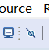
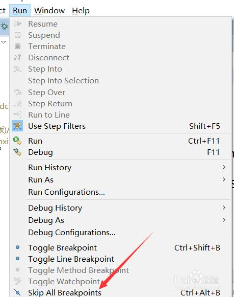
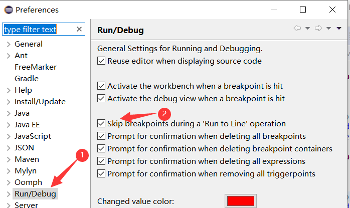
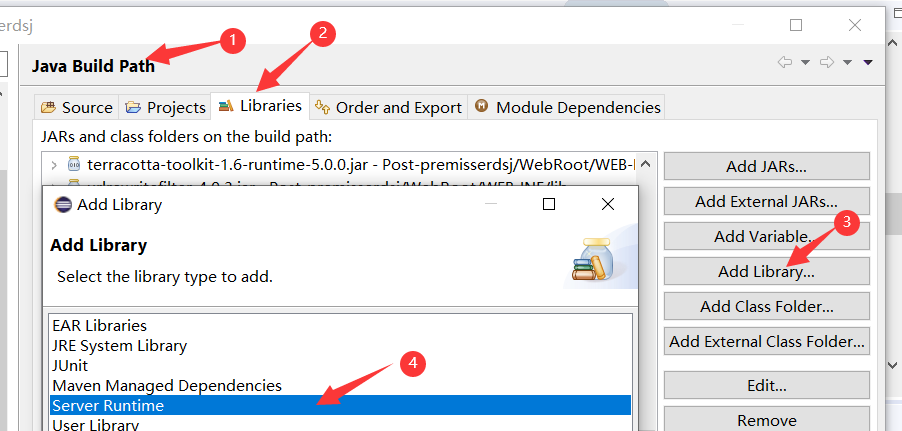
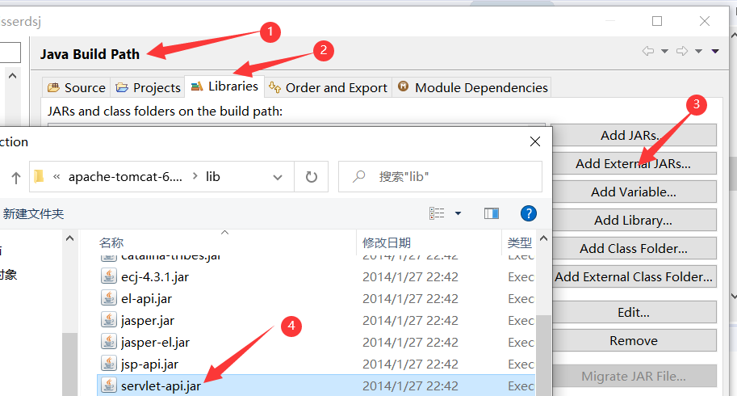
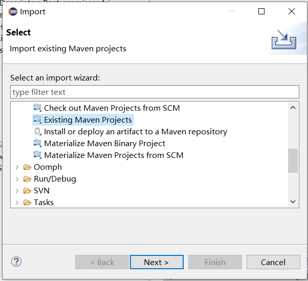
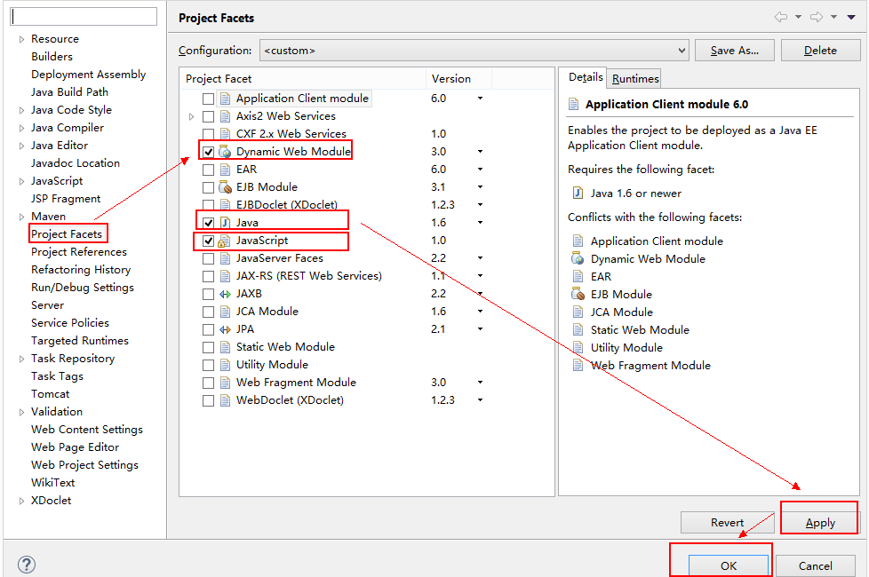
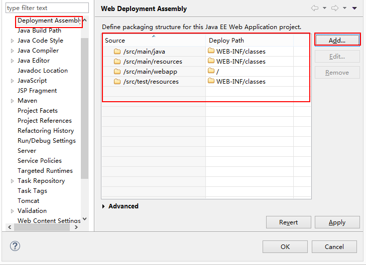
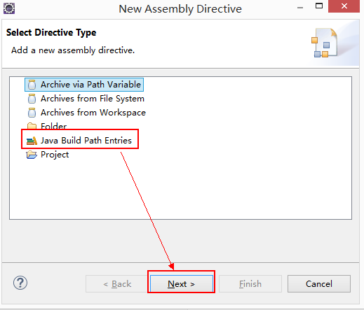
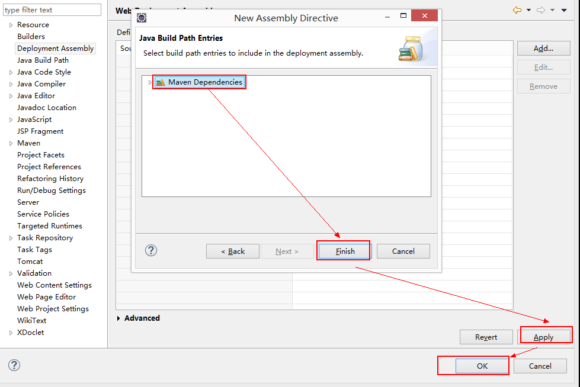

[Toc]

# Debug失效

- **问题详情**

  > 使用eclipse以debug方式启动一个web项目，发现项目中的断点都直接跳过去了

- **解决方案**

  1. 查看是否选择`skip all breakpoints`
     

     

  2. 勾选`Skip breakpoints during a 'Run to Line' operation  `



# 启动Tomcat报错

- **环境&问题说明**

```
环境说明：
eclipse版本  2019-09 R (4.13.0)
JDK:1.6
Tomcat: 6.0

问题说明：配置好项目对应的jdk和使用的Tomcat后，启动Tomcat Servelet，一启动便报错，报错信息部分如下：

2022-2-7 15:48:18 org.apache.catalina.core.StandardContext listenerStart
严重: Error configuring application listener of class hd.core.framework.spring.listener.SpringAppListener
java.lang.Error: Unresolved compilation problems: 
	The import javax.servlet.ServletContextEvent cannot be resolved
	The import javax.servlet.ServletContextListener cannot be resolved
	ServletContextListener cannot be resolved to a type
	ServletContextEvent cannot be resolved to a type
	ServletContextEvent cannot be resolved to a type
```

- **原因**

> 没有导入servlet-api.jar，缺少servlet-api.jar包导致编译错误。一般来说，创建一个servlet,通常是需要servlet.api-jar和jsp-api.jar的支持

- **解决方案**：Build Path添加servlet-api.jar或者添加Server Runtime
  - **方案1**：添加Server Runtime



- - **方案2**：添加servlet-api.jar包




# 导入Maven Web项目

## 1. 导入Maven项目

- 在项目空白处右击，选中【Import】,
  

## 2. 将Maven项目转为Web项目

选中导入的Maven项目转换成一个Dynamic Web Module: 选中Maven项目右击，选中最后一项【Properties】在左边的列表中选择

【project facets】



## 3. 添加Maven Dependencies

继续右键项目->properties->Deployment Assembly，如图中红框所示，只有src下的四个文件夹：



点击Add后如图所示：






由以上的3步，导入的Maven项目就转化为一个可运行的web项目了。

然后再新建一个Web Server,这需要将Tomcat安装好，并且被整合进Eclipse中，这样就可以创建Web Server了，在创建好Web Server后，右键我们导入的项目，选择“Run As”，选择Run on Server就可以了.右键项目->run on server即可。

# 修改项目SVN路径

- **场景描述**
  项目svn路径发生改变，需要重新修改项目的提交&更新路径

- **解决方案**

  1. 右键点击项目--->Team--->断开连接--->选择“并且从文件系统中删除svn元信息”--->Yes

     可以看到项目后面的地址没有了

  2. 右键点击项目--->Team--->Share Project--->选择SVN--->选择创建新的资源库位置--->输入改变后的svn URL--->finish即可

  这样就完成了svn地址切换，关联完成会同步项目，显示本地资源与svn服务器不同。


# 参考资料

1. https://www.itdaan.com/blog/2017/09/11/42289157e165c9c5e69f262c27f4fdae.html
2. https://blog.csdn.net/w12345_ww/article/details/52094756
3. https://blog.csdn.net/qq_26673953/article/details/51202036