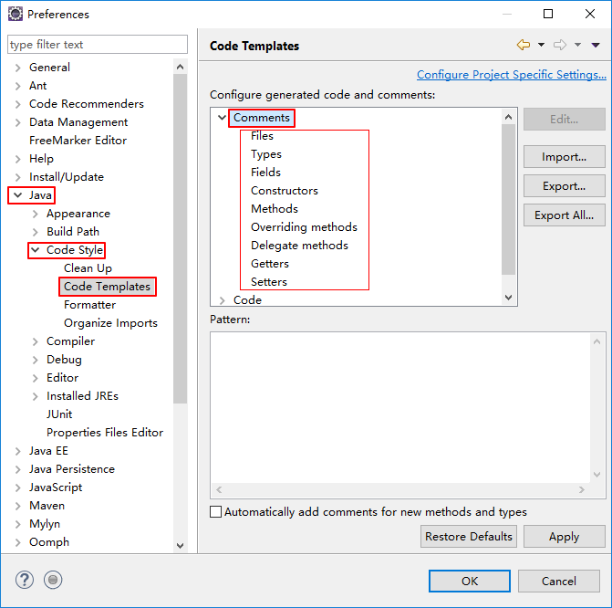
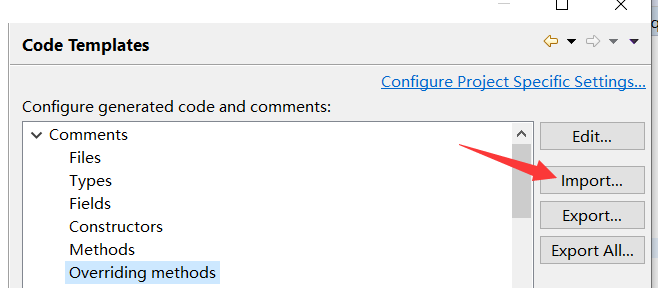

[Toc]

# Eclipse注释模板设置

设置注释模板的：Window --> Preference --> Java->Code Style --> Code Template
然后展开Comments节点就是所有需设置注释的元素。本文现就每一个元素逐一给大家介绍一下。

　　

## 文件(Files)注释标签：

```perl
/**
 * @Title: ${file_name}
 * @Package ${package_name}
 * @Description: ${todo}(用一句话描述该文件做什么)
 * @author ${user}
 * @date ${date}
 * @version V1.0
 */
```

## 类型(Types)注释标签（类的注释）：

```perl
/**
 * @ClassName: ${type_name}
 * @Description: ${todo}(这里用一句话描述这个类的作用)
 * @author ${user}
 * @date ${date}
 *
 * ${tags}
 */
```

## 字段(Fields)注释标签：

```php
/**
 * @Fields field:field:{todo}(用一句话描述这个变量表示什么)
 */
```

## 构造函数(Constructor)标签：

```bash
/**
 * 创建一个新的实例 ${enclosing_type}
 *
 * ${tags}
 */
```

## 方法(Methods)标签：

```perl
/**
 * @Title: ${enclosing_method}
 * @Description: ${todo}(这里用一句话描述这个方法的作用)
 * @param ${tags} 参数
 * @return ${return_type} 返回类型
 * @throws
 */
```

## 覆盖方法(Overriding Methods)标签：

```xml
/* (非 Javadoc)
 * <p>Title: ${enclosing_method}</p>
 * <p>Description: </p>
 * ${tags}
 * ${see_to_overridden}
 */
```

## 代理方法(Delegate Methods)标签：

```bash
/**
 * ${tags}
 * ${see_to_target}
 */
```

getter方法标签：

```bash
/**
 * @return ${bare_field_name}
 */
```

setter方法标签：

```php
/**
 * @param paramtheparamthe{bare_field_name} to set
 */
```

随便选择一个，下方【Pattern】区域会显示类注释模板内容，点击右则的【Edit】按钮可以对注释模板内容进行修改。
选择【Insert Variable】可以对【Pattern】中的【Title】值进行设置修改。

## 模板文件

如果都想要实现上面的注释模板，逐个改可能很麻烦，这需要将下面的配置文件导入就可以了：
新建一个xml文件，名字命名为codetemplates（名字可以随便命名）
把下面的内容放到xml文件中即可。

[模板文件范例](./files/java_code_formatter.zip)

```xml
<?xml version="1.0" encoding="UTF-8" standalone="no"?>
<templates>
	<template autoinsert="false" context="gettercomment_context" deleted="false" description="Comment for getter method" enabled="true" id="org.eclipse.jdt.ui.text.codetemplates.gettercomment" name="gettercomment">
		/**
		 * @return ${field}
		 */
	 </template>
	 <template autoinsert="false" context="settercomment_context" deleted="false" description="Comment for setter method" enabled="true" id="org.eclipse.jdt.ui.text.codetemplates.settercomment" name="settercomment">
		 /**
		 * @param ${param}
		 */
	 </template>
	 <template autoinsert="false" context="constructorcomment_context" deleted="false" description="Comment for created constructors" enabled="true" id="org.eclipse.jdt.ui.text.codetemplates.constructorcomment" name="constructorcomment">
		 /**
		 * @description 
		 * ${tags}
		 */
	 </template>
	 <template autoinsert="false" context="filecomment_context" deleted="false" description="Comment for created Java files" enabled="true" id="org.eclipse.jdt.ui.text.codetemplates.filecomment" name="filecomment">
		 /**&#13;
		 * &#13;
		 * @author JoySun&#13;
		 * @date ${date}${time}&#13;
		 */
	 </template>
	 <template autoinsert="false" context="typecomment_context" deleted="false" description="Comment for created types" enabled="true" id="org.eclipse.jdt.ui.text.codetemplates.typecomment" name="typecomment">
		 /**
		 * 
		 * @author JoySun
		 * @date ${currentDate:date('yyyy-MM-dd HH:mm')}
		 */
	 </template>
	 <template autoinsert="false" context="fieldcomment_context" deleted="false" description="Comment for fields" enabled="true" id="org.eclipse.jdt.ui.text.codetemplates.fieldcomment" name="fieldcomment">
		 /**
		 * @fields ${field} 
		 */
	 </template>
	 <template autoinsert="false" context="methodcomment_context" deleted="false" description="Comment for non-overriding methods" enabled="true" id="org.eclipse.jdt.ui.text.codetemplates.methodcomment" name="methodcomment">
		 /**
		 * 
		 * @author JoySun
		 * ${tags}
		 * @date ${date}${time}
		 */
	 </template>
	 <template autoinsert="false" context="overridecomment_context" deleted="false" description="Comment for overriding methods" enabled="true" id="org.eclipse.jdt.ui.text.codetemplates.overridecomment" name="overridecomment">
		 /* (non-Javadoc)
		 * ${see_to_overridden}
		 */
	 </template>
	 <template autoinsert="true" context="delegatecomment_context" deleted="false" description="Comment for delegate methods" enabled="true" id="org.eclipse.jdt.ui.text.codetemplates.delegatecomment" name="delegatecomment">
		 /**
		 * ${tags}
		 * ${see_to_target}
		 */
	 </template>
	 <template autoinsert="false" context="newtype_context" deleted="false" description="Newly created files" enabled="true" id="org.eclipse.jdt.ui.text.codetemplates.newtype" name="newtype">
		${filecomment}
		${package_declaration}
		/**
		 * 
		 * @author JoySun
		 * @date ${date}${time}
		 */
		${typecomment}
		${type_declaration}
	</template>
	<template autoinsert="true" context="classbody_context" deleted="false" description="Code in new class type bodies" enabled="true" id="org.eclipse.jdt.ui.text.codetemplates.classbody" name="classbody">
	</template>
	<template autoinsert="true" context="interfacebody_context" deleted="false" description="Code in new interface type bodies" enabled="true" id="org.eclipse.jdt.ui.text.codetemplates.interfacebody" name="interfacebody">
	</template>
	<template autoinsert="true" context="enumbody_context" deleted="false" description="Code in new enum type bodies" enabled="true" id="org.eclipse.jdt.ui.text.codetemplates.enumbody" name="enumbody">
	</template>
	<template autoinsert="true" context="annotationbody_context" deleted="false" description="Code in new annotation type bodies" enabled="true" id="org.eclipse.jdt.ui.text.codetemplates.annotationbody" name="annotationbody">
	</template>
	<template autoinsert="true" context="catchblock_context" deleted="false" description="Code in new catch blocks" enabled="true" id="org.eclipse.jdt.ui.text.codetemplates.catchblock" name="catchblock">
		// ${todo} Auto-generated catch block
		${exception_var}.printStackTrace();
	</template>
	<template autoinsert="true" context="methodbody_context" deleted="false" description="Code in created method stubs" enabled="true" id="org.eclipse.jdt.ui.text.codetemplates.methodbody" name="methodbody">
		// ${todo} Auto-generated method stub
		${body_statement}
	</template>
	<template autoinsert="true" context="constructorbody_context" deleted="false" description="Code in created constructor stubs" enabled="true" id="org.eclipse.jdt.ui.text.codetemplates.constructorbody" name="constructorbody">
		${body_statement}
		// ${todo} Auto-generated constructor stub
	</template>
	<template autoinsert="true" context="getterbody_context" deleted="false" description="Code in created getters" enabled="true" id="org.eclipse.jdt.ui.text.codetemplates.getterbody" name="getterbody">
		return ${field};
	</template>
	<template autoinsert="true" context="setterbody_context" deleted="false" description="Code in created setters" enabled="true" id="org.eclipse.jdt.ui.text.codetemplates.setterbody" name="setterbody">
		${field} = ${param};
	</template>
</templates>
```

**导入模板文件**



## 时间格式设置

```
### 格式化日期
/*
 *
 * @author JoySun
 * ${currentDate:date('yyyy-MM-dd HH:mm')}
 */
 
 ### 中文日期
  /**
  * 
  * @author JoySun
  * @date ${date}${time}
  */

```

