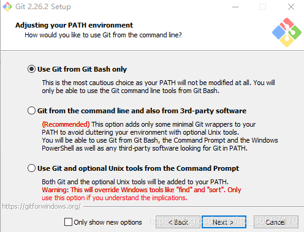

[toc]

###  1. 前期准备

> 1.1. GitHub 账号；

> 1.2. [Git for Windows ](https://gitforwindows.org/) 客户端下载&安装；安装中需注意选项：

​	

> 这个是决定**是否把git命令放到path中**，若加入到path之后，gitbash可能会变得反应特别慢。
>
> 选这个`use git from git bash only`就是不将git命令加到path中


### 2. 用户配置

> 打开git bash,执行以下命令
>
> ```
> git config --global user.name "Your Name"  //（注意前边是“- -global”，有两个横线）
> git config --global user.email "email@example.com"
> 
> ```

#### 提交代码不输入账号密码配置

- **方案1**

  > 1. **在你的用户目录下新建一个文本文件`.git-credentials`**
  >
  >    - **`Windows`：`C:/Users/username`**
  >    - **`Mac OS X`： `/Users/username`**
  >    - **`Linux`： `/home/username`**
  >      注意：鼠标右键新建文件`重复命名`是成功不了的，需要借助`Sublime`等`IDE`工具来创建文件。
  >
  > 2. **`.git-credentials`在文件中输入以下内容：**
  >
  >    ```
  >    https:{username}:{password}@github.com
  >    ```
  >
  >    `{username}`和`{password}`是你的`github`的`账号`和`密码`
  >
  > 3. **修改`git`配置**
  >    执行命令：
  >
  >    ```
  >    git config --global credential.helper store
  >    ```
  >
  >    上述命令会在`.gitconfig`文件(`.gitconfig`与`.git-credentials`在同目录下)末尾添加如下配置:
  >
  > 4. 经过上述三步配置之后, 你`push代码`到github时, 便`无需再输入用户名密码`了

- **方案2**

  > 1. 在命令行输入命令:
  >
  >    ```
  >    git config --global credential.helper store
  >    ```
  >
  >    这一步会在用户目录下的`.gitconfig`文件最后添加：
  >
  >    ```
  >    [credential]
  >        helper = store
  >    ```
  >
  > 2. git push 代码
  >    `push`你的代码 (`git push`), 这时会让你输入`用户名`和`密码`, 这一步输入的用户名密码会被`记住`, 下次再push代码时就不用输入用户名密码!这一步会在用户目录下生成文件`.git-credential`记录用户名密码的信息。

### 3. 建立连接

#### 配置SSH

**3.1. 检查你电脑上是否有SSH Key**

> ```
> ~/.ssh` 或者用`~/.ssh ls
> ```
>
> 上边这行命令的作用是看一哈你的电脑上有没有.ssh文件夹。
>
> - 如果电脑上**有**，就会显示**bash: /c/Users/…/.ssh: Is a directory**
> - 如果电脑上**没有**，那就显示**bash: /c/Users/…/.ssh: No such file or directory**

**3.2. 创建SSH Key**

> > 如果你电脑上有了，你就可以直接跳过这一步
>
> 在Git Bash中输入
> `$ ssh-keygen -t rsa -C "你的邮箱"`
> 
>
> 然后就会显示这两行：
> **Generating public/private rsa key pair.
> Enter file in which to save the key (/c/Users/16627/.ssh/id_rsa):**
>
> 这是让你输入一个文件名，用于保存刚才生成的 SSH key 代码。为了避免麻烦，不用输入，直接回车，那么就会默认生成id_rsa和id_rsa.pub两个秘钥文件。
> 这时候已经创建好.ssh这个文件夹了，会提示：
> **Created directory ‘/c/Users/16627/.ssh’.**
> 紧接着又会问你：
> **Enter passphrase (empty for no passphrase):**
> 就是让你输入密码，如果你设置了密码，那在你使用ssh传输文件的时候，你就要输入这个密码。为了避免麻烦，建议不用设置，直接回车。
> **Enter same passphrase again:**
> 这就是让你再输入一次密码，就跟我们注册账号时候设置密码需要设置两次一样。上一步没设置密码，这里直接回车就可以了。到这里你的秘钥就设置好了，你会收到这段代码提示：
> **Your identification has been saved in /c/Users/…/.ssh/id_rsa
> Your public key has been saved in /c/Users/…/.ssh/id_rsa.pub**
> 还会向你展示你的秘钥长啥样
> 
> 当你看到上面这段代码，那就说明你的 SSH key 已经创建成功，你可以再使用`~/.ssh`看一下，现在文件是真的存在了。
> 
>

**3.3. 添加SSH Key到GitHub**
> 首先打开Github网页
> 
> 
>
> 点击右上角新建一个SSH Key。
> 
> title随便给他起个名字就好。然后是key，这时候你要打开你刚才在电脑上的SSH key。
> 还记得这一步吗：
> 
> 按照红框框里的路径，找到.ssh文件夹。用记事本打开id_rsa.pub文件，全选其中的内容粘贴到网页的Key中。
> 

**3.4. 测试一下该SSH key**

> 在git Bash 中输入以下代码
> `$ ssh -T git@github.com`
> **注意是git@github.com，不是你的邮箱。**
> 然后会提示你：
> **The authenticity of host ‘github.com (13.229.188.59)’ can’t be established.
> RSA key fingerprint is SHA256:nThbg6kXUp…**
> **Are you sure you want to continue connecting (yes/no/[fingerprint])?**
> 输入yes，回车
> 
> 接下来就会提示你输入密码，如果上边设置ssh的时候，你没设置密码会提示你：
**Warning: Permanently added ‘github.com,192.30.255.112’ (RSA) to the list of known hosts.**
警告完了，如果你能看到如下提示，那你已经成功设置SSH密钥。
**Hi “用户名”! You’ve successfully authenticated, but GitHub does not provide shell access.**
如果你看到 **access denied**，者表示拒绝访问，那么你就需要使用 https 去访问。

### 4.新建远程仓库

> 1. 打开github右上角，点击new repository
>    
>    

> 2. 复制仓库地址
>
>    

### 5. 本地上传操作

**5.1.  在本地空文件夹内，右键选择Git Bash Here**

**5.2. 克隆远程仓库**

>  在弹出的·`git bash`窗口中输入命令：
> 
```shell
git clone + 你的仓库地址
git clone  https://github.com/Qingmu0323/boke.git  
```

> 执行后，会看到GitHub仓库里的文件

**5.3 . 将需要上传的文件/文件夹，复制到远程仓库文件夹内**

**5.4. 上传**

> 依次输入以下命令：

```shell
cd  boke     //根据自己的远程仓库名输入，若是本就在该目录下可省略
git init  //若已初始化，可省略；查看文件夹里是否有.git的隐藏文件
git add .  //根据不同情况，有不同选项
git commit -m “你的提交信息”
git push
```

### 6. 常用命令

> 默认的远程仓库服务器为：origin

```
mkdir        XX (创建一个空目录 XX指目录名)
pwd          显示当前目录的路径
ls <-a,-l,al>     查看目录 -a 会显示隐藏文件，-l 可查看更多的文件信息，如文件日期等，
git init          初始化本地仓库，在当前目录下生成 .git 文件夹

git add <file>      把<file>文件/文件夹下内容添加到暂存区去
git add +文件名.文件类型           将某个文件加到缓存区
git add +文件名.文件类型 ...       文件名.文件类型 ，将n个文件添加到缓存区
git add xx文件夹/*.html        将xx文件夹下的所有的html文件添加到缓存区。
git add *hhh                 将以hhh结尾的文件的所有修改添加到暂存区
git add Hello*             将所有以Hello开头的文件的修改添加到暂存区
git add -u             提交被修改(modified)和被删除(deleted)文件，不包括新文件(new)
git add --update [<文件路径>]  提交被修改(modified)和被删除(deleted)文件，不包括新文件(new)
git add .           添加所有更改到暂存区
git add -A          添加所有修改、已删除、新增的文件到暂存区中，省略 <文件路径> 即为当前目录
git add -i [<文件路径>]  查看所有修改、已删除但没有提交的文件，进入一个子命令系统
git add --interactive [<文件路径>]  查看所有修改、已删除但没有提交的文件，进入一个子命令系统

git status        查看仓库状态
git commit     把暂存区中的文件提交到本地仓库，调用文本编辑器输入该次提交的描述信息
git commit -m "<提交的描述信息>"     把暂存区中的文件提交到本地仓库中并添加描述信息
git commit -a -m "<提交的描述信息>"    把所有修改、已删除的文件提交到本地仓库中  不包括未被版本库跟踪的文件，等同于先调用了 "git add -u"
git commit --amend   修改上次提交的描述信息
git push –u(第一次要用-u 以后不需要) origin master 把当前master分支推送到远程库
 git push <remote> <branch> 推送到远程仓库分支；remote:远程仓库名，默认origin;branch:分支名

git ls-remote <remote> 显式地获得远程引用的完整列表
git remote show origin       查看远程服务器仓库origin状态
git remote  rm  origin                  -- 删除远程仓库
git remote  列出已经存在的远程仓库
git remote -v   列出远程仓库的详细信息，在别名后面列出URL地址
git remote --verbose  列出远程仓库的详细信息 
git remote add <远程仓库的别名> <远程仓库的URL地址>  添加远程仓库
git remote rename <原远程仓库的别名> <新的别名>   修改远程仓库的别名
git remote remove <远程仓库的别名>  删除指定名称的远程仓库
git remote set-url <远程仓库的别名> <新的远程仓库URL地址>  修改远程仓库的 URL 地址

git clone [urlPath, SSHPath]  默认在当前目录下创建和版本库名相同的文件夹并下载版本到该文件夹下
git clone <远程仓库的网址> <本地目录>  指定本地仓库的目录
git clone <远程仓库的网址> -b <分支名称> <本地目录>  -b 指定要克隆的分支，默认是master分支
git pull  从远程仓库获取最新版本并合并到本地。首先会执行 git fetch，然后执行 git merge，把获取的分支的 HEAD 合并到当前分支。
git pull origin master  把远端origin的master分支的最新版本拉取到本地，自动merge
git fetch origin master  把远端origin的master分支的最新版本拉取到本地，不merge，较安全
git fetch <远程仓库的别名>   将远程仓库所有分支的最新版本全部取回到本地
git fetch <远程仓库名> <分支名>   将远程仓库指定分支的最新版本取回到本地
git checkout -- <file>   把XX文件在工作区的修改全部撤销
git merge --no-ff  origin 20170701  合并分支，如用冲突通过合并分支时必须使用--no-ff参数，以保留合并历史轨迹

git reset HEAD 文件名        把暂存区的修改回归到工作区
git reset -- hard HEAD^[^^,^^^]       回退几个版本，有几个^就表示回退几个版本
git reset  –hard HEAD~100      回退100个版本，可以是任意数字
git reset HEAD <file>...  提交代码时，add了多余的文件，想回退取消，则可以使用命令
git reset HEAD^   回退所有内容到上一个版本（本地修改代码不变）
git reset –soft HEAD~3   向前回退到第3个版本
git reset HEAD^ a   回退a 这个文件的版本到上一个版本（本地修改代码不变）
git reset id  回退到某个版本（本地修改代码不变） - 首先    git log 查看版本 id然后回退到某个版本
git reset --hard  HEAD^  将本地的状态回退到上个版本（本地修改丢失）
git reset --hard  XXXXXXX  将本地的状态回退到某个版本（本地修改丢失）
git reset –hard origin/master 将本地的状态回退到和远程的一样


git revert HEAD   撤销前前一次 commit
git revert commit-id    撤回指定commit-id#比如：git revert 0818badf6882ea2664a205bc8ef3a85425bb2537
git revert --continue    git提示有冲突要解决，继续保留冲突
git revert --abort    取消撤回

git diff  <file>      查看同一个文件修改了那些内容
git  diff         --比较暂存区和工作区差异
git  diff  --cached       --比较暂存区和历史的差异
git  diff  master       --比较最新历史区和工作区的差异
git diff <commit ID>  查看从指定的版本之后改动的内容
git diff <分支名称> <分支名称>   比较两个分支之间的差异
git diff <分支名称>...<分支名称>   查看两个分支分开后各自的改动内容
git log          查看历史记录
cat <file>        查看文件内容
git reflog      查看历史记录的版本号id

git rm <file>          删除文件
git merge dev    在当前的分支上合并dev分支

git checkout –b dev  创建dev分支 并切换到dev分支上
git checkout <分支名称>  切换到已存在的指定分支 
git checkout -b <分支名称>    创建并切换到指定的分支，保留所有的提交记录  等同于 "git branch" 和 "git checkout" 两个命令合并
git checkout --orphan <分支名称>  创建并切换到指定的分支，删除所有的提交记录
git checkout <文件路径>  替换掉本地的改动，新增的文件和已经添加到暂存区的内容不受影响

git branch  查看当前所有的分支，当前所在分支以 "*" 标出
git branch –d dev 删除dev分支
git branch name  创建分支
git branch -v  列出本地的所有分支并显示最后一次提交，当前所在分支以 "*" 标出
git branch <分支名>
git branch -m [<原分支名称>] <新的分支名称>    修改分支名称 如果不指定原分支名称则为当前所在分支
git branch -M [<原分支名称>] <新的分支名称>  强制修改分支名称
git branch -d <分支名称>  删除指定的本地分支，若有未合并工作，会删除失败
git branch -D <分支名称>  强制删除指定的本地分支
git branch --merged 已经合并到当前分支的分支
git branch --no-merged 尚未合并到当前分支的分支
git branch --no-merged master 未合并到master分支的分支

git stash 把当前的工作隐藏起来 等以后恢复现场后继续工作
git stash list 查看所有被隐藏的文件列表
git stash apply 恢复被隐藏的文件，但是内容不删除
git stash drop 删除文件
git stash pop 恢复文件的同时 也删除文件
git push origin master  Git会把master分支推送到远程库对应的远程分支上
git push origin --delete serverfix  从服务器上删除 serverfix 分支，基本上这个命令做的只是从服务器上移除这个指针。 Git 服务器通常会保留数据一段时间直到垃圾回收运行，所以如果不小心删除掉了，通常是很容易恢复的。

git help config  获得 git config 命令的手册
git add -h  获得add参考资料
```

### 7. 报错集结

#### 公库可以提交，私库无法提交

1. **场景描述**：在github上创建了一个公有库，一个私有库。公有库可以正常提交文件，私有库无法push数据。报错信息如下

   ```
   ### push时报错
   12613@DESKTOP-427LQB7 MINGW64 /e/JoyNotes (master)
   $ git push
   Enumerating objects: 103, done.
   Counting objects: 100% (103/103), done.
   Delta compression using up to 8 threads
   Compressing objects: 100% (102/102), done.
   fatal: 'EvolutionApp' does not appear to be a git repository
   fatal: Could not read from remote repository
   
   ### 测试使用ssh链接git@github.com，提示如下：表明允许ssh链接成功
   $ ssh -T git@github.com //提示
   Hi joySun622! You've successfully authenticated, but GitHub does not provide shell access.
   ```

   **原因探索**

   > 1. key值串用了？
   >    每个库都可以设置一个deploy key值，如果一个库设置了deploykey值，而另一个库也使用了这个deploy key，就会提示：
   >    Permission to user/repo denied to user/other-repo。目前遇到的情况，和这个还是不一样的。我并没有设置deploy key，直接使用的生成的ssh公钥访问git hub，和这个还是不一样的。
   >
   >    
   >
   > 2. 检查远程链接接是否存在或者存在异常:未发现异常
   >
   >    ```
   >    $ git remote -v 
   >    origin  git@github.com:test/JoyNotes.git (fetch)
   >    origin  git@github.com:test/JoyNotes.git (push)
   >    ```

   **解决方案1**：添加SSH 私钥到ssh-agent.此方案试了下，生效了。
   参考官方说明：使用ssh-add将私有key添加到ssh-agent

   > ### [Adding your SSH key to the ssh-agent](https://docs.github.com/en/free-pro-team@latest/github/authenticating-to-github/generating-a-new-ssh-key-and-adding-it-to-the-ssh-agent#adding-your-ssh-key-to-the-ssh-agent)
   >
   > Before adding a new SSH key to the ssh-agent to manage your keys, you should have [checked for existing SSH keys](https://docs.github.com/en/free-pro-team@latest/articles/checking-for-existing-ssh-keys) and [generated a new SSH key](https://docs.github.com/en/free-pro-team@latest/articles/generating-a-new-ssh-key-and-adding-it-to-the-ssh-agent#generating-a-new-ssh-key).
   >
   > If you have [GitHub Desktop](https://desktop.github.com/) installed, you can use it to clone repositories and not deal with SSH keys.
   >
   > 1. Ensure the ssh-agent is running. You can use the "Auto-launching the ssh-agent" instructions in "[Working with SSH key passphrases](https://docs.github.com/en/free-pro-team@latest/articles/working-with-ssh-key-passphrases)", or start it manually:
   >
   >    ```shell
   >    # start the ssh-agent in the background
   >    $ eval $(ssh-agent -s)
   >    > Agent pid 59566
   >    ```
   >
   > 2. Add your SSH private key to the ssh-agent. If you created your key with a different name, or if you are adding an existing key that has a different name, replace *id_rsa* in the command with the name of your private key file.
   >
   >    ```shell
   >    $ ssh-add ~/.ssh/id_rsa
   >    ```

   ```
   ### 运行ssh-agent
   $ eval $(ssh-agent -s)
   Agent pid 1652
   ### 添加私有钥到ssh-agent
   $ ssh-add ~/.ssh/id_rsa
   Identity added: /c/Users/12613/.ssh/id_rsa (1260462288@qq.com)
   
   ### Verify that you have a private key generated and loaded into SSH.查看是否添加成功 ，若已添加成功会有侠士
   $ ssh-add -l -E sha256
   3072 SHA256:lXOInERcjuRLX54P7e2gK8aH35jU0wqVkpN1nYhb6Aw 1260462288@qq.com (RSA)
   
   显示已添加成功后，可以正常push文件到私有库了。
   ```

   **解决方案2**：(网上搜索，暂未验证是否有用，先记录下)

   > ```
   > ### 重新设置远程仓库链接
   > $ git remote set-url origin git@github.com:test/thinkphp.git
   > 
   > ### 另一种更改远程仓库链接地址的方式,修改配置文件：编辑其中origin的url，退出时记得保存
   > $ git config -e
   > ```

#### 提交时端口连接超时

- **问题描述**

> `git push`时，提示连接超时，报错信息如下
>
> ```
> 12613@JoysSun MINGW64 /e/study/programNotes (master)
> $ git push
> ssh: connect to host github.com port 22: Connection timed out
> fatal: Could not read from remote repository.
> 
> Please make sure you have the correct access rights
> and the repository exists.
> ```

- **原因探索**

```
### 检测了下22端口连接情况，发现无法连接
12613@JoysSun MINGW64 /e/study/programNotes (master)
$ ssh -T git@github.com
ssh: connect to host github.com port 22: Connection timed out

### 尝试了链接443端口，发现可以连接
12613@JoysSun MINGW64 /e/study/programNotes (master)
$  ssh -T -p 443 git@ssh.github.com
Warning: Permanently added the RSA host key for IP address '[20.205.243.160]:443' to the list of known hosts.
Hi joySun622! You've successfully authenticated, but GitHub does not provide shell access.
```

猜测：22端口因为某种原因，导致连接超时

- **解决方案**

方案1：修改提交文件时的端口

```
### 进入~/.ssh/目录下修改config文件，建议直接在终端中输入vim ~/.ssh/config，使用vim编辑器打开此文件，一般是为空，然后加上以下代码
12613@JoysSun MINGW64 /e/study/programNotes (master)
$ cd ~/.ssh
12613@JoysSun MINGW64 /e/study/programNotes (master)
$ vim config
 Host github.com
    User "1260462288@qq.com" #github用户账号
    port 443  #服务端口
    HostName ssh.github.com  #服务器地址
    PreferredAuthentications publickey #采用公钥
    IdentityFile ~/.ssh/id_rsa
~


ESC键后，输入 :wq  保存退出

### 测试修改是否有效
12613@JoysSun MINGW64 ~/.ssh
$ ssh -T git@github.com
Hi joySun622! You've successfully authenticated, but GitHub does not provide shell access.

```


### 参考资料

1. https://www.cnblogs.com/iisheng/p/13425658.html

2. https://docs.github.com/en/free-pro-team@latest/github/authenticating-to-github/error-agent-admitted-failure-to-sign
3. https://docs.github.com/en/free-pro-team@latest/github/authenticating-to-github/generating-a-new-ssh-key-and-adding-it-to-the-ssh-agent