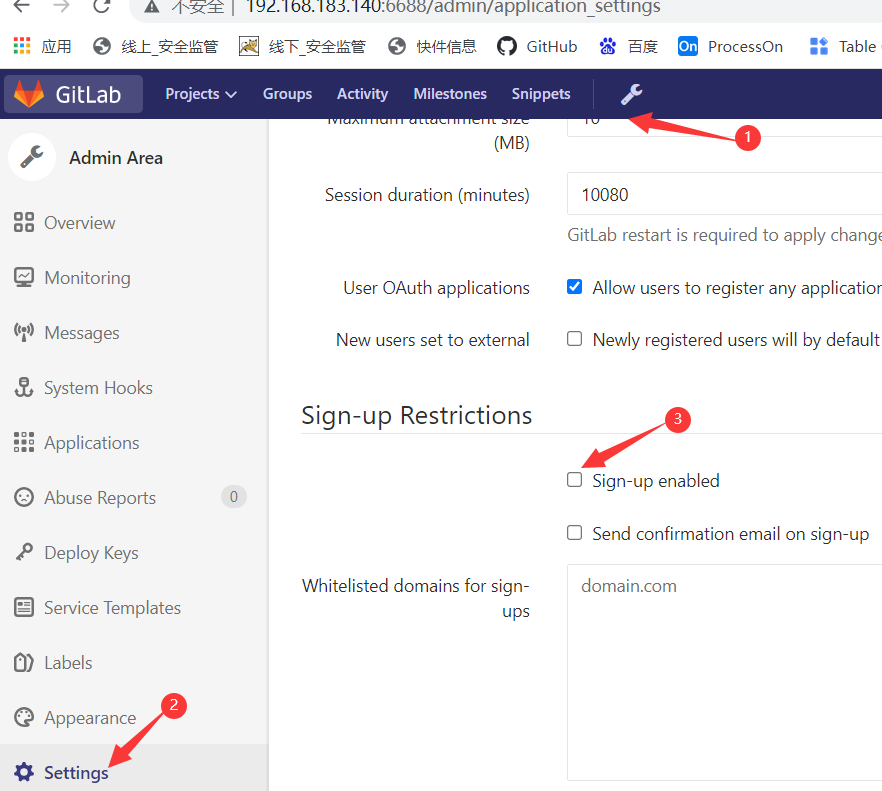

[Toc]

# 在本地搭建GitLab

[官方文档](https://docs.gitlab.com/ee/topics/use_gitlab.html)

## 搭建环境

- 本机系统：win10  
- 虚拟机环境：VMWare Workstation     系统：CentOS 7
- Git Lab 版本：gitlab-ce-14.6.2-ce.0.el8.x86_64

## Linux 安装 Gitlab

### 1.1. 安装 Gitlab 依赖项

```swift
yum install curl openssh-server openssh-clients postfix cronie policycoreutils-python –y
```

### 1.2. 启动 Postfix, 并设置为开机启动

```swift
systemctl start postfix
systemctl enable postfix
```

### 1.3. 设置防火墙

```csharp
firewall-cmd --add-service=http --permanent
firewall-cmd --reload
```

### 1.4. 获取 Github 的 rpm 包

> 找到需要安装版本的rpm包
>
> https://mirrors.tuna.tsinghua.edu.cn/gitlab-ce/yum/el8/

```cpp
wget https://mirrors.tuna.tsinghua.edu.cn/gitlab-ce/yum/el8/gitlab-ce-14.6.2-ce.0.el8.x86_64.rpm
```

### 1.5. 安装 rpm 包

```css
rpm -i gitlab-ce-14.6.2-ce.0.el8.x86_64.rpm
```

### 1.6. 修改配置文件 `gitlab.rb`

```bash
cd /etc/gitlab/gitlab.rb

### 将external_url变量的地址修改为当前机器的ip地址
external_url 'http://192.168.1.2:8080'

如果8080端口被别的服务占用可以改成8081 8082等，如果开启额防火墙，
需要把相应的端口放开：例如：firewall-cmd --zone=public --add-port=8080/tcp --permanent

### 刷新防火墙的规则
iptables -F
```


### 1.7. 重新加载配置内容

```undefined
gitlab-ctl reconfigure  //重新加载配置内容
gitlab-ctl restart  //重启gitlab 服务
gitlab-ctl start  //启动git lab

gitlab-ctl tail  //看日志的，整体的日志，具体某个服务的日志在对于目录里
```

### 1.8. 彻底删除 Gitlab

```
gitlab-ctl stop   //停止gitlab服务
rpm -e gitlab-ce  //卸载git lab
## 杀死进程
ps -ef | grep gitlab
kill -9 
find / -name gitlab | xargs rm -rf  //删除文件
```

# GitLab使用

> 使用自己配置的ip与端口访问git lab; 如：http://192.168.183.140:6688/users/sign_in


## Git Lab目录

```
GitLab目录：
配置文件：/etc/gitlab/gitlab.rb
数据：/var/opt/gitlab/
仓库：/var/opt/gitlab/git-data
备份：/var/opt/gitlab/backups
程序的安装位置：/opt/gitlab
```

## 获取/修改超级管理员root的密码

```
### 1.切换目录 
cd /opt/gitlab/bin
### 2. 查找&切换账户：在irb(main):001:0> 后面通过 u=User.where(id:1).first 来查找与切换账号（User.all 可以查看所有用户）
[root@mysql bin]# gitlab-rails console production
Loading production environment (Rails 4.2.8)
irb(main):001:0> u=User.where(id:1).first
=> #<User id:1 @root>
### 3. 通过u.password='12345678'设置密码为 12345678 (这里的密码看自己喜欢)
irb(main):002:0> u.password='12345678'
#### 4. 通过u.password_confirmation='12345678' 再次确认密码
=> "12345678"
irb(main):004:0> u.password_confirmation='12345678'
### 通过 u.save!进行保存（切记切记 后面的 !）显示为true时，表明设置成功。执行 exit 退出当前设置流程即可
irb(main):009:0> u.save!
Enqueued ActionMailer::DeliveryJob (Job ID: 7707730d-2597-40c7-9f73-099972c536ed) to Sidekiq(mailers) with arguments: "DeviseMailer", "password_change", "deliver_now", gid://gitlab/User/1
=> true
irb(main):010:0> exit

### 5.回到gitlab ,可以通过 root/12345678 这一超级管理员账号登录了
```

## 配置

### 取消登录界面的"注册"功能

`导航条--'扳手'设置--settings--Sign-up Restrictions-sign-up enabled的勾去掉即可--保存退出`



### 修改登录页面定制Log：

```
导航条--'扳手'设置--Appearance--改log和欢迎标语
```


## 创建组&库

```
'组'里有'仓库'，'组'里有'人'，'人'就和'仓库'对应上了
**创建组：
    导航条--'扳手'设置--New Group--输入的路径和名称保持一致，例如"group1"--选Private
    private-组里才能看到，internal-能登录的就能看到，public-都能看到
**创建用户：
导航条--'扳手'设置--New user--输入必填项--确定--点edit设置初始密码
点击"Impersonate"可以模拟用户登录
**把用户加入组里：
导航条--'扳手'设置--Group
Add user to the group:
选择组，选择角色（角色是内置的固定角色）
**建立仓库
建仓库需要选组，设置仓库名称，点击创建即可
仓库加入到组里，组里的用户就能看到组里的仓库了
**
把node1客户机的公钥添加到GitLab的root用户的设置里，
这时，node1客户机就可以推送仓库到master分支。
git remote add gitlab git@10.0.0.11:oldboy/git_test.git  //gitlab是远程仓库名称
git push -u gitlab master
推送成功。
现在，GitLab里就有了master分支了。现在把master分支克隆到第二台客户机node2上
git clone git@10.0.0.11:oldboy/git_test.git
在node2上生成公钥，把node2上的公钥添加到dev用户上
//我们可以配给root，这样node1和node2都会上传到master分支
git remote //自动就有连接了
在node2上建一个分支：
git branch dev
git checkout dev
touch dev
git add .
git commit -m "commit dev"
这里报错，需要创建用户信息：user和email
创建完后，可以推送成功。

**master分支是稳定的，不是谁都能推送到master分支
所以root才有权限推送到master分支，开发人员clone下来之后
必须先创建一个'dev'分支，在'dev'分支上进行推送，推送完后
提交合并分支申请，由root用户去合并到master分支，
这时候，需要把master设置为保护分支，这个分支不能被masters角色之外的用户推送：

root用户登录--在仓库页面--Repository-ProtectedBranches--选择master--选择具有"Masters"角色的人才能合并保护分支
查看角色权限：https://docs.gitlab.com/ee/user/permissions.html

推完后提交合并分支的申请：
点击CreateMergeRequest，有两个必填参数：
1.提交给谁 Assigraee参数 2.哪个分支合并到哪个分支


GitLab仓库的备份和还原：
配置文件中加入(备份)
gitlab_rails['backup_path'] = '/data/backup/gitlab' #备份路径
gitlab_rails['backup_keep_time'] = 604800  #备份文件保存多少秒,这里是7天
###### 赋予权限，这是自动的，不需要设置 ######
# mkdir /data/backup/gitlab
##### chown -Rf git.git /data/backup/gitlab #####
/usr/bin/gitlab-rake gitlab:backup:create  #备份命令
0 2 * * * /usr/bin/gitlab-rake gitlab:backup:create  #加入corntab定时任务

恢复
先删库：找到库--Settings--General--RemoveProject
停止数据写入服务:
gitlab-ctl stop unicorn
gitlab-ctl stop sidekiq
开始恢复：
gitlab-rake gitlab:backup:restore BACKUP=1533732629_2018_08_08_10.2.2  #备份文件只写数字部分
重启服务：
gitlab-ctl restart
```


# 相关概念

> CI/CD:持续集成，开发人员自动化流程
> CI:Continuous Integration 持续集成
> CD:Continuous Delivery  持续交付：完成CI中构建及单元测试和集成测试的自动化流程后，持续交付可自动将已验证代码发布到存储库
> CD:Continuous Deployment 持续部署：对于一个成熟的CI/CD管道来说，最后的阶段是持续部署。


# 参考资料

1. https://www.jianshu.com/p/001bf98139b9
2. https://docs.gitlab.com/omnibus/installation/
3. https://www.cnblogs.com/staff/p/11555061.html