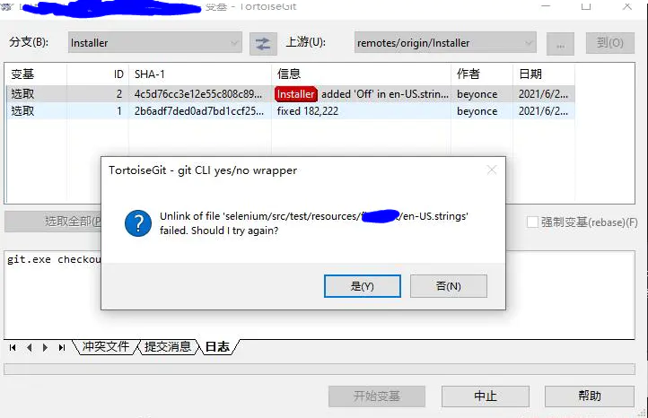
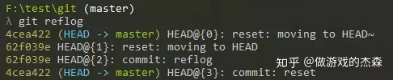
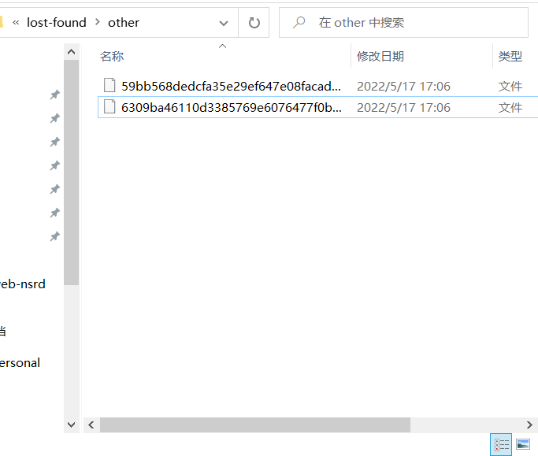
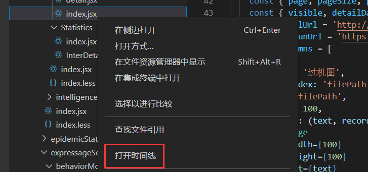

[Toc]

# 常用命令

# git pull 强制覆盖本地的代码

- **场景描述**

> git pull 强制覆盖本地的代码方式，不需要保留本地修改代码的情况

- **解决方案**

> 1. `git fetch --all`  从远程下载最新的，而不尝试合并或[rebase](https://so.csdn.net/so/search?q=rebase&spm=1001.2101.3001.7020)任何东西。
>
> 2. 然后，你有两个选择：
>
>    ```bash
>    git reset --hard origin/master
>    ```
>
>    或者如果你在其他分支上：
>
>    ```bash
>    git reset --hard origin/<branch_name>
>    ```
>
>    git [reset](https://so.csdn.net/so/search?q=reset&spm=1001.2101.3001.7020)将主分支重置为您刚刚获取的内容。 --hard选项更改工作树中的所有文件以匹配origin/master中的文件。

# windows下git显示文件被修改，实际没有改动

- **场景描述**

> 当拉取代码到本地后，没有对代码做任何改动，但是使用`git status`查看代码情况，发现项目的所有文件都提示有改动。

- **原因**

> 1. 不同操作系统使用的换行符是不同导致；
>    Unix/Linux使用的是LF，Mac后期也采用了LF，但Windows一直使用CRLF【回车(CR, ASCII 13, \r) 换行(LF, ASCII 10, \n)】作为换行符。而git入库的代码采用的是LF格式，它考虑到了跨平台协作的场景，提供了“换行符自动转换”的功能：如果在Windows下安装git，在拉取文件时，会自动将LF换行符替换为CRLF；在提交时，又会将CRLF转回LF。但是这个转换是有问题的：有时提交时，CRLF转回LF可能会不工作，尤其是文件中出现中文字符后有换行符时。
> 2. 可能是文件读写等权限的变更

- **解决方案**

> 1. 禁用git的自动换行功能：
>
>    在本地路径C:\ Users\ [用户名] \ .gitconfig下修改git配置[core]，如果没有就直接添加上去：
>
>    ```
>    [core]
>    autocrlf = false  //禁用自动换行
>    filemode = false   //禁用文件读写权限/模式设置的变更
>    safecrlf = true
>    ```
>
> 2. git bash命令行也可以修改，最终也是修改.gitconfig配置文件：分别执行以下命令
>
>         ```
> git config --global core.autocrlf false
> git config --global core.filemode false
> git config --global core.safecrlf true
>         ```
>

# 解决Git 出现 Unlink of file 'xxx' failed. Should I try again.

- **问题描述**

​       出现如下图所示弹框 Unlink of file 'xxxxx'

- **问题原因**
   该版本控制中的文件被其他程序或者IDE调用。导致Git无法对它进行操作。
-  **解决办法**
   关闭IDE或者其他调用该文件的程序。再次点击【是(Y)】按钮进行提交。




# Git 执行reset后恢复误删文件

- **场景描述**

> 执行`git reset`后，一些修改文件夹下的文件也被删除了，但这部分文件是所需要的，需要将误删的文件找回来

- **解决方案1**

> 1. `git reflog` 获取之前所有操作日志
>
> 
>
> 2. **`git reset --hard [索引值]`** 
>
>    ```
>    git reset --soft HEAD^ ：保留工作目录，并把重置 HEAD 所带来的新的差异放进暂存区；
>    git reset --mixed HEAD^ ： reset 如果不加参数 那么默认使用–mixed 参数 。它的行为是：保留工作目录 并且清空暂存区. 也就是说 工作目录的修改、暂存区的内容以及由reset所导致的新的文件的差异，都会被放进工作目录。
>    git reset --hard HEAD^ ： 重置stage区和工作目录，没有commit的修改会被全部丢失，即，工作目录里的新改动和已经add到stage区的新改动全部丢失（慎用！）
>    ```
>
> 3. 输入`git fsck --lost-found` 然后到项目的 `.git/lost-found `文件夹里可以找回部分或者全部的文件 ( `git fsck --lost-found `可以通过一些神奇的方式把曾经add到暂存区过的文件以某种算法算出来加到  .git/lost-found 文件夹里，直接去文件夹里找便可以找到丢失的特殊文件）
>
>    

- **解决方案2**

> 选择项目目录/文件查看VS code 【打开时间线】查看本地历史记录，选择对应的记录进行恢复
>
> 


# git 单个文件回滚到指定版本

## 1 .进入到文件所在文件目录，或者能找到文件的路径

查看文件的修改记录：git log fileName
 `git log pdf_extractor.py`


git log


 ab50632384c452dcfec99c13e7bc64182cee5d0f


## 2.回退到指定版本

git reset 版本号  fileName
 `git reset ab50632384c452dcfec99c13e7bc64182cee5d0f pdf_extractor.py`

## 3.提交到本地参考

git commit -m “提交的描述信息”
 `git commit -m “提交的描述信息”`

## 4.更新到工作目录

git checkout fileName
 `git checkout pdf_extractor.py`


stepp3&4


## 5.提交到远程仓库

git push


# git commit后，如何进行撤销commit操作

- **场景描述**

> 在我们使用git作为版本控制工具进行代码管理之后，经常性的会碰到一个问题：git commit后，如何撤销commit，下面详细讲一下。
>
> git add newFiles
>
> git commit -m '新增xx页面'
>
> 执行commit后，还没执行push时，想要撤销这次的commit，该怎么办？

- **解决方案**
- 

> - 我们可以使用命令：`git reset --soft HEAD^`  这样就成功撤销了commit。
>
> - 使用`git reset --hard HEAD^ ` 这样连add也撤销了。
> - `git reset --hard <commit ID>`回退到某一指定版本，`commitID`可以使用`git log`获取。会直接将所有修改都撤销，直接回退到该指定版本状态
>
> **命令解释**：
>
> ```
> HEAD^ 表示上一个版本，即上一次的commit，几个^代表几次提交，如果回滚两次就是HEAD^^。
> 也可以写成HEAD~1，如果进行两次的commit，想要都撤回，可以使用HEAD~2。
> ```
>
> ```
> --soft
> 不删除工作空间的改动代码 ，撤销commit，不撤销add
> 
> --hard
> 删除工作空间的改动代码，撤销commit且撤销add
> 
> 如果commit后面的注释写错了，先别急着撤销，可以运行git commit --amend 
> 进入vim编辑模式，修改完保存即可
> ```

# `git stash pop`冲突

- **场景描述**

> `git stash pop`后，出现冲突，`git stash list`记录没有删除

- **解决方案**

> **1、解决文件中冲突的的部分，**
>
> 打开冲突的文件，会看到类似如下的内容：
>
> git冲突内容
>
> 其中Updated upstream 和=====之间的内容就是pull下来的内容，====和stashed changes之间的内容就是本地修改的内容。碰到这种情况，git也不知道哪行内容是需要的，所以要自行确定需要的内容。
>
> 解决完成之后，就可以正常的提交了。
>
> **2、删除stash**。**git stash drop <stash@{id}>**  如果不加stash编号，默认的就是删除最新的，也就是编号为0的那个，加编号就是删除指定编号的stash。或者 **git  stash clear** 是清除所有stash,整个世界一下子清净了！

# 撤销 git add

- **场景描述**

> `git add`添加了不必要的内容，需要撤销add 内容

- **解决方案**

> `git reset HEAD` 后面什么都不跟的，就是上一次add 里面的内容全部撤销
> `git reset HEAD XXX` 后面跟文件名，就是对某个文件进行撤销

# 撤销`git rm`操作

- **场景描述**

> `add`文件的时候，不小心把一个不需要提交的也给加上了，但是删除的时候错误使用了`git rm`命令，导致工作区文件被删除。
>
> ```
> / 误删除
> $ git rm XXX/CMakeLists.txt 
> > rm 'XXX/CMakeLists.txt'
> 
> //查看当前状态
> $ git status
> > Changes to be committed:
>   (use "git restore --staged <file>..." to unstage)
>         deleted:    XXXX/CMakeLists.txt
> ```

- **解决方案**

> ```
> $ git reset -- XXXX/CMakeLists.txt
> > Unstaged changes after reset:
> D       XXX/CMakeLists.txt
> # 其实在上面的 git status中，已经提示使用 "git restore --staged <file>..." to unstage
> # 所以这里除了使用reset，也可以使用restore
> $ git checkout -- XXXX/CMakeLists.txt
> ```


# 参考资料来源

1. https://javaforall.cn/112449.html
2. https://www.jianshu.com/p/3d94619fb1d8
3. https://www.jianshu.com/p/551741eb1735
4. https://blog.csdn.net/w_p_wyd/article/details/126028094
5. https://www.pudn.com/news/62f9238a5425817ffc474b31.html