[Toc]

# Gradle安装&配置

> gradle是基于Apache Ant和Apache Maven概念的项目自动化构建开源工具，也提供了很多第三方插件。在Java Web项目中通常会用到 java、war、maven等插件管理项目，实现项目自动构建、jar依赖等功能。
>
> - Binary-only  仅包含二进制
> - Complete  附带源码与文档；如果你使用IDEA的话，它会推荐下载all版，包含源代码，这样IDEA就可以分析源代码，提供更加精确的gradle脚本支持。

## 1. 获取软件包

- [Gradle下载网址](https://docs.gradle.org/current/userguide/installation.html#installing_manually)

进入下载页面，点击【Download】，选择对应版本，选择【binary-only】版本下载

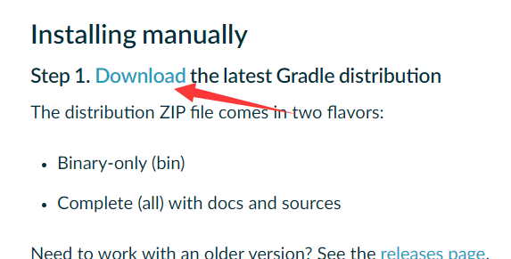

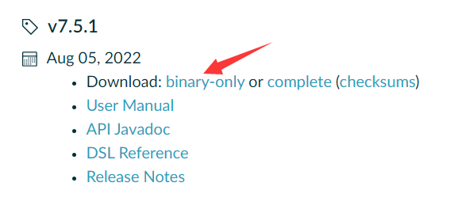

## 2. 安装环境

gradle手动安装时，须先安装 jdk 1.8 或以上版本

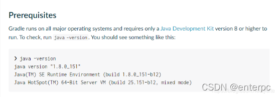

## 3. 解压下载的Granle包

> 解压gradle-7.5.1-bin.zip到任意目录下；如：D:\programApp\gradle-7.5.1

## 4. 配置环境变量

```
设置 GRADLE_HOME 系统变量为gradle目录 D:\programApp\gradle-7.5.1
添加 %GRADLE_HOME%\bin 到 Path 系统变量中
```

## 5. 配置本地仓库与仓库源

### 配置本地仓库

> Gradle和Maven都是当前热门的自动化构建工具。使用Gradle去构建项目，由于没有办法像Maven一样配置Setting文件来修改本地库的位置，我们可以通过设置环境变量`GRADLE_USER_HOME`的路径来改变gradle的本地仓库的位置。
>
> 因为Gradle如果不配置环境变量，则会在用户主目录下（Windows下是C:\Users\xxx目录）创建`.gradle`目录，并将下载的依赖文件保存在这个目录里。
>
> 如果不想使用缺省目录，则可以设置环境变量GRADLE_USER_HOME的路径，就可改变gradle的仓库目录。
>
> 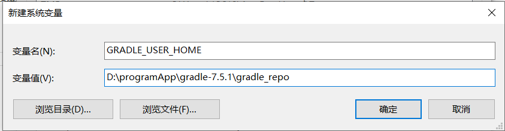
>
> ```
> # 新建环境变量
> 变量名：GRADLE_USER_HOME
> 变量值：自定义Gradle仓库目录或者Maven的仓库目录
> ```

### 配置仓库源

> 在Gradle安装目录下的 init.d 文件夹下，新建一个 init.gradle 文件，里面填写以下配置：
>
> ```
> allprojects {
>     repositories {
>         maven { url 'file:///D:/software/maven/LocalRespority'}
>         mavenLocal()
>         maven { name "Alibaba" ; url "https://maven.aliyun.com/repository/public" }
>         maven { name "Bstek" ; url "https://nexus.bsdn.org/content/groups/public/" }
>         mavenCentral()
>     }
> 
>     buildscript { 
>         repositories { 
>             maven { name "Alibaba" ; url 'https://maven.aliyun.com/repository/public' }
>             maven { name "Bstek" ; url 'https://nexus.bsdn.org/content/groups/public/' }
>             maven { name "M2" ; url 'https://plugins.gradle.org/m2/' }
>         }
>     }
> }
> ```
>
> repositories中写的是获取jar包的顺序：①本地Maven路径。②mavenLocal()是获取Maven本地仓库的路径，和第一条一样，但是不冲突。③④条就是自己的配置的镜像路径。⑤mavenCentral() 是从Apache提供的中央仓库获取jar包
>
> - **配置范例**2
>
> ```
> buildscript { 
> 	repositories { 
> 		maven { url 'https://maven.aliyun.com/repository/gradle-plugin' } 
> 		maven { url 'https://plugins.gradle.org/m2/' }
> 	}
> }
> allprojects {
>     repositories {
>         def ALIYUN_REPOSITORY_URL = 'https://maven.aliyun.com/repository/public/'
>         all { ArtifactRepository repo ->
>             if(repo instanceof MavenArtifactRepository){
>                 def url = repo.url.toString()
>                 if (url.startsWith('https://repo1.maven.org/maven2')||url.startsWith('https://jcenter.bintray.com')) {
>                     project.logger.lifecycle "Repository ${repo.url} replaced by $ALIYUN_REPOSITORY_URL."
>                     remove repo
>                 }
>             }
>         }
>         maven { 
> 			url ALIYUN_REPOSITORY_URL
> 		}
>     }
> }
> ```
>
> 

## 6. 验证是否安装成功

```
打开终端工具cmd，在命令行中执行 gradle -v ；出现版本信息则为安装成功
```

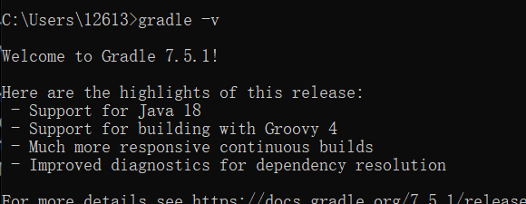

# IDEA配置

## 1. 配置本地Gradle

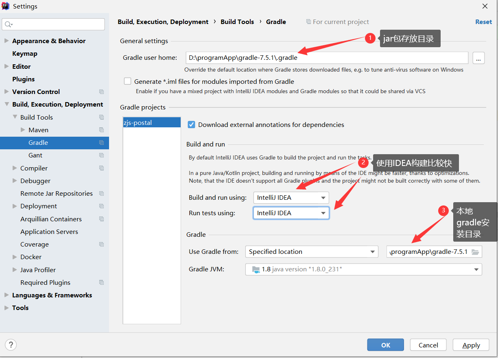

## 2. 导入gradle项目

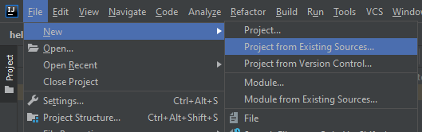

- 选择build.gradle，如果工程中有kotlin这里就是build.gradle.kts

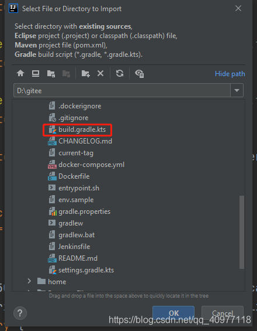


# 下载依赖报错

- **项目导入下载依赖时报错**

```
A problem occurred configuring root project 'zjs-postal'.
> Could not resolve all dependencies for configuration ':classpath'.
   > Using insecure protocols with repositories, without explicit opt-in, is unsupported. Switch Maven repository 'maven(http://maven.aliyun.com/nexus/content/groups/public/)' to redirect to a secure protocol (like HTTPS) or allow insecure protocols. See https://docs.gradle.org/7.5.1/dsl/org.gradle.api.artifacts.repositories.UrlArtifactRepository.html#org.gradle.api.artifacts.repositories.UrlArtifactRepository:allowInsecureProtocol for more details. 
```

- **报错原因**&解决方案

> **gradle版本问题**。项目的gradle版本>7.0,在项目中引用maven插件，会报错，官方提示使用maven-publish插件替换gradle maven 插件从Gradle1.0开始支持，主要为了兼容原来maven项目迁移，在Gradle 6.2 之后，就完全废弃了。
>
> gradle maven-publish 插件，从gradle 1.3 之后开始支持，随着gradle的成熟，为了更好的在gradle上支持maven，重新开发对maven支持且功能更加强大。gradle主推只使用Gradle maven-publish插件，在Android Gradle 插件 3.6.0 及更高版本支持 Maven Publish Gradle 插件，可让您将构建工件发布到 Apache Maven 代码库。
>
> ```
> apply plugin: 'groovy'
> apply plugin: 'maven'
> 
> repositories {
>     mavenCentral()
> }
> 
> dependencies {
>     //xxx
> }
> uploadArchives{
> //    打包成一个jar    引用jar  生成这个三个信息
>     repositories.mavenDeployer {
> //项目名
>         pom.groupId = 'com.x'
>         pom.artifactId = 'modify'
>         pom.version = '1.0.0'
>         repository(url: uri('../repo'))
>     }
> }
> sourceCompatibility = "8"
> targetCompatibility = "8"
> ```
>
> **需要改成**
>
> ```
> //maven插件在gradel7.0 已删除
> apply plugin: 'groovy'
> apply plugin: 'maven-publish'
> // 或者以下写法
> //plugins {
> //  id 'groovy'
> //  id 'maven-publish'
> //}
> 
> 
> dependencies {
> //......略写
> }
> 
> afterEvaluate {
>     publishing {
> //    配置maven-publishing插件的输出物
>         publications {
>             maven(MavenPublication) {
>                 groupId = 'com.x'
>                 artifactId = 'modify'
>                 version = '1.0.0'
>             }
>         }
>         repositories {
>             maven {
>                 url = uri('../repo')
>             }
>         }
>     }
> }
> 
> java {
>     sourceCompatibility = JavaVersion.VERSION_1_8
>     targetCompatibility = JavaVersion.VERSION_1_8
> }
> ```

# IDEA+Gradle搭建Spring Boot项目

## 1. 下载&安装工具

需要用到下面几个工具，请下载安装：

- Java JDK 1.8+ 两个地址选其一：
  国内下载地址：https://oomake.com/download/java-jdk
  官网下载地址：https://www.oracle.com/technetwork/java/javase/downloads/index.html

- IntelliJ IDEA（使用Ultimate版本需自行处理License）Jetbrain官网下载地址：https://www.jetbrains.com/idea/download/

- Gradle安装：https://docs.gradle.org/current/userguide/installation.html

## 2. IDEA创建项目

1、打开 `IDEA`
2、菜单选择 `File > New > Project...`
3、然后选择`Gradle`和`SDK`版本，以及`Java`库，如下：

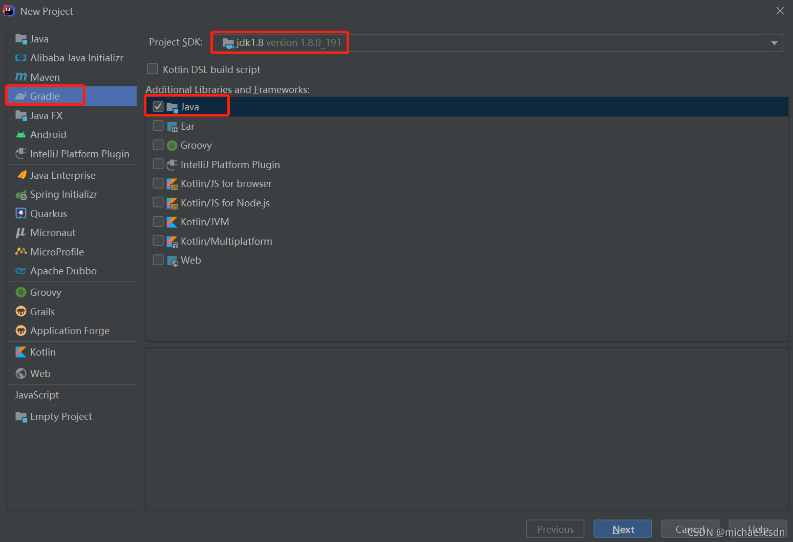

4、输入`GroupId`和`ArtifactId`，这两个是为保证项目唯一性存在的，`GroupId`一般与域名对应，`ArtifactId`则是项目名称，这里我们写的是一个演示功能，设置如下：
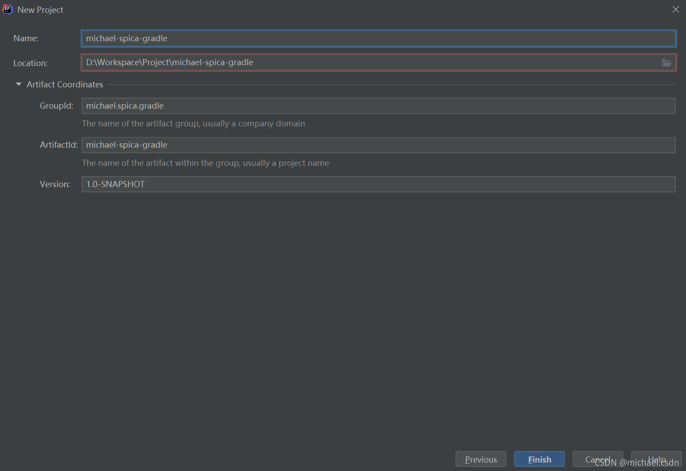
5、接下来的界面直接点`Next`，不需要配置

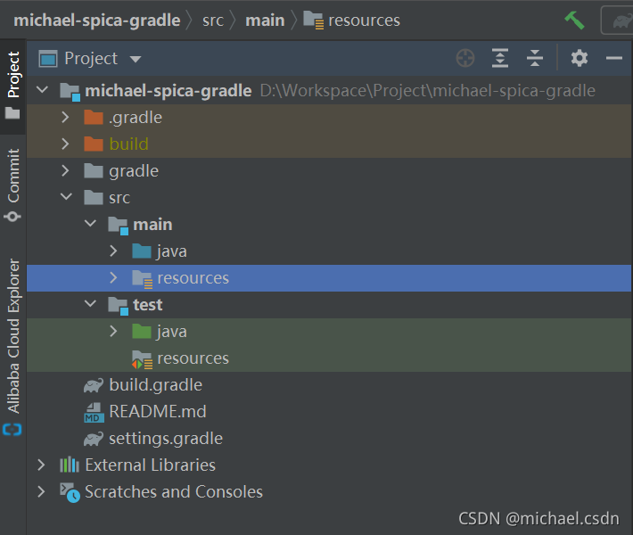

这样我们就创建完项目了，`IDEA`帮我们自动创建了2个文件：`build.gradle`和`settings.gradle`；接下来还需要一些配置

## 3. 配置&依赖

### 1）`build.gradle`配置

打开`build.gradle`文件，自动生成的内容为：

```
plugins {
    id 'java'
}

group 'michael.spica.gradle'
version '1.0-SNAPSHOT'

repositories {
    mavenCentral()
}

dependencies {
    testImplementation 'org.junit.jupiter:junit-jupiter-api:5.6.0'
    testRuntimeOnly 'org.junit.jupiter:junit-jupiter-engine'
}

test {
    useJUnitPlatform()
}

```

需要添加一些内容，添加后`build.gradle`文件内容如下：

```
// gradle 自身需求资源库 放头部
buildscript {
    repositories {
        maven { url 'https://maven.aliyun.com/repository/public' }// 加载其他Maven仓库
        mavenCentral()
    }
    dependencies {
        classpath('org.springframework.boot:spring-boot-gradle-plugin:2.1.1.RELEASE')// 加载插件，用到里面的函数方法
    }
}

// 插件
//plugins {
//    id 'java'
//}

apply plugin: 'java'
apply plugin: 'idea'
// 使用spring boot 框架
apply plugin: 'org.springframework.boot'
// 使用spring boot的自动依赖管理
apply plugin: 'io.spring.dependency-management'

// 版本信息
group 'michael.spica.gradle'
version '1.0-SNAPSHOT'

// 执行项目中所使用的的资源仓库
repositories {
    maven { url 'https://maven.aliyun.com/repository/public' }
    mavenCentral()
}

// 项目中需要的依赖
dependencies {
    // 添加 jupiter 测试的依赖
    testImplementation 'org.junit.jupiter:junit-jupiter-api:5.6.0'
    // 添加 jupiter 测试的依赖
    testRuntimeOnly 'org.junit.jupiter:junit-jupiter-engine'

    // 添加 spring-boot-starter-web 的依赖 必须 排除了security 根据自身需求
    implementation('org.springframework.boot:spring-boot-starter-web') {
        exclude group: 'org.springframework.security', module: 'spring-security-config'
    }

    // 添加 spring-boot-starter-test 该依赖对于编译测试是必须的，默认包含编译产品依赖和编译时依赖
    testImplementation 'org.springframework.boot:spring-boot-starter-test'
    // 添加 junit 测试的依赖
    testImplementation group: 'junit', name: 'junit', version: '4.11'
    // 添加 lombok
    annotationProcessor 'org.projectlombok:lombok:1.18.22' // annotationProcessor代表main下代码的注解执行器
    testAnnotationProcessor 'org.projectlombok:lombok:1.18.22'// testAnnotationProcessor代表test下代码的注解执行器
    compileOnly group: 'org.projectlombok', name: 'lombok', version: '1.18.22' // compile代表编译时使用的lombok
}

// 第二种排除依赖方法
//configurations {
//    compile.exclude group:"org.codehaus.jackson", module:"jackson-mapper-asl" // 排除依赖
//}

test {
    useJUnitPlatform()
}
```

保存文件，`IDEA`提示下载依赖，选择自动下载。

- **项目依赖包配置**(2.x版本依赖的说明，括号里对应的是3.0版本的依赖方式)

> - `compile(api)`使用该方式依赖的库将会参与编译和打包
>
> - `implementation`这个指令的特点就是，对于使用了该命令编译的依赖，对该项目有依赖的项目将无法访问到使用该命令编译的依赖中的任何程序，也就是将该依赖隐藏在内部，而不对外部公开。
>
> - `provided（compileOnly）`只在编译时有效，不会参与打包，可以在自己的moudle中使用该方式依赖。比如`com.android.support，gson`这些使用者常用的库，避免冲突。
>
> - `apk（runtimeOnly）`
>
>   只在生成apk的时候参与打包，编译时不会参与，很少用。
>
> - `testCompile（testImplementation）`
>
>   `testCompile` 只在单元测试代码的编译以及最终打包测试apk时有效。
>
> - `debugCompile（debugImplementation）`
>
>   `debugCompile` 只在debug模式的编译和最终的debug apk打包时有效。
>
> - `releaseCompile（releaseImplementation）`
>
>   `releaseCompile` 仅仅针对Release模式的编译和最终的Release apk打包。

```
dependencies {
	### 引入依赖方式1: compile 'group名:插件名:版本'；gradle 3.0时，compile 指令被标注为过时方法
	compile 'com.jakewharton:butterknife:7.0.1'
	compile group: 'com.alibaba', name: 'fastjson', version: '1.2.83'
	compile fileTree(dir: 'libs', include: ['*.jar']) ## 引入本地jar包
	### 引入依赖方式2
	implementation 'org.springframework.boot:spring-boot-starter-test:3.10.2'
    implementation("org.springframework.boot:spring-boot-starter-test:3.10.2")
    implementation group: 'com.aliyun.oss', name: 'aliyun-sdk-oss', version: '3.10.2'
    implementation files('lib/artemis-http-client-1.1.7.jar') #引入本地包
    ### 引入依赖方式3:和compile等同
    api fileTree(dir: 'libs', include: ['*.jar'])
    ### 测试单元
    testImplementation('org.springframework.boot:spring-boot-starter-test') { ### 测试包配置：并配置不引入的jar包
        exclude group: 'org.junit.vintage', module: 'junit-vintage-engine'
    }
}


```


### 2) `gradle-wrapper.properties`（版本管理）

若发现`gradle`版本问题，可以修改此文件，提升`gradle`版本；项目默认为：

```
distributionBase=GRADLE_USER_HOME
distributionPath=wrapper/dists
distributionUrl=https\://services.gradle.org/distributions/gradle-6.7-bin.zip
zipStoreBase=GRADLE_USER_HOME
zipStorePath=wrapper/dists
```

修改后

```
distributionBase=GRADLE_USER_HOME
distributionPath=wrapper/dists
distributionUrl=https\://services.gradle.org/distributions/gradle-7.2-bin.zip
zipStoreBase=GRADLE_USER_HOME
zipStorePath=wrapper/dists
```

更改`distributionUrl`，将版本更换为`gradle-7.2-bin`

## 4. 编写源文件

1、在项目中新建目录 src/main/java（这是java默认可以识别的目录）
2、点选新建的 java 目录，右键选择 New > Package 新建一个包，包名：michael.spica.gradle
3、在michael.spica.gradle包下面创建一个入口文件：MichaelSpicaGradleApplication.java，内容：

```
package michael.spica.gradle;

import lombok.extern.slf4j.Slf4j;
import org.springframework.boot.SpringApplication;
import org.springframework.boot.autoconfigure.SpringBootApplication;
import org.springframework.core.env.Environment;

import java.net.InetAddress;
import java.net.UnknownHostException;
import java.util.HashMap;
import java.util.Map;

/**
 * Created by michael on 2020/04/28.
 */
@Slf4j
@SpringBootApplication
public class MichaelSpicaGradleApplication {

    private static final String SPRING_PROFILE_DEFAULT = "spring.profiles.default";

    /**
     * dev:开发、qa:测试、pre:预发、prod:生产；为空则默认读取“application.yml”
     */
    private static final String PROFILE = "";

    private static void addDefaultProfile(SpringApplication app) {
        Map<String, Object> defProperties = new HashMap();
        defProperties.put(SPRING_PROFILE_DEFAULT, PROFILE);
        app.setDefaultProperties(defProperties);
    }

    private static String[] getActiveProfiles(Environment env) {
        String[] profiles = env.getActiveProfiles();
        return profiles.length == 0 ? env.getDefaultProfiles() : profiles;
    }

    public static void main(String[] args) {

        SpringApplication app = new SpringApplication(MichaelSpicaGradleApplication.class);
        addDefaultProfile(app);

        Environment env = app.run(args).getEnvironment();
        String applicationName = env.getProperty("spring.application.name");
        String serverPort = env.getProperty("server.port");
        String configServerStatus = env.getProperty("spring.profiles.active");

        try {
            String hostAddress = InetAddress.getLocalHost().getHostAddress();

            log.info("\n---------------------------------------------------------------------------------\n\t" +
                            "Application '{}' is running! Access URLs:\n\t" +
                            "Local: \t\thttp://localhost:{}\n\t" +
                            "External: \thttp://{}:{}\n---------------------------------------------------------------------------------",
                    applicationName,
                    serverPort,
                    hostAddress, serverPort);

            log.info("\n---------------------------------------------------------------------------------\n\t" +
                            "Config Server: \t{}\n---------------------------------------------------------------------------------",
                    configServerStatus == null ? "Not found or not setup for this application" : configServerStatus);

        } catch (UnknownHostException e) {
            e.printStackTrace();
        }
    }
}
```

4、再在`michael.spica.gradle`包下创建一个目录，名称：`HelloController`，这里主要用来放控制器。
5、在`controller`目录下创建一个 `HelloController.java` 控制器文件，内容：

```
package michael.spica.gradle.controller;

import org.springframework.web.bind.annotation.GetMapping;
import org.springframework.web.bind.annotation.RequestMapping;
import org.springframework.web.bind.annotation.RestController;

/**
 * Created by michael on 2020/04/28.
 */
@RestController
@RequestMapping("/hello")
public class HelloController {

    @GetMapping("/welcome")
    public  String welcome() {
        return "Hello Word";
    }
}
```

## 5. 运行&测试

### 1) 用`Gradle`命令启动

```
gradle bootrun
```

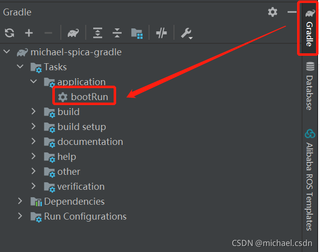

### 2) `IDEA`启动

打开`MichaelSpicaGradleApplication.java`文件，右键选择

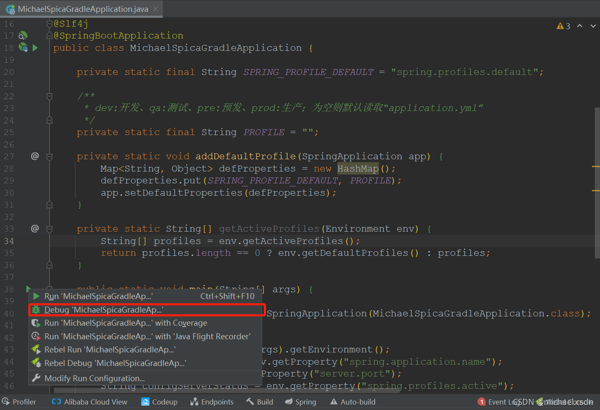

在通过浏览器访问`http://192.168.2.157:8989/hello/welcome`，就看到效果了

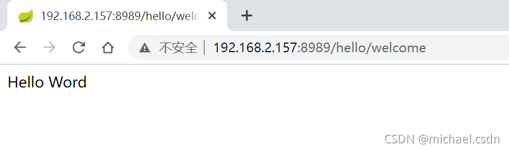

# 参考来源

1. https://blog.csdn.net/qq_40977118/article/details/114385222
2. https://blog.51cto.com/u_15352995/5274168
3. https://blog.csdn.net/qq_38288606/article/details/121031239
4. https://blog.csdn.net/xiaojin21cen/article/details/125804123