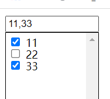
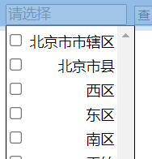

[Toc]

# 自定义多选下拉选

> JQuery版本：jQuery v1.8.2
>
> 使用开发工具：VS CODE
>
> 功能需求：
>
> 1. 点击显示下拉选；
> 2. 可以多选；
> 3. 选中后的值显示出来；
> 4. 获取选中值

```
<!DOCTYPE html>
<html>
<head>
    <meta charset="utf-8" />
    <meta http-equiv="X-UA-Compatible" content="IE=edge">
    <title>Page Title</title>
    <meta name="viewport" content="width=device-width, initial-scale=1">
    <!--<link rel="stylesheet" type="text/css" media="screen" href="main.css" />-->
    <script type="text/javascript" src="../static/js/jquery.min.js"></script>
    <style>
        .option-labels{
            position:absolute; 
            list-style:none; 
            background:#FFF; 
            border:1px solid #000; 
            display:none; 
            padding:3px;
            height: 200px;
            overflow-y: scroll;
            width: 120px;
            margin:0px;
        }
        .option-labels li{
            margin:0px;
            padding:0px;
            font-size: 0px;
            height: 16px;
            /**display:inline-block;*/
        }
        .option-labels li span,input{
            text-align: left;
            font-size: 14px;
            font-weight: normal;

        }
        .option-labels li span:hover{
            color: #FF00FF;

        }
        .option-labels li.active{
            background:#CEE7FF;
        }
        
    </style>
    <script>
        $(function(){
            $(".multi-select-input").click(function (){
                var display_val=$(this).next(".option-labels").css("display");         
                if(display_val === "none"){
                    var selInputOffset=$(this).offset();
                    $(this).next(".option-labels").css({
                        "display":"block",
                        "left":selInputOffset.left +"px",
                        "top":selInputOffset.top + $(this).outerHeight() +"px"
                    });                 
                }else{                    
                    $(this).next(".option-labels").css({"display":"none"});
                }
            });
           
           //点击空白隐藏下拉选
			$(document).bind("click",				
                function(event){
                    var multi_input=$(".multi-select-input"); 
                        var labels_ele=$(".option-labels"); 
                    if (!(event.target.className == "multi-select-input" || event.target.className == "option-labels" 
                    || $(event.target).parents(".option-labels").length>0)) {
						$(".option-labels").css({"display":"none"});
					}
				}
            );
            
            //点击选中&取消
            $(".option-labels").children("li").each(function(index,eleObj){               
                $(this).click(function(event){    
                    if (!$(window.event.target).hasClass('mul-check-input')){
                        var inputObj=$(eleObj).find("input").first();
                        var isChecked=$(inputObj).attr("checked");
                        if(typeof isChecked == "undefined"){
                            isChecked=false;
                        } 
                        if(isChecked){
                            $(inputObj).attr("checked",false);              
                        }else{
                            $(inputObj).attr("checked",true);         
                        }
                    }
                   //设置input显示
                   var multiInputObj=$(this).parent(".option-labels").prev(".multi-select-input");
                   var checkedText=$(multiInputObj).getCheckedText();                  
                   $(multiInputObj).val(checkedText);
                   
                });
                
            });

          
            
            jQuery.fn.extend({
                //获取所有选中值
                getCheckedVals: function() {
                    var tmpArr=new Array();
                    this.next(".option-labels").children("li").each(function(index,eleObj){
                        var temVal=$(eleObj).find("input:checked").first().val();                       
                        if(temVal){
                            tmpArr.push(temVal);
                        }
                    });
                    if (tmpArr.length === 0) {
                        return "";           
                    }
                    return tmpArr.join();                   
                },
                //获取所有选中文本
                getCheckedText:function(){
                    var tmpArr=new Array();
                    this.next(".option-labels").children("li").each(function(index,eleObj){
                        var temVal=$(eleObj).find("input:checked").first().next("span").text();
                        if(temVal){
                            tmpArr.push(temVal);
                        }                       
                    });
                    if (tmpArr.length === 0) {
                        return "";           
                    }
                    return tmpArr.join();
                }
                
            });

        });
        
    </script>

</head>
<body>
        <input type="text" class="multi-select-input" id="LC_CITY_ID" style="width:120px" readonly="readonly"  placeholder="请选择"/>
        <ul class="option-labels">
            <li class="option-chek-label">
                <input type="checkbox" name="" class="mul-check-input"  id="" value="1"/>
                <span >11</span>
            </li>
            <li class="option-chek-label">
                    <input type="checkbox"  class="mul-check-input"  name="" id="" value="2"/>
                    <span>22</span>
            </li>
            <li class="option-chek-label">
                    <input type="checkbox" class="mul-check-input" name="" id="" value="3"/>
                    <span>33</span>
            </li> 
        </ul>

</body>
</html>
```

- **运行结果**



# 问题&解决

## 下拉选显示问题

> 在应用到实际项目中时，发现下拉选的显示和静态页面不同，多选按钮与`span`标签中的文字间隔距离十分巨大。
> 明明没有加`margin`和`padding`，但是就是会出现间距
>
> ```
> <li class="option-chek-label">
> 	<input type="checkbox"   name="" id="" value="2"/>
> 	<span style="margin-left:-6px;">22</span>
> </li>
> ```



- **原因**

> 多个空格或者回车浏览器都会解析成空格，如：在span与span之间敲的回车，会被解析成了空格。

- **解决方案**

**方案**1：代码中不要写空格

```
<input type="checkbox"   name="" id="" value="2"/><span>22</span>
这种写法可以解决问题，但是代码很不美观整洁。
```

**方案**2：通过css去消除间距:用margin/word-spacing/letter-spacing等

```
<span style="margin-left:-6px;">22</span>
缺陷：不是很通用，有可能会因为浏览器的不同而导致设置的边距产生不良的显示
```

**方案**3：通过设置font-size消除间距:既然空格占了位置，那么我们把font-size设置为0，空格就不会占位置了,同时再单独设置子元素的字体大小，就能干掉这个间隙了。

```
<li class="option-chek-label" style="font-size:0px;">
	<input type="checkbox"  style="font-size: 14px;" name="" id="" value="2"/>
	<span style="font-size: 14px">22</span>
</li>

这个设置可以解决span与前一个元素的间距问题
```

**方案**4：查看`span`标签父元素是否设置了span元素的style属性如下:
这种情况可以通过直接在`span`标签上添加css设置：`float:none`；去除浮动，或者根据需要定义其显示的位置属性

```
<style>
div span{
  float:right;
}
</style>

<div class="test">
<ul>
    <li class="option-chek-label">
        <input type="checkbox"  style="font-size: 14px;float:none;" name="" id="" value="2"/>
        <span style="font-size: 14px">22</span>
    </li>
</ul>
</div>

因为父元素设置了子span的显示属性，导致span整体向右浮动，而子span中没有对float属性重新设置，导致span在显示中始终靠右。


```


## 动态在标签添加触发事件

> 在将参数提交到后台，再从后台接收到所需的数据，并用拼接方式，将数据以下拉选的方式展现出来，要求毎点击一个选项，需要触发checked事件，使选项得以选中。
>
> 触发事件需要获得触发这个事件的html元素，以便获取到对应checkbox元素，在JS中怎么获取触发事件的元素对象呢？

- **解决方案**

```
### ajax提交参数，并再获取数据后拼接checkbox下拉选，显示数据。如代码所示，onclick触发的函数传递了一个this参数，这个参数就是触发click事件dom元素对象。
function lr_sjcityinfo(){
				var id="dd";
				var config = {
					url:"/test",
					data:{id:id},
						callBackFunc:function(data){
							var optObj=$("#LR_CITY_ID_SEL").next("ul");
							$(optObj).empty();
							$.each(data,function(i,val){	
								if(val.DISTRICT_CODE){
									$(optObj).append("<li class='option-chek-label' onclick='checkItem(this)'><input type='checkbox' class='dValue' id='"
											+val.DISTRICT_CODE+"' hintValue='"+val.DISTRICT_CODE+"' value='"+val.DISTRICT_CODE+"' \/><span>"+val.DISTRICT_NAME+"</span></li>");
								}
							});  
						}
				};
				HD.doAjax(config);
		}
		
		
### 通过传递过来的元素对象，获取相应的需操作的元素对象
//选中
function checkItem(eleObj){     
    var inputObj=$(eleObj).find("input").first();
    var isChecked=$(inputObj).attr("checked");
    if(typeof isChecked == "undefined"){
        isChecked=false;
    }       
   if(isChecked){
        $(inputObj).attr("checked",false);              
   }else{
        $(inputObj).attr("checked",true);         
   }
   //设置input显示
   var multiInputObj=$(eleObj).parent(".option-labels").prev(".multi-select-input");
   var checkedText=$(multiInputObj).getCheckedText();  
   var checkedVals=$(multiInputObj).getCheckedVals(); 
   $(multiInputObj).attr("value",checkedText);
   $(multiInputObj).attr("hintValue",checkedText);
   $(multiInputObj).prev("input").val(checkedVals);
}
```

# 参考资料

1. https://blog.csdn.net/qq_38164763/article/details/104332683?utm_medium=distribute.pc_aggpage_search_result.none-task-blog-2~aggregatepage~first_rank_ecpm_v1~rank_v31_ecpm-1-104332683.pc_agg_new_rank&utm_term=span%E6%A0%87%E7%AD%BE%E4%B9%8B%E9%97%B4%E7%9A%84%E8%B7%9D%E7%A6%BB%E6%80%8E%E4%B9%88%E8%B0%83&spm=1000.2123.3001.4430
2. https://www.jb51.net/article/121164.htm