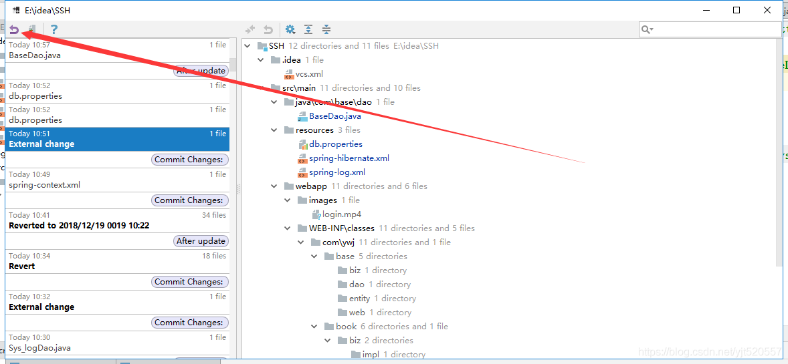
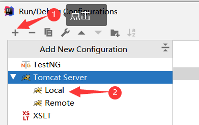
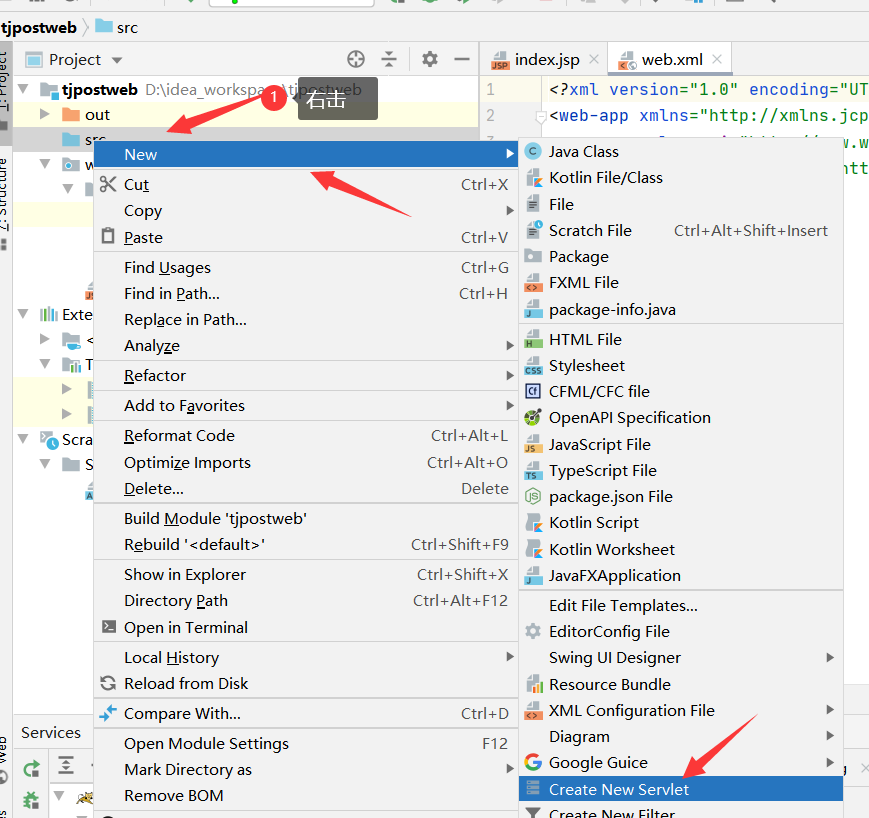

[Toc]

# 项目误删

- **情景描述**

> 不小心将项目里某些文件给误删了,需要恢复误删的项目

- **解决方案**

> idea有历史记录的功能所以对于项目的操作都有记录所以可以选择回退
>
> 首先项目右键选择local history ->Show history 
>
> 
>
> 然后 选择误操作之前的版本，然后点击revert返回就会恢复了
>
> 

# SVN

# IDEA 配置SVN

1. 在idea中配置svn,首先要在电脑上安装svn （进入官网下载安装即可）；
   svn官网下载 地址：https://tortoisesvn.net/downloads.html

2. 打开idea，选择file->settings->Version Control -> Subversion ,OK 完成；


3. 如果发现找不到svn.exe?   如果发现找不到svn.exe?  

   ​     之所以没有，是因为安装[TortoiseSVN](https://so.csdn.net/so/search?q=TortoiseSVN&spm=1001.2101.3001.7020)的时候没有勾选指定安装项。找到安装包重新运行，选择modify，然后勾选command line client tools项就行了,next,安装好后，就有了。


# Maven项目

## 导入Maven项目，Pom配置文件

1. 点击【File】,选中【Open】选择需要打开的文件夹

   

2. 配置好Maven库，相关设置
   

3. Pom文件失效
   

   将pom.xml添加到Maven项目中，即可生效


# 创建Web项目

## 1. 创建

1. 点击【new】--> 选中【project】
   

2. 选择【Java Enterprise】——>选中【Web Application】
   

3. 输入项目名称后，【finish】
   

## 2. 配置

1. 在web/WEB-INF下创建两个文件夹classes和lib，classes用来存放编译后输出的classes文件，lib用于存放第三方jar包。

 

2. 配置文件夹路径

   File -> Project Structure (快捷键：Ctrl + Shift + Alt + S) -> 选择Module ：

    选择 Paths -> 选择"Use module compile output path" -> 将Output path和Test output path都选择刚刚创建的classes文件夹。

   

3. 接着选择Dependencies ->  将Module SDK选择为1.8 -> 点击右边的“+”号  -> 选择1 “Jars or Directories”

   

-> 选择刚刚创建的【lib】文件夹


-> 选择**【jar directory】** -> 接着返回一路OK就可以了


4. **配置Tomcat容器**

打开菜单【Run 】-> 选择【Edit Configuration 】


点击“+”号 -> 选择“Tomcat Server” -> 选择“Local”



在"Name"处输入新的服务名，点击"Application server"后面的"Configure..."，弹出Tomcat Server窗口，选择本地安装的Tomcat目录 -> OK 


在"Run/Debug Configurations"窗口的"Server"选项板中，取消勾选"After launch"，设置"HTTP port"和"JMX port"（默认值即可），点击 Apply -> OK， 至此Tomcat配置完成。


**当已配置好tomcat，重新创建web项目时，可以直接选择配置的tomcat**


6. Run -> Edit Configurations，进入"Run/Debug Configurations"窗口 -> 选择刚刚建立的Tomcat容器 -> 选择Deployment -> 点击右边的“+”号 -> 选择Artifact
   

7. **启动项目**：若为修改tomcat上下文路径，默认为：http://localhost:8080/tjpostweb_war_exploded/


## 修改项目的访问路径

> 修改项目的Context Path

- **方案1**:IntelliJ IDEA的**Run**菜单的**Edit Configurations**即可打开启动设置
  

- 方案2：若项目已启动，直接选中启动项目的tomcat，然后右击，进入tomcat配置页面
  

- **方案3：通过Servlet组件转发JSP**

  在Java EE项目中，使用Servlet组件转发JSP是非常常见的做法，首先，对项目的**src**点击鼠标右键，依赖选择**New** > **Create New Servlet**即可开始创建Servlet组件：
  在弹出的**New Servlet**对话框中，自行填写**Servlet Name**与**Package**，完成后点击**OK**即可：

  

  创建成功后，会自动打开所创建的Servlet类，首先，在`@WebServlet`注解参数中，增加配置`urlPatterns`属性，以指定访问该Servlet组件的资源名（注意：该属性值需要使用 `/` 作为第1个字符）：

  

  默认情况下，当前Servlet中已经生成了重写的`doPost`与`doGet`方法，由于本次只是简单的访问即可，客户端提交请求的方式应该是GET类型，则不需要`doPost`方法，删掉即可，如果允许使用POST方式访问，且与GET方式相同的处理模式，则在`doPost`方法中直接调用`doGet`方法即可：

  在实现转发时，需要一个JSP页面文件，通常，会将JSP文件保存到**WEB-INF**的某个子级文件夹中，避免JSP文件被直接访问！对**WEB-INF**文件夹点击鼠标右键，依次选择**New** > **Directory**以创建用于存放JSP文件的文件夹：

  

  在弹出的**New Directory**对话框中输入文件夹的名称并回车：

  

  对新创建的文件夹点击鼠标右键，依赖选择**New** > **JSP/JSPX**以创建JSP文件：

  

  在弹出的**Create JSP/JSPX page**对话框中输入文件名（不需要输入扩展名）并回车：

  

  然后，自行设计JSP文件的内容，例如：

  

  回到Servlet类的`doGet`方法中，添加转发JSP的代码，例如：

  ```scss
  request.getRequestDispatcher("/WEB-INF/jsp/hello.jsp").forward(request, response);
  ```

  

  如下图所示：

  

  完成后，再次重新启动项目，在URL的Context Path值的右侧添加`hello`（Servlet组件配置的urlPatterns值）即可看到Servlet转发的JSP文件显示的内容：

  

## 什么是【Build Artifact】

**Artifact**
原英文意思为：制品，产品，人工艺品等。
官网解释为：一个artifact是一个项目资源的集合体。如java项目，当使用【Build Artifact】可以将你java项目里依赖的jar包，自己书写的代码，一起打包成一个独立的集合体，就是artifact。

## 导入lib包

> 将需要导入的jar包，直接拷贝到【WEB-INF】下自己创建的lib目录下，因为在创建web项目时，已经配置了编译的lib路径，所以直接把需要的包拷贝到lib目录下即可。


## 页面无法找到静态资源

> web项目部署启动后，访问页面发现静态资源：如图片，css等静态资源无法访问，提示:404，无法找到对应的资源


- **原因探索**

> 仔细校对后，发现路径等信息并没有问题。项目发布后的idea里展示的out里没有问题。只能是在发布到tomcate的artifacts可能有问题。手动在项目结构的【Artifacts】创建静态资源文件夹后，项目可正常访问静态资源。


## 导入WEB项目后，注解爆红

- **场景描述**
  导入WEB项目后，发现有注解参数爆红，但运行正常
  

  ```
  报错信息：
  Incorrect MIME Type declaration 
   Inspection info:Incorrect MIME Type declarations in JAX-RS annotations
  ```

  

- **可能原因**

  1. JDK版本问题；
  2. 有关联的jar包没有成功导入；

- **解决方案**

  1. **更换JDK版本**:点击【File】=>[Project Structure],添加别的版本的JDK ；修改项目JDK版本
     

     

  2. 将没有扫描到的jar包手动导入

  

## 禁用Kotlin插件

- **场景描述**

> 运行java Application时，报错：提示Kotlin-jvm incompitable.

- **原因探索&解决方案**

  >  **原因**：查了下KOTLIN是Android项目编程工具，目前项目是java项目，和它无关。
  >
  > **解决方案**：禁用Kotlin插件，禁用后，重启IDEA


## bytecode version与实际JDK版本不符

- **场景描述**

> 因为一个注解`@procedure`报错，所以点进去看了下该注解的源码，发现提示`bytecode version:50.0(java6)`,有些奇怪，项目使用的jdk是1.8，怎么会出现`java6`这个版本。


- **原因探索**

> 该提示出现原因是查看第三方jar包的源代码时出现的。没有找到该类的源码 `.java`文件，而是反编译`.class`文件后呈现出来。字节码版本是(java 6)
>
> 1. 尝试使用源码页面的`Choose Source`，引入jdk 1.8版本的源码，操作后，没有解决问题

- **解决方案**

> 1. 找到导入的jar包源码，如：java源码包，找到`src`结尾的源代码文件，导入到IDEA中
>    

# Debug失效

- **场景描述**

> 使用Debug启动项目，发现无法进入Debug模式

- **解决方案**

1. 查看断点显示是否正常

2. 查看是否禁用了debug模式

   


# 参考资料

1. https://www.jetbrains.com/help/idea/2016.2/working-with-artifacts.html#artifact_def
2. https://blog.csdn.net/u011699755/article/details/90343951