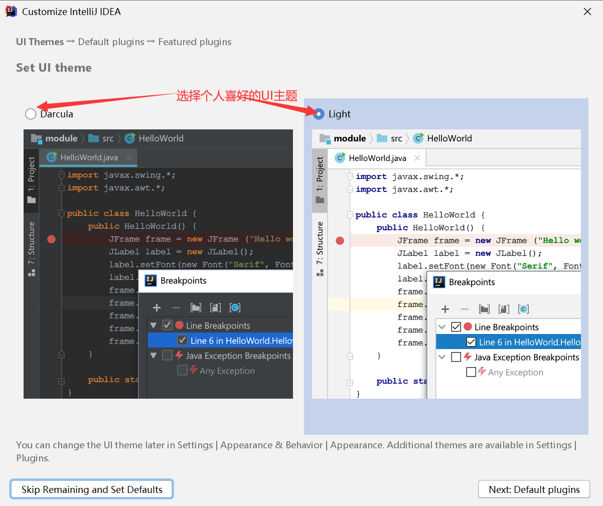
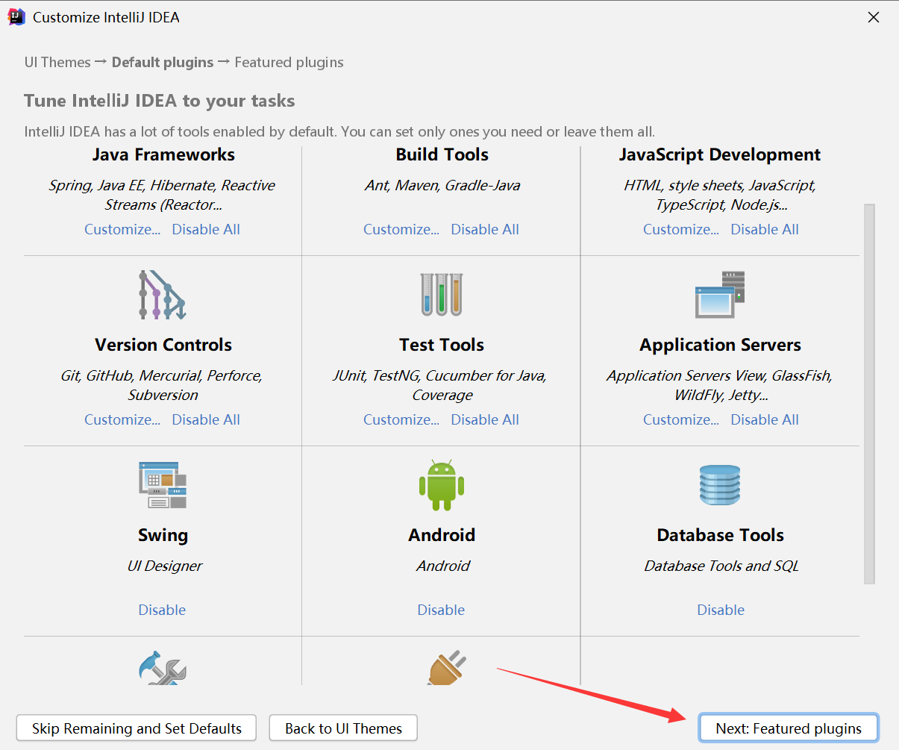
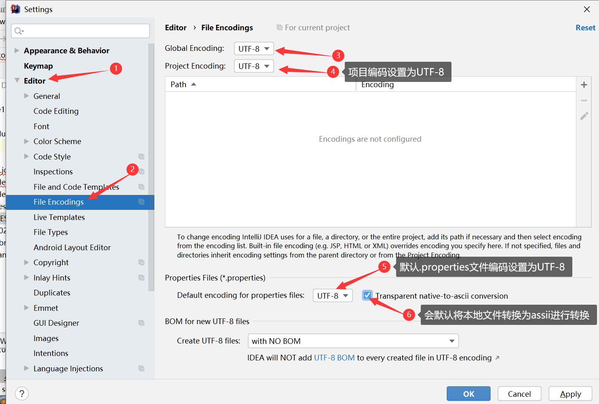
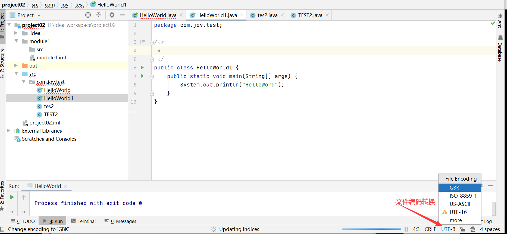
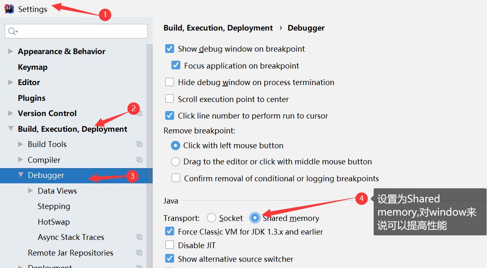
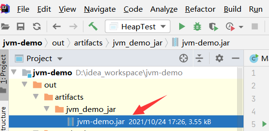

[toc]

# 1. 简介

1. **官方下载网址**：https://www.jetbrains.com/idea/download/#section=windows

2. **版本区别**：

   1. **Ultimate**：旗舰版，功能较多，收费，有30天的试用期；
   2. **Community**：社区版，相对旗舰版来说功能简单，免费；

3. **相关文档连接/说明**

    > - 有关旗舰版与社区版版本的详细对比，可以参考官网提供的说明：https://www.jetbrains.com/idea/features/editions_comparison_matrix.html
    >
    > - 不同开发周期版本区别说明，如图：
    >
    >   
    >
    > - 官方帮助说明文档：https://www.jetbrains.com/help/idea/discover-intellij-idea.html

    

4. **所属公司**：JetBrains， 其旗下有很多产品，如:

   > 1. APPCode: 开发MAC手机的，IOS系统应用程序的开发环境；
   > 2. CLion :开发C/C++语言
   > 3. DataGrid: 开发数据库，包括SQL
   > 4. GoLand: 开发GO语言，区块链开发主要用GO语言；
   > 5. PhpStorm:开发PHP语言
   > 6. PyCharm: 开发Python语言，人工智能/大数据/数据挖掘，主要用Python语言
   > 7. Rider:开发.net平台
   > 8. RubyMine:开发Ruby
   > 9. WebStorm: 开发前端
   >
   > Android Studio:用于开发android,由Google公司开发的，是基于IDEA社区版上开发出的工具。

5. **IDEA&Eclipse比较**

   > **主要优势**
   >
   > 1. 强大的整合能力，比如git/maven/spring等；
   > 2. 提示功能快捷，方便；
   > 3. 提示功能范围广：可提示sql/html等，eclipse范围很窄，需下载对应程序才可以；
   > 4. 好用的快捷键与代码模板：可以自定义固定代码模块模板；
   > 5. 精准搜索；
   >
   > **缺点**
   >
   > 1. 相对Eclipse而言，占用内存更多，对硬件要求更高些；
   > 2. IDEA在运行过程中会产生大量的缓存和、索引文件，可能对导致运行缓慢；


# 2. 安装

> **个人安装版本为IntelliJ IDEA2020.2**  **Ultimate**
>
> IDEA2020.1 UItimate版本安装雷同

## 2.1 安装前准备

1. **硬件&软件要求**

> | Requirement        | Minimum                                                      | Recommended                                                  |
> | ------------------ | ------------------------------------------------------------ | ------------------------------------------------------------ |
> | RAM                | 2 GB of free RAM                                             | 8 GB of total system RAM                                     |
> | Disk space         | 2.5 GB and another 1 GB for caches                           | SSD drive with at least 5 GB of free space                   |
> | Monitor resolution | 1024x768                                                     | 1920×1080                                                    |
> | Operating system   | Officially released 64-bit versions of the following:Microsoft Windows 8 or latermacOS 10.13 or laterAny Linux distribution that supports Gnome, KDE , or Unity DEPre-release versions are not supported. | Latest 64-bit version of Windows, macOS, or Linux (for example, Debian, Ubuntu, or RHEL) |

> You do not need to install Java to run IntelliJ IDEA, because JetBrains Runtime is bundled with the IDE (based on JRE 11). However, to develop Java applications, a standalone JDK is required.
>
> 2020.2版本默认JRE11版本，如果要进行开发，需要独立的JDK安装

## 2.2 安装说明

> 以下只说明在安装过程中需要注意的设置操作

1. 选择启动版本：除选中对应系统的启动版本外，其他设置建议制空，不进行选中。

   

   2. 后续就是点击`next`直到安装了。

## 2.3 安装目录说明

```
bin:包括一些启动文件，如：idea.exe/idea64.exe等；相关虚拟机的配置信息，如：idea.exe.vmoptions，       idea64.exe.vmoptions等；IDEA基本属性信息：如：idea.properties。等等
help:帮助文档目录
jbr:相关JRE等有关java运行环境配置
lib:IDEA依赖的相关类库
license:相关插件的许可信息
plugins:插件
redist:范例包
```

- **虚拟机配置信息说明**：`idea64.exe.vmoptions`(因为本机为64位的，所以以64位虚拟机配置进行说明)

  

> ```
> //以下为本机：16位内存i7处理器配置。若内存较小，需相应调整设置
> -Xms500m	//初始内存，可提高IDEA启动速度，根据系统内存大小进行配置；
> -Xmx1500m	//最大内存，增加这个数，可以降低垃圾回收的频率，进而提高程序的性能
> -XX:ReservedCodeCacheSize=500m	//可保留代码缓存大小，可以降低垃圾回收的频率，进而提高程序的性能
> -XX:+UseConcMarkSweepGC
> -XX:SoftRefLRUPolicyMSPerMB=50
> -ea
> -XX:CICompilerCount=2
> -Dsun.io.useCanonPrefixCache=false
> -Djdk.http.auth.tunneling.disabledSchemes=""
> -XX:+HeapDumpOnOutOfMemoryError
> -XX:-OmitStackTraceInFastThrow
> -Djdk.attach.allowAttachSelf=true
> -Dkotlinx.coroutines.debug=off
> -Djdk.module.illegalAccess.silent=true
> ```

## 2.4 设置目录说明

> 默认在计算机用户目录下：`C:\Users\12613\AppData\Roaming\JetBrains`
>
> 说明：该目录为IDEA各种配置信息的保存目录。当删除整个目录后，重新启动IDEA,会自动生成一个全新的默认配置。当你配置改坏了时，可以执行删除操作，还原配置。

> ```
> config: 相关配置信息,如文件模板，插件，快捷键映射；
> system: 会将程序运行过程中的一些缓存数据，都保留在该目录下
> 
> 可通过修改bin目录下的 idea.properties 配置文件，改变config与system保存文件路径
> idea.config.path=D:/Program Files/IntelliJ IDEA 2019.1.2/IntelliJIdea/config
> idea.system.path=D:/Program Files/IntelliJ IDEA 2019.1.2/IntelliJIdea/system
> ```

## 2.5 免费激活方式

> 1. **Jetbrains全家桶破解(成功激活2020.1版本)，步骤如下**：
>
> > 1. 下载补丁jetbrains-agent-latest2020.1.zip包，网址：https://github.com/CryFun/Jailbreaking-Jetbrains/blob/master/README.md
> >
> > 2. 在安装完成后，出现激活界面时，先点击免费试用
> >
> > 3. 会先弹出一个注册框，勾选 `Evaluate for free`, 点击 `Evaluate`，创建一个project:
> >
> >    
> >
> > 4. 将破解补丁 jetbrains-agent-latest2020.1.zip拖入 IDEA 界面中：
> >
> >    
> >
> > 5. 拖入补丁后会弹框，点击 `restart` 重启 idea;
> >
> >    配置助手会提示您，需要使用哪种激活方式，这里我们选择默认的 `Activation Code`，通过注册码来激活，点击`为IDEA安装`;
> >
> >    点击`是`，重启IDEA, 即激活成功啦;
> >
> > 6. 查看激活是否成功：进入 IDEA 界面后，点击 `Help` -> `Register` 查看。
> >
> >    ```
> >    3AGXEJXFK9-eyJsaWNlbnNlSWQiOiIzQUdYRUpYRks5IiwibGljZW5zZWVOYW1lIjoiaHR0cHM6Ly96aGlsZS5pbyIsImFzc2lnbmVlTmFtZSI6IiIsImFzc2lnbmVlRW1haWwiOiIiLCJsaWNlbnNlUmVzdHJpY3Rpb24iOiIiLCJjaGVja0NvbmN1cnJlbnRVc2UiOmZhbHNlLCJwcm9kdWN0cyI6W3siY29kZSI6IklJIiwiZmFsbGJhY2tEYXRlIjoiMjA4OS0wNy0wNyIsInBhaWRVcFRvIjoiMjA4OS0wNy0wNyJ9LHsiY29kZSI6IkFDIiwiZmFsbGJhY2tEYXRlIjoiMjA4OS0wNy0wNyIsInBhaWRVcFRvIjoiMjA4OS0wNy0wNyJ9LHsiY29kZSI6IkRQTiIsImZhbGxiYWNrRGF0ZSI6IjIwODktMDctMDciLCJwYWlkVXBUbyI6IjIwODktMDctMDcifSx7ImNvZGUiOiJQUyIsImZhbGxiYWNrRGF0ZSI6IjIwODktMDctMDciLCJwYWlkVXBUbyI6IjIwODktMDctMDcifSx7ImNvZGUiOiJHTyIsImZhbGxiYWNrRGF0ZSI6IjIwODktMDctMDciLCJwYWlkVXBUbyI6IjIwODktMDctMDcifSx7ImNvZGUiOiJETSIsImZhbGxiYWNrRGF0ZSI6IjIwODktMDctMDciLCJwYWlkVXBUbyI6IjIwODktMDctMDcifSx7ImNvZGUiOiJDTCIsImZhbGxiYWNrRGF0ZSI6IjIwODktMDctMDciLCJwYWlkVXBUbyI6IjIwODktMDctMDcifSx7ImNvZGUiOiJSUzAiLCJmYWxsYmFja0RhdGUiOiIyMDg5LTA3LTA3IiwicGFpZFVwVG8iOiIyMDg5LTA3LTA3In0seyJjb2RlIjoiUkMiLCJmYWxsYmFja0RhdGUiOiIyMDg5LTA3LTA3IiwicGFpZFVwVG8iOiIyMDg5LTA3LTA3In0seyJjb2RlIjoiUkQiLCJmYWxsYmFja0RhdGUiOiIyMDg5LTA3LTA3IiwicGFpZFVwVG8iOiIyMDg5LTA3LTA3In0seyJjb2RlIjoiUEMiLCJmYWxsYmFja0RhdGUiOiIyMDg5LTA3LTA3IiwicGFpZFVwVG8iOiIyMDg5LTA3LTA3In0seyJjb2RlIjoiUk0iLCJmYWxsYmFja0RhdGUiOiIyMDg5LTA3LTA3IiwicGFpZFVwVG8iOiIyMDg5LTA3LTA3In0seyJjb2RlIjoiV1MiLCJmYWxsYmFja0RhdGUiOiIyMDg5LTA3LTA3IiwicGFpZFVwVG8iOiIyMDg5LTA3LTA3In0seyJjb2RlIjoiREIiLCJmYWxsYmFja0RhdGUiOiIyMDg5LTA3LTA3IiwicGFpZFVwVG8iOiIyMDg5LTA3LTA3In0seyJjb2RlIjoiREMiLCJmYWxsYmFja0RhdGUiOiIyMDg5LTA3LTA3IiwicGFpZFVwVG8iOiIyMDg5LTA3LTA3In0seyJjb2RlIjoiUlNVIiwiZmFsbGJhY2tEYXRlIjoiMjA4OS0wNy0wNyIsInBhaWRVcFRvIjoiMjA4OS0wNy0wNyJ9XSwiaGFzaCI6IjEyNzk2ODc3LzAiLCJncmFjZVBlcmlvZERheXMiOjcsImF1dG9Qcm9sb25nYXRlZCI6ZmFsc2UsImlzQXV0b1Byb2xvbmdhdGVkIjpmYWxzZX0=-WGTHs6XpDhr+uumvbwQPOdlxWnQwgnGaL4eRnlpGKApEEkJyYvNEuPWBSrQkPmVpim/8Sab6HV04Dw3IzkJT0yTc29sPEXBf69+7y6Jv718FaJu4MWfsAk/ZGtNIUOczUQ0iGKKnSSsfQ/3UoMv0q/yJcfvj+me5Zd/gfaisCCMUaGjB/lWIPpEPzblDtVJbRexB1MALrLCEoDv3ujcPAZ7xWb54DiZwjYhQvQ+CvpNNF2jeTku7lbm5v+BoDsdeRq7YBt9ANLUKPr2DahcaZ4gctpHZXhG96IyKx232jYq9jQrFDbQMtVr3E+GsCekMEWSD//dLT+HuZdc1sAIYrw==-MIIElTCCAn2gAwIBAgIBCTANBgkqhkiG9w0BAQsFADAYMRYwFAYDVQQDDA1KZXRQcm9maWxlIENBMB4XDTE4MTEwMTEyMjk0NloXDTIwMTEwMjEyMjk0NlowaDELMAkGA1UEBhMCQ1oxDjAMBgNVBAgMBU51c2xlMQ8wDQYDVQQHDAZQcmFndWUxGTAXBgNVBAoMEEpldEJyYWlucyBzLnIuby4xHTAbBgNVBAMMFHByb2QzeS1mcm9tLTIwMTgxMTAxMIIBIjANBgkqhkiG9w0BAQEFAAOCAQ8AMIIBCgKCAQEA5ndaik1GD0nyTdqkZgURQZGW+RGxCdBITPXIwpjhhaD0SXGa4XSZBEBoiPdY6XV6pOfUJeyfi9dXsY4MmT0D+sKoST3rSw96xaf9FXPvOjn4prMTdj3Ji3CyQrGWeQU2nzYqFrp1QYNLAbaViHRKuJrYHI6GCvqCbJe0LQ8qqUiVMA9wG/PQwScpNmTF9Kp2Iej+Z5OUxF33zzm+vg/nYV31HLF7fJUAplI/1nM+ZG8K+AXWgYKChtknl3sW9PCQa3a3imPL9GVToUNxc0wcuTil8mqveWcSQCHYxsIaUajWLpFzoO2AhK4mfYBSStAqEjoXRTuj17mo8Q6M2SHOcwIDAQABo4GZMIGWMAkGA1UdEwQCMAAwHQYDVR0OBBYEFGEpG9oZGcfLMGNBkY7SgHiMGgTcMEgGA1UdIwRBMD+AFKOetkhnQhI2Qb1t4Lm0oFKLl/GzoRykGjAYMRYwFAYDVQQDDA1KZXRQcm9maWxlIENBggkA0myxg7KDeeEwEwYDVR0lBAwwCgYIKwYBBQUHAwEwCwYDVR0PBAQDAgWgMA0GCSqGSIb3DQEBCwUAA4ICAQBonMu8oa3vmNAa4RQP8gPGlX3SQaA3WCRUAj6Zrlk8AesKV1YSkh5D2l+yUk6njysgzfr1bIR5xF8eup5xXc4/G7NtVYRSMvrd6rfQcHOyK5UFJLm+8utmyMIDrZOzLQuTsT8NxFpbCVCfV5wNRu4rChrCuArYVGaKbmp9ymkw1PU6+HoO5i2wU3ikTmRv8IRjrlSStyNzXpnPTwt7bja19ousk56r40SmlmC04GdDHErr0ei2UbjUua5kw71Qn9g02tL9fERI2sSRjQrvPbn9INwRWl5+k05mlKekbtbu2ev2woJFZK4WEXAd/GaAdeZZdumv8T2idDFL7cAirJwcrbfpawPeXr52oKTPnXfi0l5+g9Gnt/wfiXCrPElX6ycTR6iL3GC2VR4jTz6YatT4Ntz59/THOT7NJQhr6AyLkhhJCdkzE2cob/KouVp4ivV7Q3Fc6HX7eepHAAF/DpxwgOrg9smX6coXLgfp0b1RU2u/tUNID04rpNxTMueTtrT8WSskqvaJd3RH8r7cnRj6Y2hltkja82HlpDURDxDTRvv+krbwMr26SB/40BjpMUrDRCeKuiBahC0DCoU/4+ze1l94wVUhdkCfL0GpJrMSCDEK+XEurU18Hb7WT+ThXbkdl6VpFdHsRvqAnhR2g4b+Qzgidmuky5NUZVfEaZqV/g==
> >    ```
> >
> >    
> >
> >    
>
> 2. http://idea.lanyus.com/ 获取注册码，需要购买
>
> 3. 填入下面的license server:(以下无法激活2020.2版本，其他版本未测试)
>    http://intellij.mandroid.cn/
>      http://idea.imsxm.com/
>
> 4. 从网站其他地方获取激活码；

> 5. 下载激活代理软件：如启动：idea_active_proxy激活代理.exe,接着启动IDEA,输入server:http://localhost:8888,然后关闭激活代理工具；
>
> 6. 使用万能的淘宝，购买激活码
>
> 
>
> （默默说一句，支持正版~~）

## 2.6 初次启动说明

1. 选择UI主题

> 

2. 显示的是默认集成的插件，可直接点击默认下一步

> 

3. 可以根据需要安装其他的插件,在此可不进行设置；也可以后期去[IDEA官方插件库](https://plugins.jetbrains.com/idea)下载插件

> 

4. 创建`project`:在IDEA中，project等价于Elipse的workspace，需注意引入本地独立JDK

> 

5. 设置显示工具栏

> 

6. 界面说明

> 
>
> 项目中的`.idea,*.impl`文件，是IDEA工程特有的，类似eclipse下的`.settings,.classpath,.project`

# 3. 使用

## 3.1 与Eclipse使用比较

> 1. 不需使用`Ctrl+S`保存文档，IDEA是实时保存的；
>
> 2. 运行`main`方法
>
>    
>
> 3. 在Eclipse中有Workspace(工作空间)和Project(工程)的概念，在IDEA中只有Project(工程)和Module(模块)的概念。
>
>    Eclipse中的Workspace 相当于IDEA中的Project
>
>    Eclipse中的Project 相当于IDEA中的Module
>
> 4. 在使用Eclipse时，会下意识的在一个窗口管理多个项目，这在IDEA中是无法做到的。IDEA的解决方案是打开多个实例项目，即打开多个项目窗口。即一个Project打开一个Window窗口。
>
> 5. 在IDEA中，Project是最顶级级别，次级别是Module。一个Project可以有多个Module.目前主流的大型项目都是分布式部署的，结构类似于多Module结构
>
> 
>
> 这样的项目一般是这样划分的，比如core Module,web Module,plugin Module等等，模块之间是彼此之间可以相互依赖。通过模块名称可以看出，他们都属于同一个业务下的项目模块，彼此之间有不可分割的业务关系。
>
> 6. 相对与多Module项目，小项目就无需弄得如此复杂，只有一个Module结构，IDEA也是支持的。并且IDEA在创建项目是，默认是单Module

## 3.2 创建&彻底删除Module

- **创建Module**

> 

- **删除Module**

1）移除Module后，此时移除的module在项目中呈灰色显示，并未在磁盘里彻底删除。移除操作有以下俩种方式


2）彻底删除Module,将Module从磁盘删除


## 3.3 常用设置

- **进入设置界面**


#### **设置主题**

- 方法1：

   

- 方法2：自定义主题模式，可从网址:http://www.riaway.com/   下载主题jar包后，直接导入即可。

  

- 方法3：通过插件更换主题：可以下载插件Material Theme UI

#### **字体设置**

> 

#### **设置鼠标移动文档提示**

> 

#### **自动导包设置**

> 

#### **设置显示行号和方法分隔符**

> 

#### **忽略大小写提示**

因为在java中严格区分大小写，若不设置，会导致使用小写时不会显示提示

> 

#### **设置取消单行显示tabs的操作**

可以使文件多行显示，若不取消，当编辑窗口打开过多文件时部分文件会被隐藏

> 

- **设置默认字体、字体大小、字体间行距**

  > 

- **设置注释字体颜色**

  > 

- 设置超过指定import个数，改为*（可忽略）

  > 

- **修改类头文档注释信息**

  > 
  >
  > ```
  > /**
  > @author joysun
  > @create ${YEAR}-${MONTH}-${DAY} ${TIME}
  > */
  > ```

- **设置项目文件编码**

  > 
  >
  > - 单个文件编码转换
  >
  >   

- **设置自动编译**

  > 
  >
  > 在eclipse中自动编译选项是默认的。

- **设置省电模式**（可忽略）：开启省电模式会关闭代码检查和代码提示等功能，所以一般认为这是一种阅读模式。如果在开发过程中遇到代码突然不能自动检查和提示，可查看是否开启了该模式。

  > 

- **文件分离显示**

  > 

- **设置快捷键**

  > 1. 未使用过eclipse的，可直接使用IDEA默认快捷键模式；
  >
  > 2. 若使用过eclipse的，可以将IDEA快捷键模式修改为Eclipse模式
  >
  >    
  >
  >    但就算是设置了Eclipse的快捷键模式，依然还有很多快捷键和eclipse不一致，此时可选择参照eclipse快捷键进行手动更改或者直接导入eclipse 快捷键jar包。这种操作只能保证大部分快捷键一致。
  >
  >    导入eclipse快捷键jar包：链接:https://pan.baidu.com/s/1VXX30YZvTKeu7EODCo7mkA 
  >
  >    提取码:uur1
  >
  >    
  >
  >    将eclipse快捷键jar包导入后，在快捷键页面进行设置
  >
  >    

- **隐藏代码设置**

  > ```
  > 快捷键：shift+alt+z  点击：region...endregion comments
  > 使用后效果：//region Description
  >           System.out.println("ddjdjd");
  >           //endregion
  >  可隐藏不显示,只显示为:Description
  >         
  > ```

## 3.4 快捷键的使用

> 以下为Eclipse常用快捷键说明
>
> ```
> 1. 执行(run)		alt+r;
> 2. 提示补全(Class Name Completion)		alt+/
> 3. 单行注释		ctrl+/;
> 4. 多行注释		ctrl + shift + /
> 5. 向下复制一行(Duplicate Lines)		ctrl+alt+down
> 6. 删除一行或选中行(delete line)		ctrl+d
> 7. 向下移动行(move statement down)		alt+down
> 8. 向上移动行(move statement up)		alt+up
> 9. 向下开始新的一行(start new line)		shift+enter
> 10. 向上开始新的一行(Start new line before current)		ctrl+shift+enter
> 11. 如何查看源码(class)		ctrl+选定指定的结构 或 ctrl+shift+t
> 12. 万能解错/生成返回值变量		alt+enter
> 13. 退回到前一个编辑的页面(back)		alt+left
> 14. 进入到下一个编辑的页面(针对上条)(forward)		alt+right
> 15. 查看继承关系(type hierarchy)		F4
> 16. 格式化代码(reformat code)		ctrl+shift+F
> 17. 提示方法参数类型(Parameter Info)		ctrl+alt+/
> 18. 复制代码		ctrl+c
> 19. 撤销		ctrl+z
> 20. 反撤销		ctrl+y
> 21. 剪切		ctrl+x
> 22. 粘贴		ctrl+v
> 23. 保存		ctrl+s
> 24. 全选		ctrl+a
> 25. 选中数行，整体往后移动		tab
> 26. 选中数行，整体向前移动		shift+tab 
> 27. 查看类的结构：类似于eclipse的outline		ctrl+o
> 28. 大写转小写/小写转大写(toggle case)		ctrl+shift+y
> 29. 重构：修改变量名与方法名(rename)，整体修改名称		alt+shift+r
> 30. 生成构造器/get/set/toString		alt+shift+s
> 31. 查看文档说明(quick documentation)		F2
> 32. 收起所有的方法(collapse all)		alt+shift+c
> 33. 打开所有方法(expand all)		alt+shift+x
> 34. 生成try-catch等(surround with)		alt+shift+z
> 35. 局部变量抽取为成员变量(introduce field)		alt+shift+f
> 36. 打开代码所在硬盘文件夹(show in wxplorer)		ctrl+shift+x
> 37. 查找/替换(当前)		ctrl+f
> 38. 查找(全局)		ctrl+h
> 39. 查找文件		double shift
> 40. 查看类的继承结构图(show UML diagram)		ctrl+shift+u
> 41. 添加到收藏(add to favorites)		ctrl+alt+f
> 42. 查看方法的多层重写结构(method hierachy) 		ctrl+alt+h
> 43. 抽取方法(Extract method)		alt+shift+m
> 44. 打开最近修改的文件(recently files)		ctrl+E
> 45. 关闭当前打开的代码栏(close)		ctrl+w
> 46. 关闭打开的所有代码栏(close all)		ctrl+shift+w
> 47. 快速搜索类中的错误(next highlighted error)		ctrl+shift+q
> 48. 选择要粘贴的内容(show in explorer)		ctrl+shift+v
> 49. 查找方法在哪里被调用(call hierarchy)		ctrl+shif+h
> ```

## 3.5 模板及常用模板设置

- **Live Templates(实时代码模板)**

> 功能介绍：它的原理就是配置一些常用代码字母的缩写，在输入简写时可以出现你预定义的固定模式的代码。如输入sout会出现System.out.printle。可进行修改和定制属于自己的模板。
>
> 
>
> - **自定义模板**
>
>   
>
>   

- **Postfix Completion**

> 固定模板，无法进行修改，相对Live Templates要快，但并不是快很多。

> 

- **常用的模板**

> ```
> psvm,main  快捷输入main方法
> sout   快速输入System.out.println();
> // sout 变形：soutp/soutm/soutv/xx.sout
> soutp		打印参数
> soutm		打印方法名
> soutv		打印就近变量值
> xxx.sout 		打印xxx变量值
> 
> fori		可生成for普通循环,
> iter		可生成增强for循环
> itar		可生成普通for循环
> list.for	可生成list的增强for循环
> list.iter	若有范式可生成list增强for循环
> list.fori	生成list普通for循环
> list.forr	生成从后往前遍历for循环，倒叙遍历
> 
> ifn 或 xxx.null		可生成if(arg==null)
> inn	或 xxx.nn		可生成if(arg!=null)
> 
> prsf		可生成 private static final
> psf			可生成 public static final
> psfi		可生成 public static final int
> psfs		可生成 public static final String
> 
> ```

## 3.6 创建Java Web Project 或Module

- **创建静态Java Web**

> 20.1版本IDEA没有static web创建选项，与旧版本有所不同，如图：
>
> 

- **创建动态Java Web**

> 1. **创建web module**
>
> 
>
> 2. **设置本地tomcat**
>
> 
>
> 
>
> 3. 选择需发布的web项目
>
> 
>
> 4. 启动tomcat
>
> 
>
> 5. 关闭tomcat
>
> 
>
> 可以点击如图所示红框，刚点击完毕并不能马上关闭服务器，只是断开与服务器的连接，稍后当停止按钮显示为灰色，才表示关闭

## 3.7 关联数据库

> IDEA关联数据库是为了方便生成对应表pojo对象


## 3.8 版本控制

> IDEA集成了多种版本控制工具，虽然IDEA集成了版本控制，但还是需要安装相应的版本控制客户端

> - **以GIT为范例**
>
> 1. [下载](https://git-scm.com/downloads)git客户端并安装；
> 2. 设置IDEA关联安装好的git客户端
>
> 
>
> 3. 关联GitHub
>
> 
>
> 4. 检出代码
>    - 方式1
>
> 
>
> 		- 方式2
>
> 

- **查看本地历史记录**

> 

## 3.9 调试断点

- **调试设置**

> 设置为shared memory 可节省内存空间
>
> ```
> step over(F6)	进入下一步，如果当前行断点是一个方法，则不进入当前方法体
> step into(F5)	进入下一步，如果当前断点是一个方法，则进入当前方法体
> force step into(ALT+SHIFT+7) 	进入下一步，如果当前断点是一个方法，则进入当前方法体
> step out(F7)	跳出
> resume program	恢复程序运行，但如果该断点下面代码还有断点则停在下一个断点上
> stop	停止
> mute breakpoints	点中，使得所有的断点失效
> view breakpoints	查看所有断点
> ```
>
> 

> 

- **条件断点**

> 调试的时候，在循环里增加条件判断，可以极大的提高效率。
> 具体操作：在断点处右击调出条件断点。可以在满足某个条件下，实施断点；
>
> 查看表达式的值(Ctrl+u):选择行，ctrl+u.还可以在查看框中输入编写代码的其他方法
>
> 

## 3.10 Maven

- **Maven简介**

> Maven 是Apache提供的一款自动化构建工具，用于自动化构建和依赖管理。开发团队基本不用花多少时间就能自动完成工程的基础构建配置，因为Maven使用了一个标准的目录结构和一个默认的构建生命周期。
>
> 构建环节：
>
> 
>
> - 清理：表示在编译代码前将之前生成的内容删除；
> - 编译：将源代码编译为字节码；
> - 测试：运行单元测试用例程序；
> - 报告：测试程序的结果；
> - 打包：将java项目打成jar包；将web项目打成war包；
> - 安装：将jar或者war生成到Maven仓库中；
> - 部署：将jar或war从Maven仓库中部署到Web服务器上运行

- **Maven配置：**配置自己本地的maven目录记忆setting，然后配置自己的仓库

> 

## 3.11 其他设置

### **生成javadoc**

> 
>
> 编码设置：-encoding UTF-8 -charset UTF-8
>
> 

### **缓存和索引的清理**

> IDEA 首次加载项目的时候都会创建索引，而创建索引的时间跟项目的文件多少成正比。在IDEA创建索引过程中即使你编辑了代码也是编译不了，运行不起来的，所以只能等IDEA创建索引完成
> IDEA的缓存和索引主要是用来加快文件查询，从而加快各种查找，代码提示等操作的速度，所以IDEA的索引十分重要
>
> 当电脑断电/蓝屏等原因引起强制关闭，重新打开IDEA时，主题，缓存，索引可能会出现问题，这个时候就需要清理缓存和索引了。
>
> 方法1：直接删除设置信息目录下system文件夹
>
> 方法2：
>
> 操作:
>
> 
>
> 

### **取消更新**

> 

### **插件的使用**

> IDEA 插件库：http://plugins.jetbrains.com
>
> 可直接使用IDEA提供的插件安装
>
> 
>
> gsonformat：json解析插件

## 3.12 在IDEA界面打开终端


## 3.13 导出jar

1. 使用IDEA将工程中的HeapTest.java export为HeapTest.jar文件
   

2. 在IDEA的菜单中选择File–>Project Structure,如下图所示：
   

3. 添加Artifacts

   

4. 选择Main函数所在java文件

   > 1） 需要选择jar包默认运行的入口类
   > 2） 需要设置MANIFEST.MF的位置，在选择好入口类后系统会将MANIFEST.MF默认放在src/main/java下，需要将其放在/src/main/resources下
   >
   > 点击确认后，我们可以看一下MANIFEST.MF中内容
   >
   > ```
   > Manifest-Version: 1.0
   > Main-Class: main.java.com.joysun.jvm.HeapTest
   > ```

   

   

   

5. 回到IDEA的主菜单，选择“Build - Build Artifacts”下的“Build”或者“Rebuild”即可生成最终的可运行的jar.

   

   

6. 查看生成jar并运行，测试是否正常

   jar生成目录：`D:\idea_workspace\jvm-demo\out\artifacts\jvm_demo_jar`
   

   **cmd窗口中，切换到jar包所在的目录，执行命令：java -jar xxx.jar，即可运行jar文件。或者，也可以写一个 .bat的批处理文件。**

   

## 3.14 设置文件编码

- 范例：设置文件编码为UTF-8


## 3.15 **注解激活生效**

> 如：lombok的主要作用是通过一些注解，消除样板式代码
> Intellij idea开发的话需要安装Lombok plugin，同时设置 Setting -> Compiler -> Annotation Processors -> Enable annotation processing勾选。


## 3.16 修改Java编译JDK版本


## 3.17 设置过滤文件


## 3.18 删除Project


**在欢迎界面上点击删除**


**查看下IDEA工作空间，看该项目文件夹是否存在，若存在删除**

# 4. Ideal快捷键

## Ctrl

快捷键	介绍
Ctrl + F	在当前文件进行文本查找 （必备）
Ctrl + R	在当前文件进行文本替换 （必备）
Ctrl + Z	撤销 （必备）
Ctrl + Y	删除光标所在行 或 删除选中的行 （必备）
Ctrl + X	剪切光标所在行 或 剪切选择内容
Ctrl + C	复制光标所在行 或 复制选择内容
Ctrl + D	复制光标所在行 或 复制选择内容，并把复制内容插入光标位置下面 （必备）
Ctrl + W	递进式选择代码块。可选中光标所在的单词或段落，连续按会在原有选中的基础上再扩展选中范围 （必备）
Ctrl + E	显示最近打开的文件记录列表
Ctrl + N	根据输入的 类名 查找类文件
Ctrl + G	在当前文件跳转到指定行处
Ctrl + J	插入自定义动态代码模板
Ctrl + P	方法参数提示显示
Ctrl + Q	光标所在的变量 / 类名 / 方法名等上面（也可以在提示补充的时候按），显示文档内容
Ctrl + U	前往当前光标所在的方法的父类的方法 / 接口定义
Ctrl + B	进入光标所在的方法/变量的接口或是定义出，等效于 Ctrl + 左键单击
Ctrl + K	版本控制提交项目，需要此项目有加入到版本控制才可用
Ctrl + T	版本控制更新项目，需要此项目有加入到版本控制才可用
Ctrl + H	显示当前类的层次结构
Ctrl + O	选择可重写的方法
Ctrl + I	选择可继承的方法
Ctrl + +	展开代码
Ctrl + -	折叠代码
Ctrl + /	注释光标所在行代码，会根据当前不同文件类型使用不同的注释符号 （必备）
Ctrl + [	移动光标到当前所在代码的花括号开始位置
Ctrl + ]	移动光标到当前所在代码的花括号结束位置
Ctrl + F1	在光标所在的错误代码出显示错误信息
Ctrl + F3	调转到所选中的词的下一个引用位置
Ctrl + F4	关闭当前编辑文件
Ctrl + F8	在 Debug 模式下，设置光标当前行为断点，如果当前已经是断点则去掉断点
Ctrl + F9	执行 Make Project 操作
Ctrl + F11	选中文件 / 文件夹，使用助记符设定 / 取消书签
Ctrl + F12	弹出当前文件结构层，可以在弹出的层上直接输入，进行筛选
Ctrl + Tab	编辑窗口切换，如果在切换的过程又加按上delete，则是关闭对应选中的窗口
Ctrl + Enter	智能分隔行
Ctrl + End	跳到文件尾
Ctrl + Home	跳到文件头
Ctrl + Space	基础代码补全，默认在 Windows 系统上被输入法占用，需要进行修改，建议修改为 Ctrl + 逗号 （必备）
Ctrl + Delete	删除光标后面的单词或是中文句
Ctrl + BackSpace	删除光标前面的单词或是中文句
Ctrl + 1,2,3...9	定位到对应数值的书签位置
Ctrl + 左键单击	在打开的文件标题上，弹出该文件路径
Ctrl + 光标定位	按 Ctrl 不要松开，会显示光标所在的类信息摘要
Ctrl + 左方向键	光标跳转到当前单词 / 中文句的左侧开头位置
Ctrl + 右方向键	光标跳转到当前单词 / 中文句的右侧开头位置
Ctrl + 前方向键	等效于鼠标滚轮向前效果
Ctrl + 后方向键	等效于鼠标滚轮向后效果

## Alt

快捷键	介绍
Alt + `	显示版本控制常用操作菜单弹出层
Alt + Q	弹出一个提示，显示当前类的声明 / 上下文信息
Alt + F1	显示当前文件选择目标弹出层，弹出层中有很多目标可以进行选择
Alt + F2	对于前面页面，显示各类浏览器打开目标选择弹出层
Alt + F3	选中文本，逐个往下查找相同文本，并高亮显示
Alt + F7	查找光标所在的方法 / 变量 / 类被调用的地方
Alt + F8	在 Debug 的状态下，选中对象，弹出可输入计算表达式调试框，查看该输入内容的调试结果
Alt + Home	定位 / 显示到当前文件的 Navigation Bar
Alt + Enter	IntelliJ IDEA 根据光标所在问题，提供快速修复选择，光标放在的位置不同提示的结果也不同 （必备）
Alt + Insert	代码自动生成，如生成对象的 set / get 方法，构造函数，toString() 等
Alt + 左方向键	按左方向切换当前已打开的文件视图
Alt + 右方向键	按右方向切换当前已打开的文件视图
Alt + 前方向键	当前光标跳转到当前文件的前一个方法名位置
Alt + 后方向键	当前光标跳转到当前文件的后一个方法名位置
Alt + 1,2,3...9	显示对应数值的选项卡，其中 1 是 Project 用得最多

## Shift

快捷键	介绍
Shift + F1	如果有外部文档可以连接外部文档
Shift + F2	跳转到上一个高亮错误 或 警告位置
Shift + F3	在查找模式下，查找匹配上一个
Shift + F4	对当前打开的文件，使用新Windows窗口打开，旧窗口保留
Shift + F6	对文件 / 文件夹 重命名
Shift + F7	在 Debug 模式下，智能步入。断点所在行上有多个方法调用，会弹出进入哪个方法
Shift + F8	在 Debug 模式下，跳出，表现出来的效果跟 F9 一样
Shift + F9	等效于点击工具栏的 Debug 按钮
Shift + F10	等效于点击工具栏的 Run 按钮
Shift + F11	弹出书签显示层
Shift + Tab	取消缩进
Shift + ESC	隐藏当前 或 最后一个激活的工具窗口
Shift + End	选中光标到当前行尾位置
Shift + Home	选中光标到当前行头位置
Shift + Enter	开始新一行。光标所在行下空出一行，光标定位到新行位置
Shift + 左键单击	在打开的文件名上按此快捷键，可以关闭当前打开文件
Shift + 滚轮前后滚动	当前文件的横向滚动轴滚动

## Ctrl + Alt

快捷键	介绍
<u>Ctrl + Alt + L	格式化代码，可以对当前文件和整个包目录使用 （必备）</u>
<u>Ctrl + Alt + O	优化导入的类，可以对当前文件和整个包目录使用 （必备）</u>
Ctrl + Alt + I	光标所在行 或 选中部分进行自动代码缩进，有点类似格式化
Ctrl + Alt + T	对选中的代码弹出环绕选项弹出层
Ctrl + Alt + J	弹出模板选择窗口，讲选定的代码加入动态模板中
Ctrl + Alt + H	调用层次
Ctrl + Alt + B	在某个调用的方法名上使用会跳到具体的实现处，可以跳过接口
Ctrl + Alt + V	快速引进变量
Ctrl + Alt + Y	同步、刷新
Ctrl + Alt + S	打开 IntelliJ IDEA 系统设置
Ctrl + Alt + F7	显示使用的地方。寻找被该类或是变量被调用的地方，用弹出框的方式找出来
Ctrl + Alt + F11	切换全屏模式
Ctrl + Alt + Enter	光标所在行上空出一行，光标定位到新行
Ctrl + Alt + Home	弹出跟当前文件有关联的文件弹出层
Ctrl + Alt + Space	类名自动完成
Ctrl + Alt + 左方向键	退回到上一个操作的地方 （必备）（注意与其他软件快捷键冲突）
Ctrl + Alt + 右方向键	前进到上一个操作的地方 （必备）（注意与其他软件快捷键冲突）
Ctrl + Alt + 前方向键	在查找模式下，跳到上个查找的文件
Ctrl + Alt + 后方向键	在查找模式下，跳到下个查找的文件

## Ctrl + Shift

快捷键	介绍
Ctrl + Shift + F	根据输入内容查找整个项目 或 指定目录内文件 （必备）
Ctrl + Shift + R	根据输入内容替换对应内容，范围为整个项目 或 指定目录内文件 （必备）
Ctrl + Shift + J	自动将下一行合并到当前行末尾 （必备）
Ctrl + Shift + Z	取消撤销 （必备）
Ctrl + Shift + W	递进式取消选择代码块。可选中光标所在的单词或段落，连续按会在原有选中的基础上再扩展取消选中范围 （必备）
Ctrl + Shift + N	通过文件名定位 / 打开文件 / 目录，打开目录需要在输入的内容后面多加一个正斜杠 （必备）
Ctrl + Shift + U	对选中的代码进行大 / 小写轮流转换 （必备）
Ctrl + Shift + T	对当前类生成单元测试类，如果已经存在的单元测试类则可以进行选择
Ctrl + Shift + C	复制当前文件磁盘路径到剪贴板
Ctrl + Shift + V	弹出缓存的最近拷贝的内容管理器弹出层
Ctrl + Shift + E	显示最近修改的文件列表的弹出层
Ctrl + Shift + H	显示方法层次结构
Ctrl + Shift + B	跳转到类型声明处
Ctrl + Shift + I	快速查看光标所在的方法 或 类的定义
Ctrl + Shift + A	查找动作 / 设置
Ctrl + Shift + /	代码块注释 （必备）
Ctrl + Shift + [	选中从光标所在位置到它的顶部中括号位置
Ctrl + Shift + ]	选中从光标所在位置到它的底部中括号位置
Ctrl + Shift + +	展开所有代码
Ctrl + Shift + -	折叠所有代码
Ctrl + Shift + F7	高亮显示所有该选中文本，按Esc高亮消失
Ctrl + Shift + F8	在 Debug 模式下，指定断点进入条件
Ctrl + Shift + F9	编译选中的文件 / 包 / Module
Ctrl + Shift + F12	编辑器最大化
Ctrl + Shift + Space	智能代码提示
Ctrl + Shift + Enter	自动结束代码，行末自动添加分号 （必备）
Ctrl + Shift + Backspace	退回到上次修改的地方
Ctrl + Shift + 1,2,3...9	快速添加指定数值的书签
Ctrl + Shift + 左方向键	在代码文件上，光标跳转到当前单词 / 中文句的左侧开头位置，同时选中该单词 / 中文句
Ctrl + Shift + 右方向键	在代码文件上，光标跳转到当前单词 / 中文句的右侧开头位置，同时选中该单词 / 中文句
Ctrl + Shift + 左方向键	在光标焦点是在工具选项卡上，缩小选项卡区域
Ctrl + Shift + 右方向键	在光标焦点是在工具选项卡上，扩大选项卡区域
Ctrl + Shift + 前方向键	光标放在方法名上，将方法移动到上一个方法前面，调整方法排序
Ctrl + Shift + 后方向键	光标放在方法名上，将方法移动到下一个方法前面，调整方法排序

## Alt + Shift

快捷键	介绍
Alt + Shift + N	选择 / 添加 task
Alt + Shift + F	显示添加到收藏夹弹出层
Alt + Shift + C	查看最近操作项目的变化情况列表
Alt + Shift + F	添加到收藏夹
Alt + Shift + I	查看项目当前文件
Alt + Shift + F7	在 Debug 模式下，下一步，进入当前方法体内，如果方法体还有方法，则会进入该内嵌的方法中，依此循环进入
Alt + Shift + F9	弹出 Debug 的可选择菜单
Alt + Shift + F10	弹出 Run 的可选择菜单
Alt + Shift + 左键双击	选择被双击的单词 / 中文句，按住不放，可以同时选择其他单词 / 中文句
Alt + Shift + 前方向键	移动光标所在行向上移动
Alt + Shift + 后方向键	移动光标所在行向下移动
Alt+Shift+U  实现接口方法

## Ctrl + Shift + Alt

快捷键	介绍
Ctrl + Shift + Alt + V	无格式黏贴
Ctrl + Shift + Alt + N	前往指定的变量 / 方法
Ctrl + Shift + Alt + S	打开当前项目设置
Ctrl + Shift + Alt + C	复制参考信息

## 其他

快捷键	介绍
F2	跳转到下一个高亮错误 或 警告位置 （必备）
F3	在查找模式下，定位到下一个匹配处
F4	编辑源
F7	在 Debug 模式下，进入下一步，如果当前行断点是一个方法，则进入当前方法体内，如果该方法体还有方法，则不会进入该内嵌的方法中
F8	在 Debug 模式下，进入下一步，如果当前行断点是一个方法，则不进入当前方法体内
F9	在 Debug 模式下，恢复程序运行，但是如果该断点下面代码还有断点则停在下一个断点上
F11	添加书签
F12	回到前一个工具窗口
Tab	缩进
ESC	从工具窗口进入代码文件窗口
连按两次Shift	弹出 Search Everywhere 弹出层

# 5. 问题集

## 复制项目时，提示source root为原项目

- **原因**
  复制项目后，新项目在原项目的sources文件中有记录存在

- **解决方案** 
  打开project structure，找到被复制项目（这里是shiro-test），将复制后新加的source文件夹删除即可。如下图：

  

  

  source root消失，可以码代码了。。。

# 参考资料

1. https://www.bilibili.com/video/BV13A411J7iB?p=2
2. https://www.aliyue.net/9096.html
3. https://github.com/CryFun/Jailbreaking-Jetbrains/blob/master/README.md
4. https://blog.csdn.net/qq_38963960/article/details/89552704