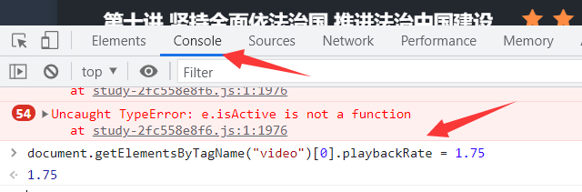

[Toc]

# 获取当前事件触发元素

```
window.event.target
document.event.target

var div1 = document.getElementById("div1");
 div2.onclick = function(event){  // 红色面板加事件
  
}; 
```

# 数据类型转换

## JSON.stringify()

```
### JS对象转JSON
var json = {"name":"iphone","price":666}; //创建对象；
var jsonStr = JSON.stringify(json);       //转为JSON字符串
console.log(jsonStr);

### 数组转json串
var arr = [1,2,3, { a : 1 } ];
JSON.stringify( arr );


```

## JSON.parse()

```
### json字符串转数组
var jsonStr = '[1,2,3,{"a":1}]';
var jsarr=JSON.parse( jsonStr );
alert(jsarr[0]);

### JSON转JS对象
var jsonString = '{"bar":"property","baz":3}';
var jsObject = JSON.parse(jsonString);    //转换为json对象
alert(jsObject.bar);    //取json中的值
```

# this四种绑定形式

## 1. 默认绑定

> 当一个函数**没有明确的调用对象**的时候，也就是单纯作为独立函数调用的时候，将对函数的this使用默认绑定：**绑定到全局的window对象**

```
//范例1
function fire () {
  console.log(this === window)
}
fire(); // 输出true

//范例2
function fire () {
 // 我是被定义在函数内部的函数哦！
  function innerFire() {
 console.log(this === window)
  }
  innerFire(); // 独立函数调用
}
fire(); // 输出true
```

## 2. this的隐式绑定

> 当函数被一个对象“包含”的时候，我们称函数的this被隐式绑定到这个对象里面了，这时候，通过this可以直接访问所绑定的对象里面的其他属性，比如下面的a属性

```
var obj = {
  a: 1,
  fire: function () {
   console.log(this.a)
  }
}
obj.fire(); // 输出1

// 我是第一段代码
function fire () {
  console.log(this.a)
}
var obj = {
  a: 1,
  fire: fire
 }
obj.fire(); // 输出1
// 我是第二段代码
var obj = {
  a: 1,
  fire: function () {
    console.log(this.a)
   }
}
obj.fire(); // 输出1

fire函数并不会因为它被定义在obj对象的内部和外部而有任何区别，也就是说在上述隐式绑定的两种形式下，fire通过this还是可以访问到obj内的a属性，这告诉我们： 
1.  this是动态绑定的，或者说是在代码运行期绑定而不是在书写期
2.  函数于对象的独立性， this的传递丢失问题 
```

# 数组遍历

## `forEach`

> 遍历数组中的每一项，**没有返回值**，对原数组没有影响，不支持IE

```
//1 没有返回值;参数：item 数组中的当前项, index 当前项的索引, array 原始数组；
//数组中有几项，那么传递进去的匿名回调函数就需要执行几次
arr.forEach((item,index,array)=>{
    //执行代码
})
```

## `map`

> **有返回值**
> map的回调函数中支持return返回值；**return的是啥，相当于把数组中的这一项变为啥**（并不影响原来的数组，只是相当于把原数组克隆一份，把克隆的这一份的数组中的对应项改变了）；

```
arr.map(function(value,index,array){
　　//do something
　　return XXX
})
var ary = [12,23,24,42,1]; 
var res = ary.map(function (item,index,ary ) { 
    return item*10; 
}) 
console.log(res);//-->[120,230,240,420,10];  原数组拷贝了一份，并进行了修改
console.log(ary);//-->[12,23,24,42,1]；  原数组并未发生变化

```

## `filter`

> 不会改变原始数组,**返回新数组**

```
var arr = [
  { id: 1, text: 'aa', done: true },
  { id: 2, text: 'bb', done: false }
]
console.log(arr.filter(item => item.done))

arr.filter(item => item.include("a")) //当数组包含a时返回true
```

**转为ES5**

```
arr.filter(function (item) {
  return item.done;
});
var arr = [73,84,56, 22,100]
var newArr = arr.filter(item => item>80)   //得到新数组 [84, 100]
console.log(newArr,arr)
```

## `every`

> every()是对数组中的每一项运行给定函数，如果该函数对每一项返回true,则返回true。**返回布尔值**

```
var arr = [ 1, 2, 3, 4, 5, 6 ]; 
console.log( arr.every( function( item, index, array ){ 
   return item > 3; 
})); 
```

## `find`

> find()方法**返回数组中符合测试函数条件的第一个元素**。**否则返回undefined**

```
var stu = [
    {
        name: '张三',
        gender: '男',
        age: 20
    },
    {
        name: '王小毛',
        gender: '男',
        age: 20
    },
    {
        name: '李四',
        gender: '男',
        age: 20
    }
]
function getStu(element){
   return element.name == '李四'
}

stu.find(getStu)
//返回结果为
//{name: "李四", gender: "男", age: 20}
```

-**ES6方法**

```
stu.find((element) => (element.name == '李四'))
```

## `findIndex`

> **返回索引值**，如果没有符合条件的元素则返回-1
>
> findIndex 不会改变数组对象。

```
[1,2,3].findIndex(function(x) { x == 2; });
// Returns an index value of 1.
[1,2,3].findIndex(x => x == 4);
// Returns an index value of -1.
```


# 字符串拼接

## 1. 使用加号运算符

```
  let result = ""; //定义一个空字符串
  let fruits = ["Banana", "Orange", "Apple", "Mango"];  //定义一个数组
  for (i = 0; i < fruits.length; i++) {  //使用for循环遍历数组中的元素
      if (fruits[i] === "Apple"){
          result = "Apple元素在数组中的索引号为：" + i; //使用加号运算符连接字符串
      };
  } 
  alert(result);  //输出结果为：Apple元素在数组中的索引号为：2

```

## 2. 使用${}配合反引号

**注意**：一定是用反引号啊！不要写成单引号了！！

```
  let result = ""; //定义一个空字符串
  let fruits = ["Banana", "Orange", "Apple", "Mango"];  //定义一个数组
  for (i = 0; i < fruits.length; i++) {  //使用for循环遍历数组中的元素
      if (fruits[i] === "Apple"){
          result = `Apple元素在数组中的索引号为：${i}`; //使用反引号和${}连接字符串
      };
  } 
  alert(result);  //输出结果为：Apple元素在数组中的索引号为：2

```

## 3. 使用[concat](https://so.csdn.net/so/search?q=concat&spm=1001.2101.3001.7020)()函数

```
  let result = ""; //定义一个空字符串
  let fruits = ["Banana", "Orange", "Apple", "Mango"];  //定义一个数组
  for (i = 0; i < fruits.length; i++) {  //使用for循环遍历数组中的元素
      if (fruits[i] === "Apple"){
          result = "Apple元素在数组中的索引号为："; 
          result = result.concat(i);  //使用concat()连接字符串
      };
  } 
  alert(result);  //输出结果为：Apple元素在数组中的索引号为：2

```

## 4. 使用join()函数（针对数组中的字符连接）

```
  let result = ""; //定义一个空字符串
  let Array = []; //定义一个空数组
  let fruits = ["Banana", "Orange", "Apple", "Mango"];  //定义一个数组
  for (i = 0; i < fruits.length; i++) {  //使用for循环遍历数组中的元素
      if (fruits[i] === "Apple"){
          Array.push("Apple元素在数组中的索引号为：", i);  //使用push()函数将元素添加到空数组Array中
          result = Array.join('');  //使用join()连接数组中的字符串
          //join()括号中要使用引号（单引号/双引号），否则会把数组元素之间的逗号也加进来
      };
  } 
  alert(result);  //输出结果为：Apple元素在数组中的索引号为：2

```

# 判断对象是否为空

- **方案1**

```
let data = {};
//判断空对象
let count = Object.keys(data).length;
//用Object.keys(data).length来判断是否味空对象， 如果为空对象，length == 0
```

- **方案2**

```
JSON.stringify(evtValue)=='{}'
```

# 对象合并

## 1. 拓展运算符`...`

> ES6入门中是这样说的:
>
> 对象的扩展运算符（`...`）用于取出参数对象的所有可遍历属性，拷贝到当前对象之中。
>
> 由下面的代码可以看出：
>
> - 同名属性：合并，并且后边的（obj2）把前边的（obj1）覆盖。
> - 不同名属性：属性值不变，只合并。
>
> 注：第一级是深拷贝，第二级开始都是浅拷贝。

```
let obj1 = {
    name: '陈伟霆',
    gender: '男',
    hobby: '唱歌'
};
let obj2 = {
    name: '陈伟霆',
    gender: '男',
    hobby: '跳舞',
    nationality: '中国'
};
 
let obj = {...obj1, ...obj2};
console.log(obj);  // { name: '陈伟霆', gender: '男', hobby: '跳舞', nationality: '中国' }
```

## 2. Object.assign()

> MDN上是这样写的：
>
> `**Object.assign()**` 方法用于将所有可枚举属性的值从一个或多个源对象分配到目标对象。它将返回目标对象

```
### 用于对象合并，写法如下： 
let obj = Object.assign({}, obj1, obj2);
console.log(obj);  // { name: '陈伟霆', gender: '男', hobby: '跳舞', nationality: '中国' }

```

由上面的代码可以看出，效果与法一相同。 
注：第一级是深拷贝，第二级开始都是浅拷贝。

## 3. 递归赋值

```
let obj = obj1;
for (var p in obj2){
    if(obj2.hasOwnProperty(p))
    obj[p] = obj2[p];
}
console.log(obj);  // { name: '陈伟霆', gender: '男', hobby: '跳舞', nationality: '中国' }
```

由上面的代码可以看出，效果与法一相同。 类似于直接赋值增加属性

注：第一级是深拷贝，第二级开始都是浅拷贝

## 4. [jquery](https://so.csdn.net/so/search?q=jquery&spm=1001.2101.3001.7020)中的extend()

```
jQuery.extend() 函数用于将一个或多个对象的内容合并到目标对象。
$.extend(obj1, obj2)  // 浅拷贝
$.extend(true, obj1, obj2)  // 深拷贝
```

# 数组合并

## 1. 扩展操作符

> 使用ES6语法的拓展运算符：这个方法也是创建一个新数组

```
var newArray = [...array,...elements]
console.log(newArray); // ["a", "b", 0, 1, 2]
```

## 2. 使用`array.concat`方法进行合并

> 使用concat方法：这个方法不是添加到现有数组，而是创建并返回一个新数组。

```
var array = ["a", "b"];
var elements = [0, 1, 2];
 
var newArray = array.concat(elements);
console.log(array); //['a', 'b']
console.log(newArray);// ["a", "b", 0, 1, 2]
```

## 3. 关于Apply

> 使用Apply方法：这个方法是将数组各项添加到另一个数组当中，是一种改变原数组的方法

```
var array = ["a", "b"];
var elements = [0, 1, 2];
array.push.apply(array, elements);
console.log(array); // ["a", "b", 0, 1, 2]
```

## 4. array.push()方法进行合并

```
const heroes = ['Batman'];
heroes.push('Superman');
heroes; // ['Batman', 'Superman']

const heroes = ['Batman', 'Superman'];
const villains = ['Joker', 'Bane']; 
heroes.push(...villains);
heroes; // ['Batman', 'Superman', 'Joker', 'Bane']
```


# 视频

## 视频倍速播放

> 代码： `document.getElementsByTagName("video")[0].playbackRate = 1.75`
> 数字1.75代表1.75倍速
>
> 按`F12`或者`fn+F12`来进入开发调试工具选择Console打开控制台输入代码，即可完成自定义倍速播放
>
> 

# 判断变量是否存在

## 判断是否为undefined

- **方案1**

```
if (t1===undefined)
```

- **方案2**

```
if(typeOf(x) ===   "undefined")
```

- **说明**

```
### 变量已声明
var type; //type 变量未赋值
1. type==undefined //true
2. type===undefined //true
3. typeof(type)=='undefined' //true
4. typeof(type)==='undefined' //ture
5. typeof type == 'undefined' //和第3种等价，true
6. typeof type === 'undefined' //和第4种等价，true
7. type==null //true
8. type===null //false

注： typeof type 的值是"undefined"，（typeof 返回的是字符串，有六种可能："number"、"string"、"boolean"、"object"、"function"、"undefined"）。

### 变量未声明
1. type1==undefined //Error: Uncaught ReferenceError: type1 is not defined at <anonymous>:1:1
2. type1===undefined //Error
3. typeof(type1)=='undefined' //true
4. typeof(type1)==='undefined' //ture
5. typeof type1 == 'undefined' //和第3种等价，true
6. typeof type1 === 'undefined' //和第4种等价，true
7. type1==null //Error: Uncaught ReferenceError: type1 is not defined at <anonymous>:1:1
8. type1===null //Error: Uncaught ReferenceError: type1 is not defined at <anonymous>:1:1
```


## 如何判断变量是否为null

```
if (exp === null)
```


# 参考资料来源

1. https://www.jb51.net/article/121164.htm
2. https://blog.csdn.net/Colbyzn/article/details/107743059