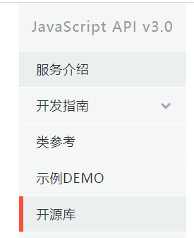

[Toc]

# 网址

1. [百度地图Web API](https://lbsyun.baidu.com/index.php?title=webapi/ip-api)
2. [百度地图JavaScript API](https://lbsyun.baidu.com/index.php?title=jspopular3.0)
3. [VUE-BaiDu-Map](https://dafrok.github.io/vue-baidu-map/#/zh/start/usage)

# 版本比较

| 版本                | 最新更新时间 | 简介                                                         |
| ------------------- | ------------ | ------------------------------------------------------------ |
| JavaScript API GL   | 2020-08-07   | 使用了WebGL对地图、覆盖物等进行渲染， 支持3D视角展示地图 |
| JavaScript API v3.0 | 2017-12-27   | 2D地图，但点聚合显示比API GL灵动些                           |
| JavaScript API Lite | 2017-12-27   | 和JavaScript API标准版相比， Lite版专门针对移动端H5页面的使用场景， 代码体积小，性能更好。 Lite版不支持PC浏览器 |

## JavaScritp API v3.0说明文档说明

- **服务介绍**：API提供的相关功能概览；
- **开发指南**：各项功能开发过程&应用说明；
- **类参考**：API中涉及到的类说明；
- **示例DEMO**:各项功能的demo;
- **开源库**：二次开发的开源库，包含大数据展示的各项库说明&概览。

# 在聚合点添加事件

> 如何给百度地图聚合点绑定事件,并获取聚合点中的marker相关数据

# 参考资料

1. https://lbsyun.baidu.com/index.php?title=jspopular3.0
2. https://lbsyun.baidu.com/index.php?title=jspopular3.0/openlibrary
3. https://www.imooc.com/wenda/detail/493450