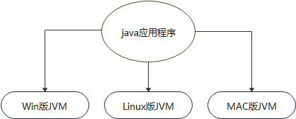
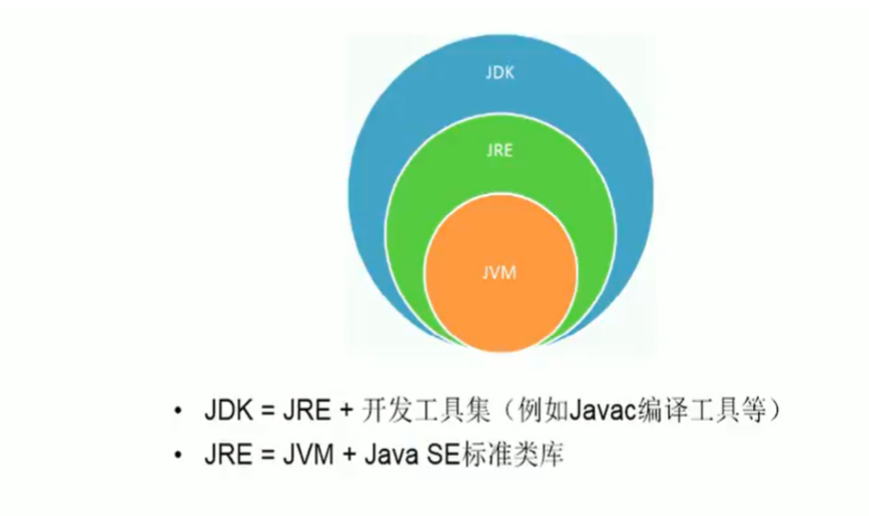
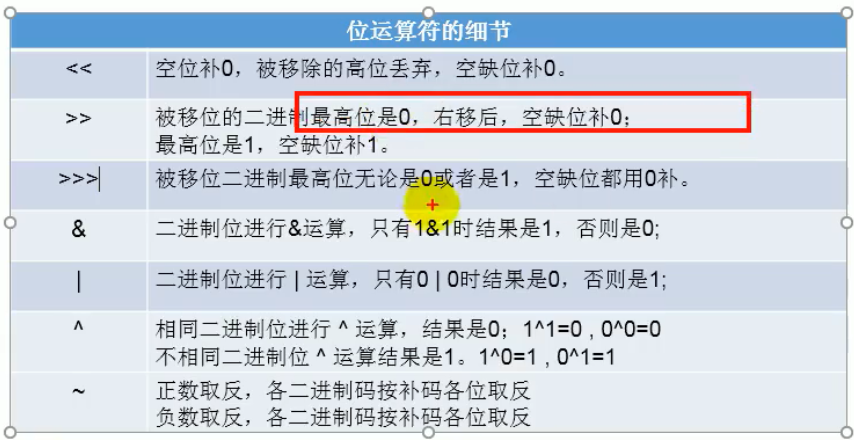

# 常用DOS命令
```
dir 列出当前目录下的文件以及文件夹
md +文件名 创建目录
rd  删除目录，只能删除空目录
cd  进入指定目录
cd..  退回到上一级目录
cd\  退回到根目录
del  删除文件
exit  退出dos命令行
echo javase>1.doc  创建内容为javase的1.doc文件

常用快捷键：
<——  ——> 移动光标
↓ ↑ 调阅历史操作命令
Delete Backspace  删除字符

```

**示例**
1. 进入d盘
```
C:\Users\12613>d:

//结果
D:\>

```
2. 显示d盘目录
```
D:\>dir

//执行结果

 驱动器 D 中的卷是 新加卷
 卷的序列号是 3AB1-75ED
 D:\ 的目录

2020/02/13  16:55    <DIR>          360
2020/02/15  13:23    <DIR>          commonApp
2020/07/03  16:02    <DIR>          download
2020/05/12  17:15    <DIR>          freeworkspace
2019/10/19  10:55    <DIR>          KuGou
2020/01/02  17:48    <DIR>          programApp
2020/01/02  16:57    <DIR>          QMDownload
2020/07/03  14:57    <DIR>          temp
2020/02/14  13:15    <DIR>          程序
2020/06/20  00:01    <DIR>          迅雷下载
               0 个文件              0 字节
              10 个目录 184,597,286,912 可用字节
```
3. 目录切换
```
C:\Users\12613>d:   //由c盘进入d盘

D:\>md java  //在d盘创建目录java

D:\>cd d:\java  //进入d盘java目录方式1

d:\java>md temp1 //在d盘java目录下创建temp1目录

d:\java>cd temp1 // 进入d盘java目录下创建temp1目录

d:\java\temp1>cd .. //返回temp1上层目录方式1

d:\java>cd.. //返回上一层目录

d:\>cd java\temp1 //进入指定目录方式2

d:\java\temp1>cd/  //直接返回根目录方式1

d:\>cd java/temp1

d:\java\temp1>cd\  //直接返回根目录方式2

d:\java>echo javase>1.doc //在java目录下创建1.doc文件
d:\java>del 1.doc //删除java目录下的1.doc文件
d:\java>del *.doc //删除所有以doc结尾的文件
d:\java>rd temp1  //删除temp1空目录

//使用rd删除不为空目录时
d:\java>rd temp2  //直接使用rd会提示目录不为空
目录不是空的。
d:\java>del temp2 //使用del删除temp2下文件
d:\java\temp2\*, 是否确认(Y/N)? y
d:\java>rd temp2 //此时temp2目录下为空，可删除成功
```

[Toc]

# Java的语言特点

1. 面向对象；

2. 健壮性：去掉了指针等影响内存运行因素，提供了垃圾回收机制；

3. 跨平台性：原理：在不同操作系统上安装对应系统平台的Java虚拟机，有Java虚拟集负责Java程序在该系统中的运行。

   


# Java语言运行机制及运行原理


# Java虚拟机

> JVM是一个虚拟的计算机，具有指令集并使用不同的存储区域。负责执行指令，管理数据、内存、寄存器。  
>
> - 对于不同平台有不同虚拟机  
> - 只有某平台提供了对应的java虚拟机，Java程序才可在此平台运行  
> - java虚拟机机制屏蔽了底层运行平台的差别，实现了“一次编译，到处运行
> - 


# JDK & JRE

- JDK(Java Development Kit)

> Java开发工具包：提供给Java开发人员使用的，包含JRE。所以安装了JDK就不需再单独安装JRE了.包含的工具编译工具(javac.exe)和打包工具(jar.exe)

- JRE(Java Runtime Enviroment)

> Java运行环境：包括java虚拟机和Java程序所需的核心内库。如果想要运行一个开发好的Java程序，计算机中只要安装JRE即可。

**简单而言，使用JDK的开发工具完成的java程序，交给JRE去运行。**



- 不同操作系统，需要安装对应版本的JDK


## JDK安装目录

`bin`目录：包含java开发工具，javac.exe,java.exe等；
`db`目录：java实现的数据库
`include`目录：c语言需要应用的文件
`jre`目录:
`lib`目录：jar包

## 环境变量

> 为了在任何的文件目录下都可以执行jdk中bin的命令，就需要配置环境变量。

> path环境变量：windows系统执行命令时所要搜索的路径

> 用户变量和系统变量：一般来说，可以通用。用户变量：只适用于当前用户，若不是当前用户，则无法使用。系统变量：应用于系统，无论哪个用户都可以


[Toc]

# java程序执行过程


> 字节码文件名称为java文件的类名；  
> windows系统下文件名不区分大小写；


# 注释

1. 单行注释；
2. 多行注释；
3. 文档注释(java特有)

> 单行注释和多行注释不参与编译，即.class文件中不包含注释的文字信息

>文档注释：注释内容可被JDK提供的工具javadoc所解析，生成一套网页文档形式的该程序的说明文档。

# 命名规范

## 命名风格

1. 【强制】代码中的命名均不能以下划线或美元符号开始，也不能以下划线或美元符号结束。

   反例：_name / __name / $Object / name_ / name$ / Object$

2. 【强制】代码中的命名严禁使用拼音与英文混合的方式，更不允许直接使用中文的方式。
   说明：正确的英文拼写和语法可以让阅读者易于理解，避免歧义。注意，即使纯拼音命名方式
   也要避免采用。
   正例：alibaba / taobao / youku / hangzhou 等国际通用的名称，可视同英文。
   反例：DaZhePromotion [打折] / getPingfenByName() [评分] / int 某变量 = 3

3. 【强制】类名使用 UpperCamelCase 风格，必须遵从驼峰形式，但以下情形例外：DO / BO / DTO / VO / AO
   正例：MarcoPolo / UserDO / XmlService / TcpUdpDeal / TaPromotion
   反例：macroPolo / UserDo / XMLService / TCPUDPDeal / TAPromotion

4. 【强制】方法名、参数名、成员变量、局部变量都统一使用 lowerCamelCase 风格，必须遵从驼峰形式。
   正例： localValue / getHttpMessage() / inputUserId

5. 【强制】常量命名全部大写，单词间用下划线隔开，力求语义表达完整清楚，不要嫌名字长。
   正例：MAX_STOCK_COUNT
   反例：MAX_COUNT

6. 【强制】抽象类命名使用 Abstract 或 Base 开头；异常类命名使用 Exception 结尾；测试类命名以它要测试的类的名称开始，以 Test 结尾。

7. 【强制】中括号是数组类型的一部分，数组定义如下：String[] args;
   反例：使用 String args[]的方式来定义。

8. 【强制】POJO 类中布尔类型的变量，都不要加 is，否则部分框架解析会引起序列化错误。
   反例：定义为基本数据类型 Boolean isDeleted；的属性，它的方法也是 isDeleted()，RPC阿里巴巴 Java 开发手册框架在反向解析的时候，“以为”对应的属性名称是 deleted，导致属性获取不到，进而抛出异常。

9. 【强制】包名统一使用小写，点分隔符之间有且仅有一个自然语义的英语单词。包名统一使用单数形式，但是类名如果有复数含义，类名可以使用复数形式。
   正例： 应用工具类包名为 com.alibaba.open.util、类名为 MessageUtils（此规则参考spring 的框架结构）

10. 【强制】杜绝完全不规范的缩写，避免望文不知义。
    反例：AbstractClass“缩写”命名成 AbsClass；condition“缩写”命名成 condi，此类随意缩写严重降低了代码的可阅读性。

11. 【推荐】为了达到代码自解释的目标，任何自定义编程元素在命名时，使用尽量完整的单词组合来表达其意。
    正例：从远程仓库拉取代码的类命名为 PullCodeFromRemoteRepository。
    反例：变量 int a; 的随意命名方式。

12. 【推荐】如果模块、接口、类、方法使用了设计模式，在命名时体现出具体模式。
    说明：将设计模式体现在名字中，有利于阅读者快速理解架构设计理念。
    正例：public class OrderFactory;
    public class LoginProxy;
    public class ResourceObserver;

13. 【推荐】接口类中的方法和属性不要加任何修饰符号（public 也不要加），保持代码的简洁性，并加上有效的 Javadoc 注释。尽量不要在接口里定义变量，如果一定要定义变量，肯定是与接口方法相关，并且是整个应用的基础常量。
    正例：接口方法签名：void f();
    接口基础常量表示：String COMPANY = "alibaba";
    反例：接口方法定义：public abstract void f();
    说明：JDK8 中接口允许有默认实现，那么这个 default 方法，是对所有实现类都有价值的默认实现。

14. 接口和实现类的命名有两套规则：
    1）【强制】对于 Service 和 DAO 类，基于 SOA 的理念，暴露出来的服务一定是接口，内部的实现类用 Impl 的后缀与接口区别。
    正例：CacheServiceImpl 实现 CacheService 接口。
    2）【推荐】如果是形容能力的接口名称，取对应的形容词做接口名（通常是–able 的形式）。
    正例：AbstractTranslator 实现 Translatable。

15. 【参考】枚举类名建议带上 Enum 后缀，枚举成员名称需要全大写，单词间用下划线隔开。
    说明：枚举其实就是特殊的常量类，且构造方法被默认强制是私有。
    正例：枚举名字为 ProcessStatusEnum 的成员名称：SUCCESS / UNKOWN_REASON。

16. 【参考】各层命名规约：
    A. **Service/DAO 层方法命名规约**
      1） 获取单个对象的方法用 get 做前缀。
      2） 获取多个对象的方法用 list 做前缀。
      3） 获取统计值的方法用 count 做前缀。
      4） 插入的方法用 save/insert 做前缀。
      5） 删除的方法用 remove/delete 做前缀。
      6） 修改的方法用 update 做前缀。

​     B  **领域模型命名规约**
​         1） 数据对象：xxxDO，xxx 即为数据表名。
​         2） 数据传输对象：xxxDTO，xxx 为业务领域相关的名称。
​         3） 展示对象：xxxVO，xxx 一般为网页名称。
​         4） POJO 是 DO/DTO/BO/VO 的统称，禁止命名成 xxxPOJO。 

- **遵循规则**

  > 1) 名称只能由字母、数字、下划线、$符号组成
  >
  > 2) 不能以数字开头
  >
  > 3) 名称不能使用JAVA中的关键字。
  >
  > 4) 最好不出现中文/拼音，但依据项目具体情况确定；

## URL命名规范

### 资源原型分类

> 为了更清晰，让我们将资源原型划分为四个类别(文档、集合、存储和控制器)。如果您总是有目标地将资源放入一个原型中，然后一致地使用它的命名约定，那将是最好的。

1. **文档型(document)**

   > 文档资源类似对象实例&数据库记录

   ```
   http://api.example.com/device-management/managed-devices/{device-id}
   http://api.example.com/user-management/users/{id}
   http://api.example.com/user-management/users/admin
   ```

2. **集合(collection)**

   > 集合资源：服务器管理的资源目录。
   >
   > 客户端可能会需要添加一些资源到服务端，可以使用复数表示一个集合

   ```
   http://api.example.com/device-management/managed-devices
   http://api.example.com/user-management/users
   http://api.example.com/user-management/users/{id}/accounts
   ```

3. **存储(store)**

   > 存储是客户端管理的资源存储库。存储资源允许API客户端将资源放入、取出，并决定何时删除它们。
   >
   > 存储永远不会生成新的uri。相反，每个存储的资源都有一个URI。URI是在资源最初将其放入存储时由客户机选择的。

   ```
   http://api.example.com/song-management/users/{id}/playlists
   ```

4. **控制器(controller)**

   > 控制器资源为过程概念建模。控制器资源类似于可执行函数，具有参数和返回值、输入和输出。

   ```
   http://api.example.com/cart-management/users/{id}/cart/checkout 
   http://api.example.com/song-management/users/{id}/playlist/play
   ```

### 命名的一致性

1. 使用名词标识资源，而不是动词使用`/`指明等级/模块关系；

```
http://api.example.com/device-management
http://api.example.com/device-management/managed-devices
http://api.example.com/device-management/managed-devices/{id}
http://api.example.com/device-management/managed-devices/{id}/scripts

### 个体&集合的表示：某个集合中的特定一个
/customers/{customerId}
### 父集合&子集合的表示：customers 父集合；accounts：子集合   
/customers/{customerId}/accounts/{accountId}  //指向customer集合中某个特定customer的子集合account中的某个特定accountID
```

2. 不要在url末尾使用`/`

3. 使用`-`连接俩个单词，提高可读性，不要使用`_`连接独立单词；

   ```
   http://api.example.com/device-management/managed-devices/
   http://api.example.com/device-management/managed-devices 	/*This is much better version*/
   ```

4. 在`url`中使用小写；

5. 不要使用文件扩展名

   ```
   http://api.example.com/device-management/managed-devices.xml  /*Do not use it*/
   http://api.example.com/device-management/managed-devices 	/*This is correct URI*/
   ```

6. 不要使用`CRUD`方法名:在url中应该是标识资源路径而不是操作

   ```
   HTTP GET http://api.example.com/device-management/managed-devices  //Get all devices
   HTTP POST http://api.example.com/device-management/managed-devices  //Create new Device
   
   HTTP GET http://api.example.com/device-management/managed-devices/{id}  //Get device for given Id
   HTTP PUT http://api.example.com/device-management/managed-devices/{id}  //Update device for given Id
   HTTP DELETE http://api.example.com/device-management/managed-devices/{id}  //Delete device for given Id
   ```

7. 使用参数传递的方式，表示对资源的排序，过滤或者限制

   > 通常，您会遇到这样的需求:您需要根据某些特定的资源属性对资源进行排序、过滤或限制。
   >
   > 对于这个需求，不要创建新的API——而是在资源集合API中启用排序、过滤和分页功能，并将输入参数作为查询参数传递。如。

```
http://api.example.com/device-management/managed-devices
http://api.example.com/device-management/managed-devices?region=USA
http://api.example.com/device-management/managed-devices?region=USA&brand=XYZ
http://api.example.com/device-management/managed-devices?region=USA&brand=XYZ&sort=installation-date
```

# 变量

- 内存中的一个存储区域
- 该区域的数据可以在同一类型范围内不断变化
- 变量是程序中最基本的存储单元。包含变量类型、变量名、变量值

> 变量的作用：用于在内存中保存数据

**变量使用注意事项**：

- 变量必须先声明后使用；
- 变量都定义在作用域内，在其定义的作用域内是有效的，在其作用域外是无效的；
- 同一个作用域内不可声明俩个同名变量
- 作用域:其作用的区域在一对{}

## 变量类型

按声明位置的不同进行分类：


- 成员变量:在方法体外，类体内声明的变量；   
- 局部变量：在方法体内声明的变量；
- 实例变量：不以static修饰的变量；
- 类变量：以static修饰的变量；
- 形参：方法/构造器中定义的变量；
- 方法局部变量：在方法体内定义的变量；
- 代码块局部变量：在代码块内定义的变量

> 成员变量和局部变量在初始化值方面的异同：相同点:都有生命周期；不同点：局部变量除形参外，需显示初始化

# 数据类型

1. 基本数据类型
   - 整形：byte/short/int/long
   - 浮点型：float/double
   - 字符型：char
   - 布尔类型：boolean
2. 引用数据类型
   - 类(class)
   - 接口(interface)
   - 数组([])


## 浮点型

float:4字节，范围比long还大
double:8字节

声明long类型，结尾以l或者L结尾；  
声明float类型，结尾以f或者F结尾

## 字符型

char:2字节；字符内部只能写一个字符； 
转义字符：如'\n''\t' 
直接使用unicode表示字符


## 基本数据类型运算

1.自动转换：byte/char/short->  int -> long -> float -> double

> 当容量小的数据类型变量与容量大的数据类型的变量做运算时，结果自动转换为容量大的数据类型  
> 此处所指的容量大小，指的是表示数的范围大小；  
> 当byte/char/short这三种数据类型的变量做运算时，结果为int类型；

2.强制转换

> 容量大的数据类型变量转换为容量小的数据类型，可能导致精度损失  
> 浮点型转整形，以截断进行转换； 
> 整形常量默认为int型；浮点型常量，默认为double类型；

## String

1. String和8种基本数据类型做运算，只能用连接符做运算；


## 变量之进制

所有数字在计算机底层都以二进制存在

1. 二进制：0/1 以0b/0B开头；
2. 八进制：以数字0开头；
3. 十进制；
4. 十六进制：以0x/0X开头；

> Java整数常量默认为int类型，当用二进制定义整数类型时，其最高位为符号位；0为正 1为负

> 二进制的整数有如下三种形式：

- 原码：直接将一个数值转换为二进制，最高位为符号位；
- 负数的反码：对原码按位取反，只是最高位（符号位）为1；
- 负数的补码：其反码加1；

> 计算机以二进制补码的形式保存所有的整数。

- 正数的原码/补码/反码都相同；
- 负数的补码是其反码+1

> 十进制转二进制，除2取余的逆

> 进制转换可以以二进制为中转进行转换

# 运算符

`%`：取模运算，结果符号与被模数符号相同
`++`在前先自增一后运算；在后时先运算后自增一；  
`--`:在前先自减一再运算；在后时先运算后自减一  
自增和自减不会改变变量的数据类型；

```
a1=10;
b1=++a1
结果：b1=11
a2=10;
b2=a2++;
结果：b2=10
```

`=`:当俩侧数据类型不一致时，可以使用自动类型转换或者强制类型转换原则进行处理；支持连续赋值。  
扩展运算符：+=，-=，/=，%=，*= 不改变变量数据类型；

### 比较运算符

==，!=,>,<,>=,<=,instanceof 检查是否类的对象。

> 比较运算符结果是boolean类型；

### 逻辑运算符

`&，&&，||，|，!,^`

`&` 与 `&& `区别：
相同点：  

1. 倆者运算结果相同；
2. 当符号左边为true时，二者都会执行符号右边运算；
   不同点：
   当符号左边为false时，&继续执行符号右边运算，&&不再执行符号右边运算；

`|` 与 `||` 区别：
相同点：

1. 二者执行结果相同；
2. 当符号左边为false时，二者都会执行符号右边运算；
   不同点：当符号左边为true时，|继续执行符号右边运算，|| 不再执行符号右边运算；  

### 位运算符

> 位运算符操作的都是整形变量
> `<<` 在一定范围内，左移  每向左移n位，相当于在原来的数值上乘以2的n次方
> `>> `在一定范围内，右移  每向左移相当于时除以2
> 超过范围，移位符号可能发生变化。
> `>>>` 无符号右移  
> `&` 与运算  
> `|` 或运算  
> `^` 异或运算  
> `~` 取反运算 
> 位运算符时直接对整数的二进制进行运算
> 

### 三元运算符

#### Scanner

> 从键盘获取不同类型的变量，需要使用Scanner 类来获取指定类型的变量

```
package target;

import java.util.Scanner;

public class test1 {
public static void main(String[] args) {
	Scanner scanner=new Scanner(System.in);
	int num=scanner.nextInt();
	System.out.println(num);
}
}
```

# 流程结构

1. 顺序结构；
2. 分支结构；
3. 循环结构；

## switch结构

```
switch(表达式)
case 常量1：
执行语句1
//break;
case 条件2：
执行语句2
//break;
...
default:
执行语句
```

> 根据表达式的值，一次匹配常量值，一旦匹配成功，则进入相应case中，调用其执行语句，当调用完执行语句后，仍继续向下执行，直到遇到break关键字或者直到结构结束为止。

> switch结构表达式中，只能是如下6种类型：byte/short/int/boolean/string类型/枚举类型

## 循环结构

要素：

- 初始化条件；
- 循环条件；
- 循环体；
- 迭代条件

1. for循环；
2. while
3. do-while

> 经验写法：while(true)的应用<==> for(;;) 不在循环部分限制次数的结构。

## 嵌套循环

>经验：1. 一般不超过三层 2. 外层控制行数，内存控制列数；

# 数组

> 数组下标从0开始

按维数分类：

1. 一维数组；
2. 二维数组；

按数据类型分类：1）基本数据类型数组；2）引用数据类型分组

> 数组：多个相同数据类型按照一定顺序排列的集合，并使用一个名称命名，并通过编号的方式进行统一管理。

数组元素的默认初始化值：

- 数组元素是整形：0
- 数组元素是浮点型：0
- 数组元素是char类型：0或'\u000'而非'0'
- 数组元素是boolean型：false
- 数组元素是引用类型：null

## 一维数组&二维数组

```
int[] int1 = new int[]{0,1,2,3};//静态初始化
int[] int2=new int[3];动态初始化
int[] int1 = {0,1,2,3};//类型推断
int[0]=1;//赋值

int arr1[][] = new int[][] { { 0, 1, 2 }, { 0, 1 }, { 0, 3, 4, 9 } };// 静态初始化；
int arr1[][] = { { 0, 1, 2 }, { 0, 1 }, { 0, 3, 4, 9 } };
String arr2[][] = new String[3][4];// 动态初始化1
String arr3[][] = new String[3][];// 动态初始化2

```

# Java类及类的成员

> 属性、方法、构造器、内部类、代码块

## 面向对象的三大特征

> 封装性、继承性、多态性

## 其他关键字 

> this  super static final abstract interface import package等

## 面向过程与面向对象

- **面向过程**：强调的是功能行为，以函数为最小单位；
- **面向对象**：强调具备功能的对象，以类/对象为最小单位；

> 面向对象的程序设计重点是设计类，而设计类，就是设计类的成员

**类结构**：

- 属性=成员变量=Field=域/字段；

- 方法=成员方法=函数=method

>  创建类的对象=类的实例化=实例化类。

# Kotlin

> Kotlin在java虚拟机上运行的静态类型编程语言，可以编译成Java字节码，也可以编译成JavaScript,方便在没有JVM的设备上运行


# 参考资料

1. https://restfulapi.net/resource-naming/
2. 《阿里巴巴Java开发手册终极版》
3. https://blog.csdn.net/liunianqingshi/article/details/77044002