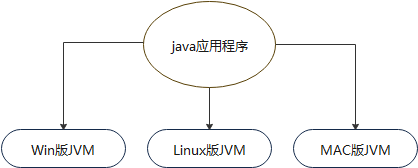
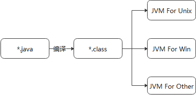
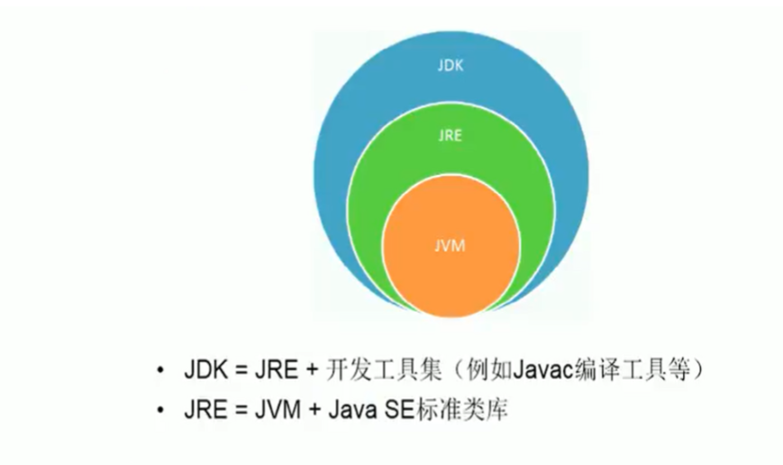

[Toc]
### Java的语言特点
1. 面向对象；

2. 健壮性：去掉了指针等影响内存运行因素，提供了垃圾回收机制；

3. 跨平台性：原理：在不同操作系统上安装对应系统平台的Java虚拟机，有Java虚拟集负责Java程序在该系统中的运行。

   

### Java语言运行机制及运行原理

### Java虚拟机
> JVM是一个虚拟的计算机，具有指令集并使用不同的存储区域。负责执行指令，管理数据、内存、寄存器。  
> - 对于不同平台有不同虚拟机  
> - 只有某平台提供了对应的java虚拟机，Java程序才可在此平台运行  
> - java虚拟机机制屏蔽了底层运行平台的差别，实现了“一次编译，到处运行
> - 

### JDK & JRE
- JDK(Java Development Kit)
> Java开发工具包：提供给Java开发人员使用的，包含JRE。所以安装了JDK就不需再单独安装JRE了.包含的工具编译工具(javac.exe)和打包工具(jar.exe)
- JRE(Java Runtime Enviroment)
> Java运行环境：包括java虚拟机和Java程序所需的核心内库。如果想要运行一个开发好的Java程序，计算机中只要安装JRE即可。

**简单而言，使用JDK的开发工具完成的java程序，交给JRE去运行。**

- 不同操作系统，需要安装对应版本的JDK

#### JDK安装目录
`bin`目录：包含java开发工具，javac.exe,java.exe等；
`db`目录：java实现的数据库
`include`目录：c语言需要应用的文件
`jre`目录:
`lib`目录：jar包

#### 环境变量
> 为了在任何的文件目录下都可以执行jdk中bin的命令，就需要配置环境变量。

> path环境变量：windows系统执行命令时所要搜索的路径

> 用户变量和系统变量：一般来说，可以通用。用户变量：只适用于当前用户，若不是当前用户，则无法使用。系统变量：应用于系统，无论哪个用户都可以