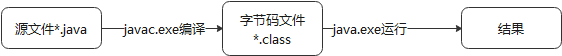
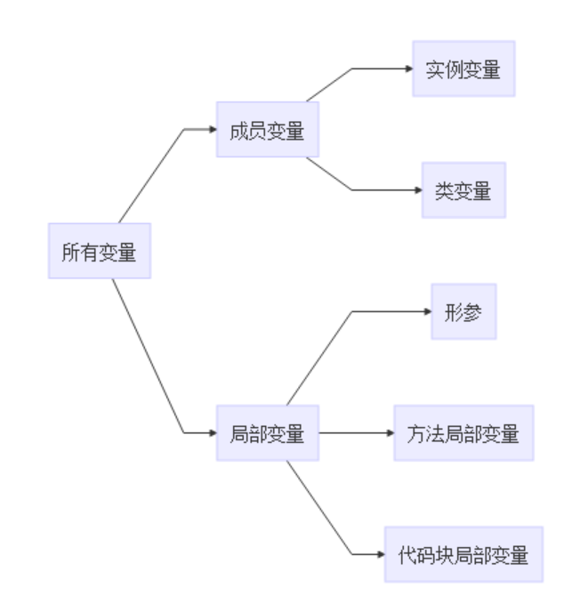
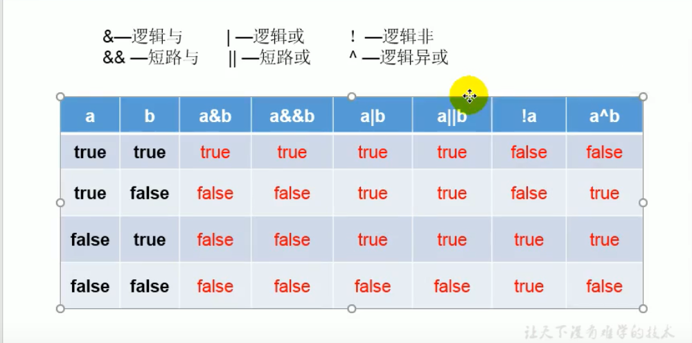
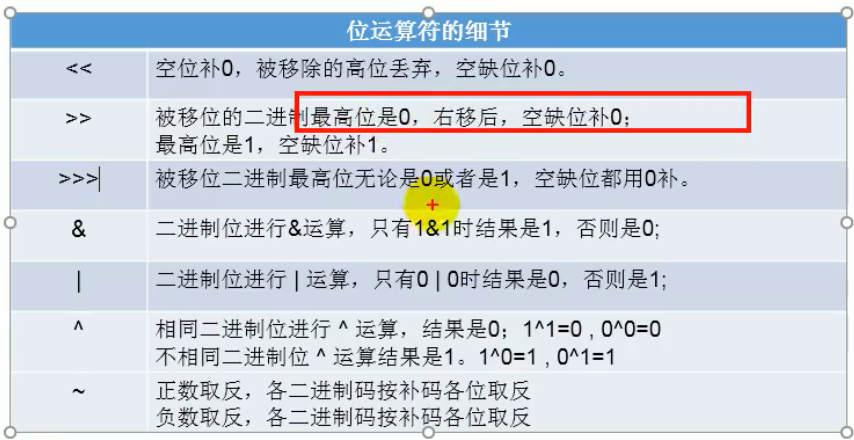

[Toc]
### java程序执行过程




> 字节码文件名称为java文件的类名；  
> windows系统下文件名不区分大小写；


### 注释
1. 单行注释；
2. 多行注释；
3. 文档注释(java特有)
> 单行注释和多行注释不参与编译，即.class文件中不包含注释的文字信息

>文档注释：注释内容可被JDK提供的工具javadoc所解析，生成一套网页文档形式的该程序的说明文档。

### 命名规范
1. 包名：多单词组成时，所有单词都小写：xxyyzz;
2. 类名、接口名：多单词组成时，所有单词首字母大写：XxxYyyZzz;
3. 变量名、方法名：多单词组成时，第一个单词首字母小写，从第二个单词开始首字母大写：xxxYyyZzz;
4. 常量名：所有字母都大写。多单词时，每个单词用下划线连接：XXX_YYY_ZZZ

### 变量
- 内存中的一个存储区域
- 该区域的数据可以在同一类型范围内不断变化
- 变量是程序中最基本的存储单元。包含变量类型、变量名、变量值

> 变量的作用：用于在内存中保存数据

**变量使用注意事项**：
- 变量必须先声明后使用；
- 变量都定义在作用域内，在其定义的作用域内是有效的，在其作用域外是无效的；
- 同一个作用域内不可声明俩个同名变量
- 作用域:其作用的区域在一对{}

### 数据类型
1. 基本数据类型
   - 整形：byte/short/int/long
   - 浮点型：float/double
   - 字符型：char
   - 布尔类型：boolean
2. 引用数据类型
   - 类(class)
   - 接口(interface)
   - 数组([])
   
### 变量类型
按声明位置的不同进行分类：



- 成员变量:在方法体外，类体内声明的变量；   
- 局部变量：在方法体内声明的变量；
- 实例变量：不以static修饰的变量；
- 类变量：以static修饰的变量；
- 形参：方法/构造器中定义的变量；
- 方法局部变量：在方法体内定义的变量；
- 代码块局部变量：在代码块内定义的变量

> 成员变量和局部变量在初始化值方面的异同：相同点:都有生命周期；不同点：局部变量除形参外，需显示初始化

#### 浮点型
float:4字节，范围比long还大
double:8字节

声明long类型，结尾以l或者L结尾；  
声明float类型，结尾以f或者F结尾

#### 字符型
char:2字节；字符内部只能写一个字符； 
转义字符：如'\n''\t' 
直接使用unicode表示字符


### 基本数据类型运算
1.自动转换：byte/char/short->  int -> long -> float -> double
> 当容量小的数据类型变量与容量大的数据类型的变量做运算时，结果自动转换为容量大的数据类型  
> 此处所指的容量大小，指的是表示数的范围大小；  
> 当byte/char/short这三种数据类型的变量做运算时，结果为int类型；

2.强制转换
> 容量大的数据类型变量转换为容量小的数据类型，可能导致精度损失  
> 浮点型转整形，以截断进行转换； 
> 整形常量默认为int型；浮点型常量，默认为double类型；

### String
1. String和8种基本数据类型做运算，只能用连接符做运算；


### 变量之进制
所有数字在计算机底层都以二进制存在
1. 二进制：0/1 以0b/0B开头；
2. 八进制：以数字0开头；
3. 十进制；
4. 十六进制：以0x/0X开头；

> Java整数常量默认为int类型，当用二进制定义整数类型时，其最高位为符号位；0为正 1为负

> 二进制的整数有如下三种形式：
- 原码：直接将一个数值转换为二进制，最高位为符号位；
- 负数的反码：对原码按位取反，只是最高位（符号位）为1；
- 负数的补码：其反码加1；
> 计算机以二进制补码的形式保存所有的整数。
- 正数的原码/补码/反码都相同；
- 负数的补码是其反码+1

> 十进制转二进制，除2取余的逆

> 进制转换可以以二进制为中转进行转换

### 运算符
`%`：取模运算，结果符号与被模数符号相同
`++`在前先自增一后运算；在后时先运算后自增一；  
`--`:在前先自减一再运算；在后时先运算后自减一  
自增和自减不会改变变量的数据类型；
```
a1=10;
b1=++a1
结果：b1=11
a2=10;
b2=a2++;
结果：b2=10
```

`=`:当俩侧数据类型不一致时，可以使用自动类型转换或者强制类型转换原则进行处理；支持连续赋值。  
扩展运算符：+=，-=，/=，%=，*= 不改变变量数据类型；

#### 比较运算符
==，!=,>,<,>=,<=,instanceof 检查是否类的对象。
> 比较运算符结果是boolean类型；

#### 逻辑运算符
`&，&&，||，|，!,^`

`&` 与 `&& `区别：
相同点：  

1. 倆者运算结果相同；
2. 当符号左边为true时，二者都会执行符号右边运算；
不同点：
当符号左边为false时，&继续执行符号右边运算，&&不再执行符号右边运算；

`|` 与 `||` 区别：
相同点：
1. 二者执行结果相同；
2. 当符号左边为false时，二者都会执行符号右边运算；
不同点：当符号左边为true时，|继续执行符号右边运算，|| 不再执行符号右边运算；  

#### 位运算符
> 位运算符操作的都是整形变量
> `<<` 在一定范围内，左移  每向左移n位，相当于在原来的数值上乘以2的n次方
> `>> `在一定范围内，右移  每向左移相当于时除以2
> 超过范围，移位符号可能发生变化。
> `>>>` 无符号右移  
> `&` 与运算  
> `|` 或运算  
> `^` 异或运算  
> `~` 取反运算 
> 位运算符时直接对整数的二进制进行运算
> 

#### 三元运算符

#### Scanner
> 从键盘获取不同类型的变量，需要使用Scanner 类来获取指定类型的变量

```
package target;

import java.util.Scanner;

public class test1 {
public static void main(String[] args) {
	Scanner scanner=new Scanner(System.in);
	int num=scanner.nextInt();
	System.out.println(num);
}
}
```


### 流程结构
1. 顺序结构；
2. 分支结构；
3. 循环结构；
#### switch结构
```
switch(表达式)
case 常量1：
执行语句1
//break;
case 条件2：
执行语句2
//break;
...
default:
执行语句
```
> 根据表达式的值，一次匹配常量值，一旦匹配成功，则进入相应case中，调用其执行语句，当调用完执行语句后，仍继续向下执行，直到遇到break关键字或者直到结构结束为止。

> switch结构表达式中，只能是如下6种类型：byte/short/int/boolean/string类型/枚举类型

#### 循环结构
要素：
- 初始化条件；
- 循环条件；
- 循环体；
- 迭代条件

1. for循环；
2. while
3. do-while

> 经验写法：while(true)的应用<==> for(;;) 不在循环部分限制次数的结构。

#### 嵌套循环
>经验：1. 一般不超过三层 2. 外层控制行数，内存控制列数；

### 数组

> 数组下标从0开始

按维数分类：

1. 一维数组；
2. 二维数组；

按数据类型分类：1）基本数据类型数组；2）引用数据类型分组

> 数组：多个相同数据类型按照一定顺序排列的集合，并使用一个名称命名，并通过编号的方式进行统一管理。

数组元素的默认初始化值：
- 数组元素是整形：0
- 数组元素是浮点型：0
- 数组元素是char类型：0或'\u000'而非'0'
- 数组元素是boolean型：false
- 数组元素是引用类型：null

#### 一维数组&二维数组

```
int[] int1 = new int[]{0,1,2,3};//静态初始化
int[] int2=new int[3];动态初始化
int[] int1 = {0,1,2,3};//类型推断
int[0]=1;//赋值

int arr1[][] = new int[][] { { 0, 1, 2 }, { 0, 1 }, { 0, 3, 4, 9 } };// 静态初始化；
int arr1[][] = { { 0, 1, 2 }, { 0, 1 }, { 0, 3, 4, 9 } };
String arr2[][] = new String[3][4];// 动态初始化1
String arr3[][] = new String[3][];// 动态初始化2

```

