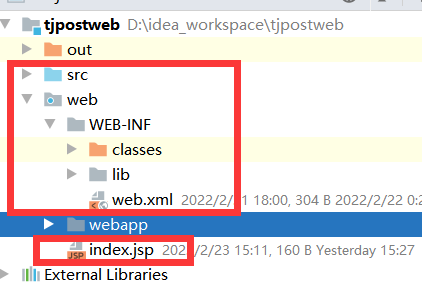

[Toc]

# 创建WEB项目

> 使用IDEA创建JAVA WEB项目。
>
> 创建的WEB项目会自动生成WEB-INF目录，以及web.xml和欢迎页面index.jsp.但是如果要定义其他页面，引入静态js,css等文件时，在WEB-INF目录下直接进行静态页面的开发，有可能会导致引入的静态文件找不到路径。所以，静态页面的存放文件夹，最好自己重新建立一个文件夹存放，如webapp,为个人新建目录，用于存放功能页面如：jsp/html,以及功能页面所需要的css,js等。WEB-INF整个目录目录也可以拷贝到webapp下

1. **创建WEB项目**
   

2. **创建后面目录如下**：其中WEB-INF下的classes和lib文件夹为手动创建，并需在创建WEB项目
   

```
classes:编译后class文件输出目录
lib：项目依赖包存放目录
```

- 设置编译输出目录
  

- 接着选择Dependencies ->  将Module SDK选择为1.8 -> 点击右边的“+”号  -> 选择1 “Jars or Directories”

  

-> 选择刚刚创建的【lib】文件夹


-> 选择**【jar directory】** -> 接着返回一路OK就可以了


# 启动web项目报错

## 提示端口已占用

- **启动web项目报错，报错信息如下**

  

- **解决方案**:终止占用该端口的进程

```
C:\Users\12613>netstat -aon|findstr 1099
  TCP    192.168.31.147:1099    58.216.47.61:19528     ESTABLISHED     12124

C:\Users\12613>taskkill -f -pid 12124
成功: 已终止 PID 为 12124 的进程。
```


# 参考资料