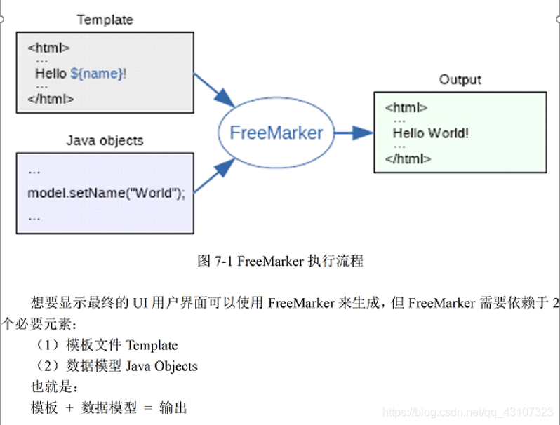

[toc]

## FreeMarker的定义:

FreeMarker是一个基于java语言的免费开源的模板引擎,基于文本的模板输出工具,使用FreeMarker可以生成任意的字符信息,包括html,xml,java文件等等文本资源.
在软件项目中常常用来生成HTML的 Web页面

## FreeMarker的优势:

**1.分离表现层和业务逻辑**
**FreeMarker的原理就是:模板+数据模型=输出**.模板只负责数据在页面中的展示,不涉及任何的逻辑代码,而所有的逻辑都是由数据模型来处理的,实现了前后端分离的好处,用户最终看到的输出是模板和数据模型合并后的结果.
**2.减少CPU占用**
使用JSP页面显示数据,所谓的表现层,JSP在第一次执行时候需要转换成Servlet类,开发阶段进行代码调试时,需要频繁的修改jsp,每次修改都要编译和转换,这个过程需要大量的耗时,影响运行效率;而FreeMarker模板技术不存在编译和转换的问题,所以编译和转换上就不会占用CPU资源.
**3.分工更加明确**
以往用JSP展现数据时,后台程序员可能主要对后台代码比较熟练,但对于页面的设计比较陌生;反之,前端工程师对于页面的设计比较熟练,对于后台的代码也很陌生.这样就需要双方相互沟通协作,解决出现的问题,但是减慢了项目开发的进度.而使用FreeMarker后,前后端程序员也能各司其职,大大提高了效率,达到了事半功倍的效果.
**4.不依赖与web环境**
FreeMarker与JSP不同,JSP需要依赖于Web容器,而FreeMarker与Web容器无关,它也可以运行在非Web环境中,FreeMarker不仅可以用作实现表现层的技术,还可以用于生成XML,JSP等文本资源.
**5.效率快**
FreeMarker执行的效率相比jsp快一些,因为它支持缓存的处理

## FreeMarker如何输出:

## FreeMarker模板文件主要由4部分组成:

**1.文本:直接输出的部分
2.注释:<#–…-->格式部分,不会输出
3.插值:即${…}格式的部分,将使用数据模型中的部分代替输出.
4.FTL指令:具有动态处理能力**