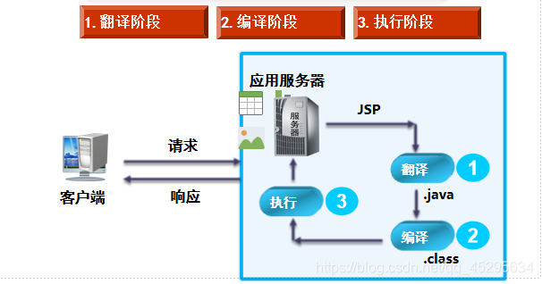

[TOC]

### HTTP和HTTPS之间的区别？

> ①、https协议需要到ca申请证书，一般免费证书很少，需要交费。
> ②、http是超文本传输协议，信息是明文传输，https 则是具有安全性的ssl加密传输协议。
> ③、http和https使用的是完全不同的连接方式，用的端口也不一样，前者是80，后者是443。
> ④、http的连接很简单，是无状态的；HTTPS协议是由SSL+HTTP协议构建的可进行加密传输、身份认证的网络协议，比http协议安全。

### JSP的执行过程？生成的.java文件和.class文件在tomcat中那个目录下面？

> Web容器处理Jsp文件请求需要经过3个阶段。
> ①翻译阶段
> ②编译阶段
> ③执行阶段
>
> 

### 对Java中序列化和反序列化的理解？

> **定义**：
> ①**对象序列化**是一个用于将内存中对象转换为字节流的过程，可以将其保存到磁盘文件中或通过网络发送到任何其他程序；
> ②从字节流创建对象的相反的过程称为**反序列化**。
>
> **序列化成功的条件**：
> ①该类必须实现java.io.Serializable 接口
> ②类的所有字段都必须是可序列化的(属性类型是实现类java.io.Serializable 接口的)
>
> **对象的序列化主要有两种用途**：
> ① 把对象的字节序列永久地保存到硬盘上，通常存放在一个文件中；
> ② 在网络上传送对象的字节序列。
>
> **应用场景**:
> ① 在很多应用中，需要对某些对象进行序列化，让它们离开内存空间，入住物理硬盘，以便长期保存。比如最常见的是Web服务器中的Session对象，当有 10万用户并发访问，就有可能出现10万个Session对象，内存可能吃不消，于是Web容器就会把一些seesion先序列化到硬盘中，等要用了，再把保存在硬盘中的对象还原到内存中。
> ② 当两个进程在进行远程通信时，彼此可以发送各种类型的数据。无论是何种类型的数据，都会以二进制序列的形式在网络上传送。发送方需要把这个Java对象转换为字节序列，才能在网络上传送；接收方则需要把字节序列再恢复为Java对象。

### 常用的JSP内置对象有哪些？

> Out、request、response、session、application(常用)
> 共九大内置对象：
> ①.**request对象** 客户端请求，此请求包含来自GET/POST的请求参数，通过它才能了解到客户的需求，然后做出响应。
> ②.**response对象** 响应客户端的请求的有关信息。
> ③.**session对象** 它之客户端与服务起的一次会话，从客户端到服务器的一个WebApplication开始，直到客户端与服务器的链接断开为止。
> ④.**out 对象** 它是JspWriter类的实力，是向客户端输出内容常用的对象
> ⑤.**page对象** 它指当前JSP页面本身，有点类似this指针，它是java.lang.object类的一个实例
> ⑥.**application对象** 它实现用户间的数据共享，可以改变全局变量，它从服务器启动开始直到服务器关闭。
> ⑦.**exception对象** 它是一个例外对象当一个页面的运行过程中发生了例外，就产生这个对象。
> ⑧.**pageContext对象** 它提供了对JSP页所有对象及名字空间的访问。
> ⑨.**config对象** 它是在一个Servlet初始化时，JSP引擎向它传递信息用的。

### Get和Post请求的区别

> ①.GET请求会将参数跟在URL后进行传递，而POST请求则是作为HTTP消息的实体内容发送给Web服务器。
> ②.GET方式对传输的数据大小有限制，通常不能超过2KB，而POST方式可以传递的数据量比GET方式大得多，理论上没有限制。
> ③.GET方式请求的数据会被浏览器缓存起来，因此其他人可以从浏览器的历史记录中读取到这些数据，例如账号和密码等。

### 转发和重定向的区别？

> ①.转发是在服务器端发挥作用，将同一请求在服务器资源之间进行传递（一次请求），客户端浏览器的地址栏不会显示转向后的地址；
> ②.重定向是在客户端发挥作用，通过发送一个新的请求实现页面转向（两次请求），在地址栏中可以显示转向后的地址。

### 如何通过JSP的内置对象Request获取Form中的数据？

>  getParameter( ) 根据表单组件名称获取提交数据
> getParameterValues( ) 获取表单组件对应多个值时的请求数据

### JSP四大作用域？与之关联的内置对象是什么？

> **Page**：只在一个页面保留数据（javax.servlet.jsp.PageContext(抽象类)）
> **Request**：只在一个请求中保存数据（javax.servlet.httpServletRequest）
> **Session**：在一次会话中保存数据，仅供单个用户使用(javax.servlet.http.HttpSession)
> **Application**：在整个服务器中保存数据，全部用户共享(javax.servlet.ServletContext)
>
> 1）page：就是设置的属性只能在当前页面有效。
> 通过**pageContext的setAttribute()和getAttribute()**。
> 2）request：指属性在一次请求范围内有效。
> 如果页面从给一个页面跳转到另一个页面，那么该属性就失效了。
> 这里所指的跳转是指客户端跳转，比如客户单击超链接跳转到其他页面或者通过浏览器地址栏浏览其他页面。
> 如果使用服务器端跳转,则该属性仍然生效。
> 同理使用**request对象的setAttribute()和getAttribute()**。
> 3）session：指客户浏览器与服务器一次会话范围内，如果服务器断开连接，那么属性就失效了。
> 同理通过**session对象的setAttribute()和getAttribute()。**
> session范围的例外比如重新打开一个浏览器。
> 4）application：指在整个服务器范围，知道服务器停止以后才会失效。
> 同理通过**application对象的setAttribute()和getAttribute()**。
> application范围就是保存的属性只要服务器不重启，就能在任意页面中获取，就算重新打开浏览器也是可以获取属性的。

### Session和Cookie的区别？

> **两者区别**:
> ①.Session在服务器端保存用户信息，Cookie在客户端保存用户的信息
> ②.Session中保存的是Object类型，Cookie保存的是String类型
> ③.Session随会话的结束而将其存储的数据销毁，Cookie可以长期保存在客户端
> ④.Session保存重要的信息，Cookie保存不重要的用户信息
>
> **Session和Cookie知识点补充**：
> ①.Session存储数据的结构是Map，Cookie存储数据的结构是对象数组；
> ②.Cookie相当于扩展了服务器的内存和硬盘，将非重要的用户信息放到用户的内存和硬盘上面。

### Servlet和JSP之间的区别？

> ①.JSP本质上就是一个Servlet，它是Servlet的一种特殊形式，每个JSP页面都是一个servlet实例。
> ②.JSP是HTML页面中内嵌的Java代码，侧重页面显示；Servlet 是HTML代码和Java代码分离，侧重逻辑控制；
> ③.MVC设计思想中JSP位于视图层，JSP适合表示层开发；servlet位于控制层，Servlet适合封装控制逻辑。
> （Servlet 是由 Java 提供用于开发 web 服务器应用程序的一个组件，运行在服务端，由 servlet 容器管理，用来生成动态内容。一个 servlet 实例是实现了特殊接口 Servlet 的 Java 类，所有自定义的 servlet 均必须实现 Servlet 接口。）

### Servlet生命周期？

> ① 实例化：Servlet容器创建Servlet的实例。
> ② 初始化：该容器调用init(ServletConfig)方法。
> ③ 服务：如果请求Servlet，则容器调用service()方法。
> ④ 销毁：销毁实例之前调用destroy()方法。

### JSTL和EL如何使用(区别)?

> ①.EL表达式封装了数据访问的功能。
> ②.JSTL标签库则封装了逻辑控制、循环控制以及数据格式化等功能。
> ③.二者结合使用，可以减少JSP中嵌入的Java代码，有利于程序的维护和扩展，能完整实现动态页面的开发需求。

### JSTL常用的标签有哪些？

> ①.通用标签：set、out、remove
> ②.条件标签：If、choose
> （`<c:choose>`多分支标签往往和角色在一起使用，来确定不同的角色，界面的元素的变化。）
> ③.迭代标签：forEach

### EL表达式如何使用?

> ①.`${表达式}` 按照page → request → session → application的作用域顺序依次查找找到即返回，最终找不到返回null
> ②.配合“.”获取对象属性：`${user.name}`，
> ③.“[]”获取集合元素：`${user["name"]}或${user["下标值"]}`

### 你对MVC设计模式的理解？

> **M-V-C(Model-View-Controller)**
> **MVC执行流程**:
> 1.客户端向服务器发送请求
> 2.服务器把请求分发给Servlet控制器
> 3.Servlet控制器获取用户输入的数据,并调用JavaBean（Dao、Service）进行处理
> 4.Servlet根据处理的结果选择一个JSP视图来响应用户
> 5.JSP视图显示处理的数据(如果存在数据)

### 你对Filter过滤器的理解？

**理解**：
当用户的请求到达指定的URL之前，可以借助Filter来改变这些请求的内容；同样的，当响应结果到达客户端之前，可以使用Filter修改输出的内容。
**Filter使用的场景**：
用在登录验证和解决乱码问题
**Filter的工作原理**：
用户发送请求到过滤器；过滤器将用户请求发送至web资源；web资源将响应发送到过滤器；过滤器将响应返回给用户。

### 在JQuery中如何进行表单序列化？

> ①.第一步：
> 给form的id属性设置好值。
> ②.第二步：
> 使用serialize（）方法。
> **表单序列化原因**：
> ①.form中的值比较多，我们需要一个一个取，以map方式发送到服务端，而用表单序列化就可以打包，也是以map方式发送到服务端。
> ②.如果表单的输入字段过多，会需要多行代码，并且如果增加或者减少表单字段都需要修改，不利于扩展。

### 参考资料

1. https://blog.csdn.net/qq_45295634/article/details/102610733