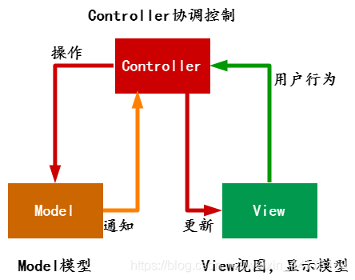
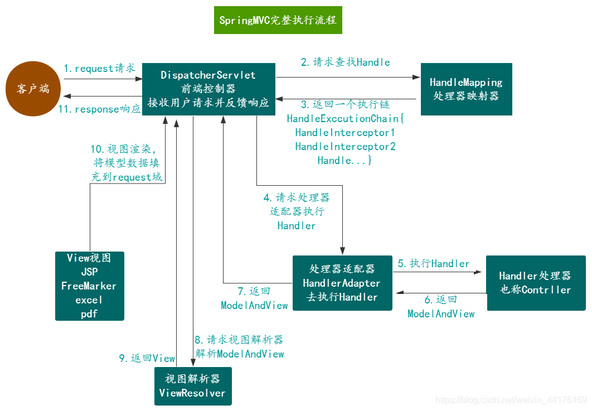

[toc]

# 1. 什么是SpringMVC?

1. SpringMVC是一种基于 Java 的实现MVC设计模型的请求驱动类型的轻量级Web框架，属于Spring框架的一个模块。
2. 它通过一套注解，让一个简单的Java类成为处理请求的控制器，而无须实现任何接口。同时它还支持RESTful编程风格的请求。

# 2.什么是MVC模式？



1. MVC的全名是Model View Controller，是模型(model)－视图(view)－控制器(controller)的缩写，是一种软件设计典范。它是用一种业务逻辑、数据与界面显示分离的方法来组织代码，将众多的业务逻辑聚集到一个部件里面，在需要改进和个性化定制界面及用户交互的同时，不需要重新编写业务逻辑，达到减少编码的时间。
2. V即View视图是指用户看到并与之交互的界面。比如由html元素组成的网页界面，或者软件的客户端界面。MVC的好处之一在于它能为应用程序处理很多不同的视图。在视图中其实没有真正的处理发生，它只是作为一种输出数据并允许用户操纵的方式。
3. M即model模型是指模型表示业务规则。在MVC的三个部件中，模型拥有最多的处理任务。被模型返回的数据是中立的，模型与数据格式无关，这样一个模型能为多个视图提供数据，由于应用于模型的代码只需写一次就可以被多个视图重用，所以减少了代码的重复性。
4. C即controller控制器是指控制器接受用户的输入并调用模型和视图去完成用户的需求，控制器本身不输出任何东西和做任何处理。它只是接收请求并决定调用哪个模型构件去处理请求，然后再确定用哪个视图来显示返回的数据。

# 3.SpringMVC的执行流程？



1. 用户点击某个请求路径，发起一个request请求，此请求会被前端控制器处理。
2. 前端控制器请求处理器映射器去查找Handler。可以依据注解或者XML配置去查找。
3. 处理器映射器根据配置找到相应的Handler(可能包含若干个Interceptor拦截器)，返回给前端控制器。
4. 前端控制器请求处理器适配器去执行相应的Handler处理器（常称为Controller）。
5. 处理器适配器执行Handler处理器。
6. Handler处理器执行完毕之后会返回给处理器适配器一个ModelAndView对象（SpringMVC底层对象，包括Model数据模型和View视图信息）。
7. 处理器适配器接收到Handler处理器返回的ModelAndView后，将其返回给前端控制器。
8. 前端控制器接收到ModelAndView后，会请求视图解析器（ViewResolver）对视图进行解析。
9. 视图解析器根据View信息匹配到相应的视图结果，反馈给前端控制器。
10. 前端控制器收到View具体视图后，进行视图渲染，将Model中的模型数据填充到View视图中的request域，生成最终的视图(View)。
11. 前端控制器向用户返回请求结果。

# 4.SpringMVC有哪些优点？

1. SpringMVC本身是与Spring框架结合而成的，它同时拥有Spring的优点(例如依赖注入DI和切面编程AOP等)。
2. SpringMVc提供强大的约定大于配置的契约式编程支持，即提供一种软件设计范式，减少软件开发人员做决定的次数，开发人员仅需规定应用中不符合约定的部分。
3. 支持灵活的URL到页面控制器的映射。
4. 可以方便地与其他视图技术(JSP、FreeMarker等)进行整合。由于SpringMVC的模型数据往往是放置在Map数据结构中的，因此其可以很方便地被其他框架引用。
5. 拥有十分简洁的异常处理机制。
6. 可以十分灵活地实现数据验证、格式化和数据绑定机制，可以使用任意对象进行数据绑定操作。
7. 支持RestFul风格。

# 5.Spring MVC的主要组件？

1. 前端控制器：其作用是接收用户请求，然后给用户反馈结果。它的作用相当于一个转发器或中央处理器，控制整个流程的执行，对各个组件进行统一调度，以降低组件之间的耦合性，有利于组件之间的拓展。
2. 处理器映射器：其作用是根据请求的URL路径，通过注解或者XML配置，寻找匹配的处理器信息。
3. 处理器适配器：其作用是根据映射器处理器找到的处理器信息，按照特定规则执行相关的处理器（Handler）。
4. 处理器：其作用是执行相关的请求处理逻辑，并返回相应的数据和视图信息，将其封装至ModelAndView对象中。
5. 视图解析器：其作用是进行解析操作，通过ModelAndView对象中的View信息将逻辑视图名解析成真正的视图View（如通过一个JSP路径返回一个真正的JSP页面）。
6. 视图：View是一个接口，实现类支持不同的View类型（JSP、FreeMarker、Excel等）。

# 6.SpringMVC和Struts2的区别有哪些?

1. SpringMVC的入口是一个Servlet，也就是前端控制器(DispatcherServlet)，而Struts2的入口是一个Filter (StrutsPrepareAndExecuteFilter)。
2. SpringMVC是基于方法开发(一个url对应一个方法)，请求参数传递到方法的形参，可以设计为单例或多例(建议单例)。struts2是基于类开发，请求参数传递到类的成员属性，只能设计为多例。
3. SpringMVC通过参数解析器将request请求内容解析，并给方法形参赋值，将数据和视图封装成ModelAndView对象，最后又将ModelAndView中的模型数据通过reques域传输到页面。Jsp视图解析器默认使用JSTL。Struts2采用值栈存储请求和响应的数据，通过OGNL存取数据。

# 7.SpringMVC怎么样设定重定向和请求转发？

我们先说说请求转发与重定向的区别：

### 请求转发与重定向的区别

1. 请求转发在服务器端完成的；重定向是在客户端完成的。
2. 请求转发的速度快；重定向速度慢。
3. 请求转发的是同一次请求；重定向是两次不同请求。
4. 请求转发不会执行转发后的代码；重定向会执行重定向之后的代码。
5. 请求转发地址栏没有变化；重定向地址栏有变化。
6. 请求转发必须是在同一台服务器下完成；重定向可以在不同的服务器下完成。

### SpringMVC设定请求转发

在返回值前面加"forward:"。

```java
@RequestParam("/login")
public String redirect(User user){
    if{
        //登录成功...
    }else{
        //登录失败，转发到登录页面
        return "forward:tologin";
    }
}
123456789
```

### SpringMVC设定重定向

在返回值前面加"redirect:"。例如我们在登录的时候，登录失败会重定向到登录页面。

```java
@RequestParam("/login")
public String redirect(User user){
    if{
        //登录成功...
    }else{
        //登录失败，重定向到登录页面
        return "redirect:tologin";
    }
}
123456789
```

# 8.当一个方法向AJAX返回特殊对象,譬如Object,List等,需要做什么处理？

1. 在方法上加@ResponseBody注解，表示该方法的返回值不管是什么类型，都会返回JSON格式的数据。
2. 把原来Controller类上的@Controller注解替换为@RestController注解。@RestController = @Controller + @ResponseBody，表明该Controller类所有的方法都返回JSON格式的数据(没有加@RequestMapping注解的方法除外)。
3. `加入@ResponseBody注解就能返回JSON格式数据的原因是`：SpringMVC提供的HttpMessageConverter自动转为JSON ，如果使用了Jackson或者Gson，不需要额外配置就可以自动返回JSON了，因为框架帮我们提供了对应的HttpMessageConverter ，如果使用了Alibaba的Fastjson的话，则需要自己手动提供一个相应的 HttpMessageConverter的实例。

# 9.如何解决POST请求中文乱码问题，GET的又如何处理呢？

JavaWeb乱码问题一般是客户端(浏览器)与服务器端字符集不一致产生的，如果两者字符集一致就不会出现乱码问题。

### 解决post请求乱码

SpringMVC默认提供一个解决post请求乱码的过滤器，在web.xml中配置即可

```xml
<filter>
    <filter-name>characterEncodingFilter</filter-name>
    <filter-class>org.springframework.web.filter.CharacterEncodingFilter</filter-class>
    <init-param>
        <param-name>encoding</param-name>
        <param-value>UTF-8</param-value>
    </init-param>
</filter>
<filter-mapping>
    <filter-name>characterEncodingFilter</filter-name>
    <url-pattern>/*</url-pattern>
</filter-mapping>
123456789101112
```

### 解决get请求乱码

1. 修改tomcat配置文件添加编码与工程编码一致。

```xml
<ConnectorURIEncoding="utf-8" connectionTimeout="20000" port="8080" protocol="HTTP/1.1" redirectPort="8443"/>
1
```

1. 对请求参数进行重新编码，`ISO8859-1`是tomcat默认编码，需要将tomcat编码后的内容按`utf-8`编码。

```java
String userName = new String(request.getParamter("userName").getBytes("ISO8859-1"),"utf-8");
1
```

# 10.Spring MVC的异常处理？

为了减少文章篇幅，单独把这这个问题的答案写成一篇博客。
[项目中出现异常怎么办？是时候了解SpringBoot全局异常处理机制](https://blog.csdn.net/weixin_44176169/article/details/104987865)

# 11.SpringMvc的控制器是不是单例模式,如果是,有什么问题,怎么解决？

1. Controller是单例模式，在多线程访问的时候可能产生线程安全问题，不要使用同步，会影响程序性能。
2. 解决方案是在控制器里面不能编写成员属性。

# 12.SpringMVC常用的注解有哪些？

### @Controller

`@Controller`用于标记在一个类上，使用它标记的类就是一个SpringMVC Controller对象。处理器适配器将会扫描使用了该注解的类的方法，并检测该方法是否使用了`@RequestMapping`注解。@Controller 只是定义了一个控制器类，而使用@RequestMapping 注解的方法才是真正处理请求的处理器。

### @RequsestMapping

@RequestMapping是一个用来处理请求地址映射的注解，可用于类或方法上。用于类上，表示类中的所有响应请求的方法都是以该地址作为父路径。返回值会通过视图解析器解析为实际的物理视图，对于 InternalResourceViewResolver 视图解析器，通过 prefix + returnValue + suffix 这样的方式得到实际的物理视图，然后做转发操作。

```java
<bean class="org.springframework.web.servlet.view.InternalResourceViewResolver">
    <property name="prefix" value="/WEB-INF/jsp/"/>
    <property name="suffix" value=".jsp"/>
</bean>
1234
```

@RequsestMapping有如下6个属性

1. value：指定请求的实际地址。
2. method：指定请求的method类型， GET、POST、PUT、DELETE等。
3. consumes：指定处理请求的提交内容类型（Content-Type），例如application/json, text/html。
4. produces：指定返回的内容类型，仅当request请求头中的(Accept)类型中包含该指定类型才返回；
5. params：指定request中必须包含某些参数值是，才让该方法处理。
6. headers：指定request中必须包含某些指定的header值，才能让该方法处理请求。

### @ResponseBody

@ResponseBody把Java对象转化为json对象，这种方式用于Ajax异步请求，返回的不是一个页面而是JSON格式的数据。

### @Valid

标志参数被`Hibernate-Validator校验框架`校验。

### @PathVariable

1. @PathVariable用于接收uri地址传过来的参数，Url中可以通过一个或多个{Xxx}占位符映射，通过@PathVariable可以绑定占位符参数到方法参数中，在RestFul接口风格中经常使用。
2. 例如：请求URL：http://localhost/user/21/张三/query
   (Long类型可以根据需求改变为String或int，SpringMVC会自动做转换)

```java
@RequestMapping("/user/{userId}/{userName}/query")
public User query(@PathVariable("userId") Long userId, @PathVariable("userName") String userName){

}
1234
```

### @RequestParam

@RequestParam用于将请求参数映射到控制器方法的形参上，有如下三个属性

1. value：参数名。
2. required：是否必需，默认为true，表示请求参数中必须包含该参数，如果不包含抛出异常。
3. defaultValue：默认参数值，如果设置了该值自动将required设置为false，如果参数中没有包含该参数则使用默认值。
4. 示例：@RequestParam(value = “pageNum”, required = false, defaultValue = “1”)

### @ControllerAdvice

@ControllerAdvice标识一个类是全局异常处理类。

```java
@ControllerAdvice
public class ControllerTest {
    //全局异常处理类
}
1234
```

### @ExceptionHandler

@ExceptionHandler标识一个方法为全局异常处理的方法。

```java
@ExceptionHandler
public void ExceptionHandler(){
    //全局异常处理逻辑...
}
1234
```

# 13.SpingMvc中的控制器的注解一般用那个,有没有别的注解可以替代？

1. 一般使用@Controller注解标识控制器。
2. 也可以使用@RestController注解替代@Controller注解，@RestController相当于@ResponseBody＋@Controller，表示控制器中所有的方法都返回JSON格式数据，一般不使用其他注解标识控制器。

# 14.如果在拦截请求中，想拦截get方式提交的方法,怎么配置？

1. 可以在@RequestMapping注解里面加上method=RequestMethod.GET。

```java
@RequestMapping(value="/toLogin",method = RequestMethod.GET)
public ModelAndView toLogin(){}
12
```

1. 可以使用@GetMapping注解。

```java
@GetMapping(value="/toLogin")
public ModelAndView toLogin(){}
12
```

# 15.怎样在控制器方法里面得到request或者session？

直接在控制器方法的形参中声明request，session，SpringMvc就会自动把它们注入。

```java
@RequestMapping("/login")
public ModelAndView login(HttpServletRequest request, HttpSession session){}
12
```

# 16.如果想在拦截的方法里面得到从前台传入的参数,怎么得到？

直接在控制器方法的形参里面声明这个参数就可以，但名字必须和传过来的参数名称一样，否则参数映射失败。
下面方法形参中的userId，就会接收从前端传来参数名称为userId的值。

```java
@RequestMapping("/deleteUser")
public void deleteUser(Long userId){
	//删除用户操作...
}
1234
```

# 17.前台传入多个参数,并且这些参数都是一个对象的属性,怎么进行参数绑定？

直接在控制器方法的形参里面声明这个参数就可以，SpringMvc就会自动会请求参数赋值到这个对象的属性中。
下面方法形参中的user用来接收从前端传来的多个参数，参数名称需要和User实体类属性名称一致。

```java
@RequestMapping("/saveUser")
public void saveUser(User user){
	//保存用户操作...
}
1234
@Data
public class User {
    private Long userId;
    private String username;
    private String password;
    //...
}
1234567
```

# 18.SpringMVC中函数的返回值是什么？

为了减少文章篇幅，单独把这这个问题的答案写成一篇博客。
[SpringMVC四种返回值类型总结](https://blog.csdn.net/weixin_44176169/article/details/104980344)

# 19.SpringMVC用什么对象从后台向前台传递数据的？

1. 使用Map、Model和ModelMap的方式，这种方式存储的数据是在request域中

```java
@RequestMapping("/getUser")
public String getUser(Map<String,Object> map,Model model,ModelMap modelMap){
    //1.放在map里  
    map.put("name", "xq");
    //2.放在model里，一般是使用这个
    model.addAttribute("habbit", "Play");
    //3.放在modelMap中 
    modelMap.addAttribute("city", "gd");
    modelMap.put("gender", "male");
    return "userDetail";
}
1234567891011
```

1. 使用request的方式

```java
@RequestMapping("/getUser")
public String getUser(Map<String,Object> map,Model model,ModelMap modelMap,HttpServletRequest request){
    //放在request里  
    request.setAttribute("user", userService.getUser());
    return "userDetail";
}
123456
```

1. 使用ModelAndView

```java
@RequestMapping("/getUser")  
public ModelAndView getUser(ModelAndView modelAndView) {
    mav.addObject("user", userService.getUser());  
    mav.setViewName("userDetail");  
    return modelAndView;  
}  
123456
```

# 20.怎么样把ModelMap里面的数据放入session里面？

在类上添加`@SessionAttributes`注解将指定的Model数据存储到session中。

### @SessionAttributes

1. 默认情况下Spring MVC将模型中的数据存储到request域中。当一个请求结束后，数据就失效了。如果要跨页面使用。那么需要使用到session。而@SessionAttributes注解就可以使得模型中的数据存储一份到session域中。
2. @SessionAttributes只能定义在Class,interface enum上，作用是将指定的Model中的键值对添加至session中，方便在一个会话中使用。

### @SessionAttributes参数

1. names：这是一个字符串数组。里面应写需要存储到session中数据的名称。
2. types：根据指定参数的类型，将模型中对应类型的参数存储到session中。
3. value：其实和上面的names是一样的。

```java
@SessionAttributes(value={"names"},types={Integer.class})
@Controller
public class session{

	@RequestMapping("/session")
	public String session(Model model){
		model.addAttributes("names", Arrays.asList("caoyc","zhh","cjx"));
		model.addAttributes("age", 22);
		return "/session";
	}
}
1234567891011
```

在上面代码中，在类上添加@SessionAttributes注解，并指定将names名称的Model数据存储到session域中，以及将Integer类型的Model数据存储到session域中。

# 21.SpringMvc里面拦截器是怎么写的？

为了减少文章篇幅，单独把这这个问题的答案写成一篇博客。
[SpringMVC拦截器实现原理以及登录拦截器实现(图文讲解)](https://blog.csdn.net/weixin_44176169/article/details/104902079)

# 22.SpringMMV中有个类把视图和数据都合并的一起的,叫什么？

它就是ModelAndView。

1. 使用ModelAndView类存储处理完后的结果数据，以及显示该数据的视图。从名字上看ModelAndView中的Model代表模型，View代表视图，从名字看就很好地解释了该类的作用。Controller处理器调用模型层处理完用户请求后，把结果数据存储在该类的model属性中，把要返回的视图信息存储在该类的view属性中，然后把ModelAndView返回给前端控制器。前端控制器通过调用配置文件中定义的视图解析器，对该对象进行解析，最后把结果数据显示在指定的页面上。
2. 返回指定页面
   ModelAndView构造方法可以指定返回的页面名称。
   也可以通过setViewName()方法跳转到指定的页面 。
3. 返回所需数值
   使用addObject()设置需要返回的值，addObject()有几个不同参数的方法，可以默认和指定返回对象的名字。

### 参考资料

1. https://blog.csdn.net/weixin_44176169/article/details/104852285