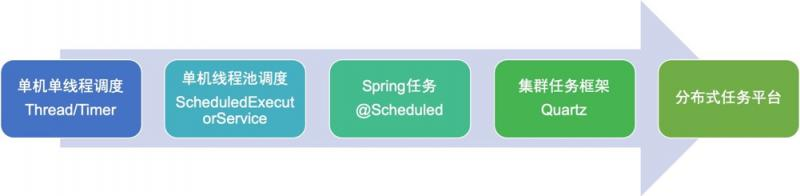

[toc]

### 服务部署结构类型

> 常见分服务部署结构类型有：
>
> 1. 单机结构；
> 2. 集群结构；
> 3. 分布式结构

- **单机结构**

> **描述**：一个系统业务量很小的时候所有的代码都放在一个项目中,这个项目部署在一台服务器上,整个项目所有的服务都由这台服务器提供
>
> **优点**：结构简单，适合小项目
>
> **缺点**：单机的处理能力有限，当业务增长到一定程度时，单机的硬件资源无法满足业务需求。
>
> 于是便出现了集群结构。

- **集群结构**

> **描述**：单机处理到达瓶颈的时候，把整个项目复制部署到其他服务器上，这样就构成了一个“集群”。集群中每台服务器就叫做这个集群的一个“节点”，所有节点构成了一个集群。每个节点都提供相同的服务，那么这样系统的处理能力就相当于提升了好几倍（有几个节点就相当于提升了这么多倍）。
>
> **优点**：操作简单，容易部署
>
> **缺点**：每个节点负载相同（耦合度高），每个具体业务的访问量可能差异很大，比如美团外卖美食外卖的访问量一定大于鲜花外卖的访问量，这就造成了资源浪费
>
> **负载均衡服务器**：
>  但问题是用户的请求究竟由哪个节点来处理呢？最好能够让此时此刻负载较小的节点来处理，这样使得每个节点的压力都比较平均。要实现这个功能，就需要在所有节点之前增加一个“调度者”的角色，用户的所有请求都先交给它，然后它根据当前所有节点的负载情况，决定将这个请求交给哪个节点处理。这个“调度者”就是负载均衡服务器。

- **分布式结构**

> **描述**：分布式结构就是将一个完整的系统，按照业务功能，拆分成一个个独立的子系统，在分布式结构中，每个子系统就被称为“服务”。这些子系统能够独立运行在web容器中，它们之间通过RPC方式通信。
>
> **优点**：
>
> 1. 系统之间的耦合度大大降低，可以独立开发、独立部署、独立测试，系统与系统之间的边界非常明确，排错也变得相当容易，开发效率大大提升。
>
> 2. 系统之间的耦合度降低，从而系统更易于扩展。我们可以针对性地扩展某些服务。假设这个商城要搞一次大促，下单量可能会大大提升，因此我们可以针对性地提升订单系统、产品系统的节点数量，而对于后台管理系统、数据分析系统而言，节点数量维持原有水平即可。
>
> 3. 服务的复用性更高。比如，当我们将用户系统作为单独的服务后，该公司所有的产品都可以使用该系统作为用户系统，无需重复开发。
>
> **缺点**：安全性低，如果一台服务器出现问题可能整个系统就会崩塌

### 什么是任务调度？

> 任务调度是指基于给定的时间点，给定的时间间隔或者给定执行次数自动的执行任务。任务调度是是操作系统的重要组成部分，而对于实时的操作系统，任务调度直接影响着操作系统的实时性能。任务调度涉及到多线程并发、运行时间规则定制及解析、线程池的维护等诸多方面的工作。
>
> WEB服务器在接受请求时，会创建一个新的线程服务。但是资源有限，必须对资源进行控制，首先就是限制服务线程的最大数目，其次考虑以线程池共享服务的线程资源，降低频繁创建、销毁线程的消耗；然后任务调度信息的存储包括运行次数、调度规则以及运行数据等。一个合适的任务调度框架对于项目的整体性能来说显得尤为重要。

### 为什么需要分布式任务调度平台？
>  随着系统规模的发展，定时任务数量日益增多，任务也变得越来越复杂，尤其是在分布式环境下，存在多个业务系统，每个业务系统都有定时任务的需求，如果都在自身系统中调度，一方面增加业务系统的复杂度，另一方面也不方便管理，因此需要有一个任务平台对分散的任务进行统一管理调度，基于目前的情况，任务平台需要支持以下几个方面：
>
>  1、任务统一管理，提供图形化界面对任务进行配置和调度。
>  2、任务并发控制，同一个任务在同一时间只能允许一个执行。
>  3、任务弹性扩容，可根据繁忙情况动态增减服务器分摊压力，对大任务进行分片处理。
>  4、任务依赖问题，能够处理任务包含子任务的情况，前一个完成后触发子任务执行。
>  5、支持多类型的任务，支持Spring Bean、Shell等。
>  6、任务节点高可用，任务节点异常或者繁忙时能够转移到其他节点执行。
>  7、调度中心高可用，支持集群部署，避免出现单点故障。
>  8、执行状态监控，方便查看任务执行状态，异常情况告警，支持多渠道通知。

### 任务调度发展史

> 
>
> 第一阶段
> 单线程调度，在Java1.5之前，基于线程的等待(sleep或wait)机制定时执行，需要开发者实现调度逻辑，单个线程(Thread)处理单个任务有些浪费，但是一个线程(Timer)处理多个任务容易因为某个任务繁忙导致其他任务阻塞。
>
> 第二阶段
> 线程池调度，在Java1.5开始提供ScheduledExecutorService调度线程池，调度线程池支持固定的延时和固定间隔模式，对于需要在某天或者某月的时间点执行就不大方便，需要计算时间间隔，转换成启动延时和固定间隔，处理起来比较麻烦。
>
> 第三阶段
> Spring任务调度，Spring简化了任务调度，通过@Scheduled注解支持将某个Bean的方法定时执行，除了支持固定延时和固定间隔模式外，还支持cron表达式，使得定时任务的开发变得极其简单。
>
> 第四阶段
> Quartz任务调度，在任务服务集群部署下，Quartz通过数据库锁，实现任务的调度并发控制，避免同一个任务同时执行的情况。Quartz通过Scheduler提供了任务调度API，开发可以基于此开发自己的任务调度管理平台。
>
> 第五阶段
> 分布式任务平台，提供一个统一的平台，无需再去做和调度相关的开发，业务系统只需要实现具体的任务逻辑，自动注册到任务调度平台，在上面进行相关的配置就完成了定时任务的开发

### **常见的分布式任务调度框架有哪些**？

> 常见的分布式任务调度框架有：cronsun、Elastic-job、saturn、lts、TBSchedule、xxl-job
>
> | 框架          特点 | 是否开源 | 创造者                                          | 是否已停止维护 | 特点                                                         |
> | ------------------ | -------- | ----------------------------------------------- | -------------- | ------------------------------------------------------------ |
> | Saturn             | 是       | 唯品会                                          | 否             | 基于当当elastic-job  1.0版本来开发的，其上完善了一些功能和添加了一些新的feature     支持多语言开发python、Go、Shell、Java、Php。     管理控制台和数据统计分析更加完善     缺点：技术文档较少 ， 该框架是2016年由唯品会的研发团队基于elastic-job开发而来 |
> | XXL-JOB            | 是       | 大众点评                                        | 否             | 简单：支持通过Web页面对任务进行CRUD操作，操作简单，一分钟上手；动态：支持动态修改任务状态、启动/停止任务，以及终止运行中任务，即时生效； |
> | cronsun            | 是       | [miracle.su等](https://my.oschina.net/u/270037) | 是             |                                                              |
> | Elastic-job        | 是       | 当当                                            | 是             | Elastic  Job是当当网架构师开发，是一个分布式调度解决方案，由两个相互独立的子项目Elastic-Job-Lite和Elastic-Job-Cloud组成；定位为轻量级无中心化解决方案，使用  jar 包的形式提供分布式任务的协调服务。支持分布式调度协调、弹性扩容缩容、失效转移、错过执行作业重触发、并行调度、自诊断和修复等等功能特性。 |
> | LTS                | 是       | /                                               | 是             |                                                              |
> | TBSchedule         | 是       | 阿里                                            | 是             |                                                              |
> | Quartz             | 是       | /                                               | 是             | 不适合大量的短任务 & 不适合过多节点部署；     解决了高可用的问题，并没有解决任务分片的问题，存在单机处理的极限（即：不能实现水平扩展）。     需要把任务信息持久化到业务数据表，和业务有耦合     调度逻辑和执行逻辑并存于同一个项目中，在机器性能固定的情况下，业务和调度之间不可避免地会相互影响。     quartz集群模式下，是通过数据库独占锁来唯一获取任务，任务执行并没有实现完善的负载均衡机制。 |

### 为什么选择XXL-JOB

> xxl-job有下面一些特点：
>
> - 1、简单：支持通过Web页面对任务进行CRUD操作，操作简单，一分钟上手；
> - 2、动态：支持动态修改任务状态、启动/停止任务，以及终止运行中任务，即时生效；
> - 3、调度中心HA（中心式）：调度采用中心式设计，“调度中心”自研调度组件并支持集群部署，可保证调度中心HA；
> - 4、执行器HA（分布式）：任务分布式执行，任务”执行器”支持集群部署，可保证任务执行HA；
> - 5、注册中心: 执行器会周期性自动注册任务, 调度中心将会自动发现注册的任务并触发执行。同时，也支持手动录入执行器地址；
> - 6、弹性扩容缩容：一旦有新执行器机器上线或者下线，下次调度时将会重新分配任务；
> - 7、路由策略：执行器集群部署时提供丰富的路由策略，包括：第一个、最后一个、轮询、随机、一致性HASH、最不经常使用、最近最久未使用、故障转移、忙碌转移等；
> - 8、故障转移：任务路由策略选择”故障转移”情况下，如果执行器集群中某一台机器故障，将会自动Failover切换到一台正常的执行器发送调度请求。
> - 9、阻塞处理策略：调度过于密集执行器来不及处理时的处理策略，策略包括：单机串行（默认）、丢弃后续调度、覆盖之前调度；
> - 10、任务超时控制：支持自定义任务超时时间，任务运行超时将会主动中断任务；
> - 11、任务失败重试：支持自定义任务失败重试次数，当任务失败时将会按照预设的失败重试次数主动进行重试；其中分片任务支持分片粒度的失败重试；
> - 12、任务失败告警；默认提供邮件方式失败告警，同时预留扩展接口，可方便的扩展短信、钉钉等告警方式；
> - 13、分片广播任务：执行器集群部署时，任务路由策略选择”分片广播”情况下，一次任务调度将会广播触发集群中所有执行器执行一次任务，可根据分片参数开发分片任务；
> - 14、动态分片：分片广播任务以执行器为维度进行分片，支持动态扩容执行器集群从而动态增加分片数量，协同进行业务处理；在进行大数据量业务操作时可显著提升任务处理能力和速度。
> - 15、事件触发：除了”Cron方式”和”任务依赖方式”触发任务执行之外，支持基于事件的触发任务方式。调度中心提供触发任务单次执行的API服务，可根据业务事件灵活触发。
> - 16、任务进度监控：支持实时监控任务进度；
> - 17、Rolling实时日志：支持在线查看调度结果，并且支持以Rolling方式实时查看执行器输出的完整的执行日志；
> - 18、GLUE：提供Web IDE，支持在线开发任务逻辑代码，动态发布，实时编译生效，省略部署上线的过程。支持30个版本的历史版本回溯。
> - 19、脚本任务：支持以GLUE模式开发和运行脚本任务，包括Shell、Python、NodeJS、PHP、PowerShell等类型脚本;
> - 20、命令行任务：原生提供通用命令行任务Handler（Bean任务，”CommandJobHandler”）；业务方只需要提供命令行即可；
> - 21、任务依赖：支持配置子任务依赖，当父任务执行结束且执行成功后将会主动触发一次子任务的执行, 多个子任务用逗号分隔；
> - 22、一致性：“调度中心”通过DB锁保证集群分布式调度的一致性, 一次任务调度只会触发一次执行；
> - 23、自定义任务参数：支持在线配置调度任务入参，即时生效；
> - 24、调度线程池：调度系统多线程触发调度运行，确保调度精确执行，不被堵塞；
> - 25、数据加密：调度中心和执行器之间的通讯进行数据加密，提升调度信息安全性；
> - 26、邮件报警：任务失败时支持邮件报警，支持配置多邮件地址群发报警邮件；
> - 27、推送maven中央仓库: 将会把最新稳定版推送到maven中央仓库, 方便用户接入和使用;
> - 28、运行报表：支持实时查看运行数据，如任务数量、调度次数、执行器数量等；以及调度报表，如调度日期分布图，调度成功分布图等；
> - 29、全异步：任务调度流程全异步化设计实现，如异步调度、异步运行、异步回调等，有效对密集调度进行流量削峰，理论上支持任意时长任务的运行；
> - 30、跨语言：调度中心与执行器提供语言无关的 RESTful API 服务，第三方任意语言可据此对接调度中心或者实现执行器。除此之外，还提供了 “多任务模式”和“httpJobHandler”等其他跨语言方案；
> - 31、国际化：调度中心支持国际化设置，提供中文、英文两种可选语言，默认为中文；
> - 32、容器化：提供官方docker镜像，并实时更新推送dockerhub，进一步实现产品开箱即用；
> - 33、线程池隔离：调度线程池进行隔离拆分，慢任务自动降级进入”Slow”线程池，避免耗尽调度线程，提高系统稳定性；
> - 34、用户管理：支持在线管理系统用户，存在管理员、普通用户两种角色；
> - 35、权限控制：执行器维度进行权限控制，管理员拥有全量权限，普通用户需要分配执行器权限后才允许相关操作；
>
> 而且目前代码也在持续更新，issue作者也在积极的回复，使用的公司也有200多家,其中包括之前的点评

### 任务调度框架调研的基本原则

> - 简单-对开发者接入简单，对使用者使用简单。
> - 丰富的文档，有很多开源的项目文档少之又少，当然还有一些开源项目只有英文文档，如果你英文不是很行，那可能需要考虑中文居多的文档。
> - 有管理界面，很方便执行操作和统计数据。
> - 支持主流框架：比如Spring,Springboot等，当然这个至少要支持你们业务中的主流框架。
> - 框架轻量级，方便根据自己的需求进行定制化。
> - 高性能，高可靠，高可用：不能让框架成为业务中的瓶颈。
> - 代码更新频率和社区使用情况：使用的公司越多证明其越受更多人的喜爱，代码更新频率越高证明出现问题就会越少，最好是由大厂开源并且维护。
> - 多语言需求：如果在你们业务中有多语言需求，比如你们公司用的开发语言很多，都需要调度框架那么你需要使用多语言支持。比如Rpc支持多语言的代表就是Thrift。
> - 能否解决当前的痛点：这个是最重要的，如果连你问题都解决不了那使用这个还有什么意义呢？

### XXL-JOB的搭建

参考：https://www.xuxueli.com/xxl-job/

### 参考资料

1. https://www.cnblogs.com/chen-chen-chen/p/12221923.html
2. https://blog.csdn.net/u012379844/article/details/82716146
3. https://www.cnblogs.com/ssslinppp/p/12485273.html
4. https://github.com/xuxueli/xxl-job