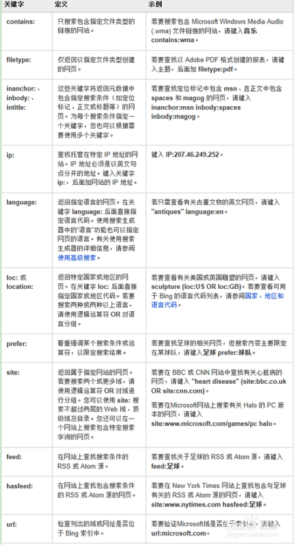

[toc]

### 优秀的搜索引擎

> 1. [Google](http://www.google.com/)
> 2. [Bing](https://cn.bing.com/)
> 3. [百度](http://www.baidu.com)
>
> 优秀的程序员，请习惯使用英文作为默认搜索引擎。

### Bing搜索技巧

> 1. 使用关键字进行搜索；
> 2. 使用 OR 和 NOT 关键字来组合或排除某些字词；
> 3. 如果您已进行搜索并想精减搜索结果，则可以使用 Bing 的高级搜索选项来获得帮助
> 4. 
> 5. 想要尽快过滤不相关的结果？使用高级关键字可获取更好的搜索结果，让您找到真正需要的内容。使用以下关键字可以缩小搜索范围：
>  

