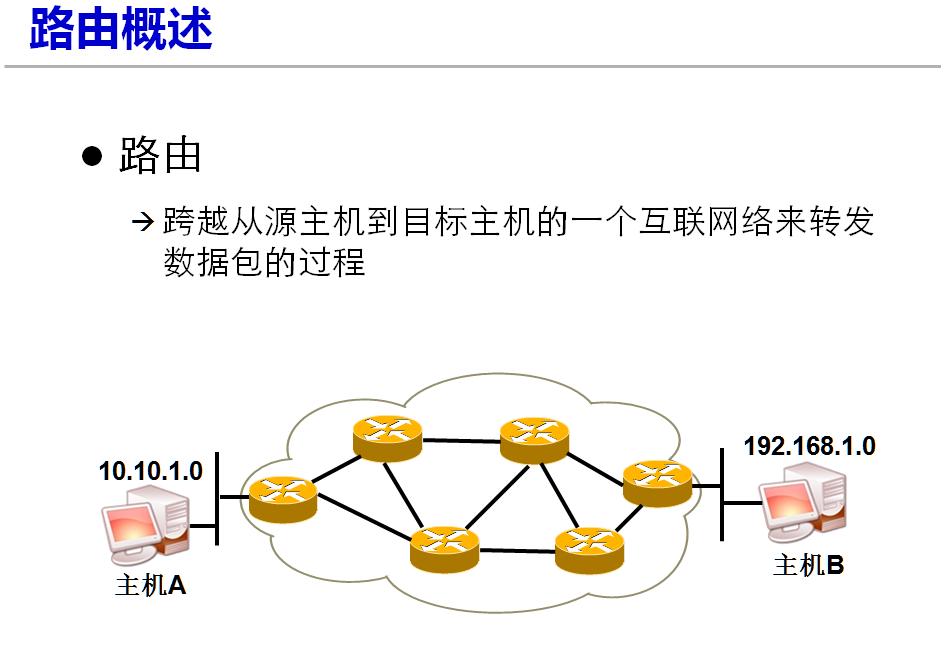

[toc]

# Linux简介

## 应用领域

1. 个人桌面领域：简单复杂应用软件少的桌面，发展了ubanto,fedaro等优秀桌面环境；
2. 服务器领域:Linux在服务应用领域广泛，免费、稳定、高效；
3. 嵌入式领域

## Linux系统特点

> 开放性、多用户、多任务、良好的用户界面、优异的性能与稳定性

## Linux发行版本

1. CentoOS(Community Enterprise Operating System)：社区企业操作系统，免费的商业软件；
2. Ubantu:桌面应用为主的GNU/Linux操作系统；
3. Debian：由Debian社区维护；

# VMware

## 简介

> VMware一般指的是VMware workstation.这是一款功能强大的桌面虚拟计算机软件，提供用户可在单一的桌面上同时运行不同的操作系统，进行开发、测试、部署新的应用程序的最佳解决方案。
>
> VMware Workstation可在一部实体机器上模拟完整的网络环境，以及可便于携带的虚拟机器，其更好的灵活性，先进的技术胜过了市面上其他的虚拟软件。
> 对于企业的IT开发人员和系统管理员而言，VMware在虚拟网路，实时快照，拖曳共享文件夹，支持PXE等方面的特点使它成为必不可少的工具

## 安装

> 安装版本为：VMware-Workstation-Full-14.1.1-7528167.exe

1. **设置安装目录**:需要设置的地方挺少，根据提示步骤走就行，安装前需注意关闭如电脑管家/360安全管家等以防安全拦截。

> 

## 快速还原虚拟机

> 

## 虚拟机报错解决

- 启动虚拟机是，提示：VMware该虚拟机似乎正在使用中。如果该虚拟机未在使用，请按“获取所有权(T)”按钮获取它的所有权
   


- **解决方案**：到你的安装目录找文件夹后缀为.vmx.lck的文件夹，将其改名或者删除掉。如下所示：

  

  然后重新开启虚拟机就好了

## 虚拟机克隆

1. **选中要克隆的虚拟机，点击克隆**
   

2. **选择克隆类型**：创建新的完全独立的虚拟机，选中创建完整克隆
   

3. **设置新虚拟机位置以及文件存储目录**
   
   点击完成后，虚拟机克隆完成

4. **重新设置克隆虚拟机IP与主机名**

   > 克隆虚拟机与原虚拟机的主机名和IP配置完全一致，需重新设置，否则同启用俩台虚拟机时，会产生冲突

   ```
   ### 1. 修改主机名
   [root@localhost ~]# vi /etc/hostname
   ### 2. 修改IP
   [root@localhost ~]# vi /etc/sysconfig/network-scripts/ifcfg-ens33
   TYPE="Ethernet"
   PROXY_METHOD="none"
   BROWSER_ONLY="no"
   BOOTPROTO="static"
   DEFROUTE="yes"
   IPV4_FAILURE_FATAL="no"
   IPV6INIT="yes"
   IPV6_AUTOCONF="yes"
   IPV6_DEFROUTE="yes"
   IPV6_FAILURE_FATAL="no"
   IPV6_ADDR_GEN_MODE="stable-privacy"
   NAME="ens33"
   UUID="78cfafd2-4b3e-41b2-8cf8-77f03ff36d82"
   DEVICE="ens33"
   ONBOOT="yes"
   IPADDR=192.168.183.135 # 修改IP
   PREFIX=24
   NETMASK=255.255.255.0
   GATEWAY="192.168.183.2"
   IPV6_PRIVACY="no"
   BROADCAST=192.168.183.2
   DNS1=8.8.8.8
   DNS2=8.8.4.4
   
   [root@localhost ~]# systemctl restart network 
   
   ### 3.测试链接是否正常
   [root@localhost ~]# ping www.baidu.com
   ```

   

# CentOS 7

> 安装版本为：CentOS-7-x86_64-DVD-  2003.iso

## 下载

- **下载网址**

> 1. [CentOS7.8](http://mirrors.aliyun.com/centos/7.8.2003/isos/x86_64/)
> 2. [CentOS8](http://isoredirect.centos.org/centos/8/isos/x86_64/)

- **CentOS Linux和CentOS Stream这俩个版本区别**

> **CentOS Stream:**与当前CentOS Linux操作系统并行开发的新GNU / Linux发行版，使社区可以访问即将发布的Red Hat Enterprise Linux版本的最新开发代码。CentOS Stream遵循滚动发布模型，您可以在其中安装一次并永久获得更新。
>
> **CentOS Linux:**普通使用的CentOS的系统了，如果追求稳定性，和正式使用，日常使用，推荐使用这个的.

- **ISO版本区别**

> [x86_64](http://isoredirect.centos.org/centos/8/isos/x86_64/):64位x86架构处理器,x86属于复杂指令集体系，汇编指令较多
>
> [ARM64 (aarch64)](http://isoredirect.centos.org/centos/8/isos/aarch64/):64位ARM架构处理器,基于armv8指令集的64位架构。ARM属于精简指令集体系，汇编指令比较简单
>
> [IBM Power (ppc64le)](http://isoredirect.centos.org/centos/8/isos/ppc64le/):IBM power系列架构
>
> | 版本           | 说明                                                         |
> | -------------- | ------------------------------------------------------------ |
> | DVD[^1]        | 常用版本，就是普通安装版。里面包含大量的常用软件，<br />大部分情况下安装时无需再在线下载 |
> | Everything[^3] | 顾名思义，包含了所有软件组件，当然体积也庞大，包<br />含centos7的一套完整的软件包，可以用来安装系统或者<br />填充本地镜像 |
> | LiveGNOME[^4]  | GNOME桌面版                                                  |
> | LiveKDE[^5]    | KDE桌面版                                                    |
> | Minimal[^6]    | 精简版本，包含核心组件，体积小                               |
> | NetInstall[^7] | 网络安装版本，一般不用这个版本，安装必须指定网络上的安装文件 |
> | LiveCD[^2]     | 光盘上运行的系统，类拟于winpe                                |
> | boot.iso[^8]   | 只有引导程序和安装程序,并没有要安装的系统软件.大小在100M左右.<br />不可以直接安装系统,需要指定系统程序的源 |
> | dvd1.iso[^9]   | 包括引导程序和安装程序和系统软件,大小在4G左右.可以直接安装系统. |
>
> CentOS 7 有6种版本的 ISO 镜像文件可供选择，每一种 ISO 镜像文件都可以引导安装 CentOS、修复 CentOS，除了 CentOS-7-x86_64-NetInstall-XXXX.iso 都包含安装文件 ，LiveGNOME、LiveKDE、NetInstall均不提供额外软件以供安装完成的系统挂载使用，其他则版本都有，软件数量上 Everything > DVD > Minimal。多数时候选择DVD版，已安装好的系统需要额外软件，却又无法联网时，需要挂载Everything版（比DVD版软件更多）。
>
> 需要安装精简的系统，不需要安装时添加额外软件选择Minimal，LiveGNOME、LiveKDE用于体验 CentOS，优点可以不安装，可以直接加载启用。
>
> NetInstall 从网络安装或者救援系统，如果想通过这种 ISO 镜像文件安装必须指定网络上的安装文件。

## 安装

> 通过VMware虚拟环境，部署CentOS系统
>
> **注意**：
>
> 1. 开启的虚拟机的总内存不能超过真机：如设立俩台虚拟机，设置其内存都为2G ,那么 2+2 < 真机内存，才是合理，否则会导致运行缓慢；
> 2. 

### 1. 创建新虚拟机

1. **新建虚拟机**:打开VMware，点击【创建新的虚拟机】，选择【自定义】选项是为了熟悉安装过程，若是时间紧急且任务量大可以直接选择【典型】操作。

> 
>
> 

2. **选择手动安装操作系统**

> 

3. **设置需要安装的操作系统与其版本**

> 

4. **设置虚拟机名称以及虚拟机文件夹位置**

> 

5. **设置虚拟机占用主机的处理器数量以及内核数量，一般选择1个**

> 

6. **配置虚拟机可使用的内存:可根据自己计算机内存大小进行分配，可以随意分配，以后需要调整时再进行调整。**

> 

7. **配置网络类型**

> 

8. **硬盘&磁盘配置**

> 
>
> 

9. **创建磁盘&设置磁盘容量**

> 
>
> 
>
> 

10. **创建虚拟机完成**

>  

11. **虚拟机删除**

> 怎样将建立好的虚拟机从磁盘删除，选中要删除的虚拟机，右击——>管理——>从磁盘删除
>
> 

### 2. 安装CentOS操作系统(GUI版)

1. **在新的虚拟机，选择DVD,选择使用ISO,镜像，选择CentOS7安装镜像；**

> 若出现启动报错，提示Intel VT-x处于禁用状态
>
> **解决方案：**
>
> 1. 开机时按F2/F12/DEL/ESC等键进入BIOS,需根据计算机品牌选择按键，进入BIOS;
> 2. 进入BIOS后，找到Configuration选项或者Security选项，然后选择Virtualization,或者Intel Virtual Technology.

> 


2. **选好操作系统的安装镜像后，开启此虚拟机；**

> 

3. **Install CentOS7 安装操作系统；**

> 
4. **选择安装提示语言**

> 

5. **软件选择**：兼容工具&开发工具：为方便以后安装软件使用

   > 
   >
   > **图形界面安装**--**Server with GUI 或者 GNOME Desktop**
   >
   > 
   >
   > - **桌面设置区分：不安装桌面GUI与安装桌面GUI**
   >
   > **字符界面安装**--**Minimal install 或者 Basic Web Server** 不过兼容程序 和 开发工具这俩个选项还是选中，可避开程序操作中不少问题。
   >
   > 
   >
   > 
   >
   >  
   >
   > 字符界面与图形界面安装过程相同，只在这一步有区分。
   >
   > 点击--**Done**进入下一步

6. **设置分区**

   > 此处设立三个主要分区：
   >
   > 1. `/boot` :1000M 启动分区：主要放启动文件，以防系统无法启动；
   > 2. `swap`: 2048M 交换分区 :存放内存放置不下的程序或者其他文件；
   > 3. `/` :根分区，类似Win中的c盘
   >
   > 
   >
   > 
   >
   > 
   >
   > **设置主要三个分区**
   >
   > 
   >
   > 

7. **Kdump设置**

   > Kdump:内核崩溃转储机制。当系统内存崩溃时，kdump将捕获系统信息，以便诊断崩溃原因。需预留一部分系统内存，且这部分内存对其他用户是不可用的。一般个人与企业都选择关闭，以免除内存被占用。因为目前的云服务会自动克隆异常信息
   >
   > 

8. **设置系统管理密码**

   > 点击安装系统后，进入用户账号设置界面
   >
   > 
   >
   > 用户/密码：root/root
   >
   > 

9. **在安装成功后，确认许可证书**

   > 
   >
   > 
   >
   > 点击完成后，即可进入系统。

10. **设置语言/时区/设置个人账号与密码，可随意设置账号和密码，以后可能用不上**:此处的账号可能用于命名你的home文件夹,是比系统管理员用户权限次一级的账号，一般没啥用。

   > 用户/密码：joy/sun622@

11. **进入系统账户界面**

   > 
   > 
   >
   > 
   >
   > 
   >
   > 

## 网络连接设置

> 
>
> 


## Linux基础

### 常识

> Linux 命令语法：命令+[option] +[param]
>
> 使用tap 键，让系统自动补全命令
>
> 用光标，使用上下键，查看历史命令
>
> ctrl + shift + 加号键  放大命令界面

### 文件管理

> Windows以多根方式组织文件：C:\D:\E\
>
> Linux以单根的方式组织文件 `/`
>
> **文件类型**：
>
> **常见类型**：
>
> 1. 普通文件，如txt,zip等；
>
> 2. 目录文件；
>
> **非常见类型**：
>
> 1. `b`设备文件(块设备)存储设备硬盘，U盘/dev/sda,/dev/sda1
> 2. `c`设备文件(字符设备)打印机，终端/dev/tty1
> 3. `l`连接文件(淡蓝色)
> 4. `s`套接字文件
> 5. `p`管道文件
>
> Linux 目录结构：
>
> 
>
> ```
> bin: binary 普通用户使用的命令 /bin/ls, /bin/date 启动文件
> sbin:管理员使用的命令 /sbin/service 
> boot:启动目录，和计算机有关启动的文件都在其下
> dev:device 设备：硬件，所有硬件管理目录
> etc:配置文件/控制台文件。在工作中用的最多的目录。
> home:普通用户目录，当有普通用户创建时，会自动生成以该用户的用户名命名的目录
> root:root用户的目录
> run:运行目录，临时目录
> tmp:临时目录
> usr:应用程序
> var:日志、邮件等文件
> ```
>

### **常用命令**

#### 切换目录(cd):change directory

> cd + 绝对路径/相对路径 ，如：cd test  或者 cd ./test 进入当前目录的test目录下；cd /test 进入根目录的test目录下；cd ../test进入上一级目录的test目录下
>
> cd .		当前目录,若不加`.`,则表示直接在当前目录操作
>
> cd . / + [目录路径] 		  进入当前目录下的指定路径的目录,如：cd ./music/tmp 进入当前目录下的music目录下的tmp目录
>
> cd .. 		返回上级目录
>
> cd .. / + [目录路径]  进入上级目录下的指定路径的目录。../  可叠加使用，如：cd ../../  代表上上一级目录
>
> cd  / 		进入根目录，绝对路径，
>
> cd / + [目录名称]			进入根目录下的指定路径的目录，绝对路径，
>
> cd ~			进入用户目录 ，如：超级管理员登录后，默认在/root目录下。用法同 cd / 

#### 创建文件

> **路径规则设置，可参照切换目录中路径设置**  
>
> touch  路径+文件名 				如：touch /a.txt 表示在根目录下创建a.txt
>
>   touch a.txt b c  						创建多个文件
>
>   touch  /test/{a.txt,b,c}			创建多个文件，｛｝中为文件
>
>   只要以`.`开头的文件，都为隐藏文件
>
>   

#### 创建目录

>   mkdir  路径+目录名  若路径中出现未创建目录名，会报错，只能在已有目录下创建新目录
>
>   mkdir -p +路径+目录名   会自动创建路径中不存在的目录；
>
>   ​											-p, --parents     no error if existing, make parent directories as needed
>
>   在/test目录下创建多个文件夹：
>
>   1）mkdir /test/{tmp1,tmp2}   在test目录下创建tmp1和tmp2目录，创建更多同级目录可做参照，每个目录用`,`隔开
>
>   2）mkdir /test/tmp1 /test/tmp2  与上效果一致
>
>   3）mkdir -v /test/{tmp3,tmp4} 会打印创建目录信息，如下
>   `mkdir: created directory ‘/test/tmp3’
>     mkdir: created directory ‘/test/tmp4’`
>
>   4)mkdir -pv /test/tp/{tmp1,tmp2}  创建新目录tp,并在其下创建目录tmp1,tmp2,并打印创建信息
>    `mkdir: created directory ‘/test/tp’
>    mkdir: created directory ‘/test/tp/tmp1’
>   mkdir: created directory ‘/test/tp/tmp2’`
> 
>  5）mkdir -pv /test/{joy/{tmp1,tmp2},joy1}  创建同级以及不同级目录。打印信息如下：
> 
>  `mkdir: created directory ‘/test/joy’
>    mkdir: created directory ‘/test/joy/tmp1’
>   mkdir: created directory ‘/test/joy/tmp2’
>    mkdir: created directory ‘/test/joy1’`
>
>   

#### 复制

>   cp  源目录/文件名  目标目录    拷贝文件
>
>   cp  -r  源目录 目标目录   拷贝源目录下所有到目标目录
>
>   cp -v  a.txt /test   拷贝a.txt 到 test目录下，-v为显示拷贝信息
>
>   cp -v a.txt tmp1/b.txt  拷贝并重命名为b
>
>   `‘a.txt’ -> ‘tmp1/b.txt’`
>
>   cp -rv tmp1 tmp2 tmp3  递归拷贝多个不同目录到一个目录下,`cp 源文件1 源文件2 源文件n 目标目录  `，
>
>   执行过程如下：
>
>   `‘tmp1’ -> ‘tmp3/tmp1’
>    ‘tmp1/a.txt’ -> ‘tmp3/tmp1/a.txt’
>    ‘tmp1/b.txt’ -> ‘tmp3/tmp1/b.txt’
>    ‘tmp2’ -> ‘tmp3/tmp2’`
>
>   cp -rfn tmp1 tmp2  		-f  --force 强制拷贝
>
>   ```
>     -f, --force                  if an existing destination file cannot be
>                                     opened, remove it and try again (this option
>                                     is ignored when the -n option is also used)
>    -n, --no-clobber             do not overwrite an existing file (overrides
>                                     a previous -i option)
>    -i, --interactive            prompt before overwrite (overrides a previous -n
>                                      option)
>                 
>   ```

#### 移动

>   mv 源文件路径 目标文件路径   		移动文件，可以直接移动为新名称的目标文件：如：mv  a.txt  b/b.txt
>
>    mv a.txt e.txt  				修改文件名a 为 e；若源路径与目标路径相同，操作等价于改名
>
>   

#### 删除

>   rm  							路径/fileName 移除文件  
>
>   rm -rf 						文件或者目录路径  强制递归移除文件或目录，r:recursive  f:force  ，会自动忽略不存在目录/文件
>
>   rm -rf b*.txt 			使用通配符，删除指定文件/目录
>
>   rm -rf b.txt c   		  删除多个文件/文件目录
>
>   rm -rf test/*			可删除除隐藏文件之外的所有文件
>
>   rm -rf test/.file  	   删除`.file`隐藏文件，删除隐藏文件，需输入删除的隐藏文件名

#### 查看文件内容

>   cat  /root/file1.txt   
>
>   more  /root/file1.txt 翻页查看文件,可设置每页展示行数，如：more -3 root/file1.txt
>
>    head   /root/file1.txt  查看文件头几行，默认10行 ，可通过设置行数，查看文档的头几行，如： head -3 /root/file1.txt
>
>    tail      /root/file1.txt   查看文件尾部，默认10行，可通过设置行数，查看文档的尾部几行，如： tail -3 /root/file1.txt
>
>    grep  过滤关键字  ,如：grep aa a.txt  ，显示a.txt有关aa的行

#### 修改文件内容

>   gedit ：图形编辑器
>
>   重定向：# ls -a > e.txt  将前面命令产生的结果写入e.txt
>
>   

####   vim的使用

>   使用vi 或者 vim，vim是vi的升级版。vim模式以及转换操作
>
>   ```
>    1.Vim常用模式.
>     命令模式(command-mode)
>     插入模式(insert-mode)
>     可视模式(visual-mode)
>     正常模式(normal-mode)
>    
>    2.如何进入这些模式
>    **①.正常模式**
>     正常模式主要用来浏览和修改文本内容的
>    一般的，打开Vim都是正常模式。在任何模式下，只要按下 Esc 键就可以返回正常模式。
>    
>    正常模式下，常用操作
>    光标定位 
>    hjkL              //上下左右
>    0 $               //行首行尾
>    gg G 			//页首页尾
>    3G 进入第三行  
>    /string (n N 可以循环的)     //查找指定字符，按n键选下一个（重要）
>    
>    yy p  迅速在光标所在行双击y键，然后单击p键，会复制当前光标所在行内容
>    dd    删除光标所在行
>    num+dd 删除包含光标所在行后面共num行  
>    3yy p 复制包含光标所在行后面一共三行3行，然后粘贴
>    u  undo撤销，按u键撤销操作
>    x  删除光标所在单个字符
>    
>    **②.插入模式**
>     插入模式则用来向文本中添加内容的
>     i   在光标所在字符前开始输入文字并进入插入模式
>     a   在光标所在字符后开始输入文字并进入插入模式
>     o   (字母o) 在光标所在行的下面单独开一新行来输入文字并进入插入模式
>     s   删除光标所在的字符并进入插入模式
>     I   在行首开始输入文字并进入插入模式。此行首指第一个非空白字符处。如果行首有空格，则在空格之后输入文字并进入插入模式
>     A 在行尾开始输入文字并进入插入模式。这个好用，您不必管光标在此行的什麽地方，只要按 A 就会在行尾等着您输入文字。
>     O (大写字母O) 在光标所在行的上面单独开一新行来输入文字并进入插入模式。
>     S   删除光标所在行并进入插入模式
>    
>    **③可视模式**
>     可视模式相当于高亮选取文本后的普通模式。
>    可视模式具有子模式，以行为单位进行选取的可视行模式，使用“V”键进入（也就是Shift+v）；和以块为单位进行选取的可视块模式，使用“Ctrl+v”键进入。
>    
>    选取所需模块后，可以使用yy p,dd等对所选区域进行复制粘贴和删除操作，
>    
>    **④命令模式**
>     命令模式则多用于操作文本文件（而不是操作文本文件的内容），例如保存文件；或者用来改变编辑器本身的状态，例如设定多栏窗口、标签或者退出编辑器……
>     
>    命令模式下的基本操作
>    :w 保存编辑后的文件内容，但不退出vim编辑器。这个命令的作用是把内存缓冲区中的数据写到启动vim时指定的文件中。
>    :w! 强制写文件，即强制覆盖原有文件。如果原有文件的访问权限不允许写入文件，例如，原有的文件为只读文件，则可使用这个命令强制写入。但是，这种命令用法仅当用户是文件的属主时才适用，而超级用户则不受此限制，不推出vi
>    :w file 把编辑处理后的结果写到指定的文件中保存，不退出vi
>    :w! file 把编辑处理后的结果强制保存到指定的文件中，如果文件已经存在，则覆盖现有的文件。
>    :wq! file 把编辑处理后的结果强制保存到指定的文件中，如果文件已经存在，则覆盖现有文件，并退出vim编辑器。
>    :wq 保存文件并退出vi
>    :wq! 强制保存文件，并退出vi
>    :q 不保存文件，退出vi
>    :q! 不保存文件，强制退出vi
>    :e! 放弃所有修改，从上次保存文件开始再编辑
>    
>    查找替换
>    :范围 s/原内容/新内容/全局 
>    :1,5 s/root/localhost/g          从1－5行的root 替换为localhost 
>    
>    :set nu 设置行号 
>    :set nonu 取消设置行号 
>    :set list 显示控制字符,用户显示多余空格等信息，有时粘贴配置文件信息时，会产生不匹配的空格
>   ```
>
>   ```
>    模式的转换
>    ① 其它模式==>正常模式
>    按 Esc键
>    ②正常模式==>插入模式
>    按 i 在光标前插入
>    按 I 在行首插入
>    按 a 在光标后插入
>    按 s 删除光标所在的字符再插入
>    按 A 在行末插入
>    按 o 在当前行之下新建行
>    按 O 在当前行之上新建行
>    按 S 删除光标所在行再插入
>    ③ 正常模式==>命令模式
>    按 : （shift 加 冒号）
>    ④ 正常模式==>可视模式
>    按 v 可视模式
>    按 V 可视块模式
>   ```
>
>   
>
>   ```
>    vim -o t.c t.h  同时打开多个文件，并横向排列
>    同时打开多个文件后纵向排列，如果没有使用参数o，那么可以在打开文件后操作
>    vim t.c t.h
>    :all   //横向
>    或者
>    :vertical all    //纵向
>    
>  全选（高亮显示）：按esc后，然后ggvG或者ggVG
>  全部复制：按esc后，然后ggyG
>  全部删除：按esc后，然后dG
>      
>   ```

#### 查看目录

>   pwd		print work directory 打印当前文件夹
>
>   ls 			显示当前目录信息
>
>   ls /  		显示根目录信息，ls后加对应目录，会显示对应目录下信息
>
>   ls -l 		显示当前目录详细信息
>
>   ls  -l /  	显示根目录详细信息，ls后加对应目录，会显示对应目录下详细信息
>
>   ls -a   	将隐藏文件也显示出来
>
> 10. vim未正常关闭，产生的临时文件解决办法
>
>    需清除系统自动保存的文件信息。如发现`.a.txt.swap`隐藏文件，为正常编辑a.txt文件，需删除对应隐藏文件.swap文件
>
>    shell 一个程序，命令解释器。定义命令，接收命令，执行命令。有很多版本：ru :ashell,bshell,tshell,cshell,bash

#### 文件下载&上传

##### curl 

> curl是一个非常实用的、用来与服务器之间传输数据的工具；支持的协议包括 (DICT, FILE, FTP, FTPS, GOPHER, HTTP, HTTPS, IMAP, IMAPS, LDAP, LDAPS, POP3, POP3S, RTMP, RTSP, SCP, SFTP, SMTP, SMTPS, TELNET and TFTP)，curl设计为无用户交互下完成工作；curl提供了一大堆非常有用的功能，包括代理访问、用户认证、ftp上传下载、HTTP POST、SSL连接、cookie支持、断点续传。。。
>
> [官网下载地址](https://curl.se/download.html)

```
### curl命令语法：
curl [options] [URL...]

### 实例
### 下载页面：下载http://aiezu.com 页面内容到index.html
curl -o index.html http://aiezu.com
 
### 下载文件并显示简单进度条：
curl -# -o centos6.8.iso http://mirrors.aliyun.com/centos/6.8/isos/x86_64/CentOS-6.8-x86_64-minimal.iso
 
### 断点续传：
#继续完成上次终止的未完成的下载
curl -# -o centos6.8.iso -C - http://mirrors.aliyun.com/centos/6.8/isos/x86_64/CentOS-6.8-x86_64-minimal.iso

### 伪造来源页面：
#告诉爱E族，我是从百度来的
curl -e http://baidu.com http://aiezu.com

### 伪造代理设备：
#告诉爱E族，我是GOOGLE爬虫蜘蛛（其实我是curl命令）
curl -A " Mozilla/5.0 (compatible; Googlebot/2.1; +http://www.google.com/bot.html)" http://aiezu.com
 
### 告诉爱E族，我用的是微信内置浏览器
curl -A "Mozilla/5.0 AppleWebKit/600 Mobile MicroMessenger/6.0" http://aiezu.com
 
### http头：
# 看看本站的http头是怎么样的
curl -I  http://aiezu.com
输出：
HTTP/1.1 200 OK
Date: Fri, 25 Nov 2016 16:45:49 GMT
Server: Apache
Set-Cookie: rox__Session=abdrt8vesprhnpc3f63p1df7j4; path=/
Expires: Thu, 19 Nov 1981 08:52:00 GMT
Cache-Control: no-store, no-cache, must-revalidate, post-check=0, pre-check=0
Pragma: no-cache
Vary: Accept-Encoding
Content-Type: text/html; charset=utf-8
 
### 设置http请求头：
curl -H "Cache-Control:no-cache"  http://aiezu.com

### 发送表单数据：
curl -F "pic=@logo.png" -F "site=aiezu"  http://aiezu.com/

### 发送cookie：
curl -b "domain=aiezu.com"  http://aiezu.com
```


##### wget

> wget命令用来从指定的URL下载文件。wget非常稳定，它在带宽很窄的情况下和不稳定的网络中有很强的适应性，如果由于网络的原因下载失败，wget会不断的尝试，直到整个文件下载完毕。如果是服务器打断下载过程，它会再次连到服务器上从停止的地方继续下载。这对从那些限定了链接时间的服务器上下载大文件非常有用。

```
### 语法
wget(选项)(参数)

###选项
-a<日志文件>：在指定的日志文件中记录资料的执行过程；
-A<后缀名>：指定要下载文件的后缀名，多个后缀名之间使用逗号进行分隔；
-b：进行后台的方式运行wget；
-B<连接地址>：设置参考的连接地址的基地地址；
-c：继续执行上次终端的任务；
-C<标志>：设置服务器数据块功能标志on为激活，off为关闭，默认值为on；
-d：调试模式运行指令；
-D<域名列表>：设置顺着的域名列表，域名之间用“，”分隔；
-e<指令>：作为文件“.wgetrc”中的一部分执行指定的指令；
-h：显示指令帮助信息；
-i<文件>：从指定文件获取要下载的URL地址；
-l<目录列表>：设置顺着的目录列表，多个目录用“，”分隔；
-L：仅顺着关联的连接；
-r：递归下载方式；
-nc：文件存在时，下载文件不覆盖原有文件；
-nv：下载时只显示更新和出错信息，不显示指令的详细执行过程；
-q：不显示指令执行过程；
-nh：不查询主机名称；
-v：显示详细执行过程；
-V：显示版本信息；
--passive-ftp：使用被动模式PASV连接FTP服务器；
--follow-ftp：从HTML文件中下载FTP连接文件。

### 参数
URL：下载指定的URL地址。
```

- **范例**

```
### 安装wget
yum install wget
### 使用wget下载单个文件:保存在当前目录
wget http://www.linuxde.net/testfile.zip

### 下载并以不同的文件名保存：-O 指定文件名
wget -O wordpress.zip http://www.linuxde.net/download.aspx?id=1080

### wget限速下载: 当你执行wget的时候，它默认会占用全部可能的宽带下载。但是当你准备下载一个大文件，而你还需要下载其它文件时就有必要限速了。
wget --limit-rate=300k http://www.linuxde.net/testfile.zip

### 使用wget断点续传
wget -c http://www.linuxde.net/testfile.zip
使用wget -c重新启动下载中断的文件，对于我们下载大文件时突然由于网络等原因中断非常有帮助，我们可以继续接着下载而不是重新下载一个文件。需要继续中断的下载时可以使用-c参数。

### 使用wget后台下载
wget -b http://www.linuxde.net/testfile.zip
Continuing in background, pid 1840.
Output will be written to `wget-log'.
对于下载非常大的文件的时候，我们可以使用参数-b进行后台下载，你可以使用以下命令来察看下载进度：
tail -f wget-log

#### 伪装代理名称下载
wget --user-agent="Mozilla/5.0 (Windows; U; Windows NT 6.1; en-US) AppleWebKit/534.16 (KHTML, like Gecko) Chrome/10.0.648.204 Safari/534.16" http://www.linuxde.net/testfile.zip
有些网站能通过根据判断代理名称不是浏览器而拒绝你的下载请求。不过你可以通过--user-agent参数伪装。

### 测试下载链接
当你打算进行定时下载，你应该在预定时间测试下载链接是否有效。我们可以增加--spider参数进行检查。
wget --spider URL
如果下载链接正确，将会显示:
Spider mode enabled. Check if remote file exists.
HTTP request sent, awaiting response... 200 OK
Length: unspecified [text/html]
Remote file exists and could contain further links,
but recursion is disabled -- not retrieving.
这保证了下载能在预定的时间进行，但当你给错了一个链接，将会显示如下错误:
wget --spider url
Spider mode enabled. Check if remote file exists.
HTTP request sent, awaiting response... 404 Not Found
Remote file does not exist -- broken link!!!
你可以在以下几种情况下使用--spider参数：
定时下载之前进行检查
间隔检测网站是否可用
检查网站页面的死链接
增加重试次数

wget --tries=40 URL
如果网络有问题或下载一个大文件也有可能失败。wget默认重试20次连接下载文件。如果需要，你可以使用--tries增加重试次数。

### 下载多个文件
wget -i filelist.txt
首先，保存一份下载链接文件：
cat > filelist.txt
url1
url2
url3
url4
接着使用这个文件和参数-i下载。

### 镜像网站
wget --mirror -p --convert-links -P ./LOCAL URL
下载整个网站到本地。
--miror开户镜像下载。
-p下载所有为了html页面显示正常的文件。
--convert-links下载后，转换成本地的链接。
-P ./LOCAL保存所有文件和目录到本地指定目录。

### 过滤指定格式下载
wget --reject=gif ur
下载一个网站，但你不希望下载图片，可以使用这条命令。

### 把下载信息存入日志文件
wget -o download.log URL
不希望下载信息直接显示在终端而是在一个日志文件，可以使用。

### 限制总下载文件大小
wget -Q5m -i filelist.txt
当你想要下载的文件超过5M而退出下载，你可以使用。注意：这个参数对单个文件下载不起作用，只能递归下载时才有效。

###下载指定格式文件
wget -r -A.pdf url
可以在以下情况使用该功能：
下载一个网站的所有图片。
下载一个网站的所有视频。
下载一个网站的所有PDF文件。

### FTP下载
wget ftp-url
wget --ftp-user=USERNAME --ftp-password=PASSWORD url
可以使用wget来完成ftp链接的下载。

### 使用wget匿名ftp下载：
wget ftp-url

### 使用wget用户名和密码认证的ftp下载：
wget --ftp-user=USERNAME --ftp-password=PASSWORD url
```

##### lrzsz

> lrzsz是一个unix通信套件提供的X，Y，和ZModem文件传输协议。主要用于windows与Linux文件交互
> [官网](http://freshmeat.sourceforge.net/projects/lrzsz/)

```
### 安装
yum -y install lrzsz
### 上传文件，执行命令rz，会跳出文件选择窗口，选择好文件，点击确认即可。如：windows文件上传到Linux
 rz
### 下载文件，执行命令sz。将选定的文件发送（send）到本地机器。如：将linux中文件下载到windows磁盘下
sz yourfilename
```


### 用户&用户组管理

#### 用户/用户组存储文件组成

> 1. 用户基本信息文件；
> 2. 用户密码信息文件；
> 3. 组信息文件

> **操作**

> 1. **记录用户信息的文件(/etc/passwd)**
>
>    ```
>    /etc/passwd（冒号分割为7列字段）
>     root:x:0:0:root:/root:/bin/bash  <==> 用户名:x:uid:gid:描述:HOME:shell
>    在passwd 文件中，每一行表示一个用户信息
>    
>    每一列字段含义：
>    root:用户名：登录系统的名字
>    X:密码占位符:，具体内容不在这里
>    0:UID: 用户的身份证号,系统约定： RHEL7
>    	   uid: 0 特权用户
>    	   uid: 1~499 系统用户
>    	   uid: 1000+ 普通用户
>    0:GID:GROUP 组号，每创建一个用户，系统会自动创建同名的组
>    root:描述：比如经理 manager，默认是用户名
>    /root:家目录：登录系统时，所在目录
>    /bin/bash:登录shell：命令解释器
>    ```
>
> 2. **用户加密信息文件(/etc/shadow)**
>
>    ```
>    /etc/shadow(9列)
>     root:$1$MYG2N:15636:0:99999:7:   :   :
>     root:$1$MYG2NDG6$a1wtyr5GDM2esAPjug0YP0:15636:0:99999:7:: :
>    -------------------------
>    1）“登录名”是与/etc/passwd文件中的登录名相一致的用户账号
>    2）“口令”字段存放的是加密后的用户口令字，如果为空，则对应用户没有口令，登录时不需要口令；   
>    星号代表帐号被锁定；
>    双叹号表示这个密码已经过期了。
>    $6$开头的，表明是用SHA-512加密的，
>    $1$ 表明是用MD5加密的
>    $2$ 是用Blowfish加密的
>    $5$ 是用 SHA-256加密的。 
>    3）“最后一次修改时间”表示的是从某个时刻起，到用户最后一次修改口令时的天数。时间起点对不同的系统可能不一样。例如在SCOLinux中，这个时间起点是1970年1月1日。
>    4）“最小时间间隔”指的是两次修改口令之间所需的最小天数。
>    5）“最大时间间隔”指的是口令保持有效的最大天数。
>    6）“警告时间”字段表示的是从系统开始警告用户到用户密码正式失效之间的天数。
>    7）“不活动时间”表示的是用户没有登录活动但账号仍能保持有效的最大天数。（软限制。到期后多少天就不能用账号了。）
>    8）“失效时间”字段给出的是一个绝对的天数，如果使用了这个字段，那么就给出相应账号的生存期。期满后，该账号就不再是一个合法的账号，也就不能再用来登录了。（硬限制。）
>    9) 保留
>     
>    ```
>
> 3. **组信息文件(/etc/group )**
>
>    ```
>    /etc/group 
>    root:x:0:
>    组名:组密码:组ID:组成员
>    
>    组成员默认为空
>    ```

#### 用户管理

> 用户与用户组名不能为纯数字

> 1. **创建用户，未指定选项**
>
> ```
> [root@localhost ~]# useradd user01 //创建用户user01
> [root@localhost ~]# id user01  //查看用户id，若存在会显示详细信息：如下
> uid=1001(user01) gid=1001(user01) 组=1001(user01)
> 小结：
> 如果创建一个用户时，未指定任何选项，系统会创建一个和用户名相同的组作为用户的Primary Group.
> 
> ----查看创建的用户信息----
> grep user01 /etc/passwd  //查看passwd文档中是否有记录
> ls /etc/home  //查看是否有user01目录
> 
> ----普通用户操作创建用户命令时----
> [user01@localhost ~]$ useradd user02  //创建user02 结果如下
> useradd: Permission denied.
> useradd: cannot lock /etc/passwd; try again later.
> 
> /var/spool/mail/user01  该目录为用户邮件存储目录
> 
> ```
>
> 2. **创建用户，指定选项**:创建用户时添加指定的一些信息
>
>    > ```
>    > //指定新建用户的UID
>    > 
>    > [root@localhost ~]# useradd user02 -u 1003  //-u, --uid UID                 user ID of the new account
>    > [root@localhost ~]# id user02
>    > uid=1003(user02) gid=1003(user02) groups=1003(user02)
>    > 
>    > //指定新建用户目录在home目录的目录名
>    > 
>    > useradd user03 -d  /user03  //指定user03的home目录为根目录下user03目录，其配套信息不再在/home目录下。
>    > 
>    > //指定用户所属附加组
>    > 
>    > [root@localhost ~]# useradd user05 -G group002  //添加用户user05,并指定其所属附加组group002
>    > [root@localhost ~]# id user05
>    > uid=1005(user05) gid=1005(user05) groups=1005(user05),1002(group002)
>    > ```
>
> 3. **删除用户**
>
>    > ```
>    > userdel -r user04  //-r, --remove   remove home directory and mail spool 删除home目录和邮件
>    > userdel -rf user03  //-f, --force   force some actions that would fail otherwise
>    >                                 e.g. removal of user still logged in
>    >                                 or files, even if not owned by the user
>    > ```
>    >
>    > 
>
> 4. **用户密码**
>
>    ```
>    //超管修改指定用户密码
>    passwd user01  修改用户user01密码；如果是超管可以直接修改命令，若是普通用户，则无法修改，会提示无权限。
>    //修改当前用户密码
>    passwd
>    
>    显示结果如下：
>    [root@localhost home]# passwd user01  //设置密码
>    Changing password for user user01.
>    New password: 				//输入密码
>    BAD PASSWORD: The password is shorter than 7 characters
>    Retype new password: 	//重新输入
>    passwd: all authentication tokens updated successfully.  //设置成功
>    
>    普通用户操作修改密码时：普通用户只能改自己的密码
>    [user01@localhost ~]$ passwd joy
>    passwd: Only root can specify a user name.
>    
>    ```
>
> 5. **其他选项管理**
>
>    ```
>    //修改用户属性
>    [root@localhost ~]# usermod -s /sbin/nologin user02  //禁止user02用户登录
>    修改登录SHELL
>    -s, --shell SHELL             new login shell for the user account
>    
>    [root@localhost /]# grep user01 /etc/passwd
>    user01:x:1001:1001::/home/user01:/bin/bash
>    ot@localhost /]# usermod -s /home/nologin user01  //目录/home/nologin不固定，只要不是目录/bin/bash即可
>    
>    ```
>
> 6. **组成员管理**
>
> ```
> //查看用户信息
> [root@localhost ~]# id user02
> uid=1003(user02) gid=1003(user02) groups=1003(user02)
> //将用户user02加入组group02
> [root@localhost ~]# usermod -aG group02 user02
> //查看用户信息
> [root@localhost ~]# id user02
> uid=1003(user02) gid=1003(user02) groups=1003(user02),1006(group02)
> 
> 将用户移除组（扩展）
> [root@localhost ~]# gpasswd -d user02 group02 //将user02从组group02移除
> Removing user user02 from group group02
> 
> ```
>
> 
>
> -------------

#### 用户组管理

> >  分类：
> >
> > 基本组：随用户创建，自动创建的同名组，用户的基本组显示在 /etc/passwd
> >
> > 附加组:用户加入的其他组。
> >
> > 基本组只有一个，附加组可以有n个。基本与附加，只是相对用户来说。
>
> 1. **创建一个用户组**
>
> ```
> //添加用户组 
> groupadd group01  //添加组group01
> //查看组信息
> [root@localhost ~]#  tail -3 /etc/group
> user02:x:1003:
> user03:x:1004:
> group01:x:1005:
> 说明该组已经 创建，但和任何用户都没有关系。
> 
> ```
>
> 2. **创建组net01，并指定gid 1007**
>
> ```
> [root@localhost ~]# groupadd group02 -g 1003 
> -g, --gid GID                 use GID for the new group
> //查看指定组信息
> [root@localhost ~]# grep 'group02' /etc/group 
> group02:x:1006:
> ```
>
> 3. **删除组**
>
> ```
> groupdel group01 //删除组group01
> //查看是否成功删除
> tail -3 /etc/group
> ```
>
> 4. **修改用户组**
>
> ```
> [root@localhost /]# groupmod -g 1002 group02  //修改组group02的gid为1002
> -g, --gid GID                 change the group ID to GID
> [root@localhost /]# groupmod -n group002 group02  //修改组group02的名称为group002
> 
> ```

#### 提权

> 提权：提高普通用户的权限，因为普通用户的权限是有限的，很多工作无法使用普通用户进行。
>
> 分类：
>
> 1. 永久提权(Switching users with su)
> 2. 临时提权(Running commands as root with sudo)

- **永久提权**

> 提权原因：
>
> 1. 普通用户没有特权；
>
> 2. 尽量少用`root`;
> 3. 需要执行特殊指令时，使用`su`切换到超管身份

> ```
> 可使用 su 命令用户切换可随意切换到任一用户，以超管用户为例，如：
> 方式1(推荐使用)：
> [joy@localhost ~]$ su - root      //**切换到root权限**
> Password: 
> Last login: Sun Sep 27 11:02:43 CST 2020 on :0
> [root@localhost ~]#                   //当显示为root@时，表明切换成功；此时便可拥有超管的权限
> 
> 方式2：
> [joy@localhost ~]$ su root
> Password: 
> [root@localhost joy]# whoami  //显示当前操作用户名，效果如下
> root
> 
> //**退出超管权限**
> [root@localhost ~]# exit     //退出超管，切换为普通用户，效果如下
> logout
> [joy@localhost ~]$ 
> 
> //若在当前用户权限下执行`exit`
> 
> [joy@localhost ~]$ # exit   //会直接退出当前命令操作界面
> 
> ##### 拓展
> [joy@localhost ~]$ su - root^C    ^C为Ctrl+c键操作产生，在有此标志下，回车键不会执行命令
> 
> ```
>
> 
>
> **用户切换注意事项：**切换用户时，需有该用户密码；


- **临时提权**

> 将当前用户切换到超级用户下，然后以超级用户身份执行命令，执行完成后，直接退回到当前用户。
>
> 1. 使用普通用户登录时；
> 2. 完成部分特殊指令
>
> 具体工作过程如下：
>
> 当用户执行`sudo`时，系统会主动寻找`/etc/sudoers`文件，判断该用户是否有执行sudo的权限
>
> -->确认用户具有可执行sudo的权限后，让用户输入用户自己的密码确认
>
> -->若密码输入成功，则开始执行sudo后续的命令
>
>
> 注意：sudo的正规写法，一定要在sudo配置文件里，配置指令。以下操作是直接使用系统自动创建的用户组，作为初步应用sudo.

> - **sudo配置文件`/etc/sudoers`语法**
>
>   ```
>   格式1：
>   users    MACHINE=COMMANDS 
>   用户/用户组   登录的主机=可执行的命令
>   
>   格式2：
>   %wheel        ALL=(ALL)       NOPASSWD: ALL
>   用户/用户组 登录的主机=（可以变换的身份） 可以执行的命令 
>   ```
>
> - 示例：创建普通用户joy使其拥有`sudu`特权
>
> ```
> 1. 查看权限信息：以root身份，授权普通用户，
> [root@localhost ~]# vim /etc/sudoers  //编辑系统的授权文件
> 
> 2. 找到：%wheel         ALL=(ALL)             ALL 
> 		  |				|    |                |
> 		可写用户名：	  登录   像谁  		用户可执行命令，ALL表示所有
> 		被授权用户	  的机器  All表示像root
> 					 All表
> 					 示本机
> wheel ：表示用户组，系统在装机的时候，准备的特权组。
> 
> 3. 将用户joy加入wheel组
> [root@localhost ~]# usermod -aG wheel joy
> [root@localhost ~]# id joy   //查看添加组是否成功
> uid=1000(joy) gid=1000(joy) groups=1000(joy),10(wheel)
> 查看此时joy用户是否可以使用超管权限：此时失败，无法执行特权
> [joy@localhost ~]$ useradd user06
> useradd: Permission denied.
> useradd: cannot lock /etc/passwd; try again later.
> 
> 4. 使用 sudo 添加用户:只能使用sudo临时获取特权，执行结束后退回当前用户
> [joy@localhost ~]$ sudo useradd user6  
> [sudo] password for joy: 
> [joy@localhost ~]$ id user6  //查看用户user6是否添加成功
> uid=1006(user6) gid=1006(user6) groups=1006(user6)
> 
> 备注：可自定义一个特权组，配置好该组拥有的特权，然后将需要使用该特权的用户，加入该特权组，即可使用特权组的特权。
> ```

### 用户权限

> 1. 基本权限UGO;
> 2. 基本权限ACL
> 3. 特殊权限
>
> 在Linux中，一切都可以视为文件，文件夹也可以视为文件。

#### 基本权限UGO

##### 概述

> UGO:User Group Other
>
> 由超管决定某个计算机用户，是否访问某个文件
>
> **设置权限的俩个基本元素：**
>
> - 权限对象
> - 权限类型
>
> 
>
> **权限的三类对象：**
>
> - 属主：u
> - 属组：g
> - 其他人：o
> - 特殊对象：所有人：a(u+g+o)
>
> **权限类型**
>
> - 读：r=2
> - 写：w=4
> - 执行：x=1  文件的执行权
>
>
> u=7 表示用户得到所有权限

##### 设置权限

- **更改权限**

> 1. **使用符号**
>
>    ```
>    使用符号：u用户 g组  o其他  r读   w写  x执行
>    语法： chmod   对象(u/g/o/a)赋值符(+/-/=)权限类型(r/w/x)    文件/目录
>    文件夹若没有权限 x，即没有执行权，将无法进入文件夹
>    
>    如：g+r 表示组得到读的权限
>       u+w+r 表示用户得到读&写的权限
>    
>    1.了解普通文件的基本权限
>    查看文件属性
>    [root@localhost test]# ll
>    -rw-r--r--. 1 root root 0 Sep 27 13:32 b.txt
>    说明：
>    -rw-r--r--.		表示权限说明，去掉首字符 - 和 尾字符 .。剩余字符，毎三个字符分别为u,g，o对象的权限。当前文件各个对象				   权限情况为：
>    				u   rw-			文件属主所拥有的权限是读&写
>    				g   r--			文件属组所拥有的权限是读
>    				o   r--			其他对象所拥有的权限是读
>    				首字符“-”代表类型，是文件夹还是文件，如文件夹其首字符为“d”,如：drwxr-xr-x.
>    1			表示链接数，文件发到其他地方快捷方式的次数
>    root		表示属主
>    root 		文件属组
>    0			文件大小，0表示该文件为空文件
>    Sep 27 13:32		文件创建日期
>    b.txt				文件名
>    
>    2. 授权命令——chmod
>    运算符(+/-)：在已有对象权限上直接进行运算
>    u+r     给u添加权限r；在已有的基础上添加
>    g-x	    "-" 表示去除，在已有权限的基础上去除某个/某些权限，如原来已有权限x，执行命令后会收回该权限。
>    
>    赋值符(=)：直接将权限赋值给对象，覆盖对象旧权限设置
>    o=rw  	覆盖旧权限，将读&写的权限赋值给对象o
>    a=r-x   覆盖旧权限，将读&执行的权限赋值给对象a，此处“-”表示权限置空
>    
>    基本操作如下：
>    
>    [root@localhost test]# ll a.txt
>    -rw-r--r--. 1 root root 0 Sep 27 15:22 a.txt
>    [root@localhost test]# chmod a=  a.txt		//置空所有对象权限
>    [root@localhost test]# chmod a=- file1.txt  //置空所有对象权限
>    [root@localhost test]# ll file1.txt
>    ----------. 1 root root 117 Sep 27 15:53 file1.txt
>    [root@localhost test]# ll a.txt
>    ----------. 1 root root 0 Sep 27 15:22 a.txt
>    [root@localhost test]# chmod a=rwx a.txt	//给所有类型对象授予rwx权限
>    [root@localhost test]# ll a.txt
>    -rwxrwxrwx. 1 root root 0 Sep 27 15:22 a.txt
>    [root@localhost test]# chmod a=--- a.txt	//置空所有对象权限
>    [root@localhost test]# ll a.txt
>    ----------. 1 root root 0 Sep 27 15:22 a.txt
>    [root@localhost test]# chmod a=rwx a.txt  //给所有类型对象授予rwx权限
>    [root@localhost test]# ll a.txt
>    -rwxrwxrwx. 1 root root 0 Sep 27 15:22 a.txt
>    [root@localhost test]# chmod u-x a.txt   //去掉u对象x权限
>    [root@localhost test]# ll a.txt
>    -rw-rwxrwx. 1 root root 0 Sep 27 15:22 a.txt
>    [root@localhost test]# chmod u-rw a.txt  //去掉u对象的rw权限
>    [root@localhost test]# ll a.txt
>    ----rwxrwx. 1 root root 0 Sep 27 15:22 a.txt
>    [root@localhost test]# chmod u+rw a.txt  //给u对象添加rw权限
>    [root@localhost test]# ll a.txt
>    -rw-rwxrwx. 1 root root 0 Sep 27 15:22 a.txt
>    
>    ### 对多个对象同时添加权限
>    [root@localhost test]# chmod ug=rw,o=r file1.txt //给对象ug添加rw权限，对象o授予r权限
>    [root@localhost test]# ll file1.txt
>    -rw-rw-r--. 1 root root 117 Sep 27 15:53 file1.txt
>    
>    [root@localhost test]# chmod u-r,g-w file1.txt  //同时操作对象ug
>    [root@localhost test]# ll file1.txt
>    
>    
>    3. 执行文件
>    场景描述：创建一个执行文件，满足打印用户输入的名称
>    [root@localhost test]# touch file1.txt
>    [root@localhost test]# vim file1.txt
>    //输入文件内容如下
>    echo    "hello 2020"		//在屏幕上打印 hello 2020
>    read    -p  "请输入您的姓名："     name    //   name 为定义的变量
>    echo     "我输入的名字为：$name"    //在屏幕上打印输入的名字，$name 为引用
>    //添加文件执行权限：执行文件会显示为绿色
>    root@localhost test]# chmod u+x file1.txt
>    [root@localhost test]# ll file1.txt
>    -rwxr--r--. 1 root root 106 Sep 27 15:40 file1.txt
>    [root@localhost test]# ./file1.txt		//执行文件file1,结果如下
>    ./file1.txt: line 1: o: command not found
>    请输入您的姓名：sun
>    我输入的名字为：sun
>    
>    #### 去除权限会执行失败
>    [root@localhost test]# chmod u-x file1.txt  //去除权限x
>    [root@localhost test]# ll file1.txt
>    -rw-r--r--. 1 root root 117 Sep 27 15:53 file1.txt
>    [root@localhost test]# ./file1.txt
>    bash: ./file1.txt: Permission denied
>    
>    
>    ### 拓展
>    ll file  与 ls -l file  都为显示文件属性命令
>    /root 目录，只有root用户可以进入
>    [root@localhost test]# ll -l -d d     //查看目录d属性信息
>    drwxr-xr-x. 2 root root 19 Sep 27 14:00 d
>    
>    
>    
>    ```
>
>    
>
> 2. **使用数字**
>
> ```
> 4->读   2->写   1->执行  0-无权限
> 用数字代表权限，权限可进行 + 运算
> 如:读+写  ==>  6      读+写+执行 ==> 7
> [root@localhost test]# chmod 000 file1.txt  //置空所有对象权限 ，000 分别代表对象：u,g,o 的权限值
> [root@localhost test]# ll file1.txt
> ----------. 1 root root 117 Sep 27 15:53 file1.txt
> [root@localhost test]# chmod 461 file1.txt  //授权：u --> 4(读)；g --> 6(读+写)；o --> 1(执行)
> [root@localhost test]# ll file1.txt
> -r--rw---x. 1 root root 117 Sep 27 15:53 file1.txt
> 
> ```
>
> 

- **更改属主、属组**

> ```
> 1. 修改属主：修改文件所属者
> chown： change owner 设置一个文件属于谁，属主
> 语法： chown   用户名.组名   文件
> 
> [root@localhost test]# ll file1.txt
> -rw-r--r--. 1 root root 117 Sep 27 15:53 file1.txt
> [root@localhost test]# chown joy.group01 file1.txt  //修改文件file1属主为joy，属组为 group01
> [root@localhost test]# ll file1.txt
> -rw-r--r--. 1 joy group01 117 Sep 27 15:53 file1.txt //修改成功后，用户joy就可以读&写该文件
> [root@localhost test]# chown root file1.txt   //只修改属主
> [root@localhost test]# ll file1.txt
> -rw-r--r--. 1 root group01 115 Sep 27 16:24 file1.txt
> [root@localhost test]# chown .root file1.txt  //只修改属组
> [root@localhost test]# ll file1.txt
> -rw-r--r--. 1 root root 115 Sep 27 16:24 file1.txt
> 
> 2. 修改属组：修改文件所属组chgrp:change group
> 语法： chgrp   组名   文件      -R是递归的意思
> [root@localhost test]# chgrp group01 file1.txt 
> [root@localhost test]# chgrp -R group01 file1.txt 
> [root@localhost test]# ll file1.txt
> -rw-r--r--. 1 root group01 115 Sep 27 16:24 file1.txt
> ```
>
> - **注意事项**
>
>   ```
>   1. chmod,chown,chgrp在设置目录权限时，如需同时设置文件夹内所有文件&目录权限，需使用选项 -R  ;否则只会修改目标目录权限，而目标目录下的文件或目录权限不会改变。递归使目录下的所有文件和目录，统一设置
>   
>   [root@localhost test]# chmod -R 666 d
>   [root@localhost test]# ll d/
>   total 0
>   -rw-rw-rw-. 1 root root 0 Sep 27 14:00 b.txt
>   
>   ```
>
>   


#### 基本权限ACL

> ACL与UGO区别：
>
> ACL(access control list)文件权限管理： 设置不同用户，不同的基本权限(r、w、x)。对象数量不同。限制用户对文件的访问，ACL是UGO的补充，或者说是加强版
>
> UGO设置基本权限： 只能一个用户，一个组和其他人

- **语法**

> ```
> 语法
> setfacl    -m      u:alice:rw           	/home/test.txt
> 命令       设置     用户或组(u/g/o):用户名:权限    文件对象
> 
> //setfacl  :set file acl
> ```

- **设置ACL**

> ```
> 1. 查看文件有哪些ACL权限。
> [root@localhost test]# getfacl file1.txt  //类似 ll file1.txt 显示
> # file: file1.txt
> # owner: root
> # group: group01
> user::rw-
> group::r--
> other::r--
> 
> 2. 设置用户joy权限
> [root@localhost test]# setfacl -m u:joy:rwx file1.txt
> [root@localhost test]# getfacl file1.txt
> # file: file1.txt
> # owner: root
> # group: group01
> user::rw- 		//属主权限
> user:joy:rwx    //用户joy的权限
> group::r--		//属组权限
> mask::rwx
> other::r--
> //设置组权限
> [root@localhost test]# setfacl -m g:group002:wr file1.txt
> [root@localhost test]# getfacl file1.txt
> # file: file1.txt
> # owner: root
> # group: group01
> user::rw-
> user:joy:rwx
> group::r--
> group:group002:rw-
> group:group01:rw-
> mask::rwx
> other::r--
> 
> //此时 ll 命令显示文件属性信息如下
> [root@localhost test]# ll file1.txt
> -rw-rwxr--+ 1 root group01 115 Sep 27 16:24 file1.txt  
> //-rw-rwxr--+  最后的“+”表示有附加用户/组权限；此时显示的权限是叠加的权限，具体权限分配，需使用  getfacl file1.txt 进行查看
> 
> ### 修改基础权限
> [root@localhost test]# setfacl -m  o::wr file1.txt  //给对象o添加权限rw，会在o对象所拥有的权限上添加。同理可修改文														件属主与属组的权限
> [root@localhost test]# getfacl file1.txt
> # file: file1.txt
> # owner: root
> # group: group01
> user::rw-
> user:joy:rwx
> group::r--
> group:group002:rw-
> group:group01:rw-
> mask::rwx
> other::rw-   //other 权限
> 
> 
> 3. 删除ACL
> [root@localhost test]# setfacl -x u:user05 file1.txt  //删除用户user05的acl
> [root@localhost test]# setfacl -b file1.txt			//删除所有acl权限
> [root@localhost test]# getfacl file1.txt
> # file: file1.txt
> # owner: root
> # group: group01
> user::rwx
> user:joy:rwx
> group::r--
> group:group002:rw-
> group:group01:rw-
> mask::rwx
> other::rw-
> 
>   -x, --remove=acl        remove entries from the ACL(s) of file(s)
>   -X, --remove-file=file  read ACL entries to remove from file
>   -b, --remove-all        remove all extended ACL entries
> 
> 
> 
> 
> 扩展：
> 1. 反复查看一个指定命令结果
> watch -n1 'ls -l /test/file1.txt '   //每隔1秒查看一个指定命令结果，执行"ls /test/file1.txt"
> 应用场景：在需要反复观察某个文件在执行命令后的结果时，可以使用该命令。在新命令窗口操作文件，另一个命令窗口使用watch n1 'ls /test/file1.txt' 命令，就可直接查看命令执行结果，不需反复输入查看命令
> 退出watch界面：ctrl+c
> 
> ```
>
> 

#### 特殊权限

> - **特殊位 suid**
> - **文件属性 chattr**
> - **进程掩码 umask**

##### 特殊位 suid

> - **说明**
>
> suid是针对文件/程序设置的一个特别的权限.
>
> 功能：使调用文件的用户，临时具备属主的功能。主要是针对操作设置的权限，类似于将root的特别操作权限，公开给普通用户。
>
> **属主的执行位**
>
> 
>
> - **操作**
>
> > 授予普通用户查看root目录下文件
>
> ```
> //在root下创建一个文件file.txt；切换到 joy用户，无法进行查看
> [root@localhost test]# cd /root
> [root@localhost ~]# touch file.txt
> [root@localhost ~]# su - joy
> Last login: Sun Sep 27 21:26:14 CST 2020 on pts/0
> [joy@localhost ~]$ cat /root/file.txt
> cat: /root/file.txt: Permission denied
> //退出普通用户joy,在执行文件/usr/bin/cat 添加suid
> [joy@localhost ~]$ exit
> logout
> [root@localhost ~]# ll -d /usr/bin/cat
> -rwxr-xr-x. 1 root root 54080 Aug 20  2019 /usr/bin/cat
> [root@localhost ~]# chmod u+s /usr/bin/cat  //添加suid权限
> [root@localhost ~]# ll -d /usr/bin/cat
> -rwsr-xr-x. 1 root root 54080 Aug 20  2019 /usr/bin/cat  //-rwsr-xr-x  用户执行位显示为s
> //重新切换到用户joy后，发现可以查看/root/file.txt 文件了。
> [root@localhost ~]# su - joy
> Last login: Sun Sep 27 21:29:46 CST 2020 on pts/0
> [joy@localhost ~]$ cat /root/file.txt
> [root@localhost ~]# chmod u-s /usr/bin/cat //去掉在cat执行文件设置的suid权限；否则所有用户将可以查看root下文件了。
> 
> 
> 拓展：设置suid时，执行位显示大小写S的区别:用以区分执行位是否为空
> [root@localhost test]# ll file1
> -rw-r--r--. 1 root root 0 Sep 27 22:16 file1  //执行位为空
> [root@localhost test]# chmod u+s file1   //添加suid时，执行位显示的是大写S
> [root@localhost test]# ll file1
> -rwSr--r--. 1 root root 0 Sep 27 22:16 file1
> [root@localhost test]# chmod u+x file1  //当执行位不为空，为x时，执行位显示的是小写s
> [root@localhost test]# ll file1
> -rwsr--r--. 1 root root 0 Sep 27 22:16 file1
> ```

##### 文件属性 chattr

> - **作用**：常用于锁定某个文件，拒绝修改。
>
>   应用场景：如果一个文件很重要，万一被超管删除了怎么办？
>   这个时候就需要特殊的 i 权限，避免任何用户操作，包括超管。
>
> - **常用属性**
>
> 
>
> - **操作**
>
> ```
> 1. 添加 i 属性:  不能更改&重命名&删除的属性
> [root@localhost test]# lsattr file.txt    //显示文件的特别位
> ---------------- file.txt
> [root@localhost test]# chattr +i file.txt  // 加上不能更改&重命名&删除的属性
> [root@localhost test]# lsattr file.txt   //查看文件的特别位
> ----i----------- file.txt
> [root@localhost test]# rm -f file.txt  //执行删除操作，结果如下：
> rm: cannot remove ‘file.txt’: Operation not permitted
> [root@localhost test]# chattr -i file.txt  //去掉 i 属性
> [root@localhost test]# lsattr file.txt
> ---------------- file.txt
> 
> 2. 添加 a 属性:只能追加，不能使用vim修改文件，也不能删除。保持日志使用
> [root@localhost test]# chattr +a file.txt  //添加 a 属性
> [root@localhost test]# echo 111 >> file.txt  // 追加文本内容 111 到 file.txt
> [root@localhost test]# cat file.txt 
> 111
> [root@localhost test]# rm -f file.txt  //执行删除操作，结果如下：
> rm: cannot remove ‘file.txt’: Operation not permitted
> [root@localhost test]# chattr -a file.txt
> 
> ```
>
> 

##### 进程掩码 umask

> - **问题描述：**
>
> 为什么系统创建的文件默认权限是644？为什么系统创建的目录默认权限是755？
>
> 答：因为有系统默认权限设计。避免文件权限过大，导致操作问题。而系统的目录是一种执行结构，否则将无法进入目录。
>
> 
>
> - **概述**
>
> >  新建文件、目录的默认权限会受到umask的影响，umask是一个数字串，表示要减掉的权限
>
> - **操作**
>
> ```
> 1. 查看当前用户的 umask 权限
> [root@localhost test]# umask
> 0022
> 
> 2. 特殊权限位：如命令：chmod  2777  file1  数字串 2777，按从左至右标识其顺序为1-4
>    1位表示特殊权限位：当此位值为0时，表示不设置特殊权限位。值为4表示suid权限；值为
>    2位表示属主权限
>    3位表示属组权限
>    4位表示其他人权限
> 						
> [root@localhost test]# ll file1
> -rwxr--r--. 1 root root 0 Sep 27 22:16 file1
> [root@localhost test]# chmod 7777 file1
> [root@localhost test]# ll file1
> -rwsrwsrwt. 1 root root 0 Sep 27 22:16 file1
> [root@localhost test]# chmod 2777 file1
> [root@localhost test]# ll file1
> -rwxrwsrwx. 1 root root 0 Sep 27 22:16 file1
> [root@localhost test]# chmod 4777 file1
> [root@localhost test]# ll file1
> -rwsrwxrwx. 1 root root 0 Sep 27 22:16 file1
> [root@localhost test]# chmod 0777 file1
> [root@localhost test]# ll file1
> -rwxrwxrwx. 1 root root 0 Sep 27 22:16 file1
> 
> 3. 系统创建目录时，默认权限设置规则为：0777-0022 = 0755 所以系统创建的目录默认权限是 0755
>    系统为了保护自己，所以在创建文件上，默认去掉了所有的执行权。所以系统创建文件的默认权限是：0755 - 0111 = 0644
> 	
> 4. 修改shell umask值
> [root@localhost test]# umask 0000  //修改进程掩码为0000
> [root@localhost test]# mkdir dir1  //创建目录时，其默认权限变为：0777-0000 = 0777
> [root@localhost test]# touch file.txt //创建文件时，其默认权限变为：0777-0111 = 0666
> [root@localhost test]# ll -d dir1 file.txt
> drwxrwxrwx. 2 root root 6 Sep 27 22:44 dir1
> -rw-rw-rw-. 1 root root 0 Sep 27 22:44 file.txt
> 
> ```

### 进程管理

#### 1. 什么是进程(process)

> 程序：具备一个计算机指令的文件，可被计算机执行。 二进制文件，静态。如： /usr/bin/passwd ,/usr/sbin/useradd
> 进程： 是程序运行的过程， 动态，有生命周期及运行状态。
> 进程是已启动的可执行程序的运行实例，进程有以下组成部分：
>
> - 已分配内存的地址空间；
> - 安全属性，包括所有权凭据和特权；
> - 程序代码的一个或多个执行线程；
> - 进程状态。
>
> **进程获得的计算机资源：**
>
> - CPU时间
> - 内存空间
> - 磁盘空间
> - 磁盘IO (I : Input  O:Output)
> - 网络带宽
>
> > CPU 运行时实行时间分片技术
>
> 范例：如/usr/bin/passwd程序文件
>
> 

#### 2. 进程的生命周期

> 
>
> 父进程复制自己的地址空间（fork）创建一个新的（子）进程结构。
> 每个新进程分配一个，唯一的进程 ID （PID），满足跟踪安全性之需。
> 任何进程都可以创建子进程。
> 所有进程都是第一个系统进程的后代：
>
> Centos5/6系统进程: init
> Centos7系统进程: systemd

#### 3. 进程状态

> - **进程状态产生原因**：
>
>   在多任务处理操作系统中，每个CPU（或核心）
>   在一个时间点上只能处理一个进程。
>   在进程运行时，它对CPU 时间和资源分配的要求会不断变化，
>   从而为进程分配一个状态，它随着环境要求而改变。
>
>   
>
>   

#### 4. 进程管理

##### 静态查看进程 ps

> 1. **查看进程主要了解的信息**
>    - PID,PPID
>    - 进程名称
>    - 当前的进程状态
>    - 内存的分配情况
>    - CPU和已花费的实际时间
>    - 用户UID,它决定进程的特权
>
> 2. **操作**
>
> ```
> 1. ps aux   //打开进程管理器，会显示所有进程
> 2. 控制进程信息显示
> [root@localhost ~]# ps aux | head -3 //显示当前系统进程信息前三行
> [root@localhost ~]# ps aux | tail -3  //显示当前系统进程信息末尾三行
> [root@localhost ~]# ps aux | grep 717  //显示包含717信息的进程信息
> 
> #######################################################################################################
> ### ps aux 显示各字段说明
> USER        PID %CPU %MEM    VSZ   RSS TTY      STAT START   TIME COMMAND
> root          1  0.0  0.3 128372  6988 ?        Ss   13:05   0:02 /usr/lib/systemd/syst
> 
> Column		Description
> USER		The user account under which this process is running  运行此进程的用户帐户
> PID			Process ID of this process  进程ID
> %CPU		CPU time used by this process (in percentage).  占用CPU时间比例
> %MEM		Physical memory used by this process (in percentage). 进程占用内存百分比
> VSZ			Virtual memory used by this process (in bytes).  进程占用的虚拟内存大小
> RSS			Resident Set Size, the non-swappable physical memory used by this process (in KiB) 
> 			占用实际内存大小
> TTY			Terminal from which this process is started. Question mark (?) sign represents that this 				process is not started from a terminal.  启动此进程的终端(名)。问号(?)符号表示该进程不是从终端开始的。
> STAT		Process state.    进程状态
> START		Starting time and date of this process  进程启动时间
> TIME		Total CPU time used by this process		占用CPU总时间
> COMMAND		The command with all its arguments which started this process  
> 			启动该进程的命令及其所有参数，可以说是进程名称
> 			
> 
> ### 进程 STAT 说明 ps aux stat code with description
> D	uninterruptible sleep (usually IO)  不可中断睡眠(一般是IO)
> R	running or runnable (on run queue)  运行或可运行(在运行队列上)
> S	interruptible sleep (waiting for an event to complete)  可中断的睡眠(等待事件完成)
> T	stopped by job control signal	被作业控制信号停止
> t	stopped by debugger during the tracing  在跟踪过程中被调试器停止
> w	paging (not valid since the 2.6.xx kernel) 进入内存交换（从内核2.6开始无效）
> x	dead (should never be seen)  死进程，退出状态，进程即将被销毁
> Z	defunct ("zombie") process, terminated but not reaped by its parent  
> 	终止(“僵尸”)进程，终止但未被其父进程回收；退出状态，进程成为僵尸进程
> <	high-priority (not nice to other users)  高优先级(对其他用户不友好)
> N	low-priority (nice to other users)  低优先级(对其他用户很好)
> L	has pages locked into memory (for real-time and custom IO) 有些页面被锁定到内存中(用于实时和自定义IO)
> s	is a session leader  进程的领导者（在它之下有子进程）
> l	is multi-threaded (using CLONE_THREAD, like NPTL pthreads do) 
> 	是多线程的(使用CLONE_THREAD，就像NPTL的pthreads做的那样)
> +	is in the foreground process group 在前台进程组中
> ########################################################################################################
> 
> [root@localhost ~]# ps  //显示当前进程，简要信息
>    PID TTY          TIME CMD
>   4460 pts/1    00:00:00 bash
>   5003 pts/1    00:00:00 ps
> [root@localhost ~]# ps a  //显示现行终端机下的所有程序
>    PID TTY      STAT   TIME COMMAND
>   1431 tty1     Ssl+   0:09 /usr/bin/X :0 -background none -noreset -audit 4 -verbose -
>   3046 pts/0    Ss+    0:00 bash
>   4460 pts/1    Ss     0:00 bash
>   5010 pts/1    R+     0:00 ps a
> [root@localhost ~]# ps u  //以用户为主的格式显示程序状态
> USER        PID %CPU %MEM    VSZ   RSS TTY      STAT START   TIME COMMAND
> root       1431  0.1  2.5 319188 48048 tty1     Ssl+ 13:06   0:09 /usr/bin/X :0 -backgr
> root       3046  0.0  0.1 116852  3364 pts/0    Ss+  13:12   0:00 bash
> root       4460  0.0  0.1 116852  3360 pts/1    Ss   14:52   0:00 bash
> root       5021  0.0  0.1 155472  1864 pts/1    R+   15:25   0:00 ps u
> [root@localhost ~]# ps x   //不以终端机区分进程
>    PID TTY      STAT   TIME COMMAND
>      1 ?        Ss     0:03 /usr/lib/systemd/systemd --switched-root --system --deseria
>      2 ?        S      0:00 [kthreadd]
> 
> 3. 进程排序显示：ps aux --sort 列名 
> [root@localhost ~]# ps aux --sort %cpu //按cpu占用比进行升序排序
> USER        PID %CPU %MEM    VSZ   RSS TTY      STAT START   TIME COMMAND
> root          1  0.0  0.3 128372  6988 ?        Ss   13:05   0:03 /usr/lib/systemd/syst
> root          2  0.0  0.0      0     0 ?        S    13:05   0:00 [kthreadd]
> [root@localhost ~]# ps aux --sort -%cpu //按cpu占用比进行降序排序
> USER        PID %CPU %MEM    VSZ   RSS TTY      STAT START   TIME COMMAND
> root       2341  0.4  9.1 2988356 170104 ?      Sl   13:06   0:39 /usr/bin/gnome-shell  //gnome linux下的			  桌面环境
> root        743  0.1  0.3 324596  6600 ?        Ssl  13:06   0:16 /usr/bin/vmtoolsd
> 
> 4. 进程的父子关系
> [root@localhost ~]# ps -ef    //显示父进程ID-->PPID
> UID         PID   PPID  C STIME TTY          TIME CMD
> root          1      0  0 13:05 ?        00:00:03 /usr/lib/systemd/systemd --switched-r
> root          2      0  0 13:05 ?        00:00:00 [kthreadd]
> root          4      2  0 13:05 ?        00:00:00 [kworker/0:0H]
> 
> 5. 自定义显示字段:使用选项 o ，自定义信息显示字段
> [root@localhost ~]# ps axo user,pid,ppid
> [1] 5472
> USER        PID   PPID
> root          1      0
> root          2      0
> root          4      2
> 
> 6. 自定义显示字段，降序排序，并只显示头几行
> [root@localhost ~]# ps axo user,pid,ppid --sort -pid | head -3
> USER        PID   PPID
> root       6019   4460
> root       6018   4460
> 
> 
> 7. 拓展
> 1）显示当前系统正在运行的所有进程信息(简要信息)
> ps –A
> ps -e
> 2）显示详细信息:f(full format) F(extra full formate) 表示完整格式显示信息，F 显示的信息字段更多,使用f/F可查看进程ppid
> ps –Af
> ps –AF
> ps -ef
> ps –eF
> ps aux
> ```

##### 动态查看进程 top

> 实时显示系统进程信息.ps只能查看静态信息，而top可显示系统的动态信息。
>
> top耗用的系统资源多，ps查看的是某一刻的进程信息，占用的资源少。
>
> ```
> 1. top  
> root@localhost ~]# top  //退出实时界面，按键Q 或者 ctrl + c
> 
> top - 16:24:08 up  3:18,  3 users,  load average: 0.07, 0.05, 0.08
> Tasks: 208 total,   1 running, 207 sleeping,   0 stopped,   0 zombie
> %Cpu(s):  1.0 us,  2.3 sy,  0.0 ni, 96.7 id,  0.0 wa,  0.0 hi,  0.0 si,  0.0 st
> KiB Mem :  1863012 total,    79180 free,   777860 used,  1005972 buff/cache
> KiB Swap:  2097148 total,  2097148 free,        0 used.   894408 avail Mem 
> 
>    PID USER      PR  NI    VIRT    RES    SHR S %CPU %MEM     TIME+ COMMAND            
>   6065 root      20   0  162124   2324   1572 R  1.0  0.1   0:00.91 top                
>      1 root      20   0  128372   6988   4192 S  0.7  0.4   0:03.60 systemd            
>    487 root      20   0   40552   4460   3712 S  0.3  0.2   0:01.18 systemd-journal 
>    
> 2. top上部分信息说明
> ########################################################################################################
> top - 16:24:08 up  3:18,  3 users,  load average: 0.07, 0.05, 0.08
>  |		 |			 |		 |			|		   |      |     |
> 程序名-系统时间      运行时间  用户数      CPU负载:		1		5	 10分钟
> 
> load average：这个表示cpu在1分钟，5分钟，15分钟的负载平均值	
> ########################################################################################################
> Tasks: 208 total,   1 running, 207 sleeping,   0 stopped,   0 zombie
> 	|					|   		 |				|			|
> 总进程数:208		 运行数:1		睡眠数:207 	 中止数:0       僵死数:0
> ########################################################################################################
> %Cpu(s):  1.0 us,  2.3 sy,  0.0 ni, 96.7 id,  0.0 wa,  0.0 hi,  0.0 si,  0.0 st
> 	|		   |		|	     |  	  |        |       |        |         |
> cpu使用占比  us:用户  sy:系统  ni:优先级  id:空闲  wa:等待   hi:硬件  si:软件	 st:虚拟机
> 
> us:由用户执行的程序，占用的cpu比例
> sy:由系统执行的程序，占用的cpu比例
> ni:nice 优先级程序，优先使用cpu的程序。
> id:空闲进程，当前系统所拥有的空闲进程占用cpu比例，占用比例越高，说明cpu目前的使用率越低
> wa:等待执行的进程，所占用的cpu百分比
> hi:硬件程序，占用cpu的比例；
> si:软件程序，占用cpu的比例；
> st:虚拟机程序，占用cpu的比例；
> ########################################################################################################
> KiB Mem :  1863012 total,    79180 free,   777860 used,  1005972 buff/cache
> 	|				|				|				|				|		
> 物理内存(kb):  total:总内存	  free:空闲内存   used:已使用内存   buff/cache:缓存硬盘内容所占用的内存
> ########################################################################################################
> KiB Swap:  2097148 total,  2097148 free,        0 used.   894408 avail Mem 
> 	|				|				|				|				|
> 交换分区(kb):	total:总内存	  free:空闲        used:已使用   avail Mem:下次可用空间
> swap:虚拟内存，在硬盘上划分出来的空间，用于保存常用文件的空间，也叫交换空间。
> ########################################################################################################
> 
> 3. top 下半部分信息说明
> ########################################################################################################
> PR :priority 优先级
> NI :nice 优先级
> VIRT：virtual memory usage 虚拟内存
> RES：resident memory usage 常驻内存：用了多少内存
> SHR：shared memory 共享内存：除了自身进程的共享内存，也包括其他进程的共享内存
> S :状态
> TIME+ :占时
> ########################################################################################################
> 
> 4. top 常用内部指令：在top执行界面使用如下键，可灵活展示进程信息
> h|?帮助
> M 按内存的使用排序
> P 按CPU使用排序
> N 以PID的大小排序
> 
> < 向前
> > 向后
> z 彩色，Z设置彩色，使用数字调整
> k 可杀死某个进程
> 退出实时界面，按键Q 或者 ctrl + c
> 
> 5. top技巧
> 动态查看进程 top，像windows的任务管理器
> [root@localhost ~]# top          //回车，立刻刷新。按z彩色显示，按F，通过光标设置列的顺序。
> [root@localhost ~]# top -d 1   //每1秒刷新。
> [root@localhost ~]# top -d 1 -p 10126 查看指定进程的动态信息
> [root@localhost ~]# top -d 1 -p 10126,1    查看10126和1号进程
> 
> ```

##### 使用信号控制进程 kill

> 1. **什么是信号**
>
>    在系统中，不管是使用查看命令也会，添加命令也好，这些操作都统归为程序信号
>
> 2. **信号种类**
>    给进程发送信号(`kill -l` 列出所有支持的信号)
>
> | 编号       | 信号                       |
> | ---------- | -------------------------- |
> | 1)SIGHUP   | 重新加载配置               |
> | 2)SIGINT   | 键盘中断，类似:Ctrl+C 操作 |
> | 3)SIGQUIT  | 键盘退出Ctrl+\，类似SIGINT |
> | 9)SIGKILL  | 强制终止，无条件           |
> | 15)SIGTERM | 终止（正常结束），缺省信号 |
> | 18)SIGCONT | 继续                       |
> | 19)SIGSTOP | 暂停                       |
> | 20)SIGTSTP | 键盘暂停Ctrl+Z             |
>
> 3. **kill 操作**
>
> ```
> 1. kill -信号编号 PID  //操作某个进程
> [root@localhost test]# kill -1 7521  //重新加载进程7521
> [root@localhost test]# kill -9 7521  //强制终止，非正常终止进程
> [root@localhost test]# kill -15 7521  //终止进程，正常结束进程
> 
> 拓展：
> [root@localhost test]# tty   //terminal type 终端类型，显示当前终端类型(名)
> /dev/pts/1
> 
> - 查看内存信息:free -显示单位  ，单位代码：m/k/g 等
> [root@localhost test]# free -m   
>               total        used        free      shared  buff/cache   available
> Mem:           1819         776          92          20         949         857
> Swap:          2047           0        2047
> 
> - 查看指定文件目录
> [root@localhost ~]# which passwd  //查找文件
> /usr/bin/passwd
> ```

##### 进程优先级nice

> 1. **简介**
>
>    优先级：定义程序占用CPU的时间。
>
>    每个程序在创建的时候，会根据默认的调度策略分配CPU的运行时间。当某个程序需要更多的CPU时间来运行时，就可以通过设置优先级以获得更多的CPU时间。
>
>    Linux 进程调度及多任务，每个CPU在一个时间点上只能处理一个进程，通过时间片技术，来同时运行多个程序。
>
> 2. **优先级范围和特性**
>
>    **系统中的俩种优先级：**
>
>    在top中显示的优先级有两个，PR值和nice值
>
>    NI: 实际nice值
>    PR（+20）: 将nice级别显示为映射到更大优先级队列，-20映射到0，+19映射到39
>
>    
>
>    PR:系统优先级队列，相对nice值范围更大。nice级别的优先级，映射到系统优先级队列时，在系统上对应的值为nice值加20。如设置的某程序的nice值为 0，在系统优先级为 0+20=20。
>
>    这种映射的意义如下：
>
>    用户能调整的优先级范围，在系统中是很小的一个范围。哪怕使用nice，将某个程序的优先级调到-20，在系统中的优先级为0，只能算是一般的优先级，不会影响系统程序的运行。
>
>    **优先级范围**
>
>    
>
>    Nice 值范围：-20 ~  19
>
>    
>
>    
>
>    **特性**：
>
>    nice 值越大： 表示优先级越低，例如+19
>    nice 值越小： 表示优先级越高，例如-20
>
> 3. **操作**
>
> ```
> 1. 查看进程的nice级别
> [root@localhost test]# ps axo pid,command,nice --sort=-nice
>    PID COMMAND                      NI
>     32 [khugepaged]                 19
>    706 /usr/sbin/alsactl -s -n 19   19
>   2640 /usr/libexec/tracker-extrac  19
>   2645 /usr/libexec/tracker-miner-   -
>   2647 /usr/libexec/tracker-miner-  19
>   
>  2. 启动具有不同nice级别的进程
>  1)默认情况 :启动进程时，通常会继承父进程的 nice级别，默认为0。
>  2)手动启动不同nice：
>  [root@localhost test]# nice -n -5 sleep 60 &  //设置启动sleep 60 执行程序nice优先级为 -5
>  [1] 9274
>  [root@localhost test]# ps axo pid,command,nice --sort=-nice | grep sleep //查看上启动进程优先级
>   9274 sleep 60                     -5 
>  
>  3. 更改现有进程的nice级别：renice -级别数 PID
>  [root@localhost test]# ps axo pid,command,nice --sort=-nice | grep sleep //进程9335默认nice级别为0
>   9335 sleep 60                      0
>   9337 grep --color=auto sleep       0
>  [root@localhost test]# renice -5 9335  //更改现有进程nice级别
>   9335 (process ID) old priority 0, new priority -20
>  [root@localhost test]# ps axo pid,command,nice --sort=-nice | grep sleep
>   9352 grep --color=auto sleep       0
>   9335 sleep 60                    -5
>   # 查看进程9335 PR级别，其PR级别为15
>   [root@localhost test]# top -d 1 -p 9391
>     top - 20:56:19 up  6:49,  3 users,  load average: 0.00, 0.01, 0.05
>     Tasks:   1 total,   0 running,   1 sleeping,   0 stopped,   0 zombie
>     %Cpu(s):  2.0 us,  1.0 sy,  0.0 ni, 97.0 id,  0.0 wa,  0.0 hi,  0.0 si,  0.0 st
>     KiB Mem :  1863012 total,    94864 free,   792284 used,   975864 buff/cache
>     KiB Swap:  2097148 total,  2097148 free,        0 used.   881704 avail Mem 
> 
>     PID USER      PR  NI    VIRT    RES    SHR S %CPU %MEM     TIME+ COMMAND            
>     9335 root     15  -5  108052    356    280 S  0.0  0.0   0:00.00 sleep   
>   
> 
>  4. 拓展
>  # 让系统休眠
> [root@localhost test]# sleep 5    //会让系统休眠5s，此执行会占领前台：在休眠时间内无法在命令界面进行操作
> [root@localhost test]# sleep 5 &  //系统休眠5s;执行命令后,休眠会在后台执行，休眠时间内,依旧可以在当前命令界面进行操作
> [1] 9165
> [root@localhost test]# ls
> dir1  file  file.txt
> [root@localhost test]# ls
> dir1  file  file.txt
> [1]+  Done                    sleep 6
> 
> ```

### 作业管理 jobs

- **简介**

> 作业控制是一个命令行功能，也叫后台运行。
>
> foreground(fg) ：前台进程：是在终端中运行的命令，占领终端。如：`sleep 20`
>
> background (bg)： 后台进程：没有控制终端，它不需要终端的交互。看不见，但是在运行。如：`sleep 20 &`

- **后台程序控制**

> ```
> 1. 控制前台进程转为后台执行：在前台进程执行命令后加 &
> [root@localhost test]# sleep 3500 &
> 
> 2. 查看后台进程：jobs 专门查看后台进程，不包括前台进程
> [root@localhost test]# sleep 3500 &  //执行sleep 3500 在后台运行
> [1] 9662
> [root@localhost test]# ps axu | grep sleep  //查看所有sleep进程
> root       9662  0.0  0.0 108052   356 pts/0    S    21:11   0:00 sleep 3500
> [root@localhost test]# jobs  //专门查看后台进程
> [1]+        Running                 sleep 3500 &
>  |				|						|
> 后台进程序号  进程状态                  执行的命令
> 使用jobs显示的进程排列的序号，仅仅是后台的进程，不包括前台进程。序号后的 + 表示最新后台进程，如果是 - 号，表示该进程是上一执行的进程
> 
> 3. 将后台进程，重新调回前台执行。fg 后台进程序号
> [root@localhost test]# fg 1  //将进程调回前台
> sleep 3500
> 
> 4. bg 重启暂停的后台进程
> [root@localhost test]# sleep 7000 &  //创建一个sleep进程使之在后台执行
> [2] 9874
> [root@localhost test]# fg 2  //将进程调回前台进程，并使用ctrl + z 暂停进程执行
> sleep 7000
> ^Z
> [2]+  Stopped                 sleep 7000
> [root@localhost test]# jobs   //此时序号为2的后台进程，状态是 Stopped
> [2]+  Stopped                 sleep 7000
> [root@localhost test]# bg 2  //重新启动序号为2的后台进行
> [2]+ sleep 7000 &	
> [root@localhost test]# jobs  //此时序号2进程正常运行
> [2]+  Running                 sleep 7000 &
> 
> 5. 终止后台进程：kill %后台进程序号
> 
> 注意，“kill 1”   和   “kill   %1”  不同，
> 前者终止PID为1的进程，
> 后者杀死作业序号为1的后台程序。
> 
> [root@localhost test]# jobs
> [1]-  Running                 sleep 6000 &
> [2]+  Running                 sleep 7000 &
> [root@localhost test]# kill %1  //终止后台序号1进程
> [1]-  Terminated              sleep 6000
> [root@localhost test]# jobs
> [2]+  Running                 sleep 7000 &
> 
> ```

###  虚拟文件系统 proc

> 虚拟文件系统：采集服务器自身 内核、进程运行的状态信息
>
> - **查看目录proc**
>
> > 大部分是数字，这些数字为PID 即进程ID,这些PID会随着程序的运行，不断变化。带字符文件同样也是变化的。因为这个目录存储着服务器软硬件的临时信息。如CPU/内存/内核等硬件信息
>
> ```
> [root@localhost test]# ls /proc/
> 1      1963  2376  2505  277   399  590  746        crypto       mpt
> 10     1970  2389  2510  280   4    6    747        devices      mtrr
> 10073  1973  2392  2517  286   400  60   749        diskstats    net
> 10089  2     2396  2556  287   401  666  750        dma          pagetypeinf
> ```
>
> - **查看服务器硬件信息**
>
> > cpu   	  `/proc/cpuinfo`
> > 内存   	` /proc/meminfo`
> > 内核		` /proc/cmdline`  ：内核是操作系统中的主要的应用软件，是一个文件
>
> ```
> [root@localhost test]# cat /proc/cpuinfo  //查看cpu信息
> [root@localhost test]# cat /proc/cpuinfo
> processor	: 0
> vendor_id	: GenuineIntel
> cpu family	: 6
> model		: 142
> model name	: Intel(R) Core(TM) i7-8565U CPU @ 1.80GHz //处理器型号
> stepping	: 11
> microcode	: 0xd6
> cpu MHz		: 1992.001
> cache size	: 8192 KB
> physical id	: 0
> siblings	: 1
> core id		: 0
> cpu cores	: 1  //cpu核数
> apicid		: 0
> initial apicid	: 0
> 
> [root@localhost test]# cat /proc/meminfo  //查看内存信息
> MemTotal:        1863012 kB
> MemFree:           94548 kB
> MemAvailable:     881456 kB
> Buffers:             132 kB
> Cached:           902696 kB
> [root@localhost test]# cat /proc/cmdline  //查看内核信息。其在/boot/目录下也有。			          													vmlinuz-3.10.0-1127.el7.x86_64 系统内核文件。内核版本为：3.10.0
> BOOT_IMAGE=/vmlinuz-3.10.0-1127.el7.x86_64 root=/dev/mapper/centos-root ro crashkernel=auto spectre_v2=retpoline rd.lvm.lv=centos/root rd.lvm.lv=centos/swap rhgb quiet LANG=en_US.UTF-8
> 
> [root@localhost test]# ls /boot/
> config-3.10.0-1127.el7.x86_64
> efi
> grub
> grub2
> initramfs-0-rescue-4e9933def7484390bd200995dd374706.img
> initramfs-3.10.0-1127.el7.x86_64.img
> initramfs-3.10.0-1127.el7.x86_64kdump.img
> symvers-3.10.0-1127.el7.x86_64.gz
> System.map-3.10.0-1127.el7.x86_64
> vmlinuz-0-rescue-4e9933def7484390bd200995dd374706
> vmlinuz-3.10.0-1127.el7.x86_64  //系统内核文件，内核版本为：3.10.0
> ```

### 管道和重定向

#### 重定向

- **简介**

> FD: file discriptors,文件描述符（文件句柄），进程使用文件描述符来管理打开的文件。
> FD是访问文件的标识，即链接文件.省去了冗长的路径
> 每个程序都有FD,为了更方便的调用文件，用数字来链接文件，取代使用文件路径来管理文件。范围：0~255
>
> **有关文件描述符的理解：**
>
> Linux 中一切都可以看作文件，包括普通文件、链接文件、Socket 以及设备驱动等，对其进行相关操作时，都可能会创建对应的文件描述符。文件描述符（file descriptor）是内核为了高效管理已被打开的文件所创建的索引，用于指代被打开的文件，对文件所有 I/O 操作相关的系统调用都需要通过文件描述符。
>
> 操作系统为每一个进程维护了一个文件描述符表，该表的索引值都从从0开始的，所以在不同的进程中可以看到相同的文件描述符，这种情况下相同的文件描述符可能指向同一个文件，也可能指向不同的文件
> 软件设计认为，程序应该有一个数据来源、数据出口和报告错误的地方。在Linux系统中，它们分别使用描述符0、1、2来表示，这3个描述符默认的目标文件(设备)分别是/dev/stdin、/dev/stdout、/dev/stderr，它们分别是各个终端字符设备的软链接。
> 在Linux中，每一个进程打开时都会自动获取3个文件描述符0、1和2，分别表示标准输入、标准输出、和标准错误，如果要打开其他文件，则文件描述符必须从3开始标识。对于我们人为要打开的描述符，建议使用9以内的描述符，超过9的描述符可能已经被系统内部分配给其他进程。
>
> 文件描述符说白了就是系统为了跟踪这个打开的文件而分配给它的一个数字，这个数字和文件绑定在一起，数据流入描述符的时候也表示流入文件。
>
> 而Linux中万物皆文件，这些文件都可以分配描述符，包括套接字。
>
> 程序在打开文件描述符的时候，有三种可能的行为：从描述符中读、向描述符中写、可读也可写。
>
> 
>
> 
>
> 
>
> 0   标准输入：由键盘所输出的指令，进入到代表键盘的文件里，再通过 0 号这个FD进入程序。我们把这个通道用数字表示
>
> 1   标准输出 :终端可以理解是屏幕
>
> 2   标准错误输出 :终端可以理解是屏幕
>
> 3+   其他文件标识符:可读可写
>
> **程序将输出结果分为俩类**：
>
> 1. 标准输出：输出正确程序执行结果
> 2. 标准错误输出：只输出错误的程序执行结果
>
> 

- **重定向**

>
>  **输出重定向**：在一个程序后面使用`>`,`>>`就等价于调用了其FD,将内容输出到其他位置
> 1. 正确输出：`1>` 等价于 `>`      ` 1>>` 等价于 `>>`  ，程序正确执行后输出的信息，输入到指定的位置；若程序执行错误产生的信息，则不会输出到指定的位置
> 2. 错误输出：`2>`  ` 2>>`   只输出程序执行的错误信息，当程序执行未报错，则不会输出信息到指定位置。
>
> ​    `>`      如果修改文件内容，会覆盖文件内容，可在需覆盖文件内容时使用。
> ​    `>> `      不会覆盖文件内容，只会在文件内容进行追加，可在如果要追加文件内容使用
>
> 3. 使用`&>`可同时将程序执行的正确&错误信息引导至指定文件
>
> **输入重定向**：
>
> 1. 输入重定向:标准输入：` < `等价 `0<`

- **操作**

> ```
> 1. 将日期信息写入文件file.txt
> [root@localhost test]# date > file.txt
> [root@localhost test]# cat file.txt
> Mon Sep 28 23:05:35 CST 2020
> 注：若在输入 date > file.txt 会覆盖file.txt的内容
> 
> 2. 通过VIM程序，来观察一个进程的FD信息
> 1) 通过一个终端，打开一个文本。
>    vim file.txt
> 2) 通过另一个终端，查询文本程序的进程号
> [root@localhost test]# ps aux | grep vim
> root      11550  0.0  0.2 149516  5396 pts/1    S+   23:47   0:00 vim file.txt
> root      11561  0.0  0.0 112808   968 pts/0    R+   23:48   0:00 grep --color=auto vim
> 3) 在/proc目录中查看文本程序的FD
> ### 通常在 /proc/PID/fd  就能看到文件的FD调用情况。
> [root@localhost test]# ls /proc/11550/fd   //查看文件FD的调用情况，显示的是4个链接文件，类似快捷方式。
> 0  1  2  4
> [root@localhost test]# ls -l /proc/11550/fd  //查看文件FD的详细信息
> total 0
> lrwx------. 1 root root 64 Sep 28 23:49 0 -> /dev/pts/1
> lrwx------. 1 root root 64 Sep 28 23:49 1 -> /dev/pts/1
> lrwx------. 1 root root 64 Sep 28 23:48 2 -> /dev/pts/1
> lrwx------. 1 root root 64 Sep 28 23:49 4 -> /test/.file.txt.swp
> ##### 重定向:  符号 >  可将符号左边的内容重新定义到右边
> 4) 使用重定向，向3）中信息显示的终端添加信息
> [root@localhost test]# echo 123 > /dev/pts/1  //执行该命令后，文件file中会增加数字串123
> 
> 问题：为什么echo 123 > /dev/pts/1 会成功，从一个终端，改变另一个终端打开的文件内容？
> 软件设计认为，程序应该有一个数据来源、数据出口和报告错误的地方。在Linux系统中，它们分别使用描述符0、1、2来表示，这3个描述符默认的目标文件(设备)分别是/dev/stdin、/dev/stdout、/dev/stderr，它们分别是各个终端字符设备的软链接。通过查看进程11550也就是vim这个程序时，可以看到这个程序的0 -> /dev/pts/1  1 -> /dev/pts/1  2 -> /dev/pts/1 输入输出都指向一个终端。那么如果要修改文件，只要向其终端输入，就可以直接修改文件。效果等价于在终端/dev/pts/1进行操作。
> 
> ########################################################################################################
> ### 输出重定向：1）正确输出；2）错误输出
> 1. 正确输出：
> 	1> 等价于 >       如果修改文件内容，会覆盖文件内容
> 	1>> 等价于 >>     如果修改文件内容，不会覆盖文件内容，只会在文件内容进行追加
> 2. 错误输出：2>   2>>  
> 
> ### 1 表示FD，可省略 > 前的 1；在一个程序后面使用`>`,`>>`就等价于调用了其FD,将内容输出到其他位置
> [root@localhost test]# date 1> /dev/pts/1
> [root@localhost test]# date > /dev/pts/1
> [root@localhost test]# date 1>> /dev/pts/1
> [root@localhost test]# date >> /dev/pts/1
> [root@localhost test]# cat /test/file.txt
> Tue Sep 29 16:27:13 CST 2020
> 
> ### 当 > 或者 >> 前程序没有输出时，将没有内容输出到其他位置，> 后如果是文本文件，会清空文件内容
> 程序正确执行后输出的信息，输入到指定的位置；若程序执行错误产生的信息，则不会输出到指定的位置
> [root@localhost test]# mkdir dir2 > file.txt //文件夹成功创建，但没有输出
> [root@localhost test]# cat file.txt //文件内容没有
> 
> ### 2> 或者 2>> 会将程序的错误信息，输出到其他位置.如果程序没有错误，则不会输出。
> [root@localhost test]# dkskk 2> file.txt //2> 会覆盖文件内容
> [root@localhost test]# cat file.txt
> bash: dkskk: command not found...
> [root@localhost test]# dkskk 2>> file.txt //2>> 追加文件内容
> [root@localhost test]# cat file.txt
> bash: dkskk: command not found...
> 
> ### 同时输出错误与正确执行的信息到引导的位置
> [root@localhost test]# ls /test /sdddss &> file.txt //同时将程序执行的错误与正确结果信息输出至指定文件
> [root@localhost test]# cat file.txt
> ls: cannot access /sdddss: No such file or directory
> /test:
> 0
> 111
> 222
> 
> ### 将结果信息分别引导至不同文件夹
> [root@localhost test]# ls /test /dddddse 1> file.txt  2>file1.txt  //将正确的信息输出到file.txt,错误的信息输出																		到file1.txt
> [root@localhost test]# cat file.txt
> /test:
> 0
> 111
> 222
> dir1
> [root@localhost test]# cat file1.txt
> ls: cannot access /dddddse: No such file or directory
> 
> ### 不显示程序执行结果/信息
> [root@localhost test]# ls /test/ &> /dev/null
> 
> 
> 
> ########################################################################################################
> ### 输入重定向:标准输入： < 等价 0<
> #### 默认发送邮件的过程：1）编写邮件 2）查看邮件
> 1）编写邮件
> [root@localhost test]# mail -s 'hello' joy   //编写邮件，-s后会标题，当输入 . 后结束邮件内容输入
> nice
> nice
> .
> EOT
> [root@localhost test]# 
> 2）查看邮件
> [root@localhost test]# su - joy
> Last login: Tue Sep 29 17:03:27 CST 2020 on pts/0
> [joy@localhost ~]$ mail
> Heirloom Mail version 12.5 7/5/10.  Type ? for help.
> "/var/spool/mail/joy": 3 messages 3 new
> >N  1 root                  Tue Sep 29 17:01  20/625   "hello"
> 按邮件编号：1.即可看邮件。
> 按q 退出邮件查看。
> 
> #### 使用重定向快速创建邮件：原理：利用输入重定向，把文件内容代替人为的输入。
> 将现成的邮件内容，通过输入重定向，快速将邮件内容定位到邮件程序中。
> [joy@localhost test]$ mail -s 'haha' joy < file.txt //将文件file.txt的内容，快速输入邮件程序中，然后发送
> [joy@localhost test]$ su joy
> [joy@localhost test]$ mail
> Heirloom Mail version 12.5 7/5/10.  Type ? for help.
> "/var/spool/mail/joy": 4 messages 1 new 3 unread
> >N  4 joy                   Tue Sep 29 17:12  29/668   "haha"
> & 
> 
> ### 拓展
> 1. 创建文件快捷方式
> -s, --symbolic              make symbolic links instead of hard links
> 
> [root@localhost test]# touch file1.txt
> [root@localhost test]# ln -s file1.txt 111  //创建文件file1.txt的文件链接为111							[root@localhost test]# ls  //显示的文件链接如下
> 111  file1.txt 
> [root@localhost test]# ll file1.txt 111
> lrwxrwxrwx. 1 root root 9 Sep 28 23:56 111 -> file1.txt  //在文件详细信息中会显示链接指向文件
> -rw-r--r--. 1 root root 4 Sep 29 00:02 file1.txt
> [root@localhost test]# cat 111   //查看链接&查看实际文件的内容一致
> 123
> [root@localhost test]# cat file1.txt
> 123
> ```
>
> 

#### 管道

> - **进程管道 Piping**
> - **tee管道**
> - **参数传递 Xargs**

- **进程管道 Piping**

> - **简介**
>
> 管道命令可以将多条命令组合起来，一次性完成复杂的处理任务。
>
> - **语法：**`command1 | command2 |command3 |...`
>
> 
>
> - **操作**
>
> ```
> [root@localhost test]# cat /etc/passwd | head -3
> root:x:0:0:root:/root:/bin/bash
> bin:x:1:1:bin:/bin:/sbin/nologin
> daemon:x:2:2:daemon:/sbin:/sbin/nologin
> 
> ```

- **tee管道**

> - **简介**
>
> 三通管道，即交给另一个程序处理。又保存一份副本
>
> 
>
> - **操作**
>
> ```
> # 将 cat /etc/passwd 程序的信息 即输出到文件file.txt,又在终端显示最后俩行信息
> [root@localhost test]# cat /etc/passwd | tee file.txt | tail -2
> user05:x:1005:1005::/home/user05:/bin/bash
> user6:x:1006:1006::/home/user6:/bin/bash
> # 范例2
> [root@localhost test]# cat /etc/passwd | grep "root"| tee file.txt | tail -2
> root:x:0:0:root:/root:/bin/bash
> operator:x:11:0:operator:/root:/sbin/nologin
> [root@localhost test]# cat file.txt
> root:x:0:0:root:/root:/bin/bash
> operator:x:11:0:operator:/root:/sbin/nologin
> 
> ```

- **参数传递 Xargs**

> - **简介**
>
>  `cp rm`一些特殊命令，可接受用户的标准输入，不接受常规的文本输入。而管道输出的文件对于特殊命令来说就是文本输入。
>
> Xargs可以将管道产生的文件，转换为可以让`cp rm`等特殊命令可以接受的格式，然后输入。
>
> - **操作**
>
> ```
> ### 在test文件目录下有文件file2，file3，file4，创建一个文件file.txt,里面保存的是三个文件名。使用cat file.txt | rm -rvf 命令删除失败，添加xargs后cat file.txt | xargs rm -rvf，删除成功。
> [root@localhost test]# cat file.txt
> file2
> file3
> file4
> [root@localhost test]# cat file.txt | xargs rm -rvf //通过xargs 将前程序输出的文本信息，转为rm能接受的格式
> removed ‘file2’
> removed ‘file3’
> removed ‘file4’
> [root@localhost test]# ls  //已成功删除
> 0  111  222  dir1  dir2  file  file1.txt  file2.txt  file.txt  filt.txt  tmp
> 
> 
> ### 拓展
> ## 信息分割
> [root@localhost test]# cat /etc/passwd | grep ntp | cut -d: -f1 
> ntp
> 
> Print selected parts of lines from each FILE to standard output.
> -d, --delimiter=DELIM   use DELIM instead of TAB for field delimiter  //分隔符
> -f, --fields=LIST       select only these fields;  also print any line  //选取打印的列
>                             that contains no delimiter character, unless
>                             the -s option is specified
> 
> ## 在一个文本文件中输入以下执行命令，将EOF中内容cat 后然后输出到1.conf
>    EOF 段落标记，可以取消掉EOF直接回车执行操作
> cat > /test/1.conf <<EOF
> 12223
> 22222
> 33333
> 44444
> EOF
> [root@localhost test]# chmod +x file1.txt  //添加执行权限
> [root@localhost test]# ./file1.txt  //执行file1.txt
> [root@localhost test]# cat 1.conf  //输出结果
> 12223
> 22222
> 33333
> 44444
> ```

### 磁盘管理

#### **磁盘简介**

> - **磁盘分类**:由工作原理来分
>
>   1. 固态
>
>   > 固态驱动器（Solid State Disk或Solid State Drive，简称SSD），俗称固态硬盘，固态硬盘是用固态电子存储芯片阵列而制成的硬盘
>
>   2. 机械
>
>   > 机械硬盘即是传统普通硬盘，主要由：盘片，磁头，盘片转轴及控制电机，磁头控制器，数据转换器，接口，缓存等几个部分组成。
>   >
>   > 
>
> **盘片**：一块硬盘有若干盘片，每个盘片有可以存储数据的上、下两盘面（Side）。这些盘面堆叠在主轴上高速旋转，它们从上至下从“0”开始依次编号。
>
> **磁道**：每个盘面被划分成许多同心圆，这些同心圆轨迹叫做磁道；磁道从外向内从0开始顺序编号。
>
> **扇区**：将一个盘面划分为若干内角相同的扇形，这样盘面上的每个磁道就被分为若干段圆弧，每段圆弧叫做一个扇区。每个扇区中的数据作为一个单元同时读出或写入。硬盘的第一个扇区，叫做引导扇区。
>
> **柱面**：所有盘面上的同一磁道构成一个圆柱，称作柱面
>
> 
>
> - **硬盘尺寸**：
>
>   - 2.5 英寸
>   - 3.5英寸
>   - 1.8英寸
>
> - **接口**：
>
>   - IDE :早期接口
>   - SATA：现在常见接口
>
>   **早期IDE —— 现在SATA I/II/III**
>
>   
>
>   
>
> - **转速**：每分钟旋转的速度
>   - 5400rpm  笔记本一般转速
>   - 7200   台式机一般转速为7200，甚至更多
>   - 10000
>   - 15000
>
> - **厂商**
>
>   - 西部数据
>   - 希捷
>   - 三星/日立/金士顿
>
> - **命令**：kernel(内核)对不同接口硬盘命名方式：RHEL7/centos7
>
>   -  IDE（并口）/dev/hda     /dev/hdb
>   - SATA（串口）/dev/sda    /dev/sdb 
>
>   > /dev设备文件目录  sda是一个文件  s代表sata就是串口  d代表磁盘  a第一块
>
> - **分区方式**
>
>   - **MBR**:主引导记录（MBR，Master Boot Record）是位于磁盘最前边的一段引导,MBR支持最大的磁盘容量是 <2TB。设计时分配4个分区,如果希望超过4个分区，需放弃主分区，改为扩展分区和逻辑分区。
>
>   - **GPT**:全局唯一标识分区表（GUIDPartition Table，缩写：GPT）是一个实体硬盘的分区表的结构布局的标准。GPT 支持大于2T的硬盘，支持128个分区

#### 基本分区

- **添加磁盘**

> - **VMWARE增加磁盘**
>
> 1. 先关闭虚拟机电源
>
> 2. 编辑虚拟机设置
>
> 
>
> 
>
>  增加磁盘
>
> 

- **管理磁盘流程三部曲**

> 新硬盘:分区(MBR或者GPT) ---->格式化/文件系统 Filesystem ----> 挂载mount
>
> 类似：毛坯房：隔间----------->    放家具/打造格子柜----------------> 加个门/目录

1. **查看磁盘信息**

> ```
> ### 方式1
> [root@localhost ~]# ll /dev/sd*
> brw-rw----. 1 root disk 8,  0 Sep 29 21:25 /dev/sda
> brw-rw----. 1 root disk 8,  1 Sep 29 21:25 /dev/sda1
> brw-rw----. 1 root disk 8,  2 Sep 29 21:25 /dev/sda2
> brw-rw----. 1 root disk 8, 16 Sep 29 21:25 /dev/sdb
> brw-rw----. 1 root disk 8, 32 Sep 29 21:25 /dev/sdc
> brw-rw----. 1 root disk 8, 48 Sep 29 21:25 /dev/sdd
> brw-rw----. 1 root disk 8, 64 Sep 29 21:25 /dev/sde
> brw-rw----. 1 root disk 8, 80 Sep 29 21:25 /dev/sdf
> 
> 说明：brw-rw----  中的 b 指的是 block 。
> sda开头的是一整个硬盘，sda1指的是分区1.
> 
> ### 方式2: 名称 设备类型 序号 是否可移动设备  大小  是否只读  磁盘或分区  挂载点
> [root@localhost ~]# lsblk   // lsblk : list block
> NAME   MAJ:MIN RM  SIZE RO TYPE MOUNTPOINT
> sda      8:0    0   20G  0 disk 
> ├─sda1   8:1    0    1G  0 part /boot
> └─sda2   8:2    0   19G  0 part 
>   ├─centos-root
>        253:0    0   17G  0 lvm  /
>   └─centos-swap
>        253:1    0    2G  0 lvm  [SWAP]
> sdb      8:16   0    3G  0 disk 
> sdc      8:32   0    5G  0 disk 
> sdd      8:48   0    5G  0 disk 
> sde      8:64   0    5G  0 disk 
> sdf      8:80   0    5G  0 disk 
> sr0     11:0    1  4.5G  0 rom  /run/media/root/CentOS
>   				
> ```

2. **创建分区**

> **使用MBR划分分区，划分模式一般使用如下俩种**：
>
> 1. 4个主分区；
> 2. 3个主分区+1扩展分区(N个逻辑分区)

> ```
> 1. 启动分区工具
> [root@localhost ~]# fdisk /dev/sdb  //启动后会进入会话模式，分区成功确认w输入后，会格式化磁盘
> Welcome to fdisk (util-linux 2.23.2).
> 
> Changes will remain in memory only, until you decide to write them.
> Be careful before using the write command.
> 
> Device does not contain a recognized partition table
> Building a new DOS disklabel with disk identifier 0x0a646af4.
> 
> Command (m for help): 
> Command action
>    a   toggle a bootable flag
>    b   edit bsd disklabel  
>    c   toggle the dos compatibility flag
>    d   delete a partition //删除分区
>    g   create a new empty GPT partition table
>    G   create an IRIX (SGI) partition table
>    l   list known partition types
>    m   print this menu
>    n   add a new partition //添加新分区
>    o   create a new empty DOS partition table
>    p   print the partition table //打印分区表
>    q   quit without saving changes  //终止修改
>    s   create a new empty Sun disklabel
>    t   change a partition's system id
>    u   change display/entry units
>    v   verify the partition table
>    w   write table to disk and exit
>    x   extra functionality (experts only)
> 
> 
> 2. 进入会话模式
> 1）敲击字母“n”键，新建分区；
> 显示提示:
>     Partition type:  //分区类型：选择主分区，或扩展分区
>        p   primary (0 primary, 0 extended, 4 free)  //主分区
>        e   extended   //扩展分区
> 2）敲击字母“p”键，选择主分区；
> 显示提示:
>     Select (default p): p
>     Partition number (1-4, default 1):      //分区号 (1-4，默认 1)
> 3）敲击数字“1”键,选择分区号:
> 显示提示:
> 	First sector (2048-6291455, default 2048): //分区号 (1-4，默认 1)：1 起始 扇区 (2048-10485759，默认为													  2048)：
> 4)敲击回车键,选择磁盘开始的扇区；每次分区从上一个分区的扇区开始划分
> 计算机里，从 0 开始编号。
> 显示提示：
>     Using default value 2048   //使用默认值 2048；每个扇区为：512kb；10485759 相当于扇区编号，以及扇区个数;(0-									2047)扇区，存放整块硬盘的相关信息，如硬盘大小，分区起始扇区等信息
>      //Last 扇区, +扇区 or+size{K,M,G} (2048-10485759，默认为 10485759)
>     Last sector, +sectors or +size{K,M,G} (2048-6291455, default 6291455): 
>    
> 5) 输入分区大小“+2G” 后回车;实际环境根据磁盘划分，如4T磁盘，可以500G 一个分区。 选择磁盘分区结束的扇区，即分区大小
> 	若在此处不输入，直接回车，表明将磁盘剩余分区全部分给新建的分区
> 显示提示：	
>     Last sector, +sectors or +size{K,M,G} (2048-6291455, default 6291455): +2G
>     Partition 1 of type Linux and of size 2 GiB is set  //分区 1 已设置为 Linux 类型，大小设为 2 GiB
>     command (m for help):  
> 已经完成 2G 大小分区记录。但未生效
> 6) 输入w保存分区信息,会自动退出分区工具。如果重新按键 n ，会进入下一分区的建立过程，直到分区完成，按键 w 保存分区设置后退出，分区设置才会生效。
> 显示提示：
>     Command (m for help): w
>     The partition table has been altered!  //分区表已被更改!
> 
>     Calling ioctl() to re-read partition table. //调用ioctl()重新读取分区表
>     Syncing disks. //正在同步磁盘
> 
> 3. 刷新分区表：磁盘操作是在内存中执行，当还未往磁盘写入时，无法查看到分区信息，需刷新
> [root@localhost ~]#  partprobe /dev/sdb   //partprobe  重新扫描分区 partprobe：partation probe
> 4. 查看分区结果,或是使用lsblk也可查看
> [root@localhost ~]#  fdisk -l /dev/sdb
> 
> Disk /dev/sdb: 3221 MB, 3221225472 bytes, 6291456 sectors
> Units = sectors of 1 * 512 = 512 bytes  //扇区
> Sector size (logical/physical): 512 bytes / 512 bytes  //扇区大小(逻辑/物理)
> I/O size (minimum/optimal): 512 bytes / 512 bytes  //I/O 大小(最小/最佳)
> Disk label type: dos  //磁盘标签类型 dos :disk operation system
> Disk identifier: 0x115468c0  //磁盘标识符
> 
>    Device Boot      Start         End      Blocks   Id  System
>    /dev/sdb1         2048     4196351     2097152   83  Linux
>  
>  ########################################################################################################
> ### 拓展
> 1. 怎样使用MBR创建更多的分区？
> 当创建4个主分区后，再执行创建分区时，会提示如下信息：
> Command (m for help): n
> If you want to create more than four partitions, you must replace a
> primary partition with an extended partition first.
> MBR创建分区，只能创建4个分区，当需要创建更多的分区时，需放弃一块主分区，将其设置为扩展分区。一般放弃最后一个主分区，以便操作。可以对扩展分区重新进行n次分区(只要还有剩余空间)，此时扩展分区进行分区后产生的分区称为逻辑分区。
> 扩展分区不能存放数据，如果需要存放数据必须划分逻辑分区。
> 逻辑分区占用的都是扩展分区的空间。
> 
> #### 创建扩展分区中的逻辑分区
> Command (m for help): d  //删除分区操作
> Partition number (1-4, default 4): 4 //删除最后一个主分区
> Partition 4 is deleted
> Command (m for help): n  //创建分区
> Partition type:
>    p   primary (3 primary, 0 extended, 1 free)
>    e   extended
> Select (default e): e //创建扩展分区
> Selected partition 4
> First sector (4605952-6291455, default 4605952): 
> Using default value 4605952
> Last sector, +sectors or +size{K,M,G} (4605952-6291455, default 6291455): 
> Using default value 6291455
> Partition 4 of type Extended and of size 823 MiB is set
> 
> Command (m for help): n //创建逻辑分区
> All primary partitions are in use
> Adding logical partition 5  //此时提示添加逻辑分区5
> First sector (4608000-6291455, default 4608000): 
> Using default value 4608000
> Last sector, +sectors or +size{K,M,G} (4608000-6291455, default 6291455): +100M //
> Partition 5 of type Linux and of size 100 MiB is set
> 
> Command (m for help): w  //保存分区设置并退出
> The partition table has been altered!
> 
> Calling ioctl() to re-read partition table.
> 
> WARNING: Re-reading the partition table failed with error 16: Device or resource busy.
> The kernel still uses the old table. The new table will be used at
> the next reboot or after you run partprobe(8) or kpartx(8)
> Syncing disks.
> [root@localhost ~]# partprobe /dev/sdb //刷新
> [root@localhost ~]# fdisk -l /dev/sdb  //查看
> 
> Disk /dev/sdb: 3221 MB, 3221225472 bytes, 6291456 sectors
> Units = sectors of 1 * 512 = 512 bytes
> Sector size (logical/physical): 512 bytes / 512 bytes
> I/O size (minimum/optimal): 512 bytes / 512 bytes
> Disk label type: dos
> Disk identifier: 0x115468c0
> 
>    Device Boot      Start         End      Blocks   Id  System
> /dev/sdb1            2048     4196351     2097152   83  Linux
> /dev/sdb2         4196352     4401151      102400   83  Linux
> /dev/sdb3         4401152     4605951      102400   83  Linux
> /dev/sdb4         4605952     6291455      842752    5  Extended  //扩展分区
> /dev/sdb5         4608000     4812799      102400   83  Linux    //扩展分区中的逻辑分区
> 
> ```
> 

3. **创建文件系统**

> 创建文件系统：格式化磁盘。**每个新建的分区都需创建文件系统。**
>
> 文件系统：Linux系统为了方便管理文件，将磁盘划分为一个个同样大小的格子，而文件就保存在这些格子里。文件系统主要包括俩部分：1）中央控制器——fs 文件系统：主要是统计格子数，被用格子数，未用格子数等；
>
> 2）格子
>
> ```
> ### 创建文件系统：mkfs:make file system ;ext4:extend4,文件系统的类型，扩展版本，以前有ext3,ext2等 
> [root@localhost ~]# mkfs.ext4 /dev/sdb1   //也可以使用命令：mkfs -t ext4 /dev/sdb1
> mke2fs 1.42.9 (28-Dec-2013)
> Filesystem label=
> OS type: Linux
> Block size=4096 (log=2)  //块大小  格子大小
> Fragment size=4096 (log=2)  //分块大小
> Stride=0 blocks, Stripe width=0 blocks
> 131072 inodes, 524288 blocks
> 26214 blocks (5.00%) reserved for the super user
> First data block=0
> Maximum filesystem blocks=536870912
> 16 block groups
> 32768 blocks per group, 32768 fragments per group
> 8192 inodes per group
> Superblock backups stored on blocks: 
> 	32768, 98304, 163840, 229376, 294912
> 
> Allocating group tables: done                            
> Writing inode tables: done                            
> Creating journal (16384 blocks): done
> Writing superblocks and filesystem accounting information: done 
> 
> ```
>
> 

4. **挂载mount**

> **创建挂载点，一个分区一个挂载点**
>
> /dev/sdb1 是文件，无法在其下创建目录。
> 挂载后才能在磁盘存放目录文件。一旦一个文件夹被某个磁盘挂载，那么放入目录下的文件占用的将是该磁盘的空间。而不是其他磁盘的空间。
>
> 挂载点类似进入磁盘的入口。
>
> 
>
> - **俩个磁盘可以挂载到同一个挂载点么？**
>
>   在操作上，不会报错，如有分区A,B；挂载点/mnt/disk1。当A挂载到/mnt/disk1，然后再将B挂载到/mnt/disk1上，此时B挂载成功，A的挂载被取消。

> ```
> ### 手动挂载：创建挂载点，一个分区一个挂载点
> 
> [root@localhost ~]# mkdir /mnt/disk1  //创建挂载点,本质就是一个目录
> //mount:挂载;-t :限制文件系统类型 ；/dev/sdb1:磁盘文件 ; /mnt/disk1 :目标文件夹；挂载后才能在磁盘存放目录
> [root@localhost ~]# mount -t ext4 /dev/sdb1 /mnt/disk1 //这种方式挂载是临时的，当计算机重启后，挂载操作会被取消
> 
> ### 查看挂载信息
> #### 方法1：df -hT   // df :disk free  hT:h人性化显示单位，T：类型，打印文件系统类型
> [root@localhost ~]# df -hT
> Filesystem              Type      Size  Used Avail Use% Mounted on
> devtmpfs                devtmpfs  894M     0  894M   0% /dev
> tmpfs                   tmpfs     910M     0  910M   0% /dev/shm
> tmpfs                   tmpfs     910M   11M  900M   2% /run
> tmpfs                   tmpfs     910M     0  910M   0% /sys/fs/cgroup
> /dev/mapper/centos-root xfs        17G  4.6G   13G  27% /
> /dev/sda1               xfs      1014M  185M  830M  19% /boot
> tmpfs                   tmpfs     182M   24K  182M   1% /run/user/0
> /dev/sr0                iso9660   4.5G  4.5G     0 100% /run/media/root/CentOS 7 x86_64
> /dev/sdb1               ext4      2.0G  6.0M  1.8G   1% /mnt/disk1
> 
> Filesystem : 文件系统
> Type : 文件系统类型
> sie : 磁盘大小
> Used : 已使用磁盘大小
> Avail: 可用磁盘大小
> Use% : 已使用占比
> Mounted on : 挂载点
> 
> #### 方式2：mount : 查看磁盘有没有特殊属性
> [root@localhost ~]# mount
> /dev/sdb1 on /mysql_data type xfs (rw,relatime,seclabel,attr2,inode64,noquoa)
> /dev/sdb3 on /mnt/disk1/disk2/disk3/disk4 type ext4 (rw,relatime,seclabel,dta=ordered)
> 
> ### 取消挂载：（类比拔出计算机u盘）
> [root@localhost ~]# umount /dev/sdb2  //取消/dev/sdb2分区的挂载
> 
> 
> ### 挂载重启失效的问题
> 使用mount挂载是临时挂载，计算机重启后，挂载操作会被取消，磁盘会处于未挂载状态。
> 
> 1.永久挂载fstab :将挂载配置写入/etc/fstab文件中，将会磁盘永久保存挂载状态；
> /etc/fstab 文件存储着整个计算机磁盘的挂载信息，特别是第一块硬盘，若被修改，可能会导致计算机无法启动。
> 2.写入自启动文件：不要影响文件原先的内容
> 	vim /root/.bashrc
>  mount -t ext4  /dev/sdb1 /mnt/disk1
>  
> ### 拓展
> 场景描述：已创建分区：/dev/sdb2  挂载点：/mnt/disk2  ；
> 1）当分区未挂载到/mnt/disk2时，在该目录下创建文件f1,f2,f3；当将分区/dev/sdb2挂载到/mnt/disk2后，还能看到挂载点目录下的f1,f2,f3文件么？
> 2）在分区/dev/sdb2挂载到/mnt/disk2时，在目录/mnt/disk2下创建文件1,2,3,然后取消/dev/sdb2的挂载，在/mnt/disk2目录下还能看到文件1,2,3么？
> 答案都是不能。
> 当/dev/sdb2未挂载在目录/mnt/disk2时，此时创建的文件保存在sda盘上；
> 当/dev/sdb2挂载在目录/mnt/disk2时，此时创建的文件保存在sdb盘上的sdb2分区。
> 虽然是同一目录，但在挂载与未挂载的情况下指向的磁盘不一样；虽是同名的门，但是进入的房间是不同的。
> [root@localhost ~]# df -hT //未挂载情况
> Filesystem              Type      Size  Used Avail Use% Mounted on
> devtmpfs                devtmpfs  894M     0  894M   0% /dev
> tmpfs                   tmpfs     910M     0  910M   0% /dev/shm
> tmpfs                   tmpfs     910M   11M  900M   2% /run
> tmpfs                   tmpfs     910M     0  910M   0% /sys/fs/cgroup
> /dev/mapper/centos-root xfs        17G  4.6G   13G  27% /
> /dev/sda1               xfs      1014M  185M  830M  19% /boot
> tmpfs                   tmpfs     182M   28K  182M   1% /run/user/0
> /dev/sr0                iso9660   4.5G  4.5G     0 100% /run/media/root/CentOS 7 x86_64
> [root@localhost ~]# touch /mnt/disk2/{f1,f2,f3} //创建文件f1,f2,f3
> [root@localhost ~]# ls /mnt/disk2 //此时可查看到文件f1,f2,f3
> f1  f2  f3
> [root@localhost ~]# mount -t ext4 /dev/sdb2  /mnt/disk2 //挂载
> [root@localhost ~]# ls /mnt/disk2 //未查看到文件f1,f2,f3
> lost+found
> [root@localhost ~]# touch /mnt/disk2/{1,2,3} //创建文件1,2,3
> [root@localhost ~]# ls /mnt/disk2 //查看目录下文件1,2,3
> 1  2  3  lost+found
> [root@localhost ~]# umount /dev/sdb2 //取消挂载
> [root@localhost ~]# ls /mnt/disk2 //此时可以查看到文件f1,f2,f3，但是无法查看文件1,2,3
> f1  f2  f3
> 
> 
> ```

#### 逻辑卷LVM

- **简介**

> 物理磁盘的空间是限定的，不便于管理(拷贝，删除，授权)。单靠物理磁盘是解决不了空间问题。
>
> **LVM目的：**
>
> 管理磁盘的一种方式，性质与基本磁盘无异
> 特点：随意扩张大小
>
> **术语**
> LVM是 Logical Volume Manager（逻辑卷管理）
> PV:物理卷（Physical volume）：一块硬盘，或多块硬盘
> VG：卷组(Volume Group)：一堆磁盘的统称
> LV：逻辑卷(Logical Volume)：一个逻辑分区，一个分区

- **操作**

> 1. 准备物理盘
> 2. 变成物理卷
> 3. 加入卷组:将磁盘统一管理
> 4. 卷组中，抽调空间，制作逻辑卷；
>    逻辑卷：从卷组抽调的空间。类似基础分区中的分区概念。可不断从卷组中抽调空间，扩展自身空间。
> 5. 格式化
> 6. 挂载
>
> 
> **说明**
>
> 1. 当1个逻辑卷没有空间时，只要卷组里还有空间，可以直接对该逻辑卷进行扩容。

> - **创建PV,VG,LV**
>
> ```
> ### 1.准备物理磁盘
> [root@localhost ~]# lsblk
> NAME            MAJ:MIN RM  SIZE RO TYPE MOUNTPOINT
> sda               8:0    0   20G  0 disk 
> ├─sda1            8:1    0    1G  0 part /boot
> └─sda2            8:2    0   19G  0 part 
>   ├─centos-root 253:0    0   17G  0 lvm  /
>   └─centos-swap 253:1    0    2G  0 lvm  [SWAP]
> sdb               8:16   0    3G  0 disk 
> ├─sdb1            8:17   0    2G  0 part /mnt/disk1
> ├─sdb2            8:18   0  100M  0 part /mnt/disk2
> ├─sdb3            8:19   0  100M  0 part /mnt/disk2
> ├─sdb4            8:20   0    1K  0 part 
> └─sdb5            8:21   0  100M  0 part 
> sdc               8:32   0    5G  0 disk 
> ├─sdc1            8:33   0    2G  0 part 
> └─sdc2            8:34   0    1G  0 part [SWAP]
> sdd               8:48   0    5G  0 disk 
> sde               8:64   0    5G  0 disk 
> sdf               8:80   0    5G  0 disk 
> 
> ### 2. PV :将物理磁盘，转换成物理卷-PV
> [root@localhost ~]# pvcreate /dev/sdd  //创建物理卷
>   Physical volume "/dev/sdd" successfully created.
> 
> ### 3. VG : 创建卷组-VG
> [root@localhost ~]# vgcreate vg1 /dev/sdd  //创建卷组： vg1 卷组名
>   Volume group "vg1" successfully created
> 
> ### 4. LV : 创建逻辑卷。 -L 逻辑卷大小,单位M，G； -n lv2 逻辑卷名 vg1 :所属卷组
> [root@localhost ~]# lvcreate -L 200m -n lv1 vg1
>   Logical volume "lv1" created.
> 
> ### 5. 创建文件系统并挂载:
> [root@localhost ~]# mkfs.ext4 /dev/vg1/lv1 //创建文件系统 /dev/卷组名/逻辑卷名
> mke2fs 1.42.9 (28-Dec-2013)
> Filesystem label=
> OS type: Linux
> Block size=1024 (log=0)
> Fragment size=1024 (log=0)
> Stride=0 blocks, Stripe width=0 blocks
> 51200 inodes, 204800 blocks
> 10240 blocks (5.00%) reserved for the super user
> First data block=1
> Maximum filesystem blocks=33816576
> 25 block groups
> 8192 blocks per group, 8192 fragments per group
> 2048 inodes per group
> Superblock backups stored on blocks: 
> 	8193, 24577, 40961, 57345, 73729
> 
> Allocating group tables: done                            
> Writing inode tables: done                            
> Creating journal (4096 blocks): done
> Writing superblocks and filesystem accounting information: done 
> 
> [root@localhost ~]# mkdir /mnt/lv1  //创建挂载点
> [root@localhost ~]# mount /dev/vg1/lv1 /mnt/lv1  //挂载
> 
> 
> ```
>
> - **扩容**
>
> ```
> ### 卷组扩容
> [root@localhost ~]# pvcreate /dev/sde  //创建物理盘
>   Physical volume "/dev/sde" successfully created.
> [root@localhost ~]# vgextend vg1 /dev/sde  //将PV增加到VG中,扩展VG
>   Volume group "vg1" successfully extended
> [root@localhost ~]# vgs   //查看VG
>   VG     #PV #LV #SN Attr   VSize   VFree
>   centos   1   2   0 wz--n- <19.00g    0 
>   vg1      2   2   0 wz--n-   9.99g 9.60g
>  
>  VSive ：总空间大小
>  VFree : 空闲空间
> [root@localhost ~]# pvs  //查看PV
>   PV         VG     Fmt  Attr PSize   PFree 
>   /dev/sda2  centos lvm2 a--  <19.00g     0 
>   /dev/sdd   vg1    lvm2 a--   <5.00g <4.61g
>   /dev/sde   vg1    lvm2 a--   <5.00g <5.00g
> Fmt ：版本，lvm2
> attr :属性，a--可用
> PSize : 空间大小
> PFree: 空闲空间大小
> 
> ### LV 逻辑卷扩容
> 1）LV扩容；2）SF 扩容
> 1）LV扩容：先查看VG空间,看VG是否有剩余空间
> [root@localhost ~]# lvextend -L +200M /dev/vg1/lv1  //扩容lv1 200M
>   Size of logical volume vg1/lv1 changed from 200.00 MiB (50 extents) to 400.00 MiB (100 extents).
>   Logical volume vg1/lv1 successfully resized.
> [root@localhost ~]# lvs
>   LV   VG     Attr       LSize   Pool Origin Data%  Meta%  Move Log Cpy%Sync Convert
>   root centos -wi-ao---- <17.00g                                                    
>   swap centos -wi-ao----   2.00g                                                    
>   lv1  vg1    -wi-ao---- 400.00m
>   
>  2）SF 扩容: resize2fs :磁盘的信息，需要进行重置，才能将磁盘信息同步更新到文件系统
>  a. 查看文件系统当前容量
>  [root@localhost ~]# df -Th //查看卷1 文件系统容量
> Filesystem              Type      Size  Used Avail Use% Mounted on
> /dev/mapper/vg1-lv1     ext4      190M  1.6M  175M   1% /mnt/lv1
> [root@localhost ~]# resize2fs /dev/vg1/lv1  //重置文件系统空间大小
> resize2fs 1.42.9 (28-Dec-2013)
> Filesystem at /dev/vg1/lv1 is mounted on /mnt/lv1; on-line resizing required
> old_desc_blocks = 2, new_desc_blocks = 4
> The filesystem on /dev/vg1/lv1 is now 409600 blocks long.
> [root@localhost ~]# df -Th  //可以看到文件系统的空间增加了200M
> Filesystem              Type      Size  Used Avail Use% Mounted on
> /dev/mapper/vg1-lv1     ext4      384M  2.3M  360M   1% /mnt/lv1
> 
> 数据存储时，具体数据存储在哪块磁盘，是无法清楚的。
> 
> ```
>
> - **拓展**
>
>   ```
>   ### 抄写文件，可用来扩充磁盘空间，用来测试磁盘管理。
>   dd 抄写文件，从一个文件抄写到另一个文件
>   if=/dev/zero //0文件，里面全是0
>   of=/mnt/disk1/1.txt  //目标文件
>   bs=1M  //block size文件大小
>   count=1000  //抄的次数：1000
>   ```
>
>   

#### 交换分区管理 Swap

- **简介**

> Swap的本质是硬盘的一个分区；
>
> **作用**： ‘提升' 内存的容量，防止OOM（Out Of Memory）。Swap存储的主要是热点数据，可加快硬盘的读取速度。
>
> **swap大小**：推荐：设置交换分区大小为内存的2倍
>
> 生产环境：
>
> - 大于 4GB 而小于 16GB 内存的系统，最小需要 4GB 交换空间；
> - 大于 16GB 而小于 64GB 内存的系统，最小需要 8GB 交换空间；
> - 大于 64GB 而小于 256GB 内存的系统，最小需要 16GB 交换空间。
>
> 当内存足够大时，交换分区就没必要设置得特别大。顶多设置十几个G已经算大了，通常内存在16G以下的，交换分区可以设置为内存的2倍，16G以上的一般在10G左右。

- **操作**

> 1. **查看当前的交换分区**
>
> ```
> [root@localhost ~]# free -m
>               total        used        free      shared  buff/cache   available
> Mem:           1819         669         156          20         993         980
> Swap:          2047           0        2047
> 
> Options:
>  -b, --bytes         show output in bytes
>  -k, --kilo          show output in kilobytes
>  -m, --mega          show output in megabytes
>  -g, --giga          show output in gigabytes
>      --tera          show output in terabytes
>      --peta          show output in petabytes
>  -h, --human         show human-readable output
>      --si            use powers of 1000 not 1024
>  -l, --lohi          show detailed low and high memory statistics
>  -t, --total         show total for RAM + swap
>  -s N, --seconds N   repeat printing every N seconds
>  -c N, --count N     repeat printing N times, then exit
>  -w, --wide          wide output
> 
>      --help     display this help and exit
>  -V, --version  output version information and exit
> ```
>
> 2. **增加交换分区**
>
> ```
> ### 1. 准备分区：划分分区后，将类型设置为82；如果不设置，其默认为83，也可以设置为交换分区。
> [root@localhost ~]# fdisk /dev/sdc  //开始划分分区
> Welcome to fdisk (util-linux 2.23.2).
> 
> Changes will remain in memory only, until you decide to write them.
> Be careful before using the write command.
> 
> Command (m for help): n  //创建分区
> Partition type:
>    p   primary (1 primary, 0 extended, 3 free)
>    e   extended
> Select (default p): p  //主分区
> Partition number (2-4, default 2): 2 //分区号
> First sector (4196352-10485759, default 4196352): //扇区设置，默认enter
> Using default value 4196352
> Last sector, +sectors or +size{K,M,G} (4196352-10485759, default 10485759): +1G //分区大小
> Partition 2 of type Linux and of size 1 GiB is set
> 
> Command (m for help): p  //打印分区表信息
> 
> Disk /dev/sdc: 5368 MB, 5368709120 bytes, 10485760 sectors
> Units = sectors of 1 * 512 = 512 bytes
> Sector size (logical/physical): 512 bytes / 512 bytes
> I/O size (minimum/optimal): 512 bytes / 512 bytes
> Disk label type: dos
> Disk identifier: 0x66681151
> 
>    Device Boot      Start         End      Blocks   Id  System
> /dev/sdc1            2048     4196351     2097152   83  Linux
> /dev/sdc2         4196352     6293503     1048576   83  Linux
> ########################################################################################################
> Device Boot      Start         End      Blocks   Id  System
>      |				| 			|		   |	  |     |
>     硬盘			起始扇区	  截止扇区	  块大小  分区系  系统
>     											统ID  
> 默认83，是Linux系统
> 82 是：Linux交换
> ########################################################################################################
> Command (m for help): t    //t 修改分区系统ID
> Partition number (1,2, default 2): 
> Hex code (type L to list all codes): L  //显示所有分区类型&编号 交换分区系统编号：82  Linux swap / So
> 
>  0  Empty           24  NEC DOS         81  Minix / old Lin bf  Solaris        
>  1  FAT12           27  Hidden NTFS Win 82  Linux swap / So c1  DRDOS/sec (FAT-
>  2  XENIX root      39  Plan 9          83  Linux           c4  DRDOS/sec (FAT-
>  3  XENIX usr       3c  PartitionMagic  84  OS/2 hidden C:  c6  DRDOS/sec (FAT-
>  4  FAT16 <32M      40  Venix 80286     85  Linux extended  c7  Syrinx         
>  5  Extended        41  PPC PReP Boot   86  NTFS volume set da  Non-FS data    
>  6  FAT16           42  SFS             87  NTFS volume set db  CP/M / CTOS / .
>  7  HPFS/NTFS/exFAT 4d  QNX4.x          88  Linux plaintext de  Dell Utility   
>  8  AIX             4e  QNX4.x 2nd part 8e  Linux LVM       df  BootIt         
>  9  AIX bootable    4f  QNX4.x 3rd part 93  Amoeba          e1  DOS access     
>  a  OS/2 Boot Manag 50  OnTrack DM      94  Amoeba BBT      e3  DOS R/O        
>  b  W95 FAT32       51  OnTrack DM6 Aux 9f  BSD/OS          e4  SpeedStor      
>  c  W95 FAT32 (LBA) 52  CP/M            a0  IBM Thinkpad hi eb  BeOS fs        
>  e  W95 FAT16 (LBA) 53  OnTrack DM6 Aux a5  FreeBSD         ee  GPT            
>  f  W95 Ext'd (LBA) 54  OnTrackDM6      a6  OpenBSD         ef  EFI (FAT-12/16/
> 10  OPUS            55  EZ-Drive        a7  NeXTSTEP        f0  Linux/PA-RISC b
> 11  Hidden FAT12    56  Golden Bow      a8  Darwin UFS      f1  SpeedStor      
> 12  Compaq diagnost 5c  Priam Edisk     a9  NetBSD          f4  SpeedStor      
> 14  Hidden FAT16 <3 61  SpeedStor       ab  Darwin boot     f2  DOS secondary  
> 16  Hidden FAT16    63  GNU HURD or Sys af  HFS / HFS+      fb  VMware VMFS    
> 17  Hidden HPFS/NTF 64  Novell Netware  b7  BSDI fs         fc  VMware VMKCORE 
> 18  AST SmartSleep  65  Novell Netware  b8  BSDI swap       fd  Linux raid auto
> 1b  Hidden W95 FAT3 70  DiskSecure Mult bb  Boot Wizard hid fe  LANstep        
> 1c  Hidden W95 FAT3 75  PC/IX           be  Solaris boot    ff  BBT            
> 1e  Hidden W95 FAT1 80  Old Minix 
> 
> Hex code (type L to list all codes): 82   //设置其类型为82，即'Linux swap / Solaris;Linux交换分区类型
> Changed type of partition 'Linux' to 'Linux swap / Solaris'
> 
> ### 2. 格式化
> [root@localhost ~]# mkswap /dev/sdc2  //设置swap分区
> Setting up swapspace version 1, size = 1048572 KiB  
> no label, UUID=6c4fe7e7-2e9a-4c51-93f9-b4d2f1d2c7f9 //UUID磁盘分区的ID
> 
> ### 3. 挂载
> [root@localhost ~]# swapon /dev/sdc2  
> ### 4. 查看:原来Swap的总空间大小是 2G，现在多了 1G，正是刚设置的Swap空间大小
> [root@localhost ~]# free -m
>               total        used        free      shared  buff/cache   available
> Mem:           1819         754         109          28         955         871
> Swap:          3071           0        3071
> 
> ```

#### 文件系统详解

- **EXT4文件系统**

> **索引(index )**  文件系统
> 文件系统可以让文件准确的放进磁盘，也可以准确的取出。
>
> 在分区中进行格式化操作，目的是创建文件系统。
>
> **系统限制**：
>
> Ext3： 文件系统最大16TB
> Ext4： 文件系统最大16TB
> XFS  :  文件系统最大100TB.
>
> 
>
> **名词**
>
> **inode**(index node)：记录文件的属性（文件的元数据metadata），一个文件占用一个inode，同时记录此文件数据所在的block numbber。inode大小 为 128 bytes
> 作用：文件索引信息，方便快速查找文件。
> 元数据：文件的属性，大小，权限，属主，属组，连接数，块数量，块的编号
>
> **block**: 存储文件的实际数据。block大小 为默认为4K
>
> 实际存储文件的内容，若文件较大，会占用多个block。
> 块是存储文件最基本的单位，一个文件哪怕再小< 4k，也会占用独立的一个block,不会与其他文件的block共用。
>
> 文件碎片：一个文件在存储时，存储的block并不是连续的，这个就叫文件碎片。文件随便不影响存储，但是会影响文件读取的速度
>
> **superblock**: block 与 inode的全局管理，可方便查看所有block与inode的情况。如：
>
> 1. block 与 inode 的总量； 2. 未使用与已使用的 inode / block 数量；
>
> 计算机上文件系统的数量 ==> mkfs 执行了多少次

- **操作**

> ```
> ### inode(index  node 索引节点)
> [root@localhost disk2]# ls -l -i 1.txt
> 12 -rw-r--r--. 1 root root 0 Sep 30 21:08 1.txt //数字 12 就是这个文件的inode
> 
> 文件越多inode越大
> 
> ### block
> 问题1：分区中，文件的数量和什么有关系。
> 答：inode决定了文件系统中文件的数量。
> 当inode数已全部使用，能否向已存在的文件中写入内容呢？
> 答：可以，只要磁盘空间还有空闲，此时可以编辑已存在文件，但不能新建文件。
> 问题2：当分区空间大小消耗完毕，还能否新增文件？
> 答：不能
> 磁盘空间的限制根据inode和block两方面，请清理掉填满的分区。避免不必要的报错。
> 
> [root@localhost disk2]# df -i   //查看分区inode数
> Filesystem               Inodes  IUsed   IFree IUse% Mounted on
> devtmpfs                 228612    472  228140    1% /dev
> tmpfs                    232876      1  232875    1% /dev/shm
> tmpfs                    232876   1063  231813    1% /run
> tmpfs                    232876     16  232860    1% /sys/fs/cgroup
> /dev/mapper/centos-root 8910848 155671 8755177    2% /
> /dev/sda1                524288    341  523947    1% /boot
> tmpfs                    232876     19  232857    1% /run/user/0
> /dev/sr0                      0      0       0     - /run/media/root/CentOS 7 x86_64
> /dev/sdb1                131072     12  131060    1% /mnt/disk1
> /dev/sdb3                 25688     12   25676    1% /mnt/disk2
> /dev/mapper/vg1-lv1      102400     11  102389    1% /mnt/lv1
> /dev/mapper/vg1-lv2       51200     11   51189    1% /mnt/lv2
> 
> -i, --inodes          list inode information instead of block usage
> 
> Filesystem               Inodes  IUsed   IFree IUse% Mounted on
> 	|						|       |       |    |        |
> 文件系统				 inode总数  已用数   空余数 已用占比  挂载点
> 
> #### 当文件数超过inode数，创建会报错
> [root@localhost disk1]# df -i | grep sdb1  //查看分区sdb1的inode情况，空闲数为131060
> /dev/sdb1                131072     12  131060    1% /mnt/disk1
> [root@localhost disk1]# touch {1..131061} //当创建的文件数超过131060，创建会报错
> touch: cannot touch ‘131061’: No space left on device
> [root@localhost disk1]# ls -l | wc -l  //disk1目录下的文件数，包括磁盘自己的文件
> 131063
> //向disk1中写入大量数据，当空间占满后，无法再写入，会报错
> [root@localhost disk1]# dd if=/dev/zero of=/mnt/disk1/1 bs=1k count=1000 
> 
> ```
>
> 

#### 文件链接

- **简介**

> 1. **符号链接/软连接**
>
>    >  symbolic link /软链接 
>    >
>    > 软连接像快捷方式，可以对文件和目录做软连接。
>    >
>    > 软连接记录的只是源文件的绝对路径。
>    >
>    > 软连接失去源文件不可用。
>
> 2. **硬链接**
>
>    > 硬链接只能针对文件做。不能对目录做。
>    > 硬链接只能在同分区做。
>    > 硬链接删除源文件，依然可以用
>
> **一般都用软连接，硬链接基本不用**

- **软连接操作**

> ```
> ### 创建软连接:创建软连接时，ln -s 路径+源文件目录/文件名 路径+目标文件名 
> 源文件目录/文件名需为绝对路径，否则可能创建软连接失败，失败时创建好的文件名称呈现红色，且指向的源文件不停闪烁。
> [root@localhost test]# touch file.txt
> [root@localhost test]# echo 111 > file.txt
> [root@localhost test]# ln -s /test/file.txt /file11  //创建软连接，/test/file11
> [root@localhost test]# ll /file11  //查看软连接文件信息，其类型 l :表示为链接文件
> lrwxrwxrwx. 1 root root 14 Sep 30 22:36 /file11 -> /test/file.txt
> [root@localhost test]# cat /file11 //软连接文件内容与源文件内容一致，并且修改时会保持同步。
> 111
> 
> s, --symbolic              make symbolic links instead of hard links
> 
> ```

- **硬链接操作**

> ```
> ### 1 创建同分区硬链接成功，创建不同分区硬链接失败。
> [root@localhost test]# ln /test/file.txt /file2-h1 //在根目录下创建/test/file.txt的硬链接file2-h1
> [root@localhost test]# ln /test/file.txt /mnt/disk1/file2-h2 //当在sdb磁盘上创建时，失败
> ln: failed to create hard link ‘/mnt/disk1/file2-h2’ => ‘/test/file.txt’: Invalid cross-device link
> [root@localhost test]# ls -l file.txt /file2-h1  //查看文件链接数，其数目为2，显示的是文件的硬链接数
> -rw-r--r--. 2 root root 4 Sep 30 22:35 /file2-h1
> -rw-r--r--. 2 root root 4 Sep 30 22:35 file.txt
> ### 2 硬链接删除源文件，依然可以使用，保存着源文件内容
> [root@localhost test]# rm -f file.txt //删除源文件
> [root@localhost test]# cat /file2-h1
> 111
> ### 
> 
> ```
>
> 

#### RAID

- **简介**

> RAID：廉价磁盘冗余阵列（Redundant Array of Independent Disks）
> 再次的磁盘，都可以使用RAID
>
> **优点**:
>
> 1. 保障数据的安全——容错；
> 2. 提高磁盘的数据读取的速度。
>
> - **类型**:不同类型的RAID盘优缺点不同，可以根据其特点灵活使用。如RAID0读写速度快，但不容错，可以用来保存热点缓存数据；RAID1 一般给操作系统使用；对于一些可用的数据，重要的数据，一般使用RAID5。
>
>   > 在生产环境，如果使用的是DELL服务器，一般会有8个磁盘插口。一般会用前俩块做RAID1;后6块做RAID5。所以一般看到的磁盘信息是sda,sdb，俩块磁盘信息。
>
>   - RAID0 ：RAID0 俗称:条带集  2块磁盘以上， 读写速率快 100%*N，但不容错
>
>   > 如有2块盘，会将数据均分俩部分分别存储在2块磁盘上。但是当其中一块磁盘损坏时，会丢失数据。
>   >
>   > 可以用来保存临时数据，如缓存等，提高数据读取速度。
>
>   
>
>   - RAID1:RAID1 俗称：镜像集/镜像卷， 2块磁盘， 容量50% ，读写速率一般，容错
>     容量50%：2块磁盘：1块存储原始数据，1块备份
>
>     
>
>   - RAID5:RAID5 带奇偶校验条带集 3块磁盘以上， 利用率 (n-1）/n 读写速率快，容错
>
>     > 如有三块磁盘，RAID5会使用2块磁盘分别存储数据，第3块磁盘保存根据公式计算出1,2磁盘存储数据的一个值；当1,2磁盘模块损坏时，可根据第3块磁盘保存的值，逆推公式后得到损坏的数据，转存到新磁盘里。这样就保障了数据的安全性。如果磁盘1,2都坏了，数据可能会不可靠。
>     >
>     > 存储数据的盘：如1,2磁盘，叫数据盘
>     > 存储数据校验值的盘：如第3块磁盘，叫校验盘
>     > 热备盘：起始时不保存数据，当一有磁盘损坏时，会自动被写入数据，成为数据盘
>
>     
>
> - **不同场景RAID的使用**
>
> 硬RAID： 需要RAID卡，有自己的CPU，处理速度快，有电池和无电池。
> 
>
> 软RAID： 通过操作系统实现，比如Windows、Linux

- **软RAID示例操作**

> 1. 准备4块硬盘;RAID5 :(3块数据盘) + （1块热备硬盘)
> 2. 创建RAID
> 3. 格式化，挂载
> 4. 查看RAID信息
> 5. 模拟一块硬盘损坏，并移除
> 6. 设置RAID开机启动

> ```
> ### 1. 准备4块硬盘;RAID5 :(3块数据盘) + （1块热备硬盘)
> [root@localhost ~]# lsblk
> NAME            MAJ:MIN RM  SIZE RO TYPE MOUNTPOINT
> sde               8:64   0    5G  0 disk 
> sdf               8:80   0    5G  0 disk 
> sdg               8:96   0    5G  0 disk 
> sdh               8:112  0    5G  0 disk 
> 
> ### 2. 创建RAID
> -C  create创建RAID
> /dev/md0 第一个RAID设备
> -l5  l:level 级别，l5表示RAID5
> -n  n:number,RAID成员的数量
> -x  x：eXtra热备磁盘的数量
> 可用空间2G
> 
> [root@localhost ~]# mdadm -C /dev/md0 -l5 -n3 -x1 /dev/sd{e,f,g,h}
> mdadm: Defaulting to version 1.2 metadata
> mdadm: array /dev/md0 started.
> 
> [root@localhost ~]# yum -y install mdadm //确保mdadm命令可用
> 
> ### 3. 格式化，挂载
> [root@localhost ~]# mkfs.ext4 /dev/md0  //格式化
> mke2fs 1.42.9 (28-Dec-2013)
> Filesystem label=
> OS type: Linux
> Block size=4096 (log=2)
> Fragment size=4096 (log=2)
> Stride=128 blocks, Stripe width=256 blocks
> 655360 inodes, 2618880 blocks
> 130944 blocks (5.00%) reserved for the super user
> First data block=0
> Maximum filesystem blocks=2151677952
> 80 block groups
> 32768 blocks per group, 32768 fragments per group
> 8192 inodes per group
> Superblock backups stored on blocks: 
> 	32768, 98304, 163840, 229376, 294912, 819200, 884736, 1605632
> 
> Allocating group tables: done                            
> Writing inode tables: done                            
> Creating journal (32768 blocks): done
> Writing superblocks and filesystem accounting information: done 
> 
> [root@localhost ~]# mkdir /mnt/raid5  //创建挂载点
> [root@localhost ~]# mount /dev/md0 /mnt/raid5 //挂载
> [root@localhost ~]# cp -rf /etc /mnt/raid5/etc1 //拷贝一些信息
> 
> [root@localhost ~]# df -hT  //4块5G磁盘，在挂载成功后，显示的只有9.8，相当于只有俩块磁盘可以使用。原因是4块盘中，只有2								块数据盘，1块作为校验盘，还有1块作为了热备盘。
> Filesystem              Type      Size  Used Avail Use% Mounted on
> /dev/md0                ext4      9.8G   81M  9.2G   1% /mnt/raid5
> 
> 
> 
> ### 4. 查看RAID信息：-D :查看详细信息
> [root@localhost ~]# mdadm -D /dev/md0
> /dev/md0:
>            Version : 1.2
>      Creation Time : Thu Oct  1 00:10:42 2020
>         Raid Level : raid5
>         Array Size : 10475520 (9.99 GiB 10.73 GB)
>      Used Dev Size : 5237760 (5.00 GiB 5.36 GB)
>       Raid Devices : 3
>      Total Devices : 4
>        Persistence : Superblock is persistent
> 
>        Update Time : Thu Oct  1 00:14:22 2020
>              State : clean 
>     Active Devices : 3  //已激活磁盘
>    Working Devices : 4  
>     Failed Devices : 0 //损坏盘
>      Spare Devices : 1  //空闲磁盘 ：热备盘
> 
>             Layout : left-symmetric
>         Chunk Size : 512K
> 
> Consistency Policy : resync
> 
>               Name : localhost.localdomain:0  (local to host localhost.localdomain)
>               UUID : c4b05e1f:6cc3712d:df41fbd3:28d2c4cd
>             Events : 18
> 
>     Number   Major   Minor   RaidDevice State
>        0       8       64        0      active sync   /dev/sde
>        1       8       80        1      active sync   /dev/sdf
>        4       8       96        2      active sync   /dev/sdg
> 
>        3       8      112        -      spare   /dev/sdh
> 
> 
> ### 5. 模拟一块硬盘损坏，并移除:可以看到损坏的磁盘被移除，而热备盘自动 转为active 盘
> 终端一：
> [root@localhost ~]# watch -n 0.5 'mdadm -D /dev/md0 | tail' //watch持续查看
> 终端二：
> [root@localhost ~]# mdadm  /dev/md0 -f /dev/sde -r /dev/sde  //执行后，查看watch终端，可以看到rebuild status
> mdadm: set /dev/sde faulty in /dev/md0
> mdadm: hot removed /dev/sde from /dev/md0
>  -f --fail
>  -r --remove
> 
> 
> ```
>
> 

### 查找和压缩

#### 文件查找

> - which ：命令文件查找：找到的命令的绝对路径
> - find: 文件查找，针对文件名
> - locate：文件查找，依赖数据库
>
> 
>
> **操作**
>
> ```
> ### 命令文件查找 which
> [root@localhost ~]# which ls //查找ls 命令的位置 从PATH环境变量
> alias ls='ls --color=auto'  //alias 别名 ls 是 ls --color=auto 别名，或者说另一种简略写法
> 	/usr/bin/ls
> #### 自定义命令执行别名	
> [root@localhost ~]# alias joy='ls --color=auto -l' //自定义命令别名
> [root@localhost ~]# joy
> total 8
> -rw-------. 1 root root 1847 Sep 26 08:12 anaconda-ks.cfg
> drwxr-xr-x. 2 root root    6 Sep 26 08:16 Desktop
> drwxr-xr-x. 2 root root    6 Sep 26 08:16 Documents
> 
> [root@localhost ~]# whereis vim //查找vim命令位置
> vim: /usr/bin/vim /usr/share/vim /usr/share/man/man1/vim.1.gz
> 
> ########################################################################################################
> 
> ### find 
> 语法：
> find [path...] [options]  [expression] [action]
> 命令  路径       选项          表达式        动作
> 
> 单引号 '' 或者 双引号"",在linux中是转义字符，避免表达式中出现特殊命令字符，导致命令执行失败。若确定表达式不包含特殊命令字符，可省略引号，单引号是强引，双引号是弱引。
> #### 按文件名
> [root@localhost ~]# find /etc -name 'hosts' //严格匹配，文件名：名.后缀
> /etc/hosts
> /etc/avahi/hosts
> [root@localhost ~]# find /etc -iname 'host*' //-i :ignore 忽略大小写
> /etc/host.conf
> /etc/hosts
> /etc/hosts.allow
> /etc/hosts.deny
> /etc/selinux/targeted/active/modules/100/hostname
> /etc/hostname
> /etc/avahi/hosts
> [root@localhost ~]# find /etc -iname 'hosts'
> /etc/hosts
> /etc/avahi/hosts
> 
> #### 按文件大小
> [root@localhost ~]# find /etc -size +5M //文件>5M
> /etc/udev/hwdb.bin
> [root@localhost ~]# find /etc -size 5M  //文件=5M
> [root@localhost ~]# find /etc -size -5M  //文件<5M
> [root@localhost ~]# ls -lh  //-h 人性化显示
> total 8.0K
> -rw-------. 1 root root 1.9K Sep 26 08:12 anaconda-ks.cfg
> drwxr-xr-x. 2 root root    6 Sep 26 08:16 Desktop
> 
> #### 指定查找的目录深度
> 1. 可查找范围;2.不可查找范围
> ##### 可查找范围
> //目录深度：从根目录开始计算，如：file.txt，在目录/test下，其目录深度为 2
> [root@localhost ~]# find / -maxdepth 2 -a -name 'file*'
> /test/file.txt
> ##### 不可查找范围
> [root@localhost ~]# find / -maxdepth 1 -a -name 'file*'
> /test/file.txt
> 
> #### 按文件属主、属组找：查找的用户和组需存在，否则查找失败
> [root@localhost ~]# find /home -user joy //查找属主joy的文件
> [root@localhost ~]# find /home -group 'group01' //查找属组是group01的文件
> /home/user7
> 
> #### 按文件类型：f 普通文件；b 块设备文件;d 目录;p 管道;l 连接;
> 在Linux系统中，不以文件后缀作为区分文件类型标识；而是以 ll 显示出来的文件类型信息作为区分
> [root@localhost ~]# find /tmp -type f //查找/tmp目录下所有普通文件
> /tmp/yum.log
> [root@localhost ~]# find /dev -type b //查找/dev目录下所有块设备文件
> /dev/md0
> /dev/dm-1
> 
> #### 按文件权限：-rw-r--r--
> [root@localhost ~]# find /test -perm 644 -ls  //-ls 是find的动作之一，精确权限;不加也可获得查找结果信息
> 52422606    4 -rw-r--r--   1 root     root           24 Sep 29 19:45 /test/1.conf
> 52422612    0 -rw-r--r--   1 root     root            0 Oct  1 14:46 /test/file.txt
> [root@localhost ~]# find /test -perm 644 //短格式显示信息
> /test/1.conf
> /test/file.txt
> 
> #### 找到后处理的动作 ACTIONS
> 1. 找到后默认是显示文件;2. 找到后删除;3.找到后复制
> ##### 找到后默认是显示文件
> [root@localhost ~]# find /test -perm 644 -ls //长格式:显示查找结果详细信息
> 52422606    4 -rw-r--r--   1 root     root           24 Sep 29 19:45 /test/1.conf
> 52422612    0 -rw-r--r--   1 root     root            0 Oct  1 14:46 /test/file.txt
> [root@localhost ~]# find /test -perm 644 -print //短格式显示信息
> /test/1.conf
> /test/file.txt
> 
> 
> ##### 找到后删除
> [root@localhost ~]# ls /test
> 1.conf  dir1  dir2  file2.txt  tmp
> [root@localhost ~]# find /test -name 'file2*' -delete //找到文件名匹配有file2的，删除
> [root@localhost ~]# ls /test
> 1.conf  dir1  dir2  tmp
> 
> ##### 找到后复制
> cp命令语法：cp [选项] 源文件 目录文件
> 
> [root@localhost ~]# ls /test
> // -ok 连接符，表示要连接一些动作； {} 表示引用符，会自动引用find语句找到的文件； \;  ;——分号，结束符，表示语句结束
> [root@localhost ~]# find -name 'tmpfile.txt' -ok cp {} /test \;
> < cp ... ./tmpfile.txt > ? y
> [root@localhost ~]# ls /test
> tmpfile.txt
> 
> 
> ########################################################################################################
> ### locate :文件查找，依赖数据库
> [root@localhost ~]# touch /test/file.txt //在/test目录下新建一个文件file.txt
> [root@localhost ~]# locate file.txt //使用locate查找，无法找到文件file.txt
> /usr/share/doc/git-1.8.3.1/git-unpack-file.txt
> /usr/share/doc/git-1.8.3.1/technical/api-lockfile.txt
> [root@localhost ~]# updatedb  //更新系统数据库
> [root@localhost ~]# locate file.txt  //此时用locate查找，找到文件file.txt
> /test/file.txt
> /usr/share/doc/git-1.8.3.1/git-cat-file.txt
> /usr/share/doc/git-1.8.3.1/git-merge-file.txt
> 
> ```

#### 文件打包和压缩

> - **简介**
>
>   tar命令是Unix/Linux系统中备份文件的可靠方法，
>   几乎可以工作于任何环境中，它的使用权限是所有用户。
>   建议针对目录
>
> - **压缩的原理——去重法**。
>   找到文件中比较重复的信息，然后将重复部分用特殊的字符替换。然后文件内容变少了，使得文件的体积变小了。
>   优点：文件的体积变小
>   缺点：无法直接使用，需要解压。
>
> - **解压**：就是将压缩过程反过来进行
>
>   镜像文件只是光盘的一种格式，一般不压缩
>
> - 压缩工具gzip，bzip,xzip的比较
>
>   压缩时间：gzip<bzip<xzip
>   压缩后文件大小：gzip>bzip>xzip  ????? 貌似这种结果不一定
>
>   
>
> - **操作**
>
> ```
> 语法：tar  选项  压缩包名称  源文件
> 1. 打包，压缩；2. 解压，解包
> 压缩包命名：2-gzip.tar.gz 2:表示源文件名；gzip:代表格式，.tar.gz：表示用tar和gz命令操作的。
> 从文件名上可以看出压缩包的信息与操作过程。gzip: 一种压缩工具
> 
> ### 打包，压缩
> [root@localhost test]# tar -cf dir1.tar dir1 //打包dir1; -c c:create -f f:file ;仅仅打包，未压缩。
> [root@localhost test]# ls
> 1.tar  dir1  dir2  dir3  file.txt  tmpfile.txt
> [root@localhost test]# tar -czf dir1-gzip.tar.gz dir1  //z是gzip;压缩并打包
> [root@localhost test]# tar -cjf dir1-bzip.tar.bz dir1  //j是bzip;压缩并打包
> [root@localhost test]# tar -cJf dir1-xzip.tar.xz dir1  //J是xzip;压缩并打包
> [root@localhost test]# ll -h   //可以看到压缩后的包，体积明显小很多
> total 40K
> -rw-r--r--. 1 root root 10K Oct  1 16:09 dir1.tar
> -rw-r--r--. 1 root root 141 Oct  1 16:25 dir1-gzip.tar.gz
> -rw-r--r--. 1 root root 139 Oct  1 16:26 dir1-bzip.tar.bz
> -rw-r--r--. 1 root root 184 Oct  1 16:26 dir1-xzip.tar.xz
> 
> ########################################################################################################
> -c, --create               create a new archive
> -f, --file=ARCHIVE         use archive file or device ARCHIVE
>       --force-local          archive file is local even if it has a colon
> -j, --bzip2                filter the archive through bzip2
> -J, --xz                   filter the archive through xz
>       --lzip                 filter the archive through lzip
>       --lzma                 filter the archive through lzma
>       --lzop
>       --no-auto-compress     do not use archive suffix to determine the
>                              compression program
> -z, --gzip, --gunzip, --ungzip   filter the archive through gzip
> -t, --list                 list the contents of an archive
>       --test-label           test the archive volume label and exit
> -u, --update               only append files newer than copy in archive
> -x, --extract, --get       extract files from an archive
> -t, --list                 list the contents of an archive
> -v, --verbose              verbosely list files processed
>       --warning=KEYWORD      warning control
> -C, --directory=DIR        change to directory DIR  //改到指定目录
>       --exclude=PATTERN      exclude files, given as a PATTERN
>       --exclude-backups      exclude backup and lock files
>       --exclude-caches       exclude contents of directories containing
>                              CACHEDIR.TAG, except for the tag file itself
>       --exclude-caches-all   exclude directories containing CACHEDIR.TAG
>       --exclude-caches-under exclude everything under directories containing
>                              CACHEDIR.TAG
>       --exclude-tag=FILE     exclude contents of directories containing FILE,
>                              except for FILE itself
>       --exclude-tag-all=FILE exclude directories containing FILE
>       --exclude-tag-under=FILE   exclude everything under directories
>                              containing FILE
>       --exclude-vcs          exclude version control system directories
> 
> 
> ########################################################################################################
> 
> ### 解压，解包
> [root@localhost tmp]# tar -tf dir1.tar  //查看包中文件
> dir1/
> dir1/file.txt
> 
> [root@localhost test]# tar -xf dir1.tar //直接在当前目录解压
> [root@localhost tmp]# tar -xvf dir1-gzip.tar.gz -C test //-C重定向到 test 目录
> dir1/
> dir1/file.txt
> 
> 
> ### 拓展
> [root@localhost test]# cat file.txt | wc -l //统计file.txt的行数
> 1
> wc ：可统计文字，单词，行数；目录下文件数
>   -c, --bytes            print the byte counts //打印字节数
>   -m, --chars            print the character counts //打印字符数
>   -l, --lines            print the newline counts //打印行数
>       --files0-from=F    read input from the files specified by
>                            NUL-terminated names in file F;
>                            If F is - then read names from standard input
>   -L, --max-line-length  print the length of the longest line //打印最长行的长度
>   -w, --words            print the word counts //打印单词数
> 
> ```

### 软件安装

- **简介**

> - **RPM包**:
>
> RPM（原Red Hat Package Manager，现在是一个递归缩写）:由 Red Hat 公司提出，被众多 Linux 发行版所采用
> 也称二进制（ binary code）包无需编译,可以直接使用
> 无法设定个人设置，开关功能
>
> 软件包示例（注意后缀）：如：
> mysql-community-common-5.7.12-1.el7.x86_64.rpm
> wget-1.14-15.el7.x86_64.rpm
> tcpdump-4.9.0-5.el7.x86_64.rpm
>
> 认识RPM包：
> zip-3.0-11.el7.x86_64.rpm
>
> zip  -  3.0-11.    el7.    x86_64.    rpm
> 软件包名: zip
> 版本号(Version) : 3.0-11
> 发布版本(Release5/6/7) :  el7  :Enterprise Linux 7    ;  RHEL: RED HAT ENTERPRISE LINUX
> 系统平台(32/64): x86_64
> 文件后缀: rpm
>
> - **源码包**
>
> Source Code 需要经过GCC,C++编译环境编译才能运行。可以设定个人设置，开关功能
> GCC:（GNU Compiler Collection，GNU编译器套件）是由GNU开发的编程语言译器
>
> 缺点：配置复杂
>
> 软件包示例：nginx-1.8.1.tar.gz 
> nginx ：包名
> -1.8.1：版本号
> .tar.gz ：压缩格式

#### RPM包管理

- **简介**

> 1. YUM工具(常用)
>
>    Yum（全称为 Yellow dog Updater, Modified），是一个在Fedora和RedHat以及CentOS中的Shell前端软件包管理器。基于RPM包管理，能够从指定的服务器自动下载RPM包并且安装，可以自动处理依赖性关系，并且一次安装所有依赖的软件包，无须繁琐地一次次下载、安装。
>
>    
>
> 2. RPM工具
>
>    1).管理红帽系统/centos系统,rpm包的基本工具；
>    2).YUM功能相同
>    3).优点不需要配置，直接使用
>    4).无法解决依赖关系
>    5).无法自行下载软件包

- **YUM工具**

> > 1. 本地源：系统安装光盘:通过系统光盘获得软件包，并安装软件。设置一次后，即可安装所有包
> >
> > 2. 网络源：使用官方源:需联网；使用国内厂商提供的软件包地址（如：http://alibaba.com/.sadflsdjfjsdalkfdsa）作为YUM的仓库。
> >
> > 3.  使用YUM管理RPM包
> >
> >    **YUM核心配置目录**:`/etc/yum.repos.d/`  repos:reports 报告

1. **本地源**：通过系统光盘获得软件包，并安装软件

> ```
> ### 1. 查看 /etc/yum.repos.d/  
> *.repos 都是YUM的存储下载地址的文件
> [root@localhost tmp]# ls /etc/yum.repos.d
> CentOS-Base.repo  CentOS-Debuginfo.repo  CentOS-Media.repo    CentOS-Vault.repo
> CentOS-CR.repo    CentOS-fasttrack.repo  CentOS-Sources.repo  CentOS-x86_64-kernel.repo
> [root@localhost tmp]# vim /etc/yum.repos.d/CentOS-Base.repo
> ########################################################################################################
> [base]
> # 
> name=CentOS-$releasever - Base 
> #官方地址：centos.org 美国官方地址；若是国外地址，下载速度会很慢。
> mirrorlist=http://mirrorlist.centos.org/?release=$releasever&arch=$basearch&repo=os&infra=$infra 
> #baseurl=http://mirror.centos.org/centos/$releasever/os/$basearch/
> gpgcheck=1
> gpgkey=file:///etc/pki/rpm-gpg/RPM-GPG-KEY-CentOS-7
> 
> #released updates 
> [updates]
> "/etc/yum.repos.d/CentOS-Base.repo" 44L, 1664C                          1,1           Top
> ########################################################################################################
> 
> ### 2. 备份移除官方YUM库
> [root@localhost test]# mkdir repos_files
> [root@localhost test]# mv /etc/yum.repos.d/* /test/repos_files
> 
> ### 3. 编写本地YUM库配置文件 
> [root@localhost ~]# vim /etc/yum.repos.d/dvd.repo  //输入以下内容
> [dvd] 
> name=dvd 
> baseurl=file:///mnt/cdrom
> gpgcheck=0 
> enabled=0  //是否启用。 0：关闭 1：开 ;不设置时默认开启。
> 说明：
> /etc/yum.repos.d/是YUM下载地址库目录
> [dvd]   某一个库的名称，中括号[]是必须的
> name=dvd  是库的说明，name是必须的
> baseurl=file:///mnt/cdrom  下载库的具体地址.重要。file:// 表示当前本机的路径 /mnt/cdrom 库目录
> gpgcheck=0  是关闭校验 gpg:group package check 包组校验 ；从网上下载包的时候，系统会自动下一个验证码；下完后给这包验证
> 			一下，验证对上了说明包没有被改过，验证没对上，说明被改过。如MD5验证
> 
> ### 4. 挂载安装光盘
> 首先需设置把光盘放到服务器上，否则在操作挂载时，会失败。
> /dev/cdrom 是光驱文件,光驱文件不需要文件格式化，其自身存储着数据，如果格式化会删除光驱的数据。所以只需要挂载。
> /mnt/cdrom 是挂载点
> [root@localhost yum.repos.d]# mkdir /mnt/cdrom //添加目录
> [root@localhost yum.repos.d]# vim /root/.bashrc // 自启动文件，跟随用户启动运行的程序
> ### 在/root/.bashrc 文件中设置dvd挂载，在启动时自动挂载，这样就不需要重新手动挂载，因为mount是临时挂载。
> ########################################################################################################
> mount /dev/cdrom /mnt/cdrom  # 设置dvd挂载，在启动时自动挂载
> # .bashrc
> # User specific aliases and functions
> alias rm='rm -i'
> alias cp='cp -i'
> alias mv='mv -i'
> 
> # Source global definitions
> if [ -f /etc/bashrc ]; then
>         . /etc/bashrc
> fi                                                                                                 
> -- INSERT --                                                                    1,28          All
> ########################################################################################################
> 
> [root@localhost ~]# mount /dev/cdrom /mnt/cdrom //手动挂载光驱
> mount: /dev/sr0 is write-protected, mounting read-only
> 
> // 挂载成功后，使用ls  /mnt/cdrom,查看到光盘信息即可
> [root@localhost ~]# ls /mnt/cdrom/ 
> CentOS_BuildTag  GPL       LiveOS    RPM-GPG-KEY-CentOS-7
> EFI              images    Packages  RPM-GPG-KEY-CentOS-Testing-7
> EULA             isolinux  repodata  TRANS.TBL
> [root@localhost ~]# ls /mnt/cdrom/Packages //Packages下都是rpm包；该目录下的包都是可用的；Red Had提供了很多安装													包，大部分常用软件都可以在该目录下找到
> 389-ds-base-1.3.10.1-5.el7.x86_64.rpm
> 389-ds-base-libs-1.3.10.1-5.el7.x86_64.rpm
> abattis-cantarell-fonts-0.0.25-1.el7.noarch.rpm
> [root@localhost ~]# ls /mnt/cdrom/Packages | wc -l
> 4072
>  
> ### 5. 使用YUM 安装和卸载程序
> 1）安装软件；
> [root@localhost ~]# yum install -y httpd
> httpd :一个网站，如果没装，无法接受网络请求 
> 2）启动软件
> [root@localhost ~]# systemctl start httpd
> 3）关闭防火墙:防火墙会拦截程序对外请求
> [root@localhost ~]# systemctl stop firewalld
> 4）禁用防火墙开机自启
> [root@localhost ~]# systemctl disable firewalld
> Removed symlink /etc/systemd/system/multi-user.target.wants/firewalld.service.
> Removed symlink /etc/systemd/system/dbus-org.fedoraproject.FirewallD1.service.
> 
> 
> ### 6. 模拟客户机访问
> 打开浏览器，输入网站服务器的IP地址。http://127.0.0.1，验证网站程序部署成功。
> 
> ### 7. 观察仓库信息：说明我们使用的是本地光驱中 的软件包
> [root@localhost ~]# yum repolist
> Loaded plugins: fastestmirror, langpacks
> Loading mirror speeds from cached hostfile
> repo id                                         repo name                                   status
> dvd                                             dvd                                         4,071
> repolist: 4,071
> 
> 已加载插件：fastestmirror, langpacks
> Loading mirror speeds from cached hostfile
> 源标识                                  源名称                                   状态
> dvd                                      dvd                                      4,071
> repolist:  4,071
> 
> ```
> 
>- **把光盘放到服务器上，通电**:操作光盘时，需将光盘放在服务器上，否则在挂载光盘时，会提示错误。
> 
>

2. **网络源：使用官方源**

> - **操作**
>
> 1. 清理原有YUM配置；
>
> 2. 下载阿里官网配置；
>
> 3. 更新YUM仓库
>
> 4. 执行安装
>
>    
>
> 1. **前提：联网**
>
> 1) 设置虚拟机网络为NAT
>
> 
>
> 2) 打开Linux网络设置
>
> 
>
> 3) 打开虚拟机浏览器上网测试
>
> 
>
> 2. **联网目的**：使用国内厂商提供的软件包地址（如：http://alibaba.com/.sadflsdjfjsdalkfdsa）作为YUM的仓库。
> 3. **设置网络YUM仓库**
>    - 阿里云
>    - EPEL
>    - Nginx:(配置文件)
> 4. **操作**
>
> **1）阿里云**
>
> > **阿里开源镜像站**：http://mirrors.aliyun.com/  
> >
> > 该网站提供了很多开源系统镜像
>
>  ```
> ### 检查是否能联网
> [root@localhost ~]# ping www.baidu.com
> 64 bytes from 14.215.177.39 (14.215.177.39): icmp_seq=41 ttl=128 time=28.1 ms
> 64 bytes from 14.215.177.39 (14.215.177.39): icmp_seq=42 ttl=128 time=35.4 ms
> 64 bytes from 14.215.177.39 (14.215.177.39): icmp_seq=43 ttl=128 time=27.6 ms
> 
> Base/Extras/Updates: 默认(国外源)
> ### 1 清理原先YUM库
> yum  install   wget
> mv     /etc/yum.repos.d/*    /tmp
> ### 2 下载阿里源至yum库:
> [root@localhost Packages]# rpm -ivh wget-1.14-18.el7_6.1.x86_64.rpm //安装wget
> #### - O :output 后接写入的目标文件 
> 方式1：wget -O 写入目标文件路径 源文档地址
> wget -O /etc/yum.repos.d/CentOS-Base.repo https://mirrors.aliyun.com/repo/Centos-7.repo
> 方式2：wget 来源文档地址 写入目标文件路径
> wget  http://mirrors.aliyun.com/repo/Centos-7.repo  -O /etc/yum.repos.d/CentOS-Base.repo  
> 
> [root@localhost Packages]# wget  http://mirrors.aliyun.com/repo/Centos-7.repo  -O /etc/yum.repos.d/CentOS-Base.repo  // 下载阿里源至yum库 - O
> --2020-10-02 00:19:43--  http://mirrors.aliyun.com/repo/Centos-7.repo
> Resolving mirrors.aliyun.com (mirrors.aliyun.com)... 116.211.221.248, 116.211.221.244, 116.211.221.243, ...
> Connecting to mirrors.aliyun.com (mirrors.aliyun.com)|116.211.221.248|:80... connected.
> HTTP request sent, awaiting response... 200 OK
> Length: 2523 (2.5K) [application/octet-stream]
> Saving to: ‘/etc/yum.repos.d/CentOS-Base.repo’
> 
> 100%[========================================================>] 2,523       --.-K/s   in 0s      
> 
> 2020-10-02 00:19:44 (283 MB/s) - ‘/etc/yum.repos.d/CentOS-Base.repo’ saved [2523/2523]
> 
> #### 3 更新YUM源
> [root@localhost yum.repos.d]# yum makecache
> Loaded plugins: fastestmirror, langpacks
> Loading mirror speeds from cached hostfile
>  * base: mirrors.aliyun.com
>  * extras: mirrors.aliyun.com
>  * updates: mirrors.aliyun.com
> ...............................
> 
> [root@localhost yum.repos.d]# yum repolist
> Loaded plugins: fastestmirror, langpacks
> Loading mirror speeds from cached hostfile
>  * base: mirrors.aliyun.com
>  * extras: mirrors.aliyun.com
>  * updates: mirrors.aliyun.com
> repo id                         repo name                                                  status(包数量)
> base/7/x86_64                   CentOS-7 - Base - mirrors.aliyun.com                           10,070
> dvd                             dvd                                                             4,071
> epel/x86_64                     Extra Packages for Enterprise Linux 7 - x86_64                 13,452
> extras/7/x86_64                 CentOS-7 - Extras - mirrors.aliyun.com                            413
> updates/7/x86_64                CentOS-7 - Updates - mirrors.aliyun.com                         1,134
> repolist: 29,140
>  
> 下载：wget -O或者curl -O
> 
>  ```
> **2）EPEL** 
>
> > EPEL (Extra Packages for Enterprise Linux,企业版Linux的额外软件包) 
> >
> > 下载网址：https://developer.aliyun.com/mirror/epel?spm=a2c6h.13651102.0.0.3e221b11BU0V0b
>
> ```
> ### 下载epel配置文件
> [root@localhost ~]# wget -O /etc/yum.repos.d/epel.repo http://mirrors.aliyun.com/repo/epel-7.repo
> ### 重建缓存
> [root@localhost ~]# yum  makecache
> ```
>
> **3）Nginx:(配置文件)**
>
> > 1. **网址**：http://nginx.org/
> >
> > 
> >
> > 2. **根据官方说明，创建YUM配置文件**
> >
> > 
> >
> > 3. **配置YUM源文件**
> >
> >    > 配置参考来源：http://nginx.org/en/linux_packages.html
> >
> > ```
> > [root@localhost yum.repos.d]# vim nginx.repo
> > ######################################################################################################
> > [nginx-stable]
> > name=nginx stable repo
> > baseurl=http://nginx.org/packages/centos/7/$basearch/
> > gpgcheck=0
> > enabled=1
> > gpgkey=https://nginx.org/keys/nginx_signing.key
> > module_hotfixes=true
> > 
> > [nginx-mainline]
> > name=nginx mainline repo
> > baseurl=http://nginx.org/packages/mainline/centos/7/$basearch/
> > gpgcheck=0
> > enabled=0
> > gpgkey=https://nginx.org/keys/nginx_signing.key
> > module_hotfixes=true
> > ~    
> > ######################################################################################################
> > ```
> >
> > 4. **更新缓存，查看YUM是否设置成功**
> >
> > ```
> > [root@localhost yum.repos.d]# yum makecache
> > [root@localhost yum.repos.d]# yum repolist //查看YUM源是否设置成功
> > ```
> >
> > **备注：**
> >
> > 系统的更新和升级，可以使用基础源（aliyun，163）。
> > 软件的使用建议使用官方源（nginx.com/mysql.com)
>
> 

- **RPM工具操作**

> - **简介**
>
> 1. 管理红帽系统/centos系统，rpm包的基本工具
>
> 2. YUM功能相同
> 3. 优点不需要配置，直接使用
> 4. 无法解决依赖关系
> 5. 无法自行下载软件包
>
> - **操作**
>
> ```
> ### 1. 安装（i）
> #### 先找到安装包，查看软件包是否存在 : wget 字符下载软件
> [root@localhost ~]# cd /mnt/cdrom/Packages
> [root@localhost Packages]# ls wget-1.14-18.el7_6.1.x86_64.rpm 
> wget-1.14-18.el7_6.1.x86_64.rpm
> #### 安装 -i  安装  -v 过程详情可视化 -h 百分比 
> [root@localhost Packages]# rpm -ivh wget-1.14-18.el7_6.1.x86_64.rpm
> warning: wget-1.14-18.el7_6.1.x86_64.rpm: Header V3 RSA/SHA256 Signature, key ID f4a80eb5: NOKEY
> Preparing...                          ################################# [100%]
> 	package wget-1.14-18.el7_6.1.x86_64 is already installed
> 
> 
> ### 查询（q）: 看到软件包的名字，就说明rpm -q查询成功，已经安装软件。
> [root@localhost Packages]# rpm -q wget
> wget-1.14-18.el7_6.1.x86_64
> 
> 
> ### 卸载（e）
> #### 卸载软件包：安装是使用的是软件包全名，卸载时需省略后缀
> -e, --erase=<package>+           erase (uninstall) package
> [root@localhost Packages]# rpm -evh wget-1.14-18.el7_6.1.x86_64.rpm
> error: package wget-1.14-18.el7_6.1.x86_64.rpm is not installed
> [root@localhost Packages]# rpm -evh wget-1.14-18.el7_6.1.x86_64
> Preparing...                          ################################# [100%]
> Cleaning up / removing...
>    1:wget-1.14-18.el7_6.1             ################################# [100%]
> 
> #### 再次查询，发现已经卸载 -q query
> [root@localhost Packages]# rpm -q  wget-1.14-15.el7.x86_64
> ```
>
> 

- **使用YUM管理RPM包**

> - **安装**
>
> > 1. 全新安装;
> > 2. 重新安装:当软件缺失文件，可尝试重新安装;
> > 3. 升级安装
>
> ```
> ### 全新安装：yum 主命令; -y  自动确认； install 安装;httpd 软件包1;vsftpd 软件包2   软件包N
> [root@localhost ~]# yum -y install httpd vsftpd
> 
> ### 重新安装：当软件缺失文件，可尝试重新安装  reinstall 重新安装
> [root@localhost ~]# yum -y reinstall httpd
> 
> ### 升级安装 
> [root@localhost ~]# yum -y update httpd  // 升级一个程序httpd
> [root@localhost ~]# yum    -y     update  //升级操作系统
> ```
>
> - **查询**
>
> > 1. 查询YUM源;
> >
> > 2. 查询HTTP程序
>
> ```
> ### 查询YUM源
> [root@localhost ~]# yum repolist
> Loaded plugins: fastestmirror, langpacks
> Loading mirror speeds from cached hostfile
> repo id                                         repo name                                   status
> dvd                                             dvd                                         4,071
> repolist: 4,071
> 
> ### 查询HTTP程序
> [root@localhost ~]# yum list httpd  //带@ 是已经安装的。
> Loaded plugins: fastestmirror, langpacks
> Loading mirror speeds from cached hostfile
> Installed Packages
> httpd.x86_64                               2.4.6-93.el7.centos                                @dvd
>   
> 
> [root@localhost ~]# yum list | more 1  //yum list 显示所有已经安装和可以安装的程序包 带@ 是已经安装的。
> Loaded plugins: fastestmirror, langpacks
> Loading mirror speeds from cached hostfile
> Installed Packages
> GConf2.x86_64                           3.2.6-8.el7                    @anaconda
> GeoIP.x86_64                            1.5.0-14.el7                   @anaconda
> ModemManager.x86_64                     1.6.10-3.el7_6                 @anaconda
> 
> GConf2.x86_64 :包名                         
> 3.2.6-8.el7  :版本                  
> @anaconda: 带@ 是已经安装的。
> 											|
> ```
>
> - **卸载**
>
> ```
> [root@localhost ~]# yum -y remove  httpd  //remove移除，卸载软件包
> [root@localhost ~]# yum list httpd  //此时查看 没有带@
> Loaded plugins: fastestmirror, langpacks
> Loading mirror speeds from cached hostfile
> Available Packages
> httpd.x86_64                                2.4.6-93.el7.centos                                dvd
> 
> ```
>
> - **查询工具和软件包的关系**
>
> > 1. 当使用ifconfig命令失效时，却又不知道如何安装
> >
> > 2. 使用provide查询命令的提供者进行安装。
> >
> > 3. 查询
> >
> > 4. 安装对应工具
>
> ```
> ### 1. 当使用ifconfig命令失效时，却又不知道如何安装
> 
> ### 2. 使用provide查询命令的提供者进行安装。
> 
> ### 3. 查询
> [root@localhost ~]# yum provides    ifconfig 
> 已加载插件：fastestmirror, langpacks
> Loading mirror speeds from cached hostfile
>  * base: mirrors.aliyun.com
>  * extras: mirrors.aliyun.com
>  * updates: mirrors.aliyun.com
> net-tools-2.0-0.25.20131004git.el7.x86_64 : Basic networking tools
> 源    ：@anaconda
> 匹配来源：
> 文件名    ：/usr/sbin/ifconfig
> 
> ### 4. 安装对应工具
> [root@localhost ~]# yum install -y net-tools-2.0-0.25.20131004git.el7.x86_64
> ```
>

#### 源码包管理

- **简介**

> **获得源码包**:
>
> 1. 官方网站，可以获得最新的软件包  如:
>
>    Apache: www.apache.org 
>
>    Nginx: www.nginx.org
>
>    Tengine: tengine.taobao.org :阿里对Nginx二次开发

- **操作**

> 1. **下载tengine** 
>
> 
>
> 2. **部署Tengine** 
>
> ```
> ### 1. 下载源码包的命令
> [root@localhost home]#  wget   http://tengine.taobao.org/download/tengine-2.2.0.tar.gz
> --2020-10-02 00:30:06--  http://tengine.taobao.org/download/tengine-2.2.0.tar.gz
> Resolving tengine.taobao.org (tengine.taobao.org)... 203.119.245.121, 203.119.245.120, 106.11.186.45, ...
> Connecting to tengine.taobao.org (tengine.taobao.org)|203.119.245.121|:80... connected.
> HTTP request sent, awaiting response... 200 OK
> Length: 2160648 (2.1M) [application/octet-stream]
> Saving to: ‘tengine-2.2.0.tar.gz’
> 
> 100%[========================================================>] 2,160,648    253KB/s   in 8.1s   
> 
> 2020-10-02 00:30:15 (261 KB/s) - ‘tengine-2.2.0.tar.gz’ saved [2160648/2160648]
> 
> ### 2. 准备编译环境如编译器
> [root@localhost ~]# yum -y install   gcc   make   zlib-devel  pcre  pcre-devel  openssl-devel
> ### 3. 解压
> [root@localhost ~]# useradd joy1
> [root@localhost ~]# tar xvf tengine-2.2.0.tar.gz
> [root@localhost ~]# cd tengine-2.2.0
> ### 4. 配置 :注意空格 配置软件属主，属组 等信息，以便将来使用。若配置错误，可直接删除文件夹，然后重新解压，重新配置
> [root@localhost tengine-2.2.0]#./configure  --user=joy1  --group=joy1  --prefix=/usr/local/nginx 
> ### 5. 编译
> [root@localhost tengine-2.2.0]# make
> ### 6. 安装
> [root@localhost tengine-2.2.0]# make install
> ### 7. 启动测试
> //可能之前的实验，安装过httpd服务。如果直接启动nginx会有冲突。请确保关闭httpd
> [root@localhost tengine-2.2.0]# systemctl stop  httpd
> [root@localhost tengine-2.2.0]# /usr/local/nginx/sbin/nginx //启动主执行程序
> [root@localhost tengine-2.2.0]# systemctl stop firewalld //停止防火墙
> 使用浏览器访问本机的IP，http://127.0.0.1，如果能看到NGINX的网页，说明部署成功。
> ```
>

### 任务计划

- **简介**

> 作用: 计划任务主要是做一些周期性的任务，目前最主要的用途是定期备份数据。
>
> **分类**:
>
> - 一次性循环调度执行`at` 
> - 周期循环调度执行`cron`

#### 一次性调度执行

> **语法格式**：`at <TIMESPEC>`
>
> > ps :at是从unix传承下来的，在window上也可使用
>
> ```
> ###  <TIMESPEC>示例
> now +5min  5分钟后
> teatime tomorrow (teatime is 16:00)  下午茶时间
> noon +4 days 第四天中午
> 5pm august 3 2029  2020年8月3日下午5点
> 4:00 2019-11-27  某年某月某日某时
> 
> ### 设置一次性任务计划
> 1.设置一个定时创建用户的任务
> 2.查询任务
> 3.验证结果
> 
> #### 1.设置一个定时创建用户的任务
> [root@localhost test]# at now +1min  //此处回车
> at> user add joy2   //输入执行命令
> at> <EOT>   //若没有再需执行的任务，用CTRL+D键提交任务；成功后会显示任务执行时间
> job 2 at Fri Oct  2 13:03:00 2020
> 
> #### 2.查询任务
> [root@localhost test]# atq
> 3	Fri Oct  2 13:09:00 2020 a root
> 
> #### 3.验证结果
> [root@localhost test]# id joy2 //过任务时间后查看是否创建成功
> uid=1008(joy2) gid=1009(joy2) groups=1009(joy2)
> 
> ```

#### 循环调度执行

- **简介**

> `cron`的概念和`crontab`是不可分割的。
> `crontab`是一个命令，常见于Unix和Linux的操作系统之中,用于设置周期性被执行的指令。该命令从标准输入设备读取指令，并将其存放于`/etc/crontab`文件中，以供之后读取和执行。
>
> `cron`:计时程序
>
> `crontab` :定时任务，计划任务

- **操作**

> 1. 查看进程状态: `crond`程序运行是计划任务执行的根本
> 2. 计划任务存储位置
> 3. 创建计划
> 4. 查询计划
> 5. 删除计划
>
> ```
> ### 1. 查看进程状态: 查看crond程序是否处于运行状态
> [root@localhost test]# systemctl status crond.service
> ● crond.service - Command Scheduler
>    Loaded: loaded (/usr/lib/systemd/system/crond.service; enabled; vendor preset: enabled)
>    Active: active (running) since Fri 2020-10-02 11:12:10 CST; 2h 7min ago //查看状态
>  Main PID: 1255 (crond)
>     Tasks: 1
>    CGroup: /system.slice/crond.service
>            └─1255 /usr/sbin/crond -n
> 
> Oct 02 11:12:10 localhost.localdomain systemd[1]: Started Command Scheduler.
> Oct 02 11:12:10 localhost.localdomain crond[1255]: (CRON) INFO (RANDOM_DELAY will be scaled with....)
> Oct 02 11:12:19 localhost.localdomain crond[1255]: (CRON) INFO (running with inotify support)
> Hint: Some lines were ellipsized, use -l to show in full.
> [root@localhost test]# ps aux | grep crond  //查看crond 进程
> root       1255  0.0  0.0 126384  1660 ?        Ss   11:12   0:01 /usr/sbin/crond -n
> root       8783  0.0  0.0 112812   968 pts/0    R+   13:20   0:00 grep --color=auto crond
> 
> ### 2. 计划任务存储位置
> [root@localhost etc]# ls /var/spool/cron //分用户显示
> joy  root
> 
> ### 3. 创建计划：创建好的计划会根据设定的时间规则循环执行，并向用户发送邮件通知
> [root@localhost etc]# crontab -u joy -e   //管理员可以使用 -u username, 去管理其他用户的计划任务
> [root@localhost etc]# crontab -e   //Edit jobs for the current user  当前用户编辑job，对当前用户有效
> Options:
>  -u <user>  define user
>  -e         edit user's crontab
>  -l         list user's crontab
>  -r         delete user's crontab
>  -i         prompt before deleting
>  -n <host>  set host in cluster to run users' crontabs
>  -c         get host in cluster to run users' crontabs
>  -s         selinux context
>  -x <mask>  enable debugging
>  
> ########################################################################################################
>  编辑crontab命令语法格式：
>  # .---------------- minute (0 - 59)
> # | .------------- hour (0 - 23)
> # | | .---------- day of month (1 - 31)
> # | | | .------- month (1 - 12) OR jan,feb,mar,apr ...
> # | | | | .---- day of week (0 - 6) (Sunday=0 or 7) OR sun,mon,tue,wed,thu,fri,sat
> # | | | | |
>   * * * * * command
>  分 时 日 月 周   命令或脚本程序
> 说明：从第一个行开始分别代表：分 时 日 月 周  命令或脚本程序
> * 表示任意
>  
>  0 * * * * /mysql_back.sh  		每小时的0分执行
>  */5 * * * * /mysql_back.sh   	每五分钟执行
>  0 2 1,4,6 * * /mysql_back.sh  	每月的1,4,6日的2点整执行
>  0 2 5-9 * * /mysql_back.sh   	每月5日到9日的两点整执行
>  * * * * * /mysql_back.sh  		每分钟执行
>  0 2 * * * /mysql_back.sh  		每天两点整执行
>  0 2 14 * * /mysql_back.sh		每月14号的2点整执行
>  0 2 14 2 * /mysql_back.sh		2月14日2点整执行
>  0 2 * * 5 /mysql_back.sh		不写月日，仅周生效；每月的周五，两点执行
>  0 2 2 6 5 /mysql_back.sh		书写月和日，月或日，月日周均生效；6月2日的两点整执行；6月的周五两点整执行
>  
>  00 02 * * * /usr/bin/ls		每天2:00整 //一般用命令的绝对路径，避免保错
>  00 02 1 * * ls		每月1号2:00整
>  00 02 14 2 * ls	每年2月14号2:00整
>  00 02 * * 7 ls		每周日2:00整
>  00 02 * 6 5 ls		每年6月的周五2:00整  （特殊）
>  00 02 14 * 7 ls	每月14号2:00整;每周日2:00整;这两个时间都执行
>  00 02 14 2 7 ls	2月每周日2:00整;每年2月14号2:00整;这两个时间都执行
>  ########################################################################################################
> 
> ### 4. 查询计划
> [root@localhost etc]# crontab -l   // List the jobs for the current user 列出当前用户所有jobs计划
> ### 5. 删除计划
> [root@localhost etc]# crontab -r    //Remove all jobs for the current users.删除当前用户所有jobs
> ```

### 日志管理

- **简介**

> 日志:记录了程序运行时各种信息。通过日志可以分析用户行为，记录运行轨迹，查找程序问题。
>
> 日志管理主要分为俩部分：
>
> 1. `rsyslog` 系统日志管理:
> 2. `logrotate`日志轮转 :将大量的日志，分割管理，删除旧日志。

#### 系统日志管理 rsyslog

> - **概要**
>   1. 处理日志的进程，主要分为两类：
>      1）`rsyslogd`： 系统专职日志程序。处理绝大部分日志记录，系统操作有关的信息，如登录信息，程序启动关闭信息，错误信息；
>      2）`httpd/nginx/mysql`: 各类应用程序，可以以自己的方式记录日志.
>   2. 常见的日志文件(系统、进程、应用程序);
>   3. rsyslogd配置
>   4. 主配置文件：告诉rsyslogd进程什么日志，应该存到哪里。
>
> - **操作**
>
> ```
> ### 1. 查看进程
> [root@localhost test]# ps aux | grep rsyslogd //d deamon:守护进程；加上不影响命令执行
> root       1235  0.0  0.3 216424  6568 ?        Ssl  11:48   0:01 /usr/sbin/rsyslogd -n
> root      10976  0.0  0.0 112812   968 pts/0    S+   15:54   0:00 grep --color=auto rsyslogd
> 
> ### 2. 常见的日志文件(系统、进程、应用程序)
> 1) # tail   -10   /var/log/messages  系统主日志文件 
> 2) # tail -f /var/log/messages		动态查看日志文件的尾部
> 3) # tailf /var/log/secure		认证、安全日志
> 4) # tail /var/log/yum.log		YUM
> 5) # tail /var/log/maillog		跟邮件postfix相关
> 6) # tail /var/log/cron		crond、at进程产生的日志
> 7) # tail /var/log/dmesg		和系统启动相关
> 
> #### 了解
> 1) # tail /var/log/audit/audit.log		系统审计日志
> 2) #  tail /var/log/mysqld.log		MySQL
> 3) # tail /var/log/xferlog		和访问FTP服务器相关
> 4) # tail  /var/log/wtmp		当前登录的用户（命令：w）
> 5) # tail  /var/log/btmp		最近登录的用户（命令last）
> 6) # tail  /var/log/lastlog		所有用户的登录情况（命令lastlog ）
> 
> ### 3. rsyslogd配置
> 1) 相关程序：默认已安装。若无先安装：yum install rsyslog logrotate
> 2) 启动程序：systemctl  start  rsyslog.service
> 3）相关文件：
> [root@localhost test]# rpm -qc rsyslog  //qc :query config
> /etc/logrotate.d/syslog
> /etc/rsyslog.conf
> /etc/sysconfig/rsyslog
> 
> /etc/rsyslog.conf		rsyslogd的主配置文件（关键）
> /etc/sysconfig/rsyslog		rsyslogd相关文件，定义级别（了解一下）
> /etc/logrotate.d/syslog		和日志办轮转（切割）相关（任务二）
> 
> 通常配置文件保存路径规则：/etc/程序名.conf  ，此文件通常是程序的主配文件
> 扩展：查询程序运行状态：
> 1)[root@localhost test]# systemctl status rsyslog 
> 2) ps aux | grep rsyslog
> ### 主配置文件：告诉rsyslogd进程什么日志，应该存到哪里。
> 配置文件的注释里，一般有俩种：1）说明；2）程序开关
> 
> 为什么一个程序改完配置文件后，需要重启？
> 程序在初次启动时，是从硬盘拷贝到内存当中的，之后则不会再从硬盘读取。当修改硬盘中的配置文件后，需要去硬盘重新读取文件，更新旧内存中启动的程序配置。
> ```
>
> - **主配置文件构成RULES说明**:以`/etc/rsyslog.conf`为例
>
>   - RULES :即规则，是一套生成日志，以及存储日志的策略。
>
>     组成：FACILITY(设备)  LEVEL(级别)  FILE(日志文件存放路径)  ：
>
>     ```
>     authpriv   .     * 		  /var/log/secure（SSH
>         |			 |				|
>     FACILITY(设备)  LEVEL(级别)  FILE(日志文件存放路径)
>     ```
>
>     ```
>     authpriv.* 		/var/log/secure（SSH信息）
>     mail.* 			-/var/log/maillog（邮件日志）  //这里有一个-符号, 表示是使用异步的方式记录, 因为日志一般会比													较大
>     cron.* 			/var/log/cron（计划任务日志）
>     
>     //*.info 任意设备的信息，系统日志排除了邮件，认证，计划日志。
>     *.info;mail.none;authpriv.none;cron.none                /var/log/messages   
>     
>     ```
>
>   **1. 设备类型**：
>   **facility设备**:是系统对某种类型APP事件的定义。如AUTHPRIV是安全事件，CRON是计划任务事件。用来收集同类程序日志。
>
>   LOG_SYSLOG		syslogd自身产生的日志
>   LOG_AUTHPRIV		安全认证
>   LOG_CRON		调度程序
>   LOG_MAIL		  邮件系统 mail subsystem
>   LOG_USER		  用户相关
>   LOG_DEAMON		后天进程
>   LOG_FTP			文件服务区 fit deamon
>   LOG_KERN		内核设备 kernel messages
>   LOG_LPR			打印机设备 printer subsystem
>   LOG_LOCAL0 through LOG_LOCAL7		用户自定义设备
>
>   **程序类示例**：关于程序和设备的联系问题，程序自身会决定将日志交给哪类设备。如SSH程序会选择安全类设备。这一点由开发者定义。
>   #grep  Facility    /etc/ssh/sshd_config   SyslogFacility AUTHPRIV
>
>   
>
>   **2. level级别**: `*`表示任意级别  以下级别从下到上，级别从低到高，记录的信息越来越少
>
>   > LOG_EMERG 		紧急，致命，服务无法继续运行，如配置文件丢失
>   > LOG_ALERT 		报警，需要立即处理，如磁盘空使用95%
>   > LOG_CRIT 		致命行为
>   > LOG_ERR 		错误行为
>   > LOG_WARNING	 警告信息
>   > LOG_NOTICE 	普通，重要的标准信息
>   > **LOG_INFO 		标准信息**
>   > LOG_DEBUG 		调试信息，排错所需，一般不建议使用
>
>   - **规则示意图**
>     

#### 日志轮转 logrotate

- **简介**

> 日志记录了程序运行时的各种信息，但磁盘空间是有限的，为了节省空间和整理方便，日志文件经常需要按时间或大小等维度分成多份，删除时间久远的日志文件。
>
> **日志轮转就像飞机里的黑匣子，记录的信息再重要也只能记录最后一段时间发生的事。**
>
> **工作原理：**按照配置进行轮转
>
> **配置文件种类**：
>
> 1. 主配置文件：`/etc/logrotate.conf` 决定每个日志文件如何轮转;
> 2. 子配置文件夹：`/etc/logrotate.d/*`自定义配置,便于管理 .d 表示为子目录
>
> **logrotate 轮转过程**:
> logrotate 轮转的时候，是先将需要保持的日志，改名为以日期为后缀的文件logrotate.log-20200304，然后创建一个新的logrotate.log 并继续写入，而不再配置范围内的日志文件，会被删除。 
>
> ```
> [root@localhost test]# ls /etc/logrotate.conf /etc/logrotate.d
> /etc/logrotate.conf
> 
> /etc/logrotate.d:
> bootlog  cups         libvirtd       numad  psacct  syslog  wpa_supplicant
> chrony   iscsiuiolog  libvirtd.qemu  ppp    samba   vsftpd  yum
> ```

- **主配置文件介绍**

> ```
> [root@localhost test]# vim /etc/logrotate.conf 
> 
> ########################################################################################################
> weekly  //旋转周期，每周轮转
> rotate 4  // rotate：旋转，循环 保留4份
> 
> # create new (empty) log files after rotating old ones
> create  //轮转后创建新文件
> 
> # use date as a suffix of the rotated file
> dateext  //date extend 使用日期作为轮转文件后缀
> 
> # uncomment this if you want your log files compressed
> #compress  //是否压缩
> 
> # RPM packages drop log rotation information into this directory
> include /etc/logrotate.d  //包括该目录下的子文件，只有在该目录下创建的文件，就可以被程序录取
> 
> # no packages own wtmp and btmp -- we'll rotate them here
> /var/log/wtmp { 	//用户登录日志，对日志文件设置轮转的方法
>     monthly 	//一月轮转一次
>     create 0664 root utmp  //轮转后创建新文件，并设置权限 0664：rw-rw-r-- root：属主 utmp：属组
>     minsize 1M 	//最小达到1M才轮转,monthly and  minsize
>     rotate 1 	//保留一份
> }
> 
> /var/log/btmp { //
>     missingok  //丢失不提示
>     monthly  //一月轮转一次
>     create 0600 root utmp //轮转后创建新文件并设置权限
>     rotate 1 //保留一份
> }
> 
> # system-specific logs may be also be configured here.
> ########################################################################################################
> ```

- **操作**:轮转的目标文件`/var/log/yum.log`

> ```
> ### 1. 配置轮转规则测试
> [root@localhost test]# vim /etc/logrotate.d/yum  //现在一般程序会自动创建轮转规则
> /var/log/yum.log {
>     missingok  //丢失不提示
>     #notifempty  //空文件不论转
>     #maxsize 30k  //达到30k轮转
>     #yearly  //一年一轮转
>     daily  		// 一天一轮转 时间设置 和maxsize 是或的关系
>     rotate 3  //保留三份
>     create 0777 root root //创建新文件
> }
> ### 手动轮转
> #### date 可查看时间，也可修改时间。date 后接时间格式为： MMDDHHmm  月日时分
> [root@localhost test]# date 04011000  //将时间提前
> Wed Apr  1 10:00:00 CST 2020
> // -s /var/lib/logrotate/logrotate.status 时间戳,记录轮转时间的文件
> [root@localhost test]# # /usr/sbin/logrotate  -s /var/lib/logrotate/logrotate.status /etc/logrotate.conf
> [root@localhost test]# ls /var/log/yum* -l
> /var/log/yum.log  /var/log/yum.log-20200401
> 
> [root@localhost test]# cat  /var/lib/logrotate/logrotate.status //记录所有日志文件最近轮转的时间
> logrotate state -- version 2
> "/var/log/yum.log" 2020-10-10-10:0:6
> "/var/log/cups/page_log" 2020-9-26-11:0:0
> 
> ### 扩展
> 描述：配置了/etc/rsyslog.d/yum文件，但是没有生效，是为什么？
> 查看目录/etc/rsyslog.d下是否含有该./etc/rsyslog.d/.yum.conf.swap;这是一个交换文件，可能由于编辑时未临时关闭产生。系统会自动备份，以便用户查看，但是此时该文件在logrotate的子目录下，也会被执行，可能导致结果执行与预期不一致。
> ```


### 网络管理

#### 简介

> 1. 网络接口名称规则
>
>    ```
>    en:eethernet 以太网-双绞线
>    wl:wirelessLAN：无线网卡
>    ww：WAN广域网：串行线缆
>    
>    o：on-board板载网卡
>    s:hotplug热插拔
>    p：PCI接口
>    
>    N：序号或者ID
>    
>    示例：enp2s0
>    
>    eth 以太网，传统网卡命名etho,eht1,eth2 为服务器不同网络接口，通常一台服务器会有4—8个网卡接口，多个接口是为了以防某个接口故障。
>    现在常用网络接口命名：en ww wl 表示不同网卡，如ens33,enp等。
>    
>    Network interface names
>    
>    Traditionally, network interfaces in Linux are enumerated as eth0, eth1, eth2, and so on. However, the mechanism which 
>    sets these names can cause changes to which interface gets which name as devices are added and removed. 
>    The default naming behavior in Red Hat Enterprise Linux 7 is to assign fixed names based on firmware, device topology, 
>    and device type. 
>    
>    Interface names have the following characters:
>    Ethernet interfaces begin with en, WLAN interfaces begin with wl, and WWAN interfaces begin with ww.
>    The next character(s) represents the type of adapter with an o for on-board, s for hotplug slot, and p for PCI geographic location. 
>    Not used by default but also available to administrators, an x is used to incorporate a MAC address.
>    Finally, a number N is used to represent an index, ID, or port.
>    If the fixed name cannot be determined, the traditional names such as ethN will be used. 
>    
>    For example, the first embedded network interface may be named eno1 and a PCI card network interface may be named enp2s0. 
>    The new names make it easier to distinguish the relationship between a port and its name if the user knows both, but the
>    trade off is that users cannot assume a system with one interface calls that interface eth0. 
>    
>    ```
>
> 2. NetworkManager服务
>
>    网络管理器（NetworkManager）是一个动态网络的控制器与配置系统，它用于当网络设备可用时保持设备和连接开启并激活.默认情况下，CentOS/RHEL 7 已安装网络管理器，并处于启用状态。
>
> 3. 配置网络的工具
>
>    1）简易图形： `nmtui`:使用该命令可打开一个简单的图形界面
>
>    2) 图形配置 nm-connection-editor  ：net manager 网络管理连接器
>
>    
>
>    2）命令行配置
>
>    ​    a. 配置文件：`vim `    `[root@localhost ~]# vim /etc/sysconfig/network-scripts/ifcfg-ens32` 常用。
>
>    ​	b. 命令行： ` nmcli` 配置较复杂 不常用
>
>    ifcfg-ens32  :ens32此为网卡接口，每台计算机的网卡接口名可能不一样，甚至可能有多个，需根据实际需要进行配置。
>
> 4. 配置网络参数
>
>    1）IP ; 2) 主机名 3) 网络测试工具; 4) 初始化服务器
>
> 5. 当n台计算机连接同一网段，可以ping通时，可以使用浏览器访问；在使用浏览器访问某计算机报错时，查看被访问对象的防火墙是否已关闭。

#### 网络配置

> - **概要**
>   1. 查看网络管理程序的状态
>   2. 查看网络子管理程序的状态
>   3. 命令行配置网络
>   4. 配置网络参数
>      1） 配置IP
>      2） 主机名
>      3）网络测试工具
>      4）初始化服务器

```
### 1. 查看网络管理程序的状态
[root@localhost test]# systemctl status NetworkManager
● NetworkManager.service - Network Manager
   Loaded: loaded (/usr/lib/systemd/system/NetworkManager.service; enabled; vendor preset: enabled)
   Active: active (running) since Fri 2020-10-02 11:12:07 CST; 1 weeks 1 days ago

### 2. 查看网络子管理程序的状态: 管理ip
[root@localhost test]# systemctl status network
● network.service - LSB: Bring up/down networking
   Loaded: loaded (/etc/rc.d/init.d/network; bad; vendor preset: disabled)
   Active: active (exited) since Fri 2020-10-02 11:12:10 CST; 1 weeks 1 days ago

### 3. 命令行配置网络
方式1：命令行：  nmcli  配置复杂，使用较少。
如果没有这个命令，可以执行安装 yum -y install NetworkManager  
[root@joySun ~]# nmcli device  //查看网卡信息
DEVICE      TYPE      STATE      CONNECTION 
ens33       ethernet  connected  ens33      
virbr0      bridge    connected  virbr0     
lo          loopback  unmanaged  --         
virbr0-nic  tun       unmanaged  --  
方式2：修改网络配置文件
[root@localhost test]# vim /etc/sysconfig/network-scripts/ifcfg-ens33

### 4. 配置网络参数
#### 1）IP
##### a.配置网卡参数: 先备份网卡配置文件，在修改
[root@localhost test]# cp /etc/sysconfig/network-scripts/ifcfg-ens33 /test/backups

##### b.查看本机的自动获取的IP
[root@localhost test]# ip a
########################################################################################################
1: lo: <LOOPBACK,UP,LOWER_UP> mtu 65536 qdisc noqueue state UNKNOWN group default qlen 1000
    link/loopback 00:00:00:00:00:00 brd 00:00:00:00:00:00
    inet 127.0.0.1/8 scope host lo
       valid_lft forever preferred_lft forever
    inet6 ::1/128 scope host 
       valid_lft forever preferred_lft forever
2: ens33: <BROADCAST,MULTICAST,UP,LOWER_UP> mtu 1500 qdisc pfifo_fast state UP group default qlen 1000
    link/ether 00:0c:29:fc:86:45 brd ff:ff:ff:ff:ff:ff
    inet 192.168.183.133/24 brd 192.168.183.255 scope global noprefixroute dynamic ens33 //本机IP信息
       valid_lft 1180sec preferred_lft 1180sec
    inet6 fe80::5fb6:fb22:4cf1:9418/64 scope link noprefixroute 
       valid_lft forever preferred_lft forever
3: virbr0: <NO-CARRIER,BROADCAST,MULTICAST,UP> mtu 1500 qdisc noqueue state DOWN group default qlen 1000
    link/ether 52:54:00:55:e7:70 brd ff:ff:ff:ff:ff:ff
    inet 192.168.122.1/24 brd 192.168.122.255 scope global virbr0  // ip
       valid_lft forever preferred_lft forever
4: virbr0-nic: <BROADCAST,MULTICAST> mtu 1500 qdisc pfifo_fast master virbr0 state DOWN group default qlen 1000
    link/ether 52:54:00:55:e7:70 brd ff:ff:ff:ff:ff:ff
########################################################################################################
IP: 192.168.122.1   子网掩码:255.255.255.0

##### c.命令行查网关/默认路由
[root@localhost test]# ip r  //默认网关：192.168.183.2
default via 192.168.183.2 dev ens33 proto dhcp metric 100 
192.168.122.0/24 dev virbr0 proto kernel scope link src 192.168.122.1 
192.168.183.0/24 dev ens33 proto kernel scope link src 192.168.183.133 metric 100 

##### d.命令行查dns : 192.168.183.2
[root@localhost test]# cat /etc/resolv.conf
# Generated by NetworkManager
search localdomain
nameserver 192.168.183.2

##### e.修改网卡配置文件
[root@localhost test]# vim /etc/sysconfig/network-scripts/ifcfg-ens33 
########################################################################################################
TYPE=Ethernet  //网卡类型
PROXY_METHOD=none //代理服务
BROWSER_ONLY=no  
BOOTPROTO=dhcp  //手动(none/static)还是自动(dhcp)
//获取IP地址的方式(自动，手动) boot 启动 protocol 协议，分为三种：
//1）dhcp 自动
//2）none 手动
//3）static 静态

DEFROUTE=yes
IPV4_FAILURE_FATAL=no
//IPV6目前在试运用阶段，一般在科研使用 ；ipV4  有43亿个地址ipV6  有2^128次方个地址
IPV6INIT=yes
IPV6_AUTOCONF=yes
IPV6_DEFROUTE=yes
IPV6_FAILURE_FATAL=no
IPV6_ADDR_GEN_MODE=stable-privacy

NAME=ens33
UUID=c7404d6b-16d8-449f-be8e-88b43268dc30
DEVICE=ens33 //网卡名
ONBOOT=yes //是否开机启动
########################################################################################################
TYPE=Ethernet
PROXY_METHOD=none
BROWSER_ONLY=no
BOOTPROTO=none  //手动(none/static)还是自动(dhcp)
DEFROUTE=yes
IPV4_FAILURE_FATAL=no

IPV6INIT=yes
IPV6_AUTOCONF=yes
IPV6_DEFROUTE=yes
IPV6_FAILURE_FATAL=no
IPV6_ADDR_GEN_MODE=stable-privacy

NAME=ens33 //网卡名
UUID=c7404d6b-16d8-449f-be8e-88b43268dc30 //UUID不是网卡配置文件中必须的信息
DEVICE=ens33 //网卡设备
ONBOOT=yes  //是否开机启动
IPADDR=192.168.142.131 //可根据自动获取的地址进行配置,用来定位主机
NETMASK=255.255.255.0 //子网掩码 用来定义网络，这台主机是192.168.142的网络
GATEWAY=192.168.142.2 // 网关，也叫默认路由
DNS1=192.168.142.2  //Domain name service域名解析。当你输入域名访问网站时，他告诉你IP地址。

IP地址是一台主机在网络中的标识，同一个网络可以直接通信。
掩码是用来定义网段的。掩码分俩部分，一部分255，一部分是0 。网络+主机部分，当网络部分相同，表明是同网段的，可以通信，否则不能通信。
如掩码：255.255.255.0    网络部分：255.255.255  主机部分：0 
########################################################################################################

[root@localhost test]# nmcli con //查看网卡信息
NAME    UUID                                  TYPE      DEVICE 
ens33   c7404d6b-16d8-449f-be8e-88b43268dc30  ethernet  ens33  
virbr0  49c28762-aaaa-4501-9ef6-99bb3be6a394  bridge    virbr0 

##### f.重启网络服务
[root@localhost test]# systemctl restart network //重启网络服务

##### g. 查看IP，看IP是否已修改
[root@localhost test]# ip a

#### 2）主机名
##### 改名方式1
[root@localhost test]# hostname //查看主机名
localhost.localdomain
[root@localhost test]# hostnamectl set-hostname joy  //配置主机名
[root@localhost test]# hostname
joy
##### 改名方式2
[root@localhost test]# cat /etc/hostname  //查看主机名文件
joy
[root@localhost test]# vim /etc/hostname //修改主机名

使用 reboot 或者 init 6 重启后才能生效

#### 3）网络测试工具
[root@localhost test]# ip a //查看所有IP（ifconfig）
[root@localhost test]# ip route  //查看路由网关
default via 192.168.183.2 dev ens33 proto dhcp metric 100 
192.168.122.0/24 dev virbr0 proto kernel scope link src 192.168.122.1 
192.168.183.0/24 dev ens33 proto kernel scope link src 192.168.183.133 metric 100 
[root@localhost test]# ip neigh //另一台主机ping通，查看邻居，不通信看不见
192.168.183.254 dev ens33 lladdr 00:50:56:f8:db:c5 STALE
192.168.183.2 dev ens33 lladdr 00:50:56:e2:09:70 STALE
[root@localhost test]# ping 127.0.0.1 //PING （Packet Internet Groper），因特网包探索器,两台虚拟机需要通信，vmnet号一定要相同

##### ports and services ：端口和服务 ，端口号代表本机对外是否提供了一个正常的服务。端口号的种类有很多。常见端口如：80
[root@localhost test]# ss -tnl  //-tnl  tcp number list 
State       Recv-Q Send-Q     Local Address:Port                    Peer Address:Port              
LISTEN      0      128                    *:111                                *:*                  
LISTEN      0      5          192.168.122.1:53                                 *:*                  
LISTEN      0      128                    *:22                                 *:*                  
LISTEN      0      128            127.0.0.1:631                                *:*                  
LISTEN      0      100            127.0.0.1:25                                 *:*                  
LISTEN      0      128                 [::]:111                             [::]:*                  
LISTEN      0      128                 [::]:22                              [::]:*                  
LISTEN      0      128                [::1]:631                             [::]:*                  
LISTEN      0      100                [::1]:25                              [::]:*                  
[root@localhost test]# ss -tna
State       Recv-Q Send-Q     Local Address:Port                    Peer Address:Port              
LISTEN      0      128                    *:111                                *:*                  
LISTEN      0      5          192.168.122.1:53                                 *:*                  
LISTEN      0      128                    *:22                                 *:*                  
LISTEN      0      128            127.0.0.1:631                                *:*                  
LISTEN      0      100            127.0.0.1:25                                 *:*                  
LISTEN      0      128                 [::]:111                             [::]:*                  
LISTEN      0      128                 [::]:22                              [::]:*                  
LISTEN      0      128                [::1]:631                             [::]:*                  
LISTEN      0      100                [::1]:25                              [::]:* 

```

#### 初始化服务器

1. **创建虚拟机并安装CentOS**，选择【最小化安装】【兼容性程序库】【开发工具】

   > 使用最小化安装，只能使用一些基本命令，很多软件都需要自己手动安装与配置。此时文件编辑只能使用`vi`

   

   2. **配置IP地址（VMNAT8）自动获取**
      网络适配器选择NAT模式。网络适配器类似路由器/交换机的存在，可以连接不同计算机、

      

**配置IP地址自动获取**

```
[root@localhost test]# vi /etc/sysconfig/network-scripts/ifcfg-ens33 
```

3. **配置YUM 源**
   1. 自动挂载光驱（没有网络的办法）
   2. 阿里YUM（企业的用法）

4. **关防火墙**

```
1. 停止防火墙
[root@localhost ~]#systemctl  stop firewalld
2. 开机禁用防火墙
[root@localhost ~]#systemctl   disable   firewalld
3. 查看防火墙状态
[root@localhost test]# systemctl status firewalld
● firewalld.service - firewalld - dynamic firewall daemon
   Loaded: loaded (/usr/lib/systemd/system/firewalld.service; disabled; vendor preset: enabled)
   Active: inactive (dead) //防火墙关闭状态
     Docs: man:firewalld(1)
```

5. **selinux**:也是防火墙，另一套防火墙，会影响服务。

```
selinux 设置
1. 查看selinux
enforcing 开启（会阻止你的程序） permissive 开启放行  disabled 禁用
[root@localhost test]# getenforce 
Enforcing  

2. 临时关闭
[root@localhost test]# setenforce 0 //数字0 

3.设置永久关闭
[root@localhost ~]# vim /etc/sysconfig/selinux 
SELINUX=disabled
```

6. **安装常用程序**

```
常用程序：上传下载工具     系统状态   字符浏览器  下载工具  网络工具  自动补全
yum install -y    lrzsz    sysstat  elinks   wget   net-tools   bash-completion  vim

bash-completion ：命令自动补全工具
```

7. **关机快照**:用于回复到虚拟机某个阶段状态

#### 网络模型简介

- **概述**

> 1. **OSI简介**
> 2. **TCP/IP协议**
> 3. **进制转换**

##### OSI

> - **OSI 简介**
>
> OSI :Open System Interconnection 开放系统互联模型
> 开放式系统互联：国际标准化组织（ISO）制定，
>
> 1. 定义了不同计算机互联的标准；
>
> 2. 设计和描述，计算机网络通信的框架
>
>    全世界网络通信的工作分为7层：应用层  表示层   会话层 传输层 网络层  数据链路层  物理层
>
> **制定OSI的优势**:
>
> 1. 开放
> 2. 厂商兼容性
> 3. 易于理解与学习
> 4. 模块化工程
> 5. 故障排除
>
> - **OSI:7层次结构/功能**:（谐音记忆：应表会传往树屋 ）
>   - 应用层 ：应用程序/原始数据。如：QQ/爱奇艺等
>   - 表示层：格式/压缩/加密；快速传递，安全传递；
>   - 会话层：会话/全双工/半双工；身份信息  全双工：双向；半双工：单向；
>   - 传输层: 分段/重组/端口号;传输效率
>   - 网络层：IP地址/寻址/路由；总目标，全球地址
>   - 数据链路层：MAC地址/局域网/；分段目标，局部地址、邮递员
>   - 物理层：传输介质/比特流；电流/光/无线信号/4G/5G
>
> - **TCP/IP五层协议**
>
>   
>
> - **TCP/IP:4层结构/功能**
>
>   
>
> - **OSI模型和TCP/IP模型的区别**
>
>   OSI ：推出的时间早，只有理论，没有实践
>   TCP/IP:TCP/IP：传输控制协议/互联网协议;美国军方由实践，总结出的理论;当今通信标准
>
> - **TCP/IP:数据单元/DU** :为了方便交流，通信模型不同的模块对信息加工，并进行统一命名。
>   - 应用层数据:  AP   DU   APDU：ApplicationProtocolDataUnit--应用协议数据单元；用户产生的原始数据
>   - 传输层数据:segment DU 分段数据；
>   - 网络层数据:packet DU  包 数据
>   - 数据链路层数据：frame DU 帧 数据
>   - 物理层数据：bit DU  比特 数据
>
> - **封装和解封装**:
>
>   信息从一台计算产生，经过TCP/IP模型加工后传递到另一台计算机。我们把这个通信过程，称作数据的封装（发送）和数据解封装（接收）。
>
>   **封装**：一个主机要传送数据到别的主机，先把数据装到一个特殊的协议报头中，这个过程叫封装。封装过程是层应用层开始一层一层往下，每一层都对数据进行处理，添加传输的必须信息如地址、IP等信息，最终在物理层转为bit数据，发送给目标主机。
>
>   **解封装**：主机对接收到的信息，拆除各种特殊协议报头，得到用户传输的信息的过程到解封装。过程是目标主机在物理层接受到的数据，一层一层往上对数据进行处理，每层解析出各种信息，一直到应用层处理完毕，然后呈现给用户，这个过程就是解封装。
>
>   数据封装的过程大致如下
>
>   1.（应用层）用户信息转换为数据，以便在网络上传输
>   
>   2.（传输层）数据转换为数据段，并在发送方和接收方主机之间建立一条可靠的连接
>   
>   3.（网络层）数据段转换为数据包或数据报，并在报头中放上逻辑地址，这样每一个数据包都可以通过互联网络进行传输
>   
>   4.（数据链路层）数据包或数据报转换为帧，以便在本地网络中传输。在本地网段上，使用硬件地址唯一标识每一台主机。
>   
>   5.（物理层）帧转换为比特流，并采用数字编码和时钟方案
>
> **俩台可进行信息传输的主机其各层关系**：
>
> 1. 从应用层——> 物理层，从上往下，下层是为上层服务；
>
> 2. 俩台主机之间，同层功能相同；

##### TCP/IP

> TCP/IP Transmission Control Protocol/Internet Protocol :传输控制协议/互联网协议的简写
>
> **5层模型协议分类**
>
> - 应用层
> - 传输层
> - 网络层
> - 数据链路层
> - 物理层
>
> 1. **应用层**
>    - **HTTP/超文本传输协议/网站**，如：淘宝
>    - SSH/远程连接协议/远程控制  如：QQ远程桌面
>    - **FTP/文件传输协议**  如：电影天堂
>    - SMTP/简单邮件传输协议/Email  如：QQ邮箱
>    - DNS/域名服务/WWW  如：baiyun.com
> 2. **传输层**
>    - TCP/传输控制协议   可靠
>    - UDP/用户数据报协议   不可靠
> 3. **网络层**
>    - IP   互联网协议/寻址
>    - ICMP  网络消息管理协议/测试
> 4. **数据链路层**
>    - MAC
> 5. **物理层**
>    - 网线
>    - 光纤

#### 网络模型细解

##### 物理层

> 1. 信号 ;
> 2.  介质

- **信号**：1. 模拟信号；2. 数字信息

> 1. 模拟信号：不断变化的物理量，适用电话网络；
>    
> 2. 数字信号：俩种恒定物理量，适用计算机网络。 优势：抗噪音抗衰减比较强。
>
> 

- **介质**：1. 双绞线；2. 光纤

> 1. 双绞线:EIA/TIA568标准 ,八根线芯，两两互绞
>
> 
>
> 功能分类: 1. 屏蔽型 2. 非屏蔽型
> 
>
> 速率分类：1. cat 5 /5类线/10M100M (生活中常用)；2. cat 5e/超五类线/10M100M；3. cat 6/六类线/1000M
>
> 接口：RJ45/水晶头;
> 线序：EIA/TIA568B：橙白，橙，绿白，蓝，蓝白，绿，宗白 ，宗
> 标准网线：两端线序相同
> 制作水晶头：https://haokan.baidu.com/v?vid=8717273239480157500&pd=bjh&fr=bjhauthor&type=video
>
> 
>
> 
>
> 2. 光纤
>
>    1. 多模：纤芯粗，低速，传输距离近，便宜；
>    2. 单模：纤芯细，高速，传输距离远，贵；
>
>    接口：FC/ST/LC/


##### 数据链路层

> 概览：
>
> 1. 功能；
> 2. 地址构成
> 3. 帧封装；
> 4. 交换机原理
> 5. 组建局域网
> 6. VLAN
> 7. TRUNK

> 1. **功能**：链路创建，维护，管理帧封装，传输，同步，差错校验
>
> 2. **地址**：MAC地址:Media Access Control Address 媒体访问控制地址
>    结构：1）48位2进制数字  2）12位16进制数字  范例：00-21-CC-C3-8C-B0  前六位是厂商标识，后六位是硬件标识
>    每台计算机的MAC地址唯一的
>
> 3. **帧封装**
>    MAC 地址是怎么写到信息当中的呢？
>    目标MAC//源MAC//数据//CRC
>    CRC:循环冗余校验和  ，用来保证数据的安全性。
>
>    
>
> 4. **交换机工作原理**:学习/广播/转发/更新 
>    学习：交换机会把交换信息的双方的通信地址记录下来，放在MAC Address Tabel ; MAC地址与交换机端口号一一对应。
>    广播：除原端口外向所有端口扩散记录的通信地址映射信息，目的是寻址——寻找通信目标机器；不是目标的机器会将数据包丢弃；
>    转发：当俩台计算机成功通信后，交换机记录了俩方的地址和接口，此时俩台计算机再进行通信就是单播，创建双方通信的唯一通道；
>    更新：当计算机长久没有进行通信时，如：300s，其在交换机上保存的地址会被清除，等通信的时候会重新记录；这样可以节省通信表的长度，避免交换机处理不必要的信息。
>
>    
>
>    
>
> 5. **组建局域网**：通过Cisco Packte Tracert软件，组建一个局域网
>    步骤：
>
>    1） 安装cisco cpt软件
>    2 ）部署交换机和主机
>    3 ）直通线连线，主机和交换机。
>    4 ）为每个主机配置IP,互相ping测试
>    5 ）通过show  mac-address-table。观察交换机工作原理。
>    6 ）更换某个主机于交换机连接的接口，ping测试后， 再次观察交换机的mac地址表更新。
>    
>
> 6. **VLAN**：Virtual Local Area Network 虚拟局域网络
>    交换机默认所有接口都在VLAN1。在进行通信时，交换机会去检查VLAN标签，只有在同一VLAN标签下的端口才能进行通信。通过将交换机绑定到不同VLAN标签，来划分通信区域，达成不同区域的PC机不进行通信的目的。只有设置在同一VLAN标签下的端口连接的PC机才能通信。
>    生产环境，交换网络是互联互通的，因为人员职能关系，需要隔离。
>
>    
>
>    
>    划分VLAN的方法：实验查看【**Cisco Packte Tracer**】
>
>    1. 创建VLAN （2~1024）；
>    2.  根据接口和VLAN的关系：设置VLAN标签接口范围
>       如：接口和VLAN：F0/1~F0/10   VLAN 10；F0/11~F0/20  VLAN 20
>
>    语法配置：交换机1上配置
>
>    ```
>    enable  特权
>    config     t  进入配置模式（config）#
>    vlan 10 创建局域网10
>    vlan 20  创建局域网20
>    interface  fastethernet0/1 必须要在接口模式下才可以输入
>    switch access vlan 10  将端口加入VLAN
>    ```
>
> 7. **TRUNK**：在连接俩个交换机的同一条线缆上，传递多个VLAN的信息。用户传输的信息，在交换机连接线传输时会打上VLAN标记，就是干道打标技术。VLAN标签只存在TRUNK线路。
>
>    > **交换机接口有俩种模式**：分为acces和trunk
>    >
>    > - access访问模式，访问的是某个VLAN,指定接口连接的是主机;
>    > - trunk模式承载多个VLAN,指定接口连接的是交换机，需要通过多个VLAN的数据。
>    >   TRUNK接口在不设置时，并不属于VLAN1,也不属于任何VLAN
>
>    
>
>    **trunk设置**
>
>    
>
> 配置：在另一台交换机上switch2，实现划分vlan 的行为。雷同于实验1
>
> ```
> enable  特权
> config t  进入配置模式
> vlan 10  创建局域网10
> vlan 20  创建局域网20
> interface  fastethernet0/1
> switch access vlan 10
> interface  f0/2
> switch access vlan 10
> interface  f0/3
> switch access vlan 20
> interface  f0/4
> switch access vlan 20
> **在交换机互联的接口中配置**
> interface  f0/5
> switch mode  trunk  配置链路
> switch1 也需要在f0/5配置trunk链路
> ```


##### 网络层 

> 概览：
>
> 1. IP地址
> 2. 网络层封装
> 3. 路由器原理
>
> 分割广播域，便于寻址。
>
> 跨越网络通信，需要网络层，需要IP地址。
>
> 物理层和数据链路层(交换机和网线)实现跨网通信，可以吗？有什么缺点？
> 答：可以。
> 缺点：
>
> 1. 广播域太大：当交换机连接的PC机过多，就会导致广播域太大；
> 2. 寻址不便：MAC是平面地址，当连接数量大，地址表存储的数据量就会非常大，而用户在发送信息的时候交换机在选址这块就会变得非常麻烦。

1. **IP地址**

> 跨越网络通信，需要网络层，需要IP地址。
> 网络层的核心目的，就是分割广播域
> IP地址：IP用于主机在互联网中的标识，32位二进制数。由4组十进制表示
> IP地址每八位为一组，用"."分割，用十进制标识，如：156.86.254.255
>
> IP地址由俩部分组成：
>
> 1. 网络位；
> 2. 主机位。
>    由IP的子网掩码决定其网络位。子网掩码为 `1`的部分，对应IP地址的网络位。如IP:192.168.1.2  其子网掩码为：255.255.255.0 那么 192.168.1 该部分为网络位；.2  为主机位
>
> **分类：**第一组数来划分
>
> - **A类（1~126）**  127地址被保留了。
> - **B类（128~191）**
> - **C类（192~223）**
> - D类（224~239）组播
> - E类（240~255）科研
>
> **私有IP分类**:私有bai地址（Private address，也可称du为专网地址）属于非注册地址，专门为组织机构内部使用，它是局域网范畴内的，私有IP禁止出现在Internet中，在ISP连接用户的地方，将来自于私有IP的流量全部都会阻止并丢掉。
>
> - A类：10.0.0.0~10.255.255.255
> - B类：172.16.0.0~172.31.255.255
> - C类：192.168.0.0~192.168.255.255
>
> 
> 
>**子网掩码**:32位2进制数字。为了区分IP地址中的网络号和主机号。子网掩码中为 `1` 的部分，对应IP地址的网络位
> 
>把IP地址和子网掩码逻辑运算得出网络地址，得出是不是同一网段，可不可以直接通信。
> 
>定义俩个通信对象，在同一网段可以通信；不是同网段不可直接通信。
> 
>**分类**:
> 
>- A类IP地址子网掩码：255.0.0.0       简写表示：8
> 
>- B类IP地址子网掩码：255.255.0.0     简写表示：16
> 
>- C类IP地址子网掩码：255.255.255.0   简写表示：24
>   
> 
>**1个IP地址是哪个网络，依靠三步曲：**
> 
>1. IP地址转换2进制；
>     192.168.1.2  
>     1100 0000.1010 1000. 000 0001.0000 0010
> 2. 子网掩码转换2进制；
>    255.255.255.0
>     1111 1111.1111 1111. 1111 1111. 0000 0000
> 3. IP地址和子网掩码逻辑运算；
>     1100 0000.1010 1000. 0000 0001. 0000 0010
>    1111 1111.1111 1111. 1111 1111. 0000 0000
>     \-\-\-\-\-\-\-\-\-\-\-\-\-\-\-\-\-\-\-\-\-\-\-\-\-\-\-\-\-\-\-\-\-\-\-\-\-\-\-\-\-\-\-\-\-\-\-\-\-\-\-\-\-\-\-\-\-\-\-\-\-\-\-\-\-\-\-  相与运算
>     1100 0000. 1010 1000. 0000 0001.0000 0000 
>     规律：子网掩码中1的位置，IP地址照抄；子网掩码中0的位置，IP地址全为0
> 
> ​    判断俩个IP是否在同一网络，必须看子网掩码的设置。
> 
>1. 得出网络地址(这个IP属于哪个网络)
>     192.168.1.0 (网络地址：网段地址，代表一群地址，表明192.168.1.2 是属于192.168.1.0网段的)
>     网络地址不能给单个计算机使用，因为它表示的是一群地址。
>     192.168.1.0 网段，IP地址总数是256  ，范围是 192.168.1.0 ~192.168.1.255，可用的IP地址是254。可用地址是IP地址总数，去掉网络地址(192.168.1.0 )和广播地址(192.168.1.255)得到的剩余地址。
> 
>     工程师可以分配的地址是192.168.1.1~192.168.1.254；但是注意的是，一般在工作环境里不配第一个地址和最后一个地址。因为一般给路由器分配的地址为第一个地址，方便记忆
> 
> **网络和IP地址计算器**：https://www.sojson.com/convert/subnetmask.html 
> 
>问题1：公司有260人，能否用标准C类地址？
> 
>答：不能。解决方案：使用B类地址，65536个地址
> 172.16.1.1  IP地址
> 255.255.0.0  子网掩码
> 172.16.0.0   网络地址
> 网络范围：172.16.0.0 ~ 172.16.255.255
> 网络位：前俩组
> 主机位：后俩组
> 
>问题2：超过6万人的局域，使用什么类型地址？
> 答：使用A类地址
> 
>如果俩个通信对象，不在同一网段，如何通信？
> 答：俩个网段间必须要有路由器
> 
>
> 
>PS:中国的IP都是从美国租来的.中国每年要付给美国几百亿的互联网ip租用协议经费。中国很多人共用一个IP，只是是交换使用，所以IP会总是变。

2. **网络层封装**

> IP数据包20个字节，中间包括32位源地址；32位目标地址；
> 版本:32位，描述地址是IPV4还是IPV6;
> 路由器需要查IP才能知道数据包该去哪。
> IP ——> 包封装 ——> 路由器
> 包封装：IP地址和数据的关系。
>
> 

3. **路由器工作原理**

> 路由器的工作：1. 分割广播域，路由器不会转发交换机的广播，；2. 连接不同网络，便于寻址；
> 路由器记录的是一个网段代表地址，不需记录所有地址，从寻址上来说，要比交换器省事很多；
>
> 路由器转发信息过程:信息在传输过程中，计算发现，发现的地址是其他网段，会把这个数据包丢给网关(路由器)。
> 路由器接收数据包后，检查数据包的目标地址，查寻路由表，如果表里有对应目标网段的数据，就从对应接口发送出去。
>
> 路由器的关键部分：路由表。每个路由器都有自己的路由表。
>
> **路由**：跨越从源主机到目标主机的一个互联网络来转发数据包的过程。
>
> **路由协议**：1. 静态协议；2. 动态协议
>
> **路由表**：路由器中维护的路由条目的集合；路由器根据路由表做路径选择。每个路由器都有自己的路由表。
> **路由表来源**：
>
> 1. 直连网段: 俩个不同网段由一台路由器连接。
> 2. 非直连网段：对于非直连的网段，需要静态路由或动态路由，将网段添加到路由表中。
>
> ​       非直连网段：如有A,B路由器，A 的接口 f0/1 对应网段1；接口f0/2为A,B路由连接网段3；B路由器连f0/1 连接网段2,接口f/2连接A，B 的网段3；对于路由器A来说，网段2为未知网段，所以称为非直连网段。
>
> ​       非直连网段，由俩台或俩台以上路由器连接俩个网段时，路由器之间的连接需要独立的网段。
>
> 路由表主要组成：
> 1）网段：目标网段，只关注网段，不关注IP
> 2）接口
>
> ps:路由器的价格比交换机贵很多。计算机可以做成路由器。
>
> 
> 
> 
>
> - **实验验证**:[路由实验](./files/routePrictise.pkt)    
>
>   

##### 传输层

##### 应用层

### 文件服务

> 1. FTP
>     ServerFTP（File Transfer Protocol，文件传输协议） 是 TCP/IP 协议组中应用层的协议之一
>    作用：提供文件共享服务。互联网上多的媒体资源和软件资源。绝大部分都是通过FTP服务器传递。
>    软件包：`vsftpd`
>    控制端口 `command 21/tcp `
>    数据端口 `data 20/tcp`
>
> 2. NFS Server
>    NFS：Network File System 网络文件系统，Linux/Unix系统之间共享文件的一种协议，NFS 的客户端主要为Linux，支持多节点同时挂载,以及并发写入。当服务器更新文件时，客户端会同步更新。
>
>    作用：提供文件共享服务，为 Web Server 配置集群中的后端存储
>
>    一个文件服务器，对应多个客户端。
>    通过网络分发文件，核心目的：集中管理多台WEB服务器文件系统。
>
> 3. SSH SERVER
>    有没有感觉在服务器的字符界面，进行选取，复制，粘贴，翻页很不方便。
>    所以就可借助SSH（安全外壳协议）远程操作和管理系统，不仅方便而且安全可靠。通过SSH就可以管理对方服务器。

#### FTP Server

> - **FTP Server 默认配置**
>
> ```
> ### 1.若没有则安装vsftp,提前准备好YUM源
> [root@localhost ~]# yum list | grep vsftp //查看软件是否安装
> vsftpd.x86_64                               3.0.2-27.el7               @dvd     
> vsftpd-sysvinit.x86_64                      3.0.2-27.el7               base  
> [root@localhost ~]# yum -y install vsftpd
> ### 2.准备分发的文件：注释：FTP服务器的主目录：“/var/ftp/”，是FTP程序分享内容的本机目录
> [root@localhost ~]# touch /var/ftp/abc.txt
> ### 3.启动服务
> [root@localhost ~]# systemctl start vsftpd
> 若启动服务时发现报错：Unregistered Authentication Agent for unix-process 可查看vsftpd进程是否已经存在，如果存在kill -15 终止该进程后，在重启服务
> [root@localhost ~]# systemctl enable vsftpd
> ### 4.关闭防火墙
> [root@localhost ~]# systemctl  stop firewalld
> [root@localhost ~]# systemctl  disable firewalld
> [root@localhost ~]# setenforce 0
> [root@localhost ~]# getenforce //查看
> [root@localhost ~]# vim   /etc/selinux/config  修改内容为：SELINUX=disabled
> [root@localhost ~]# source /etc/sysconfig/selinux //若不想重启，可使用
> ```
>
> - **FTP Clinet**
>
> 1. 任何系统firefox,IE:客户机打开浏览器,输入“ftp://服务器IP地址",默认仅能下载文件
>
> 2. LinuxFTP客户端程序1:`lftp`
>
>    ```
>    ### 安装客户端工具
>    [root@localhost ~]# yum -y install lftp
>    ### 访问服务器
>    [root@localhost ~]# lftp 服务器的IP地址
>    [root@localhost ~]# lftp 192.168.183.134
>    ### 查看并下载
>    lftp 192.168.183.134:~> get abc.txt //下载文件
>    lftp 192.168.183.134:~> mirror pub //下载目录
>    ```
>
> 3. LinuxFTP客户端程序2:`wget`
>
> ```
> [root@localhost ~]# wget ftp://192.168.142.132/abc.txt //文件在服务器的 /var/ftp/ 目录下
> [root@localhost ~]# wget ftp://192.168.142.132/abc.txt -O /tmp/a.sh  //-O 指定文件名和路径。
> [root@localhost ~]# wget -m ftp://192.168.142.132/pub //-m  mirror下载目录
> [root@localhost ~]# wget ftp://192.168.142.132/abc/abc.txt
> ```
>
> 4. 启动上传功能
>
>    ```
>    0.配置文件简介：用于设定FTP服务器的功能开启或关闭的文件
>    1.配置文件上传功能
>    # vim  /etc/vsftpd/vsftpd.conf  //先备份再修改
>    // 检查禁用匿名账户登录开启：目的：启用/禁用匿名账号（默认，比较方便）
>    anonymous_enable=YES   //是否允许匿名用户登录ftp anonymous：匿名
>    // 配置上传指令
>    anon_upload_enable=YES  //启动上传文件的能力
>    anon_mkdir_write_enable=YES  //启动创建目录的能力
>    systemctl restart vsftpd  //重启ftp程序
>    2.创建上传目录:上传文件时，一定要来这个目录。
>    [root@localhost ~]# mkdir /var/ftp/upload
>    [root@localhost ~]# chmod 777 /var/ftp/upload //授权
>    
>    3.客户端测试：换台机器，登录服务器：上传文件
>    [root@localhost ~]# lftp 192.168.183.134
>    lftp 192.168.183.134~>:cd   upload  //进入上传目录
>    lftp 192.168.183.134:/upload > put a.txt //上传文件
>    lftp 192.168.183.134:/upload > mirror -R tmpdir //上传目录
>    ```
>
>    

#### NFS Server

```
### 创建nfs环境
nas 192.168.142.133
web1 192.168.142.132
web2 192.168.142.130
web3 192.168.142.134

### 关防火墙
#vi   /etc/selinux/config // SELINUX=disabled
# setenforce 0
# systemctl stop firewalld
# systemctl disable firewalld

### nas（存储端）:NAS:Network Attached Storage：网络附属存储,NFS是NAS的一种
1.安装NFS服务器
[root@localhost ~]# yum -y install nfs-utils
[root@localhost ~]# mkdir /webdata //存储网站代码
[root@localhost ~]# echo "nfs test..." > /webdata/index.html //放置测试页面
2. 配置NFS服务器：指定资源发布目录 可访问的网段
[root@localhost ~]# vim /etc/exports 
/webdata              192.168.142.0/24(rw) 

说明：/webdata指的是发布资源的目录，192.168.142.0/24允许访问NFS的客户机 rw：权限，可读可写

3.启动NFS服务器
[root@localhost ~]# systemctl start nfs-server
[root@nas ~]# systemctl enable nfs-server
4. 检查NFS输出是否正常
[root@localhost ~]# exportfs -v // -v 检查输出的目录
/webdata 192.168.142.0/24(rw,wdelay,no_root_squash,no_subtree_check,sec=sys,rw,secure,no_root_squash,no_all_squash)

### web1 web2 web3 客户端
1.安装NFS客户端
[root@localhost ~]# yum -y install nfs-utils httpd
[root@localhost ~]# systemctl start httpd
[root@localhost ~]# systemctl enable httpd
2.查看存储端共享
[root@web1 ~]# showmount -e 192.168.142.133 // 查询NFS服务器可用目录
Export list for 192.168.142.133
/webdata 192.168.142.0/24
3. 手动挂载
[root@web1 ~]# mount -t nfs 192.168.142.133:/webdata      /var/www/html/

注释：
mount      -t        nfs           192.168.142.133:/webdata        /var/www/html
挂载命令    类型     nfs类型          nfs服务器地址：nfs输出目录           本地目录
/var/www/html/ ：网站服务向外提供的目录

如需取消挂载：umount /var/www/html/

4.查看挂载
[root@web1 ~]# df
192.168.142.133:/webdata 17811456 4444928 13366528   25% /var/www/html
[root@web1 ~]# ls /var/www/html/
index.html
5.使用web客户端查看web服务器
当web服务器添加文件或文件夹是，web客户端挂载的目录下的文件同时更新

6. WEB2、WEB3服务器，同WEB1设置
7. 测试网站访问：预期测试结果为不可访问，因为设置的可访问网段为：192.168.142.0
# firefox 192.168.122.85
# firefox 192.168.122.111
# firefox 192.168.122.166

```


#### SSH SERVER

```
### 1. 登录Centos
### 2. 查询SSH是否安装
输入命令：rpm -qa | grep ssh
若没安装SSH则可输入：yum install openssh-server安装
### 3.SSH服务管理
[root@localhost ~]#systemctl start sshd   //启动端口，默认启动
[root@localhost ~]#systemctl enable sshd  //开机启动
[root@localhost ~]# netstat -antp | grep sshd  //查看端口
tcp        0      0 0.0.0.0:22              0.0.0.0:*               LISTEN      938/sshd            
tcp        0      0 192.168.183.135:22      192.168.183.134:33060   ESTABLISHED 2331/sshd: root@pts 
tcp6       0      0 :::22                   :::*                    LISTEN      938/sshd         

### 4.使用SSH远程管理: #ssh   账户名@IP地址
[root@localhost ~]# ssh root@192.168.183.135 //远程管理另一台计算机
root@192.168.183.135's password: 
Last login: Tue Oct  6 06:08:17 2020 from 192.168.183.134
mount: /dev/sr0 is write-protected, mounting read-only
mount: /dev/sr0 is already mounted or /mnt/cdrom busy
       /dev/sr0 is already mounted on /mnt/cdrom

```


### 其他

```
1. 清屏:当屏幕信息显示过多，想不再显示历史信息时使用
方式1：在命令行界面输入：clear
方式2：快捷键：ctrl+l

2. 查看帮助：命令 + --help
3. 查看命令说明：man + 命令
[root@localhost test]# man rpm
4. 强制终止操作：ctl + c 会强制终止当前进程，对大部分进程有效。
退出操作：exit
退出按键：q 
5. 查看当前日期和时间：date
[root@localhost test]# date
Mon Sep 28 23:02:25 CST 2020

### 提示
tab 键：可显示提示，按键一次补全，俩次显示所有匹配项
### 重启计算机
1）reboot
2) init 6

### 关机
init 0 

### 查看当前用户信息：w
[root@localhost test]# w
 11:38:37 up  9:01,  4 users(使用次数),  load average: 0.00, 0.03, 0.05
USER     TTY      FROM             LOGIN@   IDLE   JCPU   PCPU WHAT
root     :0       :0               11:33   ?xdm?   5:52   0.48s /usr/libexec/gnome-session-binary --
root     pts/0    :0               11:33     ?     0.64s  0.64s bash
root     pts/1    :0               16:59     ?     0.13s  0.00s w
root     pts/2    :0               11:38   21.00s  0.03s  0.03s bash


```

### 网站服务

> - **简介**
>   HTML：HyperText Markup Language   超级 文本 标记 语言
>   网页：使用HTML,PHP,JAVA语言格式书写的文件。
>   主页：网页中呈现用户的第一个页面。
>   网站：多个网页组合而成的一台网站服务器
>   URL：Uniform Resource Locator 统一资源定位符 访问网站的地址
> - **网站架构**
>   LAMP：Linux + Apache + MySQL + PHP ===> 系统+服务器程序+数据管理软件+中间软件
>
> - **Apache**
>   Apache官网: www.apache.org
>   软件包名称： httpd
>   服务端口: 80/tcp(http) 443/tcp(https)
>   主配置文件: /etc/httpd/conf/httpd.conf
>   子配置文件：/etc/httpd/conf.d/*.conf
>   主目录：/var/www/html   网站源代码默认位置


#### 静态站点

- **安装Apache**

> ```
> [root@localhost ~]# yum -y install httpd //安装
> [root@localhost ~]# systemctl start httpd  //启动服务
> [root@localhost ~]# systemctl status  httpd //查看服务状态
> [root@localhost ~]# systemctl enable httpd //开机自启
> [root@localhost ~]# systemctl stop  firewalld //停止防火墙，临时
> [root@localhost ~]# setenforce 0  //关闭selinux
> [root@localhost ~]# httpd -v
> Server version: Apache/2.4.6 (CentOS)
> ```

- **虚拟主机**

> 虚拟主机VirtualHost 
> 	作用：在一台物理服务器上运行多个网站 
> **类型**：基于主机名：www.a.org   www.b.org
> **配置虚拟主机目标：**在一台服务器上，实现两个网站的架设，注意关闭firewalld和selinux
> 网站域名                     网站资源存放目录
> www.a.org 		/var/www/html/a.org     
> www.b.org 		/b.org 
>
>
> **环境**：
> web服务器   192.168.142.134
> 客户机         192.168.142.129
> 真机        192.168.142.1
>
> - **服务器配置**：
>
> 1. www.a.org站点设置
>
> ```
> 1.准备网站源码（网页）目录
> [root@localhost ~]# mkdir /var/www/html/a.org 
> [root@localhost ~]# vim /var/www/html/a.org/index.html //输入网页内容，a.com.com.com
> 
> 2.创建a.org的网站配置文件
> [root@localhost ~]# vim /etc/httpd/conf.d/a.org.conf 
> <VirtualHost      *:80>  //某个虚拟机
>    ServerName       www.a.org  //服务器名
>    DocumentRoot       /var/www/html/a.org  //网站根目录
> </VirtualHost>
> 
> 3.检测配置文件语法，重启服务
> # httpd -t 
> # systemctl restart httpd 
> 
> 
> ```
>
> 2. www.b.org站点设置
>
>  ```
>  1.准备网站源码目录
> [root@localhost ~] # mkdir /b.org 
> [root@localhost ~] # vim /b.org/index.html 
>  2.创建b.org的网站配置文件 
>  [root@localhost ~]# vim /etc/httpd/conf.d/b.org.conf 
>  <VirtualHost     *:80>
>     ServerName        www.b.org
>     DocumentRoot           /b.org
>  </VirtualHost>
>  <Directory       "/b.org"> //目录授权，仅在网站主目录非“/var/www/html”时操作
>     Require       all        granted  //允许所有的“网站”的访问
>  </Directory>
>  
>  3.检测配置文件语法，重启服务
> [root@localhost ~]# httpd -t 
> [root@localhost ~]# systemctl restart httpd 
>  ```
>
> - **客户端**
>
>   ```
>   ### 1. 客户机测试
>   1）Linux客户端域名解析
>   root@localhost ~]# vim   /etc/hosts  //填写web服务器的IP
>   192.168.142.134  www.a.org  
>   192.168.142.134  www.b.org
>   
>   2）Linux客户端测试网站可用性
>   字符测试：
>   root@localhost ~]#yum install -y elinks //安装elinks
>   root@localhost ~]#elinks     http://www.b.org //elinks 访问网站
>   图形测试：
>   通过火狐浏览器，分别访问两个网站地址
>   
>   ```
>
>   **Windows真机测试**
>
>   1. Windows客户端域名解析
>      
>
>      
>      
>2. windows客户端测试网站可用性
>      
>      


#### 动态站点

- **LAMP**:linux系统-网站程序apache-数据库mysql-PHP中间件
- **部署论坛系统discuz**

> **一、基础环境**
>
> ```
> [root@apache ~]# sed -ri '/^SELINUX=/cSELINUX=disabled' /etc/selinux/config //永久关闭selinux
> [root@apache ~]# setenforce 0  //临时关闭selinux
> [root@apache ~]# systemctl stop firewalld.service //停止防火墙
> [root@apache ~]# systemctl disable firewalld.service //开机禁用防火墙
> ```
>
> **二、安装LAMP**
>
> ```
> //安装网站-数据库服务器-数据库客户端-中间件-中间件插件-图形库-php图形库
> [root@apache ~]# yum -y install httpd mariadb-server mariadb php php-mysql gd php-gd
> [root@apache ~]# systemctl start httpd mariadb //启动网站和数据库
> [root@apache ~]# systemctl enable httpd mariadb // 开机启动网站和数据库
> ```
>
> **三、安装Discuz**
>
> ```
> ### 1. 导入discuz网站源码
> wget http://download.comsenz.com/DiscuzX/2.5/Discuz_X2.5_SC_UTF8.zip
> [root@apache ~]# mkdir    -p      /webroot/discuz
> [root@apache ~]# yum  install  -y   unzip
> [root@apache ~]#unzip  Discuz_X2.5_SC_UTF8.zip
> [root@apache ~]#cp -rf upload/* /webroot/discuz/
> [root@apache ~]#chown -R  apache.apache  /webroot/discuz/
> 
> ### 2. Apache 配置虚拟主机
> [root@apache ~]# vim /etc/httpd/conf.d/discuz.conf
> <VirtualHost *:80>
>    ServerName www.discuz.com
>    DocumentRoot /webroot/discuz
> </VirtualHost>
> 
> <Directory "/webroot/discuz">
>    Require all granted
> </Directory>
> [root@apache ~]# systemctl restart httpd
> 
> ### 3. 准备数据库
> [root@localhost discuz]# mysql
> MariaDB [(none)]> create database discuz ;//切记创建数据库要再敲一遍，可以检查是否创建成功
> 
> ```
>
> **四、客户端测试**
>
> 1. Linux客户端域名解析
>
>    ```
>    # vim   /etc/hosts
>    10.0.128.118  www.discuz.com
>    ```
>
> 2. Linux客户端测试网站可用性
>
>    ```
>    root@localhost ~]#yum install -y elinks //安装elinks
>    root@localhost ~]#elinks     http:// www.discuz.com //elinks 访问网站
>    图形测试：
>    通过火狐浏览器，分别访问两个网站地址
>    ```

- **部署博客系统 wordpress**

> ```
> 一、基础环境
> [root@apache ~]# sed -ri '/^SELINUX=/cSELINUX=disabled' /etc/selinux/config 
> [root@apache ~]# setenforce 0
> [root@apache ~]# systemctl stop firewalld.service 
> [root@apache ~]# systemctl disable firewalld.service
> 
> 二、安装LAMP
> [root@apache ~]# yum -y install httpd mariadb-server mariadb php php-mysql gd php-gd
> [root@apache ~]# systemctl start httpd mariadb
> [root@apache ~]# systemctl enable httpd mariadb
> 
> 三、安装wordpress
> 1. Apache 配置虚拟主机
> [root@apache ~]# vim /etc/httpd/conf.d/wordpress.conf
> <VirtualHost *:80>
> ServerName     www.wordpress.com
> ServerAlias     wordpress.com
> DocumentRoot      /webroot/wordpress
> </VirtualHost>
> <Directory      "/webroot/wordpress">
> Require     all      granted
> </Directory>
> [root@apache ~]# systemctl restart httpd
> 
> 2. 导入wordpress网站源码
> [root@apache ~]# mkdir      -p      /webroot/wordpress
> [root@apache ~]# unzip         wordpress-4.9.4-zh_CN.zip
> [root@apache ~]# cp      -rf        wordpress/*         /webroot/wordpress/
> [root@apache ~]#chmod -R 777 /webroot/wordpress
> 
> 3.准备数据库(创建一个库)
> [root@localhost ~]# mysql
> MariaDB [(none)]> create database wordpress ;
> 
> 4. 域名解析
> [root@qianfeng ~]# vim /etc/hosts
> 192.168.142.134   www.wordpress.com
> ```

- **部署网上商城 ecshop**

> ```
> 一、基础环境(同上)
> 二、安装LAMP(同上)
> 三、安装Ecshop
> 1.下载源码包 http://www.ecshop.com/
> [root@apache ~]# mkdir      -p       /webroot/ecshop
> [root@apache ~]# unzip          ECShop_V3.0.0_UTF8_release0518.zip
> [root@apache ~]# cp       -rf           ECShop_V3.0.0_UTF8_release0518/*          /webroot/ecshop/
> [root@apache ~]# chmod      -R     777      /webroot/ecshop/  //授权源码目录
> 
> 2.配置HTTP虚拟主机
> [root@apache ~]# vim        /etc/httpd/conf.d/ecshop.conf
> <VirtualHost *:80>
> ServerName www.ecshop.com
> ServerAlias   ecshop.com
> DocumentRoot /webroot/ecshop
> </VirtualHost>
> 
> <Directory "/webroot/ecshop">
> Require all granted
> </Directory>
> httpd -t httpd配置文件语法检测
> [root@apache ~]# systemctl restart httpd
> 
> 3.Linux客户端配置域名解析
> [root@qianfeng ~]# vim /etc/hosts //DNS解析
> 192.168.142.134www.ecshop.com          //134为 web server IP
> 4. 修改时区
> [root@apache ~]# vim     /etc/php.ini  
> date.timezone = Asia/Shanghai
> [root@apache ~]# systemctl restart httpd
> ```

- **部署网校系统edusoho**

> ```
> 一、基础环境(同上)
> 二、epel源 如有则省
> [root@apache ~]# yum -y install epel-release
> 
> 三、安装LAMP
> [root@apache ~]# yum -y install bash-completion httpd php php-cli php-curl php-fpm php-intl php-mcrypt php-mysql php-gd    php-mbstring php-xml php-dom mariadb-server mariadb
> [root@apache ~]#systemctl start httpd mariadb
> 
> 四、准备数据库
> [root@apache ~]#mysql
> MariaDB [(none)]> create database edusoho;
> 检查MariaDB [(none)]> show databases;
> 
> 五、设置上传限制[可选]
> 网校的视频文件比较大，将默认的2M上传改大些。
> [root@apache ~]# vim /etc/php.ini
> post_max_size = 1024M
> memory_limit = 1024M
> upload_max_filesize = 1024M
> date.timezone = Asia/ShangHai
> 
> [可选]
> [root@apache ~]# vim /etc/php-fpm.d/www.conf
> listen.owner = apache
> listen.group = apache
> listen.mode = 0666
> 
> [root@apache ~]# systemctl start php-fpm
> [root@apache ~]# systemctl enable php-fpm
> 
> 六、上传源码
> # wget http://download.edusoho.com/edusoho-7.5.12.tar.gz	//或者本地上传
> # tar xf edusoho-7.5.12.tar.gz
> # mkdir -p /webroot/edusoho
> # cp -rf edusoho/* /webroot/edusoho
> # chown -R apache.apache /webroot/edusoho
> 
> 七、设置虚拟主机
> # vim /etc/httpd/conf.d/edusoho.conf
> <VirtualHost *:80>
>    ServerName www.edusoho.com
>    DocumentRoot /webroot/edusoho/web
> </VirtualHost>
> 
> <Directory "/webroot/edusoho/web">
>    Require all granted
> </Directory>
> 
> # systemctl restart httpd
> 八、配置域名解析 访问
> [root@qianfeng ~]# vim /etc/hosts //DNS解析
> 192.168.142.134 www.edusoho.com         //134为 web server IP
> ```


# finalShell

1. **远程连接服务器**

> 


### 真机总是被中断

> 场景描述：在连接虚拟机的Linux时，发现真机window总是卡顿，查看任务管理，只要点开任务管理就会看到有个叫系统中断或者偶尔显示英文 runtime runtime broker 占用 cpu 100%。但是就一闪而过，然后就恢复了。然后发现了FinalShell连接Exec Channel的这个设置，将其取消掉，就可以恢复正常了。
>
> 
>
> 


# Xshell

- **远程连接服务器**

> 

# Cisco Packte Tracer 

> Cisco Packte Tracer 导入语言包
>
> 1. 将语言包放入安装目录下的【languages】文件夹下
>
> 
>
> 2. 设置语言
>    

## 俩台主机通信

> 1. **添加主机；**
>    
> 2. **添加线缆**
>    
> 3. **配置IP和掩码**
>    
>    
>
> 
>
> 4. **测试通信是否成功**
>    在命令界面`ping`下服务器，看是否成功。
>
> 
>
> 

## 组建局域网

> 1. 部署交换机和主机
>
>    
>
> 2. 直通线连线，主机和交换机。
>
>    
>
> 3.  为每个主机配置IP,互相ping测试，参考【俩台主机通信】
>
> 4.  通过show  mac-address-table。观察交换机工作原理。
>    
>
> 5.  更换某个主机于交换机连接的接口，ping测试后， 再次观察交换机的mac地址表更新。
>    查看主机MAC信息
>
>    

## VLAN

> ps: 复制设备，Ctrl 拖动  或者 Ctrl+c
>
> 1. 创建VLAN （2~1024）；
>    输入命令：
>
>    ```
>    Switch>enable  //特权模式
>    Switch#config t //进入配置模式
>    Enter configuration commands, one per line.  End with CNTL/Z.
>    Switch(config)#exit  //退出配置模式
>    Switch#
>    %SYS-5-CONFIG_I: Configured from console by console
>    
>    Switch#enable
>    Switch#config t
>    Enter configuration commands, one per line.  End with CNTL/Z.
>    Switch(config)#vlan 10  //创建vlan 10
>    Switch(config-vlan)#vlan 20 //创建vlan 20
>    Switch(config-vlan)#interface fastethernet0/1 //进入接口模式下 也可简写为：int f0/1 
>    Switch(config-if)#switch access vlan 10  //将接口捆绑至Vlan 10
>    
>    
>    
>    其他命令：
>    1. 显示vlan  注意是在Switch模式下使用
>    Switch#show vlan   
>    
>    ```
>
>    
>
> 2. 设置好VLAN，实验不同VLAN下的端口主机是否可以通信。

## TRUNK

> 1. 准备交换机1
>
> 2. 在交换机1，划分VLAN10和VLAN20;
>
> 3. 在交换机2，划分VLAN10和VLAN20;
>     
>
> 4. 连接俩台交换机，在连接的端口上，配置TRUNK;
>
>    ```
>    配置交换机：俩台配置雷同
>    Switch>enable
>    Switch#config t
>    Enter configuration commands, one per line.  End with CNTL/Z.
>    Switch(config)#vlan 10  //创建局域网10
>    Switch(config-vlan)#vlan 20
>    Switch(config-vlan)#interface fastethernet0/2
>    Switch(config-if)#switch access vlan 10
>    Switch(config-if)#interface fastethernet0/1
>    Switch(config-if)#switch access vlan 20
>    Switch(config-if)#interface f0/3  // 接口模式 交换机互联接口配置
>    Switch(config-if)#switch mode trunk //配置链路;另一台的交换机连接接口也需如此配置
>    
>    ```
>
> 5. 测期预测结果：相同的VLAN的主机互通，不同VLAN的主机不可通信。

## 路由器

### 俩个网络互通

> 1. 建立俩个局域网，（每个局域网，一台交换机俩台主机）
>
>    > 操作复制，在方框外，选中需复制区域，使用CTRL+C,然后粘贴到空白处。
>
> 2. 选择路由器 2811 功能比较全，其他也可以
>
> 
>
> 3.  使用路由器连接俩个网络,分别配置俩个端口的IP，不同端口连接不同网段,端口IP需与其连接网段保持一致
>
>    
>
> 4. 配置网关：计算机信息出当前网络的关口，就是路由器IP
>
>    
>
>    5. 使用ping,测试不同网段计算机是否连通
>       

### 三个网络互通

> 1. 准备俩台主机，俩个路由器，用线缆连接；
>
> 2. 配置路由器IP，路由器与路由器之间的网段需独立于连接的网段，否则和直连没有区别了。
>    
>
> 3. 测试是否连通，查看路由表：此时PC机和路由器可以连通，但俩台PC机无法连通
>    
>
>    ```
>    Router#show ip route  //查看路由表
>    Codes: C - connected, S - static, I - IGRP, R - RIP, M - mobile, B - BGP
>           D - EIGRP, EX - EIGRP external, O - OSPF, IA - OSPF inter area
>           N1 - OSPF NSSA external type 1, N2 - OSPF NSSA external type 2
>           E1 - OSPF external type 1, E2 - OSPF external type 2, E - EGP
>           i - IS-IS, L1 - IS-IS level-1, L2 - IS-IS level-2, ia - IS-IS inter area
>           * - candidate default, U - per-user static route, o - ODR
>           P - periodic downloaded static route
>    
>    Gateway of last resort is not set
>    
>    C    192.168.1.0/24 is directly connected, FastEthernet0/0
>    C    192.168.3.0/24 is directly connected, FastEthernet0/1
>    ```
>
> 4. 为路由器添加静态路由，然后再测试是否连通。若要互相通信，需在路由器添加目标路由信息，否则将无法进行通信。
>
>    ```
>    enable
>    config t
>    Router(config-if)#ip route 192.168.2.0 255.255.255.0 f0/1
>    Router(config)#exit
>    Router#show ip route  //查看是否添加成功
>    Codes: C - connected, S - static, I - IGRP, R - RIP, M - mobile, B - BGP
>           D - EIGRP, EX - EIGRP external, O - OSPF, IA - OSPF inter area
>           N1 - OSPF NSSA external type 1, N2 - OSPF NSSA external type 2
>           E1 - OSPF external type 1, E2 - OSPF external type 2, E - EGP
>           i - IS-IS, L1 - IS-IS level-1, L2 - IS-IS level-2, ia - IS-IS inter area
>           * - candidate default, U - per-user static route, o - ODR
>           P - periodic downloaded static route
>    
>    Gateway of last resort is not set
>    
>    C    192.168.1.0/24 is directly connected, FastEthernet0/0
>    S    192.168.2.0/24 is directly connected, FastEthernet0/1
>    C    192.168.3.0/24 is directly connected, FastEthernet0/1
>    ```
>
>    
>
>    

# 知识拓展

## 服务器

- **服务器类型**

> 1. 塔式服务器；
> 2. 机架式服务器；

> 


# 参考资料

## 链接

1. https://www.bilibili.com/video/BV1pz4y1D73n?p=2
2. https://blog.csdn.net/ZZQHELLO2018/article/details/104027963
3. https://www.jianshu.com/p/14fde3a5ed25
4. https://www.computernetworkingnotes.com/linux-tutorials/ps-aux-command-and-ps-command-explained.html
5. https://www.junmajinlong.com/shell/fd_duplicate/
6. https://jumpserver.readthedocs.io/zh/master/install/step_by_step/
7. https://www.cnyunwei.cc/archives/1769
8. https://www.cnblogs.com/wshlym/p/13159420.html
9. https://developer.aliyun.com/mirror/docker-ce?spm=a2c6h.13651102.0.0.3e221b11w5PryI
10. https://docs.jumpserver.org/zh/master/install/step_by_step/#10-lina


## 脚注

> [^1]: **example**：CentOS-7-x86_64-DVD-2003.iso
> [^2]: **example**：CentOS-7-x86_64-LiveDVD-2003.iso 
> [^3]: **example**：CentOS-7-x86_64-Everything-2003.iso
> [^4]: **example**：CentOS-7-x86_64-LiveGNOME-2003.iso 
> [^5]:  **example**：CentOS-7-x86_64-LiveKDE-2003.iso
> [^6]:  **example**：CentOS-7-x86_64-Minimal-2003.iso 
> [^7]: **example**：CentOS-7-x86_64-NetInstall-2003.iso
> [^8]:**example**：CentOS-8.2.2004-x86_64-boot.iso
> [^9]: **example**：CentOS-8.2.2004-x86_64-dvd1.iso  

## 引用链接

> [VMware下载]:https://share.weiyun.com/51WrMJ6	"VMware-Workstation-Full-14.1.1"
> [VMware官网]: https://www.vmware.com/products/workstation-pro.html