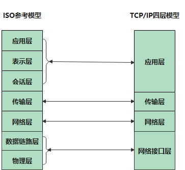
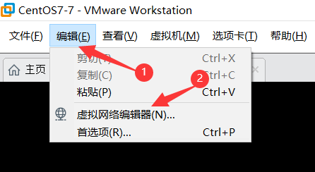
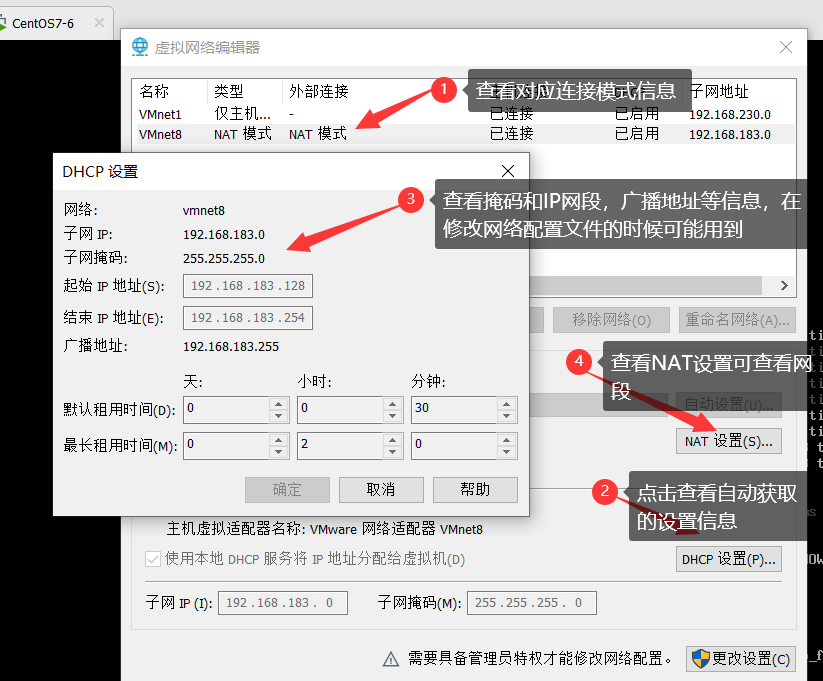
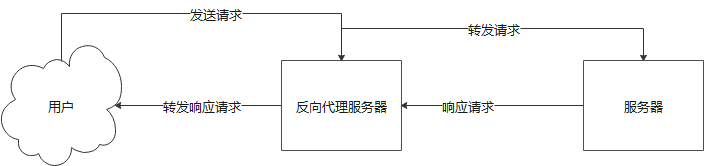
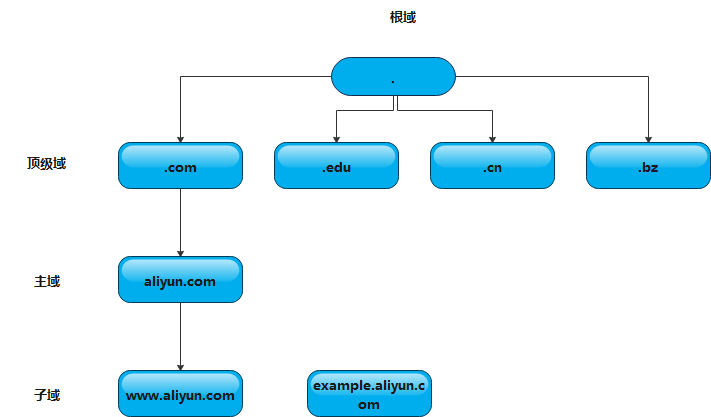
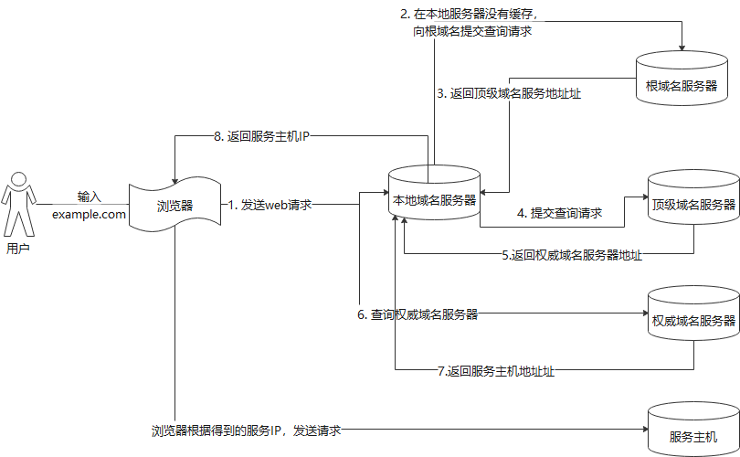

[TOC]

# Linux实操

> 以下操作基本是使用FinalShell客户端进行的操作
> 虚拟机：VMWare 15
>
> 操作系统：CentOS7

## **软件安装**

### RPM

> - **软件包名称说明**
>   如：lftp-4.0.9-1.el6.x86_64.rpm
>
>   软件名  版本号(主版本/次版本/修订号)  操作系统 cpu平台
>
>   操作系统：el5 el6 fedora  suse debin ubuntu
>   cpu平台：i386  486  586 686 表示32位软件
>   x86_64 表示64位软件
>   noarch 表示32,64通用
>
> - **RPM工具详解**
>
> ```
> 1. 根据包名查找下载网址，一般从官网下载，找到需要下载的版本，如：lftp-4.4.8-12.el7.x86_64.rpm
> 下载网址：http://www.rpmfind.net/linux/rpm2html/search.php?query=lftp(x86-64)
> 
> 2. 安装：rpm -ivh 软件包名称  -i install   v :  verbose  h:human
> [root@localhost ~]# rpm -ivh lftp-4.4.8-12.el7.x86_64.rpm 
> Preparing...                          ################################# [100%]
> Updating / installing...
>    1:lftp-4.4.8-12.el7                ################################# [100%]
> 
> 3. 查询软件安装路径：rpm -ql 软件包名  ql:query list
> [root@localhost ~]# rpm -ql lftp
> 
> 4. 查询软件名称
> [root@localhost ~]# rpm -qa lftp  // -a all
> lftp-4.4.8-12.el7.x86_64
> [root@localhost ~]# rpm -qa  | grep lftp
> lftp-4.4.8-12.el7.x86_64
> 
> 5.查询软件详细信息
> [root@localhost ~]# rpm -qi lftp
> Name        : lftp
> Version     : 4.4.8
> Release     : 12.el7
> Architecture: x86_64
> Install Date: Tue 06 Oct 2020 11:13:25 PM CST
> Group       : Applications/Internet
> Size        : 2526966
> 
> 6. 查询某个文件是由哪个软件产生
> [root@localhost ~]# rpm -qf /etc/passwd  // -f file
> setup-2.8.71-11.el7.noarch
> 
> 7. 卸载软件
> [root@localhost ~]# rpm -e lftp // - e :erase  
> 后可加参数：--force 在安装时用，强制安装
> 	      --nodeps 在卸载的时候用，卸载时不检查依赖关系
> 
> ```

### YUM工具管理RPM软件包

> - **YUM分类**
>   1. 本地yum
>          file://
>   2. 远程yum:
>      http://10.18.13.222/...
>      ftp://10.18.13.222/...
>
> - **配置本地YUM源**
>
> ```
> 1. YUM 源 目录：/etc/yum.repos.d  该目录下所有文件都以 .repo结尾 。系统默认的文件，yum源为国外网址。
> [root@localhost ~]# ls /etc/yum.repos.d 
> [root@localhost ~]# rm /etc/yum.repos.d/* //清空默认配置，实验阶段最好备份下，放到别的目录下，再清空
> 
> 2. 确认虚拟机默认使用ISO映像文件，即计算机已加载光驱
> 3. 挂载
> [root@localhost ~]# mkdir /mnt/cdrom  //创建挂载点
> [root@localhost ~]# mount /dev/cdrom /mnt/cdrom //挂载
> [root@localhost ~]# df  //查看挂载信息
> Filesystem              1K-blocks    Used Available Use% Mounted on
> devtmpfs                   914448       0    914448   0% /dev
> tmpfs                      931504       0    931504   0% /dev/shm
> tmpfs                      931504   10804    920700   2% /run
> tmpfs                      931504       0    931504   0% /sys/fs/cgroup
> /dev/mapper/centos-root  17811456 5232752  12578704  30% /
> /dev/sda1                 1038336  188744    849592  19% /boot
> tmpfs                      186304      32    186272   1% /run/user/0
> /dev/sr0                  4669162 4669162         0 100% /mnt/cdrom
> 
> 4. 配置repo文件
> [root@localhost yum.repos.d]# vim dvd.repo
> [dvd]  //yum源区别名称，用来区别其他yum源
> name=dvd  // yum源描述，yum源名称
> baseurl=file:///mnt/cdrom  // 本地yum源的绝对路径 
> gpgcheck=0  // 是否检查软件；0 否 1 是
> enable =1  // 是否使用 ，不配置时 默认使用
> 
> 5. 安装软件
> [root@localhost ~]# yum -y install lftp  // -y yes 
> 
> ```
>
> - **配置远程YUM**
>
> ```
> 1. 配置阿里云yum源：下载阿里云源至本地yum库
> 方式1：wget -O 写入目标文件路径 源文档地址
> wget -O /etc/yum.repos.d/CentOS-Base.repo https://mirrors.aliyun.com/repo/Centos-7.repo
> 方式2：wget 来源文档地址 写入目标文件路径
> wget  http://mirrors.aliyun.com/repo/Centos-7.repo  -O /etc/yum.repos.d/CentOS-Base.repo  
> 
> 备注：下载前提是系统联网了，可以正常访问网络。同时需有工具 wget
> ```
>
> 
>
> - **YUM工具详解**
>
> ```
> 1. 清理YUM缓存:yum会把下载的软件存储在它的缓存Cache中，而不自动删除
> [root@localhost yum.repos.d]# yum clean all
> Loaded plugins: fastestmirror, langpacks
> Cleaning repos: base dvd epel extras nginx-stable updates
> Cleaning up list of fastest mirrors
> 
> 2. 缓存软件包信息:提高搜索/安装软件的速度
> [root@localhost yum.repos.d]# yum makecache
> 
> 3. 查询YUM源信息
> [root@localhost ~]# yum repolist
> 
> 4. 查找软件:此命令会搜索到系统已安装和yum源里没有安装的软件信息，可以用他简单测试yum是否好用
> [root@localhost ~]# yum search lftp
> 
> 5. 查看软件依赖关系
> [root@localhost ~]# yum deplist
> [root@localhost ~]# yum deplist httpd
> 
> 
> 6.查看文件属于哪个软件:当使用某个命令没有时，可用此命令查看命令所属软件，然后安装对应软件。
> [root@localhost ~]# yum provides vim
> 
> 7. 查看系统已安装和未安装软件
> [root@localhost ~]#yum list
> 
> 8. 查看软件组包含的具体软件
> [root@localhost ~]# yum groupinfo
> 
> 9. 安装软件组
> [root@localhost ~]# yum groupinstall '软件组名'
> 如果软件或软件组名称有空格，需要给空格转义或加引号
> 
> 10. 安装软件
> [root@localhost ~]# yum install 软件名
> yum install mysql mysql-server -y  //同时安装多个软件 -y 跳过确认提示直接安装
> 
> 11. 重装
> [root@localhost ~]# yum reinstall 软件名
> 
> 12. 卸载
> [root@localhost ~]# yum erase sql-server -y
> [root@localhost ~]# yum remove sql-server -y
> ```

### 源码包管理

> - **源码包应用场景**
>
>   有时我们所用的内核版本太旧，系统自带的库版本低或者依赖的其他软件版本低，导致无法安装目标软件
>   软件/库其实是对计算机汇编指令的封装，在x86体系下，不同版本的内核指令集差别不是很大，所以我们可以在机器上自己编译新版本的软件依赖库，进而安装我们需要的软件。
>
> - **源码包下载**
>   访问所在官网下载
>
> - **源码包安装**
>
> ```
> 1. 上传源码包到虚拟机Linux
> [root@localhost ~]# yum provides rz //查看rz软件包
> Loaded plugins: fastestmirror, langpacks
> Loading mirror speeds from cached hostfile
>  * base: mirrors.aliyun.com
>  * extras: mirrors.aliyun.com
>  * updates: mirrors.aliyun.com
> lrzsz-0.12.20-36.el7.x86_64 : The lrz and lsz modem communications programs
> [root@localhost ~]# yum -y install lrzsz-0.12.20-36.el7.x86_64 //安装rz
> [root@localhost ~]# rz //打开本地目录，选择要上传的文件 此处使用的是final shell客户端操作
> [root@localhost ~]# ls
>  nginx-1.18.0.tar.gz
>  
>  2. 安装源码包需要的编译环境：源码包不能直接安装，十分依赖机器的环境，
>  [root@localhost ~]# yum -y install gcc make zlib-devel pcre pcre-devel openssl-devel
> 
> 3. 源码包的编译安装
> [root@localhost test]# tar xvf tengine-2.2.0.tar.gz //解压源码包
> [root@localhost tengine-2.2.0]# ./configure \   // \ 表示命令还未结束，利用此符号可以换行输入命令，美观
> > --user=joy \  // 指定所属用户 也可不设置
> > --group=joy \  //指定所属用户组 也可不设置
> > --prefix=/usr/local/nginx \  //指定安装目录 这个需指定，免得找不到安装目录
> > --with-http_stub_status_module \   //为nginx模块，可省略，不影响安装
> > --with-http_sub_module \  //为nginx模块，可省略，不影响安装
> > --with-http_ssl_module \  //为nginx模块，可省略，不影响安装
> > --with-pcre  //也可省略
> [root@localhost tengine-2.2.0]# make //make 读取Makefile 文件，将源码编译成二进制文件，并存放当前路径下
> [root@localhost tengine-2.2.0]# make install // 将软件安装至指定目录
> [root@localhost tengine-2.2.0]# make && make install //同时执行 make 与 make install
> [root@localhost tengine-2.2.0]# lsof -i:80  //查看80端口是否被占用
> [root@localhost tengine-2.2.0]#/usr/local/nginx/sbin/nginx //启动nginx服务
> [root@localhost tengine-2.2.0]# lsof -i:80  //可以查看到nginx启动成功
> COMMAND   PID USER   FD   TYPE DEVICE SIZE/OFF NODE NAME
> nginx   70239 root    6u  IPv4 287129      0t0  TCP *:http (LISTEN)
> nginx   70240  joy    6u  IPv4 287129      0t0  TCP *:http (LISTEN)
> [root@localhost tengine-2.2.0]# /usr/local/nginx/sbin/nginx -s stop //停止nginx服务
> 
> 问题汇总：
> 1.当nginx端口被占用时
> 解决方案：停止其他web服务，如httpd
> [root@localhost ~]# lsof -i:80
> [root@localhost ~]# systemctl stop httpd
> 
> 2. 当误删nginx安装目录，而进程没有停止：
> 解决方案：使用：#kill -9 pid 强制停止进程 ；或者 使用 killall nginx 停止进程
> 备注：killall 若没安装需先安装。
> [root@localhost ~]# yum -y install psmisc
> 
> ```

## 网络管理

### ISO模型

> 
> **说明**：
>
> - **APDU** —Application Protocol Data Unit--应用协议数据单元
> - **PPDU** – Presentation protocol data unit. 表示层协议数据单元
> - **SPDU** – Session protocol data unit. 会话层协议数据单元
> - **segment DU** — 段数据单元
> - **packet DU**—包数据单元
> - **frame DU**— 帧数据单元
> - **bit DU**—比特流数据单元
>
> **特点：**
>
> - 每一层都使用自己的协议
> - 每一层都利用下层提供的服务与对等层通信
>
> **封装：**
>
> 数据通过网络传输，在发送端要从高层一层一层的向下传送，如果一个主机要传送数据到别的主机，先把数据装到一个特殊的协议报头里，这个过程叫封装
> **解封装**
> 与封装是一个相反的过程，数据从底层一层一层向上传输，每层去掉相应的报头信息，一直到高层，这个过程叫解封装。

### ISO & TCP/IP

> 

### 网络协议

> **网络协议**：
> 网络上所有设备（网络服务器，计算机及交换机，路由器，防火墙等）之间通信规则的集合，它规定了通信时信息必须采用的格式和这些格式的意义。大多数网络都采用分层的体系结构，每一层都建立在它的下层之上，向它的上一层提供一定的服务，而把如何实现这一服务的细节对上一层加以屏蔽。
>
> **协议栈是什么？**
> 根据分层思想，每一层都有对应的协议，统称协议族/协议栈。
> 栈：先进后出的数据结构
> 先进的报头先处理，后进的栈头先处理。
>
> **一些重要的协议**
>
> - **TCP**:Transmission Control Protocol 传输控制协议，是一种面向连接的、可靠的、基于字节流的传输层通信协议。 
>   三次握手，四次挥手
>
>   **建立连接**：三次握手
>   
>
> 在三次握手后，客户端和服务端开始传输数据，建立连接。
>   **关闭连接**：四次挥手
>   
>
> - **UDP** :User Datagram Protocol 用户数据包协议
>   是OSI参考模型中一种无连接的传输层协议，提供面向事务的简单不可靠信息传送服务。在OSI模型中，在第四层传输层，处于IP协议的上一层。UDP有不提供数据包分组、组装和不能对数据包进行排序的缺点，也就是说当报文发送之后，是无法得知其是否安全完整到达的
>
>   **特性：**
>
>   - 非面向连接：不用先与对方建立连接，不握手
>
>   - 不可靠的：没有确认机制
>     因为它不属于连接型协议，因而具有资源消耗小，处理速度快的优点，所以通常音频、视频和普通数据在传送时使用UDP较多，因为它们即使偶尔丢失一俩个数据包，也不会对接收结果产生太大影响。
>
>     UDP的可靠性靠的是应用程序
>
>   **UDP应用场景：**
>
>   1. 即时通信：QQ聊天 对数据准确性和丢包要求比较低，但速度必须快；
>   2. 在线视频：RTSP(Real Time Streaming Protocol) 一个应用层协议，速度一定要快，保证视频连续，偶尔花了一个图像帧，人们还是能接受的；
>   3. 网络语音电话：VoIP 语音数据包一般比较小，需要高速发送，偶尔断音或串音也没问题；
>   4. dns:das同时占用tcp和udp的53端口，其中tcp/53一般在从服务器同步主服务器的时候用。
>
> - **IP**
>
>   IP协议是TCP/IP协议族中最为核心的协议。所有TCP\UDP\ICMP及IGMP数据都已IP数据报格式传输
>
>   **特点**
>
>   - 不可靠
>     它不能保证IP数据报能成功到达目的地。IP仅提供尽力而为的传输服务。如果发生某种错误时，如某个路由器暂时用完了缓冲区，IP有一个简单的错误处理算法：丢弃该数据报，然后发送ICMP数据报给信源端。任何要求的可靠性必须由上层来提供(如TCP)。
>   - 无连接(connectionless)
>     IP并不维护任何关于后续数据报的状态信息。每个数据报的处理相互独立的。这也说明，IP数据报可以不按发送顺序接收。如果一信源向相同的信宿发送俩个连续的数据报(先是A，后是B)，每个数据报都是独立地进行路由选择，可能选择不同的路线，因此B可能在A之前先到达。
>
> - **ARP协议作用**
>   ARP地址解析协议用于网络地址(IP地址32位)转化为物理地址(MAC地址48位).ARP协议属于数据链路层or网络层的协议，在以太网的数据帧从一个主机到达网内的另一台主机是根据48位的以太网地址(硬件地址)来确定接口的，而不是根据32位的IP地址。内核(如驱动)必须知道目的端的硬件地址才能发送数据。
>
> - **ICMP**
>
>   ICMP(Internet Control Message Protocol)Internet控制报文协议。它是TCP/IP协议族的一个子协议，用于IP主机、路由器之间传递控制消息。控制消息是指网络通不通，主机是否可达，路由器是否可用等网络本身的消息。这些控制消息并不传输用户数据，但是对于用户数据的传递起着重要作用。
>
>   ICMP经常被认为是IP层的一个组成部分。它传递差错报文以及其他需要注意的信息。。ICMP报文通常被IP层或者更高层协议——TCP/UDP使用。一些ICMP报文把差错报文返回给用户进程。
>
>   **主要作用：**
>
>   - 侦测远端主机是否存在
>   - 建立及维护路由资料
>   - 重导资料传送路径
>
> - **其他**
>   RFC：记录了TCP/IP规范的文档，国际互联网工程任务组：https://www.ietf.org/standards/rfcs/

### 交换机

> SICO交换机，一般采用模块式，当某个接口坏了可以拆卸。一般分为24口和48口
>
> - **交换机的作用**
>   网络交换机，是一个扩大网络的器材，能为子网络中提供更多的连接端口，以便连接更多的计算机
>
> - **交换机的分类**
>   从广义上来看，交换机分为俩种。广域网交换机和局域网交换机。广域网交换机主要应用于电信领域，提供通信基础平台。而局域网交换机则应用于局域网，用于连接终端设备，如PC机以及网络打印机等。
>
> ​       按照现在复杂的网络构成方式，可以划分为接入层交换机、汇聚层交换机和核心层交换机。

### MAC地址

> ```
> 1. 查看MAC地址
> [root@localhost ~]# ifconfig  
> ens33: flags=4163<UP,BROADCAST,RUNNING,MULTICAST>  mtu 1500
>         inet 192.168.183.138  netmask 255.255.255.0  broadcast 192.168.183.255
>         inet6 fe80::5fb6:fb22:4cf1:9418  prefixlen 64  scopeid 0x20<link>
>         ether 00:0c:29:fc:86:45  txqueuelen 1000  (Ethernet)
>         RX packets 95564  bytes 7285663 (6.9 MiB)
>         RX errors 0  dropped 0  overruns 0  frame 0
>         TX packets 134112  bytes 20181250 (19.2 MiB)
>         TX errors 0  dropped 0 overruns 0  carrier 0  collisions 0
> [root@localhost ~]# ip a
> [root@localhost ~]# yum -y install net-tools-*
> [root@localhost ~]# arping 192.168.183.138  //arp是IP地址解析为MAC地址的一个TCP/IP协议，使用arping 命令需先安装												net-tools-*
> 
> ```

### IP配置

> ```
> 永久配置方式：修改配置文件
> //网络配置文件目录：/etc/sysconfig/network-scripts/
> [root@localhost ~]# vi /etc/sysconfig/network-scripts/ifcfg-ens33
> TYPE=Ethernet  //以太网接口类型
> BOOTPROTO=dhcp  //启动协议,dhcp 动态获取IP；none/static：静态获取，需手动获取
> NAME=ens33  //名称 ；可以不存在
> DEVICE=ens33 //设备名称
> ONBOOT=yes //开机启动
> NM_CONTROLLED=no  //关闭NetworkManager
> HWADDR=00:0c:29:8e:a4:d3  //MAC地址
> IPADDR=192.168.183.133 //IP地址
> NETMASK=255.255.255.0  //子网掩码
> PREFIX=24 //子网掩码
> GATEWAY=192.168.183.0 //网关
> DNS1=192.168.183.0  //Domain name server 域名服务器
> DNS2=8.8.8.8  //第二台DNS服务器
> [root@localhost ~]# systemctl restart network  //重启网络服务
> ```
>
> - **操作**
>
> 1. 查看虚拟网络子网掩码，网段，IP范围等信息
>    
>
>    
>
> 2. 修改IP配置文件
>
> ```
> [root@localhost ~]# vi /etc/sysconfig/network-scripts/ifcfg-ens33
> TYPE="Ethernet"
> PROXY_METHOD="none"
> BROWSER_ONLY="no"
> BOOTPROTO="static"
> DEFROUTE="yes"
> IPV4_FAILURE_FATAL="no"
> IPV6INIT="yes"
> IPV6_AUTOCONF="yes"
> IPV6_DEFROUTE="yes"
> IPV6_FAILURE_FATAL="no"
> IPV6_ADDR_GEN_MODE="stable-privacy"
> NAME="ens33"
> UUID="78cfafd2-4b3e-41b2-8cf8-77f03ff36d82"
> DEVICE="ens33"
> ONBOOT="yes"
> IPADDR=192.168.183.135
> PREFIX=24
> NETMASK=255.255.255.0
> GATEWAY="192.168.183.2"
> IPV6_PRIVACY="no"
> BROADCAST=192.168.183.2
> DNS1=8.8.8.8
> DNS2=8.8.4.4
> 
> [root@localhost ~]# systemctl restart network 
> ```
>
> 

### 网络测试工具

#### ping命令

> ​    用来测试主机之间的连通性。执行ping命令会使用ICMP传输协议，发出要求回应的请求，若远程主机的网络功能没有问题，就会     回应该信息，因而得知该主机运作正常。
>
> ```
> [root@localhost ~]# ping -c 3 www.baidu.com //-c count指定请求数
> [root@localhost ~]# ping -i 3 www.baidu.com  //-i interval 指定请求间隔时间
> [root@localhost ~]# ping -f www.baidu.com  //极限ping，会在短时间内发送大量请求
> [root@localhost ~]# ping -c 1000 -i 0.01 www.baidu.com  //常用ping短时间发送大量请求，查看网关/服务器是否正常，以															及响应时间
> 1000 packets transmitted, 1000 received, 0% packet loss, time 15134ms
> rtt min/avg/max/mdev = 16.928/19.971/63.069/3.615 ms, pipe 6
> ```

#### traceroute命令

> 通过traceroute可以知道信息从你的计算机到互联网另一端主机走的什么路径。当然每次数据包由某一同样的出发点(source)到达某一同样的目的地(destination)走的路径可能会不一样，但基本上来说大部分时候所走的路由是相同的。traceroute通过发送小数据包到目的设备直到其返回，来测量其需要多长时间。一条路径上的每个设备traceroute要测3次。输出结果中包括每次测试的时间(ms)和设备名称(如有的话)及其IP地址。
>
> 可以用来排查故障，查看是服务器问题还是网关问题。如访问服务器失败时，通过该命令查看请求服务器经过的网关，查看是哪一跳出现的问题，然后再请求服务商进行处理。
>
> ```
> [root@localhost ~]# yum -y install traceroute //若无traceroute先安装，仅限
> 语法：traceroute hostname
> [root@localhost ~]# traceroute www.qfedu.com
> traceroute to www.qfedu.com (140.143.51.136), 30 hops max, 60 byte packets
> 1  gateway (192.168.183.2)  0.352 ms  0.286 ms  0.293 ms  
> 	//给网关发送3个数据包的响应时间： 0.352 ms  0.286 ms  0.293 ms
> 	//每一条标识序号的记录表示一跳，每一跳表示一个网关
> 2  * * *  //出现三个*的记录，表示防火墙封掉ICMP返回的信息
> 3  * * *
> 4  * * *
> ......... //此为重复* 省略
> 29  * * *
> 30  * * *   从本机到www.qfedum.com经过30跳
> 
> 
> 有时我们在某一网关延时比较长，有可能是某台网关比较阻塞，也可能是物理设备本身的原因。当然如果某台DNS出现问题时，不能解析主机名、域名时，也会出现延时长的现象。可以加参数`-n`来避免DNS解析，以IP格式输出数据。
> 
> ### 跳数设置
> [root@localhost ~]# traceroute -m 10 www.baidu.com
> ### 只显示IP地址不显示主机名
> [root@localhost ~]# traceroute -n www.baidu.com
> ### 探测包使用的基本UDP端口设置6888
> [root@localhost ~]# traceroute -p 6888 www.baidu.com
> ### 把探测包个数设为4
> [root@localhost ~]# traceroute -q 4 www.baidu.com
> ### 绕过正常的路由表，直接发送到网络相连的主机
> [root@localhost ~]# traceroute -r www.baidu.com //这个会失败
> traceroute to www.baidu.com (14.215.177.39), 30 hops max, 60 byte packets
> connect: Network is unreachable
> 
> ### 把对外发探测包的等待响应时间设置为3s
> [root@localhost ~]# traceroute -w 3 www.baidu.com
> 
> Traceroute 工作原理
> traceroute程序的设计师利用ICMP以及IP header的TTL(Time To Live)栏位(field).
> ```

### 路由

#### 静态路由&动态路由

> **路由器在转发数据时，需要先在路由表中查找相应的路由，有三种途径：**
>
> 1. 直连路由：路由器自动添加和自己直连的路由；
> 2. 静态路由：管理员手动添加的路由；
> 3. 动态路由：由路由协议动态建立的路由
>
> - **静态路由**
>   - **缺点**
>     不能动态的反映网络拓扑，当网络发生变化的时候，管理员需手动改变路由
>   - **优点**
>     不会占用路由器太多的CPU和RAM资源，也不会占用太多带宽。
>     如果出于安全的考虑想隐藏网络的某些部分或者管理员想控制转发路径也可以使用静态路由，小网络也可以配置静态路由，因为便捷
>
> - **默认路由**
>
> 1. 实际上默认路由是一种特殊的静态路由，指的是当路由表中与包的目的地址之间没有匹配的表项时，路由器能够做出选择。如果没有默认路由，那么目的地址在路由表中没有匹配表项的包将被丢弃。
> 2. 默认路由，如果旧数据包中的目的地址找不到存在的其他路由时，路由器会默认选择的路由。
>    默认路由为：0.0.0.0
>    匹配IP地址时，0表示wildcard,任何值都是可以的，所有的0.0.0.0和任何目的地址匹配都会成功，造成默认路由要求的效果。就是说0可以匹配任何的IP地址。
>
> - **动态路由**
>   动态路由是与静态路由相对的一个概念，是指路由器能够根据路由器之间交换的特定路由信息自动地建立自己的路由表，并且能够根据链路和节点的变化适时地进行自动调整。当网络中节点或者节点间的链路发生故障，或存在其他可用路由时，动态路由可以自行选择最佳的可用路由并继续转发报文。
>
> - **路由器的功能**
>   1. 网络互联：路由器支持各种局域网和广域网的接口，主要用于局域网，广域网和互联网实现不同网络间的相互通信；
>   2. 路由器还可以进行数据处理，包括提供分组过滤，分组转发，优先级复用，加密，压缩和防火墙等等功能；
>   3. 网络管理：路由器提供了包括路由管理，性能管理，容错管理和流量控制等一些功能；

#### Linux路由操作

> ```
> [root@localhost ~]# yum -y install net-tools //当没有route命令时安装
> [root@localhost ~]# route -n  // 路由表信息
> Kernel IP routing table
> Destination     Gateway         Genmask         Flags Metric Ref    Use Iface
> 0.0.0.0         192.168.183.2   0.0.0.0         UG    100    0        0 ens33
> 192.168.183.0   0.0.0.0         255.255.255.0   U     100    0        0 ens33
> 
> Destination     Gateway         Genmask         Flags Metric  Ref    	   Use		 		Iface
> 	|			   |			   |			 |      |      |      		|    		      |
> 目标网络/主机     网关地址		  字段的网络掩码    标记   路由距离 路由项   	此路由项被     		设备名称
> 								就是目标网络掩码                 引起的次数   路由查找的次数		/网卡名称
> 0.0.0.0 默认路由地址，目标地址与网关地址相同，表明在同一网络不需要经过网关
> 路由距离：表示到达指定网络的中转数
> 
> ### 查看路由表
> [root@localhost ~]# ip r  //查看路由信息
> default via 192.168.183.2 dev ens33 proto dhcp metric 100 
> 192.168.183.0/24 dev ens33 proto kernel scope link src 192.168.183.139 metric 100 
> [root@localhost ~]# ip r d default //删除默认路由
> [root@localhost ~]# ip r del 10.18.45.0/24  //删除静态路由
> [root@localhost ~]# ip r add default via 10.18.44.1 dev ens33  //添加默认网关:via为网关出口，后面直接跟网关出口地																  址;dev 设备名称，网关出口的设备名
> [root@localhost ~]# ip r add 10.18.44.0/24 via 10.18.44.1 dev ens33 //
> 
> ```

### 网络端口

- **简介**

> 在网络技术中，端口(Port)有好几种意思。集线器、交换机、路由器的端口指的是连接其他网络设备的接口，如J-45端口、Serial端口等。我们这里所指的端口不是指物理意义上的端口，而是特指TCP/IP协议中的端口，是逻辑意义上的端口。
>
> 如果把IP地址比作一间房子，端口就是出入这间房子的门。真正的房子只有几个门，但是IP地址端口可以65536(即：2^16)个多！(端口是通过端口号来标记的，端口号只有整数，范围是从0到65535(2^16-1))
>
> 本地操作系统会给那些有需求的进程分配协议端口，每个协议端口由一个正整数标识，如：80,139,445等等。当目的主机接收到数据包后，将根据报文首部的目的端口号，把数据发送到相应端口，而与此相对应的那个进程将会领取数据并等待下一组数据的到来。
>
> 端口其实就是队，操作系统为各个进程分配了不同的队，数据包按照目的端口被推入相应的队中，等待被进程取用，在极特殊的情况下，这个队也是有可能溢出的，不过操作系统允许各进程指定和调整自己队的大小。
>
> 不光接受数据包的进程需要开启它自己的端口，发送数据包的进程也需要开启端口，这样数据包中将会标识有源端口，以便接受方能顺利回传数据包的这个端口。
>
> IP和服务端口的关系：IP与服务端口是一对多的关系。一个操作系统有一个IP，但可以开启多个不同服务，如WEB服务，SQL服务等，不同服务以端口进行区分。

- **常见服务管理操作**

> ```
> [root@localhost ~]# systemctl list-units //列出所有启动的unit
> [root@localhost ~]# systemctl list-unit-files //列出所有启动服务文件
> [root@localhost ~]# systemctl start vsftpd  //启动vsftpd服务
> [root@localhost ~]# systemctl status vsftpd  //查看vsftpd服务状态
> [root@localhost ~]# systemctl status nginx -l //查看nginx服务状态
> [root@localhost ~]# systemctl stop vsftpd  //停止vsftpd服务
> [root@localhost ~]# systemctl restart vsftpd //重新启动vsftpd服务，会先关闭服务，然后再启动服务
> [root@localhost ~]# systemctl reload vsftpd  //重新加载vaftpd服务配置文件
> [root@localhost ~]# systemctl enable vsftpd  //允许vsftpd服务开机启动
> [root@localhost ~]# systemctl disable vsftpd //不允许vsftpd服务开机启动，禁止服务开机自启
> ```

## 日志

### 常见系统日志

> ```
> /var/log/messages:记录Linux操作系统常见的系统和服务错误信息
> /var/log/boot.log:记录系统在引导过程中发生的事件，是Linux系统开机自检过程显示的信息；
> /var/log/lastlog:记录最后一次用户登录成功的时间、登录IP等信息(一般通过命令lastlog 查询)
> /var/log/secure :Linux系统安全日志，记录永和和工作组变坏情况、用户登录认证情况
> /var/log/btmp : 记录Linux登陆失败的用户、时间以及远程IP地址
> /var/log/wtmp:该日志文件永久记录每个用户登录、注销及系统的启动、停机的事件，使用last命令查看
> ```

### rsyslog日志管理

> ```
> [root@localhost ~]# tailf /var/log/messages //动态查看最新日志
> [root@localhost ~]# tail -f /var/log/messages //动态查看最新日志信息
> [root@localhost ~]# yum -y install epel-release //安装epel 扩展源
> epel是社区强烈打造的免费开源发行软件包版本库。
> EPEL，即Extra Packages for Enterprise Linux的简称，是为企业级Linux提供的一组高质量的额外软件包，包括但不限于Red Hat Enterprise Linux (RHEL), CentOS and Scientific Linux (SL), Oracle Enterprise Linux (OEL)。(关于 : EPEL)
> 清华大学开源软件镜像站：https://mirrors.tuna.tsinghua.edu.cn/help/epel/
> ```
>
> - **日志类型**
>   - auth pam :产生日志，在请求服务时，pam认证功能的一个应用程序
>   - authpriv ssh,ftp等登录信息的验证信息
>   - cron 时间任务相关
>   - kern 内核
>   - lpr 打印
>   - mail 邮件
>   - mark（syslog）-rsyslog服务内部的信息，时间标识
>   - news 新闻组
>   - user 用户程序产生的相关信息
> - **日志优先级**日志级别分为：7种日志级别代号0-7
>   - 0 debug 有调试信息的，日志信息最多
>   - 1 info 一般信息的日志，最常用
>   - 2 notice 最具有重要性的普通条件的信息
>   - 3 warning 警告几倍
>   - 4 err错误级别，阻止某个功能或者模块不能正常工作的信息
>   - 5 crit 严重级别，阻止整个系统或者软件不能工作的信息
>   - 6 alert 需要立刻修改的信息
>   - 7 emerg 内核崩溃等严重信息
>   - none 什么都不记录
> - **自定义日志**
>
> ```
> [root@localhost ~]# vim /etc/rsyslog.conf  //自定义日志
> 日志对象(设备):你要对什么设备记录日志
> 日志级别：级别越低，信息越多
> 日志文件：存储日志的文件
> 
> 格式： 日志对象.日志级别  日志文件
> . 		大于或者等于后面指定的日志级别
> .= 		等于后面指定的日志级别
> .! 		非
> 
> 例：
> *.*      /var/log/mylog
> kern.err   /var/log/kernel.los
> *.info;mail.none  /var/log/big.log
> cron.info;cron.!err  /var/log/newcron
> 
> [root@localhost ~]# systemctl restart rsyslog  //重启日志服务
> 
> 
> [root@localhost backups_joy]# > test   //清空文件内容
> ```


### logrotate日志轮转

> 简介：自动对日志进行截断，切割。自动保留最近时间的日志，清除过久日志。
>
> ```
> [root@localhost ~]# vim /etc/logrotate.conf  // 日志轮转配置文件
> //全局配置
> weekly  轮转周期 默认一周轮转一次
> rotate 4  轮转次数 默认轮转4次,只保留最新四次的日志，其他的删除
> create  创建新文件
> dateext 以轮转时刻的时间作为轮转文件的结尾
> 
> //局部配置
> include /etc/logrotate.d  //包含目录/etc/logrotate.d ，此目录会自动加载
> missingok 在文件不存在的时候也不报错
> create 0644 root utmp //创建 权限为0644的日志文件 属主：root 属组：utmp
> 
> ### 强制轮转
> [root@localhost ~]# logrotate -s /var/lib/logrotate/logrotate.status /etc/logrotate.conf
> -s 指定最后的日志轮转记录文件为/var/lib/logrotate/logrotate.status
> 
> ### 轮转配置：应用程序轮转配置文件，一般默认在/etc/logrotate.d 目录下，如需修改程序轮转参数，一般在此修改
> 如：修改yum轮转配置
> [root@localhost ~]# vi /etc/logrotate.d/yum
> /var/log/yum.log {
>  missingok
>  #notifempty
>  #maxsize 30k
>  #yearly
>  daily
>  rotate 3
>  create 0777 root root
> }
> [root@localhost ~]# ls /var/log/yum.* //未轮转前
> /var/log/yum.log
> [root@localhost ~]# date
> Fri Oct  9 03:58:38 EDT 2020
> [root@localhost ~]# date 11111021  //修改时间 月日时分
> Wed Nov 11 10:21:00 EST 2020
> [root@localhost ~]# logrotate /etc/logrotate.conf //执行手动轮转
> [root@localhost ~]# ls /var/log/yum.*  //查看轮转后日志目录
> /var/log/yum.log  /var/log/yum.log-20201111
> 
> ### 日志安全：操作日志的隐藏权限  
> [root@localhost ~]# vi /etc/logrotate.d/syslog
> ########################################################################################################
> /var/log/cron
> /var/log/maillog
> #/var/log/messages
> /var/log/secure
> /var/log/spooler
> {
>  missingok
>  sharedscripts
>  postrotate
>      /bin/kill -HUP `cat /var/run/syslogd.pid 2> /dev/null` 2> /dev/null || true
>  endscript
> }
> 
> /var/log/messages{
> prerotate  #定义在轮转之前的操作
> chattr -a /var/log/messages
> endscript # 与prerotate 一对
> 
> daily
> create 0600 root root
> missingok
> rotate 5
> 
> postrotate  # 定义轮转完后的操作
> chattr +a /var/log/messages
> endscript
> 
> }
> ########################################################################################################
> [root@localhost ~]# logrotate /etc/logrotate.conf //手动轮转，看是否报错
> 
> ```

## 计划任务

> - **简介**
>   在指定的时间、指定的日期执行预先计划好的系统管理任务。RHEL6系统中默认已安装了at,cronie软件包，通过at和crond这俩个系统服务实现一次性、周期性计划任务的功能，并通过at/crontab 命令进行计划任务设置
> - **计划任务分类**
>   - 一次性计划任务
>   - 循环型计划任务 (用的最多)
>   - 系统级计划任务
>   - 用户级计划任务
>
> - **Contabs**:管理循环计划任务
>
> ```
> [root@localhost ~]# yum -y install contabs // 若无contabs 先安装
> [root@localhost ~]# systemctl start crond.service //启动crond服务
> [root@localhost ~]# systemctl status crond.service // 查看crond服务状态
> [root@localhost ~]# systemctl enable crond.service  //设置开机启动crond
> 
> ### 创建计划任务：用户级别的计划任务
> [root@localhost ~]# crontab -u 用户 -e
> - u 指定用户，不设置时默认为root
> 
> [root@localhost ~]# crontab -e //计划任务构成：时间 + 执行操作，若直接使用命令，一般使用命令的绝对路径。
> * * * * * ls /   时间：分  时  日  月  周
> [root@localhost ~]# which ls  //查看命令的绝对时间
> [root@localhost ~]# tailf /var/log/cron  //查看计划任务日志
> [root@localhost ~]# crontab -r  //删除所有计划任务
> [root@localhost ~]# crontab -l  //查看所有计划任务
> 
> ```

## 远程管理

### SSH服务

> ```
> ### 安装软件
> openssh-server 提供服务
> openssh-clients  客户端
> openssh
> 
> ssh 端口：22
> 
> [root@localhost ~]# yum -y install openssh*  //安装ssh相关软件
> [root@localhost ~]# systemctl start sshd //启动ssh服务
> [root@localhost ~]# lsof -i:22 //查看端口情况 需先安装：yum install lsof
> 
> [root@localhost ~]# systemctl stop firewalld  //临时关闭防火墙
> [root@localhost ~]# setenforce 0  //临时关闭selinux
> [root@localhost ~]# ssh root@182.168.183.144  //远程登录182.168.183.144 主机；可使用exit退出登录
> [root@localhost ~]# ssh -x root@192.168.183.144 -p 2222  //-p port:端口
> 
> ### 无密码登录(ssh密钥认证)
> 1. 生成公钥和私钥
> [root@localhost ~]# ssh-keygen  //一路回车 ，生产公钥和私钥对；将公钥拷贝到另一台机器后，就可以通过公、私钥直接连接
> [root@localhost ~]# ssh-copy-id -i 192.168.183.144  //拷贝公钥到指定机器
> /usr/bin/ssh-copy-id: INFO: Source of key(s) to be installed: "/root/.ssh/id_rsa.pub"
> /usr/bin/ssh-copy-id: INFO: attempting to log in with the new key(s), to filter out any that are already installed
> /usr/bin/ssh-copy-id: INFO: 1 key(s) remain to be installed -- if you are prompted now it is to install the new keys
> root@192.168.183.144's password: 
> mount: /dev/sr0 is write-protected, mounting read-only
> mount: /dev/sr0 is already mounted or /mnt/cdrom busy
>        /dev/sr0 is already mounted on /mnt/cdrom
> 
> Number of key(s) added: 1
> 
> Now try logging into the machine, with:   "ssh '192.168.183.144'"
> and check to make sure that only the key(s) you wanted were added.
> [root@localhost ~]# ssh 192.168.183.144  //未使用用户名登录，默认为root用户登录，此时不输入密码即可登录
> Last login: Fri Oct  9 19:37:51 2020 from 192.168.183.143
> mount: /dev/sr0 is write-protected, mounting read-only
> mount: /dev/sr0 is already mounted or /mnt/cdrom busy
>        /dev/sr0 is already mounted on /mnt/cdrom
> 
> 
> [root@localhost ~]# cd .ssh
> [root@localhost .ssh]# ls
> id_rsa  id_rsa.pub  known_hosts
>    |	     |
>  私钥       公钥
> [root@localhost .ssh]# pwd //若取消公钥私钥，直接删除该目录下生成的公、私钥即可
> /root/.ssh
> 
> ### 远程操作
> [root@localhost ~]# ssh 192.168.183.144 'reboot'
> 
> ### 远程拷贝：需先安装客户端 scp 源文件  目标路径
> [root@localhost ~]# scp test 192.168.183.144:/test
> -p 端口
> -r 拷贝目录
> ### 从另一台机器拷贝文件到当前机器
> [root@localhost ~]# scp 192.168.144:/test/test  192.168.183.143:/backups_joy/
> [root@localhost ~]# scp 192.168.144:/test/test  /tmp/
> 
> ### 修改端口号
> [root@localhost ~]# vim /etc/ssh/sshd_config
> Port 22  //端口
> ListenAddress 192.168.183.2
> PermitRootLogin yes
> StrictModes yes
> MaxAuthTries 6
> MaxSessions 10  //最大并发量 10
> PermitEmptyPasswords no
> 
> ```

### rz sz命令

> ```
> 需已安装客户端，在客户端操作.当前操作使用的客户端为：finalshell
> ### 1. 安装
> [root@localhost ~]# yum -y install lrzsz
> 
> ### 2. sz发送文件到本地：从Linux发送文件到Window
> [root@localhost ~]# sz 1.txt
> 
> ### 3. rz命令本地上传文件到服务器:从window 到 linux  ；客户端会自动打开本地磁盘目录
> [root@localhost ~]# rz
> 
> ```

##  Jumpserver 安装

> 简介：通道机或者跳板机或者堡垒机。Jumpserver 主要作用是服务器的管理, 这里的管理包含:
>
> - 有哪些服务器
> - 有哪些用户
> - 有哪些角色
> - 哪些角色可以登录哪些服务器
> - 哪些用户可以登录哪些服务器
>
> **jumpserever环境要求**
>
> 硬件配置: 2个CPU核心, 4G 内存, 50G 硬盘（最低） 
> 操作系统: Linux 发行版 x86_64 
> Python = 3.6.x 
> Mysql Server ≥ 5.6 
> Mariadb Server ≥ 5.5.56 
> Redis

### 1. 环境配置

> ```
> ### 环境配置
> 配置 epel 阿里云 yum源
> [root@localhost ~]# yum install epel-release
> [root@localhost ~]#yum -y install wget gcc epel-release git
> # 另一安装 epel源方式
> [root@localhost ~]# wget -O /etc/yum.repos.d/epel.repo http://mirrors.aliyun.com/repo/epel-7.repo
> ### 安装阿里云源
> [root@localhost ~]# wget -O /etc/yum.repos.d/CentOS-Base.repo http://mirrors.aliyun.com/repo/Centos-7.repo
> 
> [root@localhost ~]# yum clean all
> [root@localhost ~]# yum makecache
> #### 1. 关闭防火墙
> [root@localhost ~]# getenforce  
> Disabled
> [root@localhost ~]# setenforce 0
> setenforce: SELinux is disabled
> [root@localhost ~]# systemctl stop firewalld
> 
> #### 2. 修改字符集，可能报input/output error的问题，因为日志里打印了中文
> [root@localhost ~]# localedef -c -f UTF-8 -i zh_CN zh_CN.UTF-8
> [root@localhost ~]# export LC_ALL=zh_CN.UTF-8
> [root@localhost ~]# echo 'LANG="zh_CN.UTF-8"' > /etc/locale.conf
> 
> #### 3. 安装相关所需软件
> //源码包安装环境配置
> [root@localhost ~]#yum -y install gcc gcc-c++ zlib-devel bzip2 bzip2-devel readline-devel sqlite sqlite-devel openssl-devel xz xz-devel libffi-devel wget automake epel-release git
> 
> #### 4. 安装Python以及配置python环境变量
> 方式1：云服务厂商服务器基本都预装了epel源，如果没有epel源 就安装下 epel-release 
> ########################################################################################################
> 1. 安装Python3及工具：这种方式比较快
> [root@localhost ~]# yum -y install python36 python36-devel 
> [root@localhost opt]# python3 --version
> Python 3.6.8
> 2. 创建Python3虚拟环境
> [root@localhost ~]# python3.6 -m venv /opt/py3
> // source 重新执行刚修改的初始化文件，使之立即生效，而不必注销并重新登录
> [root@localhost opt]# source /opt/py3/bin/activate // 载入 Python 虚拟环境
>  每次操作 JumpServer 都需要先载入 py3 虚拟环境  # 退出虚拟环境可以使用 deactivate 命令
> ########################################################################################################
> 
> 方式2：
> ########################################################################################################
> [root@localhost ~]# wget https://www.python.org/ftp/python/3.6.1/Python-3.6.1.tar.xz
> [root@localhost Python-3.6.1]# tar xf Python-3.6.1.tar.xz  //解压
> [root@localhost Python-3.6.1]# cd Python-3.6.1
> [root@localhost Python-3.6.1]# ./configure && make && make install //编译并安装
> [root@localhost Python-3.6.1]# cd /opt
> //-m mod : run library module as a script (terminates option list)作为脚本运行库模块
> [root@localhost opt]# python3 -m venv py3 
> [root@localhost opt]# source /opt/py3/bin/activate  //更新配置文件
> // autoenv：自动载入python虚拟环境 
> (py3) [root@localhost opt]# git clone git://github.com/kennethreitz/autoenv.git
> [root@localhost opt]#echo 'source /opt/autoenv/activate.sh' >> ~/.bashrc //配置用户环境变量
> [root@localhost opt]#source ~/.bashrc  //载入用户环境变量
> 此操作报错：
> -bash: $'\r': command not found
> -bash: /opt/autoenv/activate.sh: line 6: syntax error near unexpected token `$'{\r''
> 'bash: /opt/autoenv/activate.sh: line 6: `autoenv_init() {
> 
> 解决方案：
> 因为文件是从windows导入到Linux的，Linux系统里，每行结尾只有“”，即“\n”；Windows系统里面，每行结尾是“
> ”，即“\n\r”,所以需要处理下
> 将activate.sh文件放到windows上用notepad++打开把模式(右下角可以设置)转换成Unix，然后替换了Linux上的activate.sh的文件就好了
> ########################################################################################################
> ### 扩展
> Kenneth Reitz网址:https://devhub.io/developer/kennethreitz
> ```

### 2. 下载Jumpserver

> ```
> ### 下载jumpserver
> [root@localhost opt]#git clone git clone git@github.com:jumpserver/jumpserver.git && cd jumpserver && git checkout master
> (非官网下载：(py3) [root@localhost opt]# git clone https://gitee.com/wudiudiu99/jumpserver.git
> )
> 或者直接下载安装包，比较快
> (py3) [root@localhost ~]# wget https://github.com/jumpserver/jumpserver/releases/download/v2.3.1/jumpserver-v2.3.1.tar.gz
> 
> ```

### 3. 安装所需的Python modules

> ```
> (py3) [root@localhost opt]#cd jumpserver
> (py3) [root@localhost jumpserver]# echo "source /opt/py3/bin/activate" > /opt/jumpserver/.env
> (py3) [root@localhost jumpserver]# cd requirements/
> (py3) [root@localhost requirements]# yum -y install $(cat rpm_requirements.txt) //安装所需软件
> 
> // pip 是一個 Python 安裝管理套件工具，下载速度慢可能会导致更新失败
> (py3) [root@localhost requirements]# pip install --upgrade pip  //安装&更新 pip
> (py3) [root@localhost requirements]# pip install -r requirements.txt //pip 安裝 requirements.txt 內的清單
> # 如果下载速度很慢, 可以换国内源 
> (py3) [root@localhost requirements]# pip install --upgrade pip setuptools -i https://mirrors.aliyun.com/pypi/simple/
> 
> (py3) [root@localhost requirements]# pip install -r requirements.txt -i https://mirrors.aliyun.com/pypi/simple/
> 
> (py3) [root@localhost requirements]# pwd
> /opt/jumpserver/requirements
> 
> 
> ### 拓展
> 1. 將安裝過的套件建立成 requirements.txt 文件清單
> $ pip freeze > requirements.txt  
> ```

### 4. 安装Redis

> ```
> (py3) [root@localhost requirements]# yum -y install redis  //安装
> (py3) [root@localhost requirements]# systemctl enable redis // 设置开机自启
> Created symlink from /etc/systemd/system/multi-user.target.wants/redis.service to /usr/lib/systemd/system/redis.service. 
> (py3) [root@localhost requirements]# systemctl start redis //启动服务
> 
> ```
>
> 

### 5. 安装MySQL

> MariaDB是MySQL源代码的一个分支，随着Oracle买下Sun，MySQL也落入了关系型数据库王者之手。
>
> **区别一：**
>
> MariaDB不仅仅是Mysql的一个替代品，MariaDB包括的一些新特性使它优于MySQL。
>
> **区别二：**
>
> MariaDB跟MySQL在绝大多数方面是兼容的，对于开发者来说，几乎感觉不到任何不同。目前MariaDB是发展最快的MySQL分支版本，新版本发布速度已经超过了Oracle官方的MySQL版本。
>
> MariaDB 是一个采用Aria存储引擎的MySQL分支版本， 这个项目的更多的代码都改编于 MySQL 6.0
>
> **区别三：**
>
> 通过全面测试发现，MariaDB的查询效率提升了3%-15%，平均提升了8%，而且没有任何异常发生；以qp为单位，吞吐量提升了2%-10%。由于缺少数据支持，现在还不能得出任何结论，但单从测试结果看来还是非常积极的。join中索引的使用以及查询优化，特别是子查询方面，MariaDB都有不少提升。此外，MariaDB对MySQL导入导出有良好支持。

> ```
> (py3) [root@localhost requirements]# yum -y install mariadb mariadb-devel mariadb-server
> (py3) [root@localhost requirements]# systemctl enable mariadb
> (py3) [root@localhost requirements]# systemctl start mariadb
> (py3) [root@localhost requirements]# mysql  //进入mysql命令界面
> MariaDB [(none)]> show databases; //显示当前数据库
> MariaDB [(none)]> create database jumpserver default charset 'utf8'; //创建jumpserver数据库，默认使用utf8
> //授权
> MariaDB [(none)]> grant all on jumpserver.* to 'jumpserveradmin'@'127.0.0.1' identified by 'jumpserverpwd';
> Query OK, 0 rows affected (0.00 sec)
> MariaDB [(none)]> flush privileges; //刷新数据库
> MariaDB [(none)]> \q  //退出数据库操作
> Bye
> ```

### 6. 配置Jumpserver

> Jumpserver说明文档：https://jumpserver.readthedocs.io/zh/master/install/step_by_step/
> https://jumpserver.readthedocs.io/_/downloads/zh/1.4.8/pdf/

> ```
> (py3) [root@localhost jumpserver]# pwd
> /opt/jumpserver
> (py3) [root@localhost jumpserver]# cp config_example.yml config.yml
> //生产随机SECRET_KEY
> (py3) [root@localhost jumpserver]# SECRET_KEY=`cat /dev/urandom | tr -dc A-Za-z0-9 | head -c 50`
> (py3) [root@localhost jumpserver]# echo $SECRET_KEY  //显示SECRET_KEY
> 0RNl6mlGyV82RSIr8dVA66oEmfnCFGOVH1ouAwZs8tVMoyyHUs
> (py3) [root@localhost jumpserver]# echo "SECRET_KEY=$SECRET_KEY">> ~/.bashrc
> (py3) [root@localhost jumpserver]# BOOTSTRAP_TOKEN=`cat /dev/urandom | tr -dc A-Za-z0-9 | head -c 16`
> (py3) [root@localhost jumpserver]# echo "BOOTSTRAP_TOKEN=$BOOTSTRAP_TOKEN" >> ~/.bashrc
> (py3) [root@localhost jumpserver]# vi ~/.bashrc  //查看是否已添加
> 
> //将配置写入config.yml
> (py3) [root@localhost jumpserver]# sed -i "s/SECRET_KEY:/SECRET_KEY: $SECRET_KEY/g" /opt/jumpserver/config.yml
> (py3) [root@localhost jumpserver]# sed -i "s/BOOTSTRAP_TOKEN:/BOOTSTRAP_TOKEN: $BOOTSTRAP_TOKEN/g" /opt/jumpserver/config.yml
> (py3) [root@localhost jumpserver]# sed -i "s/# DEBUG: true/DEBUG: false/g" /opt/jumpserver/config.yml
> (py3) [root@localhost jumpserver]# sed -i "s/# SESSION_EXPIRE_AT_BROWSER_CLOSE: false/SESSION_EXPIRE_AT_BROWSER_CLOSE: true/g" /opt/jumpserver/config.yml
> (py3) [root@localhost jumpserver]# sed -i "s/# LOG_LEVEL: DEBUG/LOG_LEVEL: ERROR/g" /opt/jumpserver/config.yml
> (py3) [root@localhost jumpserver]# sed -i "s/DB_PASSWORD: /DB_PASSWORD: $DB_PASSWORD/g" /opt/jumpserver/config.yml
> //测试是否可以成功显示
> (py3) [root@localhost jumpserver]# echo -e "\033[31m SECRET_KEY $SECRET_KEY \033[0m"
> SECRET_KEY 8Fsn3fFs7ZGU85FTSYLncz1UG73mWtNO1KGahbMlNEphLGw0jl 
> (py3) [root@localhost jumpserver]# echo -e "\033[31m BOOTSTRAP_TOKEN $BOOTSTRAP_TOKEN \033[0m"
> BOOTSTRAP_TOKEN fbckDLZwFnbjH5b0 
> // 查看修改是否已生效,修改数据库配置
> (py3) [root@localhost jumpserver]# vi config.yml
> DB_ENGINE: mysql
> DB_HOST: 127.0.0.1
> DB_PORT: 3306
> DB_USER: jumpserveradmin
> DB_PASSWORD: jumpserverpwd
> DB_NAME: jumpserver
> ### 下次进入jumpserver目录时直接调用py3虚拟环境，不需要再次引入虚拟环境
> [root@localhost opt]#echo "source /opt/py3/bin/activate" > /opt/jumpserver/.env 
> 
> ### 拓展
> //查看非注释项
> (py3) [root@localhost ~]# grep  -v  ^#  /opt/jumpserver/config.yml 
> 
> ```

### 7. 启动&关闭 Jumpserver

> ```
> (py3) [root@localhost jumpserver]# ./jms start //启动jumpserver
> (py3) [root@localhost jumpserver]# ./jms start -d //在后台启动
> (py3) [root@localhost jumpserver]# ./jms stop  //关闭jumpserver
> ```

### 8. 安装KoKo

> Koko是使用Go重构的Unix资产连接组件。与之前使用的Coco相比，Koko支持多线程，性能更强，且负载更低。
> 支持终端管理，默认端口：2222
>
> - **正常部署 KoKo 组件**(ps:下载包半天下不下来，选择了docker部署)
>
> ```
> (py3) [root@localhost opt] cd /opt
> (py3) [root@localhost opt]# wget https://github.com/jumpserver/koko/releases/download/1.5.8/koko-master-linux-amd64.tar.gz
> (py3)[root@host opt]# tar -xf koko-master-linux-amd64.tar.gz 
> (py3)[root@host opt]# mv kokodir koko
> (py3)[root@host opt]# chown -R root:root koko
> 
> ### 修改配置文件
> (py3)[root@host opt]# cd koko
> (py3)[root@host koko]# cp config_example.yml config.yml 
> (py3) [root@host koko]# sed -i 's/BOOTSTRAP_TOKEN: <PleasgeChangeSameWithJumpserver>/BOOTSTRAP_TOKEN: $BOOTSTRAP_TOKEN/g' config.yml
> 
> (py3) [root@host koko]#  sed -i "s/# LOG_LEVEL: INFO/LOG_LEVEL: ERROR/g" /opt/coco/config.yml
> # 后台启动
> (py3) [root@host koko]# ./koko  -d
> ```
>
> -  **Docker 部署 KoKo 组件**
>
> ```
> [root@localhost ~]# systemctl start docker //启动docker服务
> [root@localhost ~]# ip a
> (py3) [root@localhost opt]# Server_IP=192.168.183.129 //设置为当前主机IP,此设置需在python虚拟环境下设置
> (py3) [root@localhost conf]# echo "Server_IP=$Server_IP" >> ~/.bashrc
> (py3) [root@localhost ~]# deactivate //退出python虚拟环境
> [root@localhost ~]# echo $BOOTSTRAP_TOKEN 
> Lt8eGEiO73MFh91v
> 
> [root@localhost ~]# docker run --name jms_koko -d \
>   -p 2222:2222 \
>   -p 5000:5000 \  
>   -e CORE_HOST=http://$Server_IP:8080 \
>   -e BOOTSTRAP_TOKEN=$BOOTSTRAP_TOKEN \
>   -e LOG_LEVEL=ERROR \  //可省略
>   --privileged=true \  //可省略
>   --restart=always \   //可省略
>   jumpserver/jms_koko:v2.3.2
>   
> [root@localhost ~]# docker images  //查看是否安装成功
> REPOSITORY            TAG                 IMAGE ID            CREATED             SIZE
> jumpserver/jms_koko   v2.3.1              58003f131f3e        2 weeks ago         409MB
> 
> 
> ```
>
> - **KoKo配置文件说明**
>
> ```
> # 项目名称, 会用来向Jumpserver注册, 识别而已, 不能重复
> # NAME: {{ Hostname }}
> 
> # Jumpserver项目的url, api请求注册会使用
> CORE_HOST: http://127.0.0.1:8080
> 
> # Bootstrap Token, 预共享秘钥, 用来注册coco使用的service account和terminal
> # 请和jumpserver 配置文件中保持一致，注册完成后可以删除
> BOOTSTRAP_TOKEN: zxffNymGjP79j6BN
> 
> # 启动时绑定的ip, 默认 0.0.0.0
> # BIND_HOST: 0.0.0.0
> 
> # 监听的SSH端口号, 默认2222
> # SSHD_PORT: 2222
> 
> # 监听的HTTP/WS端口号，默认5000
> # HTTPD_PORT: 5000
> 
> # 项目使用的ACCESS KEY, 默认会注册,并保存到 ACCESS_KEY_STORE中,
> # 如果有需求, 可以写到配置文件中, 格式 access_key_id:access_key_secret
> # ACCESS_KEY: null
> 
> # ACCESS KEY 保存的地址, 默认注册后会保存到该文件中
> # ACCESS_KEY_FILE: data/keys/.access_key
> 
> # 设置日志级别 [DEBUG, INFO, WARN, ERROR, FATAL, CRITICAL]
> LOG_LEVEL: ERROR
> 
> # SSH连接超时时间 (default 15 seconds)
> # SSH_TIMEOUT: 15
> 
> # 语言 [en,zh]
> # LANG: zh
> 
> # SFTP的根目录, 可选 /tmp, Home其他自定义目录
> # SFTP_ROOT: /tmp
> 
> # SFTP是否显示隐藏文件
> # SFTP_SHOW_HIDDEN_FILE: false
> 
> # 是否复用和用户后端资产已建立的连接(用户不会复用其他用户的连接)
> # REUSE_CONNECTION: true
> 
> # 资产加载策略, 可根据资产规模自行调整. 默认异步加载资产, 异步搜索分页; 如果为all, 则资产全部加载, 本地搜索分页.
> # ASSET_LOAD_POLICY:
> 
> # zip压缩的最大额度 (单位: M)
> # ZIP_MAX_SIZE: 1024M
> 
> # zip压缩存放的临时目录 /tmp
> # ZIP_TMP_PATH: /tmp
> 
> # 向 SSH Client 连接发送心跳的时间间隔 (单位: 秒)，默认为30, 0则表示不发送
> # CLIENT_ALIVE_INTERVAL: 30
> 
> # 向资产发送心跳包的重试次数，默认为3
> # RETRY_ALIVE_COUNT_MAX: 3
> 
> # 会话共享使用的类型 [local, redis], 默认local
> SHARE_ROOM_TYPE: redis
> 
> # Redis配置
> REDIS_HOST: 127.0.0.1
> REDIS_PORT: 6379
> REDIS_PASSWORD: ZhYnLrodpmPncovxJTnRyiBs
> # REDIS_CLUSTERS:
> REDIS_DB_ROOM: 6
> ```

### 9. 部署guacamole 

> guacamole :基于HTML5的VNC远程桌面.在浏览器上远程操作虚拟机适用于Chrome，Firefox，IE10等浏览器
>
> VNC (Virtual Network Console)是虚拟网络控制台的缩写。它 是一款优秀的远程控制工具软件，由著名的 AT&T 的欧洲研究实验室开发的。VNC 是在基于 UNIX 和 Linux 操作系统的免费的开源软件，远程控制能力强大，高效实用，其性能可以和 Windows 和 MAC 中的任何远程控制软件媲美。
>
> - **格式**
>
>   ```
>   docker run --name jms_guacamole -d \
>     -p 127.0.0.1:8081:8080 \
>     -e JUMPSERVER_SERVER=http://<Jumpserver_url> \
>     -e BOOTSTRAP_TOKEN=<Jumpserver_BOOTSTRAP_TOKEN> \
>     -e GUACAMOLE_LOG_LEVEL=ERROR \
>     jumpserver/jms_guacamole:<Tag>
>   <Jumpserver_url> 为 JumpServer 的 url 地址, <Jumpserver_BOOTSTRAP_TOKEN> 需要从 jumpserver/config.yml 里面获取, 保证一致, <Tag> 是版本
>   ```
>
>   
>
> ```
> (py3) [root@localhost opt]# echo $Server_IP //前面已设置好的变量
> (py3) [root@localhost opt]# echo $BOOTSTRAP_TOKEN  //前面已设置好的变量
> Lt8eGEiO73MFh91v
> 
> (py3) [root@localhost opt]# docker run --name jms_guacamole -d \
>   -p 8081:8081 \  
>   -e JUMPSERVER_SERVER=http://$Server_IP:8080 \  //也可直接写IP；设置docker环境变量
>   -e BOOTSTRAP_TOKEN=$BOOTSTRAP_TOKEN \
>   -e GUACAMOLE_LOG_LEVEL=ERROR \  //可省略
>   jumpserver/jms_guacamole:v2.3.1
>   
> (py3) [root@localhost opt]# docker images //查看是否已安装
> REPOSITORY                 TAG                 IMAGE ID            CREATED             SIZE
> jumpserver/jms_guacamole   v2.3.1              fceac093fcfb        2 weeks ago         672MB
> jumpserver/jms_koko        v2.3.1              58003f131f3e        2 weeks ago         409MB
> 
>   
> ```

### 10. 部署lina

> Lina 是 JumpServer 的前端 UI 项目, 主要使用 [Vue](https://cn.vuejs.org/), [Element UI](https://element.eleme.cn/) 完成, 名字来源于 Dota 英雄 [Lina](https://baike.baidu.com/item/莉娜/16693979)

> ```
> (py3)[root@host opt]# cd /opt
> (py3) [root@localhost opt]# wget https://github.com/jumpserver/lina/releases/download/v2.3.2/lina-v2.3.2.tar.gz
> (py3) [root@localhost opt]# tar xf lina-v2.3.2.tar.gz
> (py3) [root@localhost opt]# mv lina-v2.3.2 luna // 修改目录名
> (py3) [root@localhost opt]# chown -R root:root lina //修改属主、属组权限
> ```
>
> 

### 11. 部署luna

> 这个项目是用Angular CLI 1.3.2版本生成的。

> ```
> (py3)[root@host opt]# cd /opt 
> (py3) [root@localhost opt]# wget https://github.com/jumpserver/luna/releases/download/v2.3.1/luna-v2.3.1.tar.gz
> (py3) [root@localhost opt]# tar xf luna-v2.3.1.tar.gz 
> (py3) [root@localhost opt]# mv luna-v2.3.1 luna // 修改目录名
> (py3) [root@localhost opt]# chown -R root:root luna //修改属主、属组权限
> 
> ```

### 12. 部署nginx

> 1. **安装nginx**
>
> ```
> ### 方案1 :使用yum源 安装nginx
> (py3)[root@host opt]# yum install yum-utils -y
> (py3)[root@host opt]# cat > /etc/yum.repos.d/nginx.repo << EOF
> [nginx-stable]
> name=nginx stable repo
> baseurl=http://nginx.org/packages/centos/$releasever/$basearch/
> gpgcheck=1
> enabled=1
> gpgkey=https://nginx.org/keys/nginx_signing.key
> EOF
> 
> (py3)[root@host opt]# yum makecache fast
> (py3)[root@host opt]# yum install -y nginx
> (py3)[root@host opt]# cp /etc/nginx/conf.d/default.conf{,.bak}
> (py3)[root@host opt]# rm -rf /etc/nginx/conf.d/default.conf
> (py3)[root@host opt]# systemctl enable nginx
> 
> ### 方案2：使用源码包安装
> (py3) [root@localhost tmp]# rz
> (py3) [root@localhost tmp]# tar xf nginx-1.16.1.tar.gz // 解压
> (py3) [root@localhost tmp]# cd nginx-1.16.1
> (py3) [root@localhost nginx-1.16.1]# ./configure --prefix=/usr/local/nginx && make && make install
> 
> ```
>
> 2. **修改配置文件**
>
> ```
> ### 创建jumpserver.conf 配置文件
> (py3) [root@localhost nginx-1.16.1]# cd /usr/local/nginx/conf
> (py3) [root@localhost conf]# pwd
> /usr/local/nginx/conf
> (py3) [root@localhost conf]# mkdir conf.d  //创建 conf.d目录
> (py3) [root@localhost conf]# cd conf.d/
> (py3)[root@host ~]# vim /usr/local/nginx/conf/conf.d/jumpserver.conf  
> server {
>     listen 80;
> 
>     client_max_body_size 100m;  # 录像及文件上传大小限制
> 
>     location /ui/ {
>         try_files $uri / /index.html;
>         alias /opt/lina/;
>     }
> 
>     location /luna/ {
>         try_files $uri / /index.html;
>         alias /opt/luna/;  # luna 路径, 如果修改安装目录, 此处需要修改
>     }
> 
>     location /media/ {
>         add_header Content-Encoding gzip;
>         root /opt/jumpserver/data/;  # 录像位置, 如果修改安装目录, 此处需要修改
>     }
> 
>     location /static/ {
>         root /opt/jumpserver/data/;  # 静态资源, 如果修改安装目录, 此处需要修改
>     }
> 
>     location /koko/ {
>         proxy_pass       http://localhost:5000;
>         proxy_buffering off;
>         proxy_http_version 1.1;
>         proxy_set_header Upgrade $http_upgrade;
>         proxy_set_header Connection "upgrade";
>         proxy_set_header X-Real-IP $remote_addr;
>         proxy_set_header Host $host;
>         proxy_set_header X-Forwarded-For $proxy_add_x_forwarded_for;
>         access_log off;
>     }
> 
>     location /guacamole/ {
>         proxy_pass       http://localhost:8081/;
>         proxy_buffering off;
>         proxy_http_version 1.1;
>         proxy_set_header Upgrade $http_upgrade;
>         proxy_set_header Connection $http_connection;
>         proxy_set_header X-Real-IP $remote_addr;
>         proxy_set_header Host $host;
>         proxy_set_header X-Forwarded-For $proxy_add_x_forwarded_for;
>         access_log off;
>     }
> 
>     location /ws/ {
>         proxy_set_header X-Real-IP $remote_addr;
>         proxy_set_header Host $host;
>         proxy_set_header X-Forwarded-For $proxy_add_x_forwarded_for;
>         proxy_pass http://localhost:8070;
>         proxy_http_version 1.1;
>         proxy_buffering off;
>         proxy_set_header Upgrade $http_upgrade;
>         proxy_set_header Connection "upgrade";
>     }
> 
>     location /api/ {
>         proxy_pass http://localhost:8080;
>         proxy_set_header X-Real-IP $remote_addr;
>         proxy_set_header Host $host;
>         proxy_set_header X-Forwarded-For $proxy_add_x_forwarded_for;
>     }
> 
>     location /core/ {
>         proxy_pass http://localhost:8080;
>         proxy_set_header X-Real-IP $remote_addr;
>         proxy_set_header Host $host;
>         proxy_set_header X-Forwarded-For $proxy_add_x_forwarded_for;
>     }
> 
>     location / {
>         rewrite ^/(.*)$ /ui/$1 last;
>     }
> }
> 
> (py3) [root@localhost conf.d]# /usr/local/nginx/sbin/nginx -t  //配置后检测下
> nginx: the configuration file /usr/local/nginx/conf/nginx.conf syntax is ok
> nginx: configuration file /usr/local/nginx/conf/nginx.conf test is successful
> 
> ### 修改nginx.conf
> (py3) [root@localhost conf]# pwd
> /usr/local/nginx/conf
> (py3) [root@localhost conf]# vi nginx.conf
> worker_processes  1;
> events {
>     worker_connections  1024;
> }
> 
> http {
>     include       mime.types;
>     default_type  application/octet-stream;
>     sendfile        on;
>     keepalive_timeout  65;  
>      ### 添加目录配置，否则nginx启动找不到对应配置文件
>     include /usr/local/nginx/conf/conf.d/*.conf;
>     server {
>         listen       80;
>         server_name  localhost;
> 
>         location / {
>             root   html;
>             index  index.html index.htm;
>         }
>         error_page   500 502 503 504  /50x.html;
>         location = /50x.html {
>             root   html;
>         }
> 
>     }
> 
> }
> 
> ```
>
> 3. 运行nginx
>
> ```bash
> (py3)[root@localhost ~]# /usr/local/nginx/sbin/nginx  //启动nginx
> (py3)[root@host ~]# /usr/local/nginx/sbin/nginx -s stop  //停止服务
> (py3)[root@host ~]# /usr/local/nginx/sbin/nginx -s reload //刷新配置重新加载服务
> (py3)[root@localhost ~]# tailf /usr/local/nginx/logs/error.log //查看错误日志
> 
> ### 拓展
> (py3) [root@localhost conf.d]# netstat -lnpt | grep nginx //查看网络连接信息
> 
> ```

### 13. 测试jumpserver功能

```bash
启动jumpserver，需确保以下服务启动：
1. redis服务
2. maridDb服务
3. nginx服务
4. jumpserver服务
5. luna启动

错误修正：使用浏览器访问，一直报页面重定向错误，显示“Not Found”，使用Linux 登录正常。
原因：无法找到/core/auth/login
解决方案：注释掉修改重定向设置，改为如下设置，然后后重启nginx，重新用浏览器查看。
location / {
      #  rewrite ^/(.*)$ /ui/$1 last;
         proxy_pass http://localhost:8080;
        proxy_set_header X-Real-IP $remote_addr;
        proxy_set_header Host $host;
        proxy_set_header X-Forwarded-For $proxy_add_x_forwarded_for;
    }


1、检查web页面是否已经正常运行
服务全部启动后, 访问 http://192.168.0.1（ip地址是你配置的那台机器的ip）, 访问nginx代理的端口, 不要再通过8080端口访问
默认账号: admin 密码: admin
到Jumpserver 会话管理-终端管理 检查 Coco Guacamole 等应用的注册。

2、测试连接
如果登录客户端是 macOS 或 Linux, 登录语法如下
$ ssh -p2222 admin@192.168.0.1
$ sftp -P2222 admin@192.168.0.1
密码: admin
如果登录客户端是 Windows, Xshell Terminal 登录语法如下
$ ssh admin@192.168.0.1 2222
$ sftp admin@192.168.0.1 2222
密码: admin
如果能登陆代表部署成功
# sftp默认上传的位置在资产的 /tmp 目录下
# windows拖拽上传的位置在资产的 Guacamole RDP上的 G 目录下
```

## Docker安装

> - **简介**
>
> 虚拟机属于虚拟化技术。而Docker这样的容器技术，也是虚拟化技术，属于轻量级的虚拟化。虚拟机虽然可以隔离出很多“子电脑”，但占用空间更大，启动更慢，虚拟机软件可能还要花钱(如：VMWare)
> 而容器技术不需要模拟整个操作系统，只需要模拟一个小规模的环境。类似“沙箱”
> Docker本身不是容器，是创建容器的工具，是应用容器引擎
>
> Docker 口号：
> Build,Ship and Run 搭建、发送、运行
> Build once ,Run anywhere 搭建一次，到处能运行。Docker
>
> Docker技术的三大核心概念：
>
> - **镜像(Image)**
> - **容器(Container)**
> - **仓库(Repository)**
>
> 类比房子：我有一栋房子，但是我住了一段时间后，想把房子搬到别的风景不同的地方，但是我又挺喜欢这栋房子的，然后听说有一种可以把房子复制一份做成“镜像”的魔法。做好的“镜像”放进背包，等到了另外的地方，就可以用这个“镜像”复制一套房子，摆在那，然后拎包入住。
>
> 放在背包的“镜像”，就是Docker镜像；而背包就是仓库；而用魔法复制出的房子，就是一个Docker容器
> 负责对Docker镜像进行管理的，是Docker Registry服务(类似仓库管理员)
>
> - **使用 yum 进行安装**
>
> ```
> # step 1: 安装必要的一些系统工具
> [root@localhost ~]# yum install -y yum-utils device-mapper-persistent-data lvm2
> # Step 2: 添加软件源信息
> [root@localhost ~]# yum-config-manager --add-repo https://mirrors.aliyun.com/docker-ce/linux/centos/docker-ce.repo
> # Step 3: 更新并安装Docker-CE
> [root@localhost ~]# yum makecache fast
> [root@localhost ~]# yum -y install docker-ce
> # Step 4: 开启Docker服务
> [root@localhost ~]# systemctl start docker
> 
> 
> # 注意：
> # 官方软件源默认启用了最新的软件，您可以通过编辑软件源的方式获取各个版本的软件包。例如官方并没有将测试版本的软件源置为可用，您可以通过以下方式开启。同理可以开启各种测试版本等。
> # vim /etc/yum.repos.d/docker-ee.repo
> #   将[docker-ce-test]下方的enabled=0修改为enabled=1
> #
> # 安装指定版本的Docker-CE:
> # Step 1: 查找Docker-CE的版本:
> # yum list docker-ce.x86_64 --showduplicates | sort -r
> #   Loading mirror speeds from cached hostfile
> #   Loaded plugins: branch, fastestmirror, langpacks
> #   docker-ce.x86_64            17.03.1.ce-1.el7.centos            docker-ce-stable
> #   docker-ce.x86_64            17.03.1.ce-1.el7.centos            @docker-ce-stable
> #   docker-ce.x86_64            17.03.0.ce-1.el7.centos            docker-ce-stable
> #   Available Packages
> # Step2: 安装指定版本的Docker-CE: (VERSION例如上面的17.03.0.ce.1-1.el7.centos)
> # sudo yum -y install docker-ce-[VERSION]
> 
> 
> ### 扩展
> (py3) [root@localhost logs]# docker inspect 697e9429c0c7  //查看容器环境变量
> 
> ```

## 文件服务器

- **FTP** 

> - **简介**
>   FTP:File transfer protocol 文件传输协议，基于该协议FTP客户端和服务端可以实现共享文件、上传文件、下载文件。FTP基于TCP协议生成一个虚拟的连接，主要用于控制FTP连接信息，同时再生成一个单独的TCP连接用于FTP数据传输。
>   模式：C/S模式
>   主流FTP服务端软件：Vsftpd,ProFTPD,PureFTPD,Wuftpd,Server-U FTP,FileZilla Server.linux使用Vsftpd较多。
> - **传输模式**
>   - 主动模式：FTP开放一个21端口接收客户请求，20端口传送数据；
>   - 被动模式: FTP端21端口接收命令，开放任意端口传输数据。
>
> 在企业中，如果FTP客户端与服务端均开放防火墙，FTP需以主动模式工作，这样只需要在FTP服务端防火墙规则中，开放20,21端口即可。

### VSFTP-FTP服务器

> - **简介**
>
>   VSFTPD:Very Secure FTP daemon 非常安全的FTP服务器。基于GPL开源协议发布。
>   特点：小巧轻快，安全易用，稳定高效，满足企业跨部门，多用户的使用等。
>
> - **登录类型：**
>
>   - 系统用户
>   - 匿名用户
>   - 虚拟用户
>
> 所有的虚拟用户会映射成一个系统用户，访问时的文件目录为此系统用户的家目录；匿名用户也是虚拟用户，映射的系统用户为ftp,详细信息可通过`man vsftpd.conf`查看
>
> - **安装&配置**
>   - 环境要求-
>     - 服务端系统：Centos7  软件：vsftpd
>     - 客户端系统：Windows10  软件：xftp客户端
>
> ```
> ### 在安装前关闭防火墙，以免测试传输文件失败
> ### 1. 安装epel源
> yum -y install epel-release.noarch  //.noarch可省略
> 
> ### 2. 安装vsftpd及相关依赖
> [root@localhost ~]# yum -y install vsftpd* pam* db4*
> vstpd:ftp软件
> pam:认证模块
> DB4:支持文件的数据库
> [root@localhost ~]# systemctl start vsftpd //安装结束后启动vsftpd服务
> 
> ### 3. vsftpd 配置文件说明
> /etc/vsftpd/vsftpd.conf 			vsftpd的核心配置文件
> /etc/vsftpd/ftpusers				用于指定哪些用户不能访问FTP服务器
> /etc/vsftpd/user_list				指定允许使用vsftpd用户列表文件
> /etc/vsftpd/vsftpd_conf_migrate.sh 	vsftpd操作的一些变量和设置脚本
> /var/ftp							默认情况下匿名用户的根目录
> 
> ### 修改配置文件前，记得备份，以防万一需要还原。
> ### 常见的匿名配置项：匿名：使用ftp默认名登录，不需输入用户名&密码
> anonymous_enable=YES		# 是否允许匿名用户访问
> anon_umask=022				# 匿名用户所上传文件的权限掩码
> anon_root=/var/ftp			# 设置匿名用户的FTP根目录
> anon_upload_enable=YES		# 是否允许匿名用户上传文件
> anon_other_write_enable=YES		# 是否允许匿名用户有其他写入权：改名/删除/覆盖
> anon_max_rate=0				# 限制最大传输速录(字节/秒)0为无限制
> 
> 使用前，先关闭防火墙
> 访问方式：ftp://192.168.183.111
> ### 匿名用户上传需修改其上传根目录文件权限才能上传，否则只能访问。pub目录默认属主是root，需修改为ftp
> [root@localhost ~]# cd /var/ftp
> -bash: cd: /var/ftp/: 没有那个文件或目录
> [root@localhost ftp]# ls
> pub
> [root@localhost ftp]#  chown -R ftp.ftp pub/
> 
> 
> ### 常用的本地用户FTP配置项:Linux系统普通用户
> local_enable=YES  		# 是否允许本地系统用户访问
> local_umask=022 		# 本地用户所上传文件的权限掩码
> local_root=/var/ftp  	# 设置本地用户的FTP根目录
> chroot_list_enable=YES 	# 是否开启chroot的环境，默认没有开启
> chroot_list_file=/etc/vsftpd/chroot_list 	#写在/etc/vsftpd/chroot_list文件里的用户时不可以出chroot环境的，默											  认是可以的
> Chroot_local_user=YES 		# 表示所有写在/etc/vsftpd/chroot_list文件里的用户可以出chroot环境的
> local_max_rate=0 			# 限制最大传输速录(字节/秒)0为无限制
> 
> ### 添加用户白名单
> [root@localhost ftp]# vi /etc/vsftpd/user_list
> [root@localhost ~]# systemctl restart vsftpd
> ```

#### vsftp配置虚拟用户

> 为什么要有虚拟用户？
>
> 使用系统用户以及匿名用户登录系统上传和下载，需要开通系统权限，这对系统会造成很大的风险。VSFTP可以配置虚拟用户，它只能访问ftp服务，不能登录系统。

> ```
> ### 1. 建立虚拟FTP用户账号
> [root@localhost ftp]# useradd -s /sbin/nologin joy1
> 
> ### 2. 创建虚拟用户文件
> [root@localhost ftp]# cd /etc/vsftpd
> [root@localhost vsftpd]# vim user //奇数行代表用户名，偶数行代表密码
> zhangsan
> 12345
> wangwu
> 12345
> 
> ### 3. 创建数据文件：通过db_load 工具创建出Berkeley DB格式的数据库文件
> -f 指定数据原文件
> -T 允许非Berkeley DB的应用程序使用文本格式转换的DB数据文件
> -t hash读取文件的基本方法
> [root@localhost vsftpd]# db_load -T -t hash -f user user.db  //创建user.db数据库文件
> 
> ### 4. 建立支持虚拟用户的PAM认证文件：对应上步骤生成的user.db文件
> [root@localhost vsftpd]# vim /etc/pam.d/vsftpd.joy1
> auth required  /lib64/security/pam_userdb.so db=/etc/vsftpd/user
> account required /lib64/security/pam_userdb.so db=/etc/vsftpd/user
> 
> ### 5. 修改配置文件
> [root@localhost vsftpd]# vim vsftpd.conf
> write_enable=YES
> dirmessage_enable=YES
> xferlog_enable=YES
> connect_from_port_20=YES
> xferlog_std_format=YES
> listen=YES
> userlist_enable=YES
> tcp_wrappers=YES
> allow_writeable_chroot=YES
> #配置虚拟用户权限
> guest_enable=YES
> guest_username=joy1
> pam_service_name=vsftpd.joy1
> local_enable=YES
> local_umask=077
> chroot_local_user=YES
> virtual_use_local_privs=YES
> user_config_dir=/etc/vsftpd/user_dir
> 
> ### 6. 为用户建立独立的配置目录及文件
> [root@localhost vsftpd]# mkdir /etc/vsftpd/user_dir
> [root@localhost vsftpd]# cd /etc/vsftpd/user_dir/
> [root@localhost user_dir]# vim zhangsan
> local_root=/etc/vsftpd/data  //虚拟用户数据存放路径
> 
> ### 7. 创建虚拟用户数据存放目录
> [root@localhost user_dir]# cd ..
> [root@localhost vsftpd]# mkdir data
> [root@localhost vsftpd]# chmod 777 data/
> 
> [root@localhost vsftpd]# systemctl restart vsftpd  //重启服务
> 
> ### 8. 测试是否正常
> 使用客户端，用虚拟用户登录ftp。虚拟用户可以登录ftp，但无法登录系统，说明设置成功
> 
> 本地用户和虚拟用户不能同时登陆，因为认证方式只有一种。
> 本地是pam_service_name=vsftpd
> 虚拟是 pam_service_name=vsftpd.joy1
> 
> #### 使用配置的用户：zhangsan登录，查看是否可以看到创建文件a.txt ；预期结果：可以看到
> [root@localhost vsftpd]# cd data
> [root@localhost data]# touch a.txt
> #### 查看用户zhangsan是否在系统登录，预期结果：没有该用户记录
> [root@localhost data]# id zhangsan
> 
> ### 拓展
> [root@localhost vsftpd]# grep -v ^# vsftpd.conf  //只查看无注释信息
> -v, --invert-match        select non-matching lines
> 
> ```

#### lftp-FTP客户端

> lftp命令：优秀的文件客户端程序，支持ftp/SETP/HTTP和FTPs等多种文件传输协议。
> 语法：`lftp [选项]  [参数]`
> 安装 lftp后，默认的是以匿名模式登陆另一主机，只允许从另一主机访问与下载，不能上传。如果要允许匿名用户上传文件需修改另一主机文件服务器配置。
>
> ```
> ### lftp 选项
> -f :指定lftp指令要执行的脚步文件
> -c: 执行指定的命令后退出
> --help:帮助信息
> --version:查看版本信息
> 
> #### lftp 参数
> 站点：要访问站点的ip地址或者域名
> 
> ```
>
> ```
> ### 安装lftp：系统没有的话
> [root@localhost ~]# yum -y install lftp
> 
> ### 访问指定主机的文件 & 从主机下载文件/目录
> [root@localhost ftp]#  lftp 192.168.183.135
> lftp 192.168.183.135:~> ls   //显示的是主机192.168.183.135 /var/ftp 目录
> drwxr-xr-x    2 14       50              6 Apr 01  2020 pub
> lftp 192.168.183.135:/> cd pub  //进入目录
> lftp 192.168.183.135:/pub> exit  //退出连接
> lftp 192.168.183.135:/> get a.txt  //下载文件到本机，此时下载的文件是本机当前所处目录
> lftp 192.168.183.135:/> get a.txt -o /tmp  //指定下载文件的在本机保存路径
> lftp 192.168.183.135:/> mirror test  //下载目录test 使用命令mirror；会自动下载子目录
> lftp 192.168.183.135:/> mget -c *.txt  //把所有的.txt文件允许断点续传方式下载
> lftp 192.168.183.135:/> pget -c -n 2 a.txt //以最多2个线程允许断点续传的方式下载file.dat
> 
> get 和 mget 只能下载文件，不能下载目录
> 
> 
> ### 上传文件/目录 到目标主机
> #### 目标主机设置
> 上传前需在目标主机设置匿名用户权限，以及修改保存上传文件目录的属主与属组
> [root@localhost vsftpd]# vim vsftpd.conf
> anonymous_enable=YES		
> anon_umask=022				
> anon_root=/var/ftp			
> anon_upload_enable=YES		
> anon_other_write_enable=YES	
> anon_max_rate=0				
> 
> ### 匿名用户上传需修改其上传根目录文件权限才能上传，否则只能访问。pub目录默认属主是root，需修改为ftp
> [root@localhost ~]# cd /var/ftp
> -bash: cd: /var/ftp/: 没有那个文件或目录
> [root@localhost ftp]# ls
> pub
> [root@localhost ftp]#  chown -R ftp.ftp pub/
> 
> #### 上传文件：确认目标主机可以匿名上传文件后
> lftp 192.168.183.135:/> cd pub
> lftp 192.168.183.135:/pub> put b.txt  //从本机上传b.txt到目标主机的pub目录下，即主机设置的对匿名用户开放的目录
> lftp 192.168.183.135:/pub> mput b.txt //上传文件b.txt . put 和 mput 只能上传文件不能上传目录
> lftp 192.168.183.135:~> mirror -R test  //上传目录，包括子目录。能直接在目标主机默认/var/ftp目录下操作，不能在/pub										  目录下操作
> 
> ### 拓展
> [root@localhost pub]# set file:charset utf8  //设置字符集
> ```

### NFS服务器

- **概要**

> - **NAS**
>
> NAS:Network Area Strorage 网络连接存储(NAS)是连接到TCP/IP网络(通常是以太网)的文件级数据存储设备。
> 通常使用的协议：网络文件系统(NFS)或CIFS协议，也可使用其他选项，如HTTP.
> 作用：将本地存储空间共享给其他主机使用，一般通过C/S架构实现通信。
> 常见的NAS：NFS CIFS
> 特点：
>
> 1. NAS在操作系统中显示为共享文件夹。可以像访问网络上的其他文件一样访问NAS中的文件；
> 2. NAS依赖于局域网运行，若局域网出现故障，那么NAS服务将会终端；
> 3. NAS通常不像基于块存储的SAN速度那么快，但高速局域网可以克服大多数性能和延迟问题
>
> 
>
> - **SAN**
>
> SAN: storage area network  存储区域网络，它直接和服务器通过线缆相连，不经过网络，主要用于数据库。
>
> 
>
> - **NFS**
>
> NFS : Network File System 是在Linux内核中实现，难以与Windows兼容。NFS会被客户端识别为一个文件系统，客户端可以直接挂载并使用。
> NFS:使用可RPC(Remote Procedure Call)机制，远程过程调用使得客户端可以调用服务端的函数。
>
> - **Samba**
>
> Samba是在Linux和Unix系统上实现SMB协议的免费软件，由服务器及客户端程序构成。SMB(Server Message Block):信息服务块，一种在局域网上共享文件和打印机的一种通信协议。C/S架构协议
> **主要功能**：
>
> 1. 用于Linux与window系统直接的文件共享和打印共享；
>
> Linux与Linux之间资源共享
> **主要组成程序**：
>
> 1. smbd 
> 2. nmbd
>    俩个守护进程所有配置信息都保存在smb.conf文件中。
>
> Samba提供的基于CIFS的四个服务：
>
> 1. 文件和打印服务；smbd提供
> 2. 授权与被授权；smbd提供
> 3. 名称解析 ；nmbd提供
> 4. 浏览服务；nmbd提供

#### 安装配置NFS服务器

> ```
> 安装前准备：俩台安装好Linux操作系统的主机
> 
> ### 1. 添加host解析
> vim /etc/hosts  [选项]
> 俩台主机都要添加
> [root@localhost ~]# vim /etc/hosts  
> 192.168.183.131  joy.edu.com
> 192.168.183.131  joy1.edu.com
> 
> ### 2. 安装NFS服务器
> [root@localhost ~]# yum -y install nfs-utils
> 
> ### 3. 创建NFS存储目录:即共享目录
> [root@localhost ~]# mkdir /data
> 
> ### 4. 配置NFS服务：编辑export文件，添加从机
> [root@localhost ~]# vim /etc/exports
> /data   192.168.183.0/24(rw,sync,no_root_squash)
> # 192.168.183.0/24一个网络号的主机都可以挂载NFS服务器上的/data目录到自己的文件系统
> 
> ########################################################################################################
> NFS定制参数说明：
> ro			目录只读
> rw			允许NFS客户机进行读/写访问。缺省选项是只读的
> secure		缺省选项，使用1024以下的TCP/IP端口实现NFS的连接。指定insecure 可以禁用这个选项。
> async		该选项可以改进性能，但是如果没有完全关闭NFS守护进程就重新启动了NFS服务器，这也可能会造成数据丢失
> no_wdelay	关闭写延时。如果设置了async, NFS会忽略这个选项
> nohide		如果将一个目录挂载到另外一个目录上，那么原来的目录通常就会隐藏起来或看起来像空的一样。要禁用这种行为，需启用	  			   hide选项。
> no_subtree_check	关闭子树检查，子树检查会执行一些不想忽略的安全性检查，缺省选项是启用子树检查
> no_auth_nlm		可以作为insecure_locks指定，它高速NFS守护进程不要对加锁请求进行认证，如果关心安全性问题，要避免使用这个				选项，缺省选项是auth_nlm 或 secure_locks
> mp(mountpoint=path)		通过显示地声明这个选项，NFS要求挂载所导出的目录
> fsid=num				这个选项通常都在NFS故障恢复的情况中使用，如果希望实现NFS的故障恢复，请参考NFS文档
> 
> NFS用户映射的选项：
> 在使用NFS挂载的文件系统上的文件时，用户的访问通常都会受到限制，这就是说用户都是以匿名用户的身份来对文件进行访问的，这些用户缺省情况下对这些文件只有只读权限。如果用户希望以root用户或者锁定义的其他用户身份访问远程文件系统上的文件，NFS允许指定访问远程文件的用户——通过用户标识号(UID)和组织标识号(GID)进行用户映射。
> 
> root_squash		不允许root用户访问挂载上来的NFS卷
> no_root_squash 		允许root用户访问挂载上来的NFS卷
> all_squash		该选项会限制所有的UID和GID,只使用匿名用户，对于公共访问的NFS卷来说非常有用。缺省设置时no_all_squash
> anonuid 和 anongid	   	这俩个选项将匿名UID和GID修改成特定用户和组账号
> ########################################################################################################
> 
> ### 4. 设置开机启动NFS服务
> [root@localhost ~]# systemctl enable rpcbind.service
> [root@localhost ~]# systemctl enable nfs-server.service
> 
> ### 5. 启动NFS服务：先启动rpcbind服务
> [root@localhost ~]# systemctl restart rpcbind
> [root@localhost ~]# systemctl restart nfs-server
> 
> [root@localhost ~]# exportfs -v  //查看配置是否生效
> /data           192.168.183.0/24(sync,wdelay,hide,no_subtree_check,sec=sys,rw,secure,no_root_squash,no_all_squash)
> 
> rpcinfo -p	检查NFS服务器是否挂载我们想共享的目录/data
> exportfs -r  	重新加载配置
> 
> ```

#### 挂载端安装NFS客户端

> ```
> ### 1. 安装NFS软件包
> [root@localhost ~]# yum -y install nfs-utils
> 
> ### 2. 设置rpcbind开机启动以及启动rpc服务: 注意客户端不需启动nfs服务
> [root@localhost ~]# systemctl enable rpcbind.service
> [root@localhost ~]# systemctl restart rpcbind
> 
> ### 3. 查看NFS服务端共享：检查NFS服务端是否有目录共享：showmount -e nfs服务端IP/NFS服务器主机名
> [root@localhost ~]# showmount -e 192.168.183.131  //使用IP查看
> Export list for 192.168.183.131:
> /data 192.168.183.0/24
> [root@localhost ~]# showmount -e joy.edu.com  //使用主机名查看
> Export list for joy.edu.com:
> /data 192.168.183.0/24
> 
> ### 4. 挂载使用NFS服务
> 方式1 :手动挂载
> 方式2 : 开机自动挂载
> ##### 手动挂载
> [root@localhost ~]# mkdir /data
> [root@localhost ~]# mount -t nfs joy.edu.com:/data /data
> [root@localhost ~]# df  //查看是否挂载成功
> 文件系统                   1K-块    已用     可用 已用% 挂载点
> joy.edu.com:/data       17811456 4389888 13421568   25% /data
> 
> [root@localhost ~]# umount /data  //取消挂载
> 
> ##### 设置开机自动挂载
> [root@localhost ~]# vim /etc/fstab
> 192.168.183.131:/data  /data                     nfs     defaults  0 0  
> [root@localhost ~]# mount -a //挂载
> [root@localhost ~]# df -h  //查看是否挂载成功
> 
> -a, --all               挂载 fstab 中的所有文件系统
> 
> ```

## Web服务器

- **Web服务器简介**

> 目前主流三款WEB服务器：Apache/Nginx/IIS
>
> - **Web服务器:**
>   主要功能：提供网上信息浏览服务
>   服务器：一种被动程序，只能响应发送过来的请求。
>
>   - **Web服务协议：**
>
>   1. **Web服务应用层使用HTTP协议
>
>   2. 安全套接字超文本传输协议HTTPS
>      HTTPS在HTTP的基础上加入了SSL协议，SSL协议依靠证书来验证服务器的身份，并为浏览器和服务器之间的通信加密。
>
> WWW采用的是C/S架构，其作用是整理和储存各种WWW资源，并响应客户端软件的请求，把客户所需的资源传送到Windows/UNIX或Linux等平台上
>
> ​			**WEB服务器与应用服务器的区别：**
> ​					WEB服务器专门处理HTTP请求
> ​					应用服务器：通过很多协议为应用程序提供商业逻辑
>
> - - **web服务工作原理**
>
>     1. 连接过程：web服务器和浏览器建立起来的一种连接。可通过查看socket虚拟文件是否建立，确认连接是否建立。
>
>     2. 请求过程：Web浏览器运用socket这个文件向其服务器发送请求
>
>     3. 应答过程：服务器接收HTTP请求,处理后将处理结果通过HTTP协议传输到WEB浏览器，并展示结果
>
>     4. 关闭连接：当应答过程结束后，WEB服务器与浏览器之间断开连接。
>
>        以上步骤支持多线程、多进程等技术
>
> - **Apache**
>   源于NCSGhttpd服务器
>   特点：简单、速度快、性能稳定，并可做代理服务器来使用。
>
>   - **Apache特性**
>     - 几乎可以运行在所有计算机平台上
>     - 支持最新的http/1.1协议，http认证
>     - 基于文件的配置httpd.conf
>     - 支持通用网关接口(cgi)
>     - 支持虚拟机认证 
>     - 集成perl
>     - 集成的代理服务器
>     - 可通过web浏览器监视服务器状态，可自定义日志
>     - 支持服务端包含命令(ssi)
>     - 支持安全socket层(ssl)
>     - 具有用户会话过程的跟踪能力
>     - 支持fastcgi
>     - 支持java servlets
>
> - **Nginx**
>   一个高性能的HTTP和反向代理服务器，同时也是一个IMAP/POP3/SMTP代理服务器。
>
>   - **基本特性**
>
>     - 处理静态文件，索引文件以及自动索引；打开文件描述符缓存
>     - 无缓存的反向代理加速，简单的负载均衡与容错
>     - 支持内核Poll模型，能经受高负债的考验，有报告表明能支持高达50000个并发连接数
>     - Nginx具有很高的稳定性
>     - 支持热部署。启动容易，几乎可以做到7*24不间断运行，及时运行数个月也不需要重新启动。能够在不间断服务的情况下，对软件版本进行升级
>
>   - **Nginx相对于Apache**
>
>     - 高并发响应性能非常好.(单台万级并发连接30000-50000/s 间单静态页面)
>     - 反向代理性能非常好。（可用于负载均衡）
>     - 内存和cpu占用率低。(为Apache的1/5-1/10)
>     - 功能较Apache少。(常用功能均有)
>
>     Apache拥有丰富的模块组件支持，稳定性强，BUG少，动态内容处理强
>     Nginx轻量级，占用资源少，负载均衡，高并发处理强，静态内容处理高效。
>
> - **IIS:Internet Information Service**
>   Internet上的服务器也称为Web服务器，是一条在Internet上具有独立IP地址的计算机，可以向Internet上的客户机提供WWW/EMAIL和FTP等各种Internet服务

- **常见Web中间件简介**

> 中间件：可以解析动态语言的一个应用程序，并连接服务器与应用程序。

> - **Java中间件**
>   1. **Tomcat**
>      轻量级Java Web应用服务器(Servlet容器)，在中小型系统和并发访问用户不是很多的场合下被普遍使用。默认端口：8080
>   2. **Weblogic**
>      Oracle出品，基于JAVAEE架构的中间件。Wwelogic是用于开发、集成、部署和管理大型分布式Web应用、网络应用和数据库应用的Java应用服务器。默认端口：7001
>   3. **JBoss**
>   4. **Webshere**
>      WebShere是IBM的软件平台，包含了编写、运行和监视全天候的工业强度的随需应变的应用程序和跨平台、跨产品解决方案所需要的的整个中间基础设施，如服务器、服务和工具。
>
> - **Python中间件**
>
>   1. **wsgi**
>      wsgi:一种实现python解析的通用接口标准/协议，实现了python web程序与服务器之间交互的通用性。
>      作用：可以轻松将一些python web开发架构如web.py/bottle/django等部署在不同的web server上。
>
>   2. **uwsgi**
>      uwsgi:一个uWSGI服务器自有的协议，用于定义传输信息的类型，每一个uwsgi packet前4 byte为传输信息类型描述。
>
>   3. **uWSGI**
>      uWSGI:实现了uwsgi和WSGI俩种协议的web服务器，负责响应python 的web请求。
>
> - **PHP中间件**
>
>   1. **php-fpm**
>      php-fpm:PHP fastcgi process manager 即php fastcgi进程管理器，能根据访问的压力，动态的唤起cgi进程和销毁，以达到动态调整cgi数量，这样可以有效的使用内存。
>   2. **CGI**
>      CGI：通用的web标准，用任意一种语言写web程序的标准
>   3. **FastCGI**
>      FastCGI是web服务器(ex:nginx)和语言解释器(ex:uWSGI)俩者底层的通信协议的规范，是对CGI的开放的扩展
>   4. **Php-FastCGI**
>      web server启动时载入FastCGI进程管理器

### Apache服务搭建

#### yum源安装httpd&配置

> ```
> ### 1. 安装前准备:关闭防火墙，selinux
> [root@localhost ~]# systemctl  stop firewalld
> [root@localhost ~]# systemctl  disable firewalld
> [root@localhost ~]# setenforce 0
> [root@localhost ~]# getenforce //查看
> [root@localhost ~]# vim   /etc/selinux/config  修改内容为：SELINUX=disabled
> [root@localhost ~]# source /etc/sysconfig/selinux //若不想重启，可使用
> [root@localhost ~]# sestatus  //查看selinux状态
> SELinux status:                 disabled
> 
> ### 2. 安装httpd & 配置
> [root@localhost ~]# yum -y install httpd
> [root@localhost conf]# vim /etc/httpd/conf/httpd.conf  //修改主配置文件
> 
> ########################################################################################################
> httpd 配置文件httpd.conf  说明
> 
> ServerRoot "/etc/httpd"  //存放配置文件目录
> Listen 80  // Apache服务监听端口
> Include conf.modules.d/*.conf
> User apache  //子进程的用户
> Group apache  //子进程的组
> ServerAdmin root@localhost  // 设置管理员邮件地址
> 
> DocumentRoot "/var/www/html"  //网站家目录
> # 设置DocumentRoot指定目录属性
> <Directory "/var/www/html">  // 网站容器开始标识
>  Options Indexes FollowSymLinks  // 找不到主页时以目录方式呈现，并允许连接到网站根目录以外
>  AllowOverride None   //None:不使用.htaccess控制;all : 允许
>  Require all granted  //granted 表示运行所有访问；denied 表示拒绝所有访问
> </Directory>  //容器结束
> 
> <IfModule dir_module>
>  DirectoryIndex index.html  // 定义主页文件，当访问到网站目录时如果有定义的主页文件，网站会自动访问
> </IfModule>
> 
> AddDefaultCharset UTF-8  //字符编码，如果中文的话，有可能需要改为gb2312或者gbk,因你的网站文件的默认编码而异
> 
> ########################################################################################################
> 
> ### 3. 启动服务
> [root@localhost conf]# systemctl start httpd.service
> [root@localhost conf]# lsof -i:80  //查看端口服务是否已开启，若没有lsof，需先安装 lsof程序。
> ### 测试
> 在浏览器使用：http://192.168.183.135/ 访问应该可以看到Apache 的TEST页面
> 
> ### 4. 自定义网页显示目录：默认网页文件目录：/var/www/html。可在配置中修改默认根目录
> [root@localhost ~]#  vim /var/www/html/index.html
> [root@localhost ~]#systemctl start httpd.service  //重启服务
> [root@localhost ~]# curl 192.168.183.135  //查看网页
> Welcome joy shhshshshs
> [root@localhost ~]# curl -I 192.168.183.135 //查看响应详细信息
> HTTP/1.1 200 OK
> Date: Mon, 12 Oct 2020 10:02:03 GMT
> Server: Apache/2.4.6 (CentOS)
> Last-Modified: Mon, 12 Oct 2020 10:00:44 GMT
> ETag: "17-5b1765f3192ac"
> Accept-Ranges: bytes
> Content-Length: 23
> Content-Type: text/html; charset=UTF-8
> 
> ### 5. 修改主页类型
> [root@localhost conf]# vim /etc/httpd/conf/httpd.conf // 将index.html改成index.php
> DirectoryIndex index.php
> [root@localhost conf]# echo "Modify PHP" >> /var/www/html/index.php //创建一个index.php
> [root@localhost conf]# systemctl reload httpd //重新加载
> [root@localhost conf]# elinks 192.168.183.135  //查看页面
> 
> ```

#### 源码包安装httpd & 配置

- **安装httpd**

> ```
> 安装前准备：
> 1. 安装好源码包编译所必须的软件；
> yum -y install gcc make zlib-devel pcre pcre-devel openssl-devel
> 2. 准备好http源码包
> 
> 安装：
> ### 解压&安装
> [root@localhost tmp]# tar xf httpd-2.4.46.tar.gz //解压
> [root@localhost tmp] # cd httpd-2.4.46
> [root@localhost httpd-2.4.46]# ./configure --prefix=/usr/local/apache2 && make && make install //此时报错
> checking for chosen layout... Apache
> checking for working mkdir -p... yes
> checking for grep that handles long lines and -e... /usr/bin/grep
> checking for egrep... /usr/bin/grep -E
> checking build system type... x86_64-pc-linux-gnu
> checking host system type... x86_64-pc-linux-gnu
> checking target system type... x86_64-pc-linux-gnu
> configure: 
> configure: Configuring Apache Portable Runtime library...
> configure: 
> checking for APR... no
> configure: error: APR not found.  Please read the documentation.
> 
> [root@localhost httpd-2.4.46]# yum -y install apr-*  //根据错误提示发现没有ARP相关程序，所以安装
> //安装，此时成功
> [root@localhost httpd-2.4.46]# ./configure --prefix=/usr/local/apache2 && make && make install  
> 
> ### Apache常用命令
> /usr/local/apache2/bin/apachectl -M     查看常见的模块(包括动态和静态)
> /usr/local/apache2/bin/apachectl -l		查看加载的静态模块
> /usr/local/apache2/bin/apachectl -t 	检查配置文件有无语法错误
> /usr/local/apache2/bin/apachectl graceful		加载配置文件，但不重启
> /usr/local/apache2/bin/apachectl start/restart/stop 	启动/重启/停止apache服务
> 
> [root@joy1 ~]# /usr/local/apache2/bin/apachectl -M
> [root@joy1 ~]# /usr/local/apache2/bin/apachectl -l
> Compiled in modules:
>   core.c
>   mod_so.c
>   http_core.c
>   worker.c
> [root@joy1 ~]# /usr/local/apache2/bin/apachectl graceful //重新加载配置文件
> [root@joy1 ~]# /usr/local/apache2/bin/apachectl start  //启动apache服务
> 
> ##### 检测配置文件提示报错：解决方案：在配置文件加入ServerName localhost:80 
> [root@joy1 ~]# /usr/local/apache2/bin/apachectl -t  
> AH00558: httpd: Could not reliably determine the server's fully qualified domain name, using ::1. Set the 'ServerName' directive globally to suppress this message
> [root@joy1 ~]# vim /usr/local/apache2/conf/httpd.conf
> ServerName localhost:80   # 添加服务名设置
> [root@joy1 ~]# /usr/local/apache2/bin/apachectl -t
> Syntax OK
> 
> ```
>
> - **Apache配置用户认证**
>
> ```
> ### Apache配置用户认证：用户认证是让用户输入用户名与密码才能登陆，而不是直接登陆。认证可以针对网站也可以针对单个文件进行
> [root@joy1 ~]# vim /usr/local/apache2/conf/extra/httpd-vhosts.conf //清空原有设置，添加以下设置
> <VirtualHost *:80>
>   DocumentRoot "/data/www/abc"
>     <Directory /data/www/abc>  //将要访问的页面目录
>        AllowOverride AuthConfig
>        AuthName "joy"
>        AuthType Basic
>        AuthUserFile  /data/.htpasswd  #指定存放用户名和密码的文件
>        require valid-user
>     </Directory>
> </VirtualHost>
> 
> //去掉以下所示配置注释符，否则配置文件无法找到conf/extra/httpd-vhosts.conf 文件
> [root@joy1 ~]# vim /usr/local/apache2/conf/httpd.conf  
> Include conf/extra/httpd-vhosts.conf
> 
> ### htpasswd 生成密码文件
> [root@joy1 ~]# htpasswd -c /data/.htpasswd joy //指定用户joy，输入自己设定的密码
> New password: 
> Re-type new password: 
> Adding password for user joy
> [root@joy1 ~]# cat /data/.htpasswd  //查看是否生成成功
> joy:$apr1$6QBnKieq$bzMWbJTl0.3A3R2IMsr6i.
> 
> [root@joy1 data]# /usr/local/apache2/bin/apachectl restart
> 
> ### 测试配置
> 在浏览器输入：http://192.168.183.135/data/www/abc 会显示登陆认证页面。
> ```
>
> - **配置默认虚拟主机**
>
> ```
> ### Apache 配置默认虚拟主机：Apache可以跑多个站点，并且站点可以设置别名
> 配置基于域名的虚拟主机，Apache也提供了基于IP和端口的虚拟主机
> #### 1. 授权：允许运行所有访问
> [root@joy1 data]# vim /usr/local/apache2/conf/httpd.conf
> <Directory />
>     AllowOverride none
>     Require all granted //granted 表示运行所有访问；denied 表示拒绝所有访问
> </Directory>
> Include conf/extra/httpd-vhosts.conf //需使httpd-vhosts.conf包含在启动文件内
> 
> #### 2. 添加虚拟机
> [root@joy1 data]# vim /usr/local/apache2/conf/extra/httpd-vhosts.conf //添加以下俩个虚拟主机配置
> <VirtualHost *:80>
> 	DocumentRoot   "/tmp/111"  # 该目录可以不存在
> 	ServerName  www.111.com
> </VirtualHost>
> 
> <VirtualHost *:80>
> 	DocumentRoot   "/data/www"  # 该目录可以不存在
> 	ServerName  www.test.com
> 	ServerAlias  www.aaa.com  # 站点别名
> </VirtualHost>
> // 创建配置好的目录以及主页面
> [root@joy1 data]# echo "Hello World 111" >> /tmp/111/index.html
> [root@joy1 data]# echo "Hello World test" >> /data/www/index.html
> // 添加host解析
> [root@joy1 data]# vim /etc/hosts
> 192.168.183.135  www.test.com
> 192.168.183.135  www.aaa.com
> 192.168.183.135  wwww.111.com
> [root@joy1 data]# ping www.111.com  //测试下设置是否正确
> 
> 测试：因为host配置是在本机配置的，所以只能用本机测试，而不能用真机的window浏览器测试
> [root@joy1 data]# curl -x 192.168.183.135:80 www.aaa.com
> Hello World test
> [root@joy1 data]# curl -x 192.168.183.135:80 www.test.com
> Hello World test
> [root@joy1 data]# curl -x 192.168.183.135:80 www.111.com
> Hello World 111
> ```
>
> - **Apache配置rewrite规则**
>
> ```
> Apache 中rewrite规则代码均写在<IfModule mod_rewrite.c>模块下。
> web服务可能会用到多个域名，域名有主有次，输入次域名会自动跳转到主域名进行访问。
> 
> rewrite规则:
>     R=301 强制外部重定向
>     [F] 禁用URI,返回403HTTP状态码
>     NC 不区分大小写
>     [OR] 或者
> 
> rewrite变量
>     %{HTTP_USER_AGENT}  //表示：访问的user_agent
>     %{HTTP_HOST} //表示:当前访问的网址，只是指前缀部分，格式是www.xxx.com不包括“http://”和“/”
>     %{REQUEST_URI} //表示访问的相对地址，就是相对根目录的地址，域名/ 后面的成分，格式上包括最前面的“/”.如：		           www.test.com/data/www/1.html  //www.test.com 表示HOST ,data/www/1.html 表示URI
> 
> ### 设置前操作：取消 rewrite_momule和 Include前注释
> [root@joy1 data]# vim /usr/local/apache2/conf/httpd.conf
> LoadModule rewrite_module modules/mod_rewrite.so
> Include conf/extra/httpd-vhosts.conf 
> ### 设定为301永久跳转，302是暂时跳转
> [root@joy1 data]# vim /usr/local/apache2/conf/extra/httpd-vhosts.conf //添加rewrite设置
> <VirtualHost *:80>
>     DocumentRoot   "/data/www"
>     <IfModule mod_rewrite.c>
>             RewriteEngine on //打开rewrite功能
>             RewriteCond %{HTTP_HOST} ^www.aaa.com$ [OR]
>             RewriteCond %{HTTP_HOST} ^www.111.com$
>             RewriteRule ^/(.*)$ http://www.test.com/$1 [R=301,L]
>     </IfModule>
> </VirtualHost>
> 
> 调用了rewrite模块，RewriteCond  是跳转条件，RewriteRule 是跳转规则
> 上述设置结果为：www.aaa.com www.111.com 访问的网址为这俩个的网址，都会重定向为http://www.test.com/网址
> 测试：注意  www.test.com www.aaa.com 都已先在host中设置
> [root@joy1 data]# curl www.aaa.com // 访问www.aaa.com 自动跳转
> <!DOCTYPE HTML PUBLIC "-//IETF//DTD HTML 2.0//EN">
> <html><head>
> <title>301 Moved Permanently</title>
> </head><body>
> <h1>Moved Permanently</h1>
> <p>The document has moved <a href="http://www.test.com/">here</a>.</p>  //自动重定向到http://www.test.com/
> </body></html>
> [root@joy1 data]# curl www.test.com // 访问 www.test.com 正常
> Hello World test
> 
> 
> ### 禁止指定user_agent
> RewriteCond %{HTTP_USER_AGENT} ^.*curl.* [NC,OR]  禁止curl访问 NC是不区分大小写的意思
> RewriteCond %{HTTP_USER_AGENT} ^.*chrome.* [NC]   禁止chrome浏览器
> RewriteRule .* - [F]  为禁止的意思
> [root@joy1 data]# vim /usr/local/apache2/conf/extra/httpd-vhosts.conf
> <VirtualHost *:80>
>     DocumentRoot   "/data/www"
>     <IfModule mod_rewrite.c>
>         RewriteEngine on
>         RewriteCond %{HTTP_USER_AGENT} ^.*curl.* [NC,OR]
>         RewriteCond %{HTTP_USER_AGENT} ^.*chrome.* [NC]
>         RewriteRule .* - [F]
>     </IfModule>
> </VirtualHost>
> [root@joy1 data]# /usr/local/apache2/bin/apachectl restart
> [root@joy1 data]# curl www.test.com //使用curl命令访问失败
> <!DOCTYPE HTML PUBLIC "-//IETF//DTD HTML 2.0//EN">
> <html><head>
> <title>403 Forbidden</title>
> </head><body>
> <h1>Forbidden</h1>
> <p>You don't have permission to access this resource.</p>
> </body></html>
> 
> ### 通过rewrite限制某个目录
> RewriteCond %{REQUEST_URI} ^.*/tmp/.*  [NC] 	//禁止访问tmp目录
> RewriteRule  .& - [F]
> ```
>
> - **Apache配置日志切割与管理**
>   web服务器出现大量的访问日志与错误日志，所以要对对日志进行切割，规定日志不显示一些不重要记录，方便管理人员的查询。
>   虚拟机的主机配置文件里的日志记录，日志的路径在`/usr/local/apache2/logs`下
>
> ```
> [root@joy1 logs]# vim /usr/local/apache2/conf/httpd.conf  //查看日志配置信息
> ErrorLog "logs/test.com-error_log" //错误日志
> CustomLog "logs/test.com-access_log" common //common日志类型
> 
> 在apache的主配置文件里，日志的相关格式规定
>  LogFormat "%h %l %u %t \"%r\" %>s %b \"%{Referer}i\" \"%{User-Agent}i\"" combined
>  LogFormat "%h %l %u %t \"%r\" %>s %b" common
> 
> - %h 是来源ip 有些时候用户使用代理服务器，这里的%h会显示代理ip,在%h后面加上%{X-FORWARDED-FOR}i 即显示真实ip
> - %u 访问的user
> - %t 时间
> - %r 动作
> 
> ### 1. 日志切割
> [root@localhost ~]# vim /usr/local/apache2/conf/extra/httpd-vhosts.conf
> <VirtualHost *:80>
>     DocumentRoot   "/data/www"
>     ServerName  www.test.com
>     # %Y%m%d 规定年月日：86400秒即为一天切割
>     CustomLog "|/usr/local/apache2/bin/rotatelogs -l /usr/local/apache2/logs/test.com-access_%Y%m%d_log 86400" combined
> </VirtualHost>
> [root@joy ~]# ls /usr/local/apache2/logs //使用date修改时间后，查看日志
> access_log  error_log  httpd.pid  test.com-access_20201015_log
> 
> 
> ### 拓展
> 安装killall命令使用程序
> [root@localhost ~]# yum -y install psmisc
> 
> ```
>
> - **不记录指定文件类型的日志**
>
> ```
> [root@localhost ~]# vim /usr/local/apache2/conf/extra/httpd-vhosts.conf //添加忽略文件类型
> ErrorLog "logs/error_log"
> SetEnvIf Request_URI ".*\.gif$" image-request  //对gif文件做一个标记 image-request可以写成 abc
> SetEnvIf Request_URI ".*\.jpg$" image-request  //setenvif 要和customlog写在一起
> SetEnvIf Request_URI ".*\.bmp$" image-request
> SetEnvIf Request_URI ".*\.js$" image-request
> SetEnvIf Request_URI ".*\.swf$" image-request
> SetEnvIf Request_URI ".*\.js$" image-request
> SetEnvIf Request_URI ".*\.css$" image-request
> CustomLog "|/usr/local/apache2/bin/rotatelogs -l /usr/local/apache2/logs/test.com-access_%Y%m%d_log 86400" combined env=!image-request  // 不记录做过标记的文件
> 
> 注意：SetEnvIf要与CustomLog 中间不要有其他设置间隔
> ```
>
> - **配置静态缓存**
>
> ```
> 为啥需要静态缓存？
> 解：对于图片，html,css，javascript等，让客户端缓存，使得访问时不需要去服务器上访问，提高用户体验。可极大的减小服务器的压力。需要提前确认是否支持mod_expires.c模块。
> 
> ### 1. 查看配置文件是否开启了 expires_module ；若没有则去掉注释
> [root@joy conf]# vim /usr/local/apache2/conf/httpd.conf
> LoadModule expires_module modules/mod_expires.so
> 
> ### 2. 添加静态缓存配置
> 备注：在<VirtualHost *:80>标签内添加
> [root@joy conf]# vim /usr/local/apache2/conf/extra/httpd-vhosts.conf
> <IfModule mod_expires.c>
>   ExpiresActive on  //设置开启
>   ExpiresByType image/gif  "access plus 1 days"  //设置image/gif类型缓存时间为1天
>   ExpiresByType image/jgeg  "access plus 24 hours"
>   ExpiresByType image/png  "access plus 24 hours"
>   ExpiresByType image/css "now plus 2 hours"
>   ExpiresByType application/x-javascript "now plus 2 hours"
>   ExpiresByType application/x-shockwave-flash "now plus 2 hours"
>   ExpiresDefault  "now plus 0 min"
> </IfModule>
> [root@joy conf]# /usr/local/apache2/bin/apachectl restart
> 
> 测试：
> [root@joy www]# rz //上传一个图片到/data/www目录下
> [root@joy www]# ls
> image-20200925165730570.png  index.html
> [root@joy www]# chmod 777 image-20200925165730570.png
> [root@joy www]# /usr/local/apache2/bin/apachectl restart
> [root@joy www]# curl -x 192.168.183.133:80 'http://www.test.com/image-20200925165730570.png' -I
> HTTP/1.1 200 OK
> Date: Thu, 15 Oct 2020 04:36:10 GMT
> Server: Apache/2.4.46 (Unix)
> Last-Modified: Fri, 25 Sep 2020 08:57:30 GMT
> ETag: "11acd-5b01f81b2b280"
> Accept-Ranges: bytes
> Content-Length: 72397
> Cache-Control: max-age=86400  //此便是在配置里设置的图片缓存时间
> Expires: Fri, 16 Oct 2020 04:36:10 GMT
> Content-Type: image/png
> 
> 
> ```
>
> - **配置防盗链**
>
>   > 防止其他的网站大量使用自己网站里的一些图片，流量跑的是自己的网站，造成宽带的浪费。防止图片被盗用。
>
> ```
> ### 在配置文件添加防盗配置信息
> [root@joy ~]# vim /usr/local/apache2/conf/extra/httpd-vhosts.conf
> SetEnvIfNoCase Referer "^http://.*\.joy\.com" local_ref  //给网址做标注
> <filesmatch "\.(txt|png|gif|doc|mp3|zip|rar|jpg|css|js)">  //规定哪些类型文件
>   Order Allow,Deny    //禁止引用
>   Allow from env=local_ref  //允许local_ref引用
> </filesmatch>
> 
> 
> 测试：使用另一台主机，在网页中引用当前主机设置的图片；看是否能够引用成功；然后删除防盗配置，再查看是否能够引用成功
> 
> [root@localhost ~]# cd /var/www/html
> [root@localhost html]# ls
> [root@localhost html]# vim index.html   //另一主机引用的图片
> <html>
> 	<title>heiheihei</title>
>     <body>
>         
>     </body>
> </html>
> 
> [root@localhost html]# systemctl restart httpd
> 
> 预期测试结果：在设置防盗连接，其他网站不能引用服务器的图片；取消防盗设置后，其他网站可以引用服务器的图片
> 
> ```
>
> 
>
> - **访问控制**
>
> > 控制对网站资源的访问，还可以对一些特定的网站目录访问进行控制
>
> ```
> 以下配置修改都在：/usr/local/apache2/conf/extra/httpd-vhosts.conf 文件中进行。需保证主配置文件包含该配置文件
> [root@joy conf]# vim /usr/local/apache2/conf/extra/httpd-vhosts.conf
> ### 1. 针对某些目录进行访问控制，禁止一些IP地址的访问
> <Directory "/data/www">
>   AllowOverride None
>   Options None
>   Order allow,deny  //先允许后拒绝。先允许所有访问，然后单独拒绝192.168.183.135 访问。默认允许所有。若为
>   Allow from all
>   deny from 192.168.183.135  #将该IP地址设为禁止访问的IP地址
> </Directory>
> 
>  Order allow,deny  //先允许后拒绝。先允许所有访问，然后单独拒绝192.168.183.135 访问。默认拒绝所有：当后面不设置Allow和deny时，默认拒绝所有。
>  Order deny,allow  //先拒绝后允许，默认允许所有。会允许所有访问，就算后面设置了deny也是无效的。
>  
> 测试：在加入配置后，用另一台主机访问会报错。取消访问控制，则可正常访问
> [root@localhost html]# curl -I 192.168.183.133
> HTTP/1.1 403 Forbidden
> Date: Thu, 15 Oct 2020 05:25:09 GMT
> Server: Apache/2.4.46 (Unix)
> Content-Type: text/html; charset=iso-8859-1
> 
> ### 2. 针对URI做限制访问：
> <filesmatch "(.*)admin(.*)">  //所有的uri中包括admin的都进行ip访问控制
>   Order allow,deny
>   Allow from all
>   Deny from 192.168.183.135
> </filesmatch>
> ```
>
> - **Apache禁止解析PHP**
>
> > 多用在在网络安全方面，比如：某些目录上传文件，避免上传的有木马，针对某些路径禁止解析php
> > 避免解析失败然后显示了源代码。
>
> ```
> ### 编辑虚拟主机的配置文件
> [root@joy conf]# vim /usr/local/apache2/conf/extra/httpd-vhosts.conf
> <Directory /data/www/data>  //对data目录进行php解析限制
>   php_admin_flag  engine off   //将php解析引擎关闭
>   <filesmatch "(.*)php"  //匹配
>     Order deny,allow
>     Deny from all  //禁止解析所有，若不加filesmatch,只是将engine off
>   </filesmatch>
> </Directory>
> ```

### Nginx安装&配置

> - **安装前准备**：
>
>   1. 关闭防火墙和selinux
>
>   2. 安装重用yum源：epel源和阿里云源
>
>      具体操作参考[安装前准备](#beforeInstall)
>

#### 使用Nginx官方源安装

> - **直接安装nginx源**
>
> ```
> ### 直接安装官方提供的centos安装rmp来安装nginx;安装后会自动生成 /etc/yum.repos.d/dninx.repo
> [root@localhost ~]# rpm -Uvh http://nginx.org/packages/centos/7/noarch/RPMS/nginx-release-centos-7-0.el7.ngx.noarch.rpm
> ```
>
> 
>
> - **手动配置Nginx官方源**
>
> 配置参考来源：http://nginx.org/en/linux_packages.html
>
> ```
> [root@localhost ~]# vim /etc/yum.repos.d/nginx.repo
> 
> ######################################################################################################
> [nginx-stable]
> name=nginx stable repo
> baseurl=http://nginx.org/packages/centos/7/$basearch/
> gpgcheck=0
> enabled=1
> gpgkey=https://nginx.org/keys/nginx_signing.key
> module_hotfixes=true
> 
> [nginx-mainline]
> name=nginx mainline repo
> baseurl=http://nginx.org/packages/mainline/centos/7/$basearch/
> gpgcheck=0
> enabled=0
> gpgkey=https://nginx.org/keys/nginx_signing.key
> module_hotfixes=true
> ~    
> ######################################################################################################
> ​```
> 
> **更新缓存，查看YUM是否设置成功**
> 
> ​```
> [root@localhost yum.repos.d]# yum makecache
> [root@localhost yum.repos.d]# yum repolist //查看YUM源是否设置成功
> ​```
> 
> **备注：**
> 
> 系统的更新和升级，可以使用基础源（aliyun，163）。
> 软件的使用建议使用官方源（nginx.com/mysql.com)
> ```
>
> - **安装Nginx**
>
> ```
> [root@localhost ~]# yum -y install nginx
> [root@localhost ~]# systemctl start nginx  //启动nginx
> [root@localhost ~]# systemctl enable nginx //设置nginx开机启动
> Created symlink from /etc/systemd/system/multi-user.target.wants/nginx.service to /usr/lib/systemd/system/nginx.service.
> ```
>
> - **Nginx的主配置文件**
>
> ```
> [root@localhost ~]# vim /etc/nginx/nginx.conf //主配置文件
> 在子配置/etc/nginx/conf.d目录下存放着多个配置文件，这些配置项会在Nginx运行时加载到主配置项目中(类似虚拟机)。
> ```

#### Nginx配置支持PHP

> Nginx是通过`php-fpm`来通讯的，所以需要监听9000端口
> 在这个目录下生成一个自己的配置文件如：admin.conf
>
> ```
> [root@localhost ~]# vim /etc/nginx/conf.d/admin.conf
> ########################################################################################################
> server{
>     listen 80; #端口
>     server_name  www.test.com  admin.test.com; #域名
>     root   /var/www/card/public;  # 网站根目录
>     index  /index.php  index.html  index.htm;
>     location / {
>      if (!-e $request_filename) {
>          rewrite ^(.*)$  /index.php?s=/$1 last; #主要配置隐藏url中的index.php
>          break;
>      }
>    }
>    location ~ \.php$ {
>       #root   /var/www/card/public;
>       fastcgi_pass  127.0.0.1:9000;
>       fastcgi_index  index.php;
>       fastcgi_param  SCRIPT_FILENAME  $document_root$fastcgi_script_name;
>       include   fastcgi_params;
>   }
> }
> ########################################################################################################
> 
> [root@localhost ~]# yum -y install php-fpm //安装php-fpm
> [root@joy ~]# vi /etc/php-fpm.d/www.conf //修改其用户&用户组为nginx;其默认的是apache
> user = nginx
> group = nginx
> [root@joy ~]# mkdir  -p /var/www/card/public //创建根目录
> [root@joy ~]# vim /var/www/card/public/php_info.php //创建一个php文件
> <!DOCTYPE html>
> <html>
> <body>
> 
> <?php echo "hello world";?>
> 
> </body>
> </html>
> [root@joy ~]# systemctl restart php-fpm
> [root@joy ~]# lsof -i:9000  //查看端口是否开启
> [root@joy ~]# systemctl restart nginx
> 
> 测试：当php-fpm启动时，可以访问http://192.168.183.133/php_info.php 成功；当php-fpm停止时，无法访问php页面
> [root@joy ~]# systemctl stop php-fpm
> ```

**Nginx配置反向代理**

> 反向代理:代理服务器：转发用户请求到服务器，在服务器处理结束后，将服务器返回的处理结果返回给用户。一个中转站的作用。
>
> 
>
> 使用反向代理的优点：避免暴露真机IP等信息.反向代理需要使用upstream模块
>
> ```
> ### 配置
> ########################################################################################################
> upstream test{
>     server 192.168.183.132:8080  weight=1;  //weight权重
>     server 192.168.183.131:8080  weight=1;
> }
> server{
>     listen  80;
>     server_name  proxy.joy.com;
>    location / {
>       proxy_pass    #这里可直接写IP地址进行配置，如果需要配置负载均衡，可以使用http://test 和upstream名称一致
>       # 以下是一些反向代理的配置 可删除
>       proxy_redirect  off;
>       proxy_set_header  Host $host; #指定请求的服务器的域名和端口号
>       proxy_set_header   X-Real-IP  $remote_addr;
>       proxy_set_header  X-Forwarded-For  $proxy_add_x_forwarded_for; #后端的web服务器可以通过X-Forwarded-For获取用户真实IP
> 
>     client_max_body_size  10m; #允许客户端请求的最大单文件字节数
>     client_body_buffer_size 128k; # 缓冲区代理缓冲用户请求的最大字节数
>     proxy_connect_timeout  300; # nginx跟后端服务器连接超时时间(代理连接超时)
>     proxy_send_timeout  300; # 后端服务器数据回传时间(代理发送超时)
>     proxy_read_timeout 300; #  连接成功后后端服务响应时间(代理接收超时)
>   }
>  
> }
> ########################################################################################################
> 
> ### 设置一个简单的反向代理
> [root@joy ~]# cd /etc/nginx/conf.d/
> [root@joy conf.d]# vi default.conf
> upstream test{
>     server 192.168.183.132:8080  weight=1;
> }     
>       
> server {
>     listen       80;
>     server_name  www.test.com; //设置服务名
>     #charset koi8-r; 
>     access_log  /var/log/nginx/host.access.log  main;
>     
>     location / {
>       proxy_pass http://test; //记得分号 ; 结束命令  
>   }
> }
> 
> 测试：使用代理IP访问服务器网站，看是否可以正常访问。
> ```
>
> 

#### 源码包安装Nginx

##### 安装Nginx

> ```
> ### 安装编译nginx依赖包
> [root@localhost ~]# yum install -y gcc gcc-c++ pcre pcre-devel zlib zlib-devel openssl openssl-devel perl-devel perl-ExtUtils-Embed gd-devel
> ########################################################################################################
> PCRE(Perl Compatible Regular Expression)：一个perl库，包括perl兼容的正则表达式库，nginx的http模块使用pcre来解析正则表达式。
> pcre-devel:使用pcre开发的一个二次开发库
> zlib: zlib库提供了很多种压缩和解压缩的方式，nginx使用zlib对http包的内容进行gzip.
> OpenSSL: 一个强大的安全套接字层密码库，囊括主要的密码算法、常用的密钥和证书封装管理功能以及SSL协议。并提供丰富的应用程序供测试或其他目的使用。nginx不仅支持http协议，还支持https(即在ssl协议上传输http).
> 
> ########################################################################################################
> ### 安装nginx
> [root@localhost tmp]# rz //上传源码包
> [root@localhost tmp]# tar xf nginx-1.16.1.tar.gz // 解压
> [root@localhost tmp]# cd nginx-1.16.1
> #### 直接安装：只配置安装目录
> [root@localhost nginx-1.16.1]# ./configure --prefix=/usr/local/nginx && make && make install
> ### 详细配置安装：具体参数配置最好参照官方文档：http://nginx.org/en/docs/configure.html  以下为手打，可能会有错
> [root@localhost nginx-1.16.1]# ./configure \
> --user=nginx \  //指定用户
> --group=nginx \  //指定属组
> --prefix=/usr/local/nginx \  //指定安装目录
> --conf-path=/usr/sbin/nginx \  //指定配置信息路径
> --sbin-path=/usr/sbin/nginx \  //执行命令路径
> --error-log-path=/var/log/nginx/nginx_error.log \  //错误日志路径
> --http-log-path=/var/log/nginx/nginx_access.log \   //访问日志路径
> --pid-path=/usr/local/nginx/run/nginx.pid \    
> --lock-path=/usr/local/nginx/lock/nginx \
> --with-http_image_filter_module \   // 从这开始，以module结尾的，都是指定nginx安装的模块，可省略
> --with-http_ssl_module \
> --with-http_realip_module \
> --with-http_addition_module \
> --with-http_sub_module \
> --with-http_dav_module \
> --with-http_flv_module \
> --with-http_gzip_static_module \
> --with-http_stub_status_module \
> --with-http_perl_module \
> --with-mail \
> --with-mail_ssl_module \
> --with-pcre \   //pcre库需安装
> --http-client-body-temp-path=/var/tmp/nginx/client/  \
> --http-proxy-temp-path=/var/tmp/nginx/proxy  \
> --http-fastcgi-temp-path=/var/tmp/nginx/fcgi \
> --http-uwsgi-temp-path=/var/tmp/nginx/uwsgi  \
> --http-scgi-temp-path=/var/tmp/nginx/scgi  \
> 
> ### 创建nginx的运行用户  
> [root@localhost ~]# useradd -s /sbin/nologin -M nginx
> 
> ### 服务管理
> [root@localhost ~]# /usr/local/nginx/sbin/nginx  //启动nginx
> [root@localhost ~]# /usr/local/nginx/sbin/nginx -s stop  //停止服务
> [root@localhost ~]# /usr/local/nginx/sbin/nginx -s reload //刷新配置重新加载服务
> [root@localhost ~]# tailf /usr/local/nginx/logs/error.log //查看错误日志
> 
> ### 查看nginx版本信息
> [root@joy init.d]# nginx -v
> nginx version: nginx/1.18.0
> 
> 
> ### 拓展
> [root@localhost conf.d]# netstat -lnpt | grep nginx //查看网络连接信息
> ```

##### 系统添加Nginx服务

> Nginx以源码包安装，除了使用其默认命令进行服务启动、停止等管理，也可以通过配置，使其和yum安装方式一样，使用`systemctl`管理服务。有以下几种添加方式：
>
> 1. 以`systemd`形式添加
> 2. 以启动脚本的形式添加Nginx服务
>
> 注意，如果要使用yum安装nginx,记得删除源码包安装时的各项配置，否则可能会影响yum方式安装的nginx使用。

1. **以systemd形式添加**

> ```
> ### 创建nginx.service 文件
> ########################################################################################################
> [root@localhost ~]# vim /lib/systemd/system/nginx.service
> [Unit]
> Description=nginx
> After=network.target
> 
> [Service]
> Type=forking
> ExeStart=/usr/sbin/nginx  //配置nginx执行命令路径
> ExecReload=/usr/sbin/nginx -s reload
> ExecStop=/usr/sbin/nginx -s quit
> PrivateTmp=true
> 
> [Install]
> wantedBy=multi-user.target
> ########################################################################################################
> 
> ### 配置好后，就可以使用systemctl管理nginx服务了。
> [root@localhost ~]# systemctl daemon-reload  //重新加载systemctl配置
> [root@localhost ~]# systemctl start nginx //使用systemctl启动服务
> ```

2. **以启动脚本的形式添加Nginx服务**

```

```

#### Nginx配置文件说明

> `[root@joy conf]# vim /usr/local/nginx/conf/nginx.conf` 

> ```
> #user  nobody;    //运行用户
> worker_processes  1;  //启动进程，通常设置为cpu的数
> 
> #error_log  logs/error.log;  // 全局错误日志目录
> #error_log  logs/error.log  notice;  
> #error_log  logs/error.log  info;
> 
> #pid        logs/nginx.pid; //pid目录配置
> 
> // 工作模式及连接数上限
> events {
> 	use epoll  //epoll 是多路复用IO(I/O Multiplexing) 中的一种方式，但是仅用于linux2.6以上内核，可以大大提高nginx的性能
>     worker_connections  1024;//单个后台worker process进程的最大并发链接数
> }
> // 设定http服务器，利用它的反向代理功能提供负载均衡支持
> http {
>     include       mime.types;  // 设定mime 类型，类型由文件 mime.types 定义
>     default_type  application/octet-stream;
>     
>     // 日志格式配置：
>    // $remote_addr $http_x_forwarded_for :记录客户端的IP地址
>    // $remote_user ：客户端用户名称
>    // [$time_local] :访问时间与时区
>    // $request：记录请求的url、http协议
>    // $status :记录请求状态
>    // $body_bytes_sent：记录发送给客户端内容的大小
>    // $http_referer：记录页面链接来源
>     #log_format  main  '$remote_addr - $remote_user [$time_local] "$request" '
>     #                  '$status $body_bytes_sent "$http_referer" '
>     #                  '"$http_user_agent" "$http_x_forwarded_for"';
> 
>     #access_log  logs/access.log  main;
> 	//sendfile指定指定nginx是否调用sendfile函数来输出文件，对于普通应用必须设置为on，如果用来进行下载等应用磁盘IO重负载应用，可设置为off，以平衡磁盘与网络I/O处理速度，降低系统的uptime
>     sendfile        on;  
>      #tcp_nopush     on;
> 
>     #keepalive_timeout  0;
>     keepalive_timeout  6500;  //网站超时实际
>     include  /usr/local/nginx/conf/conf.d/*.conf;
> 
>     #gzip  on;  //压缩配置
> 	//设定请求缓冲
> 	client_header_buffer_size 1k;
> 	large_client_header_buffers 4  4k;
>     server {
>         listen       80;
>         server_name  localhost;
> 
>         #charset koi8-r;
> 
>         #access_log  logs/host.access.log  main;
> 
>         location / {  //网站主目录
>             root   html;
>             index  index.html index.htm;
>         }
> 
>         #error_page  404              /404.html;
> 
>         # redirect server error pages to the static page /50x.html
>         #
>         error_page   500 502 503 504  /50x.html;
>         location = /50x.html {
> 
>        root   html;
>         }
> 
>         # proxy the PHP scripts to Apache listening on 127.0.0.1:80
>         #
>         #location ~ \.php$ {
>         #    proxy_pass   http://127.0.0.1;
>         #}
> 
>         # pass the PHP scripts to FastCGI server listening on 127.0.0.1:9000
>         #
>         #location ~ \.php$ {
>         #    root           html;
>         #    fastcgi_pass   127.0.0.1:9000;
>         #    fastcgi_index  index.php;
>         #    fastcgi_param  SCRIPT_FILENAME  /scripts$fastcgi_script_name;
>         #    include        fastcgi_params;
>         #}
> 
>         # deny access to .htaccess files, if Apache's document root
>         # concurs with nginx's one
>         #
>         #location ~ /\.ht {
>         #    deny  all;
>         #}
>     }
>     
>      # another virtual host using mix of IP-, name-, and port-based configuration
>     #
>     #server {
>     #    listen       8000;
>     #    listen       somename:8080;
>     #    server_name  somename  alias  another.alias;
> 
>     #    location / {
>     #        root   html;
>     #        index  index.html index.htm;
>     #    }
>     #}
> 
> 
>     # HTTPS server
>     #
>     #server {
>     #    listen       443 ssl;
>     #    server_name  localhost;
> 
>     #    ssl_certificate      cert.pem;
>     #    ssl_certificate_key  cert.key;
> 
>     #    ssl_session_cache    shared:SSL:1m;
>     #    ssl_session_timeout  5m;
>     #    ssl_ciphers  HIGH:!aNULL:!MD5;
>     #    ssl_prefer_server_ciphers  on;
> 
>     #    location / {
>     #        root   html;
>     #        index  index.html index.htm;
>     #    }
>     #}
> 
> }
> 
> 
> ```

#### Nginx基本配置使用

> 1. Nginx基于域名的虚拟主机
> 2. Nginx基于IP的虚拟主机
> 3. Nginx基于端口的虚拟主机

##### Nginx基于域名的虚拟主机

>
> ```
> ### 1. 修改配置文件
> [root@joy conf]# vim /usr/local/nginx/conf/nginx.conf
> 
> server{
>   listen  80;//基于端口的只需要将listen端口修改即可，server_name也要修改成IP
>   server_name  www.joy.com  joy.com;  //配置服务域名 别名：server_name中有俩个域名，这个就是别名
>   access_log  /var/log/nginx/Daniel/Daniel_access.log main ;
>   error_log /var/log/nginx/Daniel/Daniel_error.log crit;
>   location /{
>     root html/nginx
>     index  index.html index.htm
> }
> error_page 500 502  503  504  /50x.html;
> location=/50x.html{
>    root html;
> }
> }
> ### 配置域名解析
> [root@joy conf]# vi /etc/hosts  //配置域名解析
> 192.168,183,134  www.joy.com
> 192.168,183,134  joy.com
> 
> ### 重启服务
> ```

##### Nginx状态信息配置

> `--with-http_stub_status_module`：该模块的主要作用查看本机的连接情况，是否有丢失链接

> ```
> ### 1. 安装Nginx时配置状态模块安装
> [root@localhost nginx-1.18.0]# ./configure --prefix=/usr/local/nginx --with-http_stub_status_module && make && make install
> ### 2. 修改配置文件
> [root@localhost conf]# vim /usr/local/nginx/conf/nginx.conf
> location / {  //location中添加 stub_status on; access_log off;
>   root  /www;
>    index  index.html index.htm;
>    stub_status on;
>    access_log off;
> }
> ### 重启服务
> [root@localhost conf]# /usr/local/nginx/sbin/nginx
> 
> ### 预期测试结果：使用浏览器访问：http://192.168.183.136/  显示
> Active connections: 1   //正在处理的活跃的连接数
> server accepts handled requests  // server：nginx到目前为止共处理了多少个连接 accepts:成功创建的连接数 handled 										requests处理请求数
>  1 1 1 
> Reading: 0 Writing: 1 Waiting: 0
> 
> 当注释掉配置文件中的stub_status on的配置时，将不会再显示连接状态信息。
> 
> ```

##### Nginx访问控制权限

> ```
> ### 1. 在配置文件中添加访问控制
> [root@localhost conf]# vim /usr/local/nginx/conf/nginx.conf
> location / {  //location中添加访问控制
>     root  /www;
>    index  index.html index.htm;
>    deny 192.168.183.134;  //拒绝192.168.183.134的访问
>    allow all;  //允许全部，除了192.168.183.134 之外，其他IP都可访问
> }
> ### 2. 重新加载配置
> [root@localhost conf]# /usr/local/nginx/sbin/nginx -s reload
> ### 3. 测试使用IP=192.168,183.134主机访问；预期结果会报错，使用其他主机可以访问
> [root@joy conf]#  curl -I 192.168.183.136
> HTTP/1.1 403 Forbidden
> Server: nginx/1.18.0
> Date: Thu, 15 Oct 2020 10:39:18 GMT
> Content-Type: text/html
> Content-Length: 153
> Connection: keep-alive
> ```

#### Nginx编译添加模块

> **场景描述**：已经安装好的nginx,需要添加一个未被编译安装的模块。以安装第三方`ngx_http_google_filter_module`模块为例
>
> ```
> ### 1.下载第三方扩展模块
> [root@localhost tmp]# git clone https://github.com/cuber/ngx_http_google_filter_module
> 
> ### 2. 查看Nginx已有模块
> [root@localhost tmp]# cd /usr/local/nginx/sbin
> [root@localhost sbin]# ./nginx -v  //查看版本信息
> nginx version: nginx/1.18.0
> [root@localhost sbin]# ./nginx -V  //查看详细信息
> nginx version: nginx/1.18.0
> built by gcc 4.8.5 20150623 (Red Hat 4.8.5-39) (GCC) 
> configure arguments: --prefix=/usr/local/nginx --with-http_stub_status_module
> 
> ### 3. 重新编译一个nginx二进制启动文件。添加模块安装
> [root@localhost nginx-1.18.0]# ./configure \
> --prefix=/usr/local/nginx \
> --error-log-path=/var/log/nginx/nginx_error.log \
> --http-log-path=/var/log/nginx/nginx_access.log \
> --pid-path=/usr/local/nginx/run/nginx.pid \
> --lock-path=/usr/local/nginx/lock/nginx \
> --with-http_image_filter_module \
> --with-http_ssl_module  \
> --with-http_realip_module \
> --with-http_addition_module \
> --with-http_sub_module \
> --with-http_dav_module \
> --with-http_flv_module \
> --with-http_gzip_static_module \
> --with-http_stub_status_module \
> --with-http_perl_module \
> --with-mail \
> --with-mail_ssl_module \
> --with-pcre \
> --http-client-body-temp-path=/var/tmp/nginx/client/ \
> --http-proxy-temp-path=/var/tmp/nginx/proxy  \
> --http-fastcgi-temp-path=/var/tmp/nginx/fcgi \
> --http-uwsgi-temp-path=/var/tmp/nginx/uwsgi  \
> --http-scgi-temp-path=/var/tmp/nginx/scgi  \
> --add-module=/tmp/ngx_http_substitutions_filter_module/ \ //在下载后添加该模块后添加
> --add-module=/tmp/ngx_http_google_filter_module/  //添加已下载第三方扩展模块
> 
> [root@localhost nginx-1.18.0]# make  //此时报错 缺失ngx_http_subs_filter_module 模块
> objs/addon/src/ngx_http_google_inject.o：在函数‘ngx_http_google_inject_subs_args’中：
> /tmp/ngx_http_google_filter_module//src/ngx_http_google_inject.c:82：对‘ngx_http_subs_filter_module’未定义的引用
> /tmp/ngx_http_google_filter_module//src/ngx_http_google_inject.c:82：对‘ngx_http_subs_filter_module’未定义的引
> 
> ### 4. 下载缺少的模块
> [root@localhost tmp]# git clone git://github.com/yaoweibin/ngx_http_substitutions_filter_module.git
> 
> ### 5. 重新开始【3】中编译步骤，添加缺少的模块
> [root@localhost nginx-1.18.0]# make //编译，这个时候千万不能make install，否则相当于重新覆盖安装，这与添加模块目标										相背离了
> [root@localhost nginx-1.18.0]# cd /usr/local/nginx/sbin
> [root@localhost sbin]# ls
> [root@localhost sbin]# mv nginx /nginx.bak //备份原启动文件目录
> [root@localhost sbin]# cd /tmp/nginx-1.18.0
> [root@localhost nginx-1.18.0]# cd objs
> [root@localhost objs]# mv nginx /usr/local/nginx/sbin
> [root@localhost objs]# /usr/local/nginx/sbin/nginx //启动nginx
> ########################################################################################################
> nginx: [alert] could not open error log file: open() "/var/log/nginx/nginx_error.log" failed (2: No such file or directory)
> Can't locate nginx.pm in @INC (@INC contains: /usr/local/lib64/perl5 /usr/local/share/perl5 /usr/lib64/perl5/vendor_perl /usr/share/perl5/vendor_perl /usr/lib64/perl5 /usr/share/perl5 .).
> BEGIN failed--compilation aborted.
> ########################################################################################################
> ### 6. 解决安装报错问题
> #### 启动后报nginx_error.log日志文件错误，解决方式
> [root@localhost objs]# vi /usr/local/nginx/conf/nginx.conf  //开启nginx_error.log
> [root@localhost objs]# mkdir -p /var/log/nginx/
> [root@localhost objs]# touch /var/log/nginx/nginx_error.log
> 
> #### 启动后报perl错误，解决方式：拷贝几个文件到相应目录下
> [root@localhost objs]# cd /tmp/nginx-1.18.0
> [root@localhost nginx-1.16.0]# mkdir -p /usr/local/lib64/perl5/auto/nginx
> [root@localhost objs]# cp objs/src/http/modules/perl/blib/arch/auto/nginx/nginx.bs objs/src/http/modules/perl/blib/arch/auto/nginx/nginx.so /usr/local/lib64/perl5/auto/nginx
> [root@localhost objs]# cp objs/src/http/modules/perl/blib/lib/nginx.pm /usr/local/lib64/perl5/
> 
> [root@localhost nginx-1.18.0]# /usr/local/nginx/sbin/nginx -s reload //重启，nginx.pid报错
> nginx: [error] open() "/usr/local/nginx/run/nginx.pid" failed (2: No such file or directory)
> [root@localhost objs]# /vi /usr/local/nginx/conf/nginx.conf //启动服务报错PID，查看配置文件里pid配置是否启用
> pid        logs/nginx.pid;
> 
> [root@localhost nginx-1.18.0]# /usr/local/nginx/sbin/nginx //重启又报一个目录不存在的错误，手动创建该目录
> nginx: [emerg] mkdir() "/var/tmp/nginx/client/" failed (2: No such file or directory)
> 
> [root@localhost nginx-1.18.0]# mkdir -p /var/tmp/nginx/client/
> [root@localhost nginx-1.18.0]# /usr/local/nginx/sbin/nginx  //启动服务
> [root@localhost nginx-1.18.0]# /usr/local/nginx/sbin/nginx -V  //查看设置的模块是否已经加载
> 
> ```
>
> 

## LNMP & LAMP架构

- **LNMP & LAMP架构简介**

> - **LNMP**
>
> LNMP和LAMP的区别就在于使用Nginx而不是Apache
> LNMP:Linux+Nginx+Mysql+PHP 
> 特点：利用Nginx的快速和轻量级，替代以前的LAMP(Linux+Apache+Mysql+PHP)的方式。由于安装方便，并且安装脚本也随时更新。
> LNMP优点：占用VPS资源较少，Nginx配置简单，可利用fast-cgi方式动态解析PHP脚本。
> 缺点：php-fpm组件的负载能力有限，在访问量巨大的时候，php-fpm进程容易僵死，容易发生502 bad gateway 错误
>
> - **LAMP**
>
> LAMP:Linux+Apache+Mysql/MariaDB+Perl/PHP/Python
> 常用来搭建动态网站或者服务器的开源软件。
> 基于LAMP架构设计具有成本低廉、部署灵活、快速开发、安全稳定等特点，是Web网络应用和环境的优秀组合。若是服务器配置比较低的个人网站，当然首选LNMP架构
>
> - **LNAMP**
>
> LNAMP:Linux+Nginx+Apache+Mysql+PHP
> 特点：利用Nginx作为静态脚本的解析，并利用Nginx的转发特性，将动态脚本的解析交给Apache来处理，这样充分利用俩种Web服务的特点，对于访问量需求较大的站点来说，是一个很不错的选择。
> LNAMP方式的优点：由于Apache本身处理PHP的能力比起php-fpm要强，所以不容易出现类似502 bad gate的错误。适合访问量较大的站点使用。
> 缺点：比LNMP方式占用更多的资源；配置虚拟主机需要同时修改Nginx和Apache的配置文件，要稍微麻烦一些。

- **LA/NMP架构各组件介绍**

> - **Linux**
>   性能稳定的多用户网络操作系统
> - **Apache**
> Apache HTTP Server的简称，是Apache软件基金会的一个开放源码的网页服务器。快速、可靠并可以通过简单的API扩展，将Perl/Python等解释器编译到服务器中。
> Apache的主程序名：httpd
> - **Nginx**
> 轻量级的Web服务器/反向代理服务器及电子邮件(IMAP/POP3)代理服务器。
> 优点：占用内存少，并发能力强，在同类网页服务器中表现较好
> - **MySQL**
>   MySQL是一个关系型数据库管理系统。
>   Maria为MySQL的一个分支
> - **PHP**:Hypertext Preprocessor 超文本预处理器，开源脚本语言。主要适用于Web开发。

### MySQL 安装和配置

#### MYSQL版本简介

> - **MySQL相关网址**
>
>   MySQL官网：https://dev.mysql.com
>   MySQL下载：https://dev.mysql.com/downloads/mirrors
>   MySQL文档：https://dev.mysql.com/doc/relnotes/mysql/5.7/en/
>
> - **MySQL版本**
>
>   1. Alpha版
>      Alpha内部测试版，一般不向外发布，会有很多bug。除非你也是测试人员，否则不建议使用。alpha是希腊字母的第一位，表示最初级的版本，alpha就是α。
>
>   2. Beta版
>      Beta是Alpha后面的版本，相对α版已经有了很大的进步，消除了严重的错误，但还是存在着一些缺陷，需要经过多次测试来进一步消除。这个阶段的版本会一直加入新的功能。beta就是 β
>
>   3. RC版(Release Candidate)
>
>      RC:Rlease Candidate 是Beta后面的版本，一般RC版并没有新增功能，而是修复了一些反馈的Beta中存在的BUG.所以RC版更接近最终发行版即稳定版(GA版)
>
>   4. GA版(Generally Available)
>      GA:Generally Available 软件的最终发行版。这个版本一般BUG相对较少。这个发行版也可以叫稳定版
>
>   5. Release版
>      Release版在有些软件存在，在MySQL中一般没有这个版本。该版本意味"最终版本"。该版本有时候也称为标准版。一般以`R`作为标识
>
> - **MySQL版本说明**
>   以：MySQL 5.7.31这个版本的版本号为例说明
>   第一个数字(5)主版本号：文件格式改动时，将作为新的版本发布；
>   第二个数字(7)发行版本号：新增特性或者改动不兼容时，发行版本号需要更改；
>   第三个数字(31)发行序列号：主要是小的改动，如bug的修复、函数添加或更改、配置参数的更改等。
>
> - **MySQL类型**
>
>   1. **MySQL Community Server**:社区版本，开源免费，但不提供官方技术支持。遵循GPL协议。
>      常用版本。根据不同操作系统平台细分为多个版本。
>   2. **MySQL Enterprise Edition**:企业版本，需付费，可使用30天
>   3. **MySQL Cluster**:集群版，开源免费。可将几个MySQL Server封成一个Server.MySQL Cluster CGE高级集群版，需付费

##### MySQL版本信息查询

> - **系统查询已安装MYSQL版本信息**
>
> ```
> ### 方式1：登录Mysql进行查询
> [root@joy ~]# mysql -uroot -pjoy123
> mysql> status
> mysql> select@@version;
> mysql> show variables like"%version%";
> 
> ### 方式2：不登录MySQL直接查询
> [root@joy ~]# mysql -u root -p    //刚连接数据库后，会显示版本信息
> [root@joy ~]# mysqladmin -uroot -p version;
> [root@joy ~]# mysql -V
> mysql  Ver 14.14 Distrib 5.7.31, for Linux (x86_64) using  EditLine wrapper
> [root@joy ~]# mysql --version
> [root@joy ~]# rpm -qa|grep mysql
> ```

#### RPM软件包管理方式安装

##### YUM源安装MySQL

> MySQL官网下载网址：https://dev.mysql.com/downloads/repo/yum/  
>
> 优点：操作简单易用，不用单独下载，服务器可以联网但yum源没有问题即可(可以选择国内的163/sohu/阿里源)
> 需要网速支持。

> ```
> ### 1. 安装Epel源
> ### 2. 安装MYSQL的Repository
> //下载mysql官方yum源安装包
> [root@joy ~]# wget https://repo.mysql.com//mysql57-community-release-el7-11.noarch.rpm
> [root@joy ~]# yum -y localinstall mysql57-community-release-el7-11.noarch.rpm // 安装mysql官方yum源
> [root@joy ~]# ls /etc/yum.repos.d
> CentOS-Base.repo  docker-ce.repo  epel.repo  mysql-community.repo  mysql-community-source.repo  nginx.repo
> ### 3. 安装MYSQL
> 需要安装MySQL Server,MySQL client已经包括在server套件内。
> [root@joy ~]# yum -y install mysql-community-server mysql # 安装服务端,客户端
> [root@joy ~]# systemctl start mysqld
> [root@joy ~]# systemctl enable mysqld
> [root@joy ~]ls /var/lib/mysql //查看mysql安装
> 
> ```

##### RPM安装MySQL

> mysql国内镜像下载网址
> http://mirrors.sohu.com/mysql/
> http://mirrors.ustc.edu.cn/mysql-ftp/Downloads/
>
> 开源镜像站点汇总
> http://segmentfault.com/a/1190000000375848
> http://mirrors.ustc.edu.cn/
>
> ```
> ### 1. 清理历史安装记录：若以前安装了Mysql需卸载原来的安装，清除yum里所有mysql依赖包
> [root@nfs_client tools]# rpm -qa|grep mysql
> [root@nfs_client tools]# yum remove mysql-libs
> [root@localhost tmp]# rpm -qa | grep mysql
> mysql57-community-release-el7-11.noarch
> mysql-community-common-5.7.31-1.el7.x86_64
> [root@localhost tmp]# rpm -e --nodeps mysql57-community-release-el7-11.noarch
> [root@localhost tmp]# rpm -e --nodeps mysql-community-common-5.7.31-1.el7.x86_64
> 注意：
> 有的系统可能不太一样，没有mysql-libs,而是mariadb-libs,此时要移除的则是mariadb-libs
> [root@nfs_client tools]# rpm -qa|grep mariadb
> [root@nfs_client tools]# yum remove mariadb-libs
> 
> ### 2. 从网站上下载MySQL RPM包
> mysql-community-common-5.7.31-1.el7.x86_64.rpm
> mysql-community-libs-5.7.31-1.el7.x86_64.rpm
> mysql-community-client-5.7.31-1.el7.x86_64.rpm
> mysql-community-server-5.7.31-1.el7.x86_64.rpm
> ### 3.按照依赖关系依次安装rpm包 依赖关系依次为common→libs→client→server
> [root@localhost tmp]# rpm -ivh mysql-community-common-5.7.31-1.el7.x86_64.rpm 
> [root@localhost tmp]# rpm -ivh mysql-community-libs-5.7.31-1.el7.x86_64.rpm 
> [root@localhost tmp]# rpm -ivh mysql-community-client-5.7.31-1.el7.x86_64.rpm 
> [root@localhost tmp]# rpm -ivh mysql-community-server-5.7.31-1.el7.x86_64.rpm 
> ### 启动服务
> [root@localhost ~]# systemctl start mysqld  //启动mysql服务，服务名也可以写作: mysqld.service
> [root@localhost ~]# systemctl status mysqld //查看服务状态
> 
> [root@localhost ~]# systemctl stop mysqld //停止mysql服务
> [root@localhost ~]# systemctl restart mysqld //重启mysql服务
> [root@localhost ~]# systemctl enable mysqld //设置开机自启mysql
> ### 查看端口状态
> [root@localhost tmp]# netstat -anop | grep 3306
> tcp6       0      0 :::3306                 :::*                    LISTEN      1713/mysqld          off (0.00/0/0)
> //查看进程状态
> [root@localhost tmp]# ps -ef | grep mysql
> mysql      1713      1  1 02:34 ?        00:00:02 /usr/sbin/mysqld --daemonize --pid-file=/var/run/mysqld/mysqld.pid
> 
> ### 注意事项
> 1> 执行 yum remove mysql-libs   命令后，会自动删除掉 /etc/ 下的 my.cnf 文件
> 2> 对于安装mysql组件，只有安装了 mysql-community-server-5.7.31-1.el7.x86_64.rpm 组件，才会:
> a). 在 /etc/下生成 my.cnf 文件 和 my.cnf.d 文件夹
> 
> 拓展：
> ### 查看当前操作系统版本
> [root@localhost tmp]# cat /etc/redhat-release  
> CentOS Linux release 7.8.2003 (Core)
> ### 查看操作系统内核版本
> [root@localhost tmp]# uname -r
> 3.10.0-1127.el7.x86_64
> ```

##### MySQL操作&配置

> ```
> [root@joy ~]grep 'password' /var/log/mysqld.log //获取首次登陆密码
> [root@joy ~]mysql -uroot -p 'qwm3>!QF16zR'  //登陆mysql数据库
> mysql > alter user 'root'@'localhost' identified by 'Qf.123com';  //修改mysql 数据库密码（密码必须符合复杂性要求，包含字母大小写，数字，特赦符号，长度不小于8位）
> mysql > \q   //退出数据库
> [root@joy ~]mysql -uroot -p'Qf.123com'  //用新密码登陆数据库
> mysql> create database joydb character set utf8 collate utf8_bin; //创建数据库并设立字符集
> mysql>grant select,insert,update,delete,create,drop,alter,index on joydb.* to 'joy'@'localhost' identified by 'joy123'; //授权
> mysql>flush privileges //刷新权限
> mysql>show grants for 'joy'@'localhost' //查看授权信息
> 
> 报错&解决：
> ### 在/var/log/mysqld.log中没有找到初始密码
> 解决方案：
> 1）检查var/log/mysqld.log中的密码
> 2）检查mysql用户根目录下的.mysql_secret文件，可以使用find / -name "*mysql_secret*"查找这个文件
> 3）看是否使用了--initialize-insecure参数安装数据库？如果用的是--initialize-insecure初始化数据库的话，是不会生成随机密码的，初始密码为空登录一下试试。
> 
> ### 修改密码报错:俩种修改密码的方式都试过，报错
> mysql > alter user 'root'@'localhost' identified by 'Qf.123com';
> mysql> set password for root@localhost=password('joy123');
> ERROR 3009 (HY000): Column count of mysql.user is wrong. Expected 45, found 42. Created with MySQL 50565, now running 50731. Please use mysql_upgrade to fix this error.
> 解决方案：错误是由于你曾经升级过数据库，升级完后没有使用 mysql_upgrade升级数据结构造成的。
> [root@joy ~] mysql_upgrade -uroot -p  //更新数据库
> mysql> alter user 'root'@'localhost' identified by 'joy123'; //更新后，修改密码成功
> Query OK, 0 rows affected (0.00 sec)
> 
> ```

#### 编译安装MySQL

> - **编译安装**：
>   5.1.X 及之前的版本是通过下载tar包以后解压进入软件包解压路径。然后`.configure；make；make install`;
>   5.4.X到5.7.X通过下载tar包以后解压后进入软件包解压路径。然后cmake ；make； make install(cmake需提前安装) 
>   优点：可以定制功能特性
>
>   cmake :开源的编译工具
>
>   boost: 为C++语言标准库提供扩展的一些C++程序库的总称
>   
>   
>   
>   CMAKE下载网址：
>   
>   1. https://cmake.org/download/
>   2.  https://github.com/Kitware/CMake/releases/download

> ```
> ### 1. 创建mysql安装目录
> [root@localhost ~]# mkdir -p /usr/local/src/mysql
> ### 2. 安装编译环境依赖包
> [root@localhost ~]# yum -y install gcc gcc-c++ glibc automake autoconf libtool make ncurses ncurses-devel bison
> ### 3. 软件包下载
> [root@localhost tmp]# wget https://nchc.dl.sourceforge.net/project/boost/boost/1.59.0/boost_1_59_0.tar.gz
> [root@localhost tmp]# wget https://github.com/Kitware/CMake/releases/download/v3.14.5/cmake-3.14.5.tar.gz
> [root@localhost tmp]# wget http://mirrors.ustc.edu.cn/mysql-ftp/Downloads/MySQL-5.7/mysql-5.7.31.tar.gz
> ### 4. 安装cmake
> [root@localhost tmp]# tar -zxvf cmake-3.14.5.tar.gz
> [root@localhost tmp]# cd cmake-3.14.5
> [root@localhost cmake-3.18.4]# ./bootstrap
> [root@localhost cmake-3.18.4]# gmake  或者使用 make
> [root@localhost cmake-3.18.4]# gmake install
> [root@localhost cmake-3.18.4]# cmake -version  //查看cmake版本信息
> 
> ### 5. 解压boost库到/usr/local/ 目录
> [root@localhost ~]# tar xf boost_1_59_0.tar.gz -C /usr/local
> [root@localhost ~]# cd /usr/local
> [root@localhost local]# mv boost_1_59_9/  boost
> [root@localhost ~]# cd boost
> [root@localhost boost]# ls -l
> 
> ### 6. 编译安装MySQL
> [root@localhost ~]# yum install ncurses-devel -y  // 安装编译MySQL依赖的包
> MySQL5.7 依赖的软件包：gcc gcc-c++ ncurses ncurses-devel bison make等供参考，安装前可以使用rpm -qa| grep $(软件包名) 检查一下
> #### 创建安装MySQL相关目录
> [root@localhost ~]# mkdir -p /database/mysql/{data,tmp,binlog,logs}
> [root@localhost ~]# tree -L 2 /database/  //查看数据库树结构
> 
> #### 创建MySQL组合用户
> [root@localhost ~]# groupadd mysql
> [root@localhost ~]# useradd mysql -s /sbin/nologin -M -g mysql
> #### 编译mysql
> [root@localhost ~]# cd /usr/local/src/mysql
> [root@localhost ~]# tar xf mysql-5.7.31.tar.gz
> [root@localhost ~]# cd mysql-5.7.31
> [root@localhost ~]# cmake . -DCMAKE_INSTALL_PREFIX=/database/mysql \           //设定mysql安装目录
> -DMYSQL_DATADIR=/database/mysql/data \                                 //设定mysql数据文件目录
> -DMYSQL_UNIX_ADDR=/database/mysql/tmp/mysql.sock \  			//设定mysql.sock目录
> -DDEFAULT_CHARSET=utf8 \				// 设定默认字符集为utf8
> -DDEFAULT_COLLATION=utf8_general_ci \  // 设定默认排序规则
> -DEXTRA_CHARSETS=gbk,bg2312,utf8,ascii \		// 启用额外字符集类型
> -DENABLED_LOCAL_INFILE=ON \				// 启用本地数据库导入支持
> -DWITH_INNOBASE_STORAGE_ENGINE=1 \    	//启用存储引擎。1 表示启用 0  表示禁用
> -DWITH_FEDERATED_STORAGE_ENGINE=1 \		//启用存储引擎
> -DWITH_BLACKHOLE_STORAGE_ENGINE=1 \ 	//启用存储引擎
> -DWITHOUT_EXAMPLE_STORAGE_ENGINE=1 \		//启用存储引擎
> -DWITHOUT_PARTITION_STORAGE_ENGINE=1 \		//启用存储引擎
> -DWITH_ZLIB=bundled \			//启用zlib库支持
> -DWITH_EMBEDDED_SERVER=1 \		//编译嵌入式服务支持
> -DWITH_DEBUG=0 \			//禁用debug。默认禁用
> -DWITH_BOOST=/usr/local/boost  	// 启用boost库支持。Mysql 5.7版本编译安装需要依赖boost库
> 
> 看到以下信息，说明cmake编译完成
> -- Configuring done
> -- Generating done
> -- Build files have been written to :/usr/local/src/mysql/mysqlmysql-5.7.27
> 
> 更多参数设置，参考官方提供的文档：
> https://dev.mysql.com/doc/refman/5.7/en/source-configuration-options.html#option_cmake_with_boost
> 
> [root@localhost ~]# make install  //安装mysql
> 
> ### 7. 配置MySQL系统环境变量
> [root@localhost ~]# echo 'export PATH=/database/mysql/bin:$PATH' >> /etc/profile
> [root@localhost ~]# tail -1 /etc/profile
> export PATH=/database/mysql/bin:$PATH
> [root@localhost ~]# source /etc/profile //使配置立即生效
> [root@localhost ~]# echo $PATH  //查看配置,看是否有mysql配置
> /database/mysql/bin:/usr/local/sbin:/usr/local/bin:/usr/sbin:/usr/bin:/root/bin
> 
> ### 8. 初始化MySQL数据库
> [root@localhost ~]# chown -R mysql:mysql /database/mysql  //更改MySQL安装目录的属主和属组
> [root@localhost ~]# chown mysql:mysql /etc/my.cnf   //更改MySQL配置文件的属主和属组
> [root@localhost ~]# cp /etc/my.cnf /etc/my.cnf.bak  //5.7版本support-files目录下没有.cnf文件，需手动编辑
> [root@localhost ~]# vim /etc/my.cnf
> ########################################################################################################
> [client]
> #默认连接端口
> port=3306  
> #用于本地连接的socket套接字
> socket=/database/mysql/tmp/mysql.sock
> #编码
> default-character-set=utf8
> 
> [mysqld]
> port=3306
> #mysql启动用户
> user =mysql
> # 安装根目录
> basedir=/database/mysql
> # 数据存放目录
> datadir=/database/mysql/data
> # pid 文件目录
> pid-file=/database/mysql/mysqld.pid
> # 为MySQL客户端程序和服务器之间的本地通讯指定一个套接字文件
> socket=/database/mysql/tmp/mysql.sock
> # 临时文件存放目录
> tmpdir=/database/mysql/tmp
> # 数据库默认字符集，主流字符集支持一些特殊表情符号(特殊表情符占用4个字节)
> character_set_server=utf8
> # 服务唯一编码，每个mysql服务ID需唯一
> server-id=1
> # 最大连接数
> max_connections=100
> # 最大错误连接数
> max_connect_errors=10
> # sql_mode,定义了mysql应该支持的sql语法，数据校验 可省略
> sql_mode=NO_ENGINE_SUBSTITUTION,STRICT_TRANS_TABLES,NO_AUTO_CREATE_USER,NO_AUTO_VALUE_ON_ZERO,NO_ZERO_IN_DATE,NO_ZERO_DATE,ERROR_FOR_DIVISION_BY_ZERO,PIPES_AS_CONCAT,ANSI_QUOTES
> # 开启二进制日志功能，binlog数据位置
> log-bin=/database/mysql/binlog/mysql-bin
> # mysql生成的错误日志存放路径
> log-error=/database/mysql/logs/mysql_5_7_27.err
> ########################################################################################################
> 
> #### 初始化MySQL数据库
> [root@localhost ~]#cd /database/mysql
> [root@localhost mysql]#./bin/mysqld --initialize-insecure --user=mysql --basedir=/database/mysql --datadir=/database/mysql/data
> 生成初始化密码参数(5.7版本才有)，必须要添加，否则会初始化失败，会生成空密码
> --initialize-insecure
> 设定初始化化用户：--user=mysql
> 设定mysql工作目录：--basedir=/database/mysql
> 设定数据文件目录：--datadir=/database/mysql/data
> 
> #### 修改server-key.pem文件权限：如果不给文件server-key.pem其他用户和组可读权限的话，当启动数据库的是，会报错
> [root@localhost ~]# cd /database/mysql/data
> [root@localhost data]# chomod +r server-key.pem
> [root@localhost ~]# ls -l server-key.pem
> 
> 
> ### 9. 启动数据库：拷贝启动脚本到/etc/init.d/ 目录下，并改名为mysqld
> [root@localhost mysql]# pwd
> /database/mysql
> [root@localhost mysql]# cp support-files/mysql.server /etc/init.d/mysqld
> [root@localhost mysql]# ls -l /etc/init.d/mysqld
> 
> #### 重新加载系统服务，将MySQL数据库加入开机启动
> [root@localhost ~]# systemctl daemon-reload
> [root@localhost ~]# systemctl enable mysqld.service
> [root@localhost ~]# chkconfig mysqld on  //查看mysql配置
> 
> ### 启动MySQL数据库，并检查端口监听状态
> [root@localhost ~]# /etc/init.d/mysqld start  //启动
> [root@localhost ~]# systemctl start mysqld
> [root@localhost mysql]# /etc/init.d/mysqld restart  //重启
> [root@localhost mysql]# systemctl restart mysqld
> [root@localhost mysql]# /etc/init.d/mysqld stop  //重启
> [root@localhost mysql]# systemctl stop mysqld
> [root@localhost ~]# systemctl status mysqld
> 
> ```
>

#### MySQL数据库基本优化

##### 账户设置密码

> - 账户设置密码，添加额外管理员，重新加载mysql授权表
>
> ```
> [root@joy ~]# mysql -uroot -pjoy123
> mysql> select user,host from mysql.user; //查看用户信息
> mysql> grant all privileges on *.* to joy@'localhost' identified by 'joy123' with grant option; //授权
> mysql> set password for 'mysql.session'@'localhost'=password('joy123'); //修改mysql.session用户密码
> mysql> set password for 'mysql.sys'@'localhost'=password('joy123');
> mysql> set password for 'root'@'localhost'=password('joy123');
> mysql> flush privileges;
> 
> ```

##### 优雅关闭数据库

> ```
> ### 源码编译安装的mysql关闭
> #### 方式1：
> [root@joy ~]# /etc/init.d/mysqld stop  //关闭
> [root@joy ~]# /etc/init.d/mysqld start //启动
> #### 方式2：
> 使用mysqladmin的方法:5.7版本优化了数据库的安全配置，建议配置SSL加密连接，默认在命令行输入的密码都是明文传输的，极不安全
> [root@joy ~]# mysqladmin -ujoy -pjoy123 shutdown
> ```

##### 授权远程用户连接MySQL

> ```
> ### 授权joy用户，使其能够使用192.168.183网段对数据库所有库&表具有privileges权限
> mysql> grant all privileges on *.* to joy@'192.168.183.%' identified by 'joy123' with grant option;
> mysql> flush privilegs
> mysql> select user,host from mysql.user; //查看用户信息
> 
> 远程连接测试
> [root@joy ~]# mysql -h192.168.183.132 -ujoy -pjoy123 -P3306
> 
> ```


### MariaDB安装和配置

> MariaDB下载网址：https://downloads.mariadb.org/

> - **MariaDB安装**
> ```
> ### 1. MariaDB源配置
> [root@localhost ~]# vim /etc/yum.repos.d/mariadb.repo
> [mariadb]
> name=MariaDB
> baseurl=https://mirrors.ustc.edu.cn/mariadb/yum/10.4/centos7-amd64
> gpgkey=https://mirrors.ustc.edu.cn/mariadb/yum/RPM-GPG-KEY-MariaDB
> gpgcheck=1
> 
> ### 2. 安装MariaDB
> [root@localhost ~]# yum -y install mariadb-server mariadb-client
> 
> ### 3. 基本管理命令
> [root@localhost ~]#systemctl start mariadb //启动mariadb
> [root@localhost ~]#systemctl restart mariadb  //重启mariadb
> [root@localhost ~]#systemctl stop mariadb  // 停止mariadb
> [root@localhost ~]#systemctl enable mariadb  //开机启动mariadb
> 
> ### 4. 进程查看
> [root@localhost ~] netstat -ntlp | grep 3306  //查看本地的3306端口
> ```
>
> - **MariaDB数据库初始化**
>
> ```
> MariaDB数据库初始化
> 为了确保数据库的安全性和正常运转，需要先对数据库程序进行初始化操作。其操作步骤如下
> 1. 设置root管理员在数据库中的密码值(注意，该密码并非root管理员在系统中的密码，这里的密码值默认应该为空，可直接按回车键)
> 2. 设置root管理员在数据库中的专有密码
> 3. 随后删除匿名账户，并使用root管理员从远程登录数据库，以确保数据库上运行的业务的安全性；
> 4. 删除默认的测试数据库，取消测试数据库的一系列访问权限
> 5. 刷新授权列表，让初始化的设定立即生效
> 
> ### 数据库初始化
> [root@localhost ~]#mysql_secure_installation
> Enter current password for root(enter for none):  #初次运行直接回车
> Set root password?(Y/n) y  //是否设置root用户密码，输入y并回车或者直接回车
> New password:  //设置root用户密码 joy123
> Re-enter new password:  //再次输入密码
> Remove anonymous users?[Y/n] y  //是否删除匿名用户，回车
> Disallow root login remotely?[Y/n] n    //是否禁止root远程登录，回车，不过一般为y
> Remove test database and access to it?[Y/n] y  //是否删除test数据库，回车
> Reload privilege tables now?[Y/n]   //是否重新加载权限表，回车
> 
> ### 初始化测试登录
> [root@localhost ~]#mysql -uroot -p  //进入数据(数据库中的操作命令和mysql是一样的)
> ```
>
> - **设置utf-8编码**
>
> ```
> [root@localhost ~] #vim /etc/my.cnf
> [mysqld]
> init_connect='SET collation_connection=utf8_unicode_ci'
> init_connect='SET NAMES utf8'
> character-set-server=utf8
> collation-server=utf8_unicode_ci
> skip-character-set-client-handshake
> ```
>
> - **MariaDB的基本使用**
>
> ```
> [root@localhost ~]# mysql
> Welcome to the MariaDB monitor.  Commands end with ; or \g.
> Your MariaDB connection id is 8
> Server version: 10.4.15-MariaDB MariaDB Server
> 
> Copyright (c) 2000, 2018, Oracle, MariaDB Corporation Ab and others.
> 
> Type 'help;' or '\h' for help. Type '\c' to clear the current input statement.
> 
> MariaDB [(none)]> 
> 
> ### 1. 修改mysql 密码
> MariaDB[(none)]> set password=PASSWORD('joy123');
> ### 2. 创建数据库
> MariaDB[(none)]> create database test;
> ### 3. 进入test数据库
> MariaDB[(none)]>use test
> ### 4. 创建数据库表
> MariaDB[(test)]>create table mytest(id int,name char(32));
> ### 5. 查看表
> MariaDB [(none)]> show tables
> ### 6. 查看表结构：desc mytest
> ### 7. 操作表数据
> #### 添加记录
> MariaDB [(none)]> insert into mytest(id,name) values(1,"zero"),(2,"one");
> #### 更新表数据
> MariaDB [(none)]> update mytest set name=ten where id=1
> #### 删除表数据
> MariaDB [(none)]> delete from mytest where id=2
> #### 查询表数据
> MariaDB [(none)]> select id,name from mytest;
> ```
>
> - **用户及权限常用命令**
>
> ```
> ### 创建用户和密码
> create user zero@'%' identified by 'zero';
> 
> mysql使用grant 命令对账户进行授权，grant命令常见格式如下：
> grant 权限 on 数据库.表名 to 账户@主机名  	对特定数据库中的特定表授权
> grant 权限  on  数据库.*  to 账户@主机名		对特定数据库中的所有表给与授权
> grant  权限1,权限2，权限3  on *.* to 账户@主机名		对所有库中的所有表给与多个授权
> grant all privileges on *.*  to  账户@主机名		对所有库和所有表授权所有权限
> 
> ### 授予用户最大的权限，所有权限
> MariaDB [(none)]> grant all privileges on *.* to username@'%'  identified by 'password'
> 
> ### 授予zero用户，只有创建test数据库的权限
> MariaDB [(none)]> grant create on test.* to  zero@'%' indetified by 'zero'
> 
> ### 查询zero用户的数据库
> [root@localhost ~]# mysql -uzero -pzero
> ### 删除one用户
> MariaDB [(none)]> drop user one
> ### 刷新权限
> MariaDB [(none)]> flush privileges
> 
> ```
>
> - **数据库备份**
>
> ```
> ### 数据库备份与恢复
> [root@localhost ~]# mysqldump -u root -p --all-databases > /tmp/dm.dump
> 
> ### 备份指定库
> [root@localhost ~]# mysqldump -u root -p test > /tmp/test.sql
> 
> ### 删除库
> MariaDB [(none)]> drop database test
> 
> ### 恢复数据库
> MariaDB [(none)]> mysql -uroot -p < /tmp/db.dump
> ```

### PHP安装&配置

#### 使用YUM源安装PHP

> 安装PHP前准备：
>
> 1. 安装epel源，参考[安装前常见操作](#beforeInstall)；
> 2. 安装yum源工具，参考[安装前常见操作](#beforeInstall)；

> ```
> ### 安装REMI源
> [root@localhost ~]# yum install -y http://rpms.remirepo.net/enterprise/remi-release-7.rpm
> 
> ### 安装PHP7.3
> [root@localhost ~]# yum -y install php73-php-fpm php73-php-cli php73-bcmath php73-php-gb php73-php-json php73-php-mbstring php73-php-mcrypt php73-php-mysqlnd php73-php-opcache php73-php-pdo php73-php-pecl-crypto php73-php-pecl-mcrypt php73-php-pecl-geoip php73-php-recode php73-php-snmp php73-php-soap php73-php-xmll
> 
> ### php服务管理:启动、停止、重启、设置开机启动
> [root@localhost ~]# systemctl start php73-php-fpm
> [root@localhost ~]# systemctl stop php73-php-fpm
> [root@localhost ~]# systemctl restart php73-php-fpm
> [root@localhost ~]# systemctl enable php73-php-fpm
> 
> ### 查看php安装目录
> [root@localhost ~]# rpm -qa | grep php  //查看php
> [root@localhost ~]# rpm -ql php73-php-fpm-7.3.5-1.el7.remi.x86_64 //查看是否已安装
> 
> ### 查找php配置文件
> [root@localhost ~]# find /etc/opt/remi/php73 -name php.ini
> 
> ### 设置快捷命令
> [root@localhost ~]# sed -i 's/;cgi.fix_pathinfo=1/cgi.fix_pathinfo=0/' /etc/opt/remi/php73/php.ini
> [root@localhost ~]# systemctl restart php73-php-fpm
> 
> ### 查看php版本
> [root@localhost ~]# php73 -v
> 
> ### 更新软件
> [root@localhost ~]# yum update //会更新所有安装的软件
> 
> 
> ### 问题集
> 1. 安装php-mysql时报错，提示如下：
> 错误：软件包：php-mysql-5.4.16-48.el7.x86_64 (base)
>           需要：libmysqlclient.so.18(libmysqlclient_18)(64bit)
> 
> 解决方案：
> //查看是否有缺少 /usr/lib64/mysql/libmysqlclient.so.18
> [root@localhost mysql-rpms]# find / -name libmysqlclient.so*
> /var/lib/docker/overlay2/b24ca1ca1bbaa45977cbef93bc8851b2ba38690b00a00e0ef12139705a24ad91/diff/usr/lib64/mysql/libmysqlclient.so.18
> /var/lib/docker/overlay2/b24ca1ca1bbaa45977cbef93bc8851b2ba38690b00a00e0ef12139705a24ad91/diff/usr/lib64/mysql/libmysqlclient.so.18.0.0
> /usr/lib64/mysql/libmysqlclient.so.20
> /usr/lib64/mysql/libmysqlclient.so.20.3.18
> 
> //安装兼容lib ，可以找到：/usr/lib64/mysql/下的libmysqlclient.so.18 了
> [root@localhost mysql-rpms]# rpm -ivh mysql-community-libs-compat-5.7.31-1.el7.x86_64.rpm
> [root@localhost mysql-rpms]# find / -name libmysqlclient.so*
> /var/lib/docker/overlay2/b24ca1ca1bbaa45977cbef93bc8851b2ba38690b00a00e0ef12139705a24ad91/diff/usr/lib64/mysql/libmysqlclient.so.18
> /var/lib/docker/overlay2/b24ca1ca1bbaa45977cbef93bc8851b2ba38690b00a00e0ef12139705a24ad91/diff/usr/lib64/mysql/libmysqlclient.so.18.0.0
> /usr/lib64/mysql/libmysqlclient.so.20
> /usr/lib64/mysql/libmysqlclient.so.20.3.18
> /usr/lib64/mysql/libmysqlclient.so.18
> /usr/lib64/mysql/libmysqlclient.so.18.1.0
> 
> [root@localhost mysql-rpms]# yum -y install php-mysql //重新安装php-mysql成功
> 
> ```

#### 编译安装PHP

> ```
> ### 1. 安装编译环境依赖包
> [root@localhost ~]# yum -y install gcc gcc-c++ glibc automake autoconf libtool make
> ### 2. 创建安装目录
> [root@localhost ~]# mkdir -p /usr/local/php7
> ### 3. 安装编译php依赖库
> [root@localhost ~]# yum -y install libxslt-devel libjpeg libjpeg-devel libpng libpng-devel freetype freetype-devel libxml2 libxml2-devel zlib zlib-devel glibc glibc-devel glib2 bzip2-devel ncurses ncurses-devel curl curl-devel e2fsprogs e2fsprogs-devel krb5-devel libidn libidn-devel openssl openssl-devel
> 
> ### 4. 创建安装包目录
> [root@localhost ~]# mkdir -p /usr/local/src/php
> 
> ### 5. 安装&安装cmake
> [root@localhost ~]# cd /usr/local/src/php
> [root@localhost php]# wget https://github.com/Kitware/CMake/release/download/v3.14.5/cmake-3.14.5.tar.gz
> 
> [root@localhost php]# tar -zxvf cmake-3.14.5.tar.gz
> [root@localhost php]# cd cmake-3.14.5
> [root@localhost cmake-3.14.5]# ./bootstrap
> [root@localhost cmake-3.14.5]#  gmake
> [root@localhost cmake-3.14.5]#  gmake install 
> [root@localhost cmake-3.14.5]#  cmake -version
> 
> ### 6. 下载&安装libzip
> [root@localhost cmake-3.14.5]# cd /usr/local/src/php
> [root@localhost php]# wget https://libzip.org/download/libzip-1.7.3.tar.gz
> 
> [root@localhost php]# tar -zxvf libzip-1.7.3.tar.gz
> [root@localhost php]# cd libzip-1.7.3
> [root@localhost libzip-1.7.3]# mkdir build
> [root@localhost libzip-1.7.3]# cd build
> [root@localhost build]# cmake ..
> [root@localhost build]# make -j2
> -j [N], --jobs[=N]          同时允许 N 个任务；无参数表明允许无限个任务。
> 
> [root@localhost build]# make test
> [root@localhost build]# make install
> 
> ### 7. 编译安装PHP
> 
> [root@localhost php]# cd /usr/local/src/php
> [root@localhost php]# wget https://www.php.net/distributions/php-7.3.6.tar.gz
> 
> [root@localhost php]# tar -zxvf php-7.3.6.tar.gz
> [root@localhost php-7.3.6]# cd php-7.3.6
> ./configure \
> --prefix=/usr/local/php7 \   //配置安装目录
> --with-config-file-path=/usr/local/php7 \		// 配置文件php.ini的路径
> --with-config-file-scan-dir=/usr/local/php7/php.d \		// 
> --enable-mysqlnd \
> --with-mysqli \  //mysql扩展库
> --with-pdo-mysql \
> --enable-fpm \		//启用fpm扩展源
> --with-fpm-user=nginx \
> --with-fpm-group=nginx \
> --with-gd \
> --with-iconv \
> --with-zlib \
> --enable-xml \
> --enable-shmop \
> --enable-sysvsem \
> --enable-inline-optimization \
> --enable-mbregex \
> --enable-mbstring \  //启用mbstring库
> --enable-ftp \
> --with-openssl \
> --enable-pcntl \		// 启用pcntl 仅CLI/CGI
> --enable-sockets \		//开启socket
> --with-xmlrpc \
> --enable-zip \
> --enable-soap \
> --without-pear \
> --with-gettext \
> --enable-session \
> --with-curl \
> --with-jpeg-dir \
> --with-freetype-dir \
> --enable-cli \
> --disable-fileinfo \   //禁止fileinfo 5.3后不再维护，但默认还是开启的
> --disable-rpath \     //禁用在搜索路径中传递其他运行库
> --with-iconv-dir \   //启用XMLRPC-EPI 字符编码转换扩展
> --with-mhash \	//开启mhash基于离散数学原理的不可逆向的php加密方式扩展库
> --enable-opcache  		//开启opcache缓存
> 
> #### 编译中 off_t问题解决
> [root@localhost php-7.3.6]# vim /etc/ld.so.conf // 添加如下几行
> /usr/local/lib64
> /usr/local/lib
> /usr/lib
> /usr/lib64
> //使配置生效
> [root@localhost php-7.3.6]# ldconfig -v
> 
> #### 编译安装php
> [root@localhost php-7.3.6]# make && make install
> 
> ### 8.设置PHP配置文件
> [root@localhost php-7.3.6]# cp /usr/local/src/php/php-7.3.6/php.ini-production /usr/local/php7/etc/php.ini
> 
> ### 9. 设置php-fpm配置文件
> [root@localhost etc]# cd /usr/local/php7/etc
> [root@localhost etc]# cp php-fpm.conf.default php-fpm.conf
> [root@localhost etc]# vim /usr/local/php7/etc/php-fpm.conf //修改pid保存路径
> pid=/usr/local/php7/var/run/php-fpm.pid
> 
> [root@localhost etc]# cd /usr/local/php7/etc/php-fpm.d
> [root@localhost php-fpm.d]# cp www.conf.default nginx.conf
> [root@localhost ~]# useradd nginx -s /sbin/nologin -M -g nginx
> [root@localhost php-fpm.d]# vim /usr/local/php7/etc/php-fpm.d/nginx.conf //修改配置
> user=nginx
> group=nginx
> listen=127.0.0.1:9000
> pm.max_children=100
> pm.start_servers=20
> pm.min_spare_servers=5
> pm.max_spare_servers=35
> 
> ### 10. 启动php-fpm
> [root@localhost php-fpm.d]# /usr/local/php7/sbin/php-fpm
> 
> 检查php-fpm是否成功启动
> [root@localhost php-fpm.d]# ps aux | grep php-fpm
> 
> ### 11. 配置php-fpm系统环境变量
> [root@localhost php-fpm.d]# vim /etc/profile
> export PHP_HOME=/usr/local/php7
> export PATH=$PATH:$PHP_HOME/bin:$PHP_HOME/sbin
> 
> 重载环境变量
> [root@localhost php-fpm.d]# source /etc/profile
> 使用echo $PATH查看环境变量中是否已加入了相关路径
> 
> ### 12. 配置php-fpm开启自启动：注意Service的启动，重启，停止命令都使用绝对路径
> [root@localhost php-fpm.d]# vim /lib/systemd/system/php-fpm.service
> [Unit]   	//服务说明
> Description=php-fpm	 	//描述
> After=network.target 	//描述服务类型
> [Service]		//	服务运行参数设置
> Type=forking	// 后台运行形式
> ExecStart=/usr/local/php7/sbin/php-fpm  //设置服务启动的具体运行命令
> ExecStop=/bin/kill -9 php-fpm  //停止命令
> PrivateTmp=true		// 给服务分配独立的临时空间
> [Install]			//运行级别下服务安装的相关设置，可设置为多用户
> WantedBy=multi-user.target
> 
> 重载systemctl配置
> [root@localhost php-fpm.d]# systemctl daemon-reload 
> 
> php-fpm管理
> [root@localhost ~]# systemctl start php-fpm
> [root@localhost ~]# systemctl restart php-fpm
> [root@localhost ~]# systemctl stop php-fpm
> [root@localhost ~]# systemctl enable php-fpm  //设置开机启动
> [root@localhost ~]# systemctl disenable php-fpm  //停止开机启动
> [root@localhost ~]# systemctl list-utils --type=service  //查看所有已启动的服务
> 
> ```
>

- **Nginx配置支持PHP** 

> 配置步骤参考前面：[Nginx配置支持PHP](#Nginx配置支持PHP)


### 基于LNMP的WordPress平台

> WordPress：是一种使用PHP语言开发的博客平台，用户可以在支持PHP和MySQL数据库的服务器上架设属于自己的网站。
>
> 基础环境要求：
> - MySQL
> - PHP
> - NGINX


1. **MySQL安装&修改数据库用户密码**:参考[MySQ安装和配置](#MySQL 安装和配置)；可选择任一一种方式进行安装，只要安装好能用就行。

2. **创建WordPress数据库并授权**

> ```
> [root@localhost ~]# mysql -uroot -pjoy123
> mysql> create database wordpress;
> mysql> create user 'wordpress'@'localhost' identified by 'joy123'; //创建用户
> mysql> grant all privileges on wordpress.* to 'wordpress'@'localhost'; //授权
> Query OK, 0 rows affected (0.00 sec)
> mysql> flush privileges;
> Query OK, 0 rows affected (0.00 sec)
> ```

3. **安装Nginx环境**

> ```
> ### 1. 安装nginx,配置nginx虚拟主机
> [root@localhost ~]# yum -y install nginx
> [root@localhost ~]# vim /etc/nginx/conf.d/wordpress.conf  //添加配置文件
> ########################################################################################################
> server{
>     listen 80;
>     server_name  www.test.com;
>     root /wordpress;
>     location / {
>            index index.php  index.html  index.htm;
>            try_files  $uri  $uri/ /index.php  index.php;
> 	}
> 	 # pass the PHP scripts to FastCGI server listening on 127.0.0.1:9000
> 	location ~ .php$ {
>            fastcgi_pass  127.0.0.1:9000;
>            fastcgi_index  index.php;
>            fastcgi_param  SCRIPT_FILENAME $document_root$fastcgi_script_name;
>            include fastcgi_params;
>  	}
> }
> ########################################################################################################
> ### 修改nginx.conf主配置文件，将主配置文件中的server配置注释或者删除。注意备份原配置文件
> [root@localhost tmp]# cd /etc/nginx/
> [root@localhost nginx]# cp nginx.conf nginx.conf.bak
> [root@localhost nginx]# vim nginx.conf
> 
> //重启nginx服务
> [root@localhost ~]# systemctl restart nginx
> ```

4. **安装php环境**

> ```
> ### 1. 安装php-fpm
> [root@localhost ~]# yum -y install php-fpm php-mysql
> [root@localhost ~]# vi /etc/php-fpm.d/www.conf  //修改其默认apache服务器为nginx
> user = nginx
> group = nginx
> 
> ### 2. 启动php-fpm
> [root@localhost ~]# systemctl start php-fpm.service
> 
> ### 3. 检测php-fpm端口:9000
> [root@joy ~]# lsof -i:9000
> ```

5. **安装wordpress**

- **源码包安装**

  > ps ：自己操作时，使用源码包安装后，启动服务后，访问网站总是提示php解析失败

> ```
> ### 1.下载wordpress源码包
> [root@joy ~]# wget https://wordpress.org/latest.tar.gz
> [root@joy ~]# tar xf wordpress-5.5.1.tar.gz   //解压
> [root@localhost tmp]# tar xf wordpress-5.5.1.tar.gz 
> [root@localhost tmp]# mv wordpress /   //根据nginx配置，将其移动到根目录下
> [root@localhost /]# chmod -R 777 wordpress
> 
> //重新启动所有服务
> [root@localhost /]# systemctl restart mysqld
> [root@localhost /]# systemctl restart nginx
> [root@localhost /]# systemctl restart php-fpm
> //关闭防火墙
> [root@localhost /]# systemctl stop firewalld
> [root@localhost /]# setenforce 0
> setenforce: SELinux is disabled
> 
> ### 2. 设置wordpress:设置wp-config.php 文件，根据自己的数据库修改相关配置。也可不设置，直接访问wordpress页面，根据安装步骤进行设置即可。
> [root@joy ~]# cp /wordpress/wp-config-sample.php  /wordpress/wp-config.php
> [root@joy ~]# vim /wordpress/wp-config.php
> define('DB_NAME','wordpress');
> define('DB_USER','wordpress');
> define('DB_PASSWORD','joy123');
> define('DB_HOST','localhost');
> define('DB_CHARSET','utf8');
> define('DB_COLLATE','');
> 3. 设置密钥：也可不设置密钥，直接访问Wordpress
> 可以在官网获取：https://api.wordpress.org/secret-key/1.1/salt
> ```

- **YUM源安装wordpress**

> ```
> ### 下载WordPress。通过yum命令下载的WordPress保存在/usr/share/wordpress目录下。
> [root@localhost /]# yum -y install wordpress
> ### 将下载的WordPress移动至网站根目录。
> [root@localhost /]# mv /usr/share/wordpress /
> ### 配置数据库信息：wp-config.php 文件
> 设置wordpress:设置wp-config.php 文件，根据自己的数据库修改相关配置。也可不设置，直接访问wordpress页面，根据安装步骤进行设置即可。
> [root@joy ~]# cp /wordpress/wp-config-sample.php  /wordpress/wp-config.php
> [root@joy ~]# vim /wordpress/wp-config.php
> define('DB_NAME','wordpress');
> define('DB_USER','wordpress');
> define('DB_PASSWORD','joy123');
> define('DB_HOST','localhost');
> define('DB_CHARSET','utf8');
> define('DB_COLLATE','');
> ### 设置密钥：也可不设置密钥，直接访问Wordpress
> 可以在官网获取：https://api.wordpress.org/secret-key/1.1/salt
> ```

6. **访问配置Wordpress**

> 1. 打开浏览器输入IP/域名
> 弹出安装界面，填上相关网站信息，点击“安装Wordpress”按钮即可完成

### 部署企业级项目管理系统(禅道)

> 1. 禅道下载：https://www.zentao.net
>
>    选择适用版本进行下载，以下实验使用的是 【开源版12.4.3 】
>    
>    禅道：管理企业工单，部署简单快捷。会自动安装Apache和MySQL
>
> ```
> ### 1. 禅道安装
> // 将安装包直接解压到/opt目录下，不要解压到别的目录在拷贝到/opt/，因为这样会导致文件的所有者和读写者权限改变，也不要解压后把整个目录777权限
> [root@localhost tmp]# tar -zxvf ZenTaoALM.12.4.3.int.zbox_64.tar.gz -C /opt
> ### 管理命令
> [root@localhost ~]# /opt/zbox/zbox  start  //命令开启Apache和MySQL
> [root@localhost ~]# /opt/zbox/zbox  stop  // 命令停止Apache和MySQL
> [root@localhost ~]# /opt/zbox/zbox  restart  //命令重启Apache和MySQL
> 
> #### 2. 如已安装Apache和MySQL,避免端口冲突，所以启动时用命令;指定Apache和MySQL端口可以使用命令/opt/zbox/zbox -h命令来获取关于zbox命令帮助;其中 -ap参数可以修改Apache的端口，-mp参数可以修改MySQL的端口
> [root@localhost ~]# /opt/zbox/zbox start -ap 8888 -mp 3307
> Start Apache success
> Start Mysql success
>  
> ### 3. 将Apache端口加入防火墙
> [root@localhost ~]# firewall-cmd --zone=public --add-port=8888/tcp --permanent
> [root@localhost ~]# firewall-cmd --reload
> 
> ### 4. 浏览器访问
> 浏览器访问htttp://ip:apache端口，点击开源版，进入禅道登录界面，输入默认用户名admin，密码123456，进入后修改密码
> http://192.168.183.136:8888/
> 
> 1）可通过页面管理数据库
> 系统：默认选择MySQL，服务器登录：IP:mySQL端口
> 用户：root 
> 密码：123456
> 数据库：zentao
> 2)命令行进入数据库
> /opt/zbox/bin/mysql -u root -P mysql端口 -p  //进入数据库
> /opt/zbox/bin/mysql -u root -P mysql端口 -p  要导入的库名 < xxx.sql  //导入数据库
> 
> ### 5.设置禅道开机自动启动
> CentOS7系统服务脚本目录 /usr/lib/systemd/
> 有系统（system）和用户（user）之分，如需要开机没有登录情况下就能运行的程序，存在系统服务里，即/lib/systemd/system/,反之，用户登录后才能运行的程序，存在用户(user)里，服务以 .service结尾
> 
> [root@localhost ~]# vim /lib/systemd/system/zentao.service
> [Unit]
> Description=zentao
> After=network.target
> [Service]
> Type=forking
> ExecStart=/opt/zbox/zbox start
> ExecReload=/opt/zbox/zbox restart
> ExecStop=/opt/zbox/zbox stop
>  
> [Install]
> WantedBy=multi-user.target
> 
> [root@localhost ~]# systemctl daemon-reload  //重新加载服务配置
> [root@localhost ~]# systemctl enable zentao  //设置禅道自动启动
> 
> #### 其他命令
> [root@localhost ~]# systemctl start zentao  //启动 zentao
> [root@localhost ~]# systemctl enable zentao  //设置开机启动
> [root@localhost ~]# systemctl disable zentao //禁止开机启动
> [root@localhost ~]# systemctl status zentao  //查看zentao服务状态
> [root@localhost ~]# systemctl restart zentao  //重启zentao
> [root@localhost ~]# systemctl list-units --type=service | grep running  //查看所有已启动服务
> 
> [root@localhost ~]# ps aux | grep zbox  //查看zentao进程
> ```

## 域名申请及解析

### DNS简介

> DNS:Domain Name System 域名系统，作为可以将域名和IP地址相互映射的一个分布式数据库，能够使人更方便的访问互联网，而不用去记住能够被机器直接读取的IP数据串
>
> - **域名的分层结构**
>   命名方式：层次树状结构。
>
>   任何一个连接在因特网上的主机或者路由器，都有唯一一个层次结构的名字，即域名。“域(domain)”是名字空间中一个可被管理的划分。从语法上来讲，每一个域名都是由标号(label)序列组成，而各标号之间用小数点(.)隔开。域名可以划分为各个子域，子域还可以继续划分为子域的子域，这样就形成了顶级域、主域名、子域名等
>   
>
> - **DNS**
>
>   DNS服务器：装有域名系统的主机。域名解析过程涉及4个DNS服务器，分别如下：
>   **根DNS服务器**：Root nameserver.本地域名服务器在本地查询不到解析结果时，则第一步会向它进行查询，并获取顶级域名服务器IP地址
>   **顶级域名服务器**：Tld nameserver 。负责管理在该顶级域名服务器下注册的二级域名，如“www.example.com”.com是顶级域名服务器，在向它查询时，可以返回二级域名"example.com"所在权威域名服务器
>   **权威域名服务器**：authoritative nameserver 在特定区域内具有唯一性，负责维护该区域内的域名与IP地址之间的对应关系，例如解析DNS
>   **本地域名服务器**：DNS resolver或者Local DNS 本地域名服务器是响应来自客户端的递归请求，并最终跟踪直到获取到解析结果的DNS服务器。例如用户本机自动分配的DNS、运营商ISP分配的DNS、谷歌/114公共DNS等
>
> - **DNS解析过程**
>   DNS查询的结果通常会在本地域名服务器中进行缓存，如果本地域名服务器中有缓存的情况下，则会跳过如下DNS查询步骤，很快返回解析结果。下面的示例则概述了本地域名服务器没有缓存的情况下，DNS查询所需的8个步骤：
>
>   1. 用户在浏览器中输入“example.com”,则由本地域名服务器开始进行递归查询；
>   2. 本地域名服务器采用迭代查询的方法，向根域名服务器进行查询；
>   3. 根域名服务器告诉本地域名服务器，下一步应该查询的顶级域名服务器.com TLD的IP地址；
>   4. 本地域名服务器向顶级域名服务器 .com TLD进行查询；
>   5. .com TLD服务器本地域名服务器下一步查询example.com权威服务器的IP地址；
>   6. 本地域名服务器向example.com权威域名服务器发送查询；
>   7. example.com权威域名服务器告诉本地域名服务器所查询的主机IP地址；
>   8. 本地域名服务器最后把查询的IP地址响应给web浏览器
>
>   - 一旦DNS查询的8个步骤返回了example.com的IP地址，浏览器就能够发出对网页的请求：
>   8. 浏览器向IP地址发出HTTP请求
>   10. 该IP处的web服务器返回要在浏览器中呈现的网页
>
>   
>
> - **DNS术语**
>
>   1. **递归查询**： 指DNS服务器在收到用户发起的请求时，必须向用户返回一个准确的查询结果。如果DNS服务器本地没有存储与之对应的信息，则该服务器需要询问其他服务器，并将返回查询结果提交给用户；
>   2. **迭代查询**：DNS在收到用户发起的请求时，并不直接回复查询结果，而是告诉另一台DNS服务器的地址，用户再向这台DNS服务器提交请求，这样依次反复，直到返回查询结果；
>   3. **DNS缓存**：DNS缓存是将解析数据存储咋靠近发起请求的客户端的位置，也可以说DNS数据是可以缓存在任意位置，最终目的是以此减少递归查询的过程，可以更快的让用户获得请求结果。
>   4. **TTL**:Time To Live 这个值是告诉本地域名服务器，域名解析结果可缓存的最长时间，缓存时间到期后本地域名服务器则会删除该解析记录的数据，删除之后，如有用户请求域名，则会重新进行递归查询/迭代查询的过程。
>   5. **IPV4/IPV6 双栈技术**
>   双栈英文Dual IP Stack ，就是在一个系统中可同时使用IPv6/Ipv4这俩个可以并行工作的协议栈。
>   5. **TLD Server**
>   Top-level domains Server 顶级域名服务器。
>   7. **DNS Resolver**
>       指本地域名服务器，它是DNS查找中的第一站，是负责处理发出初始请求的DNS服务器。运行商ISP分配的DNS、谷歌8.8.8.8都属于DNS Resolver
>   8. **Root Server**
>       根域名服务器，当本地域名服务器在本地查询不到解析结果时，则第一步会向它进行查询，并获取顶级域名服务器IP地址。
>   9. **DNS Query Flood Attack**
>       指域名查询攻击，攻击方法是通过操纵大量傀儡机器，发送海量的域名查询请求，当毎秒域名查询请求次数超过DNS服务器可承载的能力时，则会造成解析域名超时，从而直接影响业务的可用性
>   10. **URL转发**
>       英文Url Forwarding，也可称地址转向，它是通过服务器的特殊设置，将一个域名指向到另外一个已存在的站点。
>   11. **edns-client-subnet**
>         google提交了一份DNS扩展协议，允许DNS resolver传递用户的ip地址给authoritative DNS server
>   12. **DNSSEC**
>         DNS Security Extensions:域名系统安全协议。它是通过数字签名来保证DNS应答报文的真实性和完整，可有效防止DNS欺骗和缓存污染等攻击，能够保护用户不被重定向到非预期地址，从而提高用户对互联网的信任。
>
>   
>
> - **DNS记录类型**
>   DNS支持A/CNAME/MX/TXT/SRV/AAAA/NS/CAA记录类型
>
>   
>
> | 记录类型 | 功能描述                                                     |
> | -------- | ------------------------------------------------------------ |
> | A        | IPV4记录，支持将域名映射到IPV4地址使用                       |
> | AAAA     | IPV6记录，支持将域名映射到IPV6地址使用                       |
> | MX       | 电邮交互记录，支持将域名指向邮件服务地址                     |
> | TXT      | 文本记录，是任意刻度的文本DNS记录                            |
> | SRV      | 服务资源记录，用来标识某台服务器使用了某个服务，常见于微软系统的目录管理 |
> | CNAME    | 别名记录，支持域名指向另一个域名                             |
> | NS       | 名称服务器记录，支持将子域委托给其他的DNS服务商解析          |
> | CAA      | CAA资源记录，可以限定域名颁发证书号和CA(证书颁发机构)之间的联系 |

### DNS客户端检测工具

> 正、反解查询命令：`host/nslookup/dig`

> - `host`:解析域名对应的IP地址和别名等信息
>
> ```
> 语法：host [选项] [主机名或IP] [server]
> 常用选项：
> -a :列出该主机详细的各项主机名称设定资料
> 常用参数：
> server:host命令默认是使用 /etc/resolv.conf文件中DNS主机来查询的，若设置该参数，则使用这里设置的DNS主机进行查询。
> ```
>
> ```
> ### 安装host工具包
> [root@localhost ~]# yum provides host //查找host工具程序
> [root@localhost ~]# yum -y install bind-utils-9.11.4-16.P2.el7_8.6.x86_64 
> 
> ### 1. 使用默认DNS主机，解析域名
> [root@localhost ~]# host www.baidu.com
> [root@localhost ~]# host -a www.baidu.com
> ### 2. 使用自定义的DNS主机解析域名对应的IP地址等信息
> host 域名  DNS主机名或IP
> [root@localhost ~]# host www.baidu.com 8.8.8.8
> [root@localhost ~]# host www.baidu.com dns.hinet.net
> ```
>
> - **nslookup**
>
> ```
> ### 解析域名
> [root@localhost ~]# nslookup www.baidu.com
> Server:         8.8.8.8  //本次解析使用的DNS服务器。默认/etc/resolv.conf 文件中配置的首个DNS解析器
> Address:        8.8.8.8#53  //连接解析服务器的IP与端口号：IP地址#端口号
> 
> Non-authoritative answer:
> www.baidu.com   canonical name = www.a.shifen.com.  // canonical name:标准名
> www.a.shifen.com        canonical name = www.wshifen.com.
> Name:   www.wshifen.com
> Address: 104.193.88.123
> Name:   www.wshifen.com
> Address: 104.193.88.77
> 
> ### 解析IP地址对应的主机名：并不是所有IP地址都能解析成功
> [root@localhost ~]# nslookup 192.168.183.135  
> ** server can't find 135.183.168.192.in-addr.arpa.: NXDOMAIN
> 
> ### 查看本机的域名服务信息
> [root@localhost ~]# nslookup server
> Server:         8.8.8.8
> Address:        8.8.8.8#53
> 
> ** server can't find server: NXDOMAIN
> 
> ```
>
> - **dig**
>
> ```
> dig 域名查询工具，可用来测试域名系统工作是否正常；
> 功能和nslookup类似，建议使用dig取代nslookup
> 
> ### 若系统默认没有dig命令，则先安装
> [root@localhost ~]# yum install bind-utils
> 
> ### 语法：dig [选项] [主机名]
> 
> ### 常用选项：
> @ :  dig命令默认使用/etc/resolv.conf文件中的DNS主机解析域名，若设置该参数，则使用设置的DNS主机进行解析
> -b : 当主机具有多个IP地址，指定使用本机的哪个IP地址指向域名服务器发送域名查询请求
> 
> ### 解析域名对应的IP
> [root@localhost ~]# dig www.baidu.com
> ; <<>> DiG 9.11.4-P2-RedHat-9.11.4-16.P2.el7_8.6 <<>> www.baidu.com  //dig版本信息与请求参数
> ;; global options: +cmd
> ;; Got answer:  //显示本次查询一些信息；重点关注status 查询状态
> ;; ->>HEADER<<- opcode: QUERY, status: NOERROR, id: 16279
> ;; flags: qr rd ra; QUERY: 1, ANSWER: 4, AUTHORITY: 0, ADDITIONAL: 1
> 
> ;; OPT PSEUDOSECTION:  
> ; EDNS: version: 0, flags:; udp: 512
> ;; QUESTION SECTION:  //请求区：查的是谁
> ;www.baidu.com.                 IN      A
> 
> ;; ANSWER SECTION:  //应答区：显示查询的结果信息
> www.baidu.com.          1120    IN      CNAME   www.a.shifen.com.
> www.a.shifen.com.       254     IN      CNAME   www.wshifen.com.
> www.wshifen.com.        254     IN      A       104.193.88.77
> www.wshifen.com.        254     IN      A       104.193.88.123
> //查询信息统计
> ;; Query time: 34 msec
> ;; SERVER: 8.8.4.4#53(8.8.4.4)
> ;; WHEN: 六 10月 17 03:56:28 EDT 2020
> ;; MSG SIZE  rcvd: 127
> 
> ### 查询IP对应的域名
> [root@localhost ~]# dig -b 192.168.183.135
> 
> ### 使用自定义的DNS解析服务解析域名
> [root@localhost ~]# dig @8.8.8.8 www.baidu.com
> 
> ```

### DNS客户端配置

> Centos7手动设置`/etc/resolv.conf`里的DNS，会被系统重新覆盖或者清除，使用以下三种方式解决:
>
> 1. **使用命令行工具nmcli**
>
> ```
> [root@localhost ~]# systemctl start NetworkManager  //使用nmcli需开启NetworkManager服务
> ### 查看网络连接
> [root@localhost ~]# nmcli connection show
> NAME   UUID                                  TYPE      DEVICE 
> ens33  bc7a5f1b-6293-48b8-8245-902f80123614  ethernet  ens33  
> 
> ### nmcli配置DNS：修改当前网络对应的DNS服务器，这里的网络连接可以用名称或者UUID来标识
> [root@localhost ~]# nmcli con mod ens33 ipv4.dns "114.114.114.114 8.8.8.8"
> 
> ### 启动DNS配置
> [root@localhost ~]#  nmcli con up ens33
> 
> ### 查看nmcli 详细帮助
> [root@localhost ~]# man NetworkManager.conf
> [root@localhost ~]# man nmcli
> ```
>
> 2. **使用传统方法**
>
> ```
> 1. 修改NetworkManager配置：修改/etc/NetworkManager/NeworkManager.conf文件，在main部分添加 dns=none 选项
> [root@localhost ~]# vim /etc/NetworkManager/NetworkManager.conf
> [main]
> plugins=ifcfg-rh
> dns=none
> 
> [root@localhost ~]# systemctl restart NetworkManager.service
> 
> 2. 手工修改 /etc/resolv.conf 该文件修改时即时生效的，不需重新加载
> vim /etc/resolv.conf
> nameserver 114.114.114.114
> nameserver 8.8.8.8
> 
> ```
>
> 3. 网卡配置文件制定DNS
>
> ```
> ### 1. 修改网卡配置文件
> [root@localhost ~]# vim /etc/sysconfig/network-scripts/ifcfg-ens33
> TYPE=Ethernet
> PROXY_METHOD=none
> BROWSER_ONLY=no
> BOOTPROTO="static"
> DEFROUTE=yes
> IPV4_FAILURE_FATAL=no
> IPV6INIT=yes
> IPV6_AUTOCONF=yes
> IPV6_DEFROUTE=yes
> IPV6_FAILURE_FATAL=no
> IPV6_ADDR_GEN_MODE=stable-privacy
> NAME=ens33
> UUID=bc7a5f1b-6293-48b8-8245-902f80123614
> DEVICE=ens33
> ONBOOT=yes
> IPADDR=192.168.183.136
> PREFIX=24
> GATEWAY=192.168.183.2
> IPV6_PRIVACY=no
> BROADCAST=192.168.183.2
> NETMASK=255.255.255.0
> DNS1=114.114.114.114  //添加DNS
> DNS2=8.8.8.8
> 
> ### 2. 重启网络服务
> [root@localhost ~]# systemctl restart network
> [root@localhost ~]# ip addr  //查看ip
> ```

### 域名注册申请

> 如：https://wanwang.aliyun.com/
>
> 1. 购买域名；
> 2. 备案
> 3. 解析设置：添加域名与服务器IP映射信息


# 引用

- <b id="beforeInstall">安装前常用操作:</b>

```
注意事项：在配置yum源时，将原有的yum配置文件备份到其他地方。
### 关闭防火墙，selinux
[root@localhost ~]# systemctl  stop firewalld
[root@localhost ~]# systemctl  disable firewalld
[root@localhost ~]# setenforce 0
[root@localhost ~]# getenforce //查看
[root@localhost ~]# vim   /etc/selinux/config  修改内容为：SELINUX=disabled
[root@localhost ~]# source /etc/sysconfig/selinux //若不想重启，可使用
[root@localhost ~]# sestatus  //查看selinux状态
SELinux status:                 disabled

### 配置好阿里源与epel源 以及常备工具软件安装
[root@localhost ~]# curl -o /etc/yum.repos.d/CentOS-Base.repo https://mirrors.aliyun.com/repo/Centos-7.repo
[root@localhost ~]# yum -y install epel-release //安装epel 扩展源
[root@localhost ~]# yum -y install epel-release.noarch //安装epel 扩展源
[root@localhost yum.repos.d]# ls  //常用源配置
CentOS-Base.repo  dvd.repo  epel.repo  epel-testing.repo

[root@centos7 ~]#  yum clean all //清理缓存
[root@centos7 ~]#  yum makecache  // 建立元数据缓存
[root@centos7 ~]#  yum update  // 更新系统一个或多个软件包

### 安装REMI源
[root@localhost ~]# yum install -y http://rpms.remirepo.net/enterprise/remi-release-7.rpm

常用程序：                           上传下载工具 系统状态 字符浏览器 下载工具  网络工具     自动补全         文件编辑
[root@localhost ~] yum install -y    lrzsz    sysstat  elinks   wget   net-tools   bash-completion  vim

安装yum源管理工具
[root@localhost ~]yum install yum-utils

### 若使用源码包安装安装好源码包编译所必须的软件；
[root@localhost ~] yum -y install gcc make zlib-devel pcre pcre-devel openssl-devel

### killall工具软件
[root@localhost ~]# yum -y install psmisc


### 查看网络端口信息软件 lsof
[root@localhost ~] yum install lsof
[root@localhost ~]# lsof -i:22 //查看端口情况

```

# 参考来源

1. https://jumpserver.readthedocs.io/zh/master/install/step_by_step/
2. https://www.cnyunwei.cc/archives/1769
3. https://www.cnblogs.com/wshlym/p/13159420.html
4. https://developer.aliyun.com/mirror/docker-ce?spm=a2c6h.13651102.0.0.3e221b11w5PryI
5. https://docs.jumpserver.org/zh/master/install/step_by_step/#10-lina
6. https://www.jianshu.com/p/ce2786396a01
7. https://help.aliyun.com/document_detail/151691.html