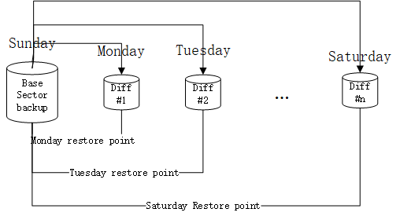
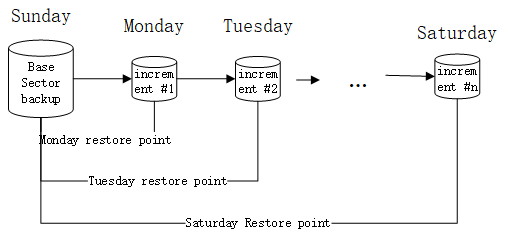

[toc]

# MySQL
## 数据库简介

> **数据库**：存放数据的仓库，这个仓库安装一定的数据结构对数据进行组织和存储，可以通过数据库提供的多种方法来管理其中的数据
> **数据库的种类**：关系型数据库；非关系型数据库
> **生产环境常用数据库**：
>
> 1. 关系型数据库：Oracle Microsoft SQL Server MySQL/MariaDB等；
> 2. 非关系型数据库：MongoDB,Memcached Redis
>
> **关系型数据库**:
> 关系型数据库模型是把复杂的数据结构归结为简单的二元关系(即二维表格形式)。在关系型数据库中，对数据的操作几乎全部建立在一个或多个关系表格上，通过这些关联的表格、分类、合并、连接或选取等运算来实现数据的管理。
>
> **非关系型数据库：**
>
> - NoSQL数据库不是否定关系型数据库，而是作为关系数据库的一个重要补充；
> - NoSQL数据库为了灵活及高性能、高并发而生，忽略影响高性能、高并发的功能；
> - 在NoSQL数据库的领域，当今最典型的产品为Redis(持久化缓存)、MongoDB、Memcached(纯内存)等；
> - NoSQL数据库没哟标准的查询语言(SQL),通常使用REST式的数据接口或者查询API
>
> **非关系型数据库种类**
>
> 1. 键值(Key-Value)存储数据库；
>     优点：通过key来添加、查询或者删除数据库，因为使用key主键访问，所以会获得很高的性能及扩展性；Key-Value模型对于IT系统来说的优势在于简单、易部署、高并发；
> 典型产品：Memcached/Redis/MemcachedB/Berke ley DB
> 2. 列存储(Column-Oriented)数据库
>     列存储数据库将数据存储在列族(Column Fmily)中，一个列族存储经常被一起查询的相关数据。例如，有一个Person类，通常会一起查询他们的姓名和年龄而不是薪资。这种情况下，姓名和年龄被放入一个列族中，而薪资则在另一个列族中。这部分数据库通常用来应对分布式存储的海量数据。键依然存在，但是它们的特点是指向了多个列。这些列有列家族来安排的。
>     典型产品：Cassandra,HBase
> 3. 面向文档(Document-Oriented)的数据库
>     该类型的数据模型是版本化的文档，半结构化的文档以特定的格式存储，比如JSON，文档数据库可以看作是键值数据库的升级版，允许之间嵌套键值，而且文档数据库比键值数据库的查询效率更高。
>     典型产品：MongDB/CouchDB
> 4. 图形(Graph)数据库
>     图形数据库允许我们将数据以图的方式存储。实体会被作为顶点，而实体之间的关系则会作为边。
>     图形结构数据库同其他行列以及刚性结构的SQL数据库不同，它是使用灵活的图形模型，并且能够扩展到多个服务器上。NoSQL数据库没有标准的查询语言(SQL),因此进行数据查询需要定制数据模型
>     典型产品：Neo4J/InfoGr id
>
> **常用非关系数据库管理系统**：
>
> 1. Memcached
>
>    Memcached:开源的、高性能的、具有分布式内存对象的缓存系统。通过它可以减轻数据库的负载，加速动态的web应用。
>    注意：Memcachi是这个项目的名称，而Memcached是服务端的主程序名
>    缓存一般用来保存一些经常被存取的对象或数据，通过缓存来存取对象或者数据要比磁盘存取快很多，前者是内存，后者是磁盘。Memcache是一种纯内存缓存系统，把经常存取的对象或数据缓存在Memcached的内存中。
>    官方网站：http://Memcached.org
>    Memcached为纯内存缓存软件，一旦重启所有数据都会丢失。MemcacheDB为新浪网基于Memcached开发的一个项目，通过为Memcached增加Berkeley DB的持久化存储机制和异步主辅复制机制，使Memcached具备了事务恢复能力，持久化数据存储能力和分布式复制能力，MemcacheDB非常适合需要超高性能读写速度、持久化保存的场景，但是最近几年逐渐被其他持久化产品替代例如:Redis
>
> 2. Redis(Key-Value)
>
>    Redis:Key-value型存储系统，支持的value类型相对更多，操作更丰富，且操作都是原子性的。和Memcached一样，为了保证效率，Redis的数据都是缓存在内存中，区别是Redis会周期性的把更新的数据写入磁盘或者把修改操作写入追加的记录文件，并且在此基础上实现了Master-Slave(主从)同步。
>    官网：http://www.Redis.io/documentation
>    特点：
>    1. 支持内存缓存，这个功能相当于Memcached;
>    2. 支持持久化存储，这个功能相当于MemcacheDB,Ttserver;
>    3. 数据类型更丰富，比其他key-value库功能更强；
>    4. 支持主从集群，分布式；
>    5. 支持队列等特殊功能
>
> 3. MongoDB(Document-Web)

## 安装MySQL数据库

> 可参考MySQL[官方说明文档](https://dev.mysql.com/doc/refman/5.7/en/)进行安装，安装方式不限于yum安装。

> 1. **默认yum存储库安装**
>
> ```
> [root@localhost ~]#  yum -y install wget
> [root@localhost ~]# wget https://repo.mysql.com/mysql57-community-release-el7-11.noarch.rpm
> [root@localhost ~]# yum -y localinstall mysql57-community-release-el7-11.noarch.rpm  //安装官方yum源
> [root@localhost ~]# yum repolist  //查看yum仓库
> 
> ```
>
> 2. **选择指定发行版本安装**
> 使用MySQL Yum存储库时，默认情况下会选择要安装的最新GA版本MySQL.默认启用最新GA系列(当前为MySQL8.0)的子存储库，而所有其他系列(如：MySQL5.7系列)的子存储库均被禁用。
>
> ```
> ### 1. 列出所有版本
> [root@joy ~]#  yum repolist all | grep mysql
> 若发现最新版本8.0是enabled的，5.7版本是disabled的，需要安装5.7版本时，需把8.0版本进行禁用，然后再启用5.7版本的。
> 
> ### 2. 安装yum配置工具
> [root@joy ~]# yum -y install yum-utils
> 
> ### 3. 禁用8.0版本
> [root@joy ~]# yum-config-manager --disable mysql80-cummunity
> 
> ### 4. 启用5.7版本
> [root@joy ~]# yum-config-manager --enable mysql57-community
> 
> ### 5.检查启用版本：注意：进行安装时请确保只有一个版本启用，否则会显示版本冲突
> [root@joy ~]# yum repolist enabled | grep mysql
> 
> 
> 
> ### 扩展
> 1. 修改主机名
> [root@localhost ~]# hostnamectl --static set-hostname mysql //修改主机名为mysql
> [root@localhost ~]# exit  //退出重新登录
> root@mysql ~]# cat /etc/redhat-release  //查看当前系统版本信息
> CentOS Linux release 7.8.2003 (Core)
> [root@mysql ~]# uname -a  //查看内核信息
> Linux mysql 3.10.0-1127.el7.x86_64 #1 SMP Tue Mar 31 23:36:51 UTC 2020 x86_64 x86_64 x86_64 GNU/Linux
> 
> ```
>
> 3. **安装MySQL**
>
> ```
> [root@mysql ~]# yum -y install mysql-community-server mysql   	# 安装服务端，客户端
> [root@mysql ~]# systemctl start mysqld  	# 启动mysql服务
> [root@mysql ~]# systemctl enable mysqld 	# 设置mysql服务开机启动
> [root@mysql ~]# ls /var/lib/mysql  			# 查看mysql 安装
> [root@mysql ~]# grep 'password' /var/log/mysqld.log  	# 获取首次登陆密码
> 2020-10-26T03:57:04.590586Z 1 [Note] A temporary password is generated for root@localhost: 1>>AB!Ylb;nt
> [root@mysql ~]# mysql -uroot -p'1>>AB!Ylb;nt'  		# 登录mysql,首次登陆未修改密码前无法操作数据库
> mysql> alter user 'root'@'localhost' identified by 'Joy.123com'; #修改mysql数据库密码(密码必须符合复杂性要求，																	  包含字母大小写，数字，特殊符号，长度不少于8位)
> Query OK, 0 rows affected (0.00 sec)
> mysql> \q    # 退出 或者使用 exit 退出
> Bye
> [root@mysql ~]# mysql -uroot -p'Joy.123com'  # 使用新密码登录mysql
> 
> mysql> grant select,drop,insert on *.* to 'joy'@'localhost' identified by 'Joy.123com';  # 给用户授权
> Query OK, 0 rows affected, 1 warning (0.00 sec)
> mysql> select * from mysql.user; 		# 查看用户信息
> mysql> select user,host from mysql.user;  # 指定字段查看
> +---------------+-----------+
> | user          | host      |
> +---------------+-----------+
> | joy           | localhost |
> | mysql.session | localhost |
> | mysql.sys     | localhost |
> | root          | localhost |
> +---------------+-----------+
> 4 rows in set (0.00 sec)
> 
> mysql> flush privileges;  `# 刷新权限配置
> Query OK, 0 rows affected (0.00 sec)
> 
> mysql> show grants for 'joy'@'localhost';  	# 查看用户授予的权限
> +--------------------------------------------------------+
> | Grants for joy@localhost                               |
> +--------------------------------------------------------+
> | GRANT SELECT, INSERT, DROP ON *.* TO 'joy'@'localhost' |
> +--------------------------------------------------------+
> 1 row in set (0.00 sec)
> 
> 
> ```
>
> 4. **重启MySQL服务**
>
> ```
> [root@mysql ~]# systemctl restart mysqld
> ```
## MySQL的SQL语句解析

### 结构化查询语言SQL

> 结构化查询语言(Structured Query Language)简称SQL，是数据库的标准查询语言。可以通过DBMS对数据库进行定义数据，操纵数据，查询数据，数据控制等。
>
> 1. 数据定义语言(DDL)
> 2. 数据操纵语言(DML)
> 3. 事务控制语言(TCL)
> 4. 数据查询语言(DQL)
> 5. 数据控制语言(DCL)

#### 1. 数据定义语言(DDL)

> Data Definition Language
> 创建表 create
> 删除表 drop
> 修改表 alter
> 清空表 truncate ,彻底清空，无法找回

> ```
> mysql> show databases;		# 查看所有数据库
> mysql> create database db1 default character set utf8; 	# 创建数据库
> Query OK, 1 row affected (0.00 sec)	
> mysql> use db1   				# 选择数据库 db1
> mysql> show tables;				# 查看所有表
> mysql> drop database db1;		# 删除数据库
> 	
> mysql> create table t1(id int(3),name varchar(20)); 	# 创建表
> Query OK, 0 rows affected (0.00 sec)		
> mysql> desc t1;				# 查看表
> +-------+-------------+------+-----+---------+-------+
> | Field | Type        | Null | Key | Default | Extra |
> +-------+-------------+------+-----+---------+-------+
> | id    | int(3)      | YES  |     | NULL    |       |
> | name  | varchar(20) | YES  |     | NULL    |       |
> +-------+-------------+------+-----+---------+-------+
> 2 rows in set (0.01 sec)
> 
> mysql> insert into t1 values(1,'user1'); 		# 插入数据
> mysql> alter table t1 add(age int(3));			#添加表字段
> mysql> alter table t1 drop id;					# 删除表字段
> mysql> alter table t1 modify age varchar(2);	# 修改表字段类型格式
> mysql> alter table t1 change age plage int(3);	# 修改表字段名称：age --> plage
> mysql> alter table t1 rename per;			# 修改表名称：t1-->per
> mysql> truncate table t1;			# 清空表数据
> Query OK, 0 rows affected (0.00 sec)
> 
> mysql> drop table t1;		# 删除表
> Query OK, 0 rows affected (0.00 sec)
> 
> ```

#### 2. 数据操纵语言(DML)

> ```
> insert:向表中插入数据
> delete:删除表中数据；格式：delete from tablename [where 条件]
> update:修改表中的数据。格式:update tablename set colName=value[,colname2=value2] [where 条件]
> where:对表中的数据增加条件限定，起到过滤作用。
> 格式：where cloName 关系运算符 value [or | and 条件2]
> 关系运算符：>,>=,<,<=,=,!=或<>
> null值操作：比较null时，不能使用=或者！=或者<>，而是使用is或 is not ,在select字句中，使用关系运算符
> 
> delete &  truncate  清除数据区别
> 1）delete 之后，插入数据从上一次主键自增1开始，truncate 则是从1开始；
> 2）delete删除，是一行一行的删除；truncate:全选删除，truncate删除的速度是高于delete的
> ```
>
> - **范例**
>
> ```
> ### 1. 创建表
> mysql> create table tmp1(id int,name varchar(20),birth date,address varchar(50));
> Query OK, 0 rows affected (0.01 sec)
> ### 2. 插入数据
> mysql> insert into tmp1 values(1,'user1',null,'shanghai');
> mysql> insert into tmp1(id,name,address) values(2,'user2','beijing');
> 
> ### 3. 删除数据
> mysql> delete from tmp1; 		# 删除表中所有数据
> mysql> delete from tmp1 where id=1;		# 删除tmp1表中id=1的数据
> 
> ### 4. 修改表数据
> mysql> update tmp1 set name='joy1'  # 更新所有名称为joy1
> mysql> update tmp1 set name='joy1' where id =2;  # 修改id=2的name为joy1
> mysql> update tmp1 set name='joy1',address='china' where id=2; 	# 修改id=2的name=joy1,address=china
> ```

#### 3. 事务控制语言(TCL)

> 事务控制语言(Transaction Control Language):有时可能需要使用DML进行批量数据的删除，增加，修改。如：在一个员工系统中，想删除一个人的信息，除了删除这个人的基本信息外，还应该删除与此人有关的其他信息，如邮箱，地址等等。那么从开始执行到结束，就会构成一个事务。对于事务，要保证事务的完整性，要么成功，要么撤回。
>
> **事务要符合四个条件(ACID):**
>
> 1. 原子性(Atomicity)：事务要么成功，要么撤回。不可切割性；
> 2. 一致性(Consistency):事务开始前和结束后，要保证数据的一致性。如转账前账号A和账号B的钱的总数为10000，转账后账号A和账号B的钱的总数应该还是10000；
> 3. 隔离性(Isolation):当涉及到多用户操作同一张表时，数据库会为每一个用户开启一个事务。那么当其中一个事务正在进行时，其他事务应该处于等待状态。保证事务之间不会受影响。
> 4. 持久性(Durability):当一个事务被提交后，我们要保证数据库里的数据时永久改变的。即是数据库奔溃了，我们也要保证事务的完整性。
>
> commit 提交
> rollback 撤回，回滚
> savepoint 保存点
> 只有DML操作会触发一个事务。存储引擎：就是指表类型。当存储引擎为innodb时，才支持事务。默认的存储引擎为Myisam，不支持事务。
>
> **事务的验证：**
>
> 1. start transaction(交易)；
> 2. savepoint 保存点名称；
> 3. DML；
> 4. commit/rollback;

#### 4. 数据查询语言(DQL)

> Data Query Language
>
> ```
> 1. select 基本查询语句
> 格式：select字句 from字句 		select colName[,colaName...] from tableName;
> 
> 2. 给列起别名
> 格式：select colName1 as '别名'[,colName2 as '别名' ......] from tableName;
> 
> 3. where 字句
> 作用：在增删改查时，起到条件限制的作用；
> 1) 多条件写法：in | not in(集合元素，使用逗号隔开)；注意同一个字段有多个值的情况下使用。in相当于 or，non in 相当于 and;
> 2) all | any与集合连用，此时集合中的元素不能是固定的必须是从表中查询到的数据；
> 3) 范围查询：colName between val1 and val2;查询指定列名下的val1到val2范围中的数据，between...and 取值范围是闭区间；
> 4) 模糊查询：like
>    通配符：%表示0或者0个以上字符；_ 表示匹配一个字符
>    格式：colName like value;
>    
> 4. mysql 查询支持四则运算，但一般不建议使用四则运算进行查询，因为会对服务器造成额为的负担：
>   mysql> select name,sal*10 from user;
> 
> 5. 查询时使用‘Name Is Null’作为条件
> mysql> select * from user where name is null;  //查询name字段为null数据
> 
> ```
>
> - **示例**
>
> ```
> ### 1. 创建表
> mysql> create table user(id int(5),name varchar(10),job varchar(9),mgr int(4),hiredate DATE,sal int(7),comm int(7),deptid
> int(2));
> ### 2. 插入数据
> insert into user (id,name,job,mgr,hiredate,sal,comm,deptid) values
> (1,'joy1','CLERK',2342,'1990-12-21',500,NULL,20),
> (2,'joy2','CLERK',133,'1990-12-21',500,NULL,20),
> (3,'joy3','BLAKE',1232,'1993-12-21',900,NULL,20),
> (4,'joy4','SCOTT',4323,'1995-12-21',300,NULL,30),
> (5,'joy5','KING',3333,'2010-12-21',900,NULL,20),
> (6,'joy6','CLERK',2342,'2017-12-21',600,NULL,10),
> (7,'joy7','CLERK',2342,'2019-12-21',100,NULL,20);
> 
> ### 3. 查询
> #### 基本查询
> mysql> select name,job,sal,deptid from user;
> #### 给列起别名
> mysql> select name as sname,job as myJob,sal as mySal from user;
> +-------+-------+-------+
> | sname | myJob | mySal |
> +-------+-------+-------+
> | joy1  | CLERK |   500 |
> | joy2  | CLERK |   500 |
> | joy3  | BLAKE |   900 |
> | joy4  | SCOTT |   300 |
> | joy5  | KING  |   900 |
> | joy6  | CLERK |   600 |
> | joy7  | CLERK |   100 |
> +-------+-------+-------+
> #### 查询员工表中部门号为10 和20的员工的编号，姓名，职位，工资
> mysql> select id,name,job,sal from user where deptid=10 or deptid=20;
> 
> #### 查询员工表中部门不是10 和20的员工所有信息
> mysql> select * from user where deptid<>10 and deptid<>20;
> 
> #### 使用in,not in修改上面查询
> mysql> select id,name,job,sal from user where deptid in(10,20);
> mysql> select * from user where deptid not in(10,20);
> 
> ### all 和 any的使用
> #### 查询工资高于joy1,joy2,joy3三个人的员工信息
> mysql> select * from user where sal > all(select sal from user where name in('joy1','joy2','joy3'));
> #### 查询工资高于joy1,joy2,joy3三人任一一个人的员工信息
> mysql> select * from user where sal > any(select sal from user where name in('joy1','joy2','joy3'));
> 
> ### 范围查询
> #### 查询工资高于等于100并且小于等于400的所有员工信息
> mysql> select * from user where sal between 100 and 400;
> #### 查询工资小于100 并且 高于400的所有员工信息
> mysql> select * from user where sal not between 100 and 400;
> 
> ### 模糊查询
> #### 查询姓名中包含a 和 j的所有员工信息
> mysql> select * from user where name like '%a%' and name like '%j%';
> mysql> select * from user where name like '%a%j%' or name like '%j%a%';
> 
> ```
>
> - **排序查询**
>
> ```
> 当在查询表中数据时，记录比较多，有可能要进行排序，此时可以使用 order by字句
> 语法：
> select ... from tableName [where 字句][order by 子句]
> 注意：可以通过一个或多个字段排序
> 格式：
> order by colName [ASC | DESC][,colName1......[ASC | DESC]];
> 排序规则：ASC:升序；DESC:降序，默认是升序排序
> 
> mysql> select * from user order by sal DESC;
> 
> ```
>
> - **去重**:有的时候我们需要对重复的记录进行去重操作
>
> ```
> mysql> select distinct name from user;
> 
> ```
>
> - **分组查询**
>
> ```
> 分组查询与分组函数(聚合函数):查询表中的记录总数或者查询表中每个部门的总工资，平均工资，总人数。这种情况需要对表中的数据进行分组统计。需要group by 子句。
> 格式：select ... from name [where 条件] [group by Field1,Field2][order by 子句]
> 注意：在分组查询时，select子句中的字段，除了聚合函数外，只能写分组字段。
> 
> 聚合函数：
> 1）count(Field)统计指定字段的记录数；
> 2）sum(Field)统计指定字段的和；
> 3）avg(Field)统计指定字段的平均值；
> 4）max(Field)返回字段中的最大值；
> 5）min(Field)返回字段中的最小值；
> 聚合函数会忽略null值，因此有时候需要使用函数：ifnull(field,value) 如果field字段对应的值不是null,就使用field的值，如果是null，就使用value.
> 注意：多字段分组时(多表联合查询时不加任何条件)，最多的分组数目为
> Field1Field2[Field3.....]
> 
> ### 查询各部门员工的平均工资
> mysql> select deptid,avg(sal)as av from user group by deptid;
> 
> ### 分组查询添加条件having字句
> 在分组查询时，有的时候需要使用条件过滤，此时不能使用where子句，应该使用having子句
> 位置：位于group by 子句后
> 
> mysql> select deptid,avg(sal)as av from user group by deptid having deptid <>10;
> 
> 基本查询语句包含的子句有：select 子句，from 子句，where子句，group by 子句，having子句，order by子句
> 完整的查询语句：
> select .. from .. [where..][group by ..][having..][order by...]
> 执行顺序：from子句 -->where 子句 --> group by 子句 --> having子句 --> select子句 --> order by子句
> ```
>
> - **高级关联查询**
>   嵌套查询：先执行的子查询，子查询嵌入到的查询语句称之为父查询。
>   子查询返回的数据特点
>   1）可能是单行单列的数据；
>   2）可能是多行单列的数据；
>   3）可能是单行多列的数据；
>   4）可能是多行多列的数据。
>   子查询可以在where ，from,having,select子句中，在select子句中相当于外连接的另外一种写法
>
> ```
> ### 查询各部门中大于平均工资的员工
> select name,sal,a.deptid,b.av from user a,(select deptid,avg(ifnull(sal,0)) as av from user group by deptid) b
> where a.deptid=b.deptid and a.sal>b.av
> order by deptid ASC
> ```

#### 5. 数据控制语言(DCL)

> Data Control Language 数据控制语言，作用是用来创建用户，给用户授权，撤销权限，删除用户。
>
> ```
> ### 1. 创建用户：
> 格式：create user username@ip identified by newPwd;
> mysql> create user 'joy2'@'localhost' identified by 'Joy123.com';
> mysql> create user 'joy3'@'192.168.183.%' identified by 'Joy123.com'; //创建用户joy3可以访问183网段数据库
> 
> ### 2. 显示用户的权限
> 格式：show grants for username@ip
> mysql> show grants for joy2@localhost;
> 
> ### 3. 授权
> 格式：grant 权限1,权限2...... on 数据库名.* to username@ip
> DML权限：insert,delete,update
> DQL权限：select
> DDL权限：create,alter,drop
> 
> mysql> grant select,drop,insert on db1.* to 'joy2'@'192.168.183.140';
> mysql> flush privileges;  # 刷新权限信息
> 
> 
> ### 4. 撤销权限
> 格式：revoke 权限1,权限2... on 数据库名.* from username@ip
> mysql> revoke select on db1.* from 'joy3'@'192.168.183.%';
> 
> ### 5. 删除用户
> mysql> drop user joy@'localhost';
> 
> ```
>
> 

### MySQL操作实例

> - **创建表**
>
>   ```
>   ### 语法：
>   create table 表名(
>   	字段名  列类型  [可选的参数],  #记住加逗号
>   	字段名  列类型  [可选的参数],  #记住加逗号
>   	字段名  列类型  [可选的参数],  #最后一行不加逗号
>   )charset=utf8;  #以分号结束
>   
>   ### 列约束
>   auto_increment  :自增
>   primary key  :主键索引，加快查询速度，列的值不能重复
>   NOT NULL  标识该字段不能为空
>   DEFAULT   为该字段设置默认值
>   
>   mysql> create table t1(
>   num int auto_increment primary key,
>   name char(10),
>   job char(10),
>   age int,
>   salary int,
>   descrip char(128) not null default '')charset=utf8
>   
>   ### 添加字段
>   ALTER TABLE 表名
>   ADD 字段名  列类型 [可选参数],
>   ADD 字段名  列类型 [可选参数];
>   
>   范例：
>   mysql> alter table t1 add nme varchar(32) not null default '';
>   此时添加的列为表的最后一列，还可以将列添加到表的最前面
>   
>   ### 添加列到表的开头语法：
>   ALTER TABLE 表名
>   ADD 字段名  列类型 [可选参数] FIRST;
>   
>   mysql> alter table t1 add deptName varchar(32) not null default '' FIRST;
>   
>   ### 添加列到指定字段后
>   ALTER TABLE 表名
>   ADD 字段名  列类型 [可选参数] AFTER 字段名;
>   
>   mysql> alter table t1 add deptNo varchar(32) not null AFTER name;
>   
>   ### 删除字段
>   ALTER TABLE 表名  DROP 字段名
>   
>   ### 修改字段数据类型
>   ALTER TABLE 表名 MODIFY 字段名 数据类型  [完整性约束条件]
>   
>   mysql> alter table t1 modify noteName char(30) not null;
>   
>   
>   ### 修改字段名
>   ALTER TABLE 表名 CHANGE 旧字段名 新字段名  新数据类型 [完整性约束条件]
>   
>   mysql> alter table t1 change nme noteName varchar(20) not null default '';  //修改字段nme为noteName
>   
>   ### 复制表结构:只复制表的结构，不复制表数据
>   CREATE TABLE 表名 LIKE 要复制结构的表名
>   
>   mysql> create table t2 like t1;
>   ```

### 多表操作

- **概念**

> - **多表操作**：当在查询时，所需要的数据不在一张表中，可能在俩张或多张表中。此时需要同时操作这些表。即关联查询
> - **等值连接**：在做多张表查询时，这些表中应该存在着有关联的俩个字段。使用某一张表中的一条记录与另外一张表通过向关联的俩个字段进行匹配，组合成一条记录。
> - **笛卡尔积**：在做多张表查询时，使用某一张表中的每一条记录都与另外一张表的所有记录进行组合。比如A表有x条，B表有y条，最终组合为x*y；这个值就是笛卡尔积，通常没有意义。
> - **内连接**：只要使用join on,就是内连接。查询效果与等值连接一样。
> 用法：
> ```
> 表A  [inner] join 表B  on 关联条件
> ```
> - **外连接**：在做多张表查询时，所需要的的数据，除了满足关联条件的数据外，还有不满足关联条件的数据。此时需要使用外连接。
>   1. 驱动表(主表)：除了显示满足条件的数据，还需要显示不满足条件的数据的表；
>   2. 从表(副表):只显示满足关联条件的数据的表；
>   3. 外连接分为三种：
>      左外连接：表A left[outer] join 表B on关联条件，表A是驱动表，表B时从表
>      右外连接：表A right [outer] join 表B on 关联条件，表B是驱动表，表A是从表；
>      全外连接:  表A full[outer] join 表B  on  关联条件，俩张表的数据不管满不满足条件，都做显示
> - **自连接**：在多张表进行关联查询时，这些表的表名是同一个。
> - **外键**：占用空间少，方便修改数据
> |        | 主键                                       | 外键                                                 | 索引                               |
> | ------ | ------------------------------------------ | ---------------------------------------------------- | ---------------------------------- |
> | 定义： | 唯一标识一条记录，不能有重复的，不允许为空 | 表的外键是另一表的主键, 外键可以有重复的, 可以是空值 | 该字段没有重复值，但可以有一个空值 |
> | 作用： | 用来保证数据完整性                         | 用来和其他表建立联系用的                             | 是提高查询排序的速度               |
> | 个数： | 主键只能有一个                             | 一个表可以有多个外键                                 | 一个表可以有多个惟一索引           |
>
> ```
> 外键约束：用于与另一张表的关联。是能确定另一张表记录的字段，用于保持数据的一致性。
> ### 一对多:通过外键约束实现
> 语法：
> constraint 外键名 foreign key (被约束的字段) references 约束的表(约束的字段)
> 
> 【示例】
> // 创建部门表
> mysql> create table dep(
> id int auto_increment primary key,
> name varchar(32) not null default ''
> )charset=utf8;
> 
> mysql> insert into dep(name) values ('研发部'),('行政部'),('运维部'),('市场部');
> 
> //创建用户表
> create table userinfo(
> id int auto_increment primary key,
> name varchar(32) not null default '',
> depart_id int not null default 1,
> constraint fk_user_depart foreign key (depart_id) references dep(id)
> )charset=utf8;
> 
> mysql> insert into userinfo(name,depart_id) values('joy1',1),('joy2',2),('joy3',3),('joy4',4);
> //当插入不存在的外键记录时，报错
> mysql> insert into userinfo(name,depart_id) values('joy1',5); 
> ERROR 1452 (23000): Cannot add or update a child row: a foreign key constraint fails (`db1`.`userinfo`, CONSTRAINT `fk_user_depart` FOREIGN KEY (`depart_id`) REFERENCES `dep` (`id`))
> 
> ########################################################################################################
> 
> ### 多对多:通过创建关联表实现
> 【示例】
> 1. 创建男生表
> mysql> create table boy( 
> id int auto_increment primary key, 
> bname varchar(32) not null default '' 
> )charset=utf8;
> 
> mysql> insert into boy (bname) values('boy1'),('boy2');
> 2. 创建女生表
> mysql> create table girl( 
> id int auto_increment primary key, 
> gname varchar(32) not null default '' 
> )charset=utf8;
> 
> mysql> insert into girl (gname) values('girl1'),('girl2');
> 
> 3. 创建关联表
> create table b2g(
> id int auto_increment primary key,
> bid int not null default 1,
> gid int not null default 0,
> constraint fk_b2g_boy foreign key (bid) references boy(id),
> constraint fk_b2g_girl foreign key(gid) references girl(id)
> )charset utf8;
> 
> mysql> insert into b2g(bid,gid) values(1,1),(1,2),(2,1);
> 
> ### left join 查询男，女信息
> select * from boy left join b2g on boy.id=b2g.bid left join girl on girl.id=b2g.gid;
> ```

### MySQL数据库导入导出

#### 数据导出方式

```
语法：myslqdump -h IP -u 用户名 -p -d 数据库名 > 导出文件名
myslqdump:命令导出数据时，数据量比较大时，花费的时间也会增加。
### 导出所有数据
[root@mysql ~]# mysqldump -uroot -pJoy.123com --all-databases > /tmp/mysql.sql
mysqldump: [Warning] Using a password on the command line interface can be insecure.

### 导出数据库
[root@mysql ~]# mysqldump -uroot -pJoy.123com --databases db1 > /tmp/db1.sql //导出数据库db1，以及其下所有表和表数据。包含数据库创建语句，与数据库切换语句，表删除与创建，表数据插入语句。

### 导出表
[root@mysql ~]# mysqldump -uroot -pJoy.123com db1 userinfo > /tmp/db1_userinfo.sql //导出数据库指定表数据
[root@mysql ~]# mysqldump -uroot -pJoy.123com  db1 > /tmp/db2.sql  //导出数据库db1下所有表和表数据,不包含数据库创建语句与数据库切换语句，只有表创建和表数据插入语句

[root@mysql ~]# mysqldump -uroot -pJoy.123com -d db1 > /tmp/db1.sql  //导出数据库db1中所有表结构

### 参数说明
--all-dtabases, -A  导出全部数据库
--all-tablespaces,-Y  导出全部表空间
--no-tablespace ,-y  不导出任何表空间信息
--add-drop-database  每个数据库创建之前添加drop语句库语句
[root@mysql ~]# mysqldump -uroot -pJoy.123com --all-databases --add-drop-database > mysql.sql

--add-drop-table  每个数据表创建之前添加drop数据表语句。默认为打开状态，使用--skip-add-drop-table取消选项
--add-locks  在每个表导出之前增加LOCK TABLES并且之后UNLOCK TABLE.默认为打开状态，使用--skip-add-locks取消选项
--allow-keywords  允许创建时关键词的列名字。这由表名前缀与每个列名做列
```

#### 数据导入

```
### 导入表
mysql> drop table userinfo;  //删除表userinfo
mysql> source /tmp/db1_userinfo.sql;  //导入userinfo表的sql文件
mysql> show tables;  //查看表和数据是否正常导入

### 导入数据库
mysql> drop database db1;
[root@mysql ~]# mysql -uroot -p'Joy.123com' < /tmp/db1.sql  //导入 db1数据库文件

```

## MySQL数据类型

> - **MySQL数据类型**：
>   - 整数类型：BIT,BOOL,TINYINT,SMALLINT,MEDIUMINT,INT,BIGINT
>   - 浮点类型：FLOAT,DOUBLE,DECIMAL
>   - 字符串类型：CHAR,VARCHAR,TINYTEXT,TEXT,MEDIUMTEXT,LONGTEXT,TINYBLOB,BLOB,MEDIUMBLOB,LONGBLOB
>   - 日期类型：Date,DateTime,TimeStamp,Time,Year
>   - 其他数据类型：BINARY,VARBINARY,ENUM,SET,Geometry,Point,MultiPoint,LineString,MultiLineString,Polygon,GeometryCollection等

### 整型

> | Mysql数据类型 | 字节位 | 比特位 | 最小值               | 最大值              |
> | ------------- | ------ | ------ | -------------------- | ------------------- |
> | tinyint(n)    | 1      | 8      | -128                 | 127                 |
> | smallint(n)   | 2      | 16     | -32768               | 32767               |
> | mediumint(n)  | 3      | 24     | -8388608             | 8388607             |
> | int(n)        | 4      | 32     | -2147483648          | 2147483647          |
> | bigint(n)     | 8      | 64     | -9223372036854775808 | 9223372036854775808 |
>
> - 当整数值超过int数据类型支持的范围时，就可以采用bigint;
> - 在MySQL中，int数据类型是主要的整数数据类型
> - 只有当参数表达式是bigint数据类型时，函数才返回bigint。MySQL不会自动将其他整数数据类型(tinyint,smallint和int)提升为bigint
> - int(n)里的n是表示select查询结果集中的显示宽度，并不影响实际的取值范围，没有影响到显示的宽度
>
> **tinyint范例**：
>
> ```
> mysql> create table t1(
>     -> num tinyint)engine=innodb charset=utf8;
> engine=innodb  定义数据库引擎
> ### 当插入的数据超过字段定义的数据类型的范围时，会报错
> mysql> insert into t1 (num) values(200);
> ERROR 1264 (22003): Out of range value for column 'num' at row 1
> 
> ### 在整型后加上unsigned，表示无符号整型。
> 把num字段定义改为"num tinyint unsigned"插入的数据超过字段数据类型范围时就不会报错了，但是插入-100又报错了，因为无符号整型无法表示负数的
> mysql> alter table t1 modify num tinyint unsigned;
> 
> mysql> insert into t1 (num) values(200);
> Query OK, 1 row affected (0.00 sec)
> mysql> insert into t1 (num) values(-1);
> ERROR 1264 (22003): Out of range value for column 'num' at row 1
> ```
>
> - **int**int(n)需要注意：
>   1. 无论N等于多少，int永远占4个字节；
>   2. N表示的是显示的宽度，不足的用0补足，超过的无视长度而直接显示整个数字，但要整型设置了unsigned zerofill才有效。(unsigned:无视符号 zerofill：0填补)
>
> ```
> 1. 创建表与插入数据
> mysql> drop table if exists t1;
> mysql> create table test_int_width(
>      a int(5),
>      b int(5) unsigned,
>      c int(5) unsigned zerofill,
>      d int(8) unsigned zerofill
>      )engine=innodb charset=utf8;
>      
> mysql> insert into test_int_width values(1,1,1,1111111111);
> 
> 2. 查看显示
> mysql> select * from test_int_width;
> +------+------+-------+------------+
> | a    | b    | c     | d          |
> +------+------+-------+------------+
> |    1 |    1 | 00001 | 1111111111 |
> +------+------+-------+------------+
> 1 row in set (0.00 sec)
> 
> ```

### 浮点型

> mysql常用的浮点型有俩种，分别为float,double
>
> | 数据类型    | 字节数 | 含义                                           |
> | ----------- | ------ | ---------------------------------------------- |
> | float(m,d)  | 4      | 单精度浮点型8位精度(4字节),m 总位数，d小数位   |
> | double(m,d) | 8      | 双精度浮点型，16位精度(8字节)m 总位数，d小数位 |
>
> 设一个字段定义为float(6,3);
> 如果插入一个数为123.45578实际数据库存的是123.457，数据的数字总位数以实际为准，即6位。整数部分最大是3位
> 如果插入数12.123456，存储的是12.1234，如果插入12.12，存储的是12.1200
> double保存保存数据的规则与float相同
>
> **float(M,D),double(M,D)规则**：
>
> 1. D表示浮点型数据小数点之后的精度，假如超过D位则四舍五入，即1.233四舍五入为1.23；1.237四舍五入为1.24
> 2. M表示浮点型数据的总位数，整数位数=M-D，当整数位数超过设定的位数时，无法插入；
> 3. 当不指定M,D: float 默认只保存6位（除去小数点），如果超过6位，则四舍五入，所以float存储的数据是不精确的，只是近似值；
>
> - **示例**
>
> ```
> mysql> create table t1(num float(5,2))engine=innodb charset=utf8;
> mysql> insert into t1 (num) values(123.45678),(12.123456),(12.12);
> mysql> select * from t1;
> +--------+
> | num    |
> +--------+
> | 123.46 |
> |  12.12 |
> |  12.12 |
> +--------+
> 3 rows in set (0.00 sec)
> 
> ```

### 定点数

> -  浮点型在数据库中存放的是近似值，而定点类型在数据库中存放的是精确值。
> - decimal(m,d),参数m<65，d<30；m为总位数，d为小数位数
> - 定点型的数据类型decimal
>
> - 类型decimal，如果输入的数据超过了定义的最大值，那么则溢出，数据库里面存储的是定义的最大值，例如，decimal(5,2)输入123123.45,实际存储为999.99；
> - decimal，如果只是小数部分超过定义的长度，那么则截断（非四舍五入）指定长度，例如，decimal(10,2)输入12345678.123456，实际存储为12345678.12；
> - decimal，整数部分和小数部分是分开存储的，每9个数字占用4个字节，在mysql内部使用的二进制存储，基本没有长度的限制；
> - decimal无论写入数据中的数据是多少，都不会存在精度丢失问题；
>   decimal类型常见于银行系统、互联网金融系统等对小数点后的数字比较敏感的系统中；
>   float/double在db中存储的是近似值，而decimal则是以字符串形式进行保存的；
>   decimal(M,D)的规则和float/double相同，decimal在不指定M,D时默认为(10,0)

### 字符串

> | 数据类型   | 含义                           |
> | ---------- | ------------------------------ |
> | char(m)    | 固定长度，最多255个字符        |
> | varchar(m) | 可变长度，最多65535个字符      |
> | tinytext   | 可变长度，最多255个字符        |
> | text       | 可变长度，最多65535个字符      |
> | mediumtext | 可变长度，最多$2^{24}-1$个字符 |
> | longtext   | 可变长度，最多$2^{32}-1$个字符 |
>
> - char表示定长字符串，长度是固定的；如果插入数据的长度小于char固定长度时，则用空格填充；因为长度固定，所以存取速度要比varchar快很多，甚至能快50%，但正因为长度固定，所以会占据多余的空间，是空间换时间的做法；对于char来说，最多能存放的字符个数为255，和编码无关
> - varchar表示可变长字符串，长度时可变的；插入的数据时多长，就按照多长来存储；varchar在存取方面与char相反，它存取慢，因为长度不固定，但正因为如此，不占据多余的空间，是时间换空间的做法；对于varchar来说，最多能存放的字符个数为65532
>   结合性能角度,char更快；节省磁盘空间角度，varchar更小，具体情况还需具体需求来设计数据库。
>   MySQL处理char类型数据时，会将结尾的所有空格处理掉，而varchar不会
> - char(n)若存入字符数小于n，则以空格补于其后，查询时再将空格去掉。所以char类型存储的字符串末尾不能有空格，varchar不限于此；
> - char(n)固定长度，不管是存入几个字符，都将占用n个字节；varchar是存入的实际字符数+1(n<=255)或2个字节(n>255),所以varchar(n),存入n-1个字符，将占用n个字节
> - char类型的字符串检索速度比varchar类型快
>
> **示例**：
>
> ```
> mysql> create table t2(char_val char(5),varchar_val varchar(5))engine=innodb charset=utf8;
> mysql> insert into t2 values('a','a'),(' a',' a'),('a ','a '),(' a ',' a ');
> //使用length函数，查看插入的字符长度
> mysql> select length(char_val),length(varchar_val) from t2;
> +------------------+---------------------+
> | length(char_val) | length(varchar_val) |
> +------------------+---------------------+
> |                1 |                   1 |
> |                2 |                   2 |
> |                1 |                   2 |
> |                2 |                   3 |
> +------------------+---------------------+
> 4 rows in set (0.00 sec)
> 
> ### 不同编码下的varchar(n),n最大值不同
> mysql> create table t3(varchar_val varchar(100000))engine=innodb charset=utf8;  //在utf8编码下，报错提示n最大值为21848；实际为21843
> ERROR 1074 (42000): Column length too big for column 'varchar_val' (max = 21845); use BLOB or TEXT instead
> mysql> create table t3(varchar_val varchar(100000))engine=innodb charset=gbk;
> ERROR 1074 (42000): Column length too big for column 'varchar_val' (max = 32767); use BLOB or TEXT instead
> 
> 不同编码格式下，varchar(n)中n的最大值不同，原因：
> 1）MySQL要求一个行的定义长度不能超过65535即64k；
> 2）对于为指定的varchar字段not null的表，会有一个字节专门表示该字段是否为null;
> 3) varchar(n),当 0<=n<=255时会专门有一个字节记录varchar型字符串长度，当n>255时，会专门有俩个字节记录varchar型字符串的长度，把这一点和上一点结合，那么65535个字节实际可用的为65535-3=65532个字节
> 4）所有英文无论其编码方式，都占用1个字节，但对于gbk编码，一个汉字占2个字节，因此最大n=65535/2=32766;对于utf8,一个汉字占3个字节，因此最大n=65532/2=21844
> utf8mb4编码方式，1个字符最大可能占4个字节，那么varchar(n),n最大为65532/4=16383
> 5) varchar(n) n>255时转为tinytext; n>500时转为text;n>20000时转为mediumtext
> ```
>
> - **varchar和text**
>   - varchar可指定n,text不能指定，内部存储varchar是存入的实际字符数+1个字节(n<=255)或2个字节(n>255),text是实际字符数+2个字节；text可以指定text(n),但是n无论等于多少，都没有影响；
>   - varchar可直接创建索引，text创建索引要指定前多少个字符。varchar查询速度快于text，在都创建索引的情况下，text的索引似乎不起作用；
>   - MySQL单行最大数据量为64k，当varchar(n)的n大于某些数值时，varchar会自动转为text；
>   - 过大的内容varchar 和 text没有区别；
>   - 单行64k即65535字节的空间，varchar只能用65533个字节，但是text可以使用65535个字节；
>   - text不允许有默认值，varchar允许有默认值；
>   - varchar和text俩种数据类型，使用建议是能用varchar就用varchar而不用text,因为varchar存储效率高；当字符长度大于varchar长度限制，可以使用mediumtext(16M)或者longtext(4G)
>
> - **二进制数据(Blob)**
>   - blob和text存储方式不同，text以文本方式存储，英文存储区分大小写，而blob是以二进制方式存储，不区分大小写；
>   - blob存储的数据只能整体读出；
>   - text可以指定字符集，blob不用指定字符集；
>   - blob是用于存储例如图片、音视频这种文件的二进制数据的

### 日期时间类型

> | 数据类型  | 字节数 | 格式                | 备注                        |
> | --------- | ------ | ------------------- | --------------------------- |
> | date      | 3      | yyyy-MM-dd          | 存储日期值                  |
> | time      | 3      | HH:mm:ss            | 存储时间值                  |
> | year      | 1      | yyyy                | 存储年                      |
> | datetime  | 8      | yyyy-MM-dd HH:mm:ss | 存储日期+时间               |
> | timestamp | 4      | yyyy-MM-dd HH:mm:ss | 存储日期+时间，可作为时间戳 |
>
> - datetime占用8个字节，timestamp占4个字节；
> - 由于大小区别，datetime与timestamp能存储的时间范围不同，datetime存储范围为1000-01-01 00:00:00——9999-12-31 23:59:59；timestamp存储的时间范围为19700101080001——20380119111407
> - datetime默认值为空，当插入null时，该列的值就是null；timestamp默认值不为空，当插入的值为null时，mysql会取当前时间；
> - datetime存储的时间与时区无关，timestamp存储的时间及显示的时间都依赖于当前时区；
> - 在实际工作中，一张表往往会有俩个默认字段，一个记录创建时间而另一个记录最新一次的更新时间，这种时候可以使用timestamp类型实现。
>   
> - **示例**
>
> ```
> mysql> create table t1(date_val date,time_val time,year_val year,datetime_val datetime,timestamp_val timestamp);
> Query OK, 0 rows affected (0.00 sec)
> 
> mysql> insert into t1 values(now(),now(),now(),now(),now()); //插入当前时间数据
> Query OK, 1 row affected, 1 warning (0.00 sec)
> 
> mysql> select * from t1;
> +------------+----------+----------+---------------------+---------------------+
> | date_val   | time_val | year_val | datetime_val        | timestamp_val       |
> +------------+----------+----------+---------------------+---------------------+
> | 2020-10-31 | 22:17:02 |     2020 | 2020-10-31 22:17:02 | 2020-10-31 22:17:02 |
> +------------+----------+----------+---------------------+---------------------+
> 1 row in set (0.00 sec)
> 
> ```

### 枚举

> 枚举用于列出所有选项
>
> - **示例**
>
> ```
> ### 创建枚举字段表
> mysql> create table t2(id int auto_increment primary key,gender enum('male','female'))charset utf8;
> Query OK, 0 rows affected (0.01 sec)
> 
> mysql> insert into t2(gender) values('male'),('female');
> Query OK, 2 rows affected (0.00 sec)
> Records: 2  Duplicates: 0  Warnings: 0
> ### 当插入值不是枚举字段定义的选项，会报错
> mysql> insert into t2(gender) values('alide');
> ERROR 1265 (01000): Data truncated for column 'gender' at row 1
> 
> ```

### 数据类型的选择

**MySQL数据类型使用建议**

> - 在指定数据类型的时候一般采用从小原则，比如能用TINYINT的最好就不用INT,能用FLOAT类型的就不用DOUBLE类型，这样会对MYSQL在运行效率上提高很大，尤其是大数据量测试条件下；
> - 不需要把数据表设计的太过复杂，功能模块上区分或许对于后期的维护更为方便，慎重出现大杂烩数据表；
> - 数据库的最后设计结果一定是效率和可扩展性的折中，偏向任何一方都是欠妥的。

**MySQL选择数据类型的基本原则**

> - 根据选定的存储引擎，确定如何选择合适的数据类型；
> - MyISAM数据存储引擎和数据列：MyISAM数据表，最好使用固定长度的数据行存储，因此无论使用CHAR或VARCHAR都没有关系，俩者都是作为char类型处理的。
> - InnoDB存储引擎和数据列：建议使用VARCHAR类型。对于InnoDB数据表，内部的行存储格式没有区分固定长度和可变长度列(所有数据行都使用指向数据列值的头指针)，因此在本质上，使用固定长度的CHAR列不一定比使用可变长度VARCHAR列简单。因而，主要性能因素是数据行使用的存储总量。由于CHAR平均占用的空间多余VARCHAR，因此使用VARCHAR来最小化需要处理的数据行的存储总量和磁盘I/O比较好。

## MySQL数据类型约束

> 约束是一种限制，它同过对表的行或者列的数据做出限制，来确保表数据的完整性和唯一性。在mysql中一般有以下几种约束：
>
> | MySQL关键字        | 含义                     |
> | ------------------ | ------------------------ |
> | NULL               | 数据可包含NULL值         |
> | NOT NULL           | 数据不允许包含NULL值     |
> | DEFAULT            | 默认值                   |
> | PRIMARY KEY        | 主键                     |
> | AUTO_INCREMENT     | 自动递增，适用于整数类型 |
> | UNSIGNED           | 无符号                   |
> | CHARACTER SET name | 指定一个字符集           |

### 非空约束

> ```
> 注意：如果约束不生小可以先设置sql_mode
> mysql> set session sql_mode='STRICT_TRANS_TABLES';
> 
> ### 非空约束:限制数据库表中某个字段值是否可以为空，null：字段值可以为空，not null：字段值不可为空
> mysql> create table t1(id int,username varchar(20) not null);
> mysql> desc t1;
> +----------+-------------+------+-----+---------+-------+
> | Field    | Type        | Null | Key | Default | Extra |
> +----------+-------------+------+-----+---------+-------+
> | id       | int(11)     | YES  |     | NULL    |       |
> | username | varchar(20) | NO   |     | NULL    |       |
> +----------+-------------+------+-----+---------+-------+
> 2 rows in set (0.00 sec)
> 
> mysql> insert into t1 (id) values(2); //当插入数据，没有username时，插入报错
> ERROR 1364 (HY000): Field 'username' doesn't have a default value
> 
> ```

### 唯一约束

> ```
> ###  唯一约束：字段添加唯一约束后，该字段的值不能重复；也就是在一列中不能出现一样的值
> #### 添加唯一约束
> ALTER TABLE tbl_name ADD [CONSTRAINT[symbol]]
> UNIQUE [INDEX | KEY] [index_name] [index_type] (index_col_name)
> 
> #### 删除唯一约束
> ALTER TABLE tbl_name DROP {INDEX | KEY} index_name
> 
> #### 范例
> mysql> alter table t1 add unique(id);  //给字段id添加唯一约束
> mysql> desc t1;  //可以看到：UNI已经设置了
> +----------+-------------+------+-----+---------+-------+
> | Field    | Type        | Null | Key | Default | Extra |
> +----------+-------------+------+-----+---------+-------+
> | id       | int(11)     | YES  | UNI | NULL    |       |
> | username | varchar(20) | NO   |     | NULL    |       |
> +----------+-------------+------+-----+---------+-------+
> 2 rows in set (0.00 sec)
> 
> ```

### 主键约束

> ```
> ### 主键约束
> 1）主键保证记录的唯一性，主键自动为NOT NULL
> 2）每张数据表只能存在一个主键NOT NULL+UNIQUE KEY
> 3）一个UNIQUE KEY 又是一个NOT NULL的时候，那么它被当做PRIMARY KEY(主键)
> 4）当一张表里没有一个主键的时候，第一个出现的非空且为唯一的列被视为主键
> #### 添加主键约束
> ALTER TABLE tbl_name ADD [CONSTRAINT[sysbol]] 
> PRIMARY KEY [index_type] (index_col_name)
> 
> #### 删除主键约束
> ALTER TABLE tbl_name DROP PRIMARY KEY
> 
> #### 范例
> mysql> create table t1(id int primary key,name varchar(20),number int); //在创建表的时候直接添加主键约束
> Query OK, 0 rows affected (0.01 sec)
> mysql> desc t1;  // id的KEY=PRI
> +--------+-------------+------+-----+---------+-------+
> | Field  | Type        | Null | Key | Default | Extra |
> +--------+-------------+------+-----+---------+-------+
> | id     | int(11)     | NO   | PRI | NULL    |       |
> | name   | varchar(20) | YES  |     | NULL    |       |
> | number | int(11)     | YES  |     | NULL    |       |
> +--------+-------------+------+-----+---------+-------+
> 3 rows in set (0.00 sec)
> 
> ```

### 自增长

> ```
> ### 自增长
> 1）自增长自动编号，必须与主键组合使用。默认情况下，起始值为1，每次的增量为1.当插入记录时，如果为AUTO_CREMENT数据列明确指明了一个数值，则会出现俩种情况：
> a. 如果插入的值与已有的编号重复，则会出现错误信息，因为AUTO_INCREMENT数据列的值必须是唯一；
> b. 如果插入的值大于已编号的值，则会把该值插入到数据列中，并使在下一个编号将从这个新增值开始。也就是说可以跳过一些编号，如果自增序列的最大值被删除了，则在插入新记录时，该值被重用
> 
> #### 范例
> mysql> ALTER TABLE t1 CHANGE id id INT NOT NULL AUTO_INCREMENT; //给id字段添加NOT NULL 与 AUTO_INCREMENT约束
> Query OK, 0 rows affected (0.02 sec)
> Records: 0  Duplicates: 0  Warnings: 0
> 
> mysql> DESCRIBE t1;
> +--------+-------------+------+-----+---------+----------------+
> | Field  | Type        | Null | Key | Default | Extra          |
> +--------+-------------+------+-----+---------+----------------+
> | id     | int(11)     | NO   | PRI | NULL    | auto_increment |
> | name   | varchar(20) | YES  |     | NULL    |                |
> | number | int(11)     | YES  |     | NULL    |                |
> +--------+-------------+------+-----+---------+----------------+
> 3 rows in set (0.00 sec)
> 
> #### 删除自增
> mysql> alter table t1 change id id int not null;
> Query OK, 0 rows affected (0.02 sec)
> Records: 0  Duplicates: 0  Warnings: 0
> 
> mysql> desc t1;
> +--------+-------------+------+-----+---------+-------+
> | Field  | Type        | Null | Key | Default | Extra |
> +--------+-------------+------+-----+---------+-------+
> | id     | int(11)     | NO   | PRI | NULL    |       |
> | name   | varchar(20) | YES  |     | NULL    |       |
> | number | int(11)     | YES  |     | NULL    |       |
> +--------+-------------+------+-----+---------+-------+
> 3 rows in set (0.01 sec)
> 
> ```

### 默认约束

> ```
> ### 添加/删除默认约束
> ALTER TABLE tbl_name ALTER [COLUMN] col_name {SET DEFAULT literal | DROP DEFAULT}
> 
> ### 设置默认值
> mysql> alter table t1 alter name set default 'joy'; //设置name 字段默认值为joy
> Query OK, 0 rows affected (0.00 sec)
> Records: 0  Duplicates: 0  Warnings: 0
> 
> mysql> desc t1;
> +--------+-------------+------+-----+---------+-------+
> | Field  | Type        | Null | Key | Default | Extra |
> +--------+-------------+------+-----+---------+-------+
> | id     | int(11)     | NO   | PRI | NULL    |       |
> | name   | varchar(20) | YES  |     | joy     |       |
> | number | int(11)     | YES  |     | NULL    |       |
> +--------+-------------+------+-----+---------+-------+
> 3 rows in set (0.00 sec)
> mysql> insert into t1 (id,number) values(100,2);
> mysql> select * from t1; //name 没有插入值会默认其值为joy
> +-----+------+--------+
> | id  | name | number |
> +-----+------+--------+
> | 100 | joy  |      2 |
> +-----+------+--------+
> 
> ```

### 外键约束

> ```
> 外键约束要求数据表的存储引擎只能为InnoDB
> 查看当前mysql服务器支持的存储引擎
> mysql> show engines;
> 外键约束：用于与另一张表的关联。是能确定另一张表记录的字段，用于保持数据的一致性。
> ### 编辑数据表的默认存储引擎
> [root@mysql ~]# vi /etc/my.cnf
> [mysqld]
> datadir=/var/lib/mysql
> socket=/var/lib/mysql/mysql.sock
> character-set-server=utf8mb4
> default-storage-engine=INNODB
> [root@mysql ~]# systemctl restart mysqld
> 
> mysql> show engines; //重新查看数据服务的默认引擎
> +--------------------+---------+----------------------------------------------------------------+--------------+------+------------+
> | Engine             | Support | Comment                                                        | Transactions | XA   | Savepoints |
> +--------------------+---------+----------------------------------------------------------------+--------------+------+------------+
> | InnoDB             | DEFAULT | Supports transactions, row-level locking, and foreign keys     | YES          | YES  | YES        |
> | MRG_MYISAM         | YES     | Collection of identical MyISAM tables                          | NO           | NO   | NO         |
> | MEMORY             | YES     | Hash based, stored in memory, useful for temporary tables      | NO           | NO   | NO         |
> | BLACKHOLE          | YES     | /dev/null storage engine (anything you write to it disappears) | NO           | NO   | NO         |
> | MyISAM             | YES     | MyISAM storage engine                                          | NO           | NO   | NO         |
> | CSV                | YES     | CSV storage engine                                             | NO           | NO   | NO         |
> | ARCHIVE            | YES     | Archive storage engine                                         | NO           | NO   | NO         |
> | PERFORMANCE_SCHEMA | YES     | Performance Schema                                             | NO           | NO   | NO         |
> | FEDERATED          | NO      | Federated MySQL storage engine                                 | NULL         | NULL | NULL       |
> +--------------------+---------+----------------------------------------------------------------+--------------+------+------------+
> 9 rows in set (0.00 sec)
> 
> ### 设置外键约束
> mysql> create table teacher (id int primary key auto_increment,name varchar(20) not null) charset=utf8;
> Query OK, 0 rows affected (0.01 sec)  //创建教师表
> mysql> create table student(id int primary key auto_increment,name varchar(20) not null,teacher_id int,foreign key(teacher_id) references teacher(id)) charset=utf8; //创建学生表，并设置外键teacher_id
> Query OK, 0 rows affected (0.02 sec)
> 在student表中插入数据时，teacher_id字段的值，必须是teacher表中已存在的id值，否则无法插入。依此约束，保证student表数据的teacher_id与teacher表中id的一致性。
> 
> ```

## MySQL索引

> 索引作为一种数据结构，其用途是用于提升检索数据的效率。
>
> - **MySQL索引的分类**:
>   - 普通索引(INDEX)：索引列值可重复
>   - 唯一索引(UNIQUE):索引列必须唯一，可以为NULL;
>   - 主键索引(PRIMARY KEY):索引列值唯一，不能为NULL,一个表只能有一个主键索引；
>   - 全文索引(FULL TEXT):给每个字段创建索引。
>
> - **MySQL不同类型索引用途和区别**:
>   - 普通索引常用于过滤数据。例如，以商品种类作为索引，检索种类为“手机”的商品；
>   - 唯一索引主要是用于表示一列数据不允许重复的特性，相比主键索引不常用于检索的场景；
>   - 主键索引是行的唯一标识，因而其主要用途是检索特定的数据；
>   - 全文索引效率低，常用于文本中内容的检索

### 创建&删除索引

#### 普通索引(INDEX)

- **创建索引**

> ```
> #### 创建方式1：在创建表的时候指定索引 
> mysql> CREATE TABLE student(
> id int NOT NULL,
> name VARCHAR(100) NOT NULL,
> birthday DATE,
> sex CHAR(1) NOT NULL,
> INDEX nameIndex (name(50))  //nameIndex索引名，name(50):name索引字段名，50：索引长度
> );
> #### 创建方式2：基于表结构创建
> mysql> CREATE INDEX nameIndex ON student(name(50));
> #### 创建方式3：修改表结构创建
> mysql> alter table student add index nameIndex(name(50));
> 
> #### 查看索引
> mysql> show index from student;  //以表格的样式显示
> mysql> show index from student\G;  //以文档键值对的样式显示
> #####################################################################################################
> *************************** 1. row ***************************
>         Table: student
>    Non_unique: 1
>      Key_name: nameIndex
>  Seq_in_index: 1
>   Column_name: name
>     Collation: A
>   Cardinality: 0
>      Sub_part: 50
>        Packed: NULL
>          Null: 
>    Index_type: BTREE
>       Comment: 
> Index_comment: 
> 1 row in set (0.00 sec)
> 
> ERROR: 
> No query specified
> #####################################################################################################
> ```

- **删除索引**

> ```
> ### 方式1：直接删除
> mysql> drop index nameIndex on student;
> 
> ### 方式2：修改表结构删除
> mysql> alter table student drop index nameIndex;
> 
> ```


#### 唯一索引(UNIQUE)

- **创建索引**

> ```
> ### 创建方式1：在创建表的时候指定
> mysql> create table student1(
> id int not null,
> name varchar(100) not null,
> birthday date,
> unique idIndex(id)   //指定id字段创建索引idIndex
> );
> ### 创建方式2：基于表结构创建
> mysql> create unique index idIndex2 on student(id);
> 
> ```

- **删除索引**

> ```
> ### 方式1：直接删除
> mysql> drop index nameIndex on student;
> 
> ### 方式2：修改表结构删除
> mysql> alter table student drop index nameIndex;
> ```

#### 主键索引(PRIMARY KEY)

- **创建索引**

> ```
> ### 方式1：在创建表的时候指定
> mysql> create table student( 
> id int,
> name varchar(100) not null,
> birthday date ,
> primary key(id));  //指定主键索引字段id
> 
> ### 方式2：修改表结构创建
> mysql> alter table student add primary key(id);
> ```
>
> 注意：主键索引创建不能以基于表结构的方式创建

- **删除索引**:主键索引不能采用直接删除的方式删除

> ```
> ### 修改表结构删除
> mysql> alter table student drop index nameIndex;
> ```

### 查看索引

> ```
> mysql> show index from student; //会以表格样式显示索引信息
> mysql> show index from student\G;  //以文档键值对的样式显示索引信息
> ```

### 选择索引的原则

> - 常用于查询条件的字段较适合作为索引，例如WHERE语句和JOIN语句中出现的列；
> - 唯一性太差的字段不适合作为索引，例如性别
> - 更新过于频繁(更新频率远高于检索频率)的字段不适合作为索引；
> - 使用索引的好处是索引通过一定的算法建立了索引值与列值直接的联系，可以通过索引直接获取对应的行数据，而无需进行全表搜索，因而加快了检索速度。
> 但由于索引也是一种数据结构，它需要占据额外的内存空间，并且读取索引也会加大IO资源的消耗，因而索引并非越多越好，且对于过小的表也没有添加索引的必要。

## MySQL用户管理和权限管理

### 用户&权限表说明

> 1.  **DCL(Data Control Language数据库控制语言)**
>    - 数据库授权、角色控制等操作
>    - GRANT 用户授权，为用户赋予访问权限；
>    - REVOKE 取消授权，撤回授权权限
>
> 2. **MySQL权限表**
>
>   `mysql.user`
>
>   - 用户字段：Host、User、Password
>   - 权限字段：_Priv结尾的字段_
>   - _安全字段：ssl x509字段_
>   - _资源控制字段：max_开头的字段
>
>   `mysql.db`
>
>   - 用户字段：Host、User、Password
>   - 权限字段：剩下的_Priv结尾的字段
>
>   `mysql.tables_priv,mysql.columns_priv,procs_priv`
>
>   - 表、列、存储过程的授权表
>
> 3. **授权级别排列**
>    `mysql.user`   # 全局授权
>    `mysql.db ` # 数据库级别授权
>    其他      # 表级，列级授权
>
> 4. **数据库和表格式**
>
>    ```
>    数据库名.*  		 数据库中的所有
>    数据库名.表名   		指定数据库中的某张表
>    数据库名.存储过程      指定数据库中的存储过程
>    *.*    				所有数据库
>    ```
>
> 5. **用户和IP格式**
>
>    ```
>    用户@IP地址    		   用户只能在该IP下才能访问
>    用户名@192.168.1.%     用户只能在该IP段下才能访问(通配符%表示任意)
>    用户名@%.joy.con    	用户只能访问设置域名为 .joy.com结尾的
>    用户名@%     			用户可以在任意IP下访问(默认IP地址为%)
>    ```

### 用户管理

#### 创建用户

> ```
> ### 方式1：CREATE USER语句创建: CREATE USER '用户名'@'IP地址'  [IDENTIFIED BY '密码']
> //创建用户
> mysql> CREATE USER 'joy'@192.168.183.140 IDENTIFIED BY 'Joy.123com'
> mysql> create user 'joy1'@'localhost' identified by 'Joy.123com';
> mysql>  create user 'joy1'@'192.168.1.*' identified by 'Joy.123com';
> mysql>  create user 'joy1'@'%' identified by 'Joy.123com';
> //查看用户信息
> mysql> select host,user from mysql.user;
> +-----------------+---------------+
> | host            | user          |
> +-----------------+---------------+
> | %               | joy1          |
> | 192.168.1.*     | joy1          |
> | 192.168.183.%   | joy3          |
> | 192.168.183.140 | joy           |
> | localhost       | joy1          |         |
> +-----------------+---------------+
> 9 rows in set (0.00 sec)
> 
> ### 方式2：GRANT 语句创建: GRANT SELECT ON *.* TO '用户名'@'IP地址'   IDENTIFIED BY "密码"
> 此方式创建，如果已经用户已存在，只会授予权限不会创建新用户；当用户不存在时，会创建新用户并授予权限
> 
> //将所有数据的查询权限授予给用户joy1
> mysql> grant select on *.* to 'joy1'@'localhost' identified by 'Joy.123com'; 
> // 将所有数据库的所有权限都授予给用户joy1
> mysql> grant all on *.* to 'joy1'@'loclhost' identified by 'Joy.123com';
> ```

#### 删除用户

> ```
> ### 方式1：DROP USER 删除 ： DROP USER '用户名'@'IP地址'
> 
> mysql> drop user 'joy1'@'localhost';
> 
> ### 方式2：DELETE语句删除
> mysql> delete from mysql.user where user='joy2' and host='localhost';
> 
> ```

#### 修改用户

> ```
> 语法：RENAME USER '旧用户名'@'IP地址' TO '新用户名'@'IP地址'
> 
> ### 范例
> mysql> rename user 'joy1'@'192.168.1.*' to 'sun'@'localhost';
> Query OK, 0 rows affected (0.01 sec)
> 
> ```

#### 修改密码

> 注意：修改完密码后必须刷新权限`flush privileges`

> 1. **root用户修改自己的密码**
>
> ```
> 方式1：:mysqladmin -uroot -p123 password 'new_password';
> 方式2：alter user 'root'@'localhost' identified by 'new_password';
> 方式3：SET PASSWORD=password('new_password');
> 
> ### 范例
> //使用mysqladmin 在linux操作界面操作
> [root@mysql ~]#  mysqladmin -uroot -pJoy.123com password 'Joy123.com';
> mysqladmin: [Warning] Using a password on the command line interface can be insecure.
> Warning: Since password will be sent to server in plain text, use ssl connection to ensure password safety.
> // 使用旧root密码登录后操作
> mysql> alter user 'root'@'localhost' identified by 'Joy.123com';
> Query OK, 0 rows affected (0.00 sec)
> // 使用SET PASSWORD直接修改
> mysql> SET PASSWORD=password('Joy.123com');
> Query OK, 0 rows affected, 1 warning (0.00 sec)
> 
> mysql> flush privileges;
> Query OK, 0 rows affected (0.00 sec)
> 
> ```
>
> 2. **root修改其他用户密码**
>
> ```
> ### 方法1：alter user '用户名'@'IP' identified by '新密码';
> 
> mysql> alter user 'joy1'@'localhost' identified by 'Joy.123com';
> Query OK, 0 rows affected (0.00 sec)
> 
> ### 方法2：GRANT SELECT ON *.* TO 用户名@'ip地址' IDENTIFIED BY '密码'
> 
> mysql> grant select on *.* to 'joy1'@'localhost' identified by 'Joy.123com';
> Query OK, 0 rows affected, 1 warning (0.00 sec)
> 
> ```
>
> 3. **普通用户修改自己的密码**
>
> ```
> 语法：SET PASSWORD=password('new_password');
> 
> mysql> set password=password('Joy.123com');
> Query OK, 0 rows affected (0.00 sec)
> ```

#### 找回root密码

> 场景描述：忘记了root密码，该怎么找回root密码呢？
> 步骤如下：
>
> 1. **修改MySQL配置文件**:`在[mysqld] 下加上 skip-grant-tables`
>
>    ```
>    [root@mysql ~]# vi /etc/my.cnf
>    [mysqld]
>    skip-grant-tables   //设置免密登录:跳过授权表
>    ```
>
> 2. **重启MySQL服务**
>
>    ```
>    [root@mysql ~]# systemctl restart mysqld
>    ```
>
> 3. **修改密码**
>
>    ```
>    ### 1. 在终端直接输入mysql，登录数据库
>    [root@mysql ~]# mysql
>    
>    ### 2. 切换到MySQL系统数据库
>    mysql> use mysql;
>    Reading table information for completion of table and column names
>    You can turn off this feature to get a quicker startup with -A
>    
>    Database changed
>    
>    ### 3. 设置密码
>    mysql> update user set authentication_string=password('Joy.123com') where user = 'root';
>    Query OK, 0 rows affected, 1 warning (0.01 sec)
>    Rows matched: 1  Changed: 0  Warnings: 1
>    
>    ```
>
> 4. **注释掉免密登录**
>
>    ```
>    [root@mysql ~]# vi /etc/my.cnf  //注释掉skip-grant-tables
>    [root@mysql ~]# systemctl restart mysqld; //重启服务
>    [root@mysql ~]# mysql -uroot -pJoy.123com //使用设置的密码登录
>    ```

#### 密码策略设置

> 1. **密码复杂度**
>
>    ```
>    ###  1.安装密码插件
>    - MySQL默认启用了密码复杂度设置，插件名字叫做validate_password ；若已存在则不需安装
>    mysql> INSTALL PLUGIN validate_password SONAME 'validate_password.so';
>    ERROR 1125 (HY000): Function 'validate_password' already exists
>    
>    ### 2. 修改配置文件
>    [root@mysql ~]# vi /etc/my.cnf
>    [mysqld]
>    plugin-load=validate_password.so
>    validate_password_policy=0
>    validate-password=FORCE_PLUS_PERMANENT
>    
>    ### 3. 重启mysql服务
>    [root@mysql ~]# systemctl restart mysqld;
>    
>    ### 4. 登录数据库查看密码策略
>    mysql> show variables like 'validate%';
>    +--------------------------------------+--------+
>    | Variable_name                        | Value  |
>    +--------------------------------------+--------+
>    | validate_password_check_user_name    | OFF    |      -----检测用户名，默认是关闭的
>    | validate_password_dictionary_file    |        |	   -----字典文件：无
>    | validate_password_length             | 8      |      -----密码长度：密码长度最少8位
>    | validate_password_mixed_case_count   | 1      |      -----大小写混合数：至少1个
>    | validate_password_number_count       | 1      |      ----- 数字：至少1个
>    | validate_password_policy             | MEDIUM |      -----密码策略：默认为MEDIUM
>    | validate_password_special_char_count | 1      |      -----特殊字符数：至少1个
>    +--------------------------------------+--------+
>    7 rows in set (0.01 sec)
>    
>    #####################################################################################################
>    
>    validate_password_policy:
>    代表的密码策略，可配置的值有以下：默认是MEDIUM
>    0 or LOW 仅需符合密码长度(由参数validate_password_length指定);
>    1 or MEDIUM 满足LOW策略，同时还需要满足至少有1个数字，小写字母，大写字母和特殊字符；
>    2 or STRONG 满足MEDIUM策略，同时密码不能存在字段文件(dictionary_file)中
>    
>    validate_password_dictionary_file
>    用于配置密码的字典文件，当validate_password_policy设置为STRONG时可以配置密码字典文件，字典文件中存在的密码不得使用
>    字典文件用来排除一些弱智密码
>    
>    validate_password_length 
>    用来设置密码最小长度：默认值是8，最小0
>    
>    validate_password_mixed_case_count
>    validate_password_policy 设置为MEDIUM或STRONG时，密码中至少同时拥有的大小写字母的数量。默认为1最小是0；默认至少拥有一个大写和一个小写字母
>    
>    validate_password_number_count
>    validate_password_policy 设置为MEDIUM或STRONG时，密码中至少拥有的数字个数。默认为1最小是0
>    
>    validate_password_special_char_count
>    validate_password_policy 设置为MEDIUM或STRONG时，密码中至少拥有的特殊字符个数。默认为1最小是0
>    
>    #####################################################################################################
>    
>    
>    ### 修改密码验证设置
>    mysql> set global validate_password_length=6; //修改密码最小长度为6
>    Query OK, 0 rows affected (0.00 sec)
>    mysql> show variables like 'validate%';
>    +--------------------------------------+--------+
>    | Variable_name                        | Value  |
>    +--------------------------------------+--------+
>    | validate_password_check_user_name    | OFF    |
>    | validate_password_dictionary_file    |        |
>    | validate_password_length             | 6      |
>    | validate_password_mixed_case_count   | 1      |
>    | validate_password_number_count       | 1      |
>    | validate_password_policy             | MEDIUM |
>    | validate_password_special_char_count | 1      |
>    +--------------------------------------+--------+
>    7 rows in set (0.00 sec)
>    mysql> set global validate_password_policy=0;  //设置密码策略为：仅需符合密码长度
>    Query OK, 0 rows affected (0.00 sec)
>    
>    mysql> flush privileges;  //刷新权限设置
>    // 查看目前的密码策略
>    mysql> select @@validate_password_policy;
>    +----------------------------+
>    | @@validate_password_policy |
>    +----------------------------+
>    | LOW                        |
>    +----------------------------+
>    1 row in set (0.00 sec)
>    
>    //使用新的密码策略设置密码
>    mysql> grant all on *.* to 'joy1'@'localhost' identified by '123';
>    ERROR 1819 (HY000): Your password does not satisfy the current policy requirements
>    mysql> grant all on *.* to 'joy'@'localhost' identified by '123455';
>    Query OK, 0 rows affected, 1 warning (0.00 sec)
>    ```

### 权限管理

#### 授权及设置密码

> ```
> GRANT 权限[,权限2...] ON 数据库.数据表 TO '用户'@'IP地址'
> ### 授权的同时创建用户，若用户已存在，则只进行授权
> GRANT 权限[,权限2...] ON 数据库.数据表 TO '用户'@'IP地址' IDENTIFIED BY '密码';
> 
> 可以简化多次授权，并用逗号分隔
> GRANT需要明确一下信息:
> - 要授予的权限
> - 被授予权限的数据库或表
> - 用户名
> ```
>
> - **权限简介**
>
>   | 权限                   | 权限级别               | 说明                                                         |
>   | ---------------------- | ---------------------- | ------------------------------------------------------------ |
>   | CREATE                 | 数据库，数据表或索引   | 创建数据库，表或索引权限                                     |
>   | DROP                   | 数据库或表             | 删除数据库或表权限                                           |
>   | GRANT OPTION           | 数据库，表或保存的程序 | 赋予权限选项                                                 |
>   | REFERENCES             | 数据库或表             | 管理数据库和表的权限                                         |
>   | ALTER                  | 表                     | 更改表，如添加字段、索引等                                   |
>   | DELETE                 | 表                     | 删除数据权限                                                 |
>   | INDEX                  | 表                     | 索引权限                                                     |
>   | INSERT                 | 表                     | 插入权限                                                     |
>   | SELECT                 | 表                     | 查询权限                                                     |
>   | UPDATE                 | 表                     | 更新权限                                                     |
>   | CREATE VIEW            | 视图                   | 创建视图权限                                                 |
>   | SHOW VIEW              | 视图                   | 查看视图权限                                                 |
>   | CREATE ROUTINE         | 存储过程               | 创建存储过程权限                                             |
>   | ALTER ROUTINE          | 存储过程               | 修改存储过程权限                                             |
>   | EXECUTE                | 存储过程               | 执行存储过程权限                                             |
>   | FILE                   | 服务器主机上的文件访问 | 文件访问权限                                                 |
>   | CREATE TEMPORARY TABLE | 服务器管理             | 创建临时表权限                                               |
>   | LOCK TABLES            | 服务器管理             | 锁表权限                                                     |
>   | CREATE USER            | 服务器管理             | 创建用户权限                                                 |
>   | RELOAD                 | 服务器管理             | 执行 flush hosts,flush logs,flush privileges,<br/>flush status,flush tables,flush threads,refresh,reload等命令的权限 |
>   | PROCESS                | 服务器管理             | 查看进程的权限                                               |
>   | REPLICATION CLIENT     | 服务器管理             | 复制权限                                                     |
>   | REPLICATION SLAVE      | 服务器管理             | 复制权限                                                     |
>   | SHOW DATABASES         | 服务器管理             | 查看数据库权限                                               |
>   | SHUTDOWN               | 服务器管理             | 关闭数据库权限                                               |
>   | SUPER                  | 服务器管理             | 执行kill线程权限                                             |
>   
> - **权限分布**
>
> | 权限分布 | 可能设置的权限                                               |
> | -------- | ------------------------------------------------------------ |
> | 表权限   | select,insert,update,delete,create,drop,grant,references,index,alter |
> | 列权限   | select,insert,update,references                              |
> | 过程权限 | execute,alter routine,grant                                  |
>
> - **范例**
>
> ```
> # 授权并设置密码
> mysql> grant all on *.* to joy@'%' identified by 'Joy.123com'; 
> // 给用户设置可授权权限
> mysql> grant all on *.* to joy@'%' identified by 'Joy.123com' with grant option;
> // 授予指定列操作权限
> mysql>  grant select(name),insert(job,sal) on db1.user to 'joy'@'localhost' identified by 'Joy.123com';
> 
> ```


#### 回收权限

> ```
> 语法：REVOKE 权限 ON 数据库.数据表  FROM '用户'@'IP地址'
> 注意：
> 1. 被回收的权限必须存在，否则会出错；
> 2. 整个服务器，使用GRANT ALL 和REVOKE ALL;
> 3. 整个数据库，使用ON database.*
> 4. 特定的表，使用ON dataBase.table;
> 
> ### 范例
> //回收指定权限
> mysql> revoke select on *.* from 'joy'@'local';
> //回收所有权限
> mysql> revoke all privileges on *.* from joy@'localhost';
> Query OK, 0 rows affected (0.00 sec)
> // 回收多个指定权限
> mysql> revoke select,insert on *.* from 'joy'@'localhost';
> 
> ```

#### 查看用户权限

> ```
> 语法：show grants for '用户名'@‘IP地址’
> 备注：可以不指定用户，查看的是当前用户的权限
> ###  范例：
> // 查看指定用户joy的权限
> mysql> show grants for 'joy'@'localhost';
> +-----------------------------------------+
> | Grants for joy@localhost                |
> +-----------------------------------------+
> | GRANT USAGE ON *.* TO 'joy'@'localhost' |
> +-----------------------------------------+
> 1 row in set (0.00 sec)
> // 查看当前用户权限
> mysql> show grants 
> ```

#### 刷新权限

> ```
> mysql> flush privileges;
> Query OK, 0 rows affected (0.00 sec)
> ```
>
> - `flush privileges` 命令本质上的作用是将当前`user`和`privilige`表中的用户信息/权限设置从mysql库(MySQL数据库的内置库)中提取到内存里
> - MySQL用户数据和权限有修改后，搜索希望在“不重启MySQL服务”的情况下直接生效，那么就需要执行这个命令

## MySQL日志管理

> - **错误日志**：记录MySQL启动及工作过程中，状态、报错、警告
> - **二进制日志**：记录数据备份、同步等操作记录的日志。数据恢复必备的日志；主从复制依赖的日志
> - **慢日志**：针对MySQL性能的检测，记录一些执行效率低，需要花费很长时间一些SQL记录，对性能调优有很大帮助

### 错误日志

> - **设置错误日志**
>
>   ```
>   ### 1. 修改配置文件：配置错误日志
>   [root@mysql ~]# vi /etc/my.cnf
>   log-error=/var/log/mysqld.log  // 日志路径和文件可自定义
>   
>   ### 2. 重启MySQL服务生效
>   [root@mysql ~]# systemctl restart mysqld
>   
>   ```
>
> - **查看错误日志**:
>   **注意**：查看错误日志内容关注【ERROR】的上下文，以便了解错误产生原因
>
>   ```
>   mysql> select @@log_error;
>   +---------------------+
>   | @@log_error         |
>   +---------------------+
>   | /var/log/mysqld.log |
>   +---------------------+
>   1 row in set (0.00 sec)
>   ```

### 二进制日志

#### 二进制日志配置&查看

> - **二进制日志内容**
>   - 除了查询类的语句，都会记录，即所有数据库变更类的语句
>
>   1. **记录语句的种类**
>
>      - DDL(数据定义语言)：create、drop
>
>      - DCL(数据控制语言)：grant 、revoke
>
>      - DML(数据操作语言)：insert、update 、delete
>
>   2. **不同语句的记录格式说明**
>
>      - DDL,DCL直接以语句(statement)方式记录  
>
>      - DML语句有三种模式：SBR,PBR,MBR

> - **二进制日志配置**
>
>   ```
>   ### 1.修改配置文件：添加二进制日志配置
>   配置说明：
>   server_id 是5.7之后开二进制日志必加的参数；
>   log_bin=打开二进制功能
>   /var/log/binlog/ 指定存放路径
>   mysql-bin 文件名前缀
>   
>   [root@mysql ~]# vi /etc/my.cnf
>   server_id=6  //可定义为一个正数
>   log_bin=/var/log/binlog/mysql-bin
>   
>   ### 2. 创建目录并授权
>   [root@mysql ~]# mkdir -p /var/log/binlog
>   [root@mysql ~]# chown -R mysql.mysql /var/log/*
>   
>   ### 3. 重启MySQL服务
>   [root@mysql ~]# systemctl restart mysqld
>   [root@mysql ~]# ll /var/log/binlog  //查看配置是否成功；
>   总用量 8
>   -rw-r-----. 1 mysql mysql 154 11月  8 00:11 mysql-bin.000001 
>   -rw-r-----. 1 mysql mysql  33 11月  8 00:11 mysql-bin.index
>   
>   // mysql-bin:文件前缀；.000001：MySQL每次重启，生成新的
>   ```

#### 二进制日志工作模式

> **二进制日志工作模式**:
>
> - statement --> SBR:做什么记录什么，即SQL语句
> - row --> RBR:记录数据行的变化(默认模式，推荐)
> - mixed -->MBR:自动判断记录模式，兼容性不是很好
>
> | 区别项         | SBR      | RBR(默认，推荐)  |
> | -------------- | -------- | ---------------- |
> | 记录内容       | SQL语句  | 记录数据行的变化 |
> | 可读性         | 较强     | 差               |
> | 日志量         | 小       | 大               |
> | 日志记录准确性 | 数据误差 | 没有误差         |
>
> ```
> ### 查看二进制日志工作模式
> mysql> select @@binlog_format;
> +-----------------+
> | @@binlog_format |
> +-----------------+
> | ROW             |
> +-----------------+
> 1 row in set (0.00 sec)
> 
> ```

- **设置二进制日志工作模式**

> ```
> ### 1. 修改配置文件：添加二进制日志记录样式
> [root@mysql ~]# vi /etc/my.cnf
> binlog_format=ROW
> 
> ### 2. 重启mysql服务
> [root@mysql ~]# systemctl restart mysqld
> 
> ### 3. 查看二进制日志工作模式
> mysql> show variables like 'binlog%';
> +--------------------------------------------+--------------+
> | Variable_name                              | Value        |
> +--------------------------------------------+--------------+
> | binlog_cache_size                          | 32768        |
> | binlog_checksum                            | CRC32        |
> | binlog_direct_non_transactional_updates    | OFF          |
> | binlog_error_action                        | ABORT_SERVER |
> | binlog_format                              | ROW          |   //二进制日志工作模式
> | binlog_group_commit_sync_delay             | 0            |
> | binlog_group_commit_sync_no_delay_count    | 0            |
> | binlog_gtid_simple_recovery                | ON           |
> | binlog_max_flush_queue_time                | 0            |
> | binlog_order_commits                       | ON           |
> | binlog_row_image                           | FULL         |
> | binlog_rows_query_log_events               | OFF          |
> | binlog_stmt_cache_size                     | 32768        |
> | binlog_transaction_dependency_history_size | 25000        |
> | binlog_transaction_dependency_tracking     | COMMIT_ORDER |
> +--------------------------------------------+--------------+
> 15 rows in set (0.01 sec)
> ```

- **二进制日志三种工作模式区别**

> 1. ROW:基于行的复制
> **优点**：所有语句都可以复制，不记录执行的sql语句的上下文相关的信息，仅需要记录哪一条记录被修改成什么了
> **缺点**：binlog在复杂回滚时，会包含大量的数据；主服务器上执行update语句时，所有发生变化的记录都会写到binlog中。比如有这样一条update语句：update product set owner_name='joy' where owner_name='b'执行后，日志中记录的不是这条update语句所对应的事件(mysql是以事件的形式来记录bin-log日志)，而是这条语句所更新的每一条记录的变化情况，这样就记录成很多条记录被更新的很多事件。自然，bin-log日志的量会很大。
> 2. **Statement:基于sql语句的复制**
> **优点**：不需要记录每一行的变化，减少了binlog日志量，节约了IO,提高性能
> **缺点**：由于他记录的是执行语句，所以为了让这些语句在slave端也能正确执行，那么他还必须记录每条语句在执行的时候的一些相关信息，也就是上下文信息，以保证所有语句在slave端被执行的时候能够得到和在master端执行时候相同的结果。另外就是，由于mysql现在发展比较快，很多很功能加入，使mysql的复制遇到不少的挑战，自然复制的时候涉及到越复杂的内容，bug也就越容易出现。在statement level下，目前已经发现的就有不少情况会造成mysql的复制问题，主要是修改数据的时候使用了某些特定的函数或者功能的时候会出现，比如sleep()在有些版本就不能正确复制
> 3. **mixed模式：row与statement结合**
> 实际上就是前俩种模式的结合，在mixed模式下，mysql会根据执行的每一条具体的sql语句来区分对待记录日志形式，也就是在row和statement之间选一种。新版本中的statement level还是和以前一样，仅仅记录执行的语句。而新版本的mysql中对row level模式做了优化，并不是所有的修改都会row level来记录，像遇到表结构变更的时候就会以statement模式来记录，如果sql语句确实就是update或者delete等修改数据的语句，那么还是会记录所有行的变更

#### 二进制日志事件

> **二进制日志事件简介**：二进制日志内容以事件(binlog events)为最小记录单元。对于DDL和DCL，一个语句就是一个事件。对于DML(标准的事物语句)，只记录已提交的事物的DML语句
>
> ```
> begin; # 事件1
> a   # 事件2
> b   #事件3
> commit;   #事件4
> ```
>
> - **事件的构成**
>
>   ```
>   [root@mysql ~]#  mysqlbinlog mysql-bin.000001  //查看binlog
>   # at 219    事件开始的位置(position)
>   end_log_pos 319    事件结束的位置(position)
>   # 2002219 14:12:12   事件发生的时间
>   create database qfedu  时间内容
>   ```
>
> - **查看二进制日志信息**
>
>   ```
>   ### 查看二进制日志配置信息：二进制日志开启状态，报错路径,前缀等信息
>   mysql> show variables like '%log_bin%';
>   +---------------------------------+---------------------------------+
>   | Variable_name                   | Value                           |
>   +---------------------------------+---------------------------------+
>   | log_bin                         | ON                              |
>   | log_bin_basename                | /var/log/binlog/mysql-bin       |
>   | log_bin_index                   | /var/log/binlog/mysql-bin.index |
>   | log_bin_trust_function_creators | OFF                             |
>   | log_bin_use_v1_row_events       | OFF                             |
>   | sql_log_bin                     | ON                              |  //临时开启/关闭二进制日志的状态
>   +---------------------------------+---------------------------------+
>   6 rows in set (0.01 sec)
>   
>   ### 查看当前二进制日志文件信息
>   mysql> show binary logs; //可以看到有俩个二进制日志文件，说明重启了服务俩次
>   +------------------+-----------+
>   | Log_name         | File_size |
>   +------------------+-----------+
>   | mysql-bin.000001 |       177 |
>   | mysql-bin.000002 |       574 |
>   +------------------+-----------+
>   2 rows in set (0.00 sec)
>   
>   ### 查看当前使用的二进制日志文件信息：即当前记录二进制日志的文件
>   mysql> show master status;
>   +------------------+----------+--------------+------------------+-------------------+
>   | File             | Position | Binlog_Do_DB | Binlog_Ignore_DB | Executed_Gtid_Set |
>   +------------------+----------+--------------+------------------+-------------------+
>   | mysql-bin.000002 |      574 |              |                  |                   |
>   +------------------+----------+--------------+------------------+-------------------+
>   1 row in set (0.00 sec)
>   
>   ### 查看二进制日志的事件信息
>   mysql> show binlog events in 'mysql-bin.000001';
>   +------------------+-----+----------------+-----------+-------------+--------------------------------
>   | Log_name         | Pos | Event_type     | Server_id | End_log_pos | Info                            |
>   +------------------+-----+----------------+-----------+-------------+--------------------------------
>   | mysql-bin.000001 |   4 | Format_desc    |         6 |         123 | Server ver: 5.7.32-log |
>   | mysql-bin.000001 | 123 | Previous_gtids |         6 |         154 |                               |
>   | mysql-bin.000001 | 154 | Stop           |         6 |         177 |                               |
>   +------------------+-----+----------------+-----------+-------------+--------------------------------
>   3 rows in set (0.00 sec)
>   
>   ### 截取二进制日志信息
>   // --start-position 起始事件序号 stop-position：结束事件序号
>   [root@mysql ~]# mysqlbinlog --start-position=123 --stop-position=254 /var/log/binlog/mysql-bin.000001 > aa.sql
>   [root@mysql ~]# cat aa.sql  //查看截取的日志内容
>   
>   mysqlbinlog --help 查看mysqlbinlog帮助文档
>   ```
>

#### 数据恢复

> ```
> ### 数据恢复前准备
> mysql> create databse db1;
> mysql> use db1;
> mysql> create table t1 (id int) engine=innodb charset=utf8mb4;
> mysql> insert into t1 values (1),(2),(3);
> mysql> insert into t1 values (8),(9),(10);
> mysql> commit;
> mysql> update t1 set id=11 where id > 8;
> mysql> select * from t1;
> +------+
> | id   |
> +------+
> |    1 |
> |    2 |
> |    3 |
> |    8 |
> |   11 |
> |   11 |
> +------+
> 6 rows in set (0.00 sec)
> mysql> drop database db1;  //删除数据库
> Query OK, 8 rows affected (0.03 sec)
> 
> ### 恢复数据
> #### 1. 查看当前使用的二进制日志文件名
> mysql> show master status; 
> +------------------+----------+--------------+------------------+-------------------+
> | File             | Position | Binlog_Do_DB | Binlog_Ignore_DB | Executed_Gtid_Set |
> +------------------+----------+--------------+------------------+-------------------+
> | mysql-bin.000003 |     1288 |              |                  |                   |
> +------------------+----------+--------------+------------------+-------------------+
> 1 row in set (0.00 sec)
> #### 2. 查看binlog事件信息：找到恢复数据库的事件起点和截止点；起点：删除数据库的事件起点序号：1353 ，删除数据库的事件起点序号：2489
> mysql> show binlog events in 'mysql-bin.000003';
> +------------------+------+----------------+-----------+-------------+-------------------------------------------------------------------+
> | Log_name         | Pos  | Event_type     | Server_id | End_log_pos | Info                                                              |
> +------------------+------+----------------+-----------+-------------+-------------------------------------------------------------------+                            |
> | mysql-bin.000003 | 1353 | Query          |         6 |        1444 | create database db1                                               |
> | mysql-bin.000003 | 1444 | Anonymous_Gtid |         6 |        1509 | SET @@SESSION.GTID_NEXT= 'ANONYMOUS'                              |
> | mysql-bin.000003 | 1509 | Query          |         6 |        1635 | use `db1`; create table t1 (id int) engine=innodb charset=utf8mb4 |
> | mysql-bin.000003 | 1635 | Anonymous_Gtid |         6 |        1700 | SET @@SESSION.GTID_NEXT= 'ANONYMOUS'                              |
> | mysql-bin.000003 | 1700 | Query          |         6 |        1771 | BEGIN                                                             |
> | mysql-bin.000003 | 1771 | Table_map      |         6 |        1815 | table_id: 117 (db1.t1)                                            |
> | mysql-bin.000003 | 1815 | Write_rows     |         6 |        1865 | table_id: 117 flags: STMT_END_F                                   |
> | mysql-bin.000003 | 1865 | Xid            |         6 |        1896 | COMMIT /* xid=32 */                                               |
> | mysql-bin.000003 | 1896 | Anonymous_Gtid |         6 |        1961 | SET @@SESSION.GTID_NEXT= 'ANONYMOUS'                              |
> | mysql-bin.000003 | 1961 | Query          |         6 |        2032 | BEGIN                                                             |
> | mysql-bin.000003 | 2032 | Table_map      |         6 |        2076 | table_id: 117 (db1.t1)                                            |
> | mysql-bin.000003 | 2076 | Write_rows     |         6 |        2126 | table_id: 117 flags: STMT_END_F                                   |
> | mysql-bin.000003 | 2126 | Xid            |         6 |        2157 | COMMIT /* xid=33 */                                               |
> | mysql-bin.000003 | 2157 | Anonymous_Gtid |         6 |        2222 | SET @@SESSION.GTID_NEXT= 'ANONYMOUS'                              |
> | mysql-bin.000003 | 2222 | Query          |         6 |        2293 | BEGIN                                                             |
> | mysql-bin.000003 | 2293 | Table_map      |         6 |        2337 | table_id: 117 (db1.t1)                                            |
> | mysql-bin.000003 | 2337 | Update_rows    |         6 |        2393 | table_id: 117 flags: STMT_END_F                                   |
> | mysql-bin.000003 | 2393 | Xid            |         6 |        2424 | COMMIT /* xid=35 */                                               |
> | mysql-bin.000003 | 2424 | Anonymous_Gtid |         6 |        2489 | SET @@SESSION.GTID_NEXT= 'ANONYMOUS'                              |
> | mysql-bin.000003 | 2489 | Query          |         6 |        2578 | drop database db1                                                 |
> +------------------+------+----------------+-----------+-------------+-------------------------------------------------------------------+
> 42 rows in set (0.00 sec)
> 
> #### 3. 截取创建数据库到删除数据库事件的二进制日志
> [root@mysql ~]# mysqlbinlog --start-position=1444 --stop-position=2489 /var/log/binlog/mysql-bin.000003 > db1_binlog.sql
> 
> #### 4. 关闭二进制日志，恢复数据
> mysql> set sql_log_bin=0;  //临时当前会话的binlog记录
> mysql> source ~/db1_binlog.sql //导入截取的数据库文件
> mysql> set sql_log_bin=1; //打开当前会话的binlog记录
> mysql> select * from t1; // 检验数据是否正常恢复
> 
> ```

#### 基于gtid的二进制日志管理

> - **gtid(Global Transaction ID)简介**:
>   - 全局唯一的事务编号；
>   - 幂等性
>   - gtid 包括俩部分：
>     Server_uuid:server-uuid值是在mysql服务首次启动生成的，保存在数据库的数据目录中，在数据目录中有一个auto.conf文件，这个文件保存了server-uuid值（唯一的）。
>     Tx_id :事件id
> - **gtid配置**
>
> ```
> ### 1. 查看gtid 模式是否开启
> mysql> show variables like '%gtid%'
> +----------------------------------+-----------+
> | Variable_name                    | Value     |
> +----------------------------------+-----------+
> | binlog_gtid_simple_recovery      | ON        |
> | enforce_gtid_consistency         | OFF       |
> | gtid_executed_compression_period | 1000      |
> | gtid_mode                        | OFF       |   //gtid模式默认是关闭的
> | gtid_next                        | AUTOMATIC |
> | gtid_owned                       |           |
> | gtid_purged                      |           |
> | session_track_gtids              | OFF       |
> +----------------------------------+-----------+
> 8 rows in set (0.01 sec)
> 
> ### 2. 开启gtid模式：修改配置文件，添加gtid模式配置
> [root@mysql ~]# vi /etc/my.cnf
> gtid_mode=on    //设置gtid模式为开启状态
> enforce_gtid_consistency=true   //强制gtid一致性，用于保证启动gtid后事务安全
> log_slave_updates=1  // 在mysql5.7之前主从架构上使用gtid模式，必须使用此选项
> 
> [root@mysql ~]# systemctl restart mysqld
> 
> ### 3. 基于gtid截取日志
> 对于DDL和DCL一个操作就是一个GTID
> 对于DML，一个完整的事务就是一个GTID
> #### 1).查看当前binlog日志文件
> mysql> show master status;  
> ERROR 2006 (HY000): MySQL server has gone away
> No connection. Trying to reconnect...
> Connection id:    2
> Current database: *** NONE ***
> 
> +------------------+----------+--------------+------------------+-------------------+
> | File             | Position | Binlog_Do_DB | Binlog_Ignore_DB | Executed_Gtid_Set |
> +------------------+----------+--------------+------------------+-------------------+
> | mysql-bin.000004 |      154 |              |                  |                   |
> +------------------+----------+--------------+------------------+-------------------+
> 1 row in set (0.01 sec)
> 
> mysql> create database db2;
> mysql> show master status;
> +------------------+----------+--------------+------------------+-------------------------------------+
> | File             | Position | Binlog_Do_DB | Binlog_Ignore_DB | Executed_Gtid_Set                      |
> +------------------+----------+--------------+------------------+-------------------------------------+
> | mysql-bin.000004 |      310 |              |                  | 4ecb9a58-173f-11eb-84c6-000c29796704:1 |
> +------------------+----------+--------------+------------------+--------------------------------------+
> 1 row in set (0.00 sec)
> 
> 4ecb9a58-173f-11eb-84c6-000c29796704:1   分号之前的是server_uuid ,分号之后的1是事务id
> 
> mysql> show binlog events in 'mysql-bin.000004';
> +------------------+-----+----------------+-----------+-------------+---------------------------------+
> | Log_name         | Pos | Event_type     | Server_id | End_log_pos | Info                                                              |
> +------------------+-----+----------------+-----------+-------------+----------------------------------+
> | mysql-bin.000004 |   4 | Format_desc    |         6 |         123 | Server ver: 5.7.32-log, Binlog ver: 4                             |
> | mysql-bin.000004 | 123 | Previous_gtids |         6 |         154 |                                                                   |
> | mysql-bin.000004 | 154 | Gtid           |         6 |         219 | SET @@SESSION.GTID_NEXT= '4ecb9a58-173f-11eb-84c6-000c29796704:1' |
> | mysql-bin.000004 | 219 | Query          |         6 |         310 | create database db2                                               |
> +------------------+-----+----------------+-----------+-------------+----------------------------------+
> 4 rows in set (0.00 sec
> 
> #### 2) 基于gtid截取日志
> --include-gtids=包含
> --exclude-gtids=排除
> --skip-gtids=跳过 
> //截取1-3号事务
> [root@mysql ~]# mysqlbinlog --include-gtids='4ecb9a58-173f-11eb-84c6-000c29796704:1-3' /var/log/binlog/mysql-bin.000004 > gtid.sql
> 
> //截取1-10号gtid事务，跳过6-8号事务
> [root@mysql ~]# mysqlbinlog --include-gtids='4ecb9a58-173f-11eb-84c6-000c29796704:1-10' --exclude-gtids='4ecb9a58-173f-11eb-84c6-000c29796704:6-8' /var/log/binlog/mysql-bin.000004 > gtid.sql
> ```
>
> - **基于gtid数据恢复**
>
> ```
> ### 1. 备份前数据准备
> mysql> create database db_gtid charset utf8mb4;
> Query OK, 1 row affected (0.00 sec)
> mysql> use db_gtid;
> mysql> create table t_gtid(id int) engine=innodb charset=utf8mb4;
> mysql> insert into t_gtid values(1),(2),(3);
> mysql> insert into t_gtid values(11),(12),(13);
> mysql> commit;
> mysql> drop database db_gtid;
> Query OK, 1 row affected (0.01 sec)
> 
> ### 2. 查看当前日志文件信息:可以看到事务id编号范围：1-8
> mysql> show master status;
> +------------------+----------+--------------+------------------+-------------------------------------+
> | File             | Position | Binlog_Do_DB | Binlog_Ignore_DB | Executed_Gtid_Set                        |
> +------------------+----------+--------------+------------------+--------------------------------------+
> | mysql-bin.000004 |     1710 |              |                  | 4ecb9a58-173f-11eb-84c6-000c29796704:1-8 |
> +------------------+----------+--------------+------------------+--------------------------------------+
> 1 row in set (0.00 sec)
> 
> ### 3. 获取恢复数据库事务所需的事务id值：从创建数据库到删除数据库之前的事务编号为：4-8
> mysql> show binlog events in'mysql-bin.000004';
> +------------------+------+----------------+-----------+-------------+---------------------------------+
> | Log_name         | Pos  | Event_type     | Server_id | End_log_pos | Info                                                                     |
> +------------------+------+----------------+-----------+-------------+---------------------------------+
> | mysql-bin.000004 |  612 | Gtid           |         6 |         677 | SET @@SESSION.GTID_NEXT= '4ecb9a58-173f-11eb-84c6-000c29796704:4'        |
> | mysql-bin.000004 |  677 | Query          |         6 |         796 | create database db_gtid charset utf8mb4                                  |
> | mysql-bin.000004 |  796 | Gtid           |         6 |         861 | SET @@SESSION.GTID_NEXT= '4ecb9a58-173f-11eb-84c6-000c29796704:5'        |
> | mysql-bin.000004 |  861 | Query          |         6 |         998 | use `db_gtid`; create table t_gtid(id int) engine=innodb charset=utf8mb4 |
> | mysql-bin.000004 |  998 | Gtid           |         6 |        1063 | SET @@SESSION.GTID_NEXT= '4ecb9a58-173f-11eb-84c6-000c29796704:6'        |
> | mysql-bin.000004 | 1063 | Query          |         6 |        1138 | BEGIN                                                                    |
> | mysql-bin.000004 | 1138 | Table_map      |         6 |        1190 | table_id: 109 (db_gtid.t_gtid)                                           |
> | mysql-bin.000004 | 1190 | Write_rows     |         6 |        1240 | table_id: 109 flags: STMT_END_F                                          |
> | mysql-bin.000004 | 1240 | Xid            |         6 |        1271 | COMMIT /* xid=26 */                                                      |
> | mysql-bin.000004 | 1271 | Gtid           |         6 |        1336 | SET @@SESSION.GTID_NEXT= '4ecb9a58-173f-11eb-84c6-000c29796704:7'        |
> | mysql-bin.000004 | 1336 | Query          |         6 |        1411 | BEGIN                                                                    |
> | mysql-bin.000004 | 1411 | Table_map      |         6 |        1463 | table_id: 109 (db_gtid.t_gtid)                                           |
> | mysql-bin.000004 | 1463 | Write_rows     |         6 |        1513 | table_id: 109 flags: STMT_END_F                                          |
> | mysql-bin.000004 | 1513 | Xid            |         6 |        1544 | COMMIT /* xid=27 */                                                      |
> | mysql-bin.000004 | 1544 | Gtid           |         6 |        1609 | SET @@SESSION.GTID_NEXT= '4ecb9a58-173f-11eb-84c6-000c29796704:8'        |
> | mysql-bin.000004 | 1609 | Query          |         6 |        1710 | drop database db_gtid 
> +------------------+------+----------------+-----------+-------------+---------------------------------+
> 24 rows in set (0.00 sec)
> 
> ### 4. 截取gtid日志:8号事务为删除数据库事务，恢复数据库时需去掉
> [root@mysql ~]# mysqlbinlog --skip-gtids --include-gtids='4ecb9a58-173f-11eb-84c6-000c29796704:4-7' /var/log/binlog/mysql-bin.000004 > gtid.sql
> 
> ### 5.使用截取的gtid日志文件，恢复数据
> mysql> set sql_log_bin=0; //避免二进制日志记录，先临时关闭二进制日志
> mysql> source ~/gtid.sql   //导入截取的日志文件
> mysql> set sql_log_bin=1; //重新开启二进制日志服务
> 
> mysql> show databases; //检验恢复是否成功
> 
> ```

### 慢日志

> - **简介**
>
>   - 记录运行较慢的语句记录slowlog中
>   - 功能是辅助优化的工具日志
>   - 应激性的慢可以通过show processlist 进行监控
>   - 一段时间的慢可以进行slow记录、统计
>
> - **查看慢日志**
>
>   ```
>   ### 查看慢日志是否开启
>   mysql> show variables like '%slow_query%';
>   +---------------------+-------------------------------+
>   | Variable_name       | Value                         |
>   +---------------------+-------------------------------+
>   | slow_query_log      | OFF                           |
>   | slow_query_log_file | /var/lib/mysql/mysql-slow.log |
>   +---------------------+-------------------------------+
>   2 rows in set (0.00 sec)
>   
>   ### 查看慢日志的阈值:默认是10s，执行时间超过10的sql语句就会写入慢日志中
>   #### 方式1
>   mysql> select @@long_query_time;
>   +-------------------+
>   | @@long_query_time |
>   +-------------------+
>   |         10.000000 |
>   +-------------------+
>   1 row in set (0.00 sec)
>   #### 方式2
>   mysql> show global variables like 'long_query_time%';
>   +-----------------+-----------+
>   | Variable_name   | Value     |
>   +-----------------+-----------+
>   | long_query_time | 10.000000 |
>   +-----------------+-----------+
>   1 row in set (0.00 sec)
>   #### 方式3
>   mysql> show variables like 'long_query_time%';
>   +-----------------+-----------+
>   | Variable_name   | Value     |
>   +-----------------+-----------+
>   | long_query_time | 10.000000 |
>   +-----------------+-----------+
>   1 row in set (0.01 sec)
>   
>   ### 查看日志查询是否未使用索引
>   mysql> show variables like '%log_queries_not_using_indexes%';
>   +-------------------------------+-------+
>   | Variable_name                 | Value |
>   +-------------------------------+-------+
>   | log_queries_not_using_indexes | OFF   |
>   +-------------------------------+-------+
>   1 row in set (0.01 sec)
>   
>   ```
>
> - **配置慢日志**
>
> ```
> ### 临时开启慢日志：默认是未开启，开启会影响mysql性能，重启会失效
> mysql> set global slow_query_log=1;
> Query OK, 0 rows affected (0.01 sec)
> 
> ### 设置阈值
> mysql> set global long_query_time=3;
> Query OK, 0 rows affected (0.00 sec)
> 
> ### 永久配置
> [root@mysql ~]# vi /etc/my.cnf
> slow_query_log=1
> slow_query_log_file=/var/log/binlog/joy-slow.log  //慢日志文件路径
> long_query_time=1  //默认为10s
> log_queries_not_using_indexes=1
> 
> 
> [root@mysql ~]# systemctl restart mysqld
> 
> ### 测试
> mysql> select sleep(4);  //查询时，休眠4秒
> #### 查看是否有慢日志信息
> mysql> show global status like '%slow_queries%'; //查看慢日志记录数
> +---------------+-------+
> | Variable_name | Value |
> +---------------+-------+
> | Slow_queries  | 1    |
> +---------------+-------+
> 1 row in set (0.00 sec)
> 
> ### 分析慢日志：使用慢日志分析工具mysqldumpslow  
> -s r : 按查询时间排序
> -t 10 :仅仅显示最新10条查询记录
> [root@mysql binlog]# mysqldumpslow -s r -t 10 joy-slow.log
> 
> Reading mysql slow query log from joy-slow.log
> Count: 1  Time=3.00s (3s)  Lock=0.00s (0s)  Rows=1.0 (1), root[root]@localhost
>   select sleep(N)
> 
> Died at /usr/bin/mysqldumpslow line 167, <> chunk 1.
> //按时间排序前10条为左连接的查询语句
> [root@mysql binlog]# mysqldumpslow -s r -t 10 -g 'left join' joy-slow.log
> 
> 
> #####################################################################################
> 参数说明：
>   --verbose    verbose
>   --debug      debug
>   --help       write this text to standard output
> 
>   -v           verbose
>   -d           debug
>   -s ORDER     what to sort by (al, at, ar, c, l, r, t), 'at' is default //结果排序设置
>                 al: average lock time
>                 ar: average rows sent
>                 at: average query time
>                  c: count   //数量
>                  l: lock time
>                  r: rows sent
>                  t: query time  // 查询时间
>   -r           reverse the sort order (largest last instead of first)
>   -t NUM       just show the top n queries  //显示最新 n 行记录
>   -a           don't abstract all numbers to N and strings to 'S'
>   -n NUM       abstract numbers with at least n digits within names
>   -g PATTERN   grep: only consider stmts that include this string  // 使用正则表达式，过滤数据，大小写不敏感
>   -h HOSTNAME  hostname of db server for *-slow.log filename (can be wildcard),
>                default is '*', i.e. match all
>   -i NAME      name of server instance (if using mysql.server startup script)
>   -l           don't subtract lock time from total time
> #####################################################################################
> ```
>

## MySQL备份&恢复

### 备份概述

> - **备份原因**
>
>   1. 防止由于机械故障以及人为误操作带来的数据丢失，例如将数据库文件保存在了其他地方；
>   2. 冗余：数据有多份冗余，但不等于备份，只能防止机械故障带来的数据丢失，例如：主备模式、数据库集群。
>
> - **备份必须重视的内容**
>
>   1. 备份内容databases,Binlog my.conf
>   2. 所有备份数据都应放在非数据库本地，而且建议有多份副本；
>   3. 测试环境中做日常恢复演练，恢复较备份更为重要。
>
> - **备份过程中必须考虑因素**
> 	
> 	1. 数据的一致性
> 	2. 服务的可用性
> 	
> - **MySQL备份类型**
> 	
> 	1. **物理备份**：对数据库操作系统的物理文件(如数据文件、日志文件等)的备份。物理备份有可分为脱机备份(冷备份)和联机备份(热备份)。这种类型的备份适用于出现问题时需要快速恢复的大型重要数据库。
> 	   1）**热备(hot backup)**
> 	
> 	   - 在线备份，数据库处于运行状态，这种备份方法依赖于数据库的日志文件；
> 	   - 对应用基本无影响(应用程序读写不会阻塞，但是性能还是会有所下降，所以尽量不要在主库上做备份，在从库上做)
> 	
> 	   2）**冷备(cold backup)**
> 	
> 	   - 备份数据文件，需要停机，是在关闭数据库的时候进行；
> 	   - 备份datadir目录下的所有文件
> 	
> 	   3）**温备(warm backup)**
> 	
> 	   - 针对myisam的备份(myisam不支持热备),备份时候实例只读不可写,数据库锁定表格(不可写入但可读)的状态下进行的；
> 	   - 对应用影响很大
> 	   - 通常加一个读锁
> 	
> 	2. **逻辑备份**
> 	   对数据逻辑组件(如表等数据库对象)的备份，表示为逻辑数据库结构(create database/create table等语句)和内容(insert 语句或分割文本文件)的信息。这种类型的备份适用于可以编辑数据值或表结构较小的数据量，或者在不同机器体系结构上重新创建数据
> 	
> - **物理备份&逻辑备份区别**
>
>   | -            | 逻辑备份                                              | 物理备份                                           |
>   | ------------ | ----------------------------------------------------- | -------------------------------------------------- |
>   | 备份方式     | 备份数据库逻辑内容                                    | 备份数据库物理文件                                 |
>   | 优点         | 备份文件相对较小，只备份表中的数据和结构              | 恢复速度比较快                                     |
>   | 缺点         | 恢复速度较慢(需要重建索引，存储过程等)                | 备份文件相对较大(备份表空间，包含数据与索引，碎片) |
>   | 对业务的影响 | 缓冲池污染(把所有数据都读一遍，读到bp中)，I/O负载加大 | I/O负载加大                                        |
>   | 代表工具     | mysqldump                                             | ibbackup,xtrabackup,mysqlbackup                    |
>
> - **备份方式的选择**
>   **从以下几个维度考虑备份方式**：
>
>   - 备份速度
>   - 恢复速度
>   - 备份大小
>   - 对业务影响
>
> - **备份工具**
>
>   | 备份工具    | 开源&收费                  | 备份方式 | 特点                                                         |
>   | ----------- | -------------------------- | -------- | ------------------------------------------------------------ |
>   | mysqldump   | 官方自带备份工具，开源免费 | 逻辑备份 | 速度慢<br />不阻塞dml,阻塞ddl                                |
>   | ibbackup    | 官方备份工具,收费          | 物理备份 | 免费版本的老版本，备份出来的数据可能有问题                   |
>   | xtrabackup  | 开源社区备份工具,免费      | 物理备份 | 只能备份innoDB和xtraDB两种数据引擎的表，<br/>而不能备份MyISAM数据表 |
>   | mysqlbackup | mysql 官方备份工具         | 物理备份 | - innodb引擎的表mysqlbackup可以进行热备<br/>- 非innodb表只能温备<br/>- 备份还原速度快<br/>- 适合大规模数据使用 |

### 备份策略

> - **完全备份**
>
>   每次对数据进行完整的备份，即对整个数据库的备份、数据库结构和文件结构的备份，保存的是备份完成时刻的数据库，是差异备份和增量备份的基础。
>   优点：备份与恢复操作简单方便。
>   缺点：数据存在大量的重复；占用大量的空间；备份与恢复时间长
>
> - **差异备份**
>   备份哪些自从上次完全备份之后被修改过的所有文件，备份的时间起点是从上次完整备份起，备份数据量会越来越大。恢复数据时，只需恢复上次的完全备份与最近的一次差异备份。若是一周一备份，二进制日志的保留天数至少为其俩倍，即保留15天。
>
>   
>
> - **增量备份**
>   只有那些在上次完全备份或者增量备份后被修改的文件才会被备份。以上次完整备份或上次的增量备份的时间为时间点，仅备份这之间的数据变化，因而备份的数据量小，占用空间小，备份速度快。但恢复时，需要从上一次的完整备份起到最后一次增量备份依次恢复，如中间某次的备份数据损坏，将导致数据的丢失。
>   

### mysqldump备份&恢复

> - **简介**
>   - mysqldump是MySQL自带的逻辑备份工具。可以保证数据的一致性和服务的可用性。
>   - 它的备份原理是通过协议连接到MySQL数据库，将需要备份的数据查询出来，将查询出的数据转换成对应的insert语句，当我们需要还原这些数据时，只要执行这些insert语句，即可将对应的数据还原	
> - **命令格式**
>
> ```
> 命令格式：
> mysqldump [选项] 数据库名 [表名] > 脚本名
> mysqldump [选项] --数据库名 [选项 表名] > 脚本名	
> mysqldump [选项] --all-databases [选项] > 脚本名
> ```
>
> - **选项说明**
>
> | 选项                            | 缩写 | 含义                                                    |
> | ------------------------------- | ---- | ------------------------------------------------------- |
> | --host                          | -h   | 服务器IP地址                                            |
> | --port                          | -P   | 服务器端口号                                            |
> | --user                          | -u   | MySQL用户名                                             |
> | --password                      | -p   | MySQL密码                                               |
> | --databases                     | -B   | 指定要备份的数据库                                      |
> | --all-databases                 | -A   | 备份MySQL服务器上所有数据库                             |
> | --compact                       |      | 压缩模式，产生更少的输出                                |
> | --comments                      |      | 添加注释信息                                            |
> | --complete-insert               |      | 输出完成的插入语句                                      |
> | --lock-tables                   |      | 备份前锁定所有数据表                                    |
> | --no-create-db/--no-create-info |      | 禁止生成创建数据库语句                                  |
> | --force                         |      | 当出现错误时仍然继续备份操作                            |
> | --default-character-set         |      | 指定默认字符集                                          |
> | --add-locks                     |      | 备份数据库表时锁定数据库表                              |
> | --single-transaction            |      | 保证数据的一致性和服务的可用性                          |
> | --master-data=1或2              |      | 通常等于1，记录binlog日志位置与文件名，追加至备份文件中 |
> | --flush-logs                    | -F   | 备份之前刷新日志                                        |
> | --events                        | -E   | 备份事件调度器代码                                      |
> | --triggers                      | -T   | 备份触发器                                              |
> | --routines                      | -R   | 备份存储过程和存储函数                                  |
>
> - **示例**
>
> ```
> ### 备份所有数据库：[Warning]警告信息，可忽略
> [root@mysql ~]# mysqldump -uroot -p'Joy.123com' -A > /tmp/mysql_all.sql
> mysqldump: [Warning] Using a password on the command line interface can be insecure.
> Warning: A partial dump from a server that has GTIDs will by default include the GTIDs of all transactions, even those that changed suppressed parts of the database. If you don't want to restore GTIDs, pass --set-gtid-purged=OFF. To make a complete dump, pass --all-databases --triggers --routines --events.
> 
> ### 还原数据库
> [root@mysql ~]# mysql -uroot -p'Joy.123com' -A < /tmp/mysql_all.sql
> mysql: [Warning] Using a password on the command line interface can be insecure.
> ERROR 1840 (HY000) at line 24: @@GLOBAL.GTID_PURGED can only be set when @@GLOBAL.GTID_EXECUTED is empty.
> 
> 提示错误：
> ERROR 1840 (HY000) at line 24: @@GLOBAL.GTID_PURGED can only be set when @@GLOBAL.GTID_EXECUTED is empty.
> 错误产生原因：gtid二进制日志未关闭，导致事务冲突
> 解决方案：1. 在备份时，设置--set-gtid-purged=OFF，导出是数据库文件将不会再存储GTID信息；
> 方案2：mysql> reset master;  //重启一下master
> Query OK, 0 rows affected (0.02 sec)
> 
> 1. reset master 将删除日志索引文件中记录的所有binlog文件，创建一个新的日志文件，起始值从000001开始。
> 2. reset master 不能用于主从关系库上；
> 
> #### 然后重新执行恢复数据库操作
> [root@mysql ~]# mysql -uroot -p'Joy.123com' -A < /tmp/mysql_all.sql
> mysql: [Warning] Using a password on the command line interface can be insecure.
> 
> 
> ### 备份指定数据库表：不包括数据库创建与切换语句
> [root@mysql ~]# mysqldump -uroot -p'Joy.123com' --set-gtid-purged=OFF db1 > /tmp/db1.sql
> mysqldump: [Warning] Using a password on the command line interface can be insecure.
> //恢复数据库表
> mysql> use db1
> mysql> source  /tmp/db1.sql
> 
> [root@mysql ~]# mysqldump -uroot -pJoy.123com --databases db1 > /tmp/db1.sql //导出数据库db1，以及其下所有表和表数据。包含数据库创建语句，与数据库切换语句，表删除与创建，表数据插入语句。
> 
> ### 导出表
> [root@mysql ~]# mysqldump -uroot -pJoy.123com db1 userinfo > /tmp/db1_userinfo.sql //导出数据库指定表数据
> 
> ### 备份数据库表，指定排除某些表
> [root@mysql ~]# mysqldump -uroot -p'Joy.123com' --set-gtid-purged=OFF db1 --ignore-table=db1.t2 --ignore-table=db1.t3 > /tmp/db1.sql
> mysqldump: [Warning] Using a password on the command line interface can be insecure.
> 
> #####################################################################################
> 还原命令有俩种方式：
> 1. 系统行命令
> [root@mysql ~]# mysqladmin -uroot -pJoy.123com create db2  //若需先创建数据库，需先创建
> [root@mysql ~]# mysql -uroot -p'Joy.123com' -A < /tmp/mysql_all.sql
> 
> 2. source方法
> mysql> use db1
> mysql> source  /tmp/db1.sql
> 
> #####################################################################################
> 
> ```


# 参考来源


1. https://www.bilibili.com/video/BV1pz4y1D73n?p=186