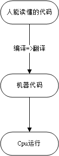
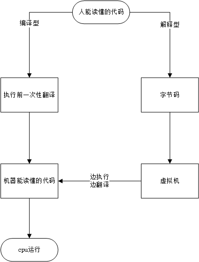
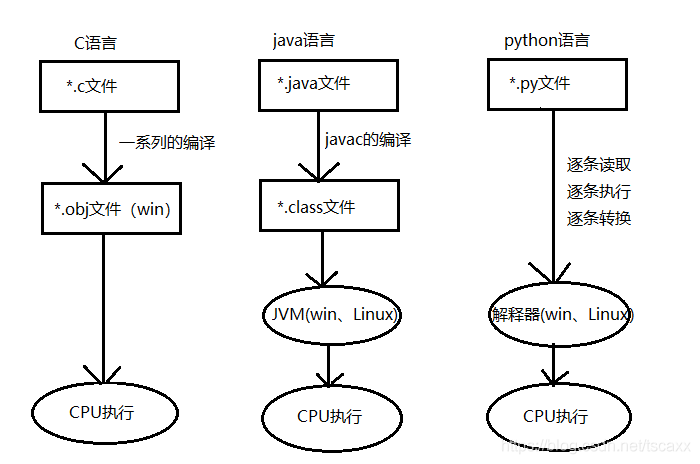

[toc]


## 语言简介

> shell 语言：Linux自带语言
>
> 计算机语言：可以由计算机将其转成二进制进行执行的指令

### **语言分类**

> - 机器语言
>   优点：应用于最底层，速度最快，缺点是最复杂，开发效率最低
>
> - 汇编语言
>   优点：比较底层，速度快，缺点是复杂，开发效率低
> - 高级语言
>   - 编译型语言执行速度快，不依赖语言环境运行，跨平台差
>   - 解释型跨平台好，一份代码，到处使用，缺点是执行速度慢，依赖解释器运行

#### 机器语言

> - 由于计算机内部只能接受二进制代码，因此，用二进制代码0和1描述的指令称为机器指令，全部机器指令的集合构成的计算机机器语言，用机器语言编程的程序称为目标程序。只有目标程序才能被计算机直接识别和执行。但是机器语言编写的程序无明显特征，难以记忆，不便阅读和书写，且依赖于具体机种，局限性很大，机器语言属于低级语言
>
> - 用机器语言编写程序，编程人员首先熟记所用计算机的全部指令代码和代码的涵义。手编程序时，程序员得自己处理每条指令和毎一数据的存储分配和输入输出，还得记住编程过程中每步所使用的工作单元处在何种状态。这是一件十分繁琐的工作。编写程序花费的时间往往是实际运行时间的几十倍或几百倍。而且，编出的程序全是些0和1的指令代码，直观性差，还容易出错。除了计算机生产厂家的专业人员外，绝大多数的程序员已经不再去学习机器语言了。
> - 机器语言是微处理器理解和使用的，用于控制它的操作二进制代码

#### 汇编语言

> - 汇编语言的实质和机器语言是相同的，都是直接对硬件操作，只不过指令采用了英文缩写的标识符，更容易识别和记忆。它同样需要编程者将毎一步具体的操作用命令的形式写出来。
> - 汇编程序的每一句指令只能对应实际操作过程中的一个很细微的动作。例如移动、自增，因此汇编源程序一般比较冗长、复杂、容易出错，而且使用汇编语言编程需要有更多的计算机专业知识，但汇编语言的优点也是显而易见的，用汇编语言所能完成的操作不是一般高级语言所能够实现的，而且源程序经汇编生成的可执行文件不仅比较小，而且执行速度很快。

#### 高级语言

> - 高级语言是大多数编程者的选择。和汇编语言相比，它不但将许多相关的机器指令合成为单条指令，并且去掉了与具体操作有关但与完成工作无关的细节，例如使用堆栈、寄存器等，这样就大大简化了程序中的指令。同时，由于省略了很多细节，编程者也就不需要有太多的专业知识。
>
> - 高级语言主要是相对于汇编语言而言，它并不是特指某一种具体的语言，而是包括了很多编程语言，像最简单的编程语言PASCAL语言也属于高级语言
>
> - 高级语言所编制的程序不能直接被计算机识别，必须经过转换才能执行，转换方式可将它们分为俩类：
>
>   1. 编译类: 编译类语言——> 翻译——>计算机可识别语言
>      缺点：跨平台性较差
>      优点：执行速度相对解释类语言较快
>
>      - 编译是指在执行源程序之前，就将程序源代码“翻译”成目标代码(机器语言)，因此其目标程序可以脱离其语言环境独立执行(编译后生成的可执行文件，是cpu可以理解的二进制的机器码组成的)，使用比较方便、效率较高。但应用程序一旦需要修改，必须先修改源代码，再重新编译生成新的目标文件(*.obj,也就是OBJ文件)才能执行，只有目标文件而没有源代码，修改很不方便。
>
>      - 编译后程序运行时不需要重新进行翻译，直接使用编译的结果就行了。程序执行效率高，依赖编译器，跨平台性差些。如C/C++/Delphi等
>
>        
>
>   2. 解释类：解释类语言——>解释器——>翻译——>机算计可识别语言
>      优点：跨平台性较强
>      缺点：执行速度相对编译类较慢
>
>      - 执行方式类似于我们日常生活中的“同声翻译”，应用程序源代码一边由相应语言的解释器“翻译”成目标代码(机器语言)，一边执行，因此效率比较低，而且不能生成可独立执行的可执行文件，应用程序不能脱离其解释器(想运行，必须先装上解释器)，但这种方式比较灵活，可以动态地调整、修改应用程序。如Shell,Python、Java、PHP、Ruby等语言
>
>      
>
>      - **范例**
>        

## Shell

### Shell的定义

> Shell只是为用户与机器之间搭建成的一个桥梁，让我们能够通过Shell来对计算机进行操作和交互，从而达到让计算机为我们服务的目的。
>
> 用户与Linux内核沟通的桥梁，一个命令解释器
>
> Linux内核：管理硬件和驱动硬件。内核只能识别二进制，为软件服务，接受用户或软件指令驱动硬件

- **Shell的含义**

> Shell 英文含义是‘壳’，是相对于内核来说的。它是建立在内核的基础上，面向用户的一种表现形式，比如我们看到一个球，见到的是它的壳，而非核。Linux中的Shell，是指一个面向用户的命令接口，表现形式就是一个可以由用户录入的界面，这个界面也可以反馈运行信息。

- **Shell在Linux中的存在形式**

> 不同于Windows,Linux是内核与界面分离的，它可以脱离图形界面而单独运行，同样也可以在内核的基础上运行图形化化的桌面。这样，在Linux系统中，就出现了俩种Shell表现形式，一种是在无图形界面下的终端运行环境下的Shell，另一种是桌面上运行的类似Windows的MS-DOS运行窗口，前者我们一般习惯性的简称为终端，后者一般直接称为Shell

- **Shell如何执行用户的指令**

> 1. Shell 有俩种执行指令的方式
>
> - 用户事先编写一个sh脚本文件，内含Shell脚本，而后使用Shell程序执行该脚本，这种方式，我们习惯称为Shell编程
> - 用户直接在Shell界面上执行Shell命令，由于Shell界面的关系，大家都习惯一行行的书写，很少写出成套的程序来一起执行，所以也称为命令行

### Shell的分类

> Linux中默认的Shell是/bin/bash,流行的Shell有ash/bash/ksh/csh/zsh等，不同的Shell都有自己的特点以及用途

- **bash**

  > 大多数Linux系统默认使用的Shell,bash Shell是Bourne Shell的一个免费版本，它是最早的Unix Shell,bash还有一个特点，可以通过help命令来查看帮助，包含的功能几乎可以涵盖Shell所具有的功能，所以一般的Shell脚本都会指定它为执行路径

- **ksh**

  > Korn Shell的语法与Bourne Shell相同，同时具备了C Shell的易用特点。许多安装脚本都使用ksh.ksh有42条内部命令，与bash相比有一定的限制性。

- **csh**

  > C Shell使用的是‘类C’语法，csh是具有C语言风格的一种Shell，其内部命令有52个，较为庞大。目前使用的并不多，已经被/bin/tcsh所取代

- **tcsh**

  > tcsh是csh的增强版，与C Shell完全兼容

- **zsh**

  > 目前Linux里最庞大的一种,它有84个内部命令，使用起来也比较复杂。一般情况下，不会使用该Shell

- **sh**

  > sh是一个快捷方式，已经被/bin/bash所取代

- **nologin**

  > 指用户不能登录

### shell功能

> Shell功能
> - 命令解释功能
> - 启动程序
> - 输入输出重定向
> - 管道连接
> - 文件名置换
> - 变量维护
> - 环境控制
> - shell编程

### Shell能做什么

> - 自动化批量系统初始化程序(update,软件安装，时区设置，安全策略...)
> - 自动化批量软件部署程序(LAMP,LNMP,Tomcat,LVS,Nginx)
> - 应用管理程序(KVM,集群管理扩容，MySQL,dellr720批量RAID)
> - 日志分析处理程序(PV,UV,top 100,grep/awk)
> - 自动化备份恢复程序(MySQL完全备份/增量+Crond)
> - 自动化管理程序(批量远程修改密码，软件升级，配置更新)
> - 自动化信息采集及监控程序(收集系统/应用状态信息，CPU,Mem,Disk,Net,TCP Status,Apache,MySQL)
> - 配合Zabbix信息采集(收集系统/应用状态信息，CPU,Mem,Disk,Net,TCP Status,Apache,MySQL)
> - 自动化扩容(增加云主机-->业务上线)
> - zabbix监控CPU 80%+|- 50% Python API AWS/EC2(增加/删除云主机)+Shell Script（业务上线）
> - 俄罗斯方块，打印三角形，打印圣诞树，打印五角星，运行小火车，坦克大战，排序算法实现
> - Shell可以做任何事(一切取决于业务需求)

## Bash

### Bash的初始化

#### 环境变量文件

> - `/etc/profile`  全局(公有)配置，不管是哪个用户，登录时都会读取该文件
>
> - `/etc/bashrc`    Ubuntu 没有此文件，与之对应的是/etc/bash.bashrc. 它也是全局的，bash执行时，不管是何种方式，都会读取此文件
> - `~/.profile`  若bash是以login方式执行时，读取`~/.bash_profile`,若它不存在，则读取`~/.bash_login`,若前俩者不存在，读取 `~/.profile`
>   图形模式登录时，此文件将被读取，即使存在`~/.bash_profile`和`~/.bash_login`
> - `~/.bash_login`  若bash是以login方式执行时，读取`~/.bash_profile`,若它不存在，则读取`~/.bash_login`,若前俩者不存在，读取 `~/.profile`
> - `~/.bash_profile`  Ubuntu 默认没有此文件，可新建
>   只有bash是以login形式执行时，才会读取此文件。通常该配置文件还会配置成去读取`~/.bashrc`
> - `~/.bashrc`  当bash是以non-login形式执行时，读取此文件。若是以login形式执行，则不会读取此文件
> - `~/.bash_logout` 注销时，且是login形式，此文件才会读取。在文本模式注销时，此文件会被读取，图形模式注销时，此文件不会被读取

#### 环境变量文件的加载

> - 图形模式登录时，顺序读取：`/etc/profile` 和`~/.profile`
> - 图形模式登录后，打开终端时，顺序读取：`etc/bash.bashrc` 和`~/.bashrc`
> - 文本模式登录时，顺序读取：`/etc/bash.bashrc   /etc/profile  ~/.bash_profile`
> - 从其他用户su到该用户，则分俩种情况：
>   - 如果带`-l`参数(或 -参数，--login 参数)，如：su -l username ,则bash是login的，它将顺序读取以下配置文件：`/etc/bash.bashrc,/etc/profile,~/.bash_profile`
>   - 如果没有带 `-l 参数`，则bash是non-login的，它将顺序读取：`~/.bash_logout`
> - 注销时，或退出su登录的用户，如果是login方式，那么bash会读取`~/.bash_logout`
>   - 执行自定义的Shell文件时，若使用`bash -l a.sh`的方式,则bash 会读取行：`/etc/profile,~/.bash_profile`,若使用其他方式，如：bash a.sh,./a.sh,sh a.sh(这个不属于bash Shell),则不会读取上面的任何文件
>   - 上面的例子凡是读取到`~/.bash_profile的`的，若该文件不存在，则读取`~/.bash_login`,若前俩者不存在，读取`~/.profile`

### Bash特性

#### 命令和文件自动补充

> ```
> Bash特性
> 命令和文件自动补充
> 很多命令都会提供一个bash-complete的脚本，在执行该命令时，敲tab可以自动补全参数，会极大提高生产效率
> Linux 命令自动补全需要安装bash-completion
> 
> [root@localhost ~]# yum -y install bash-completion
> 
> 注意：安装重启后可正常tab补齐
> 默认情况下，bash为Linux用户提供了下列标准补全功能：
> - 变量补全
> - 用户名补全
> - 主机名补全
> - 路径补全
> - 文件名补全
> ```

#### 命令历史记忆功能

> - Bash有自动记录命令的功能，自动记录到bash_history隐藏文件中。还可以在下次需要可直接调用历史记录中的命令
> - centos可以通过/etc/profile中的文件来定义一些参数
> - 在bash中，使用history命令来查看和操作之前的命令，以此来提高工作效率。
> - history是bash的内部命令，所以可以使用help history命令调出history命令的帮助文档；
> - 调用命令的方法：
>
> ```
> ## 查看之前使用的所有命令
> [root@localhost ~]# history
> 
> ## 显示最近使用的n个命令
> [root@localhost ~]# history 4
>     2  yum -y install bash-completion
>     3  history
>     4  history n
>     5  history 4
> 
> ## 删除最近使用的第 n 个命令
> [root@localhost ~]# history -d 4
> 
> ## 指定执行历史中的第n个命令
> [root@localhost ~]# !3   //指定执行历史中的第3条命令
> 
> ## 执行命令历史中倒数第 n 条命令
> [root@localhost ~]# !-3
> 
> ## 执行命令历史中的最后一条命令
> [root@localhost ~]# !!
> 
> 
> ## 执行命令历史中最近一条以[String]开头的语句
> [root@localhost ~]# ![String]
> 
> ## 引用上一个命令中的最后一个参数
> [root@localhost ~]# !$
> ## COMMAND + Esc键 + .  输入COMMAND之后，按下Esc键，松开后再按，则可以自动输入最近一条语句使用的参数
> ## COMMAND + Alt + .  输入COMMAND之后，同时按下Alt和 . 键，也可以自动输入最近一条语句使用的参数
> 
> ## 将历史命令写入历史命令的文件中
> [root@localhost ~]# history -w
> 
> ## 回显echo之后的语句，而使用echo $FILENAME命令可以查看file所在的路径
> [root@localhost ~]# echo #HISFILE
> 
> ## 查看命令历史的内容
> [root@localhost ~]# cat .bash_history
> 
> ## 删除所有的命令历史
> [root@localhost ~]# history -c
> 
> ```

#### 别名功能

> alias命令，别名的好处是可以把本来很长的指令简化缩写，来提高工作效率
>
> ```
> ## 查看系统当前所有的别名
> [root@localhost ~]# alias
> 
> ## 定义新的别名
> [root@localhost ~]# alias h5='head -5' // 输入 h5等价于输入‘head -5’
> ## 取消别名定义
> [root@localhost ~]# unalias h5
> 
> 如果想要文件永远生效，只需将上述别名命令写到对应用户或者系统bashrc文件中
> [root@localhost ~]# vim ~/.bashrc
> 
> 如果想用真实命令可以在命令前面添加反斜杠，使别名失效
> [root@localhost ~]# \cp -rf /etc/hosts
> 
> ```

#### 快捷键

| 快捷键    | 作用                                                         |
| --------- | ------------------------------------------------------------ |
| ctrl + A  | 把光标移动到命令行开头                                       |
| ctrl + E  | 把光标移动到命令行结尾                                       |
| ctrl + C  | 强制终止当前命令                                             |
| ctrl + U  | 删除或剪切光标之前的命令                                     |
| ctrl +  L | 清屏命令，相当于clear                                        |
| ctrl + K  | 删除或剪切光标之后的命令                                     |
| ctrl + Y  | 粘贴ctrl+u或ctrl+k剪切的命令                                 |
| ctrl + R  | 在历史命令中搜索，按下ctrl+R,就会出现搜索界面，只要输入搜索内容，就会从历史命令中进行搜索 |
| ctrl + D  | 退出当前终端                                                 |
| ctrl + Z  | 暂停，并放入后台。这个快捷键牵扯工作管理的内容               |
| ctrl + S  | 暂停屏幕输出                                                 |
| ctrl + Q  | 恢复屏幕输出                                                 |

#### 前后台作业控制

> Linux bash Shell单一终端界面下，经常需要管理或同时完成多个作业，如一边执行编译，一边实现数据备份，以及执行SQL查询等其他任务。所有上述的这些工作可以在一个bash内实现，在同一个终端窗口完成

- **前后台作业的定义**

  - 前后台作业实际上对应的也是前后台进程，因此也就有对应的pid.这里统称为作业
  - 无论是前台作业还是后台作业，俩者都来自当前的Shell，是当前shell的子程序
  - 前台作业：可以有用户参与交互及控制的作业我们称之为前台作业
  - 后台作业：在内存可以自运行的作业，用户无法参与交互以及使用ctrl+c来终止，只能通过bg或fg来调用该作业

- **几个常用的作业命令**

  - command & 直接让作业进入后台运行,如`ll &`

  - [ctrl]+z 将当前作业切换到后台

  - jobs 查看后台作业状态

  - fg %n让后台运行的作业n切换到前台来,n 为作业号

  - bg %n 让指定的作业n在后台运行

  - kill %n 移除指定的作业n

    > - n 为jobs命令查看到的job编号，不是进程id
    > - 毎一个job会有一个对应的job编号，编号在当前的终端从1开始分配
    > - job编号的使用样式为[n],后面可能会跟有“+”号或者“-”号，或者什么也不跟；
    > - `+`号表示最近的一个job
    > - `-`号表示倒数第二个被执行的job
    > - `+`号与`-`号会随着作业的完成或添加而动态发生变化
    >
    > 通过jobs方式来管理作业，当前终端的作业在其他终端不可见

#### screen命令使用

> Screen是一款由GNU计划开发的用于命令终端切换的自由软件。用户可以通过该软件通水连接多个本地或远程的命令行会话，并在其间自由切换。GNU Screen可以看作是窗口管理器的命令行界面版本。它提供了统一的管理多个会话的界面和相应的功能
>
> 1. 会话恢复
>    只要Screen本身没有终止，在其内部运行的会话都可以恢复。这一点对于远程登录的用户特别有用——即使网络连接中断，用户也不会失去对已经打开的命令行会话的控制。只要再次登录到主机上执行`screen -r`就可以恢复会话的运行。同样在暂时离开的时候，也可以执行分离命令detach,在保证里面的程序正常运行的情况下让Screen挂起(切换到后台)。这一点和图形界面下的VNC很相似
> 2. 多窗口
>    在Screen环境下，所有的会话都独立运行，并拥有各自的编号、输入、输出和窗口缓存。用户可以通过快捷键在不同窗口下切换，并可以自由的重定向各个窗口的输入和输出。Screen实现了基本的文本操作，如复制粘贴等；还提供了类似滚动条的功能，可以查看窗口状况的历史记录。窗口还可以被区分哈命名，还可以见识后台窗口的活动。会话共享Screen可以让一个或多个用户从不同终端多次登录一个会话，并共享会话

**screen安装**

> 流行的Linux发行版(例如Red Hat Enterprise Linux)通常会自带screen实用程序，如果没有的话，可以从GNU screen的官方网站下载
>
> [screen下载](http://ftp.gnu.org/gnu/screen/)
>
> ```
> [root@localhost test]# yum install screen
> [root@localhost test]# rpm -qa|grep screen
> screen-4.1.0-0.27.20120314git3c2946.el7_9.x86_64
> ```

**screen语法**

> ```
> screen [-AmRvX -ls -wipe][-d <作业名称>][-h <行数>][-r <作业名称>][-s][-S <作业名称>]
> -A	将所有的视窗都调整为目前终端机的大小
> -d	<作业名称> 将指定的screen作业离线
> -h	<行数> 指定视窗的缓冲区行数
> -m	即使目前已在作业中的screen作业
> -r	<作业名称> 恢复离线的screen作业
> -R	先试图恢复离线的作业。若找不到离线的作业，即建立新的screen作业
> -s	指定建立新视窗时，所要执行的shell
> -S	<作业名称> 指定screen作业名称
> -v	显示版本信息
> -x	恢复之前离线的screen作业
> -ls或--list		显示目前所有的screen作业
> -wipe	检查目前所有的screen作业，并删除已经无法使用的screen作业
> 
> 
> screen -S yourname      //新建一个叫yourname的session
> screen -ls     //列出当前所有的session
> screen -r yourname  //回到yourname这个session
> screen -d yourname  //远程detach某个session
> screen -d -r yourname  // 结束当前session并回到yourname这个session
> 
> ### 常用操作
> 1. 创建会话 -m强制创建 session_name 自定义会话名称
> [root@localhost ~]# screen -dmS session_name
> 2. 关闭会话
> [root@localhost ~]# screen -X -S session_name
> [root@localhost ~]# exit   //直接退出会话
> 3. 查看所有会话
> [root@localhost ~]# screen -ls
> 4. 进入会话
> [root@localhost ~]# screen -r yourname
> 5. 清除会话
> 如果由于某种原因其中一个会话死掉了(例如认为杀掉该会话)，这时screen -list会显示该会话为dead状态。使用screen -wipe命令清除该会话
> 6. 关闭或杀死会话
> 正常情况下，当你退出一个窗口中最后一个程序(通常是bash)后，这个窗口就关闭了。另一个关闭窗口的方法是使用 C-a k,这个快捷键杀死当前的窗口，同时也将杀死这个窗口中正在运行的进程
> 如果一个screen会话中最后一个窗口被关闭了，那么整个screen会话也就退出了，screen进程会被终止
> 除了依次退出/杀死当前screen会话中所有窗口这种方法之外，还可以使用快捷键C-a:,然后输入quit命令退出screen会话。需要注意的是，这样退出会杀死所有窗口并退出其中运行的所有程序。其实C-a: 这个快捷键允许用户直接输入的命令有很多，包括分屏可以输入split等，这也是实现screen功能的一个途径，不过快捷键比较方便
> 
> 7. 常用快捷键 C——>ctrl
> C-a ?显示所有键绑定信息
> C-a w显示所有窗口列表
> C-a C-a切换到之前显示的窗口
> C-a c创建一个新的运行shell的窗口并切换到该窗口
> C-a n切换到下一个窗口
> C-a p切换到前一个窗口(与C-a n相对)
> C-a 0..9切换到窗口0..9
> C-a a发送 C-a到当前窗口
> C-a d暂时断开screen会话
> C-a k杀掉当前窗口
> C-a [进入拷贝/回滚模式
> 
> ```

#### 输入输出重定向

> 程序中产生数据直接呈现到显示器上，这就是标准的输出方向，也就是从程序到显示器。输入输出方向就是数据的流动方向：
>
> - 输入方向就是数据从哪里流向程序。数据默认从键盘流向程序，如果改变了它的方向，数据就从其他方向流入，这就是输入重定向
> - 输出方向就是数据从程序流向哪里。数据默认从程序流向显示器，如果改变了它的方向，数据就流向其他流动，这就是输出重定向

- **硬件设备和文件描述符**
  - 计算机的硬件设备有很多，常见的输入设备有键盘、鼠标等，输出设备有显示器、投影仪、打印机等。不过在Linux中，标准输入设备指的是键盘，标准输出设备指的是显示器
  - Linux中一切皆文件，包括标准输入设备(键盘)和标准输出设备(显示器)在内的所有计算机硬件都是文件
  - 为了表示和区分已经打开的文件，Linux会给每个文件分配一个ID，这个ID就是一个整数，被称为文件描述符(File Descriptor)

| 文件描述符 | 文件名 | 类型             | 硬件   |
| ---------- | ------ | ---------------- | ------ |
| 0          | stdin  | 标准输入文件     | 键盘   |
| 1          | stdout | 标准输出文件     | 显示屏 |
| 2          | stderr | 标准错误输出文件 | 显示屏 |

​	- Linux程序在执行任何形式的I/O操作时，都是在读取或者写入一个文件描述符。一个文件描述符知识一个和打开的文件相关联的整数，它的背后可能是一个硬盘上的普通文件、FIFO、管道、终端、键盘、显示器，甚至是一个网络连接

​	- stdin/stdout/stderr默认是打开的，在重定向的过程中，0、1、2这三个文件描述符可直接使用


- **Shell输出重定向**

> 输出重定向是指命令的结果不再输出到显示器上，而是输出到其他地方，一般是文件中。这样做的最大好处就是把命令的结果保存起来，当我们需要的时候可以随时查询。Bash支持的输出重定向符号如下
>
> | 类型                             | 符号                      | 作用                                                         |
> | -------------------------------- | ------------------------- | ------------------------------------------------------------ |
> | 标准输出重定向                   | command > file            | 以覆盖的方式，将command执行结果输出到指定文件中              |
> |                                  | command >> file           | 以追加的方式，将command执行结果输出到指定文件中              |
> | 标准错误输出重定向               | command 2 > file          | 以覆盖的方式，将command的错误信息输出到指定file中            |
> |                                  | command 2 >> file         | 以追加的方式，将command的错误信息输出到指定file中            |
> | 正确输出和错误<br />输出同时保存 | command  > file 2> &1     | 以覆盖的方式，把正确输出和错误输出同时保存到同一file中       |
> |                                  | command  >> file 2> &1    | 以追加的方式，把正确输出和错误输出同时保存到同一file中       |
> |                                  | command > file1 2>file2   | 以覆盖的方式，将正确的输出结果输出到file1中，<br />错误的输出结果输出到file2中 |
> |                                  | command >> file1 2>>file2 | 以追加的方式，将正确的输出结果输出到file1中，<br />错误的输出结果输出到file2中 |
> |                                  | command > file 2>file     | 不推荐这种写法，会导致file被打开俩次，引起资源竞争，<br />所以stdout,stderr会互相覆盖 |
>
> **注意**：
>
> - 输出重定向中`>`代表的是覆盖，`>>`代表的是追加
> - 输出重定向的完整写法其实是fd>file 或者fd>>file,其中fd表示文件描述符，如果不写，默认为1，也就是标准输出文件
> - 当文件描述符为1时，一般都省略不写
> - 当文件描述符大于1的值时，就必须写上
> - 需要重点说明的是，fd和`>`之间不能有空格，否则Shell会解析失败；`>`和file之间的空格可有可无。为了保持一致，习惯在`>`俩边都不加空格
>
> ```
> [root@localhost ~]# ls java 2>/dev/null
> [root@localhost ~]# ls -s &>/dev/null  //将错误信息和正确信息同时输出到指定文件
> 
> - 如果不想把命令的输出结果保存到文件，也不想把命令的输出结果显示到屏幕上，干扰命令的执行，可以把命令的所有结果重定向到 /dev/null文件中
> - 可以把/dev/null当成Linux系统的垃圾箱，任何放入垃圾箱的数据都会被丢弃不能恢复
> ```

- **输入重定向**

> 输入重定向就是改变输入的方向，不再使用键盘作为命令输入的来源，而是使用文件作为命令的输入
>
> | 符号          | 说明                                                         |
> | ------------- | ------------------------------------------------------------ |
> | command<file  | 将file 文件中的内容作为command的输入                         |
> | command<<END  | 从标准输入(键盘)中读取数据，知道遇到分界符END才停止<br />(分界符可以是任意的字符串，用户自己定义) |
> | command file2 | 将file1作为command的输入，并将command的处理结果输出到file2   |
>
> ```
> - 统计文档中有多少行文字
> wc命令可以用来对文本进行统计，包括单词个数、行数、字节数
> wc [选项][文件名]
> -c 选项统计字节数  -w选项统计单词数  -l 选项统计行数
> 
> [root@localhost tmp]# wc -l < a.txt  //查看文件a.txt行数
> // 创建sh文件读取a.txt，并显示
> [root@localhost tmp]# vim test.sh
> 
> #!/bin/bash
> while read str;
> do
>   echo $str
> done < a.txt
> 
> [root@localhost tmp]# bash test.sh //执行sh文件
> 
> ## 统计用户在终端输入的文本行数
> 此处使用输入重定向符<<，这个符号的作用是使用特定的分界符作为命令输入的结束标志，而不使用Ctrl+D键
> wc命令会一直等待用户输入，直到遇见分解符END才结束读取；
> <<之后的分界符可以自由定义，只要再碰到相同的分界符，俩个分界符之间的内容将作为命令的输入(不包括分界符本身)
> [root@localhost tmp]# wc -l <<END
> > 123
> > 23
> > END
> 2
> ```

- **总结**

```
/dev/null 表示空设备文件
0 表示stdin标准输入
1 表示stdout标准输出
2 表示stderr标准错误输出
> 默认为标准输出重定向，与 1> 相同
2>&1 把标准错误输出重定向到标准输出
&>file    以及 >&file  表示标准输出和标准错误输出都重定向到文件file中
```

#### 管道及命令排序

- **管道**

> 俩种类型管道：
>
> - **管道** `|`
>
>   在Shell中，管道将一个程序的标准输出作为另一个程序的标准输入，就像用一根管子将一个程序的输出连接到另一个程序的输入一样
>
>   ```
>   将man的标准输出作为less标准输入，实现翻页功能
>   [root@localhost tmp]#  man ls | less
>   ```
>
> - **tee管道**
>
>   有时候我们想要同时将程序的输出显示在屏幕上(或进入管道)和保存到文件中，这个时候可以用tee
>   tee程序的输出和它的输入一样，但是会将输入内容额外的保存到文件中
>
>   ```
>   [root@localhost tmp]# cat /etc/passwd | tee a.txt
>   
>   tee程序将cat程序的输出显示在屏幕上，并且在a.txt文件中保留了副本。需要注意的是，如果tee命令中指定的文件已经存在，那么它将会被覆盖，可使用 -a 选项在文件末尾追加内容，而不是覆盖
>   ```
>
>   

- **命令排序**

> 1. `&&` `||` **具备逻辑判断**
>
> - command1 && command2 只有在command1成功执行后才会执行command2;
> - command1 || command2 在command1没有成功执行时执行command2
>
> ```
> [root@localhost tmp]# sudo updatedb || echo "update error"
> [root@localhost tmp]# ll && echo "sucess"
> 
> ```
>
> 2. `;`**不具备逻辑判断**
>    安装命令先后执行命令
>
> ```
> [root@localhost tmp]# ll / ;cat a.txt
> ```

#### 通配符

| 字符                   | 含义                                 | 示例                                                         |
| ---------------------- | ------------------------------------ | ------------------------------------------------------------ |
| *                      | 匹配0个或多个任意字符                | a*b，a与b之间可以有任意长度的字符，也可以没有。如：aabcb,ab... |
| ？                     | 匹配一个任意字符                     | a?b,a与b之间必须但也只能存在一个字符，该字符可以是任意字符。如：aab,acb... |
| [list]                 | 匹配list中的任意单个字符             | a[xyz]b,a与b之间必须但也只能存在一个字符，该字符只能是x或y或z,例如：axb,ayb,azb |
| [!list]                | 匹配除list中的任意单个字符           | a[!a-z]b,a与b之间必须但也只能存在一个字符，该字符不能是小写字母。如：aAb,aOb... |
| [c1-c2]                | 匹配c1-c2间的任意单个字符            | a[0-1]b,a与b之间必须但也只能存在一个字符，该字符只能是数字。例如：a0b,a1b |
| {string1,string2,....} | 匹配string1、string2等中的一个字符串 | a{abc,xyz}b,a与b之间必须但也只能存在一个字符串，字符串只能是abc或xyz.如：aabcb,axyzb |

```
[root@localhost ~]# ls /etc/*.conf
[root@localhost tmp]# touch file{1,2,3}
[root@localhost tmp]# ls file[1,2,3]
file1  file2  file3
```

## Shell脚本规范

1. **风格规范**

> 开头有“蛇棒”，就是在很多脚本的第一行出现的以“#!”开头的注释，他指明了当我们没有指定解释器的时候默认的解释器，一般可能是这样：`#!/bin/sh` 定义脚本运行环境
> 除了bash之外，可以用下面的命令查看本机支持的解释器：
>
> ```
> [root@localhost ~]# cat /etc/shells
> /bin/sh
> /bin/bash
> /usr/bin/sh
> /usr/bin/bash
> ```
>
> - 直接使用 `./a.sh` 来执行这个脚本的时候，如果没有“蛇棒”，就会默认用$shell指定的解释器，否则就会用"蛇棒"指定的解释器
> - 上面这种写法可能不太具备适应性，一般我们会用下面的方式来指定：
>   `#!/usr/bin/env bash1`

2. **注释**

> 注释的意义不仅在于解释用途，而在于告诉我们注意事项，就像一个README
> 具体来说，对于shell脚本，注释一般包括下面几个部分：

- shebang
- 脚本的参数
- 脚本的用途
- 脚本的注意事项
- 脚本的写作时间，作者，版权等
- 各个函数前的说明解释
- 一些较复杂的单行命令注释

2. **注释**

> 注释的意义不仅在于解释用途，而在于告诉我们注意事项，就像一个README
> 具体来说，对于shell脚本，注释一般包括下面几个部分：
>
> - shebang
> - 脚本的参数
> - 脚本的用途
> - 脚本的注意事项
> - 脚本的写作时间，作者，版权等
> - 各个函数前的说明解释
> - 一些较复杂的单行命令注释

3. **参数要规范**

> 当脚本需要接受参数的时候，一定要先判断参数是否合乎规范，并给出合适的回显，方便使用者了解参数的使用。至少得判断下参数的个数
>
> ```
> if [[ $# !=2 ]];then
> 	echo "Parameter incorrect"
> 	exit 1
> fi
> ```

4. **变量**

> 一般情况下会将一些重要的环境变量定义在开头，确保这些变量的存在
>
> ```
> source /etc/profile
> export PATH="/usr/local/bin;/usr/bin;/bin;/usr/local/sbin;/usr/sbin;/sbin;/apps/bin/"
> ```
>
> - 这种定义方式有一个很常见的用途，最典型的应用就是，当本地安装了很多java版本时，可能需要制定一个java来用。这时就会在脚本开头重新定义JAVA_HOME以及PATH变量来进行控制；
> - 一段好的代码通常是不会有很多硬编码在代码里的“魔数”的。如果一定要有，通常是用一个变量的形式定义在开头，然后调用的时候直接调用这个变量，这样方便日后的修改

5. **缩进**

> - 正确的缩进很重要，尤其是在写函数的时候，否则在阅读时很容易把函数体跟直接执行的命令搞混
> - 常见的缩进方法有"soft tab"/"hardtab":
>   soft tab:使用n个空格进行缩进，n通常是2或4
>   hard tab:指真实的"\t"字符12
> - 对于if和for语句之类的，最好不要把then，do这些关键字单独写一行，这样看上去比较丑

6. **命名有标准**

> 命名规范：
>
> - 文件名规范，以.sh结尾，方便识别；
> - 变量名要有含义，不要拼错；
> - 统一命名风格，写shell一般用小写字母加下划线

7. **编码要统一**

> 脚本尽量使用UTF-8编码，能够支持中文等一些奇奇怪怪的字符。不过虽然能写中文，但是在写注释以及打log的时候还是尽量英文，毕竟很多机器还是没有直接支持中文的，打出来可能会有乱码。

8. **日志和回显**

> - 日志的重要性不必多说，能够方便回头纠错，在大型的项目里是非常重要的
> - 如果这个脚本是供用户直接在命令行使用的，那么最好还是能够在执行时实时回显执行过程，方便用户掌控；
> - 为了提高用户体验，会在回显中添加一些特效，比如颜色啊，闪烁啊之类的

9. **密码要移除**

> 不要把密码编写在脚本里，尤其是当脚本托管在类似Github这类平台中。

10. **太长要分行**

> 在调用某些程序的时候，参数可能会很长，这时候为了保证较好的阅读体验，我们可以用反斜杠来分行

```
./configure \
-prefix=/usr
-sbin-path=/usr/sbin/nginx \
-conf-path=/etc/nginx/nginx.conf
```

11. **代码有效率**

> - 在使用命令的时候要了解命令的具体做法，尤其当数据处理量大的时候，要时刻考虑该命令是否会影响效率；
> - 比如下面的俩个sed命令：

```
sed -n '1p' file
sed -n '1p;1q' file

[root@localhost tmp]# sed -n '1p' a.txt
[root@localhost tmp]# sed -n '1p;1q' a.txt
```

> 这俩个命令作用一样，都是获取文件的第一行。但是第一条命令会读取整个文件，而第二条命令只读取第一行。当文件很大的时候，仅仅是这样一条命令不一样就会造成巨大的效率差异
> 当然，这里只是为了举一个例子，这个例子真正正确的用法是`head -n1 file`命令
> 勤用双引号：
>
> - 几乎所有的大佬都推荐使用"$"来获取变量的时候最后加上双引号
> - 不加上双引号在很多情况下都会造成很大的麻烦
>
> ```
> #!/bin/sh
> #已知当前文件夹有一个a.sh的文件
> var="*.sh"
> echo $var
> echo "$var"
> ```
>
> 运行结果：
> ```
> a.sh
> *.sh
> ```
> 可以解释为它执行了下面的命令
> ```
> echo *.sh
> echo "*.sh"
> ```

> 在很多情况下，在将变量作为参数的时候，一定要注意上面这一点，仔细体会其中的差异。上面只是一个非常小的例子，实际应用的时候由于这个细节导致的问题实在是太多了。

12. **学会查路径**
> - 很多情况下，会先获取当前脚本的路径，然后以这个路径为基准，去找其他的路径。通常我们是直接用pwd以期获得脚本的路径。 不过其实这样是不严谨的，pwd获得的是当前shell的执行路径，而不是当前脚本的执行路径
> - 正确的做法是：
```
script_dir=$(cd $(dirname $0) && pwd)
script_dir=$(dirnamt $(readlink -f $0)) 12
```
> 应当先cd进当前脚本的目录然后再pwd，或者直接读取当前脚本所在路径

13. **代码要简短**
> - 简短不单单指代码的长度，而是只用到的命令数。原则上我们应当做到，能一条命令解决的问题绝不用俩条命令解决。这不仅牵涉到代码的可读性，而且也关乎代码的执行效率
> - 最经典的例子
> ```
> [root@localhost tmp]# cat /etc/passwd | grep root
> root:x:0:0:root:/root:/bin/bash
> operator:x:11:0:operator:/root:/sbin/nologin
> 
> [root@localhost tmp]# grep root /etc/passwd
> root:x:0:0:root:/root:/bin/bash
> operator:x:11:0:operator:/root:/sbin/nologin
> ```
>
> cat 命令最为人不齿的用法就是这样，用的没有任何意义，明明一条命令可以解决，非得加根管道

14. **使用新写法**
> 尽量使用较新引入的一些语法，更多的偏向代码风格的
> - 尽量使用`func(){}`来定义函数，而不是`func{}`
> - 尽量使用`[[]]`来代替`[]`
> - 尽量使用`$()`将命令的结果赋给变量，而不是反引号在复杂的场景下，尽量使用 `printf `代替 `echo`进行回显

15. **其他小技巧**
- 路径尽量保持绝对路径，不容易出错，如果非要用相对路径,最好用`./`修饰
- 优先使用bash的变量替换代替awk sed,这样更加简短
- 简单的`if`尽量使用`&& ||`,写成单行，比如`[[x>2]] && echo x`
- 当export变量时，尽量加上子脚本的namespace,保证变量不冲突
- 会使用trap捕获信号，并在接受到终止信号时执行一些收尾工作；
- 使用mktemp生成临时文件或文件夹
- 利用`/dev/null`过滤不友好的输出信息
- 会利用命令的返回值判断命令的执行情况
- 使用文件前要判断文件是否存在，否则做好异常处理
- 不要处理ls后的数据`(ls -l | awk '{print $8}')`;
- ls的结果非常不确定，并且与平台有关
- 读取文件时不要使用`for loop`而要使用`while read`

## shelll脚本调试

> shell脚本的语法调试，使用bash的相关参数进行调试
> ```
> sh [] 文件名.sh
> -n  不要执行script,仅查询语法的问题
> -v  在执行script之前，先将script内容输出到屏幕上
> -x 将使用的脚本内容输出到屏幕上，该参数经常被使用
> ```

## 脚本运行方式

> Linux中Shell脚本的执行通常由4种方式，分别为工作目录执行，绝对路径执行，sh执行，Shell环境执行
>
> ```
> // sh执行环境
> [root@localhost test]# cat /etc/shells
> /bin/sh
> /bin/bash
> /usr/bin/sh
> /usr/bin/bash
> ```
>
> 

### 工作目录执行

> 工作目录执行，指的是执行脚本时，先进入到脚本所在的目录(此时，称为工作目录)，然后使用`./demo.sh`方式执行
>
> ```
> [root@localhost test]# ./a.sh
> -bash: ./a.sh: 权限不够         
> [root@localhost test]# chmod 764 a.sh  //添加执行权限
> [root@localhost test]# ll a.sh
> -rwxrw-r--. 1 root root 61 9月   1 22:20 a.sh
> 
> ### 权限错误：需要赋权，才能执行
> ### `./` :表示在当前的工作目录下执行a.sh。若不加上`./`,bash 可能会响应找不到a.sh的错误信息。因为目前的工作目录(/test可能不在执行程序默认的搜索路径之列，也就是说，不在环境变量PATH的内容之中。查看PATH的内容可用`echo $PATH`。
> ```

### 绝对路径执行

> 绝对路径中执行，指的是直接从根目录`/`到脚本目录的绝对路径。使用绝对路径执行脚本，需设定脚本执行权限，否则执行会报错
>
> ```
> ### 查看脚本的绝对路径
> [root@localhost test]# pwd
> /test
> ### 这里的`pwd`指的是该命令执行结果，等同于 `/test`
> [root@localhost test]# `pwd`/a.sh
> 请输入你的名字dd
> dd
> ### 使用绝对路径执行脚本
> [root@localhost test]# /test/a.sh
> 请输入你的名字kk
> kk
> ```

### sh执行

> sh执行，指的是用脚本对应的sh或bash 来执行脚本
>
> ```
> [root@localhost test]# sh a.sh
> 请输入你的名字dd
> dd
> [root@localhost test]# bash a.sh
> 请输入你的名字dd
> dd
> 
> 注意：若是以sh方式来执行，那么，可以不必实现设定Shell的执行权限，甚至都不用写Shell文件中的第一行(指定bash路径)。因为此方法是将a.sh作为参数传给sh(bash)命令来执行的。这时不是hello.sh自己来执行，而是被人家调用执行，所以不需要执行权限。那么也就不用指定bash路径了。
> ```

### Shell环境执行

> Shell环境执行，指的是在当前Shell环境中执行，可以使用`.` 接脚本或 source 接脚本
> 这种方式执行，不需设定脚本执行权限
>
> ```
> [root@localhost test]# . a.sh
> 请输入你的名字dd
> dd
> [root@localhost test]# source a.sh
> 请输入你的名字dd
> dd
> ```

### 作业脱机管理

> 1. 将作业(进程)切换到后台可以避免由于误操作如[ctrl]+c等导致的job被异常中断的情形，而脱机管理主要是针对中断异常断开的情形
> 2. 通常使用`nohup`命令来使得脱机或注销之后，job依旧可以继续运行。也就是说`nohup`忽略所有挂断(SIGHUP)信号；
> 3. 如果该方式命令之后未指定`&`符号，则job位于前台，指定`&`符号，则job位于后台
>
> ```
> 使用nohup执行脚本，可以省略日志的输出，因为原job的输出会自动被nohup重定向到缺省的nohup.out日志文件。缺省的日志文件与脚本在同一目录下
> ### 需要设置执行文件的执行权限
> [root@localhost test]# nohup ./a.sh
> nohup: 忽略输入并把输出追加到"nohup.out"
> nohup: 无法运行命令"./a.sh": 权限不够
> [root@localhost test]# chmod 764 a.sh
> ### 直接断开终端会连接一个新的终端
> [root@localhost test]# nohup ./a.sh
> nohup: 忽略输入并把输出追加到"nohup.out"
> ### 由于是一个新的终端，jobs无法看到任何作业
> [root@localhost test]# jobs  
> [root@localhost test]# ps -ef | grep a.sh
> root       1490   1323  0 05:46 pts/0    00:00:00 grep --color=auto a.sh
> ### 查看nohup执行日志，可以查看jobs执行情况
> [root@localhost test]# more nohup.out
> ./a.sh: 第 2 行:read: 读错误: 0: 错误的文件描述符
> 
> ### 使用nohup方式将job放入后台处理，同时指定了日志文件，则nohup使用指定的日志文件，而不会输出到缺省的nohup.out
> [root@localhost test]# nohup ./a.sh >temp.log 2>&1 &
> [1] 1495
> [root@localhost test]# jobs
> [1]+  完成                  nohup ./a.sh > temp.log 2>&1
> 
> ```

### shell中的特殊符号

```
~	家目录  # cd ~ 代表进入用户家目录
！	执行历史命令  !! 执行上一条命令 !p :执行最近以p开头的命令 !62执行历史命令中第62条命令
$	变量中取内容值
+ - *  /  %	对应数学运算 加 减 乘 除 取余数
&	后台执行
*	星号是shell中的通配符  匹配所有
？	问号是shell中的通配符  匹配除回车以外的一个字符
；	分号可以在shell中一行执行多个命令，命令之间用分号分割
|	管道符 上一个命令的输出作为下一个命令的输入  cat filename | grep "abc"
\	转义字符
` `	反引号 命令中执行命令  echo "today is `date +%F`"
' '	单引号 脚本中字符串要用单引号引起来，但是不同于双引号的是，单引号不解释变量。但是如果是：''$args''会解释变量
" "	双引号 脚本中出现的字符串可以用双引号引起来，会解释变量
```

## Shell输入输出管理

### 基本输入

```
read 命令
默认接受键盘的输入，回车符代表输入结束
命令选项
-p	打印信息
-t	限定时间,输入超时时间
-s	不回显
-n	输入字符数，限定输入字符数
```


### Echo格式化输出

> 将内容输出到默认显示设备
> echo命令：在显示器上显示一段文字，将输入的字符串送往标准输出。输出的字符串以空白字符隔开，并在最后加上换行号。
> 参数选项：
>
> ```
> -n  不要在最后自动换行
> 
> -e  若字符串中出现以下字符，则特别加以处理，而不会将它当成一般文字输出
> 转义字符:
> \a 	发出警告声
> \b	删除前一个字符
> \c	最后不加上换行符号
> \f	换行但贯标仍旧停留在原来的位置
> \n	换行且光标移至行首
> \r	光标移至行首但不换行
> \t	插入tab
> \v	与\f相同
> \	插入\字符
> \nnn	插入nnn(八进制)所代表的ASCII字符
> -help	显示帮助
> -version	显示版本信息
> 
> [root@localhost ~]# echo -e "\a\a\a"
> [root@localhost ~]# echo -e "\t\t hehe"
>                  hehe
> ### 倒计时
> [root@localhost test]# vim testEcho.sh
> #!/bin/bash
> for time in `seq 9 -1 0`;
> do
>   echo -n -e "\b$time"
>   sleep 1
> done
> ```

## 变量

### 变量定义与引用

> 变量：用一个固定的字符串去表示不固定的内容
> 变量：存放临时数据到内存，以待后续使用时快速读出。内存在系统启动的时候按照1B一个单位划分若干块，然后统一编号(16进制编号)，并对内存的使用情况做记录，保存在内存跟踪表中
>
> 临时变量：在关机后或关闭终端后就会被清除
>
> 在脚本中定义变量存值的时候的变化：
> 1. 内存占用：如果存的是一个字符则占用一个字节，如果存的是字符串则是字符串的长度加1个字节长度(\0是一个特殊字符，代表字符串结束)
> 2. 变量名与内存空间的关系：计算机种会将对应的内存空间和变量名称绑定在一起，此时代表这段内存空间已经被程序占用，其他程序不可复用；然后将变量名对应的值存在对应内存地址空间里。
>
> **理解变量存储**：STRING1="ABC"
> 1)STRING1(逻辑地址)<===>0x5...0x8(物理地址)  存取数据ABC
> STRING1:是给人看的方便记忆
> 0x5...0x8：内存物理地址，是计算机寻址的一句
> 2）对于人来说STRING1上存的数据是ABC,对于计算机来说数据时存在物理地址上的；
> 3）在建立变量的时候计算机自动将逻辑地址(变量名)和物理地址做了对应
>
> 变量读出
> 1）当调用STRING1的时候，计算机会根据对应关系，找到物理地址
> 2）定位内存地址，读出数据并返回
>
> **变量分类**
>
> 1. 本地变量：用户私有变量，只有本用户可以使用，保存在家目录下的.bash_profile/.bashrc文件中
> 2. 全局变量:所有用户都可以使用，保存在/etc/profile、/etc/bashrc文件中
> 3. 用户自定义变量：用户自定义，比如脚本中的变量
>
> **变量名命名规则**
> - 命名只能使用英文字母，数字和下划线，首个字符不能以数字开头
>
> - 重点不能有空格，可以使用下划线(_)
>
> - 不能使用标点符号
>
> - 不能使用bash里的关键字(可用help命令查看保留关键字)
>
> - 字符串需使用单引号或双引号
>
>   变量名字母最好使用大写，与linux命名统一
>
> 

1. **自定义变量**

> - **定义变量**：变量名=变量值  变量名必须以字母或下划线开头，区分大小写 ip=192.168.2.115
>   变量在使用`=`赋值时，变量名与变量值之间不能有空格
>   - 引用变量：变量名 或 {变量名}
>   - 查看变量：`echo $变量名`  `set(所有变量：包括自定义变量和环境变量)`
>   - 取消变量：`unset 变量名`
> - **作用范围**：仅在当前shell中有效
>
> ```
> [root@localhost ~]# varTest=test1   //定义变量varTest 并赋值
> [root@localhost ~]# dir=`pwd`  // 定义变量dir ，并将pwd命令执行结果赋值给dir
> [root@localhost ~]# echo $dir  // 查看变量
> /root
> 
> ```
>
> 

2. **环境变量**(全局变量)

> - **定义环境变量**
>   方法1：`export back_dir2=/home/backup`
>   方法2：`export back_dir1`  将自定义变量转换成环境变量
>    - 引用环境变量：变量名 或 {变量名}
>    - 查看环境变量：`echo $变量名`   `env  例如 env | grep back_dir2`
>    - 取消环境变量：`unset 变量名`
> - **环境变量作用范围**：在当前shell和子shell中有效

**上述设置的变量其实都是一次性变量，系统重启就会丢失，如果希望本地变量或全局变量永久使用，可以将需要设置的变量写入文件中即可**

> **定义永久变量**
>
> - 本地变量：用户私有变量，只有本用户可以使用，保存在家目录下的.bash_profile、.bashrc文件中
> - 全局变量:所有用户都可以使用，保存在/etc/profile 、/etc/bashrc
>
> ```
> [root@localhost ~]# vim ~/.bash_profile  //定义用户私有永久变量
> NAME='TEST'
> [root@localhost ~]# vim /etc/profile  //定义永久全局变量
> export TEMP_NAME='TEST'
> 
> ```
>
> 

3. **位置变量**

> 12 34 56 78 9{10}...{n}
>
> 当需要往执行的脚本中传入多个参数时，可使用位置变量。以数字作为参数位置标识，如：数字1表示传入的第一个参数，数字2表示传入的第2个参数，依次类推
>
> 例如：创建sh文件，内容如下
>
> ```
> #!/bin/bash
> echo "$2"  //打印第二个参数
> echo "$1" //打印第一个参数
> ```
>
> 执行结果
>
> ```
> [root@localhost test]# sh test.sh 1 2
> 2
> 1
> ```

4. **预定义变量**

> 系统中已经预先定义好的变量
> - `0` 脚本名(脚本本身)
>  - `*`  所有的参数，`*`会将所有的参数作为一个整体，以“12 ...$n" 的形式输出所有参数
> - `@` 所有的参数，"@"会将各个参数分开，以"1 2 ... $n" 的形式输出所有参数
> - `#` 参数的个数
> - '$' 当前进程的PID
> - `!` 上一个后台进程的PID
> - `?` 上一个命令的返回值 0表示成功
>
> 范例：创建test.sh文件
>
> ```
> #!/bin/sh
> echo "第一个位置参数 $1"
> echo "第二个位置参数 $2"
> echo "第四个位置参数 $4"
> 
> echo "所有的参数是：$*"
> echo "所有的参数是：$@"
> echo "参数的个数是：$#"
> 
> echo "当前进程PID:$$"
> echo "上一个后台进程的PID $!"
> echo "上一个命令的返回值: $?"
> 
> ```
>
> 执行结果：
>
> ```
> [root@localhost test]# bash test.sh 1 2 3 4
> 第一个位置参数 1
> 第二个位置参数 2
> 第四个位置参数 4
> 所有的参数是：1 2 3 4
> 所有的参数是：1 2 3 4
> 参数的个数是：4
> 当前进程PID:2072
> 上一个后台进程的PID    //没有上一个后台进程的PID
> 上一个命令的返回值: 0
> ```

### 变量赋值的方式

1. **显示赋值**

> 变量名=变量值
>
> 使用`=`赋值，可以把确定的值赋给变量，也可以把命令的执行结果赋给变量
>
> 如：
>
> ```
> ip_var=192.168.142.122  //直接赋值
> [root@localhost test]# school="qinghua" //使用双引号，将字符串赋值给变量
> [root@localhost test]# today1=`date +%F` //使用反单引号将命令结果赋值给变量
> [root@localhost test]# today2=$(date +%F)  //使用$符合将命令结果赋值给变量
> ```

2. **read 从键盘读入变量值**

> ```
> read 变量名
> read -p "提示信息" 变量名
> read -t 6 -p "提示信息" 变量名
> read -n 2 变量名
> read 用法：
> 
> -a 后跟一个变量，该变量会被认为是个数组，然后给其赋值，默认是以空格为分割符。
> -d 后面跟一个标志符，其实只有其后的第一个字符有用，作为结束的标志。
> -p 后面跟提示信息，即在输入前打印提示信息。
> -e 在输入的时候可以使用命令补全功能。
> -n 后跟一个数字，定义输入文本的长度，很实用。
> -r 屏蔽\，如果没有该选项，则\作为一个转义字符，有的话 \就是个正常的字符了。
> -s 安静模式，在输入字符时不再屏幕上显示，例如login时输入密码。
> -t 后面跟秒数，定义输入字符的等待时间。
> -u 后面跟fd，从文件描述符中读入，该文件描述符可以是exec新开启的。
> ```
>
> - 范例:创建read.sh
>
> ```
> #!/bin/bash
> read -p "请输入你的密码" password
> echo $password
> ```
>
> 执行结果
>
> ```
> [root@localhost test]# sh read.sh
> 请输入你的密码123
> 123
> ```
>
> - 范例2：
>
> ```
> #!/bin/bash
> back_dir1=/var/backup
> read -p "请输入你的备份: " back_dir2
> echo $back_dir1
> echo $back_dir2
> ```
>
> 执行结果：
>
> ```
> [root@localhost test]# sh fist.sh
> 请输入你的备份: dd
> /var/backup
> dd
> ```
>
> - 范例3：检验输入ip连接情况
>
> ```
> [root@localhost test]# vim ping2.sh
> #!/bin/bash
> read -p "Input IP:" ip
> ping -c2 $ip &>/dev/null
> if [$?=0];then
>         echo "host $ip is ok"
> else
>         echo "host $ip is fail"
> fi
> 
> ### 执行结果
> [root@localhost test]# chmod a+x ping2.sh
> [root@localhost test]# ./ping2.sh
> Input IP:192.168.172.122
> ./ping2.sh:行4: [1=0]: 未找到命令
> host 192.168.172.122 is fail
> ```

### 定义引用变量

> 1. 弱引用——`" "` 
> 2. 强引用——`' ' `
>
> 范例：
>
> ```
> [root@localhost test]# echo "${school} is good"   //弱引用，可获取变量的值
> qinghua is good
> [root@localhost test]# echo '${school} is good'  //强引用，无法获取变量值，等价于执行命令,会直接打印
> ${school} is good
> ```
>
> - (反引号) 命令替换 等价于 `$()`,反引号中的Shell命令会先被执行
>
> ```
> [root@localhost test]# touch `date +%F`_file1.txt
> [root@localhost test]# touch $(date +%F)_file2.txt
> ```
> 

### 变量的运算

#### 整数运算

> `+ - * \ %`

> - **方法1**：`expr`
>
> ```
> [root@localhost ~]# expr 1+2  //当运算符与数字没有用空格隔开时，无法运算
> 1+2
> [root@localhost ~]# expr 1 + 2
> 3
> ### 变量运算
> [root@localhost ~]# a=1
> [root@localhost ~]# b=2
> [root@localhost ~]# expr $a + $b
> 3
> [root@localhost ~]# expr $b / $a   //除法
> 2
> [root@localhost ~]# expr $a \* $b  //乘法，乘号需要使用反斜线进行转义
> 2
> [root@localhost ~]# expr $a % $b
> 1
> ```
>
> - **方法2**：`$(())`
>
> ```
> [root@localhost ~]# $(($a + $b))  //无法直接打印出运算结果
> -bash: 3: 未找到命令
> [root@localhost ~]# echo $(($a + $b))
> 3
> [root@localhost ~]# echo $(((4-2)*4))
> 8
> [root@localhost ~]# echo $(($a*$b))
> 2
> [root@localhost ~]# echo $(($a**$b))  //表示1的平方
> 1
> ```
>
> - **方法3**：`$[]`
>
> ```
> [root@localhost ~]# $[$a+$b]  //无法直接打印出运算结果
> -bash: 3: 未找到命令
> [root@localhost ~]# echo $[$a+$b]
> 3
> [root@localhost ~]# c=3
> [root@localhost ~]# echo $[$b**$c]  //表示变量b的立方
> 8
> ```
>
> - **方法4**：`let` 这种方式一般配合脚本使用
>
> ```
> [root@localhost ~]# let sum=2+3;echo $sum
> 5
> [root@localhost ~]# let i++;echo $i
> 1
> [root@localhost ~]# let sum=2*3;echo $sum
> 6
> ```

#### 小数运算

```
[root@localhost ~]# echo "scale=2;6/4" | bc
-bash: bc: 未找到命令
[root@localhost ~]# yum -y install bc
[root@localhost ~]# echo "2*4" |bc
8
[root@localhost ~]# echo "2/4" |bc
0
[root@localhost ~]# echo "scale=2;6/4" | bc
1.50
[root@localhost ~]# awk 'BEGIN{print 1/2}'
0.5
[root@localhost ~]# echo "print 5.0/2"|python
2.5

exit NUM退出脚本，释放系统资源，NUM代表一个整数，代表返回值，范围是：1-255
```

### 变量"内容"的删除和替换

#### 变量"内容"的删除

```
[root@localhost ~]# url=www.sina.com.cn
[root@localhost ~]# echo ${#url}  //获取变量值的长度
15
[root@localhost ~]# echo ${url}  //标准查看
www.sina.com.cn
[root@localhost ~]# echo ${url#*.} //从前往后最短匹配
sina.com.cn
[root@localhost ~]# echo ${url##*.}  //从前往后，最长匹配，贪婪匹配
cn
[root@localhost ~]# echo ${url%.*}  //从后往前最短匹配
www.sina.com
[root@localhost ~]# echo ${url%%.*}  //从后往前，最长匹配，贪婪匹配
www
[root@localhost ~]# echo ${url#a.}
www.sina.com.cn
[root@localhost ~]# echo ${url#*sina.}
com.cn
```

#### 索引及切片

```
[root@localhost ~]# url=www.sina.com.cn
[root@localhost ~]# echo ${url:0:5} //字符下标从0开始，打印下标从0开始往后5个字符。前一个数字代表字符下标，后一个数字表示										字符数
www.s
[root@localhost ~]# echo ${url:5:5}
ina.c
[root@localhost ~]# echo ${url:5}  //打印从下标5开始，往后的所有字符
ina.com.cn
```

#### 内容的替换

```
[root@localhost ~]# url=www.sina.com.cn
[root@localhost ~]# echo ${url/sina/baidu}  //url需要替换的变量；sina被替换的字符，baidu 目标字符
www.baidu.com.cn
[root@localhost ~]# echo ${url/n/N}   //只替换字符串中第一个匹配到的n，将其替换为N
www.siNa.com.cn
[root@localhost ~]# echo ${url//n/N}  //贪婪替换，会将字符串中的n都替换为N
www.siNa.com.cN
```

#### 变量的替代

```
[root@localhost ~]# unset var1
[root@localhost ~]# echo ${var1}

[root@localhost ~]# echo ${var1-aaa}  //当var1没有值时，使用-可以替换变量的值
aaa
[root@localhost ~]# echo ${var1}

[root@localhost ~]# echo ${var1+aaa}  // 当var1没有值时，使用+无法替换变量值
[root@localhost ~]# var1=111
[root@localhost ~]# echo ${var1-aaa} //当var1有值时，无法使用-替换变量值
111
[root@localhost ~]# echo ${var1+aaa} //当var1有值时，可以使用+替换变量值
aaa
[root@localhost ~]# echo ${var1} //使用=赋值的变量，其值在使用+或者-进行替换时，不发生改变
111
[root@localhost ~]# echo ${var1:-aaa} //使用冒号: 不改变其值
111
[root@localhost ~]# echo ${var1:+aaa}
aaa
[root@localhost ~]# echo ${var1:=aaa} //使用等号不改变变量原来的值
111

${变量名:-新的变量值}
- 变量没有被赋值(包括空值)：都会使用新的变量值替代
- 变量有被赋值：不会被替代

${变量名:+新的变量值}
- 变量有被赋值(包括空值)：都会使用新的变量值替代
- 变量没有有被赋值：不会被替代
```

#### `i++`和`++i`对变量的影响

```
1. 对变量值的影响
[root@localhost ~]# i=1
[root@localhost ~]# let i++
[root@localhost ~]# echo $i
2
[root@localhost ~]# j=1
[root@localhost ~]# let ++j
[root@localhost ~]# echo $j
2

2. 对表达式值的影响
[root@localhost ~]# unset i
[root@localhost ~]# unset j
[root@localhost ~]# i=1
[root@localhost ~]# j=1
[root@localhost ~]# let x=i++  //先赋值再运算
[root@localhost ~]# let y=++j  //先运算再赋值
[root@localhost ~]# echo $x
1
[root@localhost ~]# echo $y
2
[root@localhost ~]# echo $i
2
[root@localhost ~]# echo $j
2
i++ 先赋值再运算，++i先运算再赋值，俩者对变量的值没有影响，对表达式的值有影响
```

#### shell特殊变量

```
特殊参数
$*  代表所有参数，其间隔为IFS内定参数的第一个字元
$@	与 * 星号类同，不同之处在于不参照IFS
$#	代表参数数量
$	执行上一个指令的返回值
$-	最近执行的foreground pipeline的选项参数
$$	本身的process ID
$_	显示出最后一个执行的命令
$N	shell的第几个外传参数

- 范例
#!/bin/bash
echo "脚本的名字是：$0"
echo "脚本的参数是:$@"
echo "脚本的参数是:$*"
echo "传参个数是:$#"
echo "脚本执行进程号:$$"
echo "最后执行的命令时:$_"
echo "第2个参数是：$2"

```


## 数组

### 基本数组

> 数组可以让用户一次赋予多个值，需要读取数据时只需通过索引调用就可以方便读取了。
> - **数组语法**
> ```
> 数组名称=(元素1 元素2 元素3...)
> ```
> - **数组读取**
> ```
> ${数组名称[索引]}
> 索引默认是元素在数组中的排队编号，默认第一个从0开始
> ```
> - **数组赋值**
>   方法1：一次赋一个值
>
>   ```
>   arr0[0]='tome'
>   arr0[1]='tony'
>   ```
>
>   方法2：一次赋多个值
>
>   ```
>   arr2=('a' 'b' c')
>   ```
>
> - **查看数组**
>
> ```
> [root@localhost ~]# declare -a  //查看已声明的数组 
> [root@localhost ~]# declare -A //查看已声明的数组 
> 
> declare -a BASH_ARGC='()'
> declare -a BASH_ARGV='()'
> declare -a BASH_LINENO='()'
> declare -a BASH_SOURCE='()'
> declare -ar BASH_VERSINFO='([0]="4" [1]="2" [2]="46" [3]="2" [4]="release" [5]="x86_64-redhat-linux-gnu")'
> declare -a DIRSTACK='()'
> declare -a FUNCNAME='()'
> declare -a GROUPS='()'
> declare -a PIPESTATUS='([0]="0")'
> [root@localhost ~]# declare -a arr1='([0]="app" [2]="orange")'  //声明一个数组
> [root@localhost ~]# echo ${arr1[0]}
> app
> 
> ```
>
> - **访问数组元素**
>
> ```
> [root@localhost ~]# echo ${arr1[0]}  //访问数组中的第一个元素
> app
> [root@localhost ~]# echo ${arr1[@]}  //访问数组中的所有元素
> app orange tony
> [root@localhost ~]# echo ${#arr1[@]} #统计数组元素个数
> 2
> [root@localhost ~]# echo ${!arr1[@]} #获取数组元素索引
> 0 2
> [root@localhost ~]# echo ${arr1[@]:1} #从数组下标1开始
> orange
> [root@localhost ~]# echo ${arr1[@]:1:2} #从数组下标1开始，访问俩个元素
> orange tony
> ```
>
> - **遍历数组**
>   - 默认数组通过数组元素的个数进行遍历
>
> ```
> [root@localhost ~]# echo ${arr1[0]}
> app
> ```
>
> 	-  针对关联数组可以通过数组元素的索引进行遍历

### 关联数组

> 关联数组可以允许用户自定义数组的索引，这样使用更加方便、高效

> - **定义关联数组**
>
> ```
> ### 1. 声明一个关联数组
> [root@localhost ~]# declare -A ass_arr
> ### 2. 数组元素定义与赋值
> 方法1：
> [root@localhost ~]# ass_arr[name]="joy"
> [root@localhost ~]# ass_arr[age]=18
> [root@localhost ~]# echo ${ass_arr[name]}
> joy
> 方法2：
> [root@localhost ~]# declare ass_arr1=([name]="joy" age=18)
> [root@localhost ~]# echo ${ass_arr1[name]}
> joy
> 
> ```
>
> 

## shell中的运算

> 查看看Linux下对test的解释（使用`man test`或者`info test`）
>
> ```
> ### 使用test判断 $?前一条命令执行结果，0为真，执行成功，否则执行失败
> [root@localhost ~]# test 1 -eq 1;echo $?
> 0
> [root@localhost ~]# test 1 -gt 1;echo $?
> 1
> [root@localhost ~]# test 1 -lt 1;echo $?
> 1
> 
> ```
>
> 

### 1. 数学比较运算

```
-eq	等于
-gt	大于
-lt	小于
-ge	大于或等于
-le	小于或等于
-ne	不等于
```

### 2. 字符串比较运算

```
### 注意字符串需使用引号引起来
=：	字符串包含的文本是否一样
== 	两个字符串是否相等
>:	比较字母的大小，比如var1 > var2,如果var1字母大于var2则返回真
<:	和大于相反
!= 	两个字符串不相等
-z 	空字符串
-n 	非空字符串
```

### 3. 文件比较和检查

```
-d	检查文件是否存在且为目录
-e	检查文件是否存在
-f	检查文件是否存在且为文件
-r	检查文件是否存在且可读
-s	检查文件是否存在且不为空
-w	检查文件是否存在且可写
-x	检查文件是否存在且可执行
-O	检查文件是否存在且被当前用户拥有
-G	检查文件是否存在并且默认组为当前用户组
file1 -nt file2	检查file1是否比file2新  比较的是文件的更新时间
file1 -ot file2	检查file1是否比file2旧
```

### 4. 逻辑运算

```
&&	逻辑与运算   真真为真，真假为假，假假为假
||	逻辑或运算   真真为真  真假为真  假假为假
!	逻辑非运算    非假为真  非真为假

逻辑运算注意事项
&& 与 || 需要俩个或以上条件，逻辑非运算只能是一个条件
```

### 5. 赋值运算

```
=	赋值运算符
```

## shell流程控制

### 单if语句

> - **语法格式**
>
> ```
> if [ condition ]
>   then
>     commands
> fi
> ```
>
> 

### if-then-else语句

- **语法格式**

```
if [ condition ]
	then
		commands1
	else
		commands2
fi
```

- 范例

```
[root@localhost test]# vim test_if.sh

#!/bin/bash
#Description
#Author: Joy
#Created Time:2021/09/17

if [ $USER == 'root' ]
  then
    echo "管理员你好"
  else
    echo "guest 你好"
fi

[root@localhost test]# sh test_if.sh
管理员你好
```

- 范例2：嵌套if-else

```
[root@localhost test]# vim test_if2.sh

#/bin/bash
# 判断俩个整数的关系
if [ $1 -eq $2 ]
        then
                echo "$1 = $2"
else
        if [ $1 -gt $2 ]
                then
                        echo "$1 > $2"
                else
                        echo "$1 < $2"
        fi
fi

[root@localhost test]# sh test_if2.sh 2 3
2 < 3

```


### if-then-elif语句

> 适用范围：多于2个以上判断结果，也可以说多于1个判断条件
>
> ```
> if [ conditon 1 ]
> 	then
> 		commands2
> elif [ condition 2 ]
> 	then
> 		commands2
> .......
> else
> 	commandsX
> fi
> ```
>
> - **范例**
>
> ```
> #/bin/bash
> # 判断俩个整数的关系
> if [ $1 -eq $2 ]
>         then
>                 echo "$1 = $2"
> elif [ $1 -gt $2 ]
>         then
>                 echo "$1 > $2"
> else
>         echo "$1 < $2"
> fi
> ```

### 高级运算表示

```
1. 条件符号使用双圆括号，可以在条件中植入数学表达式
如：
if (( 3>2 ))
双圆括号中的比较运算符，使用的是传统的比较运算符：>  >=  <= == !=

2. 使用双方括号，可以在条件中使用通配符
如：
if [[ "$var" == r* ]]  //变量var是否以r开头
```

### case条件多分支语句

> 根据给予的不同条件执行不同的代码块

- **case语法**

```
case 变量 in
条件1)
  执行代码块
;;
条件2)
  执行代码块
;;
......
esac

注意:每个代码块执行完毕要以 ;;  结尾代表结束，case结尾要以倒过来写的esac来结束
```

- **范例**

```
#!/bin/bash
read -p "NUM:" N
case $N in
1)
  echo "haha"
;;
2)
  echo "hehe"
;;
3|4)  #3或者4
  echo 'xixi'
;;
*)
  echo "heihei"
;;
esac

```


## Shell编程之循环结构

### for语句

> for循环的运作方式，是将串行的元素一一取出，依序放入指定的变量中，然后重复执行含括的命令区域(在do和done之间)，直到所有元素取尽位置
> 其中，串行是一些字符串的组合，彼此用$IFS所定义的分隔符(如空格符)隔开，这些字符串称为字段

1. **for循环的语法结构**

```
### 语法结构1：
for 变量 in 值集合
do
  执行命令
done

### 语法结构2  C格式
for (( 变量;条件;自增减运算))
do
  代码块
done

for ((;;))  无限循环
```

- for 每次从值集合中取一个值赋值给变量
- do-done 将赋值后的变量代入执行的命令得到执行结果
- 重复以上俩个步骤，直到值集合中的值被一一获取赋值给变量得到所有结果，循环结束

2. **范例**

```
### 创建目录以及其子目录
#!/bin.bash
for a in {1..10}  // 也可以写成 for a in 1 2 3 4 5 6 7 8 9 10
do
  mkdir /test/demo$a
  cd /test/demo$a
  for b in {1..10}
  do
    mkdir test$b
  done
done

for var in my name\'s Joy   //for变量赋值也可以是一个字符
### 使用seq遍历值
#!/bin/bash
for k in $( seq 1 10)  # seq a b 用于产生从a 到 b之间的所有整数，
do
  mkdir -p /test/demo${k}
  for i in $( seq 1 10)
  do
    mkdir /test/demo${k}/test${i}
  done
  cd ..
done

[root@localhost test]# seq 9 -2 1  //-2表示打印的数字的增量 9：为起始值 1：为最后一个值
9
7
5
3
1


### 查看/var目录下文件占用磁盘大小
#!/bin/bash
DIR="/var"
cd $DIR
for k in $(ls $DIR)  # 对/var目录中每个文件，进行for循环处理
do
  [ -d $k ] && du -sh $k  # 如果/var下的文件是目录，则使用du -sh计算该目录占用磁盘空间大小
done


###
[root@localhost test]# vim test_for.sh
#!/bin/bash
# 一个变量循环
for ((i=1;i<10;i++))
do
  echo $i
done
# 俩个变量循环
for (( a=0,b=9;a<10;a++,b--))
do
  echo $a $b
done


[root@localhost test]# sh test_for.sh

```

### while语句

1. **while 循环语法结构**

```
while 条件测试
do
  执行命令
done
```

- while 首先进行条件测试，如果传回值为0(条件测试为真)，则进入循环，执行命令区域，否则不进入循环
- 满足while测试条件，执行命令区域，直到while的测试条件不满足结束执行while循环(如果条件一直满足执行无穷循环)

2. **示例**

```
###  显示读取到的内容
[root@localhost test]# vim testWhile.sh
#!/bin/bash
while read a
do
   echo $a
done < /etc/passwd

### 累加
#/bin/bash
declare -i i=1
declare -i sum=0 #声明设置i和sum为整数型
while((i<=10)) #条件测试：只要i小于或等于10，就执行循环
do
  let sum+=i  # sum+=i等价于 sum=sum+i
  let i++  # let i++,i的值递增1，此行是改变条件测试的命令，一旦i大于10可终止循环
done   # 遇到done，回到while条件测试
echo $sum  # 直到while条件不满足，显示sum的值

### 字符串输入校验
#/bin/bash
read -p "login:" account
while [ "$account" != 'root' ]
do
  read -p "login account:" account
done

### 九九乘法
#/bin/bash
n=1
while [ $n -lt 10 ]
do
  for((m=1;m<=$n;m++ ))
    do
      echo -n -e "$m * $n = $((n*m))\t"
    done
  n=$((n+1))
done

```


### until语句

> while循环的条件测试是测真值，until循环是测假值

1. **until循环的语法结构**

```
until 条件测试
do
  执行条件
done
```

- until条件测试结果为假(传回值不为0)，就进入循环
- 条件测试不满足，执行命令区域，直到until条件满足，结束until循环(如果条件一直不满足则执行无穷循环)

2. **范例**

```
[root@localhost test]# vim test_until.sh

#!/bin/bash
declare -i i=10  # 声明i和sum为整数型
declare -i sum=10
until ((i>10))  # 条件测试：只要i值未超过10，就进入循环
do
        let sum+=i   
        let ++i
done  # 遇到done，回到until条件测试
echo $sum  # 直到until的条件满足，显示sum的值

[root@localhost test]# sh test_until.sh
20

```


### 循环控制

```
break,continue,exit一般用于循环结构中控制循环的走向

break n		n表示跳出循环的次数，如果省略n表示跳出整个循环;如果循环多层嵌套，循环从里往外排序1-N;如果想跳出某层循环，break N
continue n	n表示退到第几层继续循环，如果省略n表示跳过本次循环进入下一次循环
exit n		退出当前的shell程序，并返回n,n也可省略
return		用于返回一个退出值给调用的函数
shift		用于将参数列表list左移指定次数，最左端的那个参数就从列表中删除，其后边的参		数继续进入循环
sleep n		循环执行该命令休眠n秒
```


## Shell编程之函数

> Shell函数的本质是一段可以重复使用的脚本代码，这段代码被提前编写好了，放在了指定的位置，使用时直接调取即可

### 定义函数

> 可以带`function fun()`定义，也可以直接`fun()`定义，不带任何参数
>
> ```
> # 方法一
> function name{
>   commands
>   [return value]
> }
> 
> # 方法二
> name(){
>   commands
>   [return value]
> }
> 
> - function 是shell中的关键字，专门用来定义函数
> - name是函数名
> - commands 函数要执行的代码，也就是一组语句
> 
> - return value 表示函数的返回值，其中return是shell的关键字，专门用在函数中返回一个值；这部分可写可不写
> - 由{}包围的部分称为函数体，调用一个函数，实际上就是执行函数体中的代码
> - 函数的优势：
> 1. 方便n次使用，减少代码量，使之方便，整洁
> 2. 当需要修改里面的重复代码时，只需要修改一次函数即可实现需求；
> 3. 将函数写进文件，需要时直接通过文件调用
> ```

### 调用函数

> 1. **执行不带参数的函数**
> 直接输入函数名即可，不需要带括号
> ```
> functionName
> ```
> 执行函数时，函数名前的关键字function和函数后的()均不需要带
> 函数的定义必须要在执行的程序前定义或加载
>
> 2. **执行带参数的函数**
> ```
> functionName arg1 arg2
> ```
> - Shell中的位置参数(1/2..?/$/@)均可以作为函数的参数进行传递
> - $0比较特殊，仍然是父脚本的名称
> - 此时父脚本的参数会临时被函数的参数所掩盖或隐藏
> - 函数的参数变量是在函数体内进行定义
>
> 3. **函数的执行总结**
>
>    - Shell各种程序的执行顺序为：系统别名->函数->系统命令->可执行文件等
>    - 函数执行时，会和调用它的脚本共享变量，也可以为函数设定局部变量以及特殊位置参数
>    - 在Shell函数里，return 和 exit功能类似，区别是return是 退出函数，而exit则是退出脚本
>    - return 语句会返回一个值给调用函数的程序，exit则会返回值给执行当前脚本的Shell
>    - 如果将函数单独存放为一个文件，在加载时需要使用source或`.`进行加载
>    - 在函数内部一般使用local定义局部变量，仅在函数体内有效
>
> 4. **调用函数**
>
>    ```
>    ### 创建testFunc.sh 执行文件
>    #!/bin/bash
>    function HelloWorld(){
>      echo "Hello World"
>    }
>    
>    # second function
>    Welcome(){
>      echo "Welcome to Beijing"
>    }
>    
>    # file functions
>    HelloWorld  //调用函数
>    Welcome
>    HelloShell
>    
>    
>    ### 运行结果
>    [root@localhost ~]# bash testFunc.sh 
>    Hello World
>    Welcome to Beijing
>    Hello Shell
>    ```
>
> 5. **从文件中调用函数**
>    
>    - 在文件中调用函数
>
> ```
> ### 创建函数文件
> [root@localhost ~]# vim testFunc.sh
> 
> #!/bin/bash
> function HelloWorld(){
>   echo "Hello World"
> }
> 
> # second function
> Welcome(){
>   echo "Welcome to Beijing"
> }
> 
> # third function
> function HelloShell(){
>   echo "Hello Shell"
> }
> # file functions
> HelloWorld
> Welcome
> HelloShell
> 
> 
> ### 创建调用函数文件
> [root@localhost ~]# vim fileFuncCall.sh
> 
> #!/bin/bash
> path="/root/fileFunc.sh"
> if [ -f ${path} ]
>   then
>    source $path  # 加载函数
>    Sum    # 调用函数
> else
>   echo "file not exist or error"
> fi
> 
> ```
>
> 执行结果
>
> ```
> [root@localhost ~]# bash fileFuncCall.sh
> {1..100} sum is:5050
> ```

### 函数参数的传递

```
[root@localhost ~]# vim funcWithArgs.sh
#!/bin/bash
function Add (){ # 定义函数
  ((sum=$1+$2))
  echo "$1 +  $2 sum is" ${sum}
}
Add $1 $2  # 调用函数并传递参数

[root@localhost ~]# sh funcWithArgs.sh 100 120
100 +  120 sum is 220
```

### return 返回函数结果

```
[root@localhost ~]# vim funcWithReturn.sh

#!/bin/bash
function testReturn(){
if [ -d $1 ]
  then 
        return "122"
  else 
        return "222"
fi
}
testReturn $1
result=$? #获取函数返回值
if [ ${result} == "122" ]
  then
    echo "$1 exist, return value is:" ${result}
  else
    echo "$1 not exist ,return value is:" ${result}
fi

[root@localhost ~]# bash funcWithReturn.sh /etc/sysconfigg
/etc/sysconfigg not exist ,return value is: 222
```

### echo 返回函数结果

```
[root@localhost ~]# vim funcWithEcho.sh

#!/bin/bash
function testReturn(){
if [ -d $1 ]
  then 
        echo "122"
  else 
        echo "222"
fi
}
result=$(testReturn $1) #获取函数返回值
if [ ${result} == "122" ]
  then
    echo "$1 exist, return value is:" ${result}
  else
    echo "$1 not exist ,return value is:" ${result}
fi

### 执行结果
[root@localhost ~]# sh funcWithEcho.sh /etc/sysconfig
/etc/sysconfig exist, return value is: 122
[root@localhost ~]# sh funcWithEcho.sh /etc/sysconfigsd
/etc/sysconfigsd not exist ,return value is: 222

```

### 全局变量和局部变量

> 全局变量在shell脚本中任何地方都能使用；局部变量在函数内部使用，声明前加一个local就好

```
[root@localhost ~]# vim testVar.sh

#!/bin/bash
function fun(){
  a=$[ $b + 5 ]
  c=$[ $a + 2]
}
a=4
b=6
fun

if [ $a -gt $b ]
  then
    echo "$a is larger than $b"
  else
   echo "$a is smaller than $b"
fi

function fun(){
  local a=$[ $b +5]
  c=$[ $a * 2]
}
a=4
b=6
fun
if [ $a -gt $b ]
  then
    echo "$a is larger than $b"
  else
   echo "$a is smaller than $b"
fi

    echo "$a is larger than $b"
  else
   echo "$a is smaller than $b"
fi

function fun(){
  local a=$[ $b +5]
  c=$[ $a * 2]
}
a=4
b=6
fun
if [ $a -gt $b ]
  then
    echo "$a is larger than $b"
  else
   echo "$a is smaller than $b"
fi

[root@localhost ~]# bash testVar.sh
11 is larger than 6
4 is smaller than 6
```

### 数组变量和函数

```
$@变量会单独处理每个参数
[root@localhost ~]# vim testArr.sh

#!/bin/bash
function addArr(){
  local sum=0
  local newArray
  newArray=($(echo "$@"))
  for value in ${newArray[*]}
  do
        sum=$[ $sum + $value]
  done
  echo $sum
}
myArray=(1 2 3 4 5)
# 这里arg1=${myarray[*]}也可以
arg1=$(echo ${myArray[*]})
result=$(addArr $arg1)

[root@localhost ~]# bash testArr.sh
The Result is 15
```

### 递归函数

```
[root@localhost ~]# vim testFactorial.sh

#!/bin/bash
function factorial(){
  if [ $1 -eq 1 ]
  then
    echo 1
  else
    local temp=$[ $1 - 1 ]
    local result=$(factorial $temp)
    echo $[  $result * $1 ]
  fi
}
read -p "Enter value:" value
result=$(factorial $value)
echo "The factorial of $value is: $result"

[root@localhost ~]# sh testFactorial.sh
Enter value:5
The factorial of 5 is: 120

```


## 正则表达式

> 简介：正则表达式是一种文本模式匹配，包括普通字符(例如:a到z之间的字母)和特殊字符(称为“元字符”)。它是一种字符串匹配的模式，可以用来检查一个字符串是否含有某种子串、将匹配的子串替换或者从某个字符串中取出某个条件的子串
>
> 正则表达式是一个三方产品，被常用计算机语言广泛使用，比如：shell,PHP,python,java,js等
> shell也支持正则表达式，但不是所有的命令都支持正则表达式，常见的命令中只有`grep,sed,awk`命令支持正则表达式

### 特殊字符

> 特殊字符
> 定位符使用技巧：同时锚定开头和结尾，做精确匹配；单一锚定开头和结尾，做模糊匹配
> `^`	锚定开头，默认锚定一个字符, ^a:以a开头
> `$`	锚定结尾，默认锚定一个字符。a$:以a结尾

- **范例**

```
### 精确匹配，当 ^与$同时出现时，表示精确匹配。只出现一个时表示模糊匹配
egrep  <==>  grep -E
[root@localhost test]# egrep ^a$ file  
[root@localhost test]# egrep ^a file  //以a开头
aaa

```

#### 匹配符

```
匹配符		说明
.		  匹配除回车以外的任意一个字符
()		  字符串分组
[]		  定义字符类，匹配括号中以一个字符
[^]		  表示否定括号中出现字符类中的字符，取反
\		  转义字符
|		  或
```

- **范例**

```
[root@localhost test]# egrep "^a.c$" file    # 匹配以a开头以c结尾的字符
[root@localhost test]# egrep "^a[1-9]c$" file  # 匹配以a开头，中间为数字，结尾为c的字符
[root@localhost test]# egrep "^a\*c$" file  # 匹配a*c
a*c
[root@localhost test]# egrep "^(a|b).c$" file # 匹配以a或b开头，中间任意字符，结尾为c的字符串
a*c
aec
bec


```

#### 限定符

```
匹配符			说明
*			某个字符之后加星号表示该字符出现0次或0次以上
？		   在某个字符后使用，表示该字符出现0次或1次
+			在某个字符后使用，表示该字符出现1次或1次以上
{n,m}		在某个字符后使用，表示该字符出现最少n次，最多m次
{m}			在某个字符后使用，表示该字符出现m次
```

- **范例**

```
[root@localhost test]# egrep "^ab+c$" file  #以a开头，c结尾，中间b出现一次或多次
abc
abbbc
[root@localhost test]# egrep "^ab*c$" file #以a开头，c结尾，中间b出现0次或多次
ac
abbbc
abbbc

```

### POSIX特殊字符

| 特殊字符   | 说明                             |
| ---------- | -------------------------------- |
| [:alnum:]  | 匹配任意字母字符0-9 a-z A-Z      |
| [:alpha:]  | 匹配任意字母，大写或小写         |
| [:digit:]  | 数字0-9                          |
| [:graph:]  | 非空字符(非空格控制符)           |
| [:lower:]  | 小写字符a-z                      |
| [:upper:]  | 大写字符A-Z                      |
| [:cntrl:]  | 控制字符                         |
| [:print:]  | 非空字符(包括空格)               |
| [:punct:]  | 标点符号                         |
| [:blank:]  | 空格或TAB字符                    |
| [:xdigit:] | 16进制数字                       |
| [:space:]  | 所有空白字符(新行、空格、制表符) |

- **范例**

```
[root@localhost test]# egrep "^a[[:alnum:]]c$" file
aec
abc

[[]] 双中括号：第一个中括号是匹配符[],匹配中括号中的任意一个字符，第二个[]是POSIX表达格式。如[:digit:]
```

## Shell对文件的操作

> 对文件的相关操作：增加内容、修改内容、删除部分内容、查看部分内部内容
>
> 文件操纵工具类型：
>
> 1. 交互式文本编辑：vim,gedit,nano
> 2. linux提供一些命令，可以用来进行文本操作，如perl,sed

### sed命令

> **简介**：
>
> sed是linux提供的一个外部命令，是一个行(流)编辑器，非交互式的对文件内容进行增删改查的操作，使用者只能在命令行输入编辑命令、指定文件名，然后在屏幕上查看输出。它和文本编辑器有本质区别。
> 文本编辑器：编辑对象是文件
> 行编辑器：编辑对象是文件中的行
> 也就是说前者一次处理一个文本，而后者是一次处理提个文本中的一行。

- **sed处理数据原理**


数据在缓存中处理，然后默认输出到屏幕上。如果没有操作文本，其操作不会改变文本内容

```
语法格式：
sed [options]'{command}[flags]' [filename]

命令选项
-e script	将脚本中指定的命令添加到处理输入时执行的命令中  多条件，一行中要有多个操作
-f script	将文件中指定的命令添加到处理输入时执行的命令中
-n	抑制自动输出
-i	编辑文件内容
-i.bak	修改时同时创建.bak备份文件
-r	使用扩展的正则表达式
!	取反 (跟在模式条件后与shell有区别)

sed常用内部命令  若不添加行匹配，会操作整个文档毎一行
a	在匹配行尾后面添加
i	在匹配前面添加
p	打印
d	删除
s	查找替换
c	更改
y	转换 N D P

flags  对内部命令的补充
数字	表示新文本替换的模式
g:	表示用新文本替换现有文本的全部实例
p:	表示打印原始的内容
w filename:	将替换的结果写入文件
```

- **范例**

```
[root@localhost test]# vim data
the quick brown fox jumps over the laze dog
[root@localhost test]# sed 'a\hello world' data  # 在毎一行后增加 hello world
the quick brown fox jumps over the laze dog
hello world
[root@localhost test]# sed '3a\hello world' data # 在第3行添加hello world
the quick brown fox jumps over the laze dog
the quick brown fox jumps over the laze dog
the quick brown fox jumps over the laze dog
hello world
[root@localhost test]# sed '2,4a\hello world' data # 2-4行添加helloworld
the quick brown fox jumps over the laze dog
the quick brown fox jumps over the laze dog
hello world
the quick brown fox jumps over the laze dog
hello world
the quick brown fox jumps over the laze dog
hello world
the quick brown fox jumps over the laze dog
the quick brown fox jumps over the laze dog
[root@localhost test]# sed '/3 the/a\hello world' data  #匹配添加，在匹配 3 the的行后添加hello world
1 the quick brown fox jumps over the laze dog
2 the quick brown fox jumps over the laze dog
3 the quick brown fox jumps over the laze dog
hello world
[root@localhost test]# sed '2,4d' data  # 删除2-4行
1 the quick brown fox jumps over the laze dog
5 the quick brown fox jumps over the laze dog
6 the quick brown fox jumps over the laze dog
[root@localhost test]# sed 's/dog/cat/' data  # 替换，只会替换首次匹配的字符
1 the quick brown fox jumps over the laze cat
[root@localhost test]# sed 'c\helloworld' data # 更改行
helloworld
helloworld
[root@localhost test]# sed 'y/abc/ABC/' data # 转换，将匹配的字母转换为大写，转换字符一一对应
1 the quiCk Brown fox jumps over the lAze dog
2 the quiCk Brown fox jumps over the lAze dog
[root@localhost test]# sed 's/dog/cat/g' data  #将所有行中的dog替换成cat
1 the quick brown fox jumps over the laze cat.cat
2 the quick brown fox jumps over the laze cat.cat
[root@localhost test]# sed 's/dog/cat/2' data  # 将所有行中的，第二次匹配到的dog替换成cat
1 the quick brown fox jumps over the laze dog.cat
[root@localhost test]# sed 's/dog/cat/w mfile' data # 将修改后的内容保存到mfile文件中
[root@localhost test]# sed -n '3s/dog/cat/p' data  # -n限制打印行，只打印修改的行
3 the quick brown fox jumps over the laze cat.dog
[root@localhost test]# sed -e '3s/dog/cat/;s/brown/green/' data # 添加多个操作
1 the quick green fox jumps over the laze dog.dog
2 the quick green fox jumps over the laze dog.dog
3 the quick green fox jumps over the laze cat.dog
### 执行指定文件命令
[root@localhost test]# vim command_file
3s/dog/cat/
s/brown/green/
[root@localhost test]# sed -f command_file data
1 the quick green fox jumps over the laze cat.dog
[root@localhost test]# sed -i 's/dog/cat/g' data # 会修改原文件内容，修改时永久性的
[root@localhost test]# sed -n -r '/^(root)(.*)(bash)$/p' /etc/passwd  # 使用正则表达式
root:x:0:0:root:/root:/bin/bash

```

### sed小技巧

```
$= 统计文本行数
[root@localhost test]# sed -n '$=' data
6
[root@localhost test]# sed '=' data # 给毎一行添加行号显示
1
1 the quick brown fox jumps over the laze cat.cat
2
2 the quick brown fox jumps over the laze cat.cat

```

## shell对输出流的处理

### awk简介

> 平行命令还有：gawk/pgawk/dgawk
> awk:是一种可以处理数据、产生格式化报表的语言，功能十分强大。awk认为文件中的毎一行是一条记录，记录与记录的分隔符为换行符，毎一列是一个字段，字段与字段的分割符默认是一个或多个空格或tab制表符。
> awk的工作方式是读取数据，将毎一行数据视为一条记录(record)，每条记录以字段分隔符分成若干字段，然后输出各个字段的值

```
awk语法
awk [options][BEGIN]{program}[END][file]

常用命令选项：
-F fs	指定描绘一行数据字段的文件分割符  默认为空格
-f file	指定读取程序的文件名
-v var=value	定义awk程序中使用的变量和默认值

注意：awk程序脚本由左大括号和右大括号定义。脚本命令必须放在俩个大括号之间。由于awk命令行假定脚本是单文本字符，

awk程序运行的优先级是：
1）BEGIN		在开始处理数据流之前执行，可选项
2) program	如何处理数据流 必选项
3）END		处理完数据流后执行，可选项
awk程序的执行优先级，BEGIN是优先级最高的代码块，是在执行program之前执行的，不需要提供数据源，因为不涉及到任何数据的处理，也不依赖与program代码块；program是对数据流干什么，是必选代码块，也是默认代码块。所以在执行时必须提供数据源；END是处理完数据流后的操作，如果需要执行END代码块，就必须需要program的支持，单个无法执行
```

### awk基础用法

```
原始数据
1 the quick brown fox jumps over the laze dog.cat
2 the quick brown fox jumps over the laze dog.cat
3 the quick brown fox jumps over the laze dog.cat
4 the quick brown fox jumps over the laze dog.cat
5 the quick brown fox jumps over the laze dog.cat
6 the quick brown fox jumps over the laze dog.cat

```

#### awk对字段(列)的提取

```
字段提取：提取一个文本中的一列数据并打印输出
字段相关内置变量：
$0	整行文本
$1	文本行中的第一个数据字段
$2	文本行中的第二个数据字段
$N	文本行中的第N个字段
$NF	文本行中的最后一个数据字段
```

- **范例**

```
[root@localhost test]# awk '{print $0}' data  # 打印所有行文本
1 the quick brown fox jumps over the laze cat.cat
2 the quick brown fox jumps over the laze cat.cat
3 the quick brown fox jumps over the laze cat.cat
4 the quick brown fox jumps over the laze cat.cat
5 the quick brown fox jumps over the laze cat.cat
6 the quick brown fox jumps over the laze cat.cat
[root@localhost test]# awk '{print $NF}' data  #打印最后一个数据字段
cat.cat
cat.cat
[root@localhost test]# awk '{print $3}' data  #打印第三个字段
quick
quick
[root@localhost test]# awk '{print $1,$3}' data  # 打印第1列，第3列
1 quick
[root@localhost test]# awk -F ":" 'NR==1{print $1}' /etc/passwd # 定义分隔符为 : ，打印第一行第一列
root
[root@localhost test]# awk -F: 'NR==1{print $1 "-" $3 "-" $5}' /etc/passwd
root-0-root

[root@localhost test]# awk -F ":" 'NR==1{print $1 "-" $3 "-" $5}' /etc/passwd  #打印多列，并格式化
root-0-root

```

#### awk对记录(行)的提取

```
记录提取：提取一个文本中的一行并打印输出
记录的提取方法有俩种：a. 通过行号；b. 通过正则匹配

记录相关内置变量：
NR：指定行号

[root@localhost test]# awk 'NR==3{print $0}' data  #打印第3行
3 the quick brown fox jumps over the laze cat.cat

```

#### awk设置变量

```
[root@localhost test]# awk -va=1 '{print $1,$(1+a)}' data
1 the
2 the
3 the
4 the
5 the
6 the
```

#### awk正则字符串匹配

```
~ 表示模式开始  // 中是模式

### 匹配包含root的行
[root@localhost test]# awk '/root/' /etc/passwd
root:x:0:0:root:/root:/bin/bash
operator:x:11:0:operator:/root:/sbin/nologin
[root@localhost test]# awk '$0 ~/root/' /etc/passwd
root:x:0:0:root:/root:/bin/bash
operator:x:11:0:operator:/root:/sbin/nologin

```

#### awk忽略大小写

```
### 忽略大小写，匹配包含root的行
[root@localhost test]# awk 'BEGIN{IGNORCASE=1} /root/' /etc/passwd
root:x:0:0:root:/root:/bin/bash
operator:x:11:0:operator:/root:/sbin/nologin

```

#### awk模式取反

```
### 获取不包含root的行
[root@localhost test]# awk '$0 !~/root/' /etc/passwd

```


#### awk程序的优先级

```
### 优先级展示
[root@localhost test]# awk 'BEGIN{print "hello Joy"}{print $0}END{print "bye Joy"}' data
hello Joy
1 the quick brown fox jumps over the laze cat.cat
2 the quick brown fox jumps over the laze cat.cat
3 the quick brown fox jumps over the laze cat.cat
4 the quick brown fox jumps over the laze cat.cat
5 the quick brown fox jumps over the laze cat.cat
6 the quick brown fox jumps over the laze cat.cat
bye Joy

### BEGIN不需要数据源，可执行
[root@localhost test]# awk 'BEGIN{print "hello Joy"}'
hello Joy

### END若没有提供数据流，无法执行成功
[root@localhost test]# awk 'END{print "hello Joy"}'

```


### awk高级用法

>  awk是一门语言，那么就会符合语言的特性，除了可以定义变量外，还可以定义数组，还可以进行运算，流程控制。

#### awk定义数组
```
数组定义方式：数组名[索引]=值

- 范例
### 定义俩个元素，并打印这俩个元素
[root@localhost test]# awk 'BEGIN{arr[0]=100;arr[1]=200;print arr[0],arr[1]}'
100 200
### 定义变量，并打印
[root@localhost test]# awk 'BEGIN{name="Joy";print name}'
Joy

```

#### awk运算

```
=						赋值运算
> >= == <  <= !=		比较运算
+ - * / %  **  ++  --		数学运算
&&  ||					逻辑运算
~  !~					匹配运算


### 赋值运算
变量赋值：a=122
数组赋值：arr[0]=222

### 比较运算
如果比较的是字符串则按ascii编码顺序表比较。如果结果返回为真则用1表示，如果返回值为假则用0表示
[root@localhost test]# awk 'BEGIN{print "a" >= "b"}'
0
[root@localhost test]# awk 'BEGIN{print "a" <= "b"}'
1
[root@localhost test]# awk 'BEGIN{print 11 <= 1}'
0
### 逻辑运算
[root@localhost test]# awk 'BEGIN{print 100>=2 && 100>=3}'
1
### 数学运算
[root@localhost test]# awk 'BEGIN{print 2**3}'
8
### 匹配运算
分为精确匹配和模糊匹配，可使用正则进行匹配

```

### awk环境变量

| 变量        | 描述                                                   |
| ----------- | ------------------------------------------------------ |
| FIELDWINTHS | 以空格分隔的数字列表，用空格定义每个数据字段的精确宽度 |
| FS          | 输入字段分隔符号                                       |
| OFS         | 输出字段分隔符号                                       |
| RS          | 输入记录分隔符号                                       |
| ORS         | 输出记录分隔符号                                       |

```
### 重新定义列宽并打印，注意不可以使用$0打印所有，因为$0是打印本行全内容，不会打印你定义的字段
[root@localhost test]# awk 'BEGIN{FIELDWIDTHS="5  2  8"}NR==1{print $1,$2,$3}' /etc/passwd
root: x: 0:0:root

### 指定字段分隔符，等价于命令选项 -F
[root@localhost test]# awk 'BEGIN{FS=":"}NR==1{print $1,$3,$NF}' /etc/passwd
root 0 /bin/bash

### OFS:指定输出到屏幕字段分隔符
[root@localhost test]# awk 'BEGIN{FS=":";OFS="-"}NR==1{print $1,$3,$NF}' /etc/passwd
root-0-/bin/bash

### RS 指定输入记录的分割符，默认记录分隔符是\n
[root@localhost test]# awk 'BEGIN{RS=""}{print $1,$2,$3}' num #指定记录分隔符为空格
 1 2 3

```

### awk流程控制

> 1. if判断语句
> 2. for循环语句
> 3. while循环语句
> 4. do...while语句
> 5. 循环控制