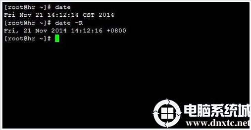

[Toc]

# 系统时间错误

**1. 查看系统时间**

```
# date
```

可以看到时区为EST（美国东部标准时间），正常显示应该是CST（中国标准时间）。


**2. 查看系统时区**

```
# date -R
可以看到输出为
Fri， 21 Nov 2014 00:54:08 -0500
时区为-5
正常时区应该显示为+8（东八区）
```


 **3. 确保网络通畅，DNS正常解析，尝试同步互联网时间**

```
# ntpdate cn.pool.ntp.org
```


 **4. 查看系统时区配置文件**

```
　# cat /etc/sysconfig/clock
```


**5. 查看本地系统时区配置文件**

```
# strings /etc/localtime
```


 **6. 尝试修改系统时区**

```
# tzselect
```

根据系统提示选择正确的时区


 **7. 如果不能正常解决**

```
# cp /usr/share/zoneinfo/Asia/Shanghai /etc/localtime
```


 **8. 再次查看系统时区和系统时间，已经正常显示了**

```
# date
# date -R
```



**9. 修改时间**

```
date -s 17:55:55  将系统时间设定成下午5点55分55秒的命令;此时只修改时间不修改日期
## 修改日期，不修改时间
date -s 2007-08-03 或者 date -s 11/03/2009
```


# 运行jar包

- **前台运行**

```
 java -Dfile.encoding=utf-8 -jar TJServer.jar
 
 -Dfile.encoding=utf-8 :运行jar文件编码设置
```

- **后台运行**

```
//运行TJServer.jar文件，并将日志写入tmp.text文件中
nohup  java -Dfile.encoding=utf-8  -jar TJServer.jar > ./tmp.text &
```

# 访问http

## `curl`

```
cur http://111.111.111.111:8082/car/list
```

## `wget`

```
wget http://111.111.111.111:8082/car/list
```

# 查找指定程序

```
### 查找nginx
[root@bj-scjg-aj-xtyy-001-4 data]# whereis nginx
nginx: /etc/nginx

### 查找passwd
[root@bj-scjg-aj-xtyy-001-4 data]# which passwd
/usr/bin/passwd
```

# 查看端口启用情况

## `lsof`

```
### 使用lsof
[root@bj-scjg-aj-xtyy-001-4 data]# lsof -i:8082
COMMAND   PID USER   FD   TYPE DEVICE SIZE/OFF NODE NAME
java     9777 root  310u  IPv6 778235      0t0  TCP *:us-cli (LISTEN)
```

## `netstat`

```
-a 表示显示所有活动的TCP连接以及计算机监听的TCP和UDP端口。
-e 表示显示以太网发送和接收的字节数、数据包数等。
-n 表示只以数字形式显示所有活动的TCP连接的地址和端口号。
-o 表示显示活动的TCP连接并包括每个连接的进程ID(PID)。
-s 表示按协议显示各种连接的统计信息，包括端口号。
```

> 查询的有协议（Proto）、本地地址（Local Address）、外部地址（Foregin Address）、状态（State）、PID（进程标识符）
>
> - Local Address：访问端口的方式，0.0.0.0 是对外开放端口，说明80端口外面可以访问；127.0.0.1 说明只能对本机访问，外面访问不了此端口；
>
> - Foregin Address：对外开放，一般都为0.0.0.0：* 
>
> - PID：此端口是那个进程在用，进程挂载此端口
>
> - State有如下状态：
>
>   
>
>       CLOSED      初始（无连接）状态。
>       LISTENING   侦听状态，等待远程机器的连接请求。
>       SYN_SEND    在TCP三次握手期间，主动连接端发送了SYN包后，进入SYN_SEND状态，等待对方的ACK包。（SYN：synchronous 同步，
>       ACK：acknowledgement 确认）
>       SYN_RECV    在TCP三次握手期间，主动连接端收到SYN包后，进入SYN_RECV状态。（RECV：receiver 收到）
>       ESTABLISHED （建立）完成TCP三次握手后，主动连接端进入ESTABLISHED状态。此时，TCP连接已经建立，可以进行通信。
>       FIN_WAIT_1   在TCP四次挥手时，主动关闭端发送FIN包后，进入FIN_WAIT_1状态。（FIN：finish 结束）
>       FIN_WAIT_2   在TCP四次挥手时，主动关闭端收到ACK包后，进入FIN_WAIT_2状态。
>       TIME_WAIT    在TCP四次挥手时，主动关闭端发送了ACK包之后，进入TIME_WAIT状态，等待最多MSL时间，让被动关闭端收到ACK包。
>       CLOSING     在TCP四次挥手期间，主动关闭端发送了FIN包后，没有收到对应的ACK包，却收到对方的FIN包，此时，进入CLOSING状态。
>       CLOSE_WAIT   在TCP四次挥手期间，被动关闭端收到FIN包后，进入CLOSE_WAIT状态。
>       LAST_ACK   在TCP四次挥手时，被动关闭端发送FIN包后，进入LAST_ACK状态，等待对方的ACK包。
>       
>       主动连接端可能的状态有：         
>               CLOSED        SYN_SEND        ESTABLISHED。
>       
>       主动关闭端可能的状态有：         
>               FIN_WAIT_1        FIN_WAIT_2        TIME_WAIT。
>       
>       被动连接端可能的状态有：         
>               LISTEN        SYN_RECV        ESTABLISHED。
>       
>       被动关闭端可能的状态有：         
>               CLOSE_WAIT        LAST_ACK        CLOSED。

```
[root@bj-scjg-aj-xtyy-001-4 data]# netstat -anp | grep 80
tcp        0      0 0.0.0.0:8086            0.0.0.0:*               LISTEN      11630/nginx: master 
tcp        0      0 0.0.0.0:8089            0.0.0.0:*               LISTEN      11630/nginx: master 
```

# 查看程序运行情况

## `ps`

> 静态查看进程运行状态

```
 ps -ef | grep tomcat
```

## `top`

> 动态查看进程状态

```
top
```

# 查看日志/文件

```
常见查看文件内容命令汇总如下：

cat     filename           查看日志，会打开整个文件，直接跑到最后面
tac     filename           查看日志，会打开整个文件，倒序显示，不常用
more    filename             查看日志，可以上下翻页，上下行移动显示
less    filename           查看日志，和more命令类似，但不能往回翻页
tail   -f   filename         查看文件，实时显示最后一页
vi        filename           查看或编辑文件
```

# PATH查看&添加

## export 命令查看所有环境变量

```
### 查看所有环境变量
[root@localhost u-boot-sh4]# export
declare -x CVS_RSH="ssh"
declare -x DISPLAY=":0.0"
declare -x G_BROKEN_FILENAMES="1"
declare -x HISTSIZE="1000"
declare -x HOME="/root"
declare -x HOSTNAME="localhost"
declare -x INPUTRC="/etc/inputrc"
declare -x LANG="zh_CN.UTF-8"
declare -x LESSOPEN="|/usr/bin/lesspipe.sh %s"
declare -x LOGNAME="root"

............
```

## 单独查看PATH环境变量

```
[root@localhost u-boot-sh4]#echo $PATH
/usr/kerberos/sbin:/usr/kerberos/bin:/usr/local/sbin:/usr/local/bin:/sbin:/bin:/usr/sbin:/usr/bin:/root/bin

### 查看JAVA_HOME变量
[root@bj-scjg-aj-xtyy-001-4 lib]# echo $JAVA_HOME
/opt/programfile/jdk1.8.0_212
```

## 临时添加

```
[root@localhost u-boot-sh4]#export PATH=/opt/STM/STLinux-2.3/devkit/sh4/bin:$PATH
```

## 永久添加

```
# vim /etc/profile
在文档最后，添加:
export PATH="/opt/STM/STLinux-2.3/devkit/sh4/bin:$PATH"
保存，退出，然后运行：
# source /etc/profile
不报错则成功。
```

## 范例：配置JDK

```
[root@localhost u-boot-sh4]# vim /etc/profile   //末尾输入以下内容

export JAVA_HOME=/usr/local/jdk1.8.0_181  #jdk安装目录 
export JRE_HOME=${JAVA_HOME}/jre
export CLASSPATH=.:${JAVA_HOME}/lib:${JRE_HOME}/lib:$CLASSPATH
export JAVA_PATH=${JAVA_HOME}/bin:${JRE_HOME}/bin
export PATH=$PATH:${JAVA_PATH}

### 重新加载配置
[root@localhost u-boot-sh4]# source /etc/profile 

###检验是否成功
java -version
```

# Linux中Crontab（定时任务）


# 参考资料

1. https://blog.csdn.net/fuhanghang/article/details/83627359
2. http://www.dnxtc.net/zixun/linux/2021-05-29/8470.html