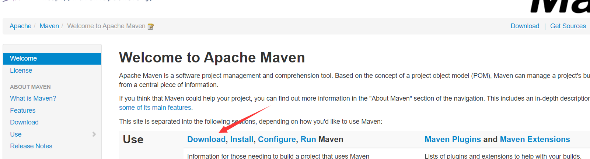
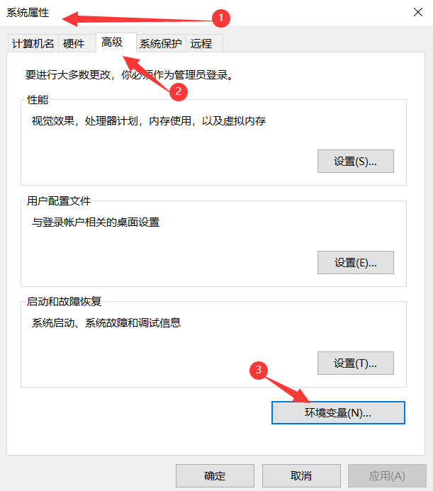
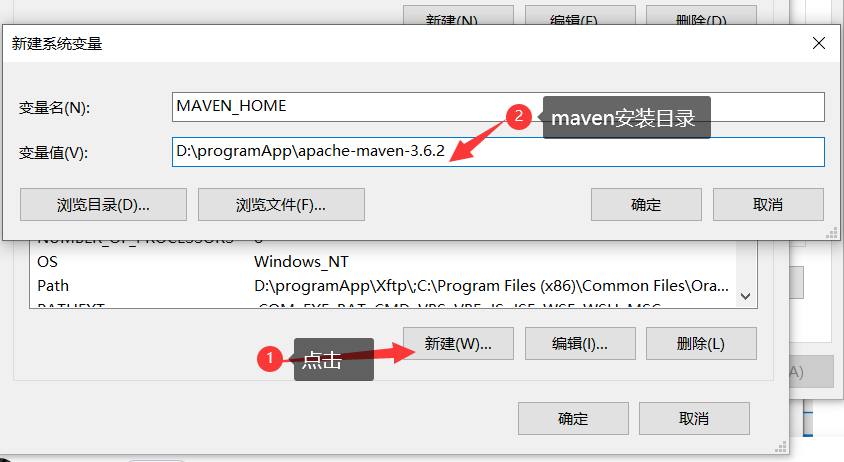
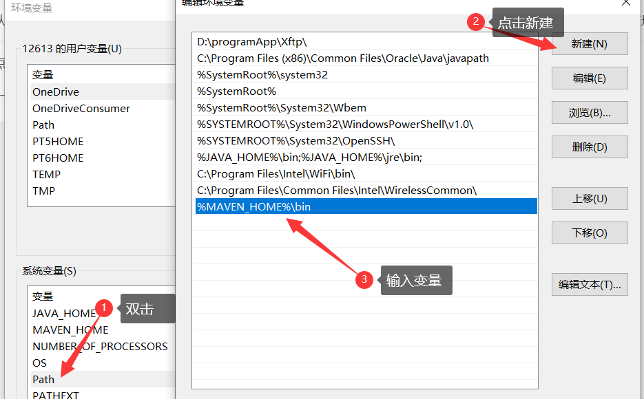
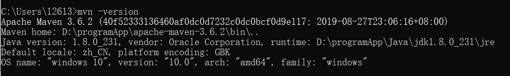

[Toc]

## Maven安装&配置

### 1. 下载

> [官网下载](https://maven.apache.org/index.html)
> 
> 
>
> 下载完成后，直接解压到指定目录下，如：D:\programApp\apache-maven-3.6.2

### 2. 环境变量配置

#### 2.1 进入环境变量配置窗口

> 方式1：右键此电脑`，点击`属性`，然后点击`高级系统设置；
> 方式2：在开始功能列表上直接搜索“环境变量”



#### 2.2 配置环境变量

> 环境变量有俩个级别：
>
> 1. 用户变量：只能是指定用户使用
> 2. 系统变量:全局的，任何用户都可使用





#### 2.3 测试配置是否成功

> 打开`cmd`，输入`mvn -version`  能成功显示版本信息，说明配置成功
> 

### 3. 配置本地仓库

- **1) 创建一个文件夹，作为本地仓库**

  > 如：D:\programApp\apache-maven-3.6.2\maven-repo

- 2）**在配置文件setting.xml添加本地仓库标签配置**

```
<localRepository>D:\programApp\apache-maven-3.6.2\maven-repo</localRepository>
```

### 4. 配置jdk

```
### 在profiles标签下配置

<profile>
    <id>myjdk</id>
    <activation>
        <activeByDefault>true</activeByDefault>
        <jdk>1.8</jdk>
    </activation>
    <properties>
        <maven.compiler.source>1.8</maven.compiler.source>
        <maven.compiler.target>1.8</maven.compiler.target>
        <maven.compiler.compilerVersion>1.8</maven.compiler.compilerVersion>
    </properties>
</profile>
```

- **在profiles同级标签下配置如下标签，使配置的jdk生效。**

```
<activeProfiles>
    <activeProfile>myjdk</activeProfile>
  </activeProfiles>
```

### 5. 配置aliyun公共仓库

- **在mirrors标签下做如下配置**

``` 
<mirror>
	<id>aliyun</id>
	<mirrorOf>central</mirrorOf>
	<name>Nexus aliyun</name>
	<url>http://maven.aliyun.com/nexus/content/groups/public</url>
</mirror>
```


## 参考资料

1. https://www.cnblogs.com/eagle6688/p/7838224.html