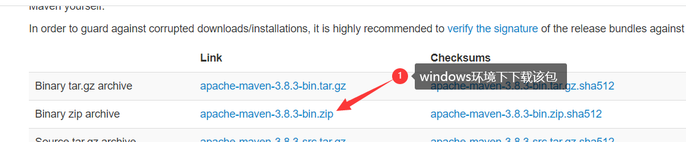
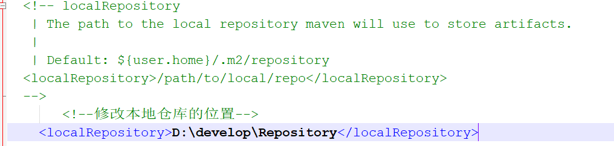

[Toc]

# 简介

```
Maven 是一个项目管理工具，它包含了一个项目对象模型 (POM：Project Object Model)
是apache组织 开源的 项目构建工具
项目构建：指的是一个项目创建，编译，测试，打包（jar包：java项目|War包：javaWeb项目），部署
        维护等流程
```

# Maven安装&配置

## 1. 下载

> [官网下载](https://maven.apache.org/index.html)
> 
> 
>
> 下载完成后，直接解压到指定目录下，如：D:\programApp\apache-maven-3.6.2
>
> - [Maven中央仓库地址](https://search.maven.org/)

## 2. 环境变量配置

### 2.1 进入环境变量配置窗口

> 方式1：右键此电脑`，点击`属性`，然后点击`高级系统设置；
> 方式2：在开始功能列表上直接搜索“环境变量”


### 2.2 配置环境变量

> 环境变量有俩个级别：
>
> 1. 用户变量：只能是指定用户使用
> 2. 系统变量:全局的，任何用户都可使用


### 2.3 测试配置是否成功

> 打开`cmd`，输入`mvn -version`  能成功显示版本信息，说明配置成功
> 

## 3. 配置本地仓库

- **1) 创建一个文件夹，作为本地仓库**

  > 如：D:\programApp\apache-maven-3.6.2\maven-repo

- 2）**在配置文件setting.xml添加本地仓库标签配置**

```
<localRepository>D:\programApp\apache-maven-3.6.2\maven-repo</localRepository>
```

## 4. 配置jdk

```
### 在profiles标签下配置

<profile>
    <id>myjdk</id>
    <activation>
        <activeByDefault>true</activeByDefault>
        <jdk>1.8</jdk>
    </activation>
    <properties>
        <maven.compiler.source>1.8</maven.compiler.source>
        <maven.compiler.target>1.8</maven.compiler.target>
        <maven.compiler.compilerVersion>1.8</maven.compiler.compilerVersion>
    </properties>
</profile>
```

- **在profiles同级标签下配置如下标签，使配置的jdk生效。**

```
<activeProfiles>
    <activeProfile>myjdk</activeProfile>
  </activeProfiles>
```

## 5. 配置aliyun公共仓库

- **在mirrors标签下做如下配置**

``` 
<mirror>
	<id>aliyun</id>
	<mirrorOf>central</mirrorOf>
	<name>Nexus aliyun</name>
	<url>http://maven.aliyun.com/nexus/content/groups/public</url>
</mirror>
```

# Maven仓库结构

```
1.默认本地库
2.如果没有就联网去中心仓库下载到本地仓库（要求网络稳定）
3.配置阿里云镜像仓库（解决跨国下载资源网络不稳定问题）
4、修改本地仓库位置
```

## 1. 默认本地库

```
本地仓库 ：用来存储从远程仓库或中央仓库下载的插件和 jar 包，项目使用一些插件或 jar 包，
优先从本地仓库查找
默认本地仓库位置在 ${user.dir}/.m2/repository，${user.dir}表示 windows 用户目录。
```


### 2. 如果没有就联网去中心仓库下载到本地仓库（要求网络稳定）

```
中央仓库 ：在 maven 软件中内置一个远程仓库地址 http://repo1.maven.org/maven2 ，它是中
央仓库，服务于整个互联网，它是由 Maven 团队自己维护，里面存储了非常全的 jar 包，它包
含了世界上大部分流行的开源项目构件
```


## 3. 配置阿里云镜像仓库（解决跨国下载资源网络不稳定问题）

```
远程仓库（阿里云云镜像仓库就是远程仓库也算是远程仓库，但是大多数公司都会有自己的远程仓库）：
如果本地需要插件或者 jar 包，本地仓库没有，默认去远程仓库下载。
远程仓库可以在互联网内也可以在局域网内
```


```
<!-- 阿里云镜像配置 -->
  <mirror>  
    <id>alimaven</id>  
    <name>aliyun maven</name>  
    <url>http://maven.aliyun.com/nexus/content/groups/public/</url>  
    <mirrorOf>central</mirrorOf>          
  </mirror>
```


## 4. 修改本地仓库位置



# Maven常用镜像

## 国内常用Maven仓库

> 国内下载依赖包比较快的镜像配置&镜像网址

```
<!-- ali--> 
	 <mirror>
		<id>nexus-aliyun</id>
		<!--<mirrorOf>*,!jeecg,!jeecg-snapshots</mirrorOf>-->
		<!--<mirrorOf>central</mirrorOf>-->
		<mirrorOf>*</mirrorOf>
		<name>Nexus aliyun</name>
		<url>http://maven.aliyun.com/nexus/content/groups/public</url>
	</mirror> 
	<!--wso2.releases-->
	<mirror>
		<id>wso2.releases</id>
		<!--<mirrorOf>*,!jeecg,!jeecg-snapshots</mirrorOf>-->
		<!--<mirrorOf>central</mirrorOf>-->
		<mirrorOf>*</mirrorOf>
		<name>WSO2 Releases Repository</name>
        <url>http://maven.wso2.org/nexus/content/repositories/releases/</url>
	</mirror> 
	 <!--wso2.public-->
	 <mirror>
		<id>wso2.public</id>
		<!--<mirrorOf>*,!jeecg,!jeecg-snapshots</mirrorOf>-->
		<!--<mirrorOf>central</mirrorOf>-->
		<mirrorOf>*</mirrorOf>
		<name>WSO2 Public Repository</name>
        <url>http://maven.wso2.org/nexus/content/repositories/public/</url>
	</mirror> 
```

1. aliyun maven：https://developer.aliyun.com/mvn/guide
2. 开源中国：http://maven.oschina.net/content/groups/public/
3. 私服nexus工具：http://www.sonatype.org/nexus/

## 中央仓库查询网址

> 当相关依赖无法下载时，可以去以下查询网站查看是否有对应的依赖包，手动下载

1. https://search.maven.org/
2. 

## 镜像网站

> 可下载Linux系统等开源软件的网站

### Linux系统镜像下载

- **企业站点**

1. 网易：http://mirrors.163.com/
2. 阿里云：https://developer.aliyun.com/
3. 淘宝：https://npmmirror.com/

- **教育**

1. 上海交通大学：http://ftp.sjtu.edu.cn/html/resources.xml
2. 华中科技大学：http://mirror.hust.edu.cn/
3. 清华大学：http://mirrors.tuna.tsinghua.edu.cn/
4. 北京理工大学：http://mirror.bit.edu.cn/web/
5. 兰州大学：http://mirror.lzu.edu.cn/
6. 中国科技大学：http://mirrors.ustc.edu.cn/
7. 大连东软信息学院：http://mirrors.neusoft.edu.cn/
8. 东北大学：http://mirror.neu.edu.cn/
9. 大连理工大学：http://mirror.dlut.edu.cn/
10. 北京交通大学：http://mirror.bjtu.edu.cn/cn/
11. 浙江大学：http://mirrors.zju.edu.cn/
12. 重庆大学：http://mirrors.cqu.edu.cn/
13. 西北农林科技大学：http://mirrors.nwsuaf.edu.cn/
14. 西北农林科技大学：http://mirrors.nwsuaf.edu.cn/

- **其他**

1. 首都在线科技股份有限公司：http://mirrors.yun-idc.com/
2. 常州贝特康姆软件技术有限公司：http://centos.bitcomm.cn/
3. 公云PubYun（母公司为贝特康姆）：http://mirrors.pubyun.com/
4. Linux运维派：http://mirrors.skyshe.cn/
5. 中国互联网络信息中心：http://mirrors.cnnic.cn/（只做Apache镜像，当前已用容量估计：120GB）
6. Fayea工作室：http://apache.fayea.com/ (只做Apache镜像，当前已用容量估计：120GB）

### Ubuntu

　　1. 阿里云：http://mirrors.aliyun.com/ubuntu-releases/
  　　2. 网易：http://mirrors.163.com/ubuntu-releases/
  　　3. 搜狐：http://mirrors.sohu.com/ubuntu-releases/
  　　4. 首都在线科技股份有限公司：http://mirrors.yun-idc.com/ubuntu-releases/

### CentOS

　　1. 网易：http://mirrors.163.com/centos/
  　　2. 搜狐：http://mirrors.sohu.com/centos/
  　　3. 阿里云：http://mirrors.aliyun.com/centos/

### Apache

1. 中国互联网络信息中心：http://mirrors.cnnic.cn/apache/

　　2. 华中科技大学：http://mirrors.hust.edu.cn/apache/
  　　3. 北京理工大学：http://mirror.bit.edu.cn/apache/
  　　4. TOMCAT全版本：https://archive.apache.org/dist/tomcat/

### MySQL

1. 北京理工大学：http://mirror.bit.edu.cn/mysql/Downloads/
2. 中国电信天翼云：http://mirrors.ctyun.cn/Mysql/
3. 搜狐镜像源：http://mirrors.sohu.com/mysql/

### PostgreSQL

1. 浙江大学：http://mirrors.zju.edu.cn/postgresql/

### MariaDB

1. 中国电信天翼云：http://mirrors.ctyun.cn/MariaDB/

### VideoLAN

1. 大连东软信息学院：http://mirrors.neusoft.edu.cn/videolan/
2. 中国科技大学：http://mirrors.ustc.edu.cn/videolan-ftp/

### PHP

1. php全版本：https://secure.php.net/releases/

### Eclipse

1. 中国科技大学：http://mirrors.ustc.edu.cn/eclipse/
2. 中国科学院: http://mirrors.opencas.cn/eclipse/
3. 东北大学：http://ftp.neu.edu.cn/mirrors/eclipse/，http://mirror.neu.edu.cn/eclipse/

### Android SDK

1. 中国科学院：http://mirrors.opencas.ac.cn/android/repository/
2. 南洋理工学院：http://mirror.nyist.edu.cn/android/repository/
3. 中国科学院：http://mirrors.opencas.cn/android/repository/
4. 腾讯：http://android-mirror.bugly.qq.com:8080/android/repository/（限流，不推荐）
5. 大连东软信息学院：http://mirrors.neusoft.edu.cn/android/repository/（同步效果不如中科院的镜像，不推荐）

### Xcode

1. 腾讯：http://android-mirror.bugly.qq.com:8080/Xcode/（从7.2之后不再更新，建议直接从官网下载）

### 容器

1. lxc国内镜像源：https://mirrors.tuna.tsinghua.edu.cn/lxc-images/

### 官方镜像列表状态地址

1. CentOS：http://mirror-status.centos.org/#cn
2. Archlinux: https://www.archlinux.org/mirrors/status/
3. Ubuntu：https://launchpad.net/ubuntu/+cdmirrors
4. Debian：http://mirror.debian.org/status.html
5. Fedora Linux/Fedora EPEL：https://admin.fedoraproject.org/mirrormanager/mirrors
6. Apache：http://www.apache.org/mirrors/#cn
7. Cygwin：https://www.cygwin.com/mirrors.html


# Maven项目结构

```
1.src/main/java —— 存放项目的.java 文件
2.src/main/resources —— 存放项目资源文件，如 spring, hibernate 配置文件
3.src/test/java —— 存放所有单元测试.java 文件，如 JUnit 测试类
4.src/test/resources —— 测试资源文件
5.target —— 项目输出位置，编译后的 class 文件会输出到此目录
6.pom.xml——maven 项目核心配置文件

* 注意：如果是普通的 java 项目，那么就没有 webapp 目录。
```


# POM配置

## `dependencyManagement`

## `build`

# Maven常用命令

## 创建Maven的普通Java项目

```
 mvn archetype:create
  -DgroupId=packageName
  -DartifactId=projectName 

```

## 创建Maven的Web项目

```
 mvn archetype:create
  -DgroupId=packageName   
  -DartifactId=webappName
  -DarchetypeArtifactId=maven-archetype-webapp  
```

## 清除产生的项目

```
mvn clean

clean 是 maven 工程的清理命令，执行 clean 会删除 target 目录及内容。
```

## 编译源代码

```
mvn compile

compile 是 maven 工程的编译命令
作用: 将 src/main/java 下的文件编译为 class 文件输出到 target目录下。
```

## 测试

```
mvn test

test 是 maven 工程的测试命令 mvn test
作用： 会执行 src/test/java 下的单元测试类。
```

## 打包

```
mvn package

package 是 maven 工程的打包命令
作用： （1）对于 java 工程执行 package 打成 jar 包
      （2）对于 web 工程打成 war包。
```

## 安装

```
mvn install

install 是 maven 工程的安装命令
作用：执行 install 将 maven 打成 jar 包或 war 包发布到本地仓库。

从运行结果中，可以看出：
当后面的命令执行时，前面的操作过程也都会自动执行！
```

## 本地仓库手工打入jar包

```
防止当前使用jar包在中心仓库没有;手工导入自己创建的jar包：

mvn install:install-file 
          -DgroupId=com.tjcu
          -DartifactId=ojdbc 
          -Dversion=14.0 
          -Dpackaging=jar 
          -Dfile=F:\百知笔记JavaWeb\JDBC\jdbc_day3\lib\mysql-connector-java-8.0.16.jar
```

## 删除下载失败的命令

```
注意：maven所有下载失败的jar包标识：.lastUpdated结尾文件
这些下载失败的文件引起的问题：
1、下载想导入成功的jar包，失败的jar会占用位置，导致项目报错
2、占存储空间
```


### 下载失败jar包解决办法：

```
我们手写一个bat文件，使用循环的办法将本地仓库中下载失败的jar包进行自动删除
```

自动删除失败jar包的脚本，删除maven仓库中的失败文件.bat


脚本源码：

```
@echo off
rem create by sunhao(sunhao.java@gmail.com)
rem crazy coder
  
rem 这里写你的仓库路径
set REPOSITORY_PATH=D:\develop\Repository
rem 正在搜索...
for /f "delims=" %%i in ('dir /b /s "%REPOSITORY_PATH%\*lastUpdated*"') do (
    del /s /q %%i
)
rem 搜索完毕
pause
```

# Maven在IDEA常用操作

## 更新本地仓库中的索引

让idea知道你的本地仓库更新了


# 参考资料

1. https://www.cnblogs.com/eagle6688/p/7838224.html
2. https://www.cnblogs.com/ringbug/p/15184590.html
3. http://www.voycn.com/article/shishangzuixiangxidemavenshiyongbijijianyishoucang
4. http://k.sina.com.cn/article_2547637062_97d9db4600100eh5e.html