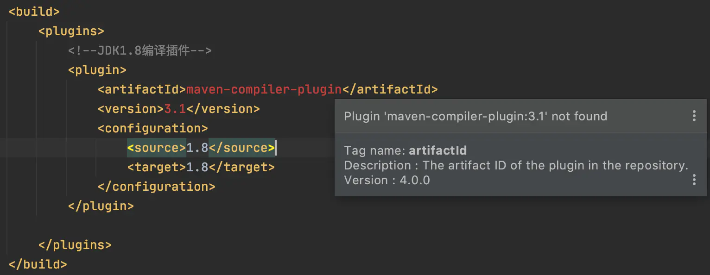
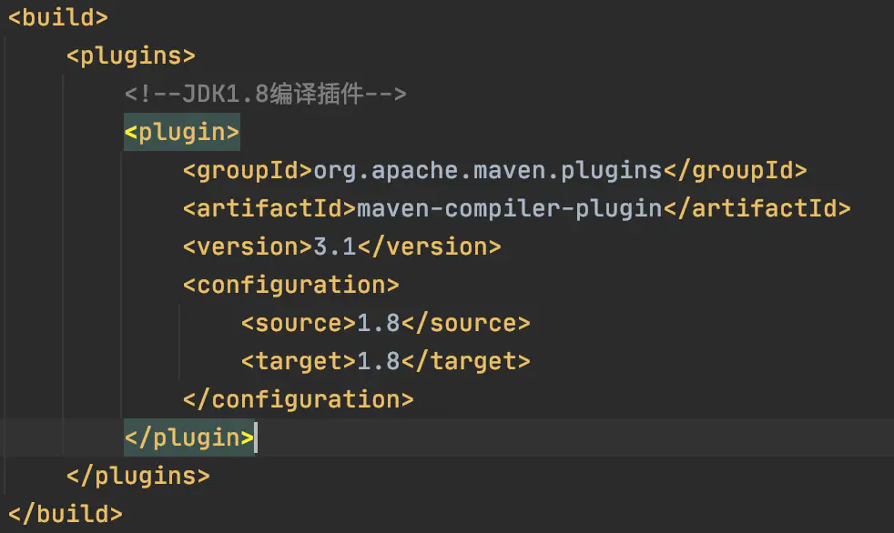
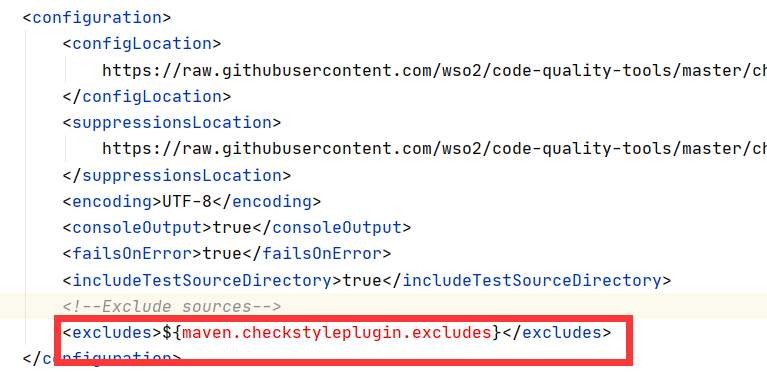

[Toc]

# `Plugin 'maven-compiler-plugin:3.1' not found`

- **问题描述**

- **探索&解决**
  首先，确认 idea 的 jdk 版本 和 pom.xml 中指定的版本一致
   然后，确认 idea 使用的 maven 是自己的，不是 idea 自带的
   最后，发现解决方法是添加： `<groupId>org.apache.maven.plugins</groupId>`

  

  

# `properties`定义的变量无法引用

- **问题描述**

在pom文件中，一些已经定义好的变量在一些配置标签中无法获取

# 在idea中打开maven项目pom.xml未识别

在idea中打开maven项目pom.xml没有识别出来,导致idea不能自动下载依赖包,

解决办法是选中pom.xml文件,右键-" add as maven project"

# 参考资料

1. https://www.jianshu.com/p/9466132d51c6
2. https://www.cnblogs.com/qinxu/p/11039475.html