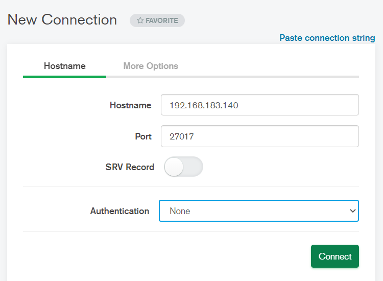

[Toc]

# 1. 简介

> MongDB一个以JSON为数据模型的文档数据库。文档的概率来源于“JSON Document”,并非我们一般理解的PDF，WORD文档。
> MongDB俩个发布版本：
> 1）社区版：基于SSPL,一种和AGPL基本类似的开源协议；
> 2）企业版：基于商业协议，需付费使用
>
> [MongoDB文档说明](https://docs.mongodb.com/)

## 1.1 MongoDB VS 关系型数据库

|              | MongoDB                                         | RDBMS                  |
| ------------ | ----------------------------------------------- | ---------------------- |
| 数据模型     | 文档模型                                        | 关系模型               |
| 数据库类型   | OLTP                                            | OLTP                   |
| CRUD操作     | MQL/SQL                                         | SQL                    |
| 高可用       | 复制集                                          | 集群模式               |
| 横向扩展能力 | 通过原生分片完善支持                            | 数据分区或者应用侵入式 |
| 索引支持     | B-树，全文索引，地理位置索引，多建索引，TTL索引 | B树                    |
| 开发难度     | 容易                                            | 困难                   |
| 数据容量     | 没有理论上限                                    | 千万，亿               |
| 扩展方式     | 垂直扩展+水平扩展                               | 垂直扩展               |

## 1.2 MongoDB特色和优势

- **优势**

> - 简单直观：以自然的方式来建模，以直观的方式来与数据库交互
>   范例：一目了然的对象模型。
>
>   
>
> - 结构灵活：弹性模式从容响应需求的频繁变化；
>
>   - 多形性：同一个集合中可以包含不同字段(类型)的文档对象；
>   - 动态性：线上修改数据模式，修改时应用于数据库均无须下线，如可以动态的增加字段；
>   - 数据治理：支持使用JSON Schema来规范数据模式。在保证模式灵活动态的前提下，提供数据治理能力
>
> - 快速开发：做更多的事，写更少的代码
>
>   - 数据库引擎只需要在一个存储区读写；
>   - 反范式、无关联的组织极大优化查询速度；
>   - 程序API自然，开发快速
>
> - 原生的高可用和横向扩展能力
>   **高可用**
>
>   - Replica Set-2 to 50个成员
>     默认部署模式：三个节点
>
>     
>
>   - 自恢复；
>
>   - 多中心容灾能力
>
>   - 滚动服务- 最小化服务终端
>
>   **横向扩展能力**
>   
>
>   - 需要的时候无缝扩展；
>   - 应用全透明
>   - 多种数据分布策略；
>   - 轻松支持TB-PB数量级

- **优势总结**

> - JSON结构和对象模型接近，开发代码量低；
> - JSON的动态模型意味着更容易响应新的业务需求；
> - 复制集提供99.999%高可用；
> - 分片架构支持海量数据和无缝扩容

# 2. 安装

## 2.1 本地安装&配置

> - 操作系统：`centos-release-7-8.2003.0.el7.centos.x86_64`
>
> - MongoDB[下载网址](https://www.mongodb.com/try/download/community)
>
> - 下载版本：server的社区版本
>   

### 2.1.1 安装与启动

> ```
>### 解压mongoDB到目录/data/db
> [root@mysql test]# tar -xvf mongodb-linux-x86_64-rhel70-5.0.4.tgz -C /data/db
>### 配置环境变量以及数据集和日志
> [root@mysql data]# export PATH=$PATH:/data/mongodb-linux-x86_64-rhel70-5.0.4/bin
> [root@mysql /]# source /etc/profile #刷新，使配置文件立即生效
> ### 前台启动：MongDB的默认启动方式为前台启动。所谓的前台启动就是MongDB启动进程后会占用当前的终端窗口
>[root@mysql data]# mongod --dbpath /data/db --port 27017 --logpath /data/db/mongod.log
> --dbpath :指定数据文件存放目录
> --logpath: 指定日志文件，注意是指定文件不是目录
> --logappend :使用追加的方式记录日志；
> --port :指定端口，默认端口27017
> --bind_ip :绑定服务ip，若绑定127.0.0.1，则只能本机访问，默认我本机地址
> 
> ### 后台启动：所谓的后台启动就是以守护进程的方式启动MongoDB,命令中添加--fork即可。
> [root@mysql data]# mongod --dbpath /data/db --port 27017 --logpath /data/db/mongod.log --logappend --bind_ip 0.0.0.0 --fork
> 通过命令启动的方式并不适合管理，毕竟每次输入命令都需要考虑各参数的配置。我们可以通过配置文件来配置启动参数，然后通过指定配置文件的方式启动服务，这样在管理MonggoDB上就比较方便。
> 
> ### 结束启动：在命令后面加 --shutdown
> [root@mysql bin]# mongod --dbpath /data/db --port 27017 --logpath /data/db/mongod.log --logappend --bind_ip 0.0.0.0 --fork --shutdown
> 或者使用(暴力终止，不建议使用)
> kill -9 pid 
> ### 若是前台启动，可以直接使用ctrl+c关闭
> ### MongoDB函数关闭
> 1）连接数据MongoDB
> [root@mysql bin]# mongo
> 2）切换数据库
> > use admin
> switched to db admin
> 3）执行以下函数(2选1)即可关闭服务
> > db.shutdownServer();
> server should be down...
> > db.runCommand("shutdown")
> 
> ```

### 2.1.2 以配置文件启动

在bin目录下增加一个mongodb.conf配置文件

> ```
>### 在bin目录下创建配置文件mongodb.conf
> [root@mysql bin]# vim mongodb.conf 
># 数据文件存放目录
> dbpath = /data/db
> # 日志文件存放目录
> logpath = /data/db/mongod.log
># 以追加方式记录日志
> logappend = true
> # 访问端口默认为 27017
> port = 27017
> # 对访问IP地址不做限制，默认为本机地址；若要允许远程访问把 bind_ip=127.0.0.1 这一行注释掉或者是修改成 bind_ip=0.0.0.0，最好是直接注释掉，因为在centos下，使用bind_ip=0.0.0.0会报错。
> bind_ip = 0.0.0.0
> # 以守护进程的方式启动，即在后台运行
> fork = true
> 
> ### 启动mongoDB
> [root@mysql bin]# mongod -f mongodb.conf
> about to fork child process, waiting until server is ready for connections.
> forked process: 4074
> child process started successfully, parent exiting
> ### 结束MongoDB启动
> [root@mysql bin]# mongod -f mongodb.conf --shutdown
> 
> ```
> 

### 2.1.3 配置开机自启动

```
### 1).在/lib/systemd/system/目录下新建mongodb.service文件，内容如下
[root@mysql system]# vim /lib/systemd/system/mongodb.service
[Unit]
Description=mongodb
# remote-fs.target nss-lookup.target 
After=network.target

[Service]
Type=forking
ExecStart=/data/mongodb/bin/mongod --config /data/mongodb/bin/mongodb.conf
ExecStop=/data/mongodb/bin/mongod --config /data/mongodb/bin/mongodb.conf --shutdown
PrivateTmp = true

[Install]
WantedBy=multi-user.target


### 2).设置权限
[root@mysql system]# chmod 754 /lib/systemd/system/mongodb.service

### 启动关闭服务，设置开机启动
重载systemctl配置
[root@localhost php-fpm.d]# systemctl daemon-reload 
#启动服务 
systemctl start mongodb.service   
#关闭服务   
systemctl stop mongodb.service   
#开机启动   
systemctl enable mongodb.service 
```


### 2.1.2 安装工具包

> 上述安装后，发现bin下没有mongodbimport等工具，需要手动安装工具包

1. **下载工具包**
   [工具包下载网址](https://www.mongodb.com/try/download/database-tools)


2. **将压缩包bin文件里的程序复制到你的mongoDB的bin文件夹下**

## 2.2 导入样本数据

```
### 下载样本数据
[root@mysql data]# curl -O -k https://raw.githubusercontent.com/tapdata/geektime-mongodb-course/master/aggregation/dump.tar.gz
### 解压
[root@mysql data]# tar -xvf dump.tar.gz 
### 导入数据，mongorestore 恢复数据库文件：默认dump目录下数据文件，一般与mongodump结合使用
[root@mysql data]# mongorestore  
### 查看数据
1. 进入mongodb
[root@mysql data]# mongo
2. 查看数据库
> show dbs;
admin   0.000GB
config  0.000GB
local   0.000GB
mock    0.047GB
> use mock  //切换数据库
switched to db mock
> show collections;  //查看集合
orders
> db.orders.findOne();  //查看集合一条记录
3. 退出数据库操作界面
输入 exit 或者使用 Ctrl+c
> exit
Bye

```

## 2.3 使用MongDB提供的免费的云服务

> mongodb提供了免费的云服务，可以将数据放在该云服务上

1. **注册**

   > 使用个人邮箱，注册，登录
   >
   > https://cloud.mongodb.com/v2#/org/61a73fbfa934fa04254bf14d/projects

   

2. **创建数据库**


3. **选择集群区域和集群类型**

   > 区域可选择亚洲区域，免费集群类型是默认的三个分片集群


4. **配置连接IP&创建用户**


5. **选择连接方式**


6. **shell连接**


# 3. Mongodb GUI工具

> - Studio 3T
> - Robo 3T(Robomong)
> - Navicat for MongoDB
> - NoSQLBooster for MongoDB
> - NoSQL Manager for MongoDB Professional
> - Mongodb Compass

## 3.1 Mongodb Compass

- **下载mongodb图形化工具**[mongodb compass下载网址](https://www.mongodb.com/try/download/compass)

- MongoDB官方亲儿子系列，官方自己推出的GUI可视化管理工具，功能有限。免费简洁，不支持SQL查询，支持性能监控。适用于Windows,macOS和Linux系统

- **连接数据库**



- **Mongodb compass操作**


### 安装后无法连接数据库

- **问题详情**：无法使用MongoDB Compass成功连接数据库


- **原因&解决方案**

1. **原因探索**

> ```
> 1. 确认是否是因为防火墙导致无法连接
> ### 查看防火墙状态
> [root@mysql ~]# firewall-cmd --state
> not running
> 
> 防火墙处于关闭状态，所以不是防火墙问题。
> 其他防火墙操作：
> 1）开放端口
> firewall-cmd --zone=public --add-port=5672/tcp --permanent   # 开放5672端口
> firewall-cmd --zone=public --remove-port=5672/tcp --permanent  #关闭5672端口
> firewall-cmd --reload   # 配置立即生效
> 
> 2）查看防火墙所有开放的端口
> firewall-cmd --zone=public --list-ports
> 
> 3）关闭防火墙
> 如果要开放的端口太多，嫌麻烦，可以关闭防火墙，安全性自行评估
> systemctl stop firewalld.service
> 
> 2. 查看监听的端口
> PS:centos7默认没有 netstat 命令，需要安装 net-tools 工具，yum install -y net-tools
> [root@mysql ~]# netstat -lnpt
> Active Internet connections (only servers)
> Proto Recv-Q Send-Q Local Address           Foreign Address         State       PID/Program name    
> tcp        0      0 0.0.0.0:22              0.0.0.0:*               LISTEN      940/sshd            
> tcp        0      0 127.0.0.1:25            0.0.0.0:*               LISTEN      1081/master         
> tcp        0      0 127.0.0.1:27017         0.0.0.0:*               LISTEN      3087/mongod         
> tcp6       0      0 :::22                   :::*                    LISTEN      940/sshd            
> tcp6       0      0 ::1:25                  :::*                    LISTEN      1081/master         
> tcp6       0      0 :::3306                 :::*                    LISTEN      988/mysqld   
> 
> 检查端口被哪个进程占用
> netstat -lnpt |grep 5672
> 
> 3. 查看Mongo是否正常运行
> 1）首先要先打开并运行 mongodb 数据库： (即：在 CMD 中输入mongo命令)
> [root@mysql bin]# mongo
> MongoDB shell version v5.0.4
> connecting to: mongodb://127.0.0.1:27017/?compressors=disabled&gssapiServiceName=mongodb
> Implicit session: session { "id" : UUID("5cbb25a1-9618-4597-9f6c-e1a36a00c4ef") }
> MongoDB server version: 5.0.4
> 
> 2）检测 MongoDB 数据库是否已经成功运行
> 在浏览器中输入地址为：http://localhost:27017/ 查看是否可以正常显示。若显示不正常，则说明未启动远程访问权限
> ### 配置远程访问
> 方式1： 在mongodb.conf配置文件中限定IP访问
> bind_ip = 192.168.183.140
> 方式2：若不限定IP访问，则把 bind_ip=127.0.0.1 这一行注释掉或者是修改成 bind_ip=0.0.0.0，最好是直接注释掉，因为在centos下，使用bind_ip=0.0.0.0会报错。
> ```

## 3.2 Studio 3T

- [官网下载](https://studio3t.com/download/)
- 超过100,000的开发人员和数据库管理员使用Studio 3T作为MongoDB GUI的首选，30天的免费试用期，Studio 3T具有更多更强大的功能并提供企业支持服务，支持副本集，独立主机和分片集群连接，支持导入导出，SQL查询语法填充，支持MongoDB 4.0+等等，适用于Windows,MacOS和Linux。
- Studio功能全面，推荐使用

## 3.3 Robo 3T(Robomong)(推荐)

- [官网下载地址](https://robomongo.org/download)

> Robo 3T的前身是Robomongo,后被3T公司收购，是一款免费开源的GUI管理工具。支持MongoDB4.0+,轻量级GUI，支持语法填充等等。适用于Windows,macOS和Linux系统。

## 3.4 Navicat for MongoDB

- [官网下载](https://www.navicat.com/en/download/navicat-for-mongodb)
- 老牌的数据库管理工具，支持多种数据库的集成，已集成MongoDB类型，属于付费型管理工具。优点是用会了一个DB版的Navicat,所有DB版都会很顺手，维持一套操作习惯，如果再肌肉记忆一些快捷键，会更加高效。

## 3.5 NoSQLBooster for MongoDB

- [官网下载]( https://nosqlbooster.com/)
- NoSQLBooster for MongoDB(原名MongoBooster)风格类似EasyUI,支持副本集，独立主机和分片集群连接，提供了全面的服务器监控工具，fluent查询构建器，SQL查询，查询代码，任务调度，ESNext支持和真正的智能感知体验等。提供了付费和免费俩种版本。适用于Windows,macOS和Linux系统

## 3.6 NoSQL Manager for MongoDB Professional

- [官网下载](https://www.mongodbmanager.com/download)
- 从2.2到4.4全面支持MongoDB和MongoDB Enterprise版本。功能齐全的MongoDB UI Shell。具有代码自动完成功能，语法突出显示和提示。支持副本集，独立主机和分片集群连接，导入导出，简单查看和管理所有MongoDB对象：数据库、集合、视图、索引、用户、角色和功能等等。提供了付费和免费俩种版本

# 4. MongoDB用户与权限管理

> 防止数据攻击方式
> 1. 启用身份验证；
>
>    ```
>    ### 在mongodb.conf配置文件中开启身份验证
>    # 开启身份认证
>    auth = true
>    ```
>
> 2. 不允许远程访问或者添加IP访问限制
>
>    ```
>    ### 在mongodb.conf配置文件中限定IP访问
>    # 对访问IP地址不做限制，默认为本机地址
>    bind_ip = 192.168.183.140
>    ```
>
>    

## 4.1 常用权限

| 权限                 | 说明                                                         |
| -------------------- | ------------------------------------------------------------ |
| read                 | 允许用户读取指定数据库                                       |
| readwrite            | 允许用户读写指定数据库                                       |
| userAdmin            | 允许用户向system.users 集合写入，赋予用户所有分片和复制集相关函数和管理权限 |
| dbAdmin              | 允许用户在指定数据库中执行管理函数，如索引创建、删除，查看统计或访问system.profile |
| clusterAdmin         | 必须在admin数据库中定义，赋予用户所有分片和复制集相关函数的管理权限 |
| readAnyDatabase      | 必须在admin数据库中定义，赋予用户所有数据库的读权限          |
| readWriteAnyDatabase | 必须在admin数据库中定义, 赋予用户所有数据库的读写权限        |
| userAdminAnyDatabase | 必须在admin数据库中定义,赋予用户所有数据库的userAdmin权限    |
| dbAdminAnyDatabase   | 必须在admin数据库中定义，赋予用户所有数据库dbAdmin权限       |
| root                 | 必须在admin数据库中定义,超级账号，超级权限                   |

## 4.2 创建管理用户

> MongoDB 有一个用户管理机制，简单描述为管理用户组，这个组的用户时专门为管理普通用户而设的，暂且称之为管理员。
> 管理员通常没有数据库的读写权限，只有操作用户的权限，我们只需要赋予管理员`userAdminAnyDatabase`角色即可。另外管理员**账户必须在admin数据库下创建**
>
> 由于用户被创建在哪个数据库下，就只能在哪个数据库登录，所以把所有用户都创建在admin数据库下。这样我们切换数据库时就不需要频繁的进行登录了。
> 先user admin切换至admin数据库进行登录，登录后再use切换其他数据库进行操作即可。第二次的use就不需要再次登录了。MongoDB设定use第二个数据库时，如果登录用户权限比较高就可以直接操作第二个数据库，而不需要登录。

### 4.2.1 切换至admin数据库

> 管理员需要在admin数据库下创建，所以需要先切换至admin数据库

```
1. 进入MongoDB数据库操作页面
[root@mysql bin]# mongo
2. 切换至admin数据库
> use admin
switched to db admin

```

### 4.2.2 查看用户

```
### 查看admin数据库中所有用户信息：新安装的MongoDB admin库中没有用户信息
> db.system.users.find();
```

### 4.2.3 创建用户

在MongoDB中可以使用`db.createUser({用户信息})`函数创建用户

```
db.createUser({
	user: "<name>", //用户名
	pwd: "<cleartext password>", //密码
	customData: {<any information>}, //用户自定义数据，可忽略
	roles: [   //数组类型，配置用户权限
        {role:"<role>",db:"<database>" }|<role>,
        ....
   ]
})
```

- 范例

````
> db.createUser({user:"joy01",pwd:"joy01",roles:[{role:"userAdminAnyDatabase",db:"admin"}]})
Successfully added user: {
        "user" : "joy01",
        "roles" : [
                {
                        "role" : "userAdminAnyDatabase",
                        "db" : "admin"
                }
        ]
}

````

### 4.2.4 重启服务

管理员账号创建完成后，需要重启MongoDB,并开启身份验证功能。先通过`db.shutdownServer()`函数关闭服务

```
### 因为使用的是配置文件启动，所以需要在mongodb.conf文件中添加身份认证配置
# 开启身份认证，若不开启，则不需身份认证也可操作，不按照
auth = true

### 配置好后，重启服务
[root@mysql bin]# mongod -f mongodb.conf
about to fork child process, waiting until server is ready for connections.

### 重新进入数据库
[root@mysql bin]# mongo
> show dbs;  //此时发现无法看到数据库信息
> use admin
switched to db admin
> db.auth("joy01","joy01")  //登录认证：1  表示认证成功，0 表示认证失败
1
> show dbs
admin   0.000GB
config  0.000GB
local   0.000GB
mock    0.047GB

```

## 4.3 创建普通用户

需求：创建一个test数据库，给这个数据库添加一个用户，用户名为testuser，密码为123456，并授予该用户对test数据库的读写操作权限

### 4.3.1 管理员登录数据库

普通用户需要有管理员用户创建，所以先使用管理员用户登录数据库

```
> use admin
switched to db admin
> db.auth("joy01","joy01")  //登录认证：1  表示认证成功，0 表示认证失败
1
```

### 4.3.2 创建数据库

MongoDB没有特定创建数据库的语法，在使用use切换数据库时，如果对应的数据库不存在则直接创建并切换

```
> use test
switched to db test
> show dbs;  //因为test数据库中没有数据，所以不会显示，但是该数据库是可以进行操作的
admin   0.000GB
config  0.000GB
local   0.000GB
mock    0.047GB

```

### 4.3.3 创建用户

```
> db.createUser({user:"testuser",pwd:"123456",roles:[{role:"readWrite",db:"test"}]})
Successfully added user: {
        "user" : "testuser",
        "roles" : [
                {
                        "role" : "readWrite",
                        "db" : "test"
                }
        ]
}
```

### 4.3.4 身份认证

打开一个新的客户端连接，切换至test数据库，执行文档插入语句，返回信息如下

```
> use test
switched to db test
> db.auth("testuser","123456")
1
> show users //会显示无权限查看users信息，只有读写权限，没有users权限
uncaught exception: Error: not authorized on test to execute command { usersInfo: 1.0, lsid: { id: UUID("0961e2e8-a286-447f-9c2e-7df1c797c77e") }, $db: "test" } :
_getErrorWithCode@src/mongo/shell/utils.js:25:13
DB.prototype.getUsers@src/mongo/shell/db.js:1635:15
shellHelper.show@src/mongo/shell/utils.js:933:9
shellHelper@src/mongo/shell/utils.js:838:15
@(shellhelp2):1:1
### 登录成功后即可进行该用户所拥有的角色对应的权限的其他操作，执行以下语句测试该用户的读写操作权限是否可用
> db.user.insert({"name":"zhangsan"})
WriteResult({ "nInserted" : 1 })
> db.user.find()
{ "_id" : ObjectId("61a8e7aaf67de31412a213ec"), "name" : "zhangsan" }
```

## 4.4 更新用户

### 4.4.1 更新角色

如果需要对已存在的用户进行角色修改，可以使用`db.updateUser()`函数来更新用户角色。注意：执行该函数需要当前用户具有`userAdmin`或者`userAdminAnyDatabase`或`root`角色
```
db.updateUser("用户名",{"roles":[{"role":"角色名称",db:"数据库"},{"更新项2":"更新内容"}]})
```
比如给刚才的`joy01`用户再添加`readWriteAnyDatabase`和`dbAdminAnyDatabase`权限

```
> use admin
switched to db admin
> db.auth("joy01","joy01")
1
>  db.updateUser("joy01",{"roles":[{role:"userAdminAnyDatabase",db:"admin"},{role:"readWriteAnyDatabase",db:"admin"},{role:"dbAdminAnyDatabase",db:"admin"}]})
```

> 当更新不小心把用户的`userAdminAnyDatabase`权限给覆盖了，导致该用户无法进行用户数据更新/删除等操作，可以按时关闭身份认证`auth = true`，重启数据库，恢复该用户的用户操作权限后，再重新开启身份认证。

### 4.4.2 更新密码

更新用户密码有以下俩种方式，更新密码时需要切换到该用户所在的数据库。注意：需要使用具有`userAdmin`或`userAdminAnyDatabase`或`root`角色的用户执行
- 使用`db.updateUser("用户名",{"pwd":"新密码"})`函数更新密码；
- 使用`db.changeUserPassword("用户名","新密码")`函数更新密码

```
> db.changeUserPassword("joy01","123")
> db.updateUser("joy01",{"pwd":"joy01"})
```

## 4.5 删除用户

通过`db.dropUser()`函数可以删除指定用户，删除成功后会返回true.删除用户时需要切换到该用户所在的数据库。注意：需要使用具有	`userAdmin`或`userAdminAnyDatabase`或者`root`角色的用户才可以删除其他用户

```
> use admin
switched to db admin
> db.auth("joy01","joy01")
1
> use test
switched to db test
> show users
{
        "_id" : "test.testuser",
        "userId" : UUID("6ecbbba5-2c68-4f19-a904-f7128954d40b"),
        "user" : "testuser",
        "db" : "test",
        "roles" : [
                {
                        "role" : "readWrite",
                        "db" : "test"
                }
        ],
        "mechanisms" : [
                "SCRAM-SHA-1",
                "SCRAM-SHA-256"
        ]
}
> db.dropUser("testuser")
true
> show users
> 
```

# 5. MongoDB 操作

## 5.1 数据库(Database)操作

### 5.1.1  查看数据库

```
### 查看数据库,若数据库没有数据，不显示该数据库
> show dbs
admin   0.000GB
config  0.000GB
local   0.000GB
mock    0.047GB
> show databases;
admin   0.000GB
config  0.000GB
local   0.000GB
mock    0.047GB

注意：
1. 不同角色看见的数据库时不一样的，管理员看见所有数据库，普通用户只能看见自己的数据库；
2. 新创建数据库里面没有数据时通过show dbs或show databases 是无法查看到的，需要向数据库新增一个document(db.jqk.insert({"key":"value","key2":"value2"}))才能看见
```

### 5.1.2 创建&切换数据库

```
### 创建&切换数据库:若该数据库不存在，则直接创建并切换到该数据库下；若该数据库存在，则切换到该数据库下
> use admin
switched to db admin
```

### 5.1.3 删除数据库

```
### 删除数据库需要切换到需要删除的数据库中，且登录用户具有dbAdminAnyDatabase权限，执行db.dropDatabase()
> use admin
switched to db admin
> db.auth("joy01","joy01")
1
> use test
> db.dropDatabase()
{ "ok" : 1 }
```

## 5.2 集合(Collection)操作

MongoDB中的集合是一组文档的集，相当于关系型数据库中的表

### 5.2.1 创建集合

- MongoDB使用`db.createCollection()`函数来创建集合
  **语法格式**：`db.createCollection(name,options)`
  name :要创建的集合名称。options:可选参数，指定有关内存大小及索引的选项
- 除了显示的创建，也可以使用 `db.table1.insert()`通过插入数据直接创建

| 字段        | 类型 | 描述                                                         |
| ----------- | ---- | ------------------------------------------------------------ |
| capped      | 布尔 | (可选)如果为true，则创建固定集合。固定集合是指有固定大小的集合，<br/>当达到最大值时，它会自动覆盖最早的文档。当该值为true时，必须指定size参数 |
| size        | 数值 | (可选)限制集合空间的大小，默认没有限制(以字节计)。如果capped为true,必须指定该字段 |
| autoIndexId | 布尔 | (可选) 如果为true,自动在_id字段创建索引。默认为true          |
| max         | 数值 | (可选) 限制集合中包含文档的最大数量，默认为没有限制          |

```
> use admin
switched to db admin
> db.auth("joy01","joy01")
1
> use test
switched to db test
> db.user.insert({"name":"lisi"})  //使用插入数据的方式创建集合
WriteResult({ "nInserted" : 1 })
> db.createCollection("user1") //使用createCollection("user1")函数显示创建集合
{ "ok" : 1 }
> show tables
user
user1

```

### 5.2.2 查看集合

```
### 方式1
> show tables
user
### 方式2
> show collections
user
user1
```

### 5.2.3 删除集合

通过`db.COLLECTION_NAME.drop()`删除集合

```
> db.user1.drop()
true
> show tables
user
```

## 5.3 文档(Document)操作

### 5.3.1 插入文档

#### 5.3.1.1 单条插入

可以使用`insert` `insertOne` `save`插入单条文档

```
> db.user.insert({"name":"a"})
> db.user.insertOne({"name":"b"})
> db.user.save({"name":"c"})
> db.user.find()
{ "_id" : ObjectId("61aa13d5d5df80b40c81a36f"), "name" : "lisi" }
{ "_id" : ObjectId("61aa1690d5df80b40c81a370"), "name" : "a" }
{ "_id" : ObjectId("61aa16a3d5df80b40c81a371"), "name" : "b" }
{ "_id" : ObjectId("61aa16bbd5df80b40c81a372"), "name" : "c" }
```

##### insert

通过 `db.COLLECTION_NAME.insert(document)`插入文档
插入文档时，如果没有指定`_id`则默认为`ObjectId`类型，`_id`不能重复，且在插入后不可变

```
### 插入复杂数据类型数据时，为了美观和直观，可以定义变量然后在使用insert插入
user1={
    "name":"zhangsan",
    "age":18,
    "hobbies":["music","read"],
    "addr":{
        "country":"China",
        "city":"BJ"
        }
    }
db.user.insert(user1)
```


##### insertOne

在MongoDB3.2版本后，提供了`insertOne()`函数用于插入单条文档

```
user2={
    "name":"lisi",
    "age":20,
    "hobbies":["music","read"],
    "addr":{
        "country":"China",
        "city":"SH"
        }
    }
db.user.insertOne(user2)
```

##### save

如果不指定`_id`字段`save()`方法等同于`insert()`方法。如果指定`_id`,则变为更新文档的操作

```
user3={
    "_id":"3",
    "name":"wangwu",
    "age":20,
    "hobbies":["music","read"],
    "addr":{
        "country":"China",
        "city":"SH"
        }
    }
db.user.save(user3)
```

#### 5.3.1.2 批量插入

可以使用`insert` `insertMany` `save` 插入多条文档。区别在于把单条插入时函数参数对象`{}`变为数组类型`[{}]`:
- `db.c1.insert([{name:"a"},{name:"b"}])`
- `db.c1.insertMany([{name:"a"},{name:"b"}])`
- `db.c1.save([{name:"a"},{name:"b"}])`

##### insert

```
user1={
    "name":"joy01",
    "age":21,
    "hobbies":["music","read"],
    "addr":{
        "country":"China",
        "city":"SH"
        }
    }
    
user2={
    "name":"joy02",
    "age":23,
    "hobbies":["music","read"],
    "addr":{
        "country":"China",
        "city":"SH"
        }
    }
    
 user3={
    "name":"joy03",
    "age":13,
    "hobbies":["music","read"],
    "addr":{
        "country":"China",
        "city":"BJ"
        }
    }
db.user.insert([user1,user2,user3])
```

##### insertMany

```
db.user.insertMany([user1,user2,user3])
```

##### save

```
db.user.save([user1,user2,user3])
```

### 5.3.2 更新文档

通过`update`系列函数或者`save`函数课可以更新集合中的文档。
`update()`函数用于更新已存在的文档。语法格式如下

```
db.COLLETION_NAME.update(query,update,options)

query: update的查询条件，类似SQL update语句中的where部分
update: update的对象和一些更新的操作符(如$,$inc...)等，也可以理解为SQL update语句中的set部分
upsert: 可选，如果不存在update的文档，是否插入该文档。true为插入，默认false,不插入
multi: 可选，是否批量更新。true表示按条件查询出来的多条记录全部更新，false只更新找到的第一条记录，默认是false
```

```
user1={
    "name":"joy01",
    "age":21,
    "hobbies":["music","read"],
    "addr":{
        "country":"China",
        "city":"SH"
        }
    }
    
# 修改单条
db.user.updateOne({"name":"joy01"},{"$set":user1})
# 查找到的匹配数据如果是多条，只会修改第一条；修改单条等价于updateOne()
db.user.update({"name":"lisi"},user1)
# 修改多条
db.user.update({"name":"joy01"},{"$set":user1},false,true)
# 修改多条
db.user.updateMany({"name":"joy01"},{"$set":user1},false,true)
```

> **注意**：更新文档是更新整个文档的操作，如果修改的值只有name和age,除了`_id`以外的其他属性将会被删除

#### 5.3.2.1 更新操作符

##### $set

`$set`操作符：定义字段集——已存在字段和需新增字段集合。

- 当`$set`定义的集合中的字段，在原文档中已存在，会以`$set`中定义的值对该字段进行更新；

- 当`$set`定义的集合中的字段，在原文档中不存在，则会新增字段

- **语法格式**

  ```
  { $set: { <newField>: <expression>, ... } }
  ```

```
db.user.updateOne({"name":"joy01"},{"$set":{"name":"joy001"}})
db.user.updateOne({"name":"joy01"},{"$set":{"name":"joy001","sex":"women"}})
```

##### $inc

1. 适用于数字类型

2. 能够对键对应的数字类型数值进行加减操作

- **语法格式**

`{$inc:{field:value}}`

```
# 使符合name=joy01的一个文档age 减去5
db.user.update({"name":"joy01"},{"$inc":{"age":-5}})
```

##### $unset

- 从文档中删除指定字段

- **语法格式**:数字可以随便，正负数和0都有效，其结果都是移除指定的字段

```
# 移除单个字段
{ $unset: {"<field>":数字} }
# 删除多个字段
{ $unset: [ {"<field1>":num}, {"<field2>":num}, ... ] }
# 移除单个嵌套字段
{ $unset: {"<field.nestedfield>" :num}}
# 移除多个嵌套字段
{ $unset: [ {"<field1.nestedfield>":num}, ...] }
```

- **范例**

```
### 删除name=joy001的sex字段
> db.user.update({"name":"joy001"},{$unset:{"sex":1}})
db.user.updateMany({"name":"joy001"},{$unset:{"sex":0}})
```

#####  $push

1. 如果指定的字段是数组则追加新的值

2. 如果指定的字段不是数组则中断当前操作，报错

3. 如果不存在指定的字段则创建数组类型的键值对

- **语法格式**

```
{$push:{field:value}}
```

- 范例

```
### 如果指点的字段不是数组会报错
db.user.update({"name":"joy03"},{$push:{"name":"lisi"}})
The field 'name' must be an array but is of type string in document {_id: ObjectId('61aa2412619398f698aaa24f')}

### 如果指定的字段是数组，会将新的值追加到该数组
db.user.update({"name":"joy03"},{$push:{"hobbies":"sing"}})
{
    "_id" : ObjectId("61aa2412619398f698aaa24f"),
    "name" : "joy03",
    "age" : 13.0,
    "hobbies" : [ 
        "music", 
        "read", 
        "sing"
    ],
    "addr" : {
        "country" : "China",
        "city" : "BJ"
    }
}

### 如果不存在指定的字段，则会自动创建数组类型的键值对
db.user.update({"name":"joy03"},{$push:{"activities":{"sing":"haha","read":"dd"}}})
{
    "_id" : ObjectId("61aa2412619398f698aaa24f"),
    "name" : "joy03",
    "age" : 13.0,
    "hobbies" : [ 
        "music", 
        "read", 
        "sing"
    ],
    "addr" : {
        "country" : "China",
        "city" : "BJ"
    },
    "activities" : [ 
        {
            "sing" : "haha",
            "read" : "dd"
        }
    ]
}

```

##### **$pushAll**

- **用法同上，是批量添加数组数据的操作**

- **语法格式**

`{$pushAll:{field:array}}`

##### $pull

**$pull push的逆向操作，删除键是数组的项目中的指定元素**

- **语法格式**

`{$pull:{field:value}}`

##### $pullAll

如果匹配任意值，从数据中删除相应的对象

##### $addToSet

如果不存在，则增加一个值到数组


### 5.3.3 删除文档

#### 5.3.3.1 删除单个文档

```
remove 语法格式
db.user.remove(<query>,{justOne:<boolean>})

参数说明
query:(可选) 删除的文档的条件
justOne ：(可选)如果设为true则只删除一个文档，false删除所有匹配的数据，等价于
db.user.deleteOne(<query>) :删除符合条件的第一个文档
```

- **范例**

```
db.user.remove({"name":"joy001"},{"justOne":true})
db.user.remove({"name":"joy001"},{"justOne":true})
```

#### 5.3.3.2 批量删除

```
### 删除所有数据
db.user.remove({})
db.user.deleteMany({})

### 有嵌入文档，且内容含有"country":"China"的全部删除
db.user.deleteMany({"addr.country":"China"})
### 删除id大于等于3的所有
db.user.deleteMany({"_id":{"$gte":3}})
```

### 5.3.4 查询文档

#### 查询所有

```
### find()方法以非结构化的方式来显示所有文档
db.getCollection('user').find({})
db.user.find()
db.user.find({})

### 结构化(JSON纵向)显示查询数据
> db.user.find().pretty()

### 去重：只显示去重字段
db.user.distinct("name")
```

#### 比较运算

| Name                                                         | Description                                                  |
| :----------------------------------------------------------- | :----------------------------------------------------------- |
| [`$eq`](https://docs.mongodb.com/manual/reference/operator/query/eq/#mongodb-query-op.-eq) | Matches values that are equal to a specified value.          |
| [`$gt`](https://docs.mongodb.com/manual/reference/operator/query/gt/#mongodb-query-op.-gt) | Matches values that are greater than a specified value.      |
| [`$gte`](https://docs.mongodb.com/manual/reference/operator/query/gte/#mongodb-query-op.-gte) | Matches values that are greater than or equal to a specified value. |
| [`$in`](https://docs.mongodb.com/manual/reference/operator/query/in/#mongodb-query-op.-in) | Matches any of the values specified in an array.             |
| [`$lt`](https://docs.mongodb.com/manual/reference/operator/query/lt/#mongodb-query-op.-lt) | Matches values that are less than a specified value.         |
| [`$lte`](https://docs.mongodb.com/manual/reference/operator/query/lte/#mongodb-query-op.-lte) | Matches values that are less than or equal to a specified value. |
| [`$ne`](https://docs.mongodb.com/manual/reference/operator/query/ne/#mongodb-query-op.-ne) | Matches all values that are not equal to a specified value.  |
| [`$nin`](https://docs.mongodb.com/manual/reference/operator/query/nin/#mongodb-query-op.-nin) | Matches none of the values specified in an array.            |

```
> db.user.find({"_id":{"$gte":3}})
```

#### 逻辑运算

| Name                                                         | Description                                                  |
| :----------------------------------------------------------- | :----------------------------------------------------------- |
| [`$and`](https://docs.mongodb.com/manual/reference/operator/query/and/#mongodb-query-op.-and) | Joins query clauses with a logical `AND` returns all documents that match the conditions of both clauses. |
| [`$not`](https://docs.mongodb.com/manual/reference/operator/query/not/#mongodb-query-op.-not) | Inverts the effect of a query expression and returns documents that do *not* match the query expression. |
| [`$nor`](https://docs.mongodb.com/manual/reference/operator/query/nor/#mongodb-query-op.-nor) | Joins query clauses with a logical `NOR` returns all documents that fail to match both clauses. |
| [`$or`](https://docs.mongodb.com/manual/reference/operator/query/or/#mongodb-query-op.-or) | Joins query clauses with a logical `OR` returns all documents that match the conditions of either clause. |

- **范例**

```
### 逻辑与
MongoDB中字典内用逗号分隔多个条件时and关系，或者直接用$and
# 查询name="zhangsan"且"age"=18的文档
db.user.find({"name":"zhangsan","age":18})
# 查询name="zhangsan"且18<="age"<=22的文档
db.user.find({"name":"zhangsan","age":{"$gte":15,"$lte":22}})
db.user.find({"$and":[{"name":"zhangsan"},{"age":{"$gte":18,"$lte":22}}]})

### 逻辑或
db.user.find({"$or":[{"name":"zhangsan"},{"name":"lisi"}]})

### 逻辑非
# age 不为 模2余1的文档
db.user.find({"age":{"$not":{"$mod":[2,1]}}})
```

#### 成员运算

| Name                                                         | Description                                            |
| :----------------------------------------------------------- | :----------------------------------------------------- |
| [`$exists`](https://docs.mongodb.com/manual/reference/operator/query/exists/#mongodb-query-op.-exists) | Matches documents that have the specified field.       |
| [`$type`](https://docs.mongodb.com/manual/reference/operator/query/type/#mongodb-query-op.-type) | Selects documents if a field is of the specified type. |

##### `$type`操作符

`$type`查询字段类型

支持类型&对应数值如下：

| Type                       | Number | Alias                 | Notes                      |
| :------------------------- | :----- | :-------------------- | :------------------------- |
| Double                     | 1      | "double"              |                            |
| String                     | 2      | "string"              |                            |
| Object                     | 3      | "object"              |                            |
| Array                      | 4      | "array"               |                            |
| Binary data                | 5      | "binData"             |                            |
| ObjectId                   | 7      | "objectId"            |                            |
| Boolean                    | 8      | "bool"                |                            |
| Date                       | 9      | "date"                |                            |
| Null                       | 10     | "null"                |                            |
| Regular Expression         | 11     | "regex"               |                            |
| JavaScript                 | 13     | "javascript"          |                            |
| JavaScript code with scope | 15     | "javascriptWithScope" | Deprecated in MongoDB 4.4. |
| 32-bit integer             | 16     | "int"                 |                            |
| Timestamp                  | 17     | "timestamp"           |                            |
| 64-bit integer             | 18     | "long"                |                            |
| Decimal128                 | 19     | "decimal"             | New in version 3.4.        |
| Min key                    | -1     | "minKey"              |                            |
| Max key                    | 127    | "maxKey"              |                            |

```
### 查询name为字符串的数据
db.user.find({name:{"$type":2}}).pretty()
```

#### 正则

| Name                                                         | Description                                                  |
| :----------------------------------------------------------- | :----------------------------------------------------------- |
| [`$expr`](https://docs.mongodb.com/manual/reference/operator/query/expr/#mongodb-query-op.-expr) | Allows use of aggregation expressions within the query language. |
| [`$jsonSchema`](https://docs.mongodb.com/manual/reference/operator/query/jsonSchema/#mongodb-query-op.-jsonSchema) | Validate documents against the given JSON Schema.            |
| [`$mod`](https://docs.mongodb.com/manual/reference/operator/query/mod/#mongodb-query-op.-mod) | Performs a modulo operation on the value of a field and selects documents with a specified result. |
| [`$regex`](https://docs.mongodb.com/manual/reference/operator/query/regex/#mongodb-query-op.-regex) | Selects documents where values match a specified regular expression. |
| [`$text`](https://docs.mongodb.com/manual/reference/operator/query/text/#mongodb-query-op.-text) | Performs text search.                                        |
| [`$where`](https://docs.mongodb.com/manual/reference/operator/query/where/#mongodb-query-op.-where) | Matches documents that satisfy a JavaScript expression.      |

```
### 正则定义在 / / 里
> db.user.find({'name':/^z.*?(n|u)$/i})
```

#### 投影

> MongoDB投影意思是指选择必要的数据而不是选择一整个文档的数据。
> 在MongoDB中，当执行find()方法，那么它会显示一个文档所有字段。要限制这一点，需要设置字段列表值1或0
> 1 显示
> 0 不显示
>
> _id会默认显示

```
### 查询显示字段name,age
db.user.find({"name":"zhangsan"},{"_id":0,"name":1,"age":1})
{ "name" : "zhangsan", "age" : 18 }
```

#### 数组

| Name                                                         | Description                                                  |
| :----------------------------------------------------------- | :----------------------------------------------------------- |
| [`$all`](https://docs.mongodb.com/manual/reference/operator/query/all/#mongodb-query-op.-all) | Matches arrays that contain all elements specified in the query. |
| [`$elemMatch`](https://docs.mongodb.com/manual/reference/operator/query/elemMatch/#mongodb-query-op.-elemMatch) | Selects documents if element in the array field matches all the specified [`$elemMatch`](https://docs.mongodb.com/manual/reference/operator/query/elemMatch/#mongodb-query-op.-elemMatch) conditions. |
| [`$size`](https://docs.mongodb.com/manual/reference/operator/query/size/#mongodb-query-op.-size) | Selects documents if the array field is a specified size.    |

```
### 查询hobbies数组中含有dancing的文档
db.user.find({"hobbies":"dancing"})

### 查询hobbies中既有read又有sing数据
db.user.find({"hobbies":{"$all":["read","sing"]}})
### 查询hobbies 索引2 为 read的人(数组索引从0开始计算)
db.user.find({"hobbies.2":"read"})
### 查询所有人第1个到第3个爱好。{}为查询所有，第二个{}为显示条件。范围为左闭右开
db.user.find({},{"_id":0,"name":0,"age":0,"addr":0,"hobbies":{"$slice":[0,2]}})
### 查询所有人最后俩个爱好
db.user.find({},{"_id":0,"name":0,"age":0,"addr":0,"hobbies":{"$slice":-2}})
### 查询子文档有country=China的数据
db.user.find({"addr.country":"China"})
```

#### 排序

> MongDB中使用`sort()`方法对数据进行排序，sort()方法可以通过参数指定排序的字段，并使用1和-1指定排序方式，1 为升序排序，-1 为降序排序

```
### 按名字正序
db.user.find().sort({"name":1})
### 按年龄倒序，id正序
db.user.find().sort({"age":-1,"_id":1})
```

#### 分页

limit 限定所取文档数量，skip 跳过几个文档
分页公式`db.user.find().skip((pageNum-1)*pageSize).limit(pageSize)`

```
### 取前俩个文档
db.user.find().limit(2).skip(0)
### 取第三和第四个文档
db.user.find().limit(2).skip(2)
```

#### 统计

```
### 查询age>18的人数
db.user.count({"age":{"$gt":18}})
db.user.find({"age":{"$gt":18}}).count()
```

### 5.3.4 聚合

- **管道(Pipeline)&步骤(Stage)**
整个聚合运算过程称为管道(Pipeline),它是由多个步骤(Stage)组成的
每个管道：
1）接受一系列文档(原始数据)；
2）每个步骤对这些文档进行一系列运算；
3）结果文档输出给下一步骤


MongoDB聚合为aggregate，主要用到的聚合函数如下

| Name                                                         | Description                                                  |
| :----------------------------------------------------------- | :----------------------------------------------------------- |
| [`$accumulator`](https://docs.mongodb.com/manual/reference/operator/aggregation/accumulator/#mongodb-group-grp.-accumulator) | Returns the result of a user-defined accumulator function.   |
| [`$addToSet`](https://docs.mongodb.com/manual/reference/operator/aggregation/addToSet/#mongodb-group-grp.-addToSet) | Returns an array of *unique* expression values for each group. Order of the array elements is undefined.*Changed in version 5.0*: Available in [`$setWindowFields`](https://docs.mongodb.com/manual/reference/operator/aggregation/setWindowFields/#mongodb-pipeline-pipe.-setWindowFields) stage. |
| [`$avg`](https://docs.mongodb.com/manual/reference/operator/aggregation/avg/#mongodb-group-grp.-avg) | Returns an average of numerical values. Ignores non-numeric values.*Changed in version 5.0*: Available in [`$setWindowFields`](https://docs.mongodb.com/manual/reference/operator/aggregation/setWindowFields/#mongodb-pipeline-pipe.-setWindowFields) stage. |
| [`$count`](https://docs.mongodb.com/manual/reference/operator/aggregation/count-accumulator/#mongodb-group-grp.-count) | Returns the number of documents in a group.Distinct from the [`$count`](https://docs.mongodb.com/manual/reference/operator/aggregation/count/#mongodb-pipeline-pipe.-count) pipeline stage.*New in version 5.0*: Available in [`$group`](https://docs.mongodb.com/manual/reference/operator/aggregation/group/#mongodb-pipeline-pipe.-group) and [`$setWindowFields`](https://docs.mongodb.com/manual/reference/operator/aggregation/setWindowFields/#mongodb-pipeline-pipe.-setWindowFields) stages. |
| [`$first`](https://docs.mongodb.com/manual/reference/operator/aggregation/first/#mongodb-group-grp.-first) | Returns a value from the first document for each group. Order is only defined if the documents are sorted.Distinct from the [`$first`](https://docs.mongodb.com/manual/reference/operator/aggregation/first-array-element/#mongodb-expression-exp.-first) array operator.*Changed in version 5.0*: Available in [`$setWindowFields`](https://docs.mongodb.com/manual/reference/operator/aggregation/setWindowFields/#mongodb-pipeline-pipe.-setWindowFields) stage. |
| [`$last`](https://docs.mongodb.com/manual/reference/operator/aggregation/last/#mongodb-group-grp.-last) | Returns a value from the last document for each group. Order is only defined if the documents are sorted.Distinct from the [`$last`](https://docs.mongodb.com/manual/reference/operator/aggregation/last-array-element/#mongodb-expression-exp.-last) array operator.*Changed in version 5.0*: Available in [`$setWindowFields`](https://docs.mongodb.com/manual/reference/operator/aggregation/setWindowFields/#mongodb-pipeline-pipe.-setWindowFields) stage. |
| [`$max`](https://docs.mongodb.com/manual/reference/operator/aggregation/max/#mongodb-group-grp.-max) | Returns the highest expression value for each group.*Changed in version 5.0*: Available in [`$setWindowFields`](https://docs.mongodb.com/manual/reference/operator/aggregation/setWindowFields/#mongodb-pipeline-pipe.-setWindowFields) stage. |
| [`$mergeObjects`](https://docs.mongodb.com/manual/reference/operator/aggregation/mergeObjects/#mongodb-expression-exp.-mergeObjects) | Returns a document created by combining the input documents for each group. |
| [`$min`](https://docs.mongodb.com/manual/reference/operator/aggregation/min/#mongodb-group-grp.-min) | Returns the lowest expression value for each group.*Changed in version 5.0*: Available in [`$setWindowFields`](https://docs.mongodb.com/manual/reference/operator/aggregation/setWindowFields/#mongodb-pipeline-pipe.-setWindowFields) stage. |
| [`$push`](https://docs.mongodb.com/manual/reference/operator/aggregation/push/#mongodb-group-grp.-push) | Returns an array of expression values for documents in each group.*Changed in version 5.0*: Available in [`$setWindowFields`](https://docs.mongodb.com/manual/reference/operator/aggregation/setWindowFields/#mongodb-pipeline-pipe.-setWindowFields) stage. |
| [`$stdDevPop`](https://docs.mongodb.com/manual/reference/operator/aggregation/stdDevPop/#mongodb-group-grp.-stdDevPop) | Returns the population standard deviation of the input values.*Changed in version 5.0*: Available in [`$setWindowFields`](https://docs.mongodb.com/manual/reference/operator/aggregation/setWindowFields/#mongodb-pipeline-pipe.-setWindowFields) stage. |
| [`$stdDevSamp`](https://docs.mongodb.com/manual/reference/operator/aggregation/stdDevSamp/#mongodb-group-grp.-stdDevSamp) | Returns the sample standard deviation of the input values.*Changed in version 5.0*: Available in [`$setWindowFields`](https://docs.mongodb.com/manual/reference/operator/aggregation/setWindowFields/#mongodb-pipeline-pipe.-setWindowFields) stage. |
| [`$sum`](https://docs.mongodb.com/manual/reference/operator/aggregation/sum/#mongodb-group-grp.-sum) | Returns a sum of numerical values. Ignores non-numeric values.*Changed in version 5.0*: Available in [`$setWindowFields`](https://docs.mongodb.com/manual/reference/operator/aggregation/setWindowFields/#mongodb-pipeline-pipe.-setWindowFields) stage. |

- **测试数据**

```
db.emp.insert({"EMPNO":7369,"ENAME":"SMITH","JOB":"CLERK","MGR":7902,"HIREDATE":"1980-12-17","SAL":800,"COMM":null,"DEPTNO":20})
db.emp.insert({"EMPNO":7499,"ENAME":"ALLEN","JOB":"SALESMAN","MGR":7698,"HIREDATE":"1981-02-20","SAL":1600,"COMM":300,"DEPTNO":30})
db.emp.insert({"EMPNO":7521,"ENAME":"WARD","JOB":"SALESMAN","MGR":7698,"HIREDATE":"1981-02-22","SAL":1250,"COMM":500,"DEPTNO":30})
db.emp.insert({"EMPNO":7566,"ENAME":"JONES","JOB":"MANAGER","MGR":7839,"HIREDATE":"1981-04-02","SAL":2975 ,"COMM":null,"DEPTNO":20})
db.emp.insert({"EMPNO":7654,"ENAME":"MARTIN","JOB":"SALESMAN","MGR":7698,"HIREDATE":"1981-09-28","SAL":1250,"COMM":1400,"DEPTNO":30})
db.emp.insert({"EMPNO":7698,"ENAME":"BLAKE","JOB":"MANAGER","MGR":7839,"HIREDATE":"1981-01-05","SAL":2850,"COMM":null,"DEPTNO":30})
db.emp.insert({"EMPNO":7782,"ENAME":"CLARK","JOB":"MANAGER","MGR":7839,"HIREDATE":"1981-06-09","SAL":2450,"COMM":null,"DEPTNO":10})
db.emp.insert({"EMPNO":7839,"ENAME":"KING","JOB":"PRESIDENT","MGR":null,"HIREDATE":"1981-11-17","SAL":5000,"COMM":null,"DEPTNO":10})
db.emp.insert({"EMPNO":7844,"ENAME":"TURNER","JOB":"SALESMAN","MGR":7698,"HIREDATE":"1981-08-09","SAL":1500,"COMM":0,"DEPTNO":30})
db.emp.insert({"EMPNO":7900,"ENAME":"JAMES","JOB":"CLERK","MGR":7698,"HIREDATE":"1981-03-12","SAL":950,"COMM":null,"DEPTNO":30})
db.emp.insert({"EMPNO":7902,"ENAME":"FORD","JOB":"ANALYST","MGR":7566,"HIREDATE":"1981-03-12","SAL":3000,"COMM":null,"DEPTNO":20})
db.emp.insert({"EMPNO":7934,"ENAME":"MILLER","JOB":"CLERK","MGR":7782,"HIREDATE":"1982-01-23","SAL":1300,"COMM":null,"DEPTNO":10})
> db.dept.insert({"DEPTNO":10,"DNAME":"ACCOUNTING","LOC":"NEW YORK"})
db.dept.insert({"DEPTNO":20,"DNAME":"RESEARCH","LOC":"DALLAS"})
db.dept.insert({"DEPTNO":30,"DNAME":"SALES","LOC":"CHICAGO"})
db.dept.insert({"DEPTNO":40,"DNAME":"OPERATIONS","LOC":"BOSTON"})
```

```
### 工资>300,每种工作的平均工资
db.emp.aggregate([
{"$match":{"SAL":{"$gt":300}}},
{"$group":{"_id":"$JOB","avg_salary":{"$avg":"$SAL"}}}
])

### 获取每种工作的平均工资，最大工资，最小工资
db.emp.aggregate([
{"$match":{"SAL":{"$gt":300}}},
{"$group":{"_id":"$JOB","avg_salary":{"$avg":"$SAL"},"min_sal":{"$min":"$SAL"},"max_sal":{"$max":"$SAL"}}}
])

### 获取平均工资大于5000的工作
db.emp.aggregate([
{"$match":{"SAL":{"$gt":300}}},
{"$group":{"_id":"$JOB","avg_salary":{"$avg":"$SAL"},"min_sal":{"$min":"$SAL"},"max_sal":{"$max":"$SAL"}}},
{"$match":{"avg_salary":{"$gt":5000}}},
])

### 获取每种工作的人数，并排序
db.emp.aggregate([
{"$group":{"_id":"$JOB","count":{"$sum":1}}},
{"$sort":{"count":1}}
])

### $project 用于设定字段显示

### $limit 限定显示数据量 $skip:跳过数据设置
db.emp.aggregate([
{"$group":{"_id":"$JOB","count":{"$sum":1}}},
{"$sort":{"count":1}},
{"$limit":2},
{"$skip":1}
])
```

### 5.3.4 索引

#### 创建索引

- 基本语法格式
`db.COLLECTION_NAME.ensureIndex({KEY:1})`
KEY  索引字段   1  指定按升序创建索引  -1 执行按降序创建索引

```
### 创建name索引
db.user.ensureIndex({"name":1})
### 指定索引名称
db.user.ensureIndex({"name":1},{"name":"nameIndex"})
```

#### 查询索引

```
db.user.getIndexes()
```

#### 删除索引

- 语法格式

```
db.COLLECTION_NAME.dropIndex(INDEX_NAME)
INDEX_NAME 为索引表中 name字段值
### 删除name索引
> db.user.getIndexes()
[ { "v" : 2, "key" : { "_id" : 1 }, "name" : "_id_" } ]

db.user.dropIndex("name_1")
```

# 6. MongoDB常用命令

```
命令操作前提：进入MongoDB操作界面
[root@mysql bin]# mongo
### 清屏
> cls
```

# 7. Python&MongoDB

## 7.1 安装Python MongoDB驱动程序

> Python pip 是 Python 包管理工具，该工具提供了对Python 包的查找、下载、安装、卸载的功能。目前如果你在 [python.org](https://www.python.org/) 下载最新版本的安装包，则是已经自带了该工具。
> *注意：Python 2.7.9 + 或 Python 3.4+ 以上版本都自带 pip 工具。*
>
> pip 官网：https://pypi.org/project/pip/
>
> 你可以通过以下命令来判断是否已安装：
>
> ```
> pip --version     # Python2.x 版本命令
> pip3 --version    # Python3.x 版本命令
> ```

1. 安装Python**MongoDB**驱动第三方库"pymongo"
在Python中使用MongdoDB前必须先安装用于访问数据库的驱动程序
```
### 安装pip2
1)首先安装epel扩展源
yum -y install epel-release

2) 然后再安装pip
yum -y install python-pip
3) 升级pip
pip install --upgrade pip

### 安装pip3
yum install -y python3-pip

### 修改python指向：默认指向python2,将Python 指向改为指向python3
[root@mysql bin]# which python
/usr/bin/python
[root@mysql bin]# ll python*
lrwxrwxrwx. 1 root root     7 12月  5 04:22 python -> python2
lrwxrwxrwx. 1 root root     9 12月  5 04:22 python2 -> python2.7
-rwxr-xr-x. 1 root root  7144 11月 16 2020 python2.7
lrwxrwxrwx. 1 root root     9 12月  5 03:51 python3 -> python3.6
-rwxr-xr-x. 2 root root 11328 11月 16 2020 python3.6
lrwxrwxrwx. 1 root root    17 12月  5 04:27 python3.6-config -> python3.6m-config
-rwxr-xr-x. 2 root root 11328 11月 16 2020 python3.6m
-rwxr-xr-x. 1 root root   173 11月 16 2020 python3.6m-config
-rwxr-xr-x. 1 root root  3403 11月 16 2020 python3.6m-x86_64-config
lrwxrwxrwx. 1 root root    16 12月  5 04:27 python3-config -> python3.6-config
1) 查看yum安装的python3安装路径
[root@mysql bin]# rpm -ql python3
/usr/bin/pydoc3
/usr/bin/pydoc3.6
/usr/bin/python3
/usr/bin/python3.6
说明我们安装的是python3.6版本，路径为 /usr/bin/pydoc3.6
2）修改软连接，将Python的软连接连接到Python3
[root@mysql bin]# ln -snf /usr/bin/python3.6 /usr/bin/python
注意：如果提示/usr/bin/python 已经存在，需要先删掉，然后重新执行以上命令
3）查看当天python版本信息
[root@mysql bin]# python -V
Python 3.6.8
### 注意事项：
修改软连接后yum无法正常使用，因为yum调用了python，他的启动程序/usr/bin/yum就是一个python脚本 
yum是不兼容 Python3的，所以yum不能正常工作，我们需要指定 yum 的Python版本
解决方案：同样将文件头部的
1）将文件/usr/bin/yum头部的 #!/usr/bin/python 改成 #!/usr/bin/python2
2）修改/usr/libexec/urlgrabber-ext-down 同样将文件头部的 #!/usr/bin/python 改为 #!/usr/bin/python2

### 安装pymongo
pip install pymongo

## 安装pymongo报错：
Command "python setup.py egg_info" failed with error code 1 in /tmp/pip-build-anND1C/pip/
原因：pip版本过低
解决方案：更新pip版本
[root@mysql bin]# pip3 install --upgrade pip
一般默认pip是2.x版本，可以直接使用pip3命令，或者修改pip命令连接
[root@mysql bin]# ln -snf /usr/bin/pip3.6 /usr/bin/pip
```
2. **检查驱动程序**
在python交互模式下导入pymongo,检查驱动是否已正确安装
```
[root@mysql bin]# python
Python 3.6.8 (default, Nov 16 2020, 16:55:22) 
[GCC 4.8.5 20150623 (Red Hat 4.8.5-44)] on linux
Type "help", "copyright", "credits" or "license" for more information.
>>> import pymongo
>>> pymongo.version
'4.0'
```

- **测试pymongo安装是否成功**

```
### 1) 新建demo_test_mongodb.py文件
[root@mysql javatest]# vim demo_test_mongodb.py
#!/usr/bin/python3
 
import pymongo
### 2）执行demo_test_mongodb.py；如果没有出现错误，表示安装成功。
[root@mysql javatest]# python demo_test_mongodb.py

```


# 参考资料来源

1. https://www.bilibili.com/video/BV13a4y1J7L6?p=5&spm_id_from=pageDriver
2. https://www.bilibili.com/video/BV16r4y1Q7J6?p=9&spm_id_from=pageDriver
3. https://www.mongodb.com/
4. https://docs.mongodb.com/