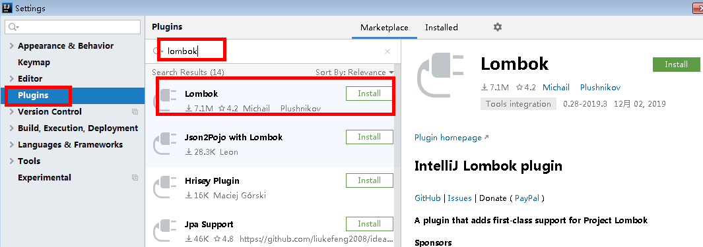

[Toc]

# 简介

[MyBatis-Plus (opens new window)](https://github.com/baomidou/mybatis-plus)（简称 MP）是一个 [MyBatis (opens new window)](https://www.mybatis.org/mybatis-3/)的增强工具，在 MyBatis 的基础上只做增强不做改变，为简化开发、提高效率而生。

[中文说明文档](https://mp.baomidou.com/guide/quick-start.html)

[项目Git网址](https://github.com/baomidou/mybatis-plus)


## 特性

- **无侵入**：只做增强不做改变，引入它不会对现有工程产生影响，如丝般顺滑
- **损耗小**：启动即会自动注入基本 CURD，性能基本无损耗，直接面向对象操作
- **强大的 CRUD 操作**：内置通用 Mapper、通用 Service，仅仅通过少量配置即可实现单表大部分 CRUD 操作，更有强大的条件构造器，满足各类使用需求
- **支持 Lambda 形式调用**：通过 Lambda 表达式，方便的编写各类查询条件，无需再担心字段写错
- **支持主键自动生成**：支持多达 4 种主键策略（内含分布式唯一 ID 生成器 - Sequence），可自由配置，完美解决主键问题
- **支持 ActiveRecord 模式**：支持 ActiveRecord 形式调用，实体类只需继承 Model 类即可进行强大的 CRUD 操作
- **支持自定义全局通用操作**：支持全局通用方法注入（ Write once, use anywhere ）
- **内置代码生成器**：采用代码或者 Maven 插件可快速生成 Mapper 、 Model 、 Service 、 Controller 层代码，支持模板引擎，更有超多自定义配置等您来使用
- **内置分页插件**：基于 MyBatis 物理分页，开发者无需关心具体操作，配置好插件之后，写分页等同于普通 List 查询
- **分页插件支持多种数据库**：支持 MySQL、MariaDB、Oracle、DB2、H2、HSQL、SQLite、Postgre、SQLServer 等多种数据库
- **内置性能分析插件**：可输出 SQL 语句以及其执行时间，建议开发测试时启用该功能，能快速揪出慢查询
- **内置全局拦截插件**：提供全表 delete 、 update 操作智能分析阻断，也可自定义拦截规则，预防误操作

## 支持数据库

> 任何能使用 `mybatis` 进行 CRUD, 并且支持标准 SQL 的数据库，具体支持情况如下，如果不在下列表查看分页部分教程 PR 您的支持。

- mysql，oracle，db2，h2，hsql，sqlite，postgresql，sqlserver，Phoenix，Gauss ，clickhouse，Sybase，OceanBase，Firebird，cubrid，goldilocks，csiidb
- 达梦数据库，虚谷数据库，人大金仓数据库，南大通用(华库)数据库，南大通用数据库，神通数据库，瀚高数据库

## 框架结构


## 注意事项

1. 此文档中使用的MyBatisPlus版本是`3.4.3.4`,很多配置与旧版本`3.4`版本之前不同，需根据说明文档进行查看比较

# 快速开始

## 环境准备

- 拥有 Java 开发环境以及相应 IDE

- 熟悉 Spring Boot

- 熟悉 Maven

- 一张User表,表结构以及数据如下：

  ```
  DROP TABLE IF EXISTS user;
  
  CREATE TABLE user
  (
  	id BIGINT(20) NOT NULL COMMENT '主键ID',
  	name VARCHAR(30) NULL DEFAULT NULL COMMENT '姓名',
  	age INT(11) NULL DEFAULT NULL COMMENT '年龄',
  	email VARCHAR(50) NULL DEFAULT NULL COMMENT '邮箱',
  	PRIMARY KEY (id)
  );
  
  
  
  DELETE FROM user;
  
  INSERT INTO user (id, name, age, email) VALUES
  (1, 'Jone', 18, 'test1@baomidou.com'),
  (2, 'Jack', 20, 'test2@baomidou.com'),
  (3, 'Tom', 28, 'test3@baomidou.com'),
  (4, 'Sandy', 21, 'test4@baomidou.com'),
  (5, 'Billie', 24, 'test5@baomidou.com');
  ```

## 创建工程

1. **创建一个空的 Spring Boot 工程**

2. **添加依赖**:POM配置

```
<parent>
    <groupId>org.springframework.boot</groupId>
    <artifactId>spring-boot-starter-parent</artifactId>
    <version>spring-latest-version</version>
    <relativePath/>
</parent>
```

引入 `spring-boot-starter`、`spring-boot-starter-test`、`mybatis-plus-boot-starter`、`h2` 依赖

```
<dependencies>
    <dependency>
        <groupId>org.springframework.boot</groupId>
        <artifactId>spring-boot-starter</artifactId>
    </dependency>
    <dependency>
        <groupId>org.springframework.boot</groupId>
        <artifactId>spring-boot-starter-test</artifactId>
        <scope>test</scope>
    </dependency>
    <dependency>
        <groupId>com.baomidou</groupId>
        <artifactId>mybatis-plus-boot-starter</artifactId>
        <version>Latest Version</version>
    </dependency>
    <dependency>
        <groupId>com.h2database</groupId>
        <artifactId>h2</artifactId>
        <scope>runtime</scope>
    </dependency>
</dependencies>
```

3. **YML配置**

```
在 application.yml 配置文件中添加 H2 数据库的相关配置：

# DataSource Config
spring:
  datasource:
    driver-class-name: org.h2.Driver
    schema: classpath:db/schema-h2.sql
    data: classpath:db/data-h2.sql
    url: jdbc:h2:mem:test
    username: root
    password: test
```

4. **业务类**

```
在 Spring Boot 启动类中添加 @MapperScan 注解，扫描 Mapper 文件夹：
@SpringBootApplication
@MapperScan("com.baomidou.mybatisplus.samples.quickstart.mapper")
public class Application {

    public static void main(String[] args) {
        SpringApplication.run(QuickStartApplication.class, args);
    }

}
```

5. **编码**
   编写实体类 `User.java`（此处使用了 [Lombok (opens new window)](https://www.projectlombok.org/)简化代码）

```java
@Data
public class User {
    private Long id;
    private String name;
    private Integer age;
    private String email;
}
```

编写Mapper类 `UserMapper.java`

```java
public interface UserMapper extends BaseMapper<User> {

}
```

   6. **开始使用**

      ```
      @SpringBootTest
      public class SampleTest {
      
          @Autowired
          private UserMapper userMapper;
      
          @Test
          public void testSelect() {
              System.out.println(("----- selectAll method test ------"));
              List<User> userList = userMapper.selectList(null);
              Assert.assertEquals(5, userList.size());
              userList.forEach(System.out::println);
          }
      
      }
      ```

# 安装

> 全新的 `MyBatis-Plus` 3.0 版本基于 JDK8，提供了 `lambda` 形式的调用，所以安装集成 MP3.0 要求如下：
>
> - JDK 8+
> - Maven or Gradle

## Release

### Spring Boot

Maven：

```xml
<dependency>
    <groupId>com.baomidou</groupId>
    <artifactId>mybatis-plus-boot-starter</artifactId>
    <version>mybatis-plus-latest-version</version>
</dependency>
```

Gradle：

```groovy
compile group: 'com.baomidou', name: 'mybatis-plus-boot-starter', version: 'mybatis-plus-latest-version'
```

### Spring

Maven:

```xml
<dependency>
    <groupId>com.baomidou</groupId>
    <artifactId>mybatis-plus</artifactId>
    <version>mybatis-plus-latest-version</version>
</dependency>
```

Gradle：

```groovy
compile group: 'com.baomidou', name: 'mybatis-plus', version: 'mybatis-plus-latest-version'
```

------

WARNING

引入 `MyBatis-Plus` 之后请不要再次引入 `MyBatis` 以及 `MyBatis-Spring`，以避免因版本差异导致的问题。

## Snapshot

快照 SNAPSHOT 版本需要添加仓库，且版本号为快照版本 [点击查看最新快照版本号 (opens new window)](https://oss.sonatype.org/content/repositories/snapshots/com/baomidou/mybatis-plus-boot-starter/)。

Maven：

```xml
<repository>
    <id>snapshots</id>
    <url>https://oss.sonatype.org/content/repositories/snapshots/</url>
</repository>
```

Gradle：

```groovy
repositories {
    maven { url 'https://oss.sonatype.org/content/repositories/snapshots/' }
}
```

# 配置

## Spring Boot 工程：

- 配置 MapperScan 注解

  ```java
  @SpringBootApplication
  @MapperScan("com.baomidou.mybatisplus.samples.quickstart.mapper")
  public class Application {
  
      public static void main(String[] args) {
          SpringApplication.run(Application.class, args);
      }
  
  }
  ```

## Spring 工程：

- 配置 MapperScan

  ```xml
  <bean class="org.mybatis.spring.mapper.MapperScannerConfigurer">
      <property name="basePackage" value="com.baomidou.mybatisplus.samples.quickstart.mapper"/>
  </bean>
  ```

- 调整 SqlSessionFactory 为 MyBatis-Plus 的 SqlSessionFactory

  ```xml
  <bean id="sqlSessionFactory" class="com.baomidou.mybatisplus.extension.spring.MybatisSqlSessionFactoryBean">
      <property name="dataSource" ref="dataSource"/>
  </bean>
  ```

# 搭建测试工程

## **1. 在数据库test中创建表User，数据结构&数据如下**

```
DROP TABLE IF EXISTS user;

CREATE TABLE user
(
	id BIGINT(20) NOT NULL COMMENT '主键ID',
	name VARCHAR(30) NULL DEFAULT NULL COMMENT '姓名',
	age INT(11) NULL DEFAULT NULL COMMENT '年龄',
	email VARCHAR(50) NULL DEFAULT NULL COMMENT '邮箱',
	PRIMARY KEY (id)
);


DELETE FROM user;

INSERT INTO user (id, name, age, email) VALUES
(1, 'Jone', 18, 'test1@baomidou.com'),
(2, 'Jack', 20, 'test2@baomidou.com'),
(3, 'Tom', 28, 'test3@baomidou.com'),
(4, 'Sandy', 21, 'test4@baomidou.com'),
(5, 'Billie', 24, 'test5@baomidou.com');
```

## 2.**初始化工程**

使用 Spring Initializr 快速初始化一个 Spring Boot 工程
Group：com.joysun

Artifact：mybatis-plus

版本：3.0.RELEASE

## 3. **添加依赖**

**注意：**引入 `MyBatis-Plus` 之后请不要再次引入 `MyBatis` 以及 `MyBatis-Spring`，以避免因版本差异导致的问题。

> ```
> spring-boot-starter spring-boot-starter-test
> 添加：mybatis-plus-boot-starter MySQL、lombok、
> ```

```
<dependencies>
    <dependency>
        <groupId>org.springframework.boot</groupId>
        <artifactId>spring-boot-starter</artifactId>
    </dependency>
    <dependency>
        <groupId>org.springframework.boot</groupId>
        <artifactId>spring-boot-starter-test</artifactId>
        <scope>test</scope>
        <exclusions>
            <exclusion>
                <groupId>org.junit.vintage</groupId>
                <artifactId>junit-vintage-engine</artifactId>
            </exclusion>
        </exclusions>
    </dependency>
    <!--mybatis-plus-->
    <dependency>
        <groupId>com.baomidou</groupId>
        <artifactId>mybatis-plus-boot-starter</artifactId>
        <version>3.0.5</version>
    </dependency>
    <!--mysql-->
    <dependency>
        <groupId>mysql</groupId>
        <artifactId>mysql-connector-java</artifactId>
    </dependency>
    <!--lombok用来简化实体类-->
    <dependency>
        <groupId>org.projectlombok</groupId>
        <artifactId>lombok</artifactId>
    </dependency>
</dependencies>
```

## 4. idea中安装lombok插件

**IDEL 2020版本**



## 5. 配置

- 方案1：**`application.properties`配置文件中添加 MySQL 数据库的相关配置**

> 注意不同mysql版本的配置差异，**注意：**driver和url的变化

```
#mysql 5数据库连接
spring.datasource.driver-class-name=com.mysql.jdbc.Driver
spring.datasource.url=jdbc:mysql://192.168.183.140:3306/test
spring.datasource.username=root
spring.datasource.password=Joy.123com
#mybatis日志
mybatis-plus.configuration.log-impl=org.apache.ibatis.logging.stdout.StdOutImpl

# mysql 8以上（spring boot 2.1）
spring.datasource.driver-class-name=com.mysql.cj.jdbc.Driver
spring.datasource.url=jdbc:mysql://localhost:3306/mybatis_plus?serverTimezone=GMT%2B8
spring.datasource.username=root
spring.datasource.password=123456
# 配置日志输出
#mybatis日志
mybatis-plus.configuration.log-impl=org.apache.ibatis.logging.stdout.StdOutImpl

```

**注意：**

1、这里的 url 使用了 ?serverTimezone=GMT%2B8 后缀，因为Spring Boot 2.1 集成了 8.0版本的jdbc驱动，这个版本的 jdbc 驱动需要添加这个后缀，否则运行测试用例报告如下错误：

java.sql.SQLException: The server time zone value 'Öйú±ê׼ʱ¼ä' is unrecognized or represents more 

2、这里的 driver-class-name 使用了 com.mysql.cj.jdbc.Driver ，在 jdbc 8 中 建议使用这个驱动，之前的 com.mysql.jdbc.Driver 已经被废弃，否则运行测试用例的时候会有 WARN 信息

- **方案2：`application.yml`配置**

> 配置文件处理采用`.properties`，也可以采用`yml`

```
# DataSource Config
spring:
  datasource:
    driver-class-name: com.mysql.jdbc.Driver
    url: jdbc:mysql://192.168.183.140:3306/test
    username: root
    password: Joy.123com
```

## 6.业务类

### 1. 主启动类

```
package com.joysun.mybatisplus;

import org.mybatis.spring.annotation.MapperScan;
import org.springframework.boot.SpringApplication;
import org.springframework.boot.autoconfigure.SpringBootApplication;

/**
 * 在 Spring Boot 启动类中添加 @MapperScan 注解，扫描 Mapper 文件夹
 * 注意：扫描的包名根据实际情况修改
 */
@SpringBootApplication
@MapperScan("com.joysun.mybatisplus.mapper")
public class MybatisPlusApplication {

    public static void main(String[] args) {
        SpringApplication.run(MybatisPlusApplication.class, args);
    }

}

```

### 2. 实体类

```
创建包 entity 编写实体类 User.java（此处使用了 Lombok 简化代码）
package com.joysun.mybatisplus.entity;

import lombok.Data;

@Data
public class User {
    private Long id;
    private String name;
    private Integer age;
    private String email;
}

```

### 3. Mapper类

```
package com.joysun.mybatisplus.mapper;

import com.baomidou.mybatisplus.core.mapper.BaseMapper;
import com.joysun.mybatisplus.entity.User;
import org.springframework.stereotype.Repository;

@Repository
public interface UserMapper  extends BaseMapper<User> {

}


```

### 4. 测试

> **注意：**
> IDEA在 userMapper 处报错，因为找不到注入的对象，因为类是动态创建的，但是程序可以正确的执行。
> 为了避免报错，可以在 dao 层 的接口上添加 @Repository 注解
> 通过以上几个简单的步骤，我们就实现了 User 表的 CRUD 功能，甚至连 XML 文件都不用编写！

```
package com.joysun.mybatisplus;

import com.joysun.mybatisplus.entity.User;
import com.joysun.mybatisplus.mapper.UserMapper;
import org.junit.jupiter.api.Test;
import org.junit.runner.RunWith;
import org.springframework.beans.factory.annotation.Autowired;
import org.springframework.boot.test.context.SpringBootTest;
import org.springframework.test.context.junit4.SpringRunner;

import java.util.List;

@RunWith(SpringRunner.class)
@SpringBootTest
class MybatisPlusApplicationTests {
    @Autowired
    private UserMapper userMapper;

    @Test
    void contextLoads() {
        System.out.println(("----- selectAll method test ------"));
        //UserMapper 中的 selectList() 方法的参数为 MP 内置的条件封装器 Wrapper
        //所以不填写就是无任何条件
        List<User> users = userMapper.selectList(null);
        users.forEach(System.out::println);
    }
}

```

# 数据库操作实例

## INSERT

```
package com.joysun.mybatisplus;

import com.joysun.mybatisplus.entity.User;
import com.joysun.mybatisplus.mapper.UserMapper;
import org.junit.Test;
import org.junit.runner.RunWith;
import org.springframework.beans.factory.annotation.Autowired;
import org.springframework.boot.test.context.SpringBootTest;
import org.springframework.test.context.junit4.SpringRunner;

@RunWith(SpringRunner.class)
@SpringBootTest
public class CRUDTest {
    @Autowired
    private UserMapper userMapper;

    @Test
    public void testInsert(){
        User user=new User();
        user.setName("Joy1");
        user.setAge(2);
        user.setEmail("111@qq.com");

       int result= userMapper.insert(user);
       System.out.println(result);//影响的行数
        System.out.println(user); //id自动回填

    }
}

### 输出结果
1
User(id=1454291951946936321, name=Joy1, age=2, email=111@qq.com)

注意：数据库插入id值默认为：全局唯一id
```

### 主键策略

1）**ID_WORKER**
MyBatis-Plus默认的主键策略是：ID_WORKER  **全局唯一ID**
**参考资料：分布式系统唯一ID生成方案汇总：**https://www.cnblogs.com/haoxinyue/p/5208136.html

2）**自增策略**
要想主键自增需要配置如下主键策略

1. 需要在创建数据表的时候设置**主键自增**

2. 实体字段中配置 `@TableId(type = IdType.AUTO)`

   ```
   @TableId(type = IdType.AUTO)
   private Long id;
   ```

   要想影响所有实体的配置，可以设置全局主键配置

   ```
   #全局设置主键生成策略
   mybatis-plus.global-config.db-config.id-type=auto
   ```

3)**其它主键策略**：分析 IdType 源码可知

```
@Getter
public enum IdType {
    /**
     * 数据库ID自增
     */
    AUTO(0),
    /**
     * 该类型为未设置主键类型
     */
    NONE(1),
    /**
     * 用户输入ID
     * 该类型可以通过自己注册自动填充插件进行填充
     */
    INPUT(2),
    /* 以下3种类型、只有当插入对象ID 为空，才自动填充。 */
    /**
     * 全局唯一ID (idWorker)
     */
    ID_WORKER(3),
    /*
     * 全局唯一ID (UUID)
     */
    UUID(4),
    /**
     * 字符串全局唯一ID (idWorker 的字符串表示)
     */
    ID_WORKER_STR(5);
    private int key;
    IdType(int key) {
        this.key = key;
    }
}
```

## UPDATE

### **根据Id更新操作**

**注意：**update时生成的sql自动是动态sql：UPDATE user SET age=? WHERE id=? 

```
 @Test
    public void  testUpdateById(){
        User user = new User();
        user.setId(1L);
        user.setAge(28);
        
        int result = userMapper.updateById(user);
        System.out.println(result);
    }
```

### 自动填充

> 项目中经常会遇到一些数据，每次都使用相同的方式填充，例如记录的创建时间，更新时间等。
>
> 我们可以使用MyBatis Plus的自动填充功能，完成这些字段的赋值工作：
>
> **1. 数据库表中添加自动填充字段**
>
> 在User表中添加datetime类型的新的字段 create_time、update_time
>
> ```
> mysql> ALTER TABLE user ADD create_time DATE COMMENT '创建时间';
> Query OK, 0 rows affected (0.08 sec)
> Records: 0  Duplicates: 0  Warnings: 0
> mysql> ALTER TABLE user ADD update_time DATE COMMENT '更新时间';
> Query OK, 0 rows affected (0.08 sec)
> ```
>
> **2. 实体上添加注解**
>
> ```
> @Data
> public class User {
>     ......
>     @TableField(fill = FieldFill.INSERT)
>     private Date createTime;
>     //@TableField(fill = FieldFill.UPDATE)
>     @TableField(fill = FieldFill.INSERT_UPDATE)
>     private Date updateTime;
> }
> ```
>
> **3. 实现元对象处理器接口**:**注意：不要忘记添加 @Component 注解**
>
> ```
> package com.joysun.mybatisplus.handler;
> 
> 
> import com.baomidou.mybatisplus.core.handlers.MetaObjectHandler;
> import org.apache.ibatis.reflection.MetaObject;
> import org.slf4j.Logger;
> import org.slf4j.LoggerFactory;
> import org.springframework.stereotype.Component;
> 
> import java.util.Date;
> 
> import static com.sun.xml.internal.ws.spi.db.BindingContextFactory.LOGGER;
> 
> @Component
> public class MyMetaObjectHandler implements MetaObjectHandler {
>     private final Logger LOGGER=LoggerFactory.getLogger(MyMetaObjectHandler.class);
>     @Override
>     public void insertFill(MetaObject metaObject) {
>         LOGGER.info("start insert fill ....");
>         this.setFieldValByName("createTime", new Date(), metaObject);
>         this.setFieldValByName("updateTime", new Date(), metaObject);
>     }
> 
>     @Override
>     public void updateFill(MetaObject metaObject) {
>         LOGGER.info("start update fill ....");
>         this.setFieldValByName("updateTime", new Date(), metaObject);
>     }
> }
> 
> ```
>
> **4. 测试**

### 乐观锁

> **主要适用场景：**当要更新一条记录的时候，希望这条记录没有被别人更新，也就是说实现线程安全的数据更新
> **乐观锁实现方式：**
>
> - 取出记录时，获取当前version
> - 更新时，带上这个version
> - 执行更新时， set version = newVersion where version = oldVersion
> - 如果version不对，就更新失败

**1. 数据库中添加version字段**

```
ALTER TABLE `user` ADD COLUMN `version` INT
```

**2. 实体类添加version字段**

```
@Version
@TableField(fill = FieldFill.INSERT)
private Integer version;
```

**3. 元对象处理器接口添加version的insert默认值**

```
@Override
public void insertFill(MetaObject metaObject) {
    ......
    this.setFieldValByName("version", 1, metaObject);
}
```


**特别说明:**

- 支持的数据类型只有 int,Integer,long,Long,Date,Timestamp,LocalDateTime
- 整数类型下 `newVersion = oldVersion + 1``newVersion` 会回写到 `entity` 中
- 仅支持 `updateById(id)` 与 `update(entity, wrapper)` 方法
- 在 `update(entity, wrapper)` 方法下, `wrapper` 不能复用!!!

**4. 在 MybatisPlusConfig 中注册 Bean**

创建配置类

```
package com.joysun.mybatisplus.config;

import com.baomidou.mybatisplus.extension.plugins.MybatisPlusInterceptor;
import com.baomidou.mybatisplus.extension.plugins.inner.OptimisticLockerInnerInterceptor;
import org.mybatis.spring.annotation.MapperScan;
import org.springframework.context.annotation.Bean;
import org.springframework.context.annotation.Configuration;
import org.springframework.transaction.annotation.EnableTransactionManagement;
import com.baomidou.mybatisplus.extension.plugins.PaginationInterceptor;

@EnableTransactionManagement
@MapperScan("com.joysun.mybatisplus.mapper")
@Configuration
public class MybatisPlusConfig {
    /**
     * 乐观锁插件
     */
    @Bean
    public MybatisPlusInterceptor mybatisPlusInterceptor() {
        MybatisPlusInterceptor interceptor = new MybatisPlusInterceptor();
        interceptor.addInnerInterceptor(new OptimisticLockerInnerInterceptor());
        return interceptor;
    }
}

```

**5. 测试乐观锁可以修改成功**

测试后分析打印的sql语句，将version的数值进行了加1操作

```
/**
 * 测试 乐观锁插件
 */
    @Test
    public void testOptimisticLocker() {
        //查询
        User user = userMapper.selectById(1L);
        //修改数据
        user.setName("Helen Yao");
        user.setEmail("helen@qq.com");
        //模拟取出数据后，数据库中version实际数据比取出的值大，即已被其它线程修改并更新了version，加上此行，會導致更新失敗
        user.setVersion(user.getVersion() - 1);
        //执行更新
        userMapper.updateById(user);
    }

```

## SELECT

### 根据ID查询记录

```
@Test
void selectById(){
  User user=userMapper.selectById(1);
  System.out.println(user);
}
```

### **通过多个id批量查询**

```
@Test
void  selectByIds(){
	List<User> users=userMapper.selectBatchIds(Arrays.asList(1,2,3));
	users.forEach(System.out::println);
}
```

### **简单的条件查询**

通过map封装查询条件

```
@Test
void selectByMap(){
	HashMap<String, Object> map = new HashMap<>();
	map.put("name", "Helen");
	map.put("age", 18);
	List<User> users = userMapper.selectByMap(map);
	users.forEach(System.out::println);
}

注意：map中的key对应的是数据库中的列名。例如数据库user_id，实体类是userId，这时map的key需要填写user_id
```

### 分页

MyBatis Plus自带分页插件，只要简单的配置即可实现分页功能

1. **创建配置类**

```
此时可以删除主启动类中的 @MapperScan 扫描注解,在配置类MybatisPlusConfig中添加
/**
 * 分页插件
 */
  @Bean
    public MybatisPlusInterceptor mybatisPlusInterceptor() {
        MybatisPlusInterceptor interceptor = new MybatisPlusInterceptor();
        interceptor.addInnerInterceptor(new OptimisticLockerInnerInterceptor());//添加乐观锁拦截器
        interceptor.addInnerInterceptor(new PaginationInnerInterceptor());//添加分页拦截器
        return interceptor;
    }
```

2. **测试selectPage分页**
   **测试：**最终通过page对象获取相关数据

```
@Test
void selectByPage(){
	Page<User> page = new Page<>(1,5);
	userMapper.selectPage(page, null);
	page.getRecords().forEach(System.out::println);
	System.out.println(page.getCurrent());
	System.out.println(page.getPages());
	System.out.println(page.getSize());
	System.out.println(page.getTotal());
	System.out.println(page.hasNext());
	System.out.println(page.hasPrevious());
}

控制台sql语句打印：SELECT id,name,age,email,create_time,update_time FROM user LIMIT 0,5 
```


## DELETE

### **根据id删除记录**

```
### 根据ID主键删除记录
@Test
 public void deleteById(){
	int result = userMapper.deleteById(1454291951946936321L);
 	System.out.println(result);
 }
```

### **批量删除**

```
@Test
public void testDeleteBatchIds() {
  int result = userMapper.deleteBatchIds(Arrays.asList(8, 9, 10));
  System.out.println(result);
}
```

### **简单的条件查询删除**

```
@Test
public void testDeleteByMap() {
    HashMap<String, Object> map = new HashMap<>();
    map.put("name", "Helen");
    map.put("age", 18);
    int result = userMapper.deleteByMap(map);
    System.out.println(result);
}
```

### 逻辑删除

- 物理删除：真实删除，将对应数据从数据库中删除，之后查询不到此条被删除数据
- 逻辑删除：假删除，将对应数据中代表是否被删除字段状态修改为“被删除状态”，之后在数据库中仍旧能看到此条数据记录

1)**数据库中添加 deleted字段**

```
ALTER TABLE `user` ADD COLUMN `deleted` boolean
```

2) **实体类添加deleted \**字段\****

```
@TableLogic
@TableField(fill = FieldFill.INSERT)
private Integer deleted;
```

3) **元对象处理器接口添加deleted的insert默认值**

```
@Override
public void insertFill(MetaObject metaObject) {
    ......
    this.setFieldValByName("deleted", 0, metaObject);
}
```

4) **application.properties 加入配置**

```
此为默认值，如果你的默认值和mp默认的一样,该配置可无
mybatis-plus.global-config.db-config.logic-delete-value=1
mybatis-plus.global-config.db-config.logic-not-delete-value=0
```

5) **在 MybatisPlusConfig 中注册 Bean**

```
@Bean
public ISqlInjector sqlInjector() {
    return new LogicSqlInjector();
}
```

6) **测试逻辑删除**
测试后发现，数据并没有被删除，deleted字段的值由0变成了1
测试后分析打印的sql语句，是一条update
注意：被删除数据的deleted 字段的值必须是 0，才能被选取出来执行逻辑删除的操作

```
/**
 * 测试 逻辑删除
 */
@Test
public void testLogicDelete() {
    int result = userMapper.deleteById(1L);
    System.out.println(result);
}
```

**7) 测试逻辑删除后的查询**

MyBatis Plus中查询操作也会自动添加逻辑删除字段的判断

```
/**
 * 测试 逻辑删除后的查询：
 * 不包括被逻辑删除的记录
 */
@Test
public void testLogicDeleteSelect() {
    User user = new User();
    List<User> users = userMapper.selectList(null);
    users.forEach(System.out::println);
}

测试后分析打印的sql语句，包含 WHERE deleted=0 
SELECT id,name,age,email,create_time,update_time,deleted FROM user WHERE deleted=0
```

# 参考资料来源

1. https://mp.baomidou.com/guide