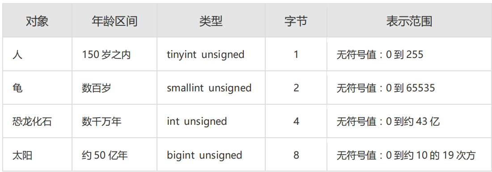
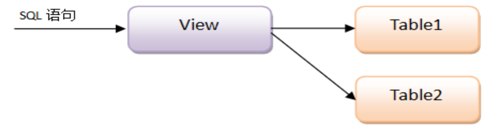

[Toc]

# 前提

> 1. 本文演示电脑环境如下：
>    - Linux版本 :Centos 7
>    - MySQL 版本: 5.7.32
> 2. 演示数据源：[员工&部分数据源](./sql_files/emp_dept_salgrade.sql) [学生&班级数据源](./sql_files/t_student.sql) [vip数据源](./sql_files/vip.sql)
> 3. Mysql 默认情况下大小写是不敏感的

# 数据库设计规约

> 参考资料来源：《阿里巴巴Java开发手册》

## 建表规约

1. 【强制】表达是与否概念的字段，必须使用 is_xxx 的方式命名，数据类型是 unsigned tinyint（1 表示是，0 表示否）。
   说明：任何字段如果为非负数，必须是 unsigned。
   注意：POJO 类中的任何布尔类型的变量，都不要加 is 前缀，所以，需要在<resultMap>设置从 is_xxx 到Xxx 的映射关系。数据库表示是与否的值，使用 tinyint 类型，坚持 is_xxx 的命名方式是为了明确其取值含义与取值范围。
   正例：表达逻辑删除的字段名 is_deleted，1 表示删除，0 表示未删除。

2. 【强制】表名、字段名必须使用小写字母或数字，禁止出现数字开头，禁止两个下划线中间只出现数字。数据库字段名的修改代价很大，因为无法进行预发布，所以字段名称需要慎重考虑。
   说明：MySQL 在 Windows 下不区分大小写，但在 Linux 下默认是区分大小写。因此，数据库名、表名、字段名，都不允许出现任何大写字母，避免节外生枝。
   正例：aliyun_admin，rdc_config，level3_name
   反例：AliyunAdmin，rdcConfig，level_3_name

3. 【强制】表名不使用复数名词。
   说明：表名应该仅仅表示表里面的实体内容，不应该表示实体数量，对应于 DO 类名也是单数形式，符合表达习惯。

4. 【强制】禁用保留字，如 desc、range、match、delayed 等，请参考 MySQL 官方保留字。

5. 【强制】主键索引名为 pk_字段名；唯一索引名为 uk_字段名；普通索引名则为 idx_字段名。_
   _说明：pk_ 即 primary key；uk_ 即 unique key；idx_ 即 index 的简称。

6. 【强制】小数类型为 decimal，禁止使用 float 和 double。
   说明：在存储的时候，float 和 double 都存在精度损失的问题，很可能在比较值的时候，得到不正确的结果。如果存储的数据范围超过 decimal 的范围，建议将数据拆成整数和小数并分开存储。

7. 【强制】如果存储的字符串长度几乎相等，使用 char 定长字符串类型。

8. 【强制】varchar 是可变长字符串，不预先分配存储空间，长度不要超过 5000，如果存储长度大于此值，定义字段类型为 text，独立出来一张表，用主键来对应，避免影响其它字段索引效率。

9. 【强制】表必备三字段：id, gmt_create, gmt_modified。
   说明：其中 id 必为主键，类型为 bigint unsigned、单表时自增、步长为 1。gmt_create, gmt_modified的类型均为 datetime 类型，前者现在时表示主动式创建，后者过去分词表示被动式更新。Java 开发手册

10.【推荐】表的命名最好是遵循“业务名称_表的作用”。
正例：alipay_task / force_project / trade_config

11.【推荐】库名与应用名称尽量一致。

12.【推荐】如果修改字段含义或对字段表示的状态追加时，需要及时更新字段注释。

13.【推荐】字段允许适当冗余，以提高查询性能，但必须考虑数据一致。冗余字段应遵循：
1） 不是频繁修改的字段。
2） 不是唯一索引的字段。
3） 不是 varchar 超长字段，更不能是 text 字段。
正例：各业务线经常冗余存储商品名称，避免查询时需要调用 IC 服务获取。

14.【推荐】单表行数超过 500 万行或者单表容量超过 2GB，才推荐进行分库分表。
说明：如果预计三年后的数据量根本达不到这个级别，请不要在创建表时就分库分表。

15.【参考】合适的字符存储长度，不但节约数据库表空间、节约索引存储，更重要的是提升检索速度。

正例：无符号值可以避免误存负数，且扩大了表示范围。



##  索引规约

1. 【强制】业务上具有唯一特性的字段，即使是组合字段，也必须建成唯一索引。
   说明：不要以为唯一索引影响了 insert 速度，这个速度损耗可以忽略，但提高查找速度是明显的；另外，即使在应用层做了非常完善的校验控制，只要没有唯一索引，根据墨菲定律，必然有脏数据产生。

2. 【强制】超过三个表禁止 join。需要 join 的字段，数据类型保持绝对一致；多表关联查询时，保证被关联的字段需要有索引。
   说明：即使双表 join 也要注意表索引、SQL 性能。

3. 【强制】在 varchar 字段上建立索引时，必须指定索引长度，没必要对全字段建立索引，根据实际文本区分度决定索引长度。
   说明：索引的长度与区分度是一对矛盾体，一般对字符串类型数据，长度为 20 的索引，区分度会高达 90%
   以上，可以使用 count(distinct left(列名, 索引长度))/count(*)的区分度来确定。

4. 【强制】页面搜索严禁左模糊或者全模糊，如果需要请走搜索引擎来解决。
   说明：索引文件具有 B-Tree 的最左前缀匹配特性，如果左边的值未确定，那么无法使用此索引。

5. 【推荐】如果有 order by 的场景，请注意利用索引的有序性。order by 最后的字段是组合索引的一部分，并且放在索引组合顺序的最后，避免出现 file_sort 的情况，影响查询性能。
   正例：where a=? and b=? order by c; 索引：a_b_c
   反例：索引如果存在范围查询，那么索引有序性无法利用，如：WHERE a>10 ORDER BY b; 索引 a_b 无法排序。

6. 【推荐】利用覆盖索引来进行查询操作，避免回表。
   说明：如果一本书需要知道第 11 章是什么标题，会翻开第 11 章对应的那一页吗？目录浏览一下就好，这个目录就是起到覆盖索引的作用。
   正例：能够建立索引的种类分为主键索引、唯一索引、普通索引三种，而覆盖索引只是一种查询的一种效果，用 explain 的结果，extra 列会出现：using index。

7. 【推荐】利用延迟关联或者子查询优化超多分页场景。
   说明：MySQL 并不是跳过 offset 行，而是取 offset+N 行，然后返回放弃前 offset 行，返回 N 行，那当offset 特别大的时候，效率就非常的低下，要么控制返回的总页数，要么对超过特定阈值的页数进行 SQL改写。
   正例：先快速定位需要获取的 id 段，然后再关联：
   `SELECT a.* FROM 表 1 a, (select id from 表 1 where 条件 LIMIT 100000,20 ) b where a.id=b.id`

8. 【推荐】SQL 性能优化的目标：至少要达到 range 级别，要求是 ref 级别，如果可以是 consts最好。
   说明：
   1）consts 单表中最多只有一个匹配行（主键或者唯一索引），在优化阶段即可读取到数据。
   2） ref 指的是使用普通的索引（normal index）。 
   3） range 对索引进行范围检索。
   反例：explain 表的结果，type=index，索引物理文件全扫描，速度非常慢，这个 index 级别比较 range还低，与全表扫描是小巫见大巫。

9. 【推荐】建组合索引的时候，区分度最高的在最左边。
   正例：如果 where a=? and b=?，a 列的几乎接近于唯一值，那么只需要单建 idx_a 索引即可。
   说明：存在非等号和等号混合判断条件时，在建索引时，请把等号条件的列前置。如：where c>? and d=? 
   那么即使 c 的区分度更高，也必须把 d 放在索引的最前列，即建立组合索引 idx_d_c。

10.【推荐】防止因字段类型不同造成的隐式转换，导致索引失效。Java 开发手册

11.【参考】创建索引时避免有如下极端误解：
1） 索引宁滥勿缺。认为一个查询就需要建一个索引。
2） 吝啬索引的创建。认为索引会消耗空间、严重拖慢记录的更新以及行的新增速度。
3） 抵制惟一索引。认为惟一索引一律需要在应用层通过“先查后插”方式解决。

## SQL 语句

1. 【强制】不要使用 count(列名)或 count(常量)来替代 count(*)，count(*)是 SQL92 定义的标准统计行数的语法，跟数据库无关，跟 NULL 和非 NULL 无关。
   说明：count(*)会统计值为 NULL 的行，而 count(列名)不会统计此列为 NULL 值的行。

2. 【强制】count(distinct col) 计算该列除 NULL 之外的不重复行数，注意 count(distinct col1, col2) 如果其中一列全为 NULL，那么即使另一列有不同的值，也返回为 0。

3. 【强制】当某一列的值全是 NULL 时，count(col)的返回结果为 0，但 sum(col)的返回结果为NULL，因此使用 sum()时需注意 NPE 问题。
   正例：可以使用如下方式来避免 sum 的 NPE 问题：SELECT IFNULL(SUM(column), 0) FROM table;

4. 【强制】使用 ISNULL()来判断是否为 NULL 值。
   说明：NULL 与任何值的直接比较都为 NULL。 
   1） NULL<>NULL 的返回结果是 NULL，而不是 false。 
   2） NULL=NULL 的返回结果是 NULL，而不是 true。 
   3） NULL<>1 的返回结果是 NULL，而不是 true。
   反例：在 SQL 语句中，如果在 null 前换行，影响可读性。`select * from table where column1 is null and column3 is not null`; 而`ISNULL(column)`是一个整体，简洁易懂。从性能数据上分析，`ISNULL(column)`执行效率更快一些。

5. 【强制】代码中写分页查询逻辑时，若 count 为 0 应直接返回，避免执行后面的分页语句。

6. 【强制】不得使用外键与级联，一切外键概念必须在应用层解决。
   说明：（概念解释）学生表中的 student_id 是主键，那么成绩表中的 student_id 则为外键。如果更新学生表中的 student_id，同时触发成绩表中的 student_id 更新，即为级联更新。外键与级联更新适用于单机低并发，不适合分布式、高并发集群；级联更新是强阻塞，存在数据库更新风暴的风险；外键影响数据库的插入速度。

7. 【强制】禁止使用存储过程，存储过程难以调试和扩展，更没有移植性。

8. 【强制】数据订正（特别是删除或修改记录操作）时，要先 select，避免出现误删除，确认无误才能执行更新语句。

9. 【强制】对于数据库中表记录的查询和变更，只要涉及多个表，都需要在列名前加表的别名（或表名）进行限定。
   说明：对多表进行查询记录、更新记录、删除记录时，如果对操作列没有限定表的别名（或表名），并且操作列在多个表中存在时，就会抛异常。
   正例：select t1.name from table_first as t1 , table_second as t2 where t1.id=t2.id;
   反例：在某业务中，由于多表关联查询语句没有加表的别名（或表名）的限制，正常运行两年后，最近在
   某个表中增加一个同名字段，在预发布环境做数据库变更后，线上查询语句出现出 1052 异常：
   Column 'name' in field list is ambiguous。

10.【推荐】SQL 语句中表的别名前加 as，并且以 t1、t2、t3、...的顺序依次命名。
说明：1）别名可以是表的简称，或者是根据表出现的顺序，以 t1、t2、t3 的方式命名。
2）别名前加 as使别名更容易识别。
正例：select t1.name from table_first as t1, table_second as t2 where t1.id=t2.id;

11.【推荐】in 操作能避免则避免，若实在避免不了，需要仔细评估 in 后边的集合元素数量，控制在 1000 个之内。

12.【参考】因国际化需要，所有的字符存储与表示，均采用 utf8 字符集，那么字符计数方法需要注意。
说明：SELECT LENGTH("轻松工作")； 
返回为 12
SELECT CHARACTER_LENGTH("轻松工作")； 
返回为 4
如果需要存储表情，那么选择 utf8mb4 来进行存储，注意它与 utf8 编码的区别。

13.【参考】TRUNCATE TABLE 比 DELETE 速度快，且使用的系统和事务日志资源少，但 TRUNCATE无事务且不触发 trigger，有可能造成事故，故不建议在开发代码中使用此语句。
说明：TRUNCATE TABLE 在功能上与不带 WHERE 子句的 DELETE 语句相同。

## ORM 映射

1. 【强制】在表查询中，一律不要使用 * 作为查询的字段列表，需要哪些字段必须明确写明。
   说明：
   1）增加查询分析器解析成本。
   2）增减字段容易与 resultMap 配置不一致。
   3）无用字段增加网络消耗，尤其是 text 类型的字段。

2. 【强制】POJO 类的布尔属性不能加 is，而数据库字段必须加 is_，要求在 resultMap 中进行字段与属性之间的映射。
   说明：参见定义 POJO 类以及数据库字段定义规定，在 sql.xml 增加映射，是必须的。

3. 【强制】不要用 resultClass 当返回参数，即使所有类属性名与数据库字段一一对应，也需要定义<resultMap>；反过来，每一个表也必然有一个<resultMap>与之对应。
   说明：配置映射关系，使字段与 DO 类解耦，方便维护。

4. 【强制】sql.xml 配置参数使用：#{}，#param# 不要使用${} 此种方式容易出现 SQL 注入。

5. 【强制】iBATIS 自带的 queryForList(String statementName,int start,int size)不推荐使用。
   说明：其实现方式是在数据库取到 statementName 对应的 SQL 语句的所有记录，再通过 subList 取start,size 的子集合。
   正例：

   ```
   Map<String, Object> map = new HashMap<>();
   map.put("start", start);
   map.put("size", size);
   ```

6. 【强制】不允许直接拿 HashMap 与 Hashtable 作为查询结果集的输出。
   反例：某同学为避免写一个\<resultMap\>，直接使用 HashTable 来接收数据库返回结果，结果出现日常是把 bigint 转成 Long 值，而线上由于数据库版本不一样，解析成 BigInteger，导致线上问题。

7. 【强制】更新数据表记录时，必须同时更新记录对应的 gmt_modified 字段值为当前时间。

8. 【推荐】不要写一个大而全的数据更新接口。传入为 POJO 类，不管是不是自己的目标更新字段，都进行 update table set c1=value1,c2=value2,c3=value3; 这是不对的。执行 SQL 时，不要更新无改动的字段，一是易出错；二是效率低；三是增加 binlog 存储。

9. 【参考】@Transactional 事务不要滥用。事务会影响数据库的 QPS，另外使用事务的地方需要考虑各方面的回滚方案，包括缓存回滚、搜索引擎回滚、消息补偿、统计修正等。

10.【参考】<isEqual>中的 compareValue 是与属性值对比的常量，一般是数字，表示相等时带上此条件；<isNotEmpty>表示不为空且不为 null 时执行；<isNotNull>表示不为 null 值时执行。

# 结构化查询语言SQL

## 数据定义语言(DDL)

> 代表关键字：create/drop/alter

### 数据库定义

```
[root@mysql ~]# mysql -uroot -p'Joy.123com'
### 创建数据库：t1
mysql> create database t1;
### 查看所有数据库
mysql> show databases;
### 使用指定数据库:t1
mysql> use t1;
Database changed
### 删除数据库: t1
mysql> drop database t1;
Query OK, 0 rows affected (0.00 sec)
```

### 表定义

#### 创建表

```
### 语法
create table tableName(
 columnName dataType(length),
 ………………..
 columnName dataType(length)
);
set character_set_results='gbk';

### 查看数据库字符编码类型
mysql> show variables like '%char%';
+--------------------------------------+----------------------------+
| Variable_name                        | Value                      |
+--------------------------------------+----------------------------+
| character_set_client                 | utf8                       |
| character_set_connection             | utf8                       |
| character_set_database               | utf8mb4                    |
| character_set_filesystem             | binary                     |
| character_set_results                | utf8                       |
| character_set_server                 | utf8mb4 

### 修改数据库编码
centos:7
mysql:5.7


```

##### 创建表加入约束

- **常见的约束**

> - 非空约束，not null : 非空约束，针对某个字段设置其值不为空，如：学生的姓名不能为空
> - 唯一约束，unique :唯一性约束，它可以使某个字段的值不能重复
> - 主键约束，primary key:每个表应该具有主键，主键可以标识记录的唯一性，主键分为单一主键和复合（联合）主键，单一主键是由一个字段构成的，复合（联合）主键是由多个字段构成的
> - 外键约束，foreign key: 外键主要是维护表之间的关系的，主要是为了保证参照完整性，如果表中的某个字段为外键字段，那么该字段的值必须来源于参照的表的主键，
> - 自定义检查约束，check（不建议使用）(在 mysql 中现在还不支持)

- **语法结构**

```
CREATE TABLE TABLE_NAME(
columnName dataType(length) [NOT NULL][PRIMARY KEY][UNIQUE][FOREIGN KEY],
 ………………..
 columnName dataType(length) [NOT NULL][PRIMARY KEY][UNIQUE][FOREIGN KEY] 
);
```

- **范例**

```
### 非空约束
drop table if exists t_student; 
create table t_student(
student_id int(10),
student_name varchar(20) not null,
sex char(2) default 'm',
birthday date, 
email varchar(30),
classes_id int(3)
)

### 唯一约束
drop table if exists t_student; 
create table t_student(
student_id int(10),
student_name varchar(20) not null,
sex char(2) default 'm',
birthday date, 
email varchar(30) unique,
classes_id int(3)
)
### 自定义约束名
drop table if exists t_student; 
create table t_student(
student_id int(10),
student_name varchar(20) not null,
sex char(2) default 'm',
birthday date, 
email varchar(30) ,
classes_id int(3) ,
constraint email_unique unique(email)/*表级约束*/
)

### 主键约束
1. 未自定义约束名
drop table if exists t_student; 
create table t_student()
student_id int(10) primary key,/*列级约束*/
student_name varchar(20) not null,
sex char(2) default 'm',
birthday date, 
email varchar(30) ,
classes_id int(3)
)
2. 自定义约束名
drop table if exists t_student; 
create table t_student(
student_id int(10),
student_name varchar(20) not null,
sex char(2) default 'm',
birthday date, 
email varchar(30) ,
classes_id int(3),
 CONSTRAINT p_id PRIMARY key (student_id)
)

### 外键约束
1. 建立班级表
drop table if exists t_classes;
create table t_classes(
classes_id int(3),
classes_name varchar(40),
constraint pk_classes_id primary key(classes_id)
)
2. 在学生表中建立外键约束
drop table if exists t_student;
create table t_student(
student_id int(10),
student_name varchar(20),
sex char(2),
birthday date,
email varchar(30),
classes_id int(3),
constraint student_id_pk primary key(student_id),
constraint fk_classes_id foreign key(classes_id) references t_classes(classes_id) 
)


```

##### 查看表的约束

```
mysql> USE INFORMATION_SCHEMA;
mysql> SELECT * FROM TABLE_CONSTRAINTS WHERE TABLE_NAME='EMP' \G;

```


##### 复制表

```
### 复制EMP表的结构和数据
mysql> CREATE TABLE EMP_BAK AS (SELECT * FROM EMP);

### 复制表提示报错
mysql> CREATE TABLE STUDENT_BAK AS SELECT *  FROM EMP;
ERROR 1786 (HY000): Statement violates GTID consistency: CREATE TABLE ... SELECT.
原因：这是因为在5.6及以上的版本内，开启了 enforce_gtid_consistency=true 功能导致的，MySQL官方解释说当启用 enforce_gtid_consistency 功能的时候，MySQL只允许能够保障事务安全，并且能够被日志记录的SQL语句被执行，像create table … select 和 create temporarytable语句，以及同时更新事务表和非事务表的SQL语句或事务都不允许执行。
mysql> show variables like '%enforce%';
+--------------------------+-------+
| Variable_name            | Value |
+--------------------------+-------+
| enforce_gtid_consistency | ON    |
+--------------------------+-------+
1 row in set (0.00 sec)

解决方案：
方案1：修改配置文件,如业务需要，可以在线关闭掉gtid，执行如下SQL关闭gtid
安装一下步骤，修改gtid_mode 与 enforce_gtid_consistency。修改enforce_gtid_consistency需将gtid_mode配置修改，否则会报错
1) set global gtid_mode='ON_PERMISSIVE';
2)set global gtid_mode='OFF_PERMISSIVE';
3)SET @@GLOBAL.ENFORCE_GTID_CONSISTENCY = OFF;
4) set global gtid_mode='OFF';
查看配置是否已修改
show global variables like '%gtid_mode%';
mysql> SHOW VARIABLES LIKE '%GTID%';
+----------------------------------+-------------------------------------------+
| Variable_name                    | Value                                     |
+----------------------------------+-------------------------------------------+
| binlog_gtid_simple_recovery      | ON                                        |
| enforce_gtid_consistency         | OFF                                       |
| gtid_executed_compression_period | 1000                                      |
| gtid_mode                        | OFF                                       |
| gtid_next                        | AUTOMATIC                                 |
| gtid_owned                       |                                           |
| gtid_purged                      | 4ecb9a58-173f-11eb-84c6-000c29796704:1-17 |
| session_track_gtids              | OFF                                       |
+----------------------------------+-------------------------------------------+
8 rows in set (0.00 sec)
以上配置修改完成后，再重新执行：
mysql> CREATE TABLE STUDENT_BAK AS SELECT *  FROM EMP;
Query OK, 15 rows affected (0.01 sec)
Records: 15  Duplicates: 0  Warnings: 0

方案2：分俩步进行，先创建表结构，再插入数据
mysql> CREATE TABLE EMP_BAK LIKE EMP;
Query OK, 0 rows affected (0.01 sec)

mysql> INSERT INTO EMP_BAK SELECT * FROM EMP;
Query OK, 15 rows affected (0.01 sec)
Records: 15  Duplicates: 0  Warnings: 0

```


#### MySql 常用数据类型

| 类型                         | 说明                                             |
| ---------------------------- | ------------------------------------------------ |
| Char(长度)                   | 定长字符串，存储空间大小固定，适合作为主键或外键 |
| Varchar(长度)                | 变长字符串，存储空间等于实际数据空间             |
| double(有效数字位数，小数位) | 数值型                                           |
| Float(有效数字位数，小数位)  | 数值型                                           |
| Int(长度)                    | 整型                                             |
| bigint(长度)                 | 长整型                                           |
| Date                         | 日期型                                           |
| BLOB                         | Binary Large OBject（二进制大对象）              |
| CLOB                         | Character Large OBject（字符大对象）             |
| 其它…………………                  |                                                  |

```
### 建立学生信息表，字段包括：学号、姓名、性别、出生日期、email、班级标识
mysql> CREATE TABLE TEST_STUDENT(STUDENT_ID INT(10),NAME VARCHAR(20), SEX CHAR(2),BIRTHDAY DATE,EMAIL VARCHAR(30),CLASS_ID INT(3));
```

#### 修改表

```
### 添加字段
- 向 t_student 中加入联系电话字段，字段名称为：contatct_tel 类型为 varchar(40)
mysql> ALTER TABLE t_student ADD CONTACT_TEL VARCHAR(40);

### 修改字段
- student_name 无法满足需求，长度需要更改为 100
mysql> alter table t_student modify name varchar(100);
mysql> desc t_student;
+-------------+--------------+------+-----+---------+----------------+
| Field       | Type         | Null | Key | Default | Extra          |
+-------------+--------------+------+-----+---------+----------------+
| no          | int(11)      | NO   | PRI | NULL    | auto_increment |
| name        | varchar(100) | YES  |     | NULL    |                |
| cno         | int(11)      | YES  | MUL | NULL    |                |
| CONTACT_TEL | varchar(40)  | YES  |     | NULL    |                |
+-------------+--------------+------+-----+---------+----------------+
4 rows in set (0.00 sec)

- 修改列名：如 sex 字段名称感觉不好，想用 gender 那么就需要更爱列的名称
mysql> alter table t_student change sex gender char(2) not null;
Query OK, 0 rows affected (0.01 sec)
Records: 0  Duplicates: 0  Warnings: 0

mysql> desc t_student;
+-------------+--------------+------+-----+---------+----------------+
| Field       | Type         | Null | Key | Default | Extra          |
+-------------+--------------+------+-----+---------+----------------+
| no          | int(11)      | NO   | PRI | NULL    | auto_increment |
| name        | varchar(100) | YES  |     | NULL    |                |
| cno         | int(11)      | YES  | MUL | NULL    |                |
| CONTACT_TEL | varchar(40)  | YES  |     | NULL    |                |
| gender      | char(2)      | NO   |     | NULL    |                |
+-------------+--------------+------+-----+---------+----------------+
5 rows in set (0.00 sec)

- 删除字段
mysql> alter table t_student drop CONTACT_TEL;
```

##### 表约束操作

```
### 添加约束
1. 添加外键约束：alter table 从表 add constraint 约束名称 foreign key 从表(外键字段) references 主表(主键字段);
alter table t_student add constraint fk_classes_id_1 foreign key(classes_id) references 
t_classes(classes_id);
2. 添加主键约束：alter table 表 add constraint 约束名称 primary key 表(主键字段);
alter table t_student add constraint pk primary key(student_id);
3. 添加唯一性约束：alter table 表 add constraint 约束名称 unique 表(字段);
alter table t_student add constraint uk unique(email);

### 修改约束
alter table t_student modify student_name varchar(30) unique;
mysql 对有些约束的修改时不支持，所以我们可以先删除，再添加


### 删除约束
1. 删除外键约束：alter table 表名 drop foreign key 外键（区分大小写）;
如：alter table t_student drop foreign key fk_classes_id;
2. 删除主键约束：alter table 表名 drop primary key ;
alter table t_student drop primary key;
3. 删除约束约束：alter table 表名 drop key 约束名称 ;
alter table t drop key uk;
```


#### 删除表

```
mysql> DROP TABLE IF EXISTS TEST_STURDENT;
```


## 数据控制语言(DCL)

> 代表关键字:grant,revoke

### 新建用户

```
CREATE USER username IDENTIFIED BY 'password';
说明:username——你将创建的用户名, password——该用户的登陆密码,密码可以为空,如果为空则该用户可以不需要密
码登陆服务器.
例如：
create user p361 identified by '123';
--可以登录但是只可以看见一个库 information_schema
```

### 授权

```
命令详解
mysql> grant all privileges on dbname.tbname to 'username'@'login ip' identified by 'password' with grant option;
1) dbname=*表示所有数据库
2) tbname=*表示所有表
3) login ip=%表示任何 ip
4) password 为空，表示不需要密码即可登录
5) with grant option; 表示该用户还可以授权给其他用户
### 细粒度授权
首先以 root 用户进入 mysql，然后键入命令：grant select,insert,update,delete on *.* to p361@localhost Identified by "123";
如果希望该用户能够在任何机器上登陆 mysql，则将 localhost 改为 "%"。 
### 粗粒度授权
我们测试用户一般使用该命令授权，
GRANT ALL PRIVILEGES ON *.* TO 'p361'@'%' Identified by "123";
注意:用以上命令授权的用户不能给其它用户授权,如果想让该用户可以授权,用以下命令:
GRANT ALL PRIVILEGES ON *.* TO 'p361'@'%' Identified by "123" WITH GRANT OPTION;
privileges 包括：
1) alter：修改数据库的表
2) create：创建新的数据库或表
3) delete：删除表数据
4) drop：删除数据库/表
5) index：创建/删除索引
6) insert：添加表数据
7) select：查询表数据
8) update：更新表数据
9) all：允许任何操作
10) usage：只允许登录
```

### 回收权限

```
### 命令详解
revoke privileges on dbname[.tbname] from username;
revoke all privileges on *.* from p361;
use mysql
select * from user
进入 mysql 库中
### 修改密码;
update user set password = password('qwe') where user = 'p646';
刷新权限;
flush privileges
```

## 数据操作语言(DML)

> 代表关键字:insert,delete,update

#### INSERT

- **语法**`Insert into 表名(字段，。。。。) values(值,………..)`

- **省略字段的插入**

  ```
  insert into emp values(9999,'zhangsan','MANAGER', null, null,3000, 500, 10)
  不建议使用此种方式，因为当数据库表中的字段位置发生改变的时候会影响到 insert 语句
  
  ### 指定字段插入
  mysql> insert into EMP(EMPNO,ENAME,DEPTNO) VALUES(1223,"ZHANGSAN",4312);
  
  ### 如何插入日期：
  1. 第一种方法，插入的日期格式和显示的日期格式一致
  insert into emp(empno, ename, job, mgr, hiredate, sal, comm, deptno) 
  values(9997,'zhangsan','MANAGER', null, '1981-06-12',3000, 500, 10);
  2. 第二种方法，采用 str_to_date
  insert into emp(empno, ename, job, mgr, hiredate, sal, comm, deptno) valu
  es(9996,'zhangsan','MANAGER',null,str_to_date('1981-06-12','%Y-%m-%d'),3000, 500, 10);
  3. 添加系统日期（now()）
  insert into emp(empno, ename, job, mgr, hiredate, sal, comm, deptno) 
  values(9995,'zhangsan','MANAGER',null,now() ,3000, 500, 10);
  ```

##### 插入查询到的数据

```
mysql> INSERT INTO EMP_BAK SELEC * FROM EMP;
```

##### UPDATE

- **语法格式**

```
update 表名 set 字段名称 1=需要修改的值 1, 字段名称 2=需要修改的值 2 where …….
```

- **范例**

```
### 将 job 为 manager 的员工的工资上涨 10%
mysql> UPDATE EMP_BAK SET SAL=SAL+SAL*0.1 WHERE JOB='MANAGER';
```

#### DELETE

- **语法格式**

```
Delete from 表名 where 。。。。。
```

- **范例**

```
### 删除津贴为 500 的员工
mysql> DELETE FROM EMP_BAK WHERE COMM=500;
Query OK, 1 row affected (0.01 sec)

### 删除津贴为 null 的员工
mysql> DELETE FROM EMP_BAK WHERE COMM IS NULL;
Query OK, 11 rows affected (0.01 sec)
```

#### 级联更新与级联删除

```
### 创建class表
drop table if exists t_classes;
create table t_classes(
classes_id int(3),
classes_name varchar(30) not null,
constraint pk_classes_id primary key(classes_id) 
)
### 创建student表
drop table if exists t_student;
create table t_student(
student_id int(10),
student_name varchar(50) not null,
sex char(2) not null,
birthday date not null,
email varchar(30) unique,
classes_id int(3) not null,
constraint pk_student_idprimary key(student_id),
constraint fk_classes_id foreign key(classes_id) references t_classes(classes_id) 
)
```

##### on update cascade

```
mysql 对有些约束的修改比较麻烦，所以我们可以先删除，再添加
alter table t_student drop foreign key fk_classes_id;
alter table t_student add constraint fk_classes_id_1 foreign key(classes_id) references t_classes(classes_id) on update cascade;

当我们修改主表class中的信息时，从表student表中的class_id也会跟着改变
mysql> update t_classes set classes_id=20 where classes_name='366';
```

##### on delete cascade;

```
alter table t_student drop foreign key fk_classes_id;
alter table t_student add constraint fk_classes_id_1 foreign key(classes_id) references 
t_classes(classes_id) on delete cascade;
### 我们只删除了父表中的数据，但是子表也会中的数据也会删除。
delete from t_classes where classes_id = 20
```

## 数据查询语言(DQL)

> 代表关键字:select

### 简单查询

```
### 查询员工姓名
mysql> SELECT ENAME FROM EMP;

### 查询多个字段
mysql> SELECT EMPNO,ENAME FROM EMP;
+-------+--------+
| EMPNO | ENAME  |
+-------+--------+
|  7369 | SMITH  |
|  7499 | ALLEN  |
+-------+--------+

### 查询所有字段
mysql> SELECT * FROM EMP;

```

### 计算&字段别名

```
### 计算员工年薪：列出员工的编号，姓名和年薪
mysql> SELECT EMPNO,ENAME,SAL*12 FROM EMP;
### 设置字段别名：字符串必须添加单引号''或者双引号 ""
mysql> SELECT EMPNO AS '员工编号',ENAME AS '员工名称',SAL*12 AS '年薪' FROM EMP;
+--------------+--------------+----------+
| 员工编号     | 员工名称     | 年薪     |
+--------------+--------------+----------+
|         7369 | SMITH        |  9600.00 |
|         7499 | ALLEN        | 19200.00 |

### 可以采用 as 关键字重命名表字段，其实 as 也可以省略，如：
mysql> SELECT EMPNO '员工编号',ENAME '员工名称',SAL*12 '年薪' FROM EMP;
+--------------+--------------+----------+
| 员工编号     | 员工名称     | 年薪     |
+--------------+--------------+----------+
|         7369 | SMITH        |  9600.00 |

```

### 条件查询

> 条件查询需要用到 where 语句，where 必须放到 from 语句表的后面
>
> | 运算符          | 说明                                                         |
> | --------------- | ------------------------------------------------------------ |
> | =               | 等于                                                         |
> | <>或!=          | 不等于                                                       |
> | <               | 小于                                                         |
> | <=              | 小于等于                                                     |
> | >               | 大于                                                         |
> | >=              | 大于等于                                                     |
> | between …and …. | 两个值之间 等同于 >= and <= |
> | is null  |    为 null（is not null 不为空）|
> | and                           |     并且          |
> | or                         |   或者              |
> | in   |         包含，相当于多个 or（not in 不在这个范围中）|
> | not      |      not 可以取非，主要用在 is 或 in 中         |
> | like      | like 称为模糊查询，支持%或下划线匹配%匹配任意个字符，下划线，一个下划线只匹配一个字符       |
> | rand | 生成随机数 |
> | case...when...then...else...end | 流程处理函数，匹配条件进行输出 |
> | IFNULL | IFNULL(COLUMN,默认值)，如果字段为NULL，则设置为默认值 |

#### 等于(=)

```
### 查询薪水为5000的员工
mysql> SELECT EMPNO,ENAME,SAL FROM EMP WHERE SAL=5000;
+-------+-------+---------+
| EMPNO | ENAME | SAL     |
+-------+-------+---------+
|  7839 | KING  | 5000.00 |
+-------+-------+---------+
1 row in set (0.00 sec)

### 查询 job 为 MANAGER 的员工
mysql> SELECT EMPNO,ENAME FROM EMP WHERE JOB='MANAGER';
```

#### 不等于(!=  <>)

```
### 查询薪水不等于 5000 的员工
mysql> SELECT EMPNO,ENAME,SAL FROM EMP WHERE SAL<>5000;
mysql> SELECT EMPNO,ENAME,SAL FROM EMP WHERE SAL!=5000; # 法等同于以上写法，建议使用上一种写法

### 查询工作岗位不等于 MANAGER 的员工
mysql> SELECT EMPNO,ENAME FROM EMP WHERE JOB <> 'MANAGER';
```

#### 范围查询

```
### 查询薪水为 1600 到 3000 的员工
mysql> SELECT EMPNO,ENAME,SAL FROM EMP WHERE SAL>=1600 AND SAL<=3000; #方式1
mysql> SELECT EMPNO,ENAME,SAL FROM EMP WHERE SAL BETWEEN 1600 AND 3000; #方式2
```

#### IS NULL

> Null 为空，但不是空串，为 null 可以设置这个字段不填值，如果查询为 null 的字段，采用 is null

```
### 查询津贴为空的员工
mysql> SELECT * FROM EMP WHERE COMM=NULL; # 无法查询出符合条件的数据，因为 null 类型比较特殊，必须使用 is 来比较
Empty set (0.00 sec)

mysql> SELECT * FROM EMP WHERE COMM IS NULL;
+-------+--------+-----------+------+------------+---------+------+--------+
| EMPNO | ENAME  | JOB       | MGR  | HIREDATE   | SAL     | COMM | DEPTNO |
+-------+--------+-----------+------+------------+---------+------+--------+
|  7369 | SMITH  | CLERK     | 7902 | 1980-12-17 |  800.00 | NULL |     20 |
```

#### AND

```
and 表示并且的含义，表示所有的条件必须满足

### 查询工作岗位为 MANAGER,薪水大于 2500 的员工
mysql> SELECT EMPNO,ENAME,JOB,SAL FROM EMP WHERE JOB='MANAGER' AND SAL>2500;
+-------+-------+---------+---------+
| EMPNO | ENAME | JOB     | SAL     |
+-------+-------+---------+---------+
|  7566 | JONES | MANAGER | 2975.00 |
|  7698 | BLAKE | MANAGER | 2850.00 |
+-------+-------+---------+---------+
2 rows in set (0.00 sec)
```

#### OR&IN

> - or，只要满足条件即可,相当于包含
> - in 表示包含的意思，完全可以采用 or 来表示，采用 in 会更简洁一些

```
### 查询出 job 为 manager 或者 job 为 salesman 的员工
#### 方式1
mysql> SELECT * FROM EMP WHERE JOB='MANAGER' OR JOB='SALESMAN';
#### 方式2
mysql> SELECT * FROM EMP WHERE JOB IN('MANAGER','SALESMAN');

### 查询出薪水包含 1600 和薪水包含 3000 的员工
#### 方式1
mysql> SELECT * FROM EMP WHERE SAL IN(1600,3000);
#### 方式2
mysql> SELECT * FROM EMP WHERE SAL=1600 OR SAL=3000;
```

#### 表达式的优先级

```
### 查询薪水大于 1800，并且部门代码为 20 或 30 的员工（错误的写法）
#### 错误查询语句
mysql> SELECT * FROM EMP WHERE SAL>1800 AND DEPTNO=20 OR DEPTNO=30;
+-------+--------+----------+------+------------+---------+---------+--------+
| EMPNO | ENAME  | JOB      | MGR  | HIREDATE   | SAL     | COMM    | DEPTNO |
+-------+--------+----------+------+------------+---------+---------+--------+
|  7499 | ALLEN  | SALESMAN | 7698 | 1981-02-20 | 1600.00 |  300.00 |     30 |
|  7521 | WARD   | SALESMAN | 7698 | 1981-02-22 | 1250.00 |  500.00 |     30 |
|  7566 | JONES  | MANAGER  | 7839 | 1981-04-02 | 2975.00 |    NULL |     20 |
|  7654 | MARTIN | SALESMAN | 7698 | 1981-09-28 | 1250.00 | 1400.00 |     30 |
|  7698 | BLAKE  | MANAGER  | 7839 | 1981-05-01 | 2850.00 |    NULL |     30 |
|  7788 | SCOTT  | ANALYST  | 7566 | 1987-04-19 | 3000.00 |    NULL |     20 |
|  7844 | TURNER | SALESMAN | 7698 | 1981-09-08 | 1500.00 |    0.00 |     30 |
|  7900 | JAMES  | CLERK    | 7698 | 1981-12-03 |  950.00 |    NULL |     30 |
|  7902 | FORD   | ANALYST  | 7566 | 1981-12-03 | 3000.00 |    NULL |     20 |
+-------+--------+----------+------+------------+---------+---------+--------+
9 rows in set (0.00 sec)

以上输出不是预期结果，薪水小于 1800 的数据也被查询上来了，原因是表达式的优先级导致的，首先过滤 sal > 1800 and 
deptno = 20，然后再将 deptno = 30 员工合并过来，所以是不对的

#### 正确查询语句
mysql> SELECT * FROM EMP WHERE SAL>1800 AND (DEPTNO=20 OR DEPTNO=30);
+-------+-------+---------+------+------------+---------+------+--------+
| EMPNO | ENAME | JOB     | MGR  | HIREDATE   | SAL     | COMM | DEPTNO |
+-------+-------+---------+------+------------+---------+------+--------+
|  7566 | JONES | MANAGER | 7839 | 1981-04-02 | 2975.00 | NULL |     20 |
|  7698 | BLAKE | MANAGER | 7839 | 1981-05-01 | 2850.00 | NULL |     30 |
|  7788 | SCOTT | ANALYST | 7566 | 1987-04-19 | 3000.00 | NULL |     20 |
|  7902 | FORD  | ANALYST | 7566 | 1981-12-03 | 3000.00 | NULL |     20 |
+-------+-------+---------+------+------------+---------+------+--------+
4 rows in set (0.00 sec)

如果无法记住优先级，可以使用括号区分
```

#### NOT

```
### 查询出薪水不包含 1600 和薪水不包含 3000 的员工
#### 方式1
mysql> SELECT * FROM EMP WHERE SAL<>1600 AND SAL<>3000;

### 方式2
mysql> SELECT * FROM EMP WHERE NOT( SAL=1600 OR SAL=3000);

### 方式3
mysql> SELECT * FROM EMP WHERE SAL NOT IN( 1600,3000);


### 查询出津贴不为 null 的所有员工
mysql> SELECT * FROM EMP WHERE COMM IS NOT NULL;

```

#### LIKE

> Like 可以实现模糊查询，like 支持`%`和下划线`_`匹配
>
> - `%`匹配任意字符出现的个数
>
> - `_`下划线只匹配一个字符
>
> **Like 中的表达式必须放到单引号中|双引号中**

```
### 查询姓名以 M 开头所有的员工
mysql> SELECT * FROM EMP WHERE ENAME LIKE 'M%';
+-------+--------+----------+------+------------+---------+---------+--------+
| EMPNO | ENAME  | JOB      | MGR  | HIREDATE   | SAL     | COMM    | DEPTNO |
+-------+--------+----------+------+------------+---------+---------+--------+
|  7654 | MARTIN | SALESMAN | 7698 | 1981-09-28 | 1250.00 | 1400.00 |     30 |
|  7934 | MILLER | CLERK    | 7782 | 1982-01-23 | 1300.00 |    NULL |     10 |
+-------+--------+----------+------+------------+---------+---------+--------+
2 rows in set (0.00 sec)

### 查询姓名以 N 结尾的所有的员工
mysql> SELECT * FROM EMP WHERE ENAME LIKE '%N';

### 查询姓名中包含 O 的所有的员工
mysql> SELECT * FROM EMP WHERE ENAME LIKE '%O%';

### 查询姓名中第二个字符为 A 的所有员工
mysql> SELECT * FROM EMP WHERE ENAME LIKE '_A%';

```

### 排序

> 排序采用 order by 子句，order by 后面跟上排序字段，排序字段可以放多个，多个采用逗号间隔，order by 默认采用升序，如果存在 where 子句那么 order by 必须放到 where 语句的后面

#### 单一字段排序

```
### 按照薪水由小到大排序(系统默认由小到大)
mysql> SELECT * FROM EMP ORDER BY SAL;
### 手动指定按照薪水由小到大排序
mysql> SELECT * FROM EMP ORDER BY SAL ASC;
### 手动指定按照薪水由大到小排序
mysql> SELECT * FROM EMP ORDER BY SAL DESC;

### 取得 job 为 MANAGER 的员工，按照薪水由小到大排序(系统默认由小到大)
mysql> SELECT * FROM EMP WHERE JOB='MANAGER' ORDER BY SAL;

如果包含 where 语句 order by 必须放到 where 后面，如果没有 where 语句 order by 放到表的后面
```

#### 多字段排序

> 如果采用多个字段排序，如果根据第一个字段排序重复了，会根据第二个字段排序

```
### 按照多个字段排序，如：首先按照 job 排序，再按照 sal 排序
mysql> SELECT * FROM EMP ORDER BY JOB,SAL;

### 按照 job 和薪水倒序
mysql> SELECT * FROM EMP ORDER BY JOB DESC,SAL DESC;
+-------+--------+-----------+------+------------+---------+---------+--------+
| EMPNO | ENAME  | JOB       | MGR  | HIREDATE   | SAL     | COMM    | DEPTNO |
+-------+--------+-----------+------+------------+---------+---------+--------+
|  7566 | JONES  | MANAGER   | 7839 | 1981-04-02 | 2975.00 |    NULL |     20 |
|  7698 | BLAKE  | MANAGER   | 7839 | 1981-05-01 | 2850.00 |    NULL |     30 |
|  7782 | CLARK  | MANAGER   | 7839 | 1981-06-09 | 2450.00 |    NULL |     10 |
```

#### 使用字段的位置排序

> 字段的位置：字段在该表创建时，字段所处位置。起始字段为1，一直往后排
> 不建议使用此种方式，采用数字含义不明确，程序不健壮

```
### 按照薪水升序
mysql> SELECT * FROM EMP ORDER BY 6;
+-------+--------+-----------+------+------------+---------+---------+--------+
| EMPNO | ENAME  | JOB       | MGR  | HIREDATE   | SAL     | COMM    | DEPTNO |
+-------+--------+-----------+------+------------+---------+---------+--------+
|  7369 | SMITH  | CLERK     | 7902 | 1980-12-17 |  800.00 |    NULL |     20 |

```

### 数据处理函数

> **数据处理函数又被称为单行处理函数，特点：输入一行输出一行**

| 函数        | 说明                                                 |
| ----------- | ---------------------------------------------------- |
| Lower       | 转换小写                                             |
| upper       | 转换大写                                             |
| substr      | 取子串（substr(被截取的字符串,起始下标,截取的长度)） |
| length      | 取长度                                               |
| trim        | 去空格                                               |
| str_to_date | 将字符串转换成日期                                   |
| date_format | 格式化日期                                           |
| format      | 设置千分位                                           |
| round       | 四舍五入                                             |

#### 字符大小写转换

```
### 查询员工，将员工姓名全部转换成小写
mysql> SELECT LOWER(ENAME) FROM EMP;
+--------------+
| LOWER(ENAME) |
+--------------+
| smith        |
| allen        |

### 查询 job 为 manager 的员工
mysql> SELECT * FROM EMP WHERE JOB=UPPER('manager');

```

#### 字符截取

```
### 查询姓名以 M 开头所有的员工
mysql> SELECT * FROM EMP WHERE SUBSTR(ENAME,1,1)=UPPER('m');
```

#### LENGTH

```
### 取得员工姓名长度为 5 的
mysql> SELECT ENAME,LENGTH(ENAME) FROM EMP WHERE LENGTH(ENAME)=5;
+-------+---------------+
| ENAME | LENGTH(ENAME) |
+-------+---------------+
| SMITH |             5 |

```

#### TRIM

> trim 会去首尾空格，不会去除中间的空格

```
### 取得工作岗位为 manager 的所有员工
mysql> SELECT * FROM EMP WHERE JOB=TRIM(UPPER('manager '));
```

#### STR_TO_DATE

```
必须严格按照标准输出
str_to_date 可以将字符串转换成日期，具体格式 str_to_date (字符串，匹配格式)

### 查询 1981-02-20 入职的员工
#### 方式1：与数据库的格式匹配上
mysql> SELECT * FROM EMP WHERE HIREDATE='1981-02-20';
#### 方式2：将字符串转换成 date 类型
mysql> SELECT * FROM EMP WHERE HIREDATE=STR_TO_DATE('1981-02-20','%Y-%m-%d');
```

#### DATE_FORMAT

```
日期格式的说明：
%Y：代表 4 位的年份
%y：代表 2 位的年份

%m：代表月, 格式为(01……12) 
%c：代表月, 格式为(1……12)

%d:代表日，格式为(01...30)

%H：代表小时,格式为(00……23) 
%h： 代表小时,格式为(01……12)

%i： 代表分钟, 格式为(00……59)

%r：代表 时间,格式为 12 小时(hh:mm:ss [AP]M) 
%T：代表 时间,格式为 24 小时(hh:mm:ss)

%S：代表 秒,格式为(00……59) 
%s：代表 秒,格式为(00……59)


### 查询 1981-02-20 以后入职的员工，将入职日期格式化成 yyyy-mm-dd hh:mm:ss
mysql> SELECT EMPNO,ENAME,DATE_FORMAT(HIREDATE,'%Y-%m-%d %H:%i:%s') AS HIREDATE FROM EMP;
+-------+--------+---------------------+
| EMPNO | ENAME  | HIREDATE            |
+-------+--------+---------------------+
|  7369 | SMITH  | 1980-12-17 00:12:00 |

### 获取当前时间并格式化
mysql> SELECT DATE_FORMAT(NOW(),'%Y-%m-%d %H:%i:%s');
+----------------------------------------+
| DATE_FORMAT(NOW(),'%Y-%m-%d %H:%i:%s') |
+----------------------------------------+
| 2021-10-16 09:06:57                    |
+----------------------------------------+
1 row in set (0.00 sec)


```

#### FORMAT(千分位)

```
### 查询员工薪水加入千分位
mysql> SELECT EMPNO,ENAME,FORMAT(SAL,0) FROM EMP;
+-------+--------+---------------+
| EMPNO | ENAME  | FORMAT(SAL,0) |
+-------+--------+---------------+
|  7369 | SMITH  | 800           |
|  7499 | ALLEN  | 1,600         |
|  7521 | WARD   | 1,250         |

### 查询员工薪水加入千分位和保留两位小数
mysql> SELECT EMPNO,ENAME,FORMAT(SAL,2) FROM EMP;
+-------+--------+---------------+
| EMPNO | ENAME  | FORMAT(SAL,2) |
+-------+--------+---------------+
|  7369 | SMITH  | 800.00        |
|  7499 | ALLEN  | 1,600.00      |
```

#### ROUND(四舍五入)

```
mysql> SELECT ROUND(123.56); # 不保留小数位
+---------------+
| ROUND(123.56) |
+---------------+
|           124 |
+---------------+
1 row in set (0.00 sec)

mysql> SELECT ROUND(123.56,1); # 保留一位小数
+-----------------+
| ROUND(123.56,1) |
+-----------------+
|           123.6 |
+-----------------+
1 row in set (0.00 sec)

mysql> SELECT ENAME,SAL,ROUND(SAL) FROM EMP;
+--------+---------+------------+
| ENAME  | SAL     | ROUND(SAL) |
+--------+---------+------------+
| SMITH  |  800.00 |        800 |
| ALLEN  | 1600.00 |       1600 |

```

#### RAND(生成随机数)

```
### 生成随机数
mysql> SELECT RAND();
+---------------------+
| RAND()              |
+---------------------+
| 0.44861266431269486 |
+---------------------+
1 row in set (0.00 sec)

### 随机抽取记录数.注意：order by 必须写上
mysql> SELECT * FROM EMP ORDER BY RAND() LIMIT 2;# 随机查询俩条记录
+-------+-------+---------+------+------------+---------+------+--------+
| EMPNO | ENAME | JOB     | MGR  | HIREDATE   | SAL     | COMM | DEPTNO |
+-------+-------+---------+------+------------+---------+------+--------+
|  7369 | SMITH | CLERK   | 7902 | 1980-12-17 |  800.00 | NULL |     20 |
|  7698 | BLAKE | MANAGER | 7839 | 1981-05-01 | 2850.00 | NULL |     30 |
+-------+-------+---------+------+------------+---------+------+--------+
2 rows in set (0.00 sec)

```

#### CASE...WHEN...THEN...ELSE...END

```
### 如果 job 为 MANAGERG 薪水上涨 10%,如果 job 为 SALESMAN 工资上涨 50%
mysql> SELECT EMPNO,ENAME,JOB,SAL,CASE JOB WHEN 'MANAGER'THEN SAL*1.1 WHEN 'SALESMAN' THEN SAL*1.5 END AS NEW_SAL FROM EMP;
+-------+--------+-----------+---------+---------+
| EMPNO | ENAME  | JOB       | SAL     | NEW_SAL |
+-------+--------+-----------+---------+---------+
|  7369 | SMITH  | CLERK     |  800.00 |    NULL |
|  7499 | ALLEN  | SALESMAN  | 1600.00 | 2400.00 |
|  7521 | WARD   | SALESMAN  | 1250.00 | 1875.00 |

### 其他的工资不动，需要添加 else
mysql> SELECT EMPNO,ENAME,JOB,SAL,CASE JOB WHEN 'MANAGER'THEN SAL*1.1 WHEN 'SALESMAN' THEN SAL*1.5 ELSE SAL END AS NEW_SAL FROM EMP;

```

#### IFNULL

```
如果 comm 为 null 就替换为 0 在 SQL 语句当中若有 NULL 值参与数学运算，计算结果一定是 NULL
为了防止计算结果出现 NULL，建议先使用 ifnull 空值处理函数预先处理。

### 将NULL置为0
mysql> SELECT IFNULL(COMM,0) FROM EMP;
+----------------+
| IFNULL(COMM,0) |
+----------------+
|           0.00 |
|         300.00 |

### 计算年薪
mysql> SELECT EMPNO,ENAME,SAL,(SAL+IFNULL(COMM,0))*12 AS YEARSAL FROM EMP;
+-------+--------+---------+----------+
| EMPNO | ENAME  | SAL     | YEARSAL  |
+-------+--------+---------+----------+
|  7369 | SMITH  |  800.00 |  9600.00 |
|  7499 | ALLEN  | 1600.00 | 22800.00 |

```

### 聚合函数

> 聚合函数：又可以称为分组函数或者多行处理函数
>
> **注意：分组函数自动忽略空值，不需要手动的加** **where** **条件排除空值。**
>
> **select count(\*) from emp where xxx;** **符合条件的所有记录总数。**
>
> **select count(comm) from emp; comm** **这个字段中不为空的元素总数。**
>
> **注意**：分组函数不能直接使用在 where 关键字后面。
>
> ```
> mysql> select ename,sal from emp where sal > avg(sal);
> ERROR 1111 (HY000): Invalid use of group function
> ```

| 函数  | 说明       |
| ----- | ---------- |
| count | 取得记录数 |
| sum   | 求和       |
| avg   | 取平均值   |
| max   | 取最大值   |
| min   | 取最小值   |

#### COUNT

```
### 取得所有的员工数:Count(*)表示取得所有记录，忽略 null，为 null 的值也会取得
mysql> SELECT COUNT(*) FROM EMP;
+----------+
| COUNT(*) |
+----------+
|       14 |
+----------+
1 row in set (0.00 sec)

### 取得津贴不为 null 员工数:采用 count(字段名称)，不会取得为 null 的记录
mysql> SELECT COUNT(COMM) FROM EMP;
+-------------+
| COUNT(COMM) |
+-------------+
|           4 |
+-------------+
1 row in set (0.00 sec)

### 取得工作岗位的个数
mysql> SELECT COUNT(DISTINCT(JOB)) FROM EMP;
+----------------------+
| COUNT(DISTINCT(JOB)) |
+----------------------+
|                    5 |
+----------------------+
1 row in set (0.00 sec)

mysql> SELECT COUNT(DISTINCT JOB) FROM EMP;
+---------------------+
| COUNT(DISTINCT JOB) |
+---------------------+
|                   5 |
+---------------------+
1 row in set (0.00 sec)

```

#### SUM

> **Sum 可以取得某一个列的和，null 会被忽略**

```
### 取得薪水的合计
mysql> SELECT SUM(SAL) FROM EMP;
+----------+
| SUM(SAL) |
+----------+
| 29025.00 |
+----------+
1 row in set (0.00 sec)

### 取得津贴的合计:null 会被忽略
mysql> SELECT SUM(COMM) FROM EMP;
+-----------+
| SUM(COMM) |
+-----------+
|   2200.00 |
+-----------+
1 row in set (0.00 sec)

### 取得薪水的合计（sal+comm）:从以上结果来看，不正确，原因在于 comm 字段有 null 值，所以无法计算，sum 会忽略掉，正确的做法是将 comm 字段转换成 0
mysql> SELECT SUM(SAL+COMM) FROM EMP;
+---------------+
| SUM(SAL+COMM) |
+---------------+
|       7800.00 |
+---------------+
1 row in set (0.00 sec)

#### 正确写法
mysql> SELECT SUM(SAL+IFNULL(COMM,0)) FROM EMP;
+-------------------------+
| SUM(SAL+IFNULL(COMM,0)) |
+-------------------------+
|                31225.00 |
+-------------------------+
1 row in set (0.00 sec)
```

#### AVG

> 取得某一列的平均值

```
### 取得平均薪水
mysql> SELECT AVG(SAL) FROM EMP;
+-------------+
| AVG(SAL)    |
+-------------+
| 2073.214286 |
+-------------+
1 row in set (0.00 sec)
```

#### MAX

> 取得某个一列的最大值

```
### 取得最高薪水
mysql> SELECT MAX(SAL) FROM EMP;
+----------+
| MAX(SAL) |
+----------+
|  5000.00 |
+----------+
1 row in set (0.00 sec)

### 取得最晚入职得员工
mysql> SELECT MAX(STR_TO_DATE(HIREDATE,'%Y-%m-%d')) FROM EMP;
+---------------------------------------+
| MAX(STR_TO_DATE(HIREDATE,'%Y-%m-%d')) |
+---------------------------------------+
| 1987-05-23                            |
+---------------------------------------+
1 row in set (0.00 sec)
```

#### MIN

> 取得某个一列的最小值

```
### 取得最低薪水
mysql> SELECT MIN(SAL) FROM EMP;
+----------+
| MIN(SAL) |
+----------+
|   800.00 |
+----------+
1 row in set (0.00 sec)

### 取得最早入职得员工（可以不使用 str_to_date 转换）
mysql> SELECT MIN(STR_TO_DATE(HIREDATE,'%Y-%m-%d')) FROM EMP;
+---------------------------------------+
| MIN(STR_TO_DATE(HIREDATE,'%Y-%m-%d')) |
+---------------------------------------+
| 1980-12-17                            |
+---------------------------------------+
1 row in set (0.00 sec)

```

#### 组合聚合函数

```
可以将这些聚合函数都放到 select 中一起使用
mysql> SELECT COUNT(*),SUM(SAL),AVG(SAL),MAX(SAL),MIN(SAL) FROM EMP;
+----------+----------+-------------+----------+----------+
| COUNT(*) | SUM(SAL) | AVG(SAL)    | MAX(SAL) | MIN(SAL) |
+----------+----------+-------------+----------+----------+
|       14 | 29025.00 | 2073.214286 |  5000.00 |   800.00 |
+----------+----------+-------------+----------+----------+
1 row in set (0.00 sec)

```

### 分组查询

#### GroupBy

```
### 取得每个工作岗位的工资合计，要求显示岗位名称和工资合计
mysql> SELECT JOB,SUM(SAL) FROM EMP GROUP BY JOB;
+-----------+----------+
| JOB       | SUM(SAL) |
+-----------+----------+
| ANALYST   |  6000.00 |
| CLERK     |  4150.00 |

如果使用了 order by，order by 必须放到 group by 后面

### 按照工作岗位和部门编码分组，取得的工资合计
mysql> SELECT JOB,DEPTNO,SUM(SAL) FROM EMP GROUP BY JOB,DEPTNO;


### mysql> select empno,deptno,avg(sal) from emp group by deptno;
+-------+--------+-------------+
| empno | deptno | avg(sal) |
+-------+--------+-------------+
| 7782 | 10 | 2916.666667 |
| 7369 | 20 | 2175.000000 |
| 7499 | 30 | 1566.666667 |
+-------+--------+-------------+
以上 SQL 语句在 Oracle 数据库中无法执行，执行报错。
以上 SQL 语句在 Mysql 数据库中可以执行，但是执行结果矛盾。
在 SQL 语句中若有 group by 语句，那么在 select 语句后面只能跟分组函数+参与分组的字段。
```

#### Having

```
如果想对分组数据再进行过滤需要使用 having 子句
### 取得每个岗位的平均工资大于 2000
mysql> SELECT JOB,AVG(SAL) FROM EMP GROUP BY JOB HAVING AVG(SAL)>2000;

分组函数的执行顺序：
根据条件查询数据
分组
采用 having 过滤，取得正确的数据
```

#### SELECT查询

> 一个完整的 select 语句格式如下
>
> ```
> select 字段
> from 表名
> where …….
> group by ……..
> having …….(就是为了过滤分组后的数据而存在的—不可以单独的出现)
> order by ……..
> ```
>
> **以上语句的执行顺序**
>
> 1. 首先执行 where 语句过滤原始数据
>
> 2. 执行 group by 进行分组
>
> 3. 执行 having 对分组数据进行操作
>
> 4. 执行 select 选出数据
>
> 5. 执行 order by 排序原则：能在 where 中过滤的数据，尽量在 where 中过滤，效率较高。having 的过滤是专门对分组之后的数据进行过滤的。

### 连接查询

> 连接查询：也可以叫跨表查询，需要关联多个表进行查询

```
### 显示每个员工信息，并显示所属的部门名称
mysql> SELECT ENAME,DNAME FROM EMP,DEPT;
以上输出，不正确，输出了 56 条数据，其实就是两个表记录的成绩，这种情况我们称为：“笛卡儿乘积”，出现错误的
原因是：没有指定连接条件

### 指定连接条件
mysql> SELECT EMP.ENAME,DEPT.DNAME FROM EMP,DEPT WHERE EMP.DEPTNO=DEPT.DEPTNO;
或
mysql> SELECT E.ENAME,D.DNAME FROM EMP E,DEPT D WHERE E.DEPTNO=D.DEPTNO;

以上查询也称为 “内连接”，只查询相等的数据（连接条件相等的数据）

### 取得员工和所属的领导的姓名
mysql> SELECT E.ENAME,M.ENAME FROM EMP E,EMP M WHERE E.MGR=M.EMPNO;
以上称为“自连接”，只有一张表连接，具体的查询方法，把一张表看作两张表即可，如以上示例：第一个表 emp e 代
码了员工表，emp m 代表了领导表，相当于员工表和部门表一样
```

#### **SQL99** 语法

##### 内连接

```
### （内连接）显示薪水大于 2000 的员工信息，并显示所属的部门名称
- SQL92写法
mysql> SELECT E.ENAME,E.SAL,D.DNAME FROM EMP E,DEPT D WHERE E.DEPTNO=D.DEPTNO AND E.SAL>2000; 

- SQL99写法
mysql> SELECT E.ENAME,E.SAL,D.DNAME FROM EMP E JOIN DEPT D ON E.DEPTNO=D.DEPTNO WHERE E.SAL>2000;
或
mysql> SELECT E.ENAME,E.SAL,D.DNAME FROM EMP E INNER JOIN DEPT D ON E.DEPTNO=D.DEPTNO WHERE E.SAL>2000;
在实际中一般不加 inner 关键字
Sql92 语法和 sql99 语法的区别：99 语法可以做到表的连接和查询条件分离，特别是多个表进行连接的时候，会比 sql92
更清晰
```

##### 外连接

```
###（外连接）显示员工信息，并显示所属的部门名称，如果某一个部门没有员工，那么该部门也必须显示出来
- 右连接
mysql> SELECT E.ENAME,E.SAL,D.DNAME FROM EMP E RIGHT JOIN DEPT D ON E.DEPTNO=D.DEPTNO;
- 左连接
mysql> SELECT E.ENAME,E.SAL,D.DNAME FROM DEPT D LEFT JOIN EMP E ON E.DEPTNO=D.DEPTNO;

连接分类：
内链接
* 表 1 inner join 表 2 on 关联条件
* 做连接查询的时候一定要写上关联条件
* inner 可以省略
外连接
*左外连接
* 表 1 left outer join 表 2 on 关联条件
* 做连接查询的时候一定要写上关联条件
* outer 可以省略*右外连接
* 表 1 right outer join 表 2 on 关联条件
* 做连接查询的时候一定要写上关联条件
* outer 可以省略
*左外连接（左连接）和右外连接（右连接）的区别：
*左连接以左面的表为准和右边的表比较，和左表相等的不相等都会显示出来，右表符合条件的显示,不符合条件的不显
示*右连接恰恰相反，以上左连接和右连接也可以加入 outer 关键字，但一般不建议这种写法，如：
select e.ename, e.sal, d.dname from emp e right outerjoin dept d on e.deptno=d.deptno;
左连接能完成的功能右连接一定可以完成
```

### 子查询

#### WHERE 子查询

> 子查询就是嵌套的 select 语句，可以理解为子查询是一张表.
> **在** **where** **语句中使用子查询，也就是在** **where** **语句中加入** **select** **语句**

````
### 查询员工信息，查询哪些人是管理者，要求显示出其员工编号和员工姓名
实现思路：
1. 首先取得管理者的编号，去除重复的.DISTINCT去重
mysql> SELECT DISTINCT MGR FROM EMP WHERE MGR IS NOT NULL;
2. 查询员工编号包含管理者编号的
mysql> SELECT EMPNO,ENAME FROM EMP WHERE EMPNO IN (SELECT MGR FROM EMP WHERE MGR IS NOT NULL);

### 查询哪些人的薪水高于员工的平均薪水，需要显示员工编号，员工姓名，薪水
实现思路：
1.  取得平均薪水
mysql> SELECT AVG(SAL) FROM EMP;
2. 取得大于平均薪水的员工
mysql> SELECT EMPNO,ENAME,SAL FROM EMP WHERE SAL>(SELECT AVG(SAL) FROM EMP);

````

#### FROM 子查询

> **在** **from** **语句中使用子查询，可以将该子查询看做一张表**

```
### 查询员工信息，查询哪些人是管理者，要求显示出其员工编号和员工姓名
- 查询思路
1. 首先取得管理者的编号，去除重复的
mysql> SELECT DISTINCT MGR FROM EMP WHERE MGR IS NOT NULL;
2. 将以上查询作为一张表，放到 from 语句的后面
mysql> SELECT E.EMPNO,ENAME FROM EMP E,(SELECT DISTINCT MGR FROM EMP WHERE MGR IS NOT NULL) M WHERE E.EMPNO=M.MGR;

### 查询各个部门的平均薪水所属等级，需要显示部门编号，平均薪水，等级编号
- 实现思路
1. 首先取得各个部门的平均薪水
mysql> SELECT DEPTNO,AVG(SAL) AVG_SAL FROM EMP GROUP BY DEPTNO;
2. 将部门的平均薪水作为一张表与薪水等级表建立连接，取得等级
mysql> SELECT A.DEPTNO,A.AVG_SAL,G.GRADE FROM (SELECT DEPTNO,AVG(SAL) AVG_SAL FROM EMP GROUP
BY DEPTNO) A JOIN SALGRADE G ON A.AVG_SAL BETWEEN G.LOSAL AND HISAL;
```

#### SELECT 子查询

> **在** **select** **语句中使用子查询**

```
### 查询员工信息，并显示出员工所属的部门名称
1. 第一种做法，将员工表和部门表连接
mysql> SELECT E.ENAME,D.DNAME FROM EMP E,DEPT D WHERE E.DEPTNO=D.DEPTNO;
2. 第二种做法，在 select 语句中再次嵌套 select 语句完成部分名称的查询
mysql> SELECT E.ENAME,(SELECT D.DNAME FROM DEPT D WHERE E.DEPTNO=D.DEPTNO) AS DNAME FROM EMP E;

```

### UNION

> **union** **可以合并集合（相加）**

```
### 查询 job 包含 MANAGER 和包含 SALESMAN 的员工
mysql> SELECT * FROM EMP WHERE JOB IN('MANAGER','SALESMAN');
### 采用 union 来合并
mysql> SELECT * FROM EMP WHERE JOB='MANAGER' UNION SELECT * FROM EMP WHERE JOB='SALESMAN';
合并结果集的时候，需要查询字段对应个数相同。在 Oracle 中更严格，不但要求个数相同，而且还要求类型对应相同

```

### LIMIT

> mySql 提供了 limit，主要用于提取前几条或者中间某几行数据

```
SELECT * FROM table LIMIT m,n
其中 m 是指记录开始的 index，从 0 开始，表示第一条记录
n 是指从第 m+1 条开始，取 n 条。
select * from tablename limit 2,4
即取出第 3 条至第 6 条，4 条记录
```

```
### 取得前 5 条数据
mysql> SELECT * FROM EMP LIMIT 5;
### 从第二条开始取两条数据
mysql> SELECT * FROM EMP LIMIT 1,2;
+-------+-------+----------+------+------------+---------+--------+--------+
| EMPNO | ENAME | JOB      | MGR  | HIREDATE   | SAL     | COMM   | DEPTNO |
+-------+-------+----------+------+------------+---------+--------+--------+
|  7499 | ALLEN | SALESMAN | 7698 | 1981-02-20 | 1600.00 | 300.00 |     30 |
|  7521 | WARD  | SALESMAN | 7698 | 1981-02-22 | 1250.00 | 500.00 |     30 |
+-------+-------+----------+------+------------+---------+--------+--------+
2 rows in set (0.00 sec)

### 取得薪水最高的前 5 名
mysql> SELECT * FROM EMP E ORDER BY E.SAL DESC LIMIT 5;

```


## 事务控制语言(TCL)

> 代表关键字:commit ,rollback;

### 事务的提交与回滚演示

```
### 1. 创建表
create table user(
id int (11) primary key not null auto_increment ,
 username varchar(30),
password varchar(30)
) ENGINE=InnoDB DEFAULT CHARSET=utf8

### 2.查询表中数据
mysql> select * from user;
Empty set (0.00 sec)

### 3. 开启事务 START TRANSACTION;
mysql> start transaction;
Query OK, 0 rows affected (0.00 sec)

### 4. 插入数据
mysql> insert into user(username,password) values('zhangsan','123');
Query OK, 1 row affected (0.00 sec)
### 5.查看数据
mysql> select * from user;
+----+----------+----------+
| id | username | password |
+----+----------+----------+
|  1 | zhangsan | 123      |
+----+----------+----------+
1 row in set (0.00 sec)

### 6. 修改数据
mysql> update user set username ='lisi' where id=1;
Query OK, 1 row affected (0.00 sec)
Rows matched: 1  Changed: 1  Warnings: 0

mysql> select * from user;
+----+----------+----------+
| id | username | password |
+----+----------+----------+
|  1 | lisi     | 123      |
+----+----------+----------+
1 row in set (0.00 sec)

### 7. 回滚事务
mysql> rollback;
Query OK, 0 rows affected (0.00 sec)

mysql> select * from user;
Empty set (0.00 sec)

```

### 自动提交模式

> - 自动提交模式用于决定新事务如何及何时启动。
>
> • **启用自动提交模式**：
>
> – 如果自动提交模式被启用，则单条 DML 语句将缺省地开始一个新的事务。
>
> – 如果该语句执行成功，事务将自动提交，并永久地保存该语句的执行结果。
>
> – 如果语句执行失败，事务将自动回滚，并取消该语句的结果。
>
> – 在自动提交模式下，仍可使用 START TRANSACTION 语句来显式地启动事务。这时，一个事务仍可包含
>
> 多条语句，直到这些语句被统一提交或回滚。
>
> • **禁用自动提交模式**：
>
> – 如果禁用自动提交，事务可以跨越多条语句。
>
> – 在这种情况下，事务可以用 `COMMIT `和 `ROLLBACK` 语句来显式地提交或回滚。
>
> • **自动提交模式可以通过服务器变量 AUTOCOMMIT 来控制**。
>
> • 例如：
>
> ```
> mysql> SET AUTOCOMMIT = OFF；
> mysql> SET AUTOCOMMIT = ON； 
> 或
> mysql> SET SESSION AUTOCOMMIT = OFF；
> mysql> SET SESSION AUTOCOMMIT = ON；
> 
> show variables like '%auto%'; -- 查看变量状态
> ```

# 索引

> **什么时候需要给字段添加索引：**
>
> - 表中该字段中的数据量庞大
>
> - 经常被检索，经常出现在 **where** **子句中的字段**
>
> - 经常被 **DML** **操作的字段不建议添加索引**
>
> **索引等同于一本书的目录**
>
> **主键会自动添加索引，所以尽量根据主键查询效率较高。**

## 创建索引

```
### 方式1: UNIQUE是创建唯一索引，索引列中值不能重复,为可选项
create [unique] index 索引名 on 表名(列名); 
create [unique] index u_ename on emp(ename);
### 方式2
alter table 表名 add unique index 索引名 (列名);

范例：
create index test_index on emp (sal);
mysql> ALTER TABLE EMP ADD INDEX NAME_INDEX(ENAME);

```

## 查看索引

```
mysql> SHOW INDEX FROM EMP \G; # \G可以使显示为
```

## 删除索引

```
DROP INDEX index_name ON talbe_name
ALTER TABLE table_name DROP INDEX index_name
ALTER TABLE table_name DROP PRIMARY KEY
其中，前两条语句是等价的，删除掉 table_name 中的索引 index_name。 第 3 条语句只在删除 PRIMARY KEY 索引时使用，因为一个表只可能有一个 PRIMARY KEY 索引，
mysql> ALTER TABLE EMP DROP INDEX test_index;
删除后就不再使用索引了，查询会执行全表扫描。
```

## 使用索引

```
### 1. 创建索引
mysql> CREATE INDEX SAL_INDEX ON EMP(SAL);
### 2. 查看索引
mysql> SHOW INDEX FROM EMP \G;
*************************** 3. row ***************************
        Table: EMP
   Non_unique: 1
     Key_name: SAL_INDEX
 Seq_in_index: 1
  Column_name: SAL
    Collation: A
  Cardinality: 13
     Sub_part: NULL
       Packed: NULL
         Null: YES
   Index_type: BTREE
      Comment: 
Index_comment: 
### 3. 查看 查询工资>1500 执行计划：注意一定不可以用 select * … 可以看到 type!=all 了，说明使用了索引。条件中的 sal 使用了索引
mysql> EXPLAIN SELECT SAL FROM EMP WHERE SAL>1500 \G;
*************************** 1. row ***************************
           id: 1
  select_type: SIMPLE
        table: EMP
   partitions: NULL
         type: range
possible_keys: SAL_INDEX
          key: SAL_INDEX
      key_len: 9
          ref: NULL
         rows: 7
     filtered: 100.00
        Extra: Using where; Using index
1 row in set, 1 warning (0.00 sec)

ERROR: 
No query specified

### 4. 删除索引
mysql> DROP INDEX SAL_INDEX ON EMP;
### 5. 重新查看查询工资>1500, 查询执行计划
mysql> EXPLAIN SELECT SAL FROM EMP WHERE SAL>1500 \G;
*************************** 1. row ***************************
           id: 1
  select_type: SIMPLE
        table: EMP
   partitions: NULL
         type: ALL
possible_keys: NULL
          key: NULL
      key_len: NULL
          ref: NULL
         rows: 15
     filtered: 33.33
        Extra: Using where
1 row in set, 1 warning (0.00 sec)

ERROR: 
No query specified

```

# 视图

> 视图是一种根据查询（也就是 SELECT 表达式）定义的数据库对象，用于获取想要看到和使用的局部数据。
>
> • 视图有时也被成为“虚拟表”。
>
> • 视图可以被用来从常规表（称为“基表”）或其他视图中查询数据。
>
> • **相对于从基表中直接获取数据，视图有以下好处**：
>
> 1. 访问数据变得简单
>
> 2. 可被用来对不同用户显示不同的表的内容
>
> 用来协助适配表的结构以适应前端现有的应用程序
>
> **视图作用**：
>
> - 提高检索效率
>
> - 隐藏表的实现细节【面向视图检索】
>   

## 创建视图

```
### 如下示例：查询员工的姓名，部门，工资入职信息等信息
mysql> SELECT ENAME,DNAME,SAL,HIREDATE,E.DEPTNO FROM EMP E,DEPT D WHERE E.DEPTNO=D.DEPTNO AND E.DEPTNO=10;
为什么使用视图？因为需求决定以上语句需要在多个地方使用，如果频繁的拷贝以上代码，会给维护带来成本，视图可以解决这个问题

### 创建视图
mysql> CREATE VIEW V_DEPT_EMP AS SELECT ENAME,DNAME,SAL,HIREDATE,E.DEPTNO FROM EMP E,DEPT D WHERE E.DEPTNO=D.DEPTNO AND D.DEPTNO=10;
Query OK, 0 rows affected (0.00 sec)

mysql> CREATE VIEW V_DEPT_AVG_SAL_GRADE AS SELECT A.DEPTNO, A.AVG_SAL, B.GRADE FROM (SELECT DEPTNO, AVG(SAL) AVG_SAL FROM EMP GROUP BY DEPTNO) A, SALGRADE B WHERE A.AVG_SAL BETWEEN B.LOSAL AND B.HISAL;
Query OK, 0 rows affected (0.01 sec) /*注意 mysql 不支持子查询创建视图*/

```

## 修改视图

```
mysql> ALTER VIEW V_DEPT_EMP AS SELECT ENAME,DNAME,SAL,HIREDATE,E.DEPTNO FROM EMP E,DEPT D WHERE E.DEPTNO=20;
Query OK, 0 rows affected (0.00 sec)
```

## 删除视图

```
mysql> DROP VIEW IF EXISTS V_DEPT_EMP;
```


# MySQL常用操作命令

## 查看MySQL版本信息

```
[root@mysql ~]# mysql --version
mysql  Ver 14.14 Distrib 5.7.32, for Linux (x86_64) using  EditLine wrapper
[root@mysql ~]# mysql -V
mysql  Ver 14.14 Distrib 5.7.32, for Linux (x86_64) using  EditLine wrapper

### 进入MySQL，查询当前MySQL版本信息
mysql> select version(); 
+------------+
| version()  |
+------------+
| 5.7.32-log |
+------------+
1 row in set (0.00 sec)
```

## 查看引擎信息

```
mysql> show engines \G;

在创建表时，可使用 ENGINE 选项为 CREATE TABLE 语句显式指定存储引擎。
CREATE TABLE TABLENAME (NOINT) ENGINE = MyISAM;
• 如果在创建表时没有显式指定存储引擎，则该表使用当前默认的存储引擎
• 默认的存储引擎可在 my.ini 配置文件中使用 default-storage-engine 选项指定。
• 现有表的存储引擎可使用 ALTER TABLE 语句来改变：ALTER TABLE TABLENAME ENGINE = INNODB;
• 为确定某表所使用的存储引擎，可以使用 SHOW CREATE TABLE 或 SHOW TABLE STATUS 语句：
mysql> SHOW CREATE TABLE emp\G
mysql> SHOW TABLE STATUS LIKE 'emp' \G
```

## 链接MySQL

```
### 进入mysql操作界面
### 1. 本地链接
[root@mysql ~]# mysql -uroot -p'Joy.123com'
### 2. 远程链接
[root@mysql ~]# mysql -uroot -p'Joy.123com' -h192.168.183.140
```

## 退出MySQL

```
### 退出mysql：使用 \q  exit  ctrl+c  quit
mysql> \q
Bye
```

## 导入数据

```
使用 MySQL 命令行客户端来装载数据库。
1) 连接 MySql
[root@mysql ~]# mysql -uroot -p'Joy.123com'
2) 创建“test”数据库
mysql> create database test;
3) 选择数据库
mysql> use test
4) 导入数据
mysql>source /tmp/test.sql
```

## 查看当前使用的数据库

```
mysql> select database();
+------------+
| database() |
+------------+
| test       |
+------------+
1 row in set (0.00 sec)
```

## 查看库中的表

```
### 查看当前使用库中的表
mysql> use test;
Database changed
mysql> show tables;
+----------------+
| Tables_in_test |
+----------------+
| DEPT           |
| EMP            |
+----------------+

### 查看指定库中的表
mysql> show tables from test;
+----------------+
| Tables_in_test |
+----------------+
| DEPT           |
| EMP            |
| SALGRADE       |
+----------------+
7 rows in set (0.00 sec)
```

## 查看表信息

```
mysql> use test;
Database changed
### 查看表结构
mysql> desc EMP;
+----------+-------------+------+-----+---------+-------+
| Field    | Type        | Null | Key | Default | Extra |
+----------+-------------+------+-----+---------+-------+
| EMPNO    | int(4)      | NO   | PRI | NULL    |       |
+----------+-------------+------+-----+---------+-------+
1 rows in set (0.00 sec)

### 查看表的创建语句
mysql> show create table EMP;
```

## 显示控制

- `\g`

  > 在MySQL的sql语句后加上`\g`，效果等同于加上定界符，一般默认的定界符是分号`;`

- `\G`

  > 在MySQL的sql语句后加上`\G`，表示将查询结果进行按列打印，可以使每个字段打印到单独的行。即**将查到的结构旋转90度变成纵向；**
  >
  > ```
  > mysql> SHOW INDEX FROM EMP \G;
  > *************************** 1. row ***************************
  >         Table: EMP
  >    Non_unique: 0
  >      Key_name: PRIMARY
  >  Seq_in_index: 1
  >   Column_name: EMPNO
  >     Collation: A
  >   Cardinality: 14
  >      Sub_part: NULL
  >        Packed: NULL
  >          Null: 
  >    Index_type: BTREE
  >       Comment: 
  > Index_comment: 
  > ```

# 参考资料来源

1. https://www.bilibili.com/video/BV1Vy4y1z7EX?spm_id_from=333.999.0.0
2. 《阿里巴巴Java开发手册》