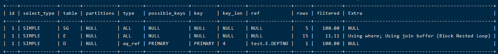
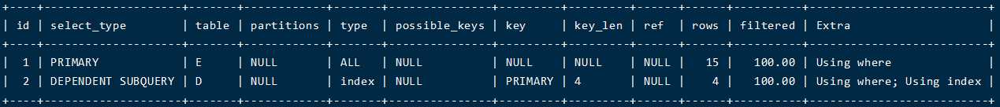
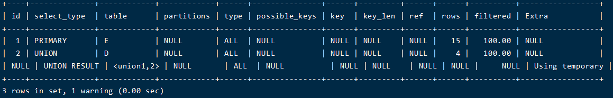
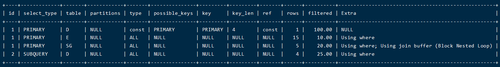
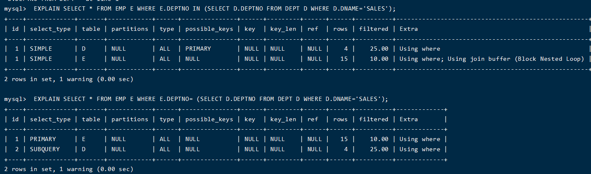
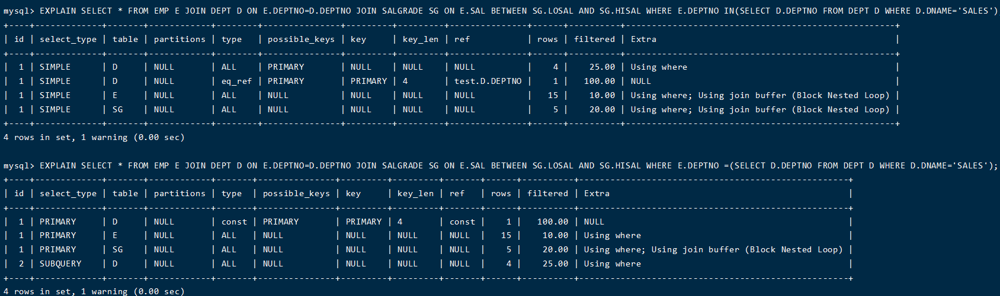

[Toc]

# MySQL执行计划

> [官网执行计划优化说明](https://dev.mysql.com/doc/refman/5.7/en/execution-plan-information.html)

## 作用范围

> 1. [`EXPLAIN`](https://dev.mysql.com/doc/refman/5.7/en/explain.html) works with [`SELECT`](https://dev.mysql.com/doc/refman/5.7/en/select.html), [`DELETE`](https://dev.mysql.com/doc/refman/5.7/en/delete.html), [`INSERT`](https://dev.mysql.com/doc/refman/5.7/en/insert.html), [`REPLACE`](https://dev.mysql.com/doc/refman/5.7/en/replace.html), and [`UPDATE`](https://dev.mysql.com/doc/refman/5.7/en/update.html) statements；
>
> 2. [`EXPLAIN`](https://dev.mysql.com/doc/refman/5.7/en/explain.html) can also be used to obtain information about the columns in a table. [`EXPLAIN *`tbl_name`*`](https://dev.mysql.com/doc/refman/5.7/en/explain.html) is synonymous with `DESCRIBE *`tbl_name`*` and `SHOW COLUMNS FROM *`tbl_name`*`.
>
>    ```
>    - 范例1：获取SELECT执行计划
>    
>    mysql> EXPLAIN SELECT * FROM EMP;
>    +----+-------------+-------+------------+------+---------------+------+---------+------+------+------
>    | id |select_type| table| partitions|type| possible_keys |key | key_len | ref | rows |filtered|Extra|
>    +----+-------------+-------+------------+------+---------------+------+---------+------+------+------
>    |  1 | SIMPLE    | EMP   | NULL   | ALL  | NULL | NULL | NULL    | NULL |   15 |   100.00 | NULL  |
>    +----+-------------+-------+------------+------+---------------+------+---------+------+------+------
>    1 row in set (0.03 sec)
>    
>    - 范例2：获取表列信息
>    mysql> EXPLAIN EMP;
>    +----------+-------------+------+-----+---------+-------+
>    | Field    | Type        | Null | Key | Default | Extra |
>    +----------+-------------+------+-----+---------+-------+
>    | EMPNO    | int(4)      | NO   | PRI | NULL    |       |
>    | ENAME    | varchar(10) | YES  | UNI | NULL    |       |
>    | JOB      | varchar(9)  | YES  |     | NULL    |       |
>    | MGR      | int(4)      | YES  |     | NULL    |       |
>    | HIREDATE | date        | YES  |     | NULL    |       |
>    | SAL      | double(7,2) | YES  |     | NULL    |       |
>    | COMM     | double(7,2) | YES  |     | NULL    |       |
>    | DEPTNO   | int(2)      | YES  |     | NULL    |       |
>    +----------+-------------+------+-----+---------+-------+
>    ```

## EXPLAIN 输出信息格式

> 1. 每一行都是一个表的执行信息，表信息显示的先后顺序为表在执行查询操作中扫描的顺序；
> 2. 执行计划输出的列说明：第一列为表查询一般字段名，第二列为当输出格式设置为 `FORMAT=JSON` 字段名，与第一列字段含义是相同的。
>
> | Column        | JSON Name     | Meaning                                        |
> | ------------- | ------------- | ---------------------------------------------- |
> | id            | select_id     | The SELECT identifier                          |
> | select_type   | None          | The SELECT type                                |
> | table         | table_name    | The table for the output row                   |
> | partitions    | partitions    | The matching partitions                        |
> | type          | access_type   | The join type                                  |
> | possible_keys | possible_keys | The possible indexes to choose                 |
> | key           | key           | The index actually chosen                      |
> | key_len       | key_length    | The length of the chosen key                   |
> | ref           | ref           | The columns compared to the index              |
> | rows          | rows          | Estimate of rows to be examined                |
> | filtered      | filtered      | Percentage of rows filtered by table condition |
> | Extra         | None          | Additional information                         |

### id(select_id)

> select 查询序号，包含一组数字，表示查询中执行select子句或者操作表的顺序
> The [`SELECT`](https://dev.mysql.com/doc/refman/8.0/en/select.html) identifier. This is the sequential number of the [`SELECT`](https://dev.mysql.com/doc/refman/8.0/en/select.html) within the query. The value can be `NULL` if the row refers to the union result of other rows. In this case, the `table` column shows a value like `<union*`M`*,*`N`*>` to indicate that the row refers to the union of the rows with `id` values of *`M`* and *`N`*.
>
> SELECT标识符，它是查询里的SELECT的顺序编号。如果行关联其他行结果时，id值可能为null。此时table字段显示的值为``<union*`M`*,*`N`*>` `,表示该行结果为id=m与id=n联合结果。

1. **id相同，那么执行顺序从上到下**

```
mysql> EXPLAIN SELECT * FROM EMP E JOIN DEPT D ON E.DEPTNO=D.DEPTNO JOIN SALGRADE SG  ON E.SAL BETWEEN SG.LOSAL AND SG.HISAL;
```



2. **id不同**，如果是子查询，id序号会递增，id值越大优先级越高，越先被执行

   ```
   EXPLAIN SELECT E.ENAME FROM EMP E WHERE E.DEPTNO=(SELECT D.DEPTNO FROM DEPT D WHERE COMM IS NOT NULL);
   ```

   

   ```
   mysql> EXPLAIN SELECT E.ENAME,E.DEPTNO FROM EMP E UNION SELECT D.DEPTNO,D.DNAME FROM DEPT D;
   ```

   

3. **id相同和不同的，同时存在**：相同的可以认为是一组，从上往下顺序执行，在所有组中，id值越大，优先级越高，越先执行

   ```
   mysql> EXPLAIN SELECT * FROM EMP E JOIN DEPT D ON E.DEPTNO=D.DEPTNO JOIN SALGRADE SG ON E.SAL BETWEEN SG.LOSAL AND SG.HISAL WHERE E.DEPTNO =(SELECT D.DEPTNO FROM DEPT D WHERE D.DNAME='SALES');
   ```

   

#### IN & = 执行计划区别





### select_type(JSON name: none)

| select_type Value    | JSON Name                  | Meaning                                                      |
| -------------------- | -------------------------- | ------------------------------------------------------------ |
| SIMPLE               | None                       | Simple SELECT (not using UNION or subqueries)                |
| PRIMARY              | None                       | Outermost SELECT                                             |
| UNION                | None                       | Second or later SELECT statement in a UNION                  |
| DEPENDENT UNION      | dependent (true)           | Second or later SELECT statement in a UNION, dependent on outer query |
| UNION RESULT         | union_result               | Result of a UNION.                                           |
| SUBQUERY             | None                       | First SELECT in subquery                                     |
| DEPENDENT SUBQUERY   | dependent (true)           | First SELECT in subquery, dependent on outer query           |
| DERIVED              | None                       | Derived table                                                |
| MATERIALIZED         | materialized_from_subquery | Materialized subquery                                        |
| UNCACHEABLE SUBQUERY | cacheable (false)          | A subquery for which the result cannot be cached and must be re-evaluated for each row of the outer query |
| UNCACHEABLE UNION    | cacheable (false)          | The second or later select in a UNION that belongs to an uncacheable subquery (see UNCACHEABLE SUBQUERY) |

(1) SIMPLE(简单SELECT，不使用UNION或子查询等)

(2) PRIMARY(子查询中最外层查询，查询中若包含任何复杂的子部分，最外层的select被标记为PRIMARY)

(3) UNION(UNION中的第二个或后面的SELECT语句)

(4) DEPENDENT UNION(UNION中的第二个或后面的SELECT语句，取决于外面的查询)

(5) UNION RESULT(UNION的结果，union语句中第二个select开始后面所有select)

(6) SUBQUERY(子查询中的第一个SELECT，结果不依赖于外部查询)

(7) DEPENDENT SUBQUERY(子查询中的第一个SELECT，依赖于外部查询)

(8) DERIVED(派生表的SELECT, FROM子句的子查询)

(9) UNCACHEABLE SUBQUERY(一个子查询的结果不能被缓存，必须重新评估外链接的第一行)

### `table` (JSON name: `table_name`)

> - The name of the table to which the row of output refers. This can also be one of the following values:
>   - `<union*`M`*,*`N`*>`: The row refers to the union of the rows with `id` values of *`M`* and *`N`*.
>   - `<derived*`N`*>`: The row refers to the derived table result for the row with an `id` value of *`N`*. A derived table may result, for example, from a subquery in the `FROM` clause.
>   - `<subquery*`N`*>`: The row refers to the result of a materialized subquery for the row with an `id` value of *`N`*. See [Section 8.2.2.2, “Optimizing Subqueries with Materialization”](https://dev.mysql.com/doc/refman/5.7/en/subquery-materialization.html).

### `type` (JSON name: `access_type`)

> 关联类型或者访问类型:对表访问方式，表示MySQL在表中找到所需行的方式
>
> **查询效率如下**：
>
> `system > const > eq_ref > ref > fulltext > ref_or_null > index_merge > unique_subquery > index_subquery > range > index > ALL`
>
> **常用的类型有**： **ALL、index、range、 ref、eq_ref、const、system、**NULL（从左到右，性能从差到好
>
> **ALL**：Full Table Scan， MySQL将遍历全表以找到匹配的行
>
> **index**: Full Index Scan，index与ALL区别为index类型只遍历索引树
>
> **range**:只检索给定范围的行，使用一个索引来选择行
>
> **ref**: 表示上述表的连接匹配条件，即哪些列或常量被用于查找索引列上的值
>
> **eq_ref**: 类似ref，区别就在使用的索引是唯一索引，对于每个索引键值，表中只有一条记录匹配，简单来说，就是多表连接中使用primary key或者 unique key作为关联条件
>
> **const、system**: 当MySQL对查询某部分进行优化，并转换为一个常量时，使用这些类型访问。如将主键置于where列表中，MySQL就能将该查询转换为一个常量，system是const类型的特例，当查询的表只有一行的情况下，使用system
>
> **NULL**: MySQL在优化过程中分解语句，执行时甚至不用访问表或索引，例如从一个索引列里选取最小值可以通过单独索引查找完成。

### `possible_keys` (JSON name: `possible_keys`)

> 显示可能应用在这张表中的索引，一个或多个。
> 查询涉及到的字段上若存在索引，则该索引将被列出，但不一定被查询实际使用

### `key` (JSON name: `key`)

> 实际使用的索引。如果为NULL，则没有使用索引
>
> 查询中若使用了覆盖索引，则该索引和查询的selet字段重叠，仅出现在key列表中。
> 覆盖索引：查询的字段与所建索引的字段个数和顺序刚好吻合

### `ref` (JSON name: `ref`)

> 列与索引的比较

### `rows` (JSON name: `rows`)

> 扫描出的行数(估算的行数)

### `filtered` (JSON name: `filtered`)

> 按表条件过滤的行百分比

### `Extra` (JSON name: none)

> 执行情况的描述和说明

# 索引

> 高效获取数据的排好序的数据结构

- **索引数据结构**
  1）HASH;
  2)  二叉树
  3）红黑树
  4）B+树

## 二叉树(Binary tree)

> - **特点**

# 参考资料

1. https://dev.mysql.com/doc/refman/5.7/en/using-explain.html
2. https://www.bilibili.com/video/BV1pq4y1d7a4?p=2&spm_id_from=pageDriver