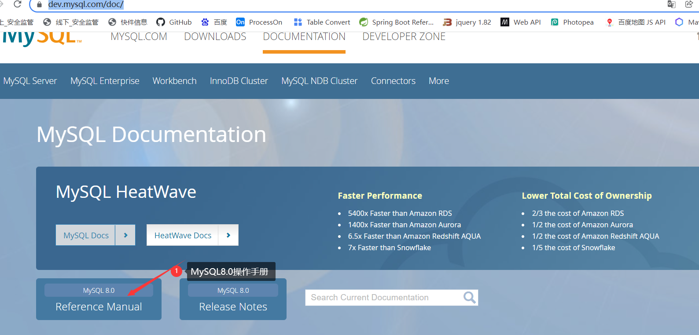
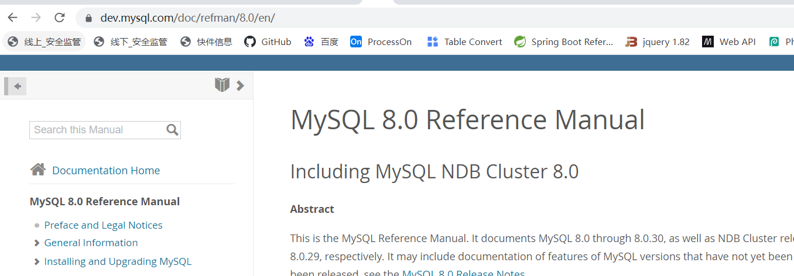
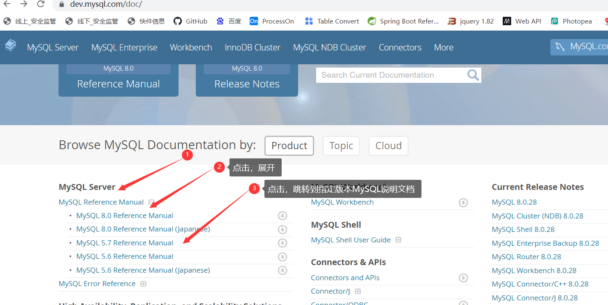
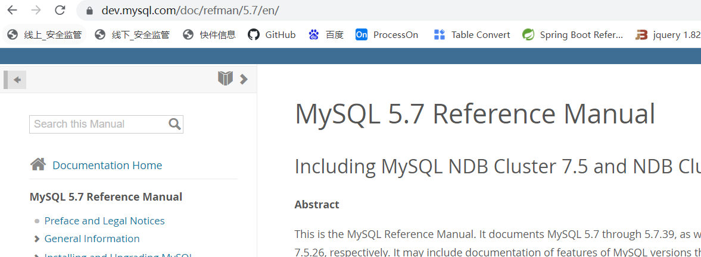
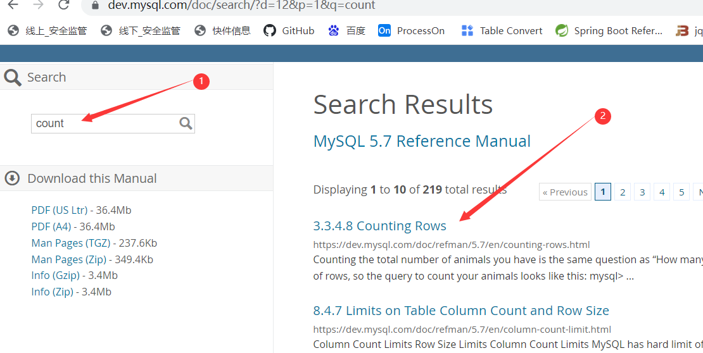
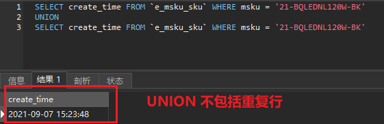
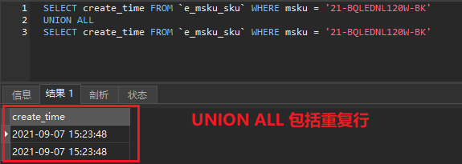
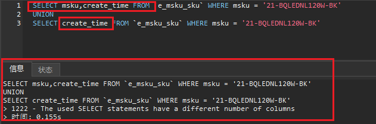
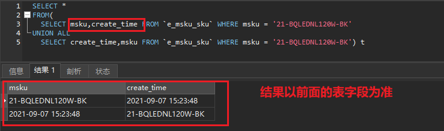
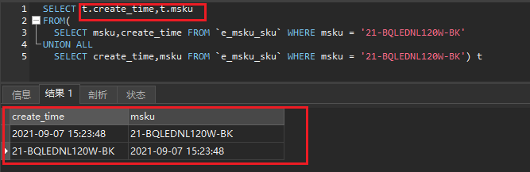

[Toc]

# MySQL说明文档使用

## 1. 定位到指定版本说明文档

[MySQL官方说明文档](https://dev.mysql.com/doc/)

1. 在官方文档首页，可以看到MySQL最新版本说明文档，直接点击，即可进入该版本的指导手册页面





2. **查看MySQL以前版本说明文档，在【说明文档】首页，【MySQL Server】下可以查看到提供的以前版本的MySQL**

   

   

## 2. 定向查找

> 当不熟悉文档目录时，在指定说明文档，搜索需要查看内容的关键字。指定查看内容比较有效率。
>
> 如果对文档比较熟，可以到对应目录下查看



# 查询某一指定字段值数量

> [`COUNT(expr) over_clause`](https://dev.mysql.com/doc/refman/8.0/en/aggregate-functions.html#function_count)
>
> Returns a count of the number of non-`NULL` values of *`expr`* in the rows retrieved by a [`SELECT`](https://dev.mysql.com/doc/refman/8.0/en/select.html) statement. The result is a [`BIGINT`](https://dev.mysql.com/doc/refman/8.0/en/integer-types.html) value.
>
> If there are no matching rows, [`COUNT()`](https://dev.mysql.com/doc/refman/8.0/en/aggregate-functions.html#function_count) returns `0`.
>
> 说明：count(表达式)，返回的是满足表达式条件非null 整数值记录数；当没有匹配的行时，返回0

```
### 场景描述：统计类型值为1，以及为0数据量；当没有该类型记录时，返回0
select 
    count(case when type=1 then type end) into_village_num, 
    count(case when type=0 then type end) not_into_village_num,
    express_nam express_name 
from t_village group by express_nam

执行结果：
into_village_num   not_into_village_num  express_name
226					0						百世
273					4						中通
246					2						圆通
215					0						申通
242					0						韵达
117					0						极兔

### 统计指定字段值的数量
select 
	sum(case when mrs.字段名='1' then 1 else 0 end) accomplish,
	sum(case when mrs.字段名='0' then 1 else 0 end) unfinished
from
	表名 mrs
```

# Insert语句中使用UUID

如果一个表中id字段使用uuid来作为主键，那我们可以使用下面的语句来插入数据：

```
INSERT INTO t_inventive_principle (`id`,`code_num`,`name`) VALUES (REPLACE(UUID(),"-",""),1,'分割原理');
```

# mysql AES加密的使用

- **加密**

```
INSERT INTO aes_demo (NAME, PASSWORD)
VALUES
    (
        'tom',
        HEX(AES_ENCRYPT('666', '1'))
    );
```

- **相应的解密查询如下**：

```
SELECT
    AES_DECRYPT((UNHEX(PASSWORD)), '1') AS PASSWORD
FROM
    aes_demo;
```

# 合并查询结果`UNION&UNION ALL`

## 区别

> 如果我们需要将两个 `select` 语句的结果作为一个整体显示出来，我们就需要用到 `union` 或者 `union all` 关键字。`union` (或称为联合)的作用是将多个结果合并在一起显示出来。
>
> `union` 和 `union all `的区别是，union 会自动压缩多个结果集合中的重复结果，而 union all 则将所有的结果全部显示出来，不管是不是重复。
>
> `union`：对两个结果集进行并集操作，不包括重复行，同时进行默认规则的排序；union 在进行表链接后会筛选掉重复的记录，所以在表链接后会对所产生的结果集进行排序运算，删除重复的记录再返回结果。实际大部分应用中是不会产生重复的记录，最常见的是过程表与历史表 union。
>
> 如下sql：
>
> ```
> SELECT create_time FROM `e_msku_sku` WHERE msku = '21-BQLEDNL120W-BK'
> UNION
> SELECT create_time FROM `e_msku_sku` WHERE msku = '21-BQLEDNL120W-BK'
> ```
>
> 
>
> 
>
> **`union all`**：对两个结果集进行并集操作，包括重复行，不进行排序； 如果返回的两个结果集中有重复的数据，那么返回的结果集就会包含重复的数据了。
>
> ```
> SELECT create_time FROM `e_msku_sku` WHERE msku = '21-BQLEDNL120W-BK'
> UNION ALL
> SELECT create_time FROM `e_msku_sku` WHERE msku = '21-BQLEDNL120W-BK'
> ```
>
> 

## 注意事项

> 1. **UNION 和 UNION ALL 内部的 SELECT 语句必须拥有相同数量的列**;
>    
>
> 2. **每条 SELECT 语句中列的顺序必须相同**
>
>    - 先来说下，如果顺序不同，会是什么结果？
>      答：结果字段的顺序以**union all** 前面的表字段顺序为准。
>      **union all** 后面的表的数据会按照顺序依次附在后面。**注意：按照字段顺序匹配，而不是按照字段名称匹配。**
>
>    - sql如下：顺序对结果的影响
>      综上：
>
>      **union all** 结果字段的顺序以 **union all** 前面的表字段顺序为准。**union all** 后面的表的数据会按照字段顺序依次附在后面，而不是按照字段名称匹配
>      我们上面以*来表示顺序的不同，其实你写成不同顺序的字段结果一致
>      

## union all 使用场景

> - sql 中的组合in，可用 union all 来代替，提高查询效率
>
> - **修改前：组合in sql**
>
>   ```
>   SELECT ***, ***, ***, ***, ***
>   FROM e_rating_info 
>   WHERE rating_quantity <> 0 AND (***, ***) 
>   IN (('***', '***'), ('***', '***'), 
>   ('***', '***'), ('***', '***'), 
>   ('***', '***'), ('***', '***'), 
>   ('***', '***'), ('***', '***'), 
>   ('***', '***'), ('***', '***')) 
>   ORDER BY *** DESC
>   ```
>
> - **修改后：UNION ALL sql**
>
>   ```
>   <select id="queryRatingInfo" resultType="***">
>           <foreach collection="ratingList" item="item" index="index" open="" separator="UNION ALL" close="">
>               SELECT ***, ***, ***, ***, ***
>               FROM e_rating_info
>               WHERE rating_quantity &lt;&gt; 0
>               AND country_code = #{item.***}
>               AND asin = #{item.***}
>           </foreach>
>           ORDER BY *** DESC;
>       </select>
>   ```

# 统计一列中不同值的数量方法

## 方案1

> 使用`where`条件限定查询

```
SELECT count(*)
FROM user_operation_log
WHERE origin = 'iPhone';
SELECT count(*)
FROM user_operation_log
WHERE origin = 'Android';
SELECT count(*)
FROM user_operation_log
WHERE origin = 'Web';
```

## 方案2

> **用 count 实现**统计 user_operation_log 有多少行：
>
> ```
> SELECT count(*) FROMuser_operation_log
> ```
>
> 统计 origin 这列值不为 NULL 的数量：
>
> ```
> SELECT count(origin) FROMuser_operation_log
> ```
>
> 使用`count`加字段条件限定时，where条件失效，使统计结果和预期有偏差

```
SELECT
 count(origin = 'iPhone' OR NULL) AS iPhone,
 count(origin = 'Android' OR NULL) AS Android,
 count(origin = 'Web' OR NULL)  AS Web
FROM user_operation_log;
```

## 方案3

```
SELECT
 sum(if(origin = 'iPhone', 1, 0)) AS iPhone,
 sum(if(origin = 'Android', 1, 0)) AS Android,
 sum(if(origin = 'Web', 1, 0))  AS Web
FROM user_operation_log;
```

## 方案4

```
SELECT
 sum(origin = 'iPhone') AS iPhone,
 sum(origin = 'Android') AS Android,
 sum(origin = 'Web')  AS Web
FROM user_operation_log;
```

## 方案5

```
SELECT origin,count(*) num FROM user_operation_log GROUP BY origin;
```

# 字符串模糊查询

mysql模糊查询用的是LIKE关键字。

LIKE是模式匹配运算符，用于指出一个字符串是否与指定的字符串相匹配。使用LIKE运算符的语法格式如下：

```sql
[NOT] LIKE '匹配字符串' [ ESCAPE ' <转换字符>']
```

其中，方括号中的内容是可选的。例如，如果LIKE关键字前面有个NOT 关键字，表示条件取反。ESCAPE子句用于指定转义字符。匹配字符串是一个完整的字符串，也可以包含通配符 % 、 _ 、[] 、[^] 这四种通配符的含义如下所示：

| 通配符 | 含义                               |
| ------ | ---------------------------------- |
| %      | 代表任意长度（可以为0）的字符串    |
| _      | 代表任意单个字符                   |
| []     | 指定范围或集合中的任意单个字符     |
| [^]    | 不在指定范围或集合中的任意单个字符 |

需求强调的是，带有通配符的字符串必须使用单引号引起来。下面是一些嗲有通配符的示例。

```sql
LIKE 'AB%'    返回以AB开始的任意字符串 
LIKE '%ABC'	  返回以ABC结束的任意字符串 
LIKE '%ABC%'  返回包含ABC的任意字符串 
LIKE '_AB'	  返回以AB结束的3个字符的字符串 
LIKE '[ACE]%'  返回以A,B,E开始的任意字符串 
LIKE 'L[^a]%'  返回以L开始、第2个字符不是a的任意字符串 
```

## 方式1

```
select * from sys_user where name like '%张%'
```

## 方式2

```
select * from sys_user where name like CONCAT('%','张','%')
```

## 方式3

```
SELECT * FROM sys_user  where INSTR(name,'张')>0
```

## INSTR函数

使用方式：INSTR(STR,SUBSTR)
STR：我们要进行判断的字段 （name）
SUBSTR：模糊匹配的字符
在字符串STR里面,字符串SUBSTR出现的第一个位置(INDEX)，INDEX是从1开始计算，如果没有找到就直接返回0，没有返回负数的情况

## LOCATE（'substr',str,pos）方法

> 解释：返回 [substr](https://so.csdn.net/so/search?q=substr&spm=1001.2101.3001.7020) 在 str 中第一次出现的位置，如果 substr 在 str 中不存在，返回值为 0 。如果pos存在，返回 substr 在 str 第pos个位置后第一次出现的位置，如果 substr 在 str 中不存在，返回值为0。

```
SELECT *
FROM ksh
WHERE LOCATE('11',name) > 0
```

## POSITION('substr' IN `field`)方法

> 和`locate()`方法的作用是一样。

```
SELECT *
FROM ksh
WHERE POSITION('11' IN name)
```

## FIND_IN_SET(str1,str2)

> 返回str2中str1所在的位置索引，其中str2必须以","分割开。

```
SELECT *
FROM ksh
WHERE FIND_IN_SET('11',`name`)
```


# 参考资料来源

1. https://www.cnblogs.com/silenceshining/p/14916119.html
2. https://blog.csdn.net/t194978/article/details/123490979
3. https://www.cnblogs.com/longkui-site/p/15858921.html