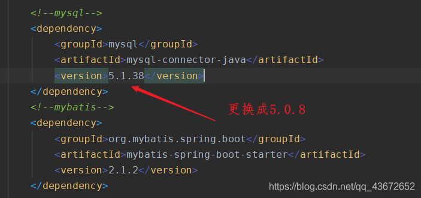

[Toc]

# 安装报错

- **报错原文**

  ```
  Public key for mysql-community-server-5.7.37-1.el7.x86_64.rpm is not installed
  Failing package is: mysql-community-server-5.7.37-1.el7.x86_64
  GPG Keys are configured as: file:///etc/pki/rpm-gpg/RPM-GPG-KEY-mysql
  
  
  Mysql安装失败
  操作系统：CentOS 7.6
  Mysql版本：mysql5.7
  CentOS7.6 安装mysql5.7的时候报错，提示某一个包安装不成功。
  ```

- **失败原因**
  GPG对于包的源key的验证没有通过

- **解决办法**
  在yum install 版本后面加上 --nogpgcheck，即可绕过GPG验证成功安装。比如`yum install mysql-community-server --nogpgcheck`
  


# 连接数据库问题

## 时区问题

- **场景描述**

  > 代码连接数据库时，报错信息显示为时区问题，报错信息如下：
  >
  > ```
  > java.sql.SQLException: The server time zone value 'EDT' is unrecognized or represents more than one time zone. You must configure either the server or JDBC driver (via the serverTimezone configuration property) to use a more specifc time zone value if you want to utilize time zone support.
  > ```

- **解决方案**

> 1）使用 server mysql start命令启动mysql
>
> （2）在mysql中执行show variables like '%time_zone%';
>
> 
>
> （3）输入select now();
>
> 
>
> （4）在终端执行date命令
>
> 
>
> 此时发现终端显示的时间和MySql中显示的时间不一致，这就是问题所在。
>
> （5）在mysql中执行 set time_zone=SYSTEM;
>
> 
>
> （6）再次在mysql中执行select now();
>
> 
>
> （6）执行 set global time_zone='+8:00';
>
> （7）执行 flush privileges;

## 建立连接报`SSL`连接错误

- **场景描述**

> 每次从数据库中进行查询或者其他操作控制台都会出现以下警告，虽说不是error，但是很显眼。。
>
> ```
> WARN: Establishing SSL connection without server's identity verification is not recommended. According to MySQL 5.5.45+, 5.6.26+ and 5.7.6+ requirements SSL connection must be established by default if explicit option isn't set. For compliance with existing applications not using SSL the verifyServerCertificate property is set to 'false'. You need either to explicitly disable SSL by setting useSSL=false, or set useSSL=true and provide truststore for server certificate verification.
> ```

- **解决方案**

**方案1**：在配置文件中的连接数据库的URL后面添加 `useSSL=false`

**方案2**：可能是连接数据库的驱动版本问题(5.1.38)，更换成其他版本即可。


# 导入数据保错

## Unknown collation: ‘utf8mb4_0900_ai_ci' 的解决方案

- **场景描述**

> 运行`.sql`文件导入数据结构&数据时，报如下错误信息
>
> ```
> Unknown collation: ‘utf8mb4_0900_ai_ci
> ```

- **原因**

> 将**MySQL8.0**生成的sql文件，导入**MySQL5.7**版本时，出现了版本不兼容问题

- **解决方案**

> 将MySQL8.0导出的sql文件中，所有的utf8mb4_0900_ai_ci替换为utf8_general_ci，(以及所有的utf8mb4替换为utf8   **可不修改**)

## MySQL server has gone away 

- **场景描述**

> 运行`.sql`文件导入数据结构&数据时，报如下错误信息
>
> ```
> MySQL server has gone away 
> ```

- **原因**

> 1. mysql连接超时;
>    即某个mysql长连接很久没有新的请求发起，达到了server端的timeout，被server强行关闭。
> 2. 查询的结果集超过 max_allowed_packet 

- **解决方案**

> 1. 查看mysql连接时长
>
> ```
> mysql> show global variables like '%timeout';
> +-----------------------------+----------+
> | Variable_name               | Value    |
> +-----------------------------+----------+
> | connect_timeout             | 10       |
> | delayed_insert_timeout      | 300      |
> | have_statement_timeout      | YES      |
> | innodb_flush_log_at_timeout | 1        |
> | innodb_lock_wait_timeout    | 50       |
> | innodb_rollback_on_timeout  | OFF      |
> | interactive_timeout         | 28800    |
> | lock_wait_timeout           | 31536000 |
> | net_read_timeout            | 30       |
> | net_write_timeout           | 60       |
> | rpl_stop_slave_timeout      | 31536000 |
> | slave_net_timeout           | 60       |
> | wait_timeout                | 28800    |
> +-----------------------------+----------+
> 13 rows in set (0.03 sec)
> ```
>
> wait_timeout 是28800秒，即mysql链接在无操作28800秒后被自动关闭。时间足够了，不是这个原因。
>
> 2. 查看文件是否过大，导致导入失败
>    用`select * into outfile `的方式导出到文件，查看文件大小是否超过 max_allowed_packet ，如果超过则需要调整参数，或者优化语句。
>
>  ```
> ### 查看最大容量限制
> mysql> show global variables like 'max_allowed_packet';
> +--------------------+---------+
> | Variable_name      | Value   |
> +--------------------+---------+
> | max_allowed_packet | 4194304 |
> +--------------------+---------+
> 1 row in set (0.02 sec)
> ### 若导入文件超过最大容量限制，则重新设置max_allowed_packet的值
> mysql> set global max_allowed_packet=1024*1024*16; //临时修改max_allowed_packet的值为16M
> 
> 若永久修改max_allowed_packet的值，需修改mysql配置文件，修改配置如下所示：
> max_allowed_packet = 4M
>  ```
>
> 

# 参考连接

1. https://blog.csdn.net/u014662563/article/details/61923884
2. https://blog.csdn.net/qq_43672652/article/details/107975780
3. https://blog.csdn.net/weixin_45953673/article/details/124873321