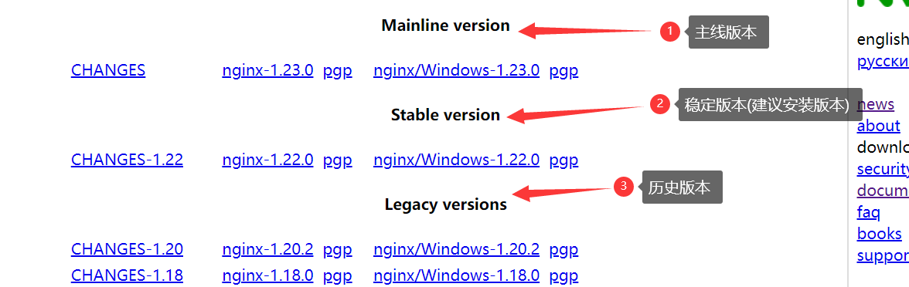

[Toc]

# 官网网址

- [英文官方](http://nginx.org/)
- [中文官方文档](https://www.nginx.cn/doc/)
- [官方下载网址](http://nginx.org/en/download.html)

# Linux安装

## 使用源码包安装

### 1.下载

> 选择对应的版本安装，推荐选择稳定版本



### 2. 解压

```
tar -zxvf nginx-1.16.1.tar.gz
```

# `root`&`alias`区别

```
alias与root的区别
location /app {
        root /var/www/html;
}
root 的路径为 /var/www/html/app

location /app {
   alias /var/www/html;
}

alias 的路径 /var/www/html
root 是全路径。拼接 location 和 root 设置的路径
alias 相当于重置路径，重置为 alias 设置的路径
```

