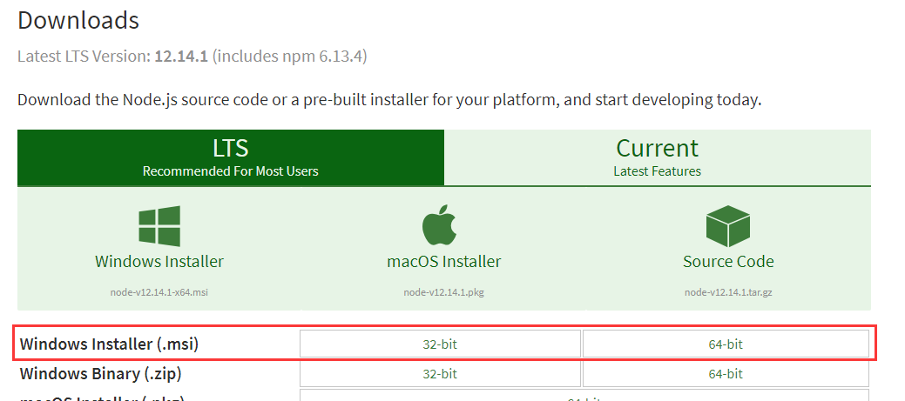

[Toc]

# 网址

[官网下载地址](https://nodejs.org/en/download/)

# 更新node版本

## window

1. cmd查看当前node版本和node安装位置

   ```
   node -v
   where node
   
   ### 版本
   Gallium  长期维护版本
   ```

2. windows系统没办法使用 n 来更新 nodejs 版本，要更新 nodejs 的话，重新下载 nodejs，覆盖安装即可.
   node 下载地址:https://nodejs.org/zh-cn/download/releases/
   
3. 安装 nodejs

   前往nodejs官网-》https://nodejs.org/en/download/

   下载适合自己的最新的安装包（.msi），直接双击安装即可

   

# Nodejs多版本管理安装

1.如果之前安装过nodejs，那么需要先进行现有环境的卸载，免安装版本的nodejs可以略过

2.卸载之后，检查C盘时候存在缓存文件

C:\Users\Administrator\AppData\Roaming\npm
C:\Users\Administrator\AppData\Roaming\npm-cache

如果没有安装过nodejs，那么直接开始安装nvm即可

