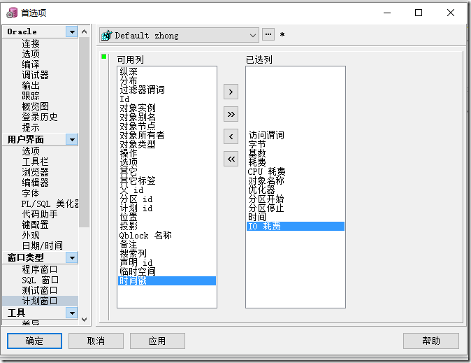

[Toc]

> Oracle版本：Release 11.2.0.1.0

# 索引

[官方文档索引说明](https://docs.oracle.com/cd/E05554_01/books/AnyTuning/AnyTuning_DBservers6.html)

## 组合索引索引执行情况

> **例如组合索引(a,b,c)**
>
> - 过滤条件为a=1 and b=2时，可以走组合索引过滤a和b;
>
> - 过滤条件为a=1时，可以走组合索引过滤a  ;
>
> - 过滤条件为b=2时，不可以走组合索引过滤（因为字段b不是先导列，组合索引过滤必须包含先导列)，当优化器为CBO时，会走索引，执行计划显示索引扫描方式为：INDEX SKIP SCAN；
>
> - 过滤条件为a<=1 and b<=2时，可以走组合索引过滤a<=1，但是不能过滤b<=2（范围过滤只能走先导列) ：INDEX RANGE SCAN；涉及in,between,等关键字构成的范围查询，只能走先导列。
>
> - 过滤条件为a<=1时，可以走组合索引过滤a<=1;
>
> - 过滤条件为b<=2时，不可以走组合索引过滤;
>
> - 其他不会走索引的情况:
>
>   ```
>   1）在索引列上使用函数。如SUBSTR,DECODE,INSTR等，对索引列进行运算.需要建立函数索引就可以解决了。 
>   2）新建的表还没来得及生成统计信息，分析一下就好了 
>   3）基于cost的成本分析，访问的表过小，使用全表扫描的消耗小于使用索引。 
>   4）使用<>、not in 、not exist，!=，对于这三种情况大多数情况下认为结果集很大，一般大于5%-15%就不走索引而走FTS（全表扫描）。 
>   5）单独的>、< ？？？此处存疑：实际操作：在优化器为CBO组合索引中，先导列可以走索引
>   6）like "%_" 百分号在前。 
>   7）单独引用复合索引里非第一位置的索引列。也就是说查询谓词并未使用组合索引的第一列，此处有一个INDEX SKIP SCAN概念
>   8）字符型字段为数字时在where条件里不添加引号。 
>   9）当变量采用的是times变量，而表的字段采用的是date变量时.或相反情况。 
>   10）索引失效，可以考虑重建索引，rebuild online。 
>   11）B-tree索引 is null不会走,is not null会走,位图索引 is null,is not null 都会走、联合索引 is not null 只要在建立的索引列（不分先后）都会走
>   12）在包含有null值的table列上建立索引，当时使用select count(*) from table时不会使用索引。
>   13）加上hint 还不走索引，那可能是因为你要走索引的这列是nullable，虽然这列没有空值。（将字段改为not null，就会走
>   ```


# 查看执行计划

> 六种执行计划
> （1）explain plan for
> （2）set autotrace on
> （3）statistics_level=all
> （4）dbms_xplan.display_cursor获取
> （5）事件10046 trace跟踪
> （6）awrsqrpt.sql
> (7) PL/SQL查看执行计划

## 1. explain plan for

```
### 解释执行计划
explain plan for select * from EMP t;
### 查看执行计划结果
SELECT * FROM TABLE(DBMS_XPLAN.display());

------------------------------------------------------------------------------------------
| Id  | Operation                    | Name      | Rows  | Bytes | Cost (%CPU)| Time     |
------------------------------------------------------------------------------------------
|   0 | SELECT STATEMENT             |           |    45 |  4590 |     6  (17)| 00:00:01 |
|   1 |  MERGE JOIN                  |           |    45 |  4590 |     6  (17)| 00:00:01 |
|   2 |   TABLE ACCESS BY INDEX ROWID| JOBS      |    19 |   627 |     2   (0)| 00:00:01 |
|   3 |    INDEX FULL SCAN           | JOB_ID_PK |    19 |       |     1   (0)| 00:00:01 |
|*  4 |   SORT JOIN                  |           |    45 |  3105 |     4  (25)| 00:00:01 |
|*  5 |    TABLE ACCESS FULL         | EMPLOYEES |    45 |  3105 |     3   (0)| 00:00:01 |
------------------------------------------------------------------------------------------

Predicate Information (identified by operation id):
---------------------------------------------------

   4 - access("EMPLOYEES"."JOB_ID"="JOBS"."JOB_ID")
       filter("EMPLOYEES"."JOB_ID"="JOBS"."JOB_ID")
   5 - filter("EMPLOYEES"."DEPARTMENT_ID"=50)
   
   
一、执行计划中字段说明
ID：一个序号，但不是执行的先后顺序，执行的先后顺序是根据缩进来判断，最右最上的原则。
Operation：当前操作的内容
Rows:当前操作的rows，oracle估计当前操作返回结果集，可理解当前操作可查询出多少行。
cost：oracle计算出来的一个数值，用于说sql执行的代价。
Time：oracle估算当前操作的时间
```

## 2. set autotrace on

```
SQL*PLUS命令PLSQL无法支持
```

## 7. PL/SQL查看执行计划

①：**配置执行计划需要显示的项**：

工具 —> 首选项 —>  窗口类型 —> 计划窗口 —> 根据需要配置要显示在执行计划中的列



- **执行计划的常用列字段解释**：
  基数（Rows）：Oracle估计的当前操作的返回结果集行数
  字节（Bytes）：执行该步骤后返回的字节数
  耗费（COST）、CPU耗费：Oracle估计的该步骤的执行成本，用于说明SQL执行的代价，理论上越小越好（该值可能与实际有出入）
  时间（Time）：Oracle估计的当前操作所需的时间

# 查看Oracle版本号

```
SQL> select * from v$version;
BANNER
--------------------------------------------------------------------------------
Oracle Database 11g Enterprise Edition Release 11.2.0.1.0 - 64bit Production
PL/SQL Release 11.2.0.1.0 - Production
CORE	11.2.0.1.0	Production
TNS for Linux: Version 11.2.0.1.0 - Production
NLSRTL Version 11.2.0.1.0 - Production
```


# 参考资料

1. https://www.cnblogs.com/lijiaman/p/11488979.html
2. https://blog.csdn.net/qq_40687433/article/details/114371175
3. https://www.cnblogs.com/lanqingzhou/p/8275308.html