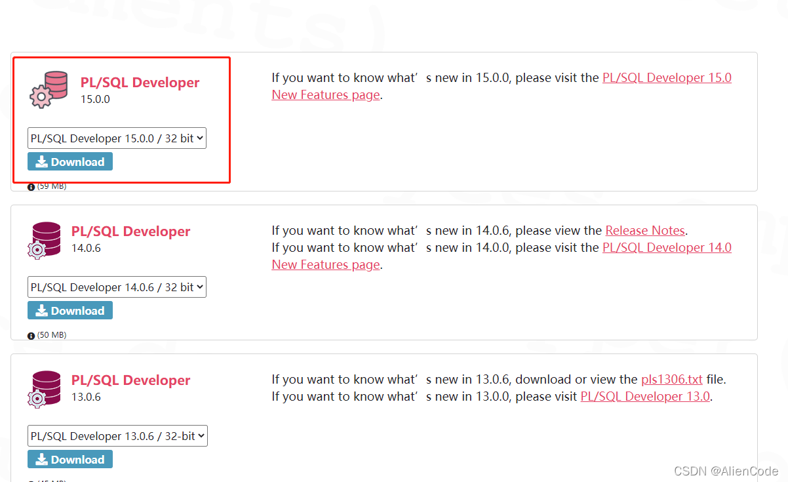
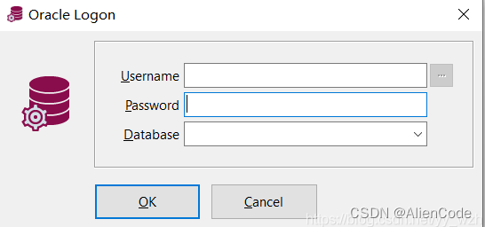
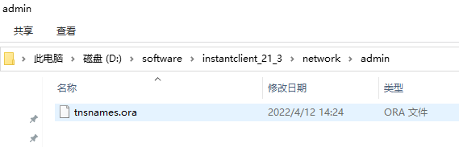
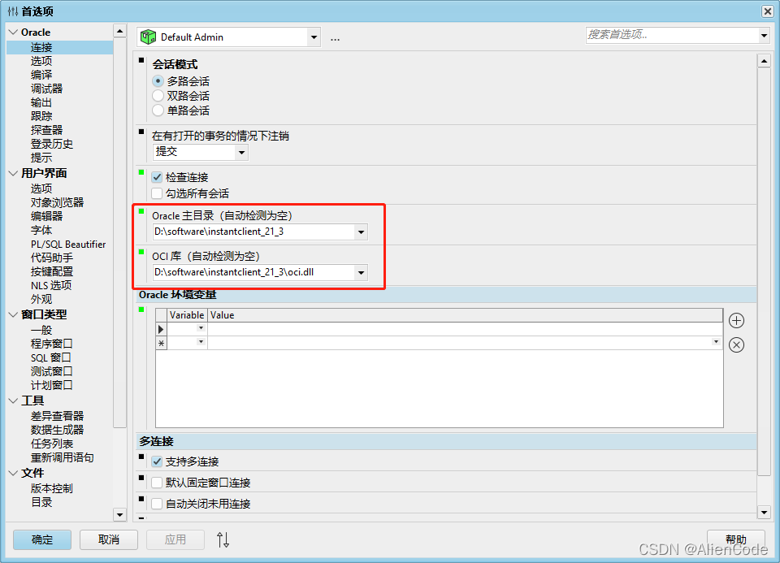
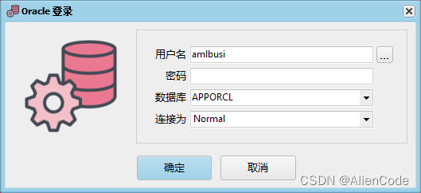
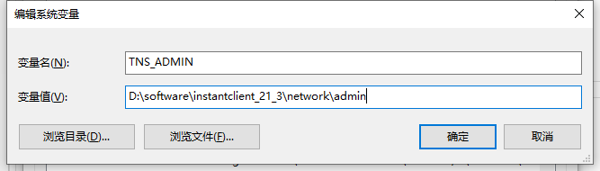
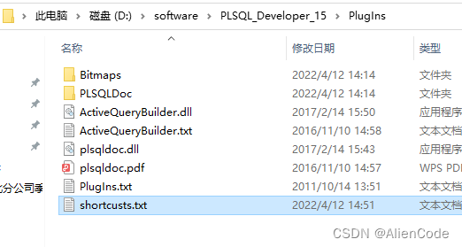

[Toc]

# 下载PL/SQL developer

下载安装地址: https://www.allroundautomations.com/registered-plsqldev/.

1. 自己选择合适版本。



2. 接下来默认安装即可
3. 本地连接直接输入



4. **远程连接需要安装Instant Client**

# 安装Instant Client (PLSQL Developer远程连接工具)

下载安装地址:https://www.oracle.com/database/technologies/instant-client/downloads.html

1. **下载解压**
2. 进入目录`network–>admin`，删除已有文件，创建`tnsnames.ora`



```
#写入tnsnames.ora文件更改ip地址和端口号
BRXT_XC_CS =
  (DESCRIPTION =
    (ADDRESS_LIST =
      (ADDRESS = (PROTOCOL = TCP)(HOST = 127.0.0.1)(PORT = 8080))
    )
    (CONNECT_DATA =
      (SERVICE_NAME = BRXT)
    )
  )
```


3. 进入PLSQL–>配置–>首选项–>连接，更改oracle主目录和oci库。



4. 保存配置后重启oracle，登陆界面会变化成下面，没有变化进行第五步



5. 配置环境变量
   

# PL/SQL试用版破解方法

**打开注册表，在其中删除**
1.HKEY_CURRENT_USER/Software/Allround Automations
2.HKEY_CURRENT_USER/Software/Microsoft/Security
这个方法相当于无限试用期，应该一直都可以使用

# PLSQL配置快捷键

1. 打开插件所在文件夹：D:softwarePLSQL_Developer_15PlugIns
2. 创建shortcusts.txt文本，任意命名



3. 写入以下快捷键，可自己设置

```
sf =select * from
sr = select t.* ,t.rowid from
w = where
sc=select count(1) from
```


4. 打开plsql进行设置

5. 打开PLSQL进行编辑
   输入`sf+空格`或者`tab`键


# 参考资料

1. https://blog.csdn.net/begefefsef/article/details/126773958