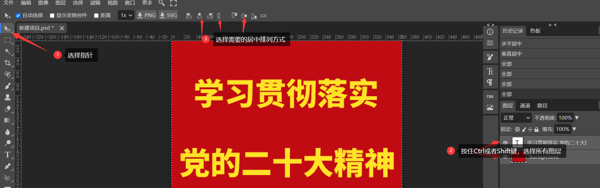

[Toc]

# 使文字在画布居中

- **场景描述**
  让输入的文字在画布居中

- **解决方案1**

> 

- **解决方案2**

# ps字体颜色渐变

### ps字体渐变色怎么弄?如何用ps设置字体渐变色?_溜溜自学网

ps字体渐变色的设置方法如下:首先选中文字图层,然后点击菜单栏上的图层→图层样式→渐变叠加,接着在弹出的对话框中设置一下就行了。 ps字体渐变色。

### photoshop中渐变工具怎样设置渐变颜色

渐变颜色的设置就是PS工具条下方的两个方框:"前景色"和"背景色". 在PHOTOSHOP制作中设定渐变工具的多个渐变颜色的方法是:1、新建白色背景文件,点击。

### ps文字颜色渐变怎么做?如何在ps中制作颜色渐变?_溜溜自学网

ps文字颜色渐变的制作方法如下:1、首先在左侧工具栏中选择“魔棒工具”,然后按住shift键选中需要做渐变效果的文字。2、接着在左侧工具栏中选择“渐。

### PS上怎么把填充的颜色变成渐变色啊

可以利用ps里面的渐变工具,选好你需要的颜色。拖拽就可以实现渐变色。 在Photoshop中填充颜色的快捷键是Ctrl+deL或者ALT+deL,想把填充色改成渐变色。

### ps文字渐变色填充方法?

\1. 首先打开ps软件,然后选择文件-新建; 2. 这时候我们需要新建可以一个画布,大小和颜色可以随意设置, 3. 给建立好的画布填充黑色,我们需要在填充背景色里面选。

### ps字体设置完颜色渐变没有变化?

首先要知道是不是字体处于独立的图层,如果是独立的图层的话点击左边选择字体图标,然后再点击你要修改的文字就可以改了。 如果字体和图片处于同一个图层,那先。

### ps中字体怎么制作灰白渐变渐变?

ps可以将文字变成有渐变色,具体操作如下:使用工具:Photoshop cs 操作步骤:1、进入PS,按Ctrl+N新建文档,点击工具箱中的T文字工具。 2、选择合适的字体字型...

### Ps字体怎么渐变模糊?

第一步:在ps中打开一张需要制作模糊效果的文字图片。 第二步:在菜单栏“图层”中选择“栅格化--文字”选项。 第三步:文字和图片分成两个图层。 第四步:在菜。

### ps如何改变字体颜色__好二三四_好生活好二三四

ps如何改变首先在ps中找到【文字工具】,在空白处点击,输入文字后全选,点击【颜色色块】,选择颜色后点击【确定】即可;也可以在全选文字后...[全文]办法bai一。

### 2020ps怎样给文字填充渐变颜色?

方法/步骤 1.打开ps软件 2.ctrl+n新建一个宽高均为800px的大小,点击确定。 3.ctrl+shift+alt+n快速新建一个图层,并在工具栏中找到文字工具。 4.在画布上写几。

# ps如何将抠的图片变小

- 1 打开ps，导入素材。

  

- 2 点击左侧工具栏的快速选择工具。

  

- 3 抠选区域，抠图完成后，ctrl+J复制一层选区。

  

- 4 点击背景图层的眼睛图标将其隐藏。

  

- 5

  使用快捷键Ctrl+T开启自由变换工具，拖动边框线即可放大或缩小

  

# 参考资料

1. http://www.ziku8.cn/wiki/?s=ps%E5%AD%97%E4%BD%93%E9%A2%9C%E8%89%B2%E6%B8%90%E5%8F%98
2. https://jingyan.baidu.com/article/c275f6ba3eda50a23d7567ed.html

