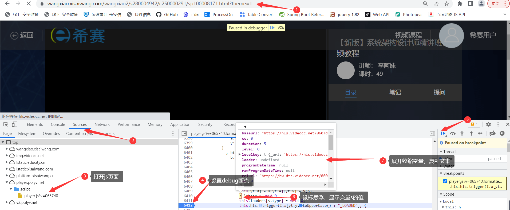
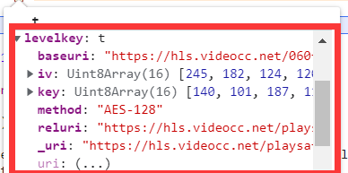
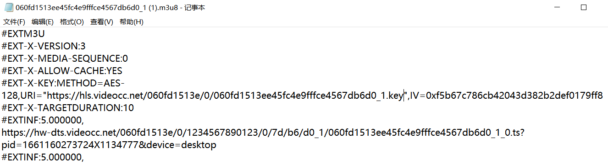
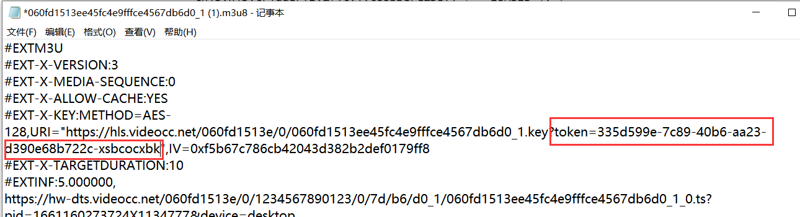
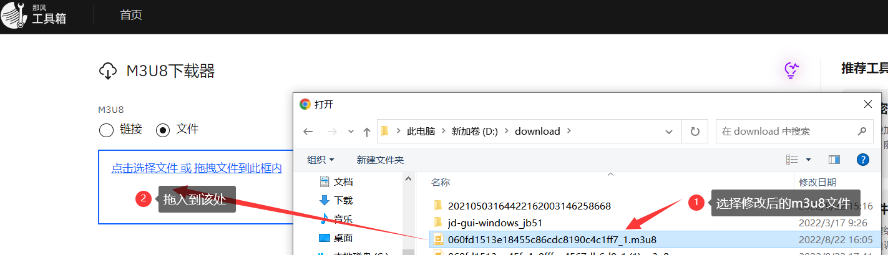
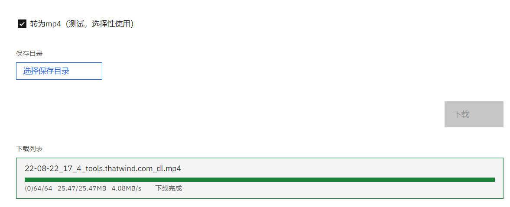

[Toc]

## 视频下载

> 网站视频为加密视频，以下为个人整理将课程保存为`.mp4`步骤，仅供参考。

1. **如下所示操作**

   

   



```
1. 打开视频所在网页，开启开发者模式；
2. 找到视频播放插件js，希赛使用的是保利威视频播放插件，网址：player.polyv.net ；文档：https://dev.polyv.net/page/2/?s=+polyvPlayer
3. 打开视频播放插件player.js,使用关键字bt = { 搜索，定位到以下代码；
, bt = {
                b: function(t, e, i) {
                    var n = t.data
                      , r = new R(this)
                      , a = At.util.b(r.a())
                      , o = V(t.data);
                    n = new At.m.c(a,M).d(o).slice(0, 16);
                    var s = i.frag;
                    this[yt.d] = s[yt.a][yt.y] = V(n),
                    s.loader = void 0,
                    this.loaders[s.type] = void 0,
                    this.hls.trigger(I.a[yt.y.toUpperCase() + "_LOADED"], {
                        frag: s
                    })
                }

4. 在图示所在打个断点，然后使用浏览器的脚本的debug模式，刷新下视频网页，网页加载脚本，运行到断点处停止后，使用鼠标显示变量s的值，展开levelkey的值，复制该变量值，如下
levelkey: t
baseuri: "https://hls.videocc.net/060fd1513e/0/060fd1513ee45fc4e9fffce4567db6d0_1.m3u8?pid=1661160273724X1134777&device=desktop"
iv: Uint8Array(16) [245, 182, 124, 120, 108, 180, 32, 67, 211, 130, 178, 222, 240, 23, 159, 248, buffer: ArrayBuffer(16), byteLength: 16, byteOffset: 0, length: 16, Symbol(Symbol.toStringTag): 'Uint8Array']
key: Uint8Array(16) [140, 101, 187, 111, 68, 162, 93, 81, 9, 171, 130, 55, 37, 75, 4, 71, buffer: ArrayBuffer(16), byteLength: 16, byteOffset: 0, length: 16, Symbol(Symbol.toStringTag): 'Uint8Array']
method: "AES-128"
reluri: "https://hls.videocc.net/playsafe/060fd1513e/0/060fd1513ee45fc4e9fffce4567db6d0_1.key?token=335d599e-7c89-40b6-aa23-d390e68b722c-xsbcocxbk"
_uri: "https://hls.videocc.net/playsafe/060fd1513e/0/060fd1513ee45fc4e9fffce4567db6d0_1.key?token=335d599e-7c89-40b6-aa23-d390e68b722c-xsbcocxbk"


由上可以得到：
m3u8地址：https://hls.videocc.net/060fd1513e/0/060fd1513ee45fc4e9fffce4567db6d0_1.m3u8?pid=1661160273724X1134777&device=desktop
token: 335d599e-7c89-40b6-aa23-d390e68b722c-xsbcocxbk
```

- 当再次访问网站时，使用debug模式，会自动定位到如下代码，定位`t`变量的值，获取到token值


2. **下载视频`.m3u8`文件**

> 使用上步骤得到的`.m3u8`地址：`https://hls.videocc.net/060fd1513e/0/060fd1513ee45fc4e9fffce4567db6d0_1.m3u8?pid=1661160273724X1134777&device=desktop`,用浏览器打开，下载得到一个`.m3u8`文件

3. **使用记事本编辑下载的`.m3u8`文件**

> - **原文件设置**
>
> 
>
> - **修改文件设置**:添加视频`token`值，从步骤【1】中获取的token值
>
> 

4. **下载视频为`.mp4`格式**

> 打开线下下载网址，[[M3U8下载器 - 那风工具箱](https://tools.thatwind.com/tool/m3u8downloader),将修改后的`.m3u8`文件拖入文件框内；选择保存目录，点击下载后即可
> 
>
> 

> **备注**：网站的`token`值是不断变化的，当`token`失效，可能会导致下载失败，所以需要在token值改变前下载完成
> [m3u8 视频在线提取工具](https://blog.luckly-mjw.cn/tool-show/m3u8-downloader/index.html)

## 参考资料来源

1. https://blog.csdn.net/joeson7456/article/details/125821394
2. https://zhuanlan.zhihu.com/p/348586073
3. [m3u8 视频在线提取工具](https://blog.luckly-mjw.cn/tool-show/m3u8-downloader/index.html)