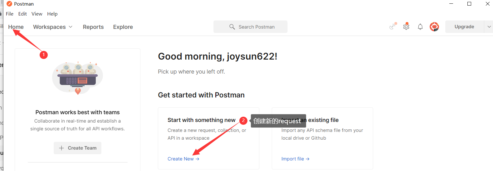
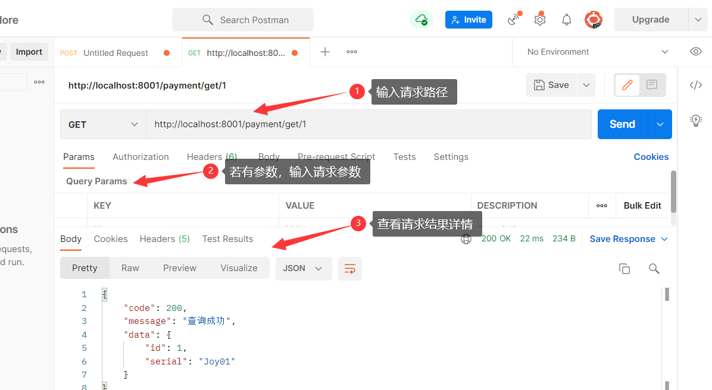
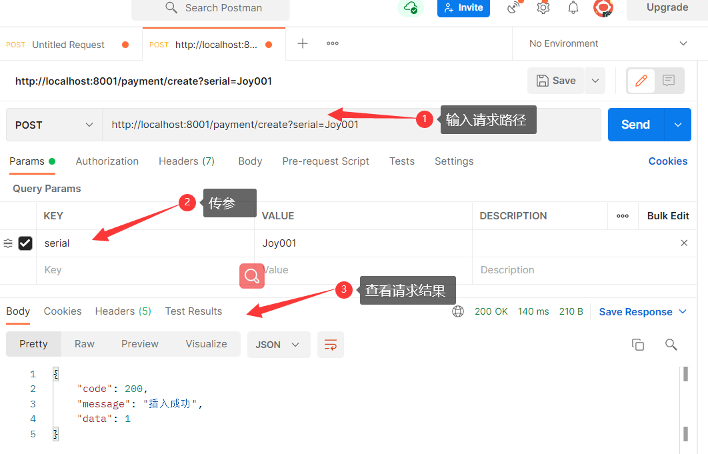
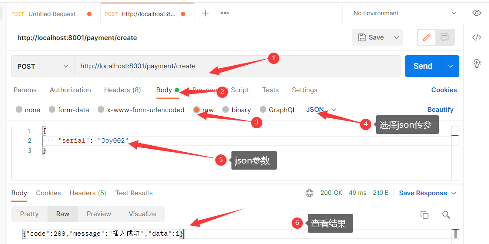

[Toc]

## 官网

[Postman官网](https://www.postman.com/)

## 简介

> **Postman**是一款强大网页调试工具的客户端，可以说是Chrome插件类产品中的代表产品之一。Postman适用于不同的操作系统，为用户提供强大的 Web API & HTTP 请求调试功能，不仅可以调试简单的css、html、脚本等简单的网页基本信息，还可以发送几乎所有类型的HTTP请求(GET, HEAD, POST, PUT..)，附带任何数量的参数+ headers，是一款非常实用的调试工具。

## 使用

> 从官网上下载Postman后，安装，进入，若有账号则直接登陆，没有就注册后再登陆。

### 1. 进入创建请求界面

### 2. Get请求

### 3. Post请求

- **在请求上直接连接参数传参**

- **使用JSON传参**

- 

  