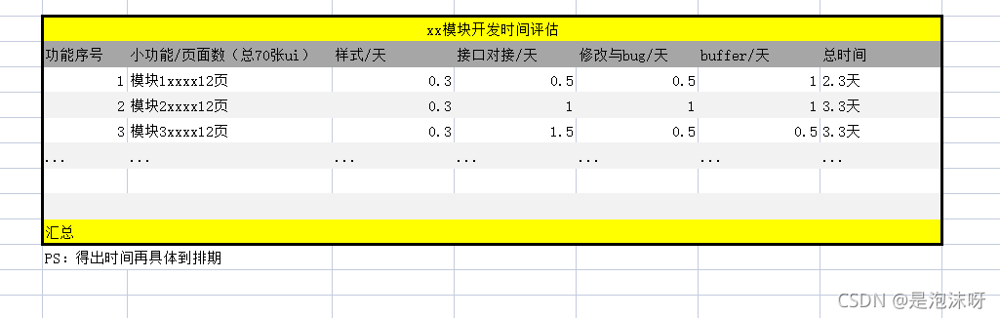

[Toc]

# 1.确定需求

​        当拿到ui图（这里打个比喻70张），先跟产品沟通这个沟通最好细化到每一张ui图你的理解与产品经理的理解一致，如：a按钮在几种状态下点击有几种效果，说清楚。（这个事情尽量提前做，不然到开发时发现，可能会晚了...）

## 2.站在个人开发某个功能/模块去评估

## 2.1 html+css（写样式）

​                一般写样式的时间要考虑：1是后端接口没开发出来时先写假数据，2是接口对接后一些交互功能样式变动。

##  2.2 接口对接时间

​          这个主要是调用接口，写判断，处理数据后渲染页面，这里的时间评估尽量包含一点后端的时间，难免搭档遇到bug，那么这个接口就要等了（这时可以去完善一些小功能，写css呀，写注释呀等等）。

## 2.3 修改与bug的时间

​        个人认为考虑这个时间，如果客户有些微小需求变更，可以把时间算上。测试工程师测出或者自己碰到bug短时间难解决也要考虑进来。

## 2.4 buffer（缓冲时间）

​        考虑一些突发情况，如请假，大功能需求变更，或领导需要压缩时间等等

# 参考资料

1. https://blog.csdn.net/qq_51657072/article/details/120855833