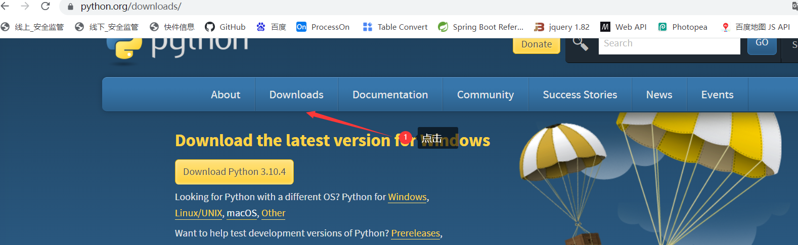
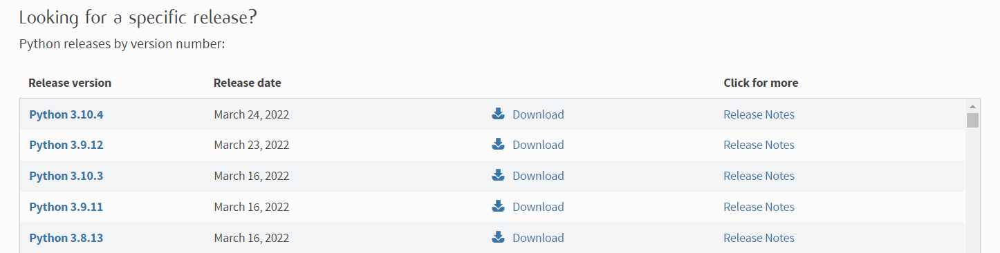
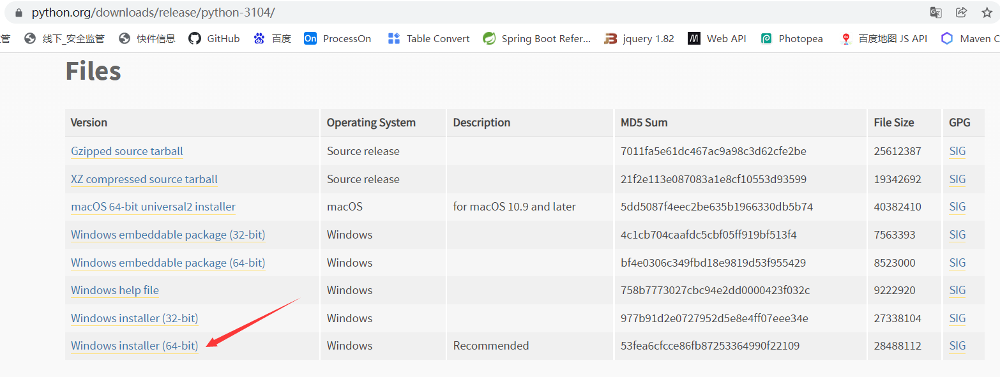
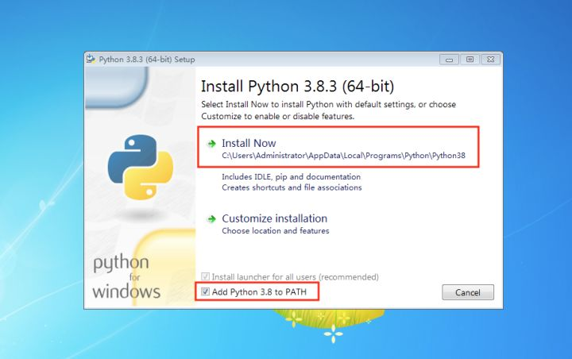
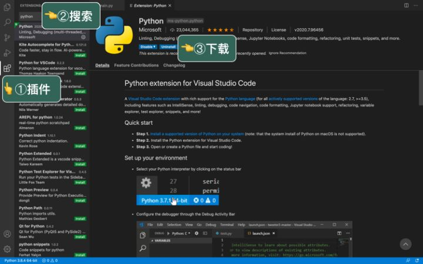
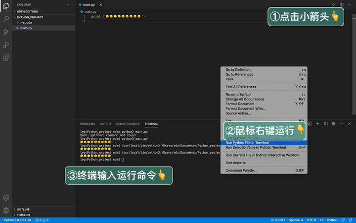

[Toc]

# 官网

1. [python官网](https://www.python.org/)
2. [VS CODE官网](https://code.visualstudio.com)

# 安装&配置

## 安装Python&配置

### 1. 下载&安装

-  **在官网下载页面选择需要安装的版本**





- **选中需要对应平台需要的安装文件进行下载：如本机选择的是安装版本**
- 
- **安装Python**
  - 选择自定义安装：可以自己定义安装目录
  - 选中`Add Python 3.8 to PATH`会在安装时自动将安装目录配置到环境变量`PATH`,不再需要手动配置环境变量
  - 后续步骤按照需求自主选择需要安装的插件或者库。



- **验证是否安装成功**

> 在`PowerShell`或者`CMD`里输入`python`,若出现Python版本信息，则表示安装成功
>
> ```
> C:\Users\12613>python
> Python 3.10.4 (tags/v3.10.4:9d38120, Mar 23 2022, 23:13:41) [MSC v.1929 64 bit (AMD64)] on win32
> Type "help", "copyright", "credits" or "license" for more information.
> >>> quit() //退出python操作环境，也可以使用 exit()
> ```

## 安装VSCODE&配置

- **下载&安装VS CODE**

> 从[VS CODE官网](https://code.visualstudio.com)下载对应版本的VS CODE，安装后打开即可


## 在VS CODE安装相关Python插件

### 1. 安装`Python`插件

> `python`插件作用：代码提示以及调试。安装完这个插件，当你打开 .py 格式文件时，VScode 会自动帮你选择 Python 解释器，表明 VScode 已正确识别出当前是 Python 文件。
> VS CODE插件安装：若是联网状态，直接在VS插件市场搜索即可



### 2. Pyright

> `Pyright` :主要提供 Python 的数据类型检查，熟悉 Python 后，能帮你提前发现代码错误。  


## 测试python

### 1. 新建Python文件

> 在工作区文件夹下新建`.py`结尾的文件，输入：

```
print ('hello world')
```

### 2. 运行

- **运行python文件方式有以下三种**：

> - 点击右上角小绿按钮
> - 鼠标右键>在 Python 终端中运行 Python 文件, 
> - Terminal 输入：python3 main.py



# 基础知识

# 应用

## Python MySQL

- **mysql-connector 驱动**

> 使用 **mysql-connector** 来连接使用 MySQL， **mysql-connector** 是 **MySQL** 官方提供的驱动器

### 1. 安装`mysql-connector`

1. 使用 **pip** 命令来安装 **mysql-connector**

  ```
python -m pip install mysql-connector
  ```

2. 测试 mysql-connector 是否安装成功

```
import mysql.connector
```

执行以上代码，如果没有产生错误，表明安装成功。

### 2. 连接mysql

```
import mysql.connector;

mydb = mysql.connector.connect(
  host="192.168.183.152",       # 数据库主机地址
  port="3306", #端口
  user="root",    # 数据库用户名
  passwd="Joy.123com",   # 数据库密码
  database="test" #数据库,可选，可省略
)

mycursor = mydb.cursor()
mycursor.execute("SHOW DATABASES") #执行数据库语句
for x in mycursor:  #打印执行结果
  print(x)
```

# Python库

## Requests

### 安装`Requests`

- 使用`pip`安装

```
pip install requests
```

- 安装执行结果

```
PS D:\huadi_workspace\tjyz_workspace\old_tjyz_project\tjyz> pip install requests
Collecting requests
  Downloading requests-2.27.1-py2.py3-none-any.whl (63 kB)
     ---------------------------------------- 63.1/63.1 KB 154.2 kB/s eta 0:00:00
Collecting charset-normalizer~=2.0.0
  Downloading charset_normalizer-2.0.12-py3-none-any.whl (39 kB)
Collecting urllib3<1.27,>=1.21.1
  Downloading urllib3-1.26.9-py2.py3-none-any.whl (138 kB)
     ---------------------------------------- 139.0/139.0 KB 37.5 kB/s eta 0:00:00
Collecting idna<4,>=2.5
```

### 获取网页

```
import requests

# get请求
r = requests.get('https://api.github.com/events') //get请求
#post请求
r = requests.post('https://httpbin.org/post', data={'key': 'value'}) 
# 其他请求类型
r = requests.put('https://httpbin.org/put', data={'key': 'value'})
r = requests.delete('https://httpbin.org/delete')
r = requests.head('https://httpbin.org/get')
r = requests.options('https://httpbin.org/get')
```

### 解析URL参数

```
import requests
# 传递参数
payload = {'key1': 'value1', 'key2': 'value2'}
r = requests.get('https://httpbin.org/get', params=payload)
# 打印请求url
print(r.url)
https://httpbin.org/get?key2=value2&key1=value1
```

### 获取服务响应内容

```
import requests

r = requests.get('https://api.github.com/events')
# 获取服务响应内容
r.text

'[{"repository":{"open_issues":0,"url":"https://github.com/...
# 获取响应状态码
r.status_code
200
# 获取响应头信息
r.headers

{
    'content-encoding': 'gzip',
    'transfer-encoding': 'chunked',
    'connection': 'close',
    'server': 'nginx/1.0.4',
    'x-runtime': '148ms',
    'etag': '"e1ca502697e5c9317743dc078f67693f"',
    'content-type': 'application/json'
}
# 获取指定响应头信息
r.headers['Content-Type']
'application/json'

# 如果响应头包含cookies，获取cookies
url = 'http://example.com/some/cookie/setting/url'
r = requests.get(url)

r.cookies['example_cookie_name']
'example_cookie_value'
```

### 响应编码设置

> 当未设置请求编码时，会自动转码

```
r.encoding  #获取当前响应请求编码
r.encoding = 'ISO-8859-1'  #设置响应内容编码
```

### 获取二进制响应内容

```
r.content
# 响应结果
b'[{"repository":{"open_issues":0,"url":"https://github.com/...
```

### 获取JSON响应内容

```
import requests

r = requests.get('https://api.github.com/events')
r.json()
# 响应结果
[{'repository': {'open_issues': 0, 'url': 'https://github.com/...
```

### 使用POST上传文件

```
url = 'https://httpbin.org/post'
files = {'file': open('report.xls', 'rb')}

r = requests.post(url, files=files)
r.text

# 响应结果
{
  ...
  "files": {
    "file": "<censored...binary...data>"
  },
  ...
}
```


## Beautiful Soup

> [Beautiful Soup](http://www.crummy.com/software/BeautifulSoup/) 是一个可以从HTML或XML文件中提取数据的Python库.它能够通过你喜欢的转换器实现惯用的文档导航,查找,修改文档的方式。BeautifulSoup对象表示的是一个文档的全部内容.大部分时候,可以把它当作 `Tag` 对象,它支持 [遍历文档树](https://beautifulsoup.readthedocs.io/zh_CN/v4.4.0/#id18) 和 [搜索文档树](https://beautifulsoup.readthedocs.io/zh_CN/v4.4.0/#id27) 中描述的大部分的方法.

### 安装 Beautiful Soup

1. 通过 `easy_install` 或 `pip` 来安装.包的名字是 `beautifulsoup4` ,这个包兼容Python2和Python3.

```
$ easy_install beautifulsoup4

$ pip install beautifulsoup4
```

2. **源码包安装**：[下载BS4的源码](http://www.crummy.com/software/BeautifulSoup/download/4.x/) ,然后通过setup.py来安装

```
$ Python setup.py install
```

3. 如果上述安装方法都行不通,Beautiful Soup的发布协议允许你将BS4的代码打包在你的项目中,这样无须安装即可使用.

### 安装解析器

>  Beautiful Soup支持Python标准库中的HTML解析器,还支持一些第三方的解析器.
>
> 1.  [lxml](http://lxml.de/) 
> 2.  [html5lib](http://code.google.com/p/html5lib/)
>
> 

1.  **[lxml](http://lxml.de/)**

> 根据操作系统不同,可以选择下列方法来安装lxml

```
$ apt-get install Python-lxml
$ easy_install lxml
$ pip install lxml
```

2. **[html5lib](http://code.google.com/p/html5lib/)**

> 另一个可供选择的解析器是纯Python实现的 [html5lib](http://code.google.com/p/html5lib/) , html5lib的解析方式与浏览器相同,可以选择下列方法来安装html5lib:

```
$ apt-get install Python-html5lib
$ easy_install html5lib
$ pip install html5lib
```

下表列出了主要的解析器,以及它们的优缺点:

| 解析器           | 使用方法                                                     | 优势                                                  | 劣势                                            |
| ---------------- | ------------------------------------------------------------ | ----------------------------------------------------- | ----------------------------------------------- |
| Python标准库     | `BeautifulSoup(markup, "html.parser")`                       | Python的内置标准库执行速度适中文档容错能力强          | Python 2.7.3 or 3.2.2)前 的版本中文档容错能力差 |
| lxml HTML 解析器 | `BeautifulSoup(markup, "lxml")`                              | 速度快文档容错能力强                                  | 需要安装C语言库                                 |
| lxml XML 解析器  | `BeautifulSoup(markup, ["lxml-xml"])``BeautifulSoup(markup, "xml")` | 速度快唯一支持XML的解析器                             | 需要安装C语言库                                 |
| html5lib         | `BeautifulSoup(markup, "html5lib")`                          | 最好的容错性以浏览器的方式解析文档生成HTML5格式的文档 | 速度慢不依赖外部扩展                            |

> 推荐使用lxml作为解析器,因为效率更高. 在Python2.7.3之前的版本和Python3中3.2.2之前的版本,必须安装lxml或html5lib, 因为那些Python版本的标准库中内置的HTML解析方法不够稳定.
>
> 提示: 如果一段HTML或XML文档格式不正确的话,那么在不同的解析器中返回的结果可能是不一样的,查看 [解析器之间的区别](https://beautifulsoup.readthedocs.io/zh_CN/v4.4.0/#id53) 了解更多细节

### 使用方法

> 将一段文档传入BeautifulSoup 的构造方法,就能得到一个文档的对象, 可以传入一段字符串或一个文件句柄.

```
from bs4 import BeautifulSoup

soup = BeautifulSoup(open("index.html"))
soup = BeautifulSoup("<html>data</html>")
# html.parser 解析器解析文本内容 res.text
soup=BeautifulSoup(res.text, 'html.parser') 
```

## 遍历文档树

```
from bs4 import BeautifulSoup
soup = BeautifulSoup(html_doc, 'html.parser')

# 子节点
## 获取指定标签&内容
soup.head
# <head><title>The Dormouse's story</title></head>

soup.title
# <title>The Dormouse's story</title>
soup.body.b
# <b>The Dormouse's story</b>

# 点取属性的方式只能获得当前名字的第一个tag
soup.a
# <a class="sister" href="http://example.com/elsie" id="link1">Elsie</a>

# 获取所有指定标签
soup.find_all('a')
# [<a class="sister" href="http://example.com/elsie" id="link1">Elsie</a>,
#  <a class="sister" href="http://example.com/lacie" id="link2">Lacie</a>,
#  <a class="sister" href="http://example.com/tillie" id="link3">Tillie</a>]
```


# 参考资料

1. https://www.zhihu.com/question/288501327/answer/1386391470
2. https://baijiahao.baidu.com/s?id=1726328731137649721&wfr=spider&for=pc
3. https://docs.python-requests.org/en/latest/user/quickstart/
4. https://beautifulsoup.readthedocs.io/zh_CN/v4.4.0/#